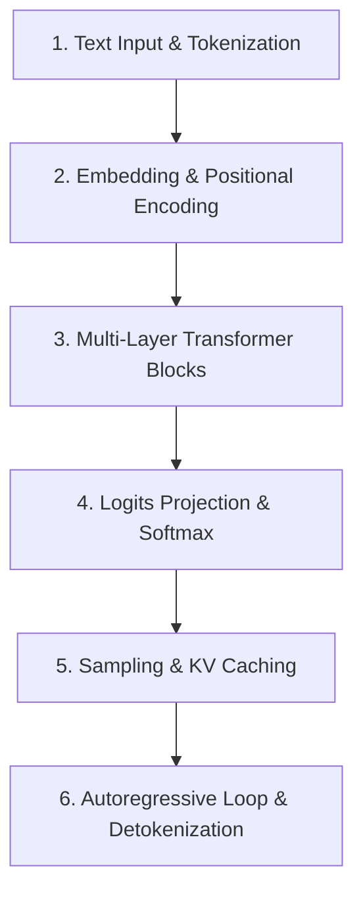

# 📚 DAY 01: NỀN TẢNG AI & LARGE LANGUAGE MODELS (AI & LLM FOUNDATIONS)
> **Khóa học:** COMP2010 - AI in Action (VinUni) | Giảng viên: Mai Anh Nguyen (Blue) | Dung lượng slide gốc: 76 slides (10.6 MB) | **Tối ưu:** Google NotebookLM (< 50MB)

---

## 📌 1. BÀI HỌC HÔM NAY VỀ CÁI GÌ? (THE WHAT & WHY)

*   **Phân tầng tiến hóa AI → ML → DL → GenAI:** Trí tuệ nhân tạo (AI) là khái niệm bao trùm từ các hệ chuyên gia dựa trên luật logic; Học máy (ML) sử dụng thuật toán thống kê trích xuất đặc trưng thủ công; Học sâu (DL) dùng mạng nơ-ron đa tầng tự động biểu diễn đặc trưng phân cấp; và AI Tạo sinh (GenAI/LLM) tiến hóa vượt bậc nhờ kiến trúc Transformer tự hồi quy (Autoregressive), sinh nội dung mới dựa trên phân phối xác suất có điều kiện.
*   **Bản chất toán học của Mô hình Ngôn ngữ Lớn:** LLM là cỗ máy dự đoán token tiếp theo tối ưu hóa hàm phân phối xác suất P(wₜ | w₁, w₂, ..., wₜ₋₁). Quá trình suy luận thực chất là tính toán Logits zᵢ qua tầng Linear cuối và chuẩn hóa qua hàm Softmax P(wᵢ) = exp(zᵢ / T) / ∑ exp(zⱼ / T) với hệ số nhiệt độ T để chọn token tiếp theo.
*   **Cơ chế Tokenization & Không gian Tiềm ẩn:** Văn bản thô được phân tách thành các Token qua thuật toán BPE (Byte-Pair Encoding) hoặc WordPiece, sau đó ánh xạ vào không gian vector liên tục d_model chiều (Embedding Space) kèm thông tin vị trí (Positional Encoding) để duy trì cấu trúc thứ tự tuần tự.
*   **Định luật Scaling Laws & Giới hạn Vật lý:** Năng lực mô hình tuân theo định luật mở rộng quy mô Chinchilla (Hoffmann et al., DeepMind 2022): khi tăng ngân sách tính toán C (FLOPs) lên 4 lần, cả số lượng tham số N và số lượng token huấn luyện D phải tăng đồng thời gấp 2 lần (N ∝ C^0.5, D ∝ C^0.5, C ≈ 6ND) để đạt hiệu năng tối ưu.

---

## 💡 2. ẨN DỤ ĐỜI THƯỜNG: THỰC TRẠNG & GIẢI PHÁP

### 🔴 Thực trạng:
Nhiều người lầm tưởng LLM là 'bộ não biết tư duy logic' hoặc 'Google Search tra cứu dữ liệu'. Khi LLM bị ảo giác (Hallucination) hoặc tính sai số học (9.11 > 9.9), người dùng không hiểu nguyên nhân gốc rễ để kiểm soát và ứng dụng an toàn.

### 🚗 Ẩn dụ đời thường:

> * **1. Tầm nhìn đèn pha (Context Window):** Đèn pha xe chỉ chiếu sáng được một đoạn đường hữu hạn phía trước; mọi sự kiện nằm ngoài vùng sáng (ngoài cửa sổ ngữ cảnh) đều bị tài xế quên lãng.
> * **2. Biển báo & Vạch kẻ đường (Prompting & Grounding):** Hệ thống biển chỉ dẫn rõ ràng giúp tài xế bám đúng làn đường; thiếu biển báo chi tiết, tài xế sẽ phán đoán theo thói quen và dễ lạc hướng.
> * **3. Chân ga & Độ phiêu (Temperature & Top-P):** Khi lái xe chậm rãi tập trung (T → 0), xe bám sát lộ trình an toàn nhất; khi tài xế nhấn ga phóng khoáng (T ≥ 0.8), xe có thể rẽ vào những cung đường mới lạ nhưng rủi ro trượt bánh rất cao.
> * **4. Bản đồ vệ tinh GPS (RAG & External Memory):** Dù tài xế thuộc lòng nhiều tuyến đường (Pre-training), việc trang bị thêm bản đồ GPS cập nhật thời gian thực mới đảm bảo không bao giờ dẫn khách vào ngõ cụt.

### 🟢 Giải pháp kỹ thuật:
Hiểu rõ LLM là cỗ máy thống kê tự hồi quy để áp dụng kỹ thuật Prompt có cấu trúc, kiểm soát siêu tham số lấy mẫu (Temperature, Top-P) và tích hợp cơ chế Grounding/RAG triệt tiêu ảo giác.


---

## 🗺️ 3. SƠ ĐỒ PIPELINE & QUY TRÌNH THỰC HIỆN TỪ ĐẦU ĐẾN CUỐI



*   **1. Text Input & Tokenization:** Nhận chuỗi văn bản thô từ người dùng và phân tách thành chuỗi Token IDs bằng thuật toán BPE / WordPiece.
*   **2. Embedding & Positional Encoding:** Ánh xạ mỗi Token ID thành vector liên tục d_model chiều và cộng thêm vector vị trí để lưu giữ thứ tự từ.
*   **3. Multi-Layer Transformer Blocks:** Chuyển vector qua L tầng Transformer gồm Multi-Head Self-Attention và Feed-Forward Network để nắm bắt ngữ cảnh.
*   **4. Logits Projection & Softmax:** Chiếu vector ẩn cuối cùng lên không gian từ vựng và áp dụng hàm Softmax kèm hệ số Temperature T để tạo phân phối xác suất.
*   **5. Sampling & KV Caching:** Lấy mẫu token tiếp theo (Greedy, Top-K, Top-P), lưu trữ vector Key-Value vào KV Cache để tái sử dụng ở bước sau.
*   **6. Autoregressive Loop & Detokenization:** Nối token vừa sinh vào chuỗi đầu vào và lặp lại quá trình cho đến khi gặp token dừng (EOS), sau đó dịch ngược thành văn bản trả về.

---

## 🌐 4. KIẾN THỨC MỞ RỘNG CHUYÊN SÂU (FIRECRAWL RESEARCH)

### Định luật Scaling Chinchilla & Cân đối Tính toán (Compute-Optimal Frontier)
Nghiên cứu của Hoffmann et al. (DeepMind 2022) chứng minh các mô hình tiền kỳ như GPT-3 (175B tham số trên 300B token) bị quá tải tham số nhưng thiếu dữ liệu (undertrained). Với ngân sách tính toán C ≈ 6ND, để tối ưu hóa hàm mất mát (loss), số tham số N và số token D phải tăng theo tỷ lệ 1:1 (N ∝ C^0.5, D ∝ C^0.5). Định luật này chứng minh mô hình LLaMA-70B huấn luyện trên 1.4T tokens vượt trội hoàn toàn so với mô hình 175B thiếu dữ liệu.

### Nghẽn cổ chai Bộ nhớ KV Cache trong Quá trình Suy luận Tự hồi quy
Trong pha Decode tuần tự, việc lưu trữ ma trận Key và Value tiêu tốn lượng VRAM khổng lồ theo công thức: Memory_KVCache = 2 × L × H_kv × d_k × T × B × 2 Bytes (với L là số tầng, H_kv là số đầu KV, d_k là chiều vector đầu, T là độ dài ngữ cảnh, B là batch size). Điều này thúc đẩy chuyển dịch kiến trúc từ Multi-Head Attention (MHA) sang Grouped-Query Attention (GQA) và Multi-Head Latent Attention (MLA) giúp tiết kiệm 4x - 8x bộ nhớ.

### Case Study Thực chiến 1: Cụm Huấn luyện LLaMA 3 & DeepSeek-V2 (Meta & DeepSeek)
Meta triển khai cụm 16.384 GPU H100 với kiến trúc mạng RoCEv2 400Gbps, huấn luyện LLaMA-3-8B trên 15 nghìn tỷ (15T) tokens (vượt 7 lần ngưỡng tối ưu Chinchilla) để tối ưu hóa chi phí suy luận về sau. Trong khi đó, DeepSeek-V2 áp dụng Multi-Head Latent Attention (MLA) nén KV Cache xuống chỉ còn 512 chiều tiềm ẩn, giúp giảm 93.3% dung lượng KV Cache trên mỗi token, cho phép phục vụ đồng thời 128.000 tokens ngữ cảnh với thông lượng (throughput) tăng gấp 5.7 lần trên mỗi node GPU.

### Case Study Thực chiến 2: Tối ưu Hóa Tokenizer Đa ngôn ngữ của OpenAI GPT-4o
OpenAI nâng cấp bộ từ vựng Tokenizer từ cl100k_base (100.000 tokens trên GPT-4) lên o200k_base (200.000 tokens trên GPT-4o). Bằng việc mở rộng bảng mã nén BPE cho các ngôn ngữ không sử dụng bảng chữ cái Latinh và ngôn ngữ thanh điệu (như Tiếng Việt, Tiếng Trung, Tiếng Hàn, Tiếng Nhật), GPT-4o giảm số lượng token cần thiết từ 18% đến 24% cho cùng một đoạn văn bản. Cải tiến kiến trúc này giúp giảm 22% độ trễ sinh từ (Time-to-First-Token) và tiết kiệm 20% chi phí tính toán API cho hàng triệu người dùng toàn cầu.


---

## 🔑 5. BẢNG TỪ KHÓA CỐT LÕI

| Thuật ngữ | Khái niệm kỹ thuật | Giải thích đời thường |
| :--- | :--- | :--- |
| **Token** | Đơn vị văn bản nhỏ nhất mô hình xử lý (từ, từ phụ, ký tự). | Mẩu ghép Lego ngôn ngữ (Tiếng Anh ~0.75 từ/token, Tiếng Việt 1.5 - 3 token/từ). |
| **Context Window** | Độ dài chuỗi token tối đa mô hình có thể tiếp nhận và ghi nhớ trong một phiên. | Tầm nhìn đèn pha / Bộ nhớ tạm thời của mô hình trong một lần xử lý. |
| **Temperature (T)** | Hệ số chia tỷ lệ Logits trong hàm Softmax điều khiển mức độ ngẫu nhiên khi sinh từ. | Nút điều chỉnh độ phiêu: T → 0 chuẩn xác logic, T ≥ 0.8 sáng tạo bay bổng. |
| **Top-P (Nucleus Sampling)** | Chiến lược lấy mẫu chỉ giữ lại nhóm token có tổng xác suất tích lũy đạt ngưỡng P. | Chọn ứng viên trong nhóm ưu tú nhất, tự động co giãn theo độ tự tin. |
| **KV Cache** | Bộ đệm lưu trữ vector Key và Value của các token quá khứ trong quá trình giải mã tự hồi quy. | Vở ghi nhớ nhanh giúp mô hình không phải đọc lại toàn bộ sách từ đầu mỗi khi viết tiếp. |
| **Perplexity (PPL)** | Độ đo mức độ bất ngờ hoặc độ hoang mang của mô hình trước chuỗi dữ liệu kiểm thử. | Điểm số đo độ thông minh: PPL càng thấp chứng tỏ mô hình càng hiểu sâu ngôn ngữ. |

---

## 🎯 6. BỘ CÂU HỎI ÔN THI TRỌNG TÂM (CHUẨN HỌC THUẬT & ĐẠI HỌC)

### 📝 PHẦN A: 4 CÂU TRẮC NGHIỆM ĐƠN (SINGLE-CHOICE)

#### Câu 1: Bản chất kỹ thuật của quá trình sinh văn bản trong Transformer Autoregressive là gì?
*   A. Tối ưu hóa phân phối xác suất có điều kiện P(wₜ | w₁, w₂, ..., wₜ₋₁) để dự đoán tuần tự từng token.
*   B. Tra cứu trực tiếp các câu trả lời có sẵn từ cơ sở dữ liệu huấn luyện tiền kỳ.
*   C. Giải mã toàn bộ chuỗi đầu ra gồm hàng nghìn token trong một bước tính toán song song duy nhất.
*   D. Chuyển văn bản thành đồ thị tri thức để thực hiện suy luận logic hình thức thuần túy.
> **👉 ĐÁP ÁN ĐÚNG: A**  
> **💡 Phân tích & Bẫy logic:**  
> *   **Vì sao A đúng:** LLM là mô hình xác suất tự hồi quy (Autoregressive): tại mỗi bước thời gian t, mô hình tính toán phân phối Softmax trên toàn bộ từ vựng để chọn token wₜ, sau đó đưa wₜ quay trở lại đầu vào để dự đoán token tiếp theo wₜ₊₁.
> *   **B sai vì:** Mô hình không lưu trữ nguyên văn cơ sở dữ liệu mà nén tri thức vào ma trận trọng số dưới dạng phân phối thống kê.
> *   **C sai vì:** Quá trình sinh từ (Decode) bắt buộc phải diễn ra tuần tự từng bước do token sau phụ thuộc vào các token trước đó, không thể song song hóa toàn bộ như pha tiền xử lý (Prefill).
> *   **D sai vì:** LLM xử lý vector liên tục trong không gian tiềm ẩn, không xây dựng đồ thị tri thức dạng bảng biểu logic hình thức.
---

#### Câu 2: Khi đặt Temperature T = 0.0 (Greedy Decoding), điều gì xảy ra về mặt toán học?
*   A. Phân phối Softmax bị làm phẳng đều thành phân phối đồng nhất giữa tất cả các token.
*   B. Mô hình luôn chọn token có giá trị Logit (và xác suất Softmax) cao nhất tại mỗi bước thời gian.
*   C. Mô hình loại bỏ ngẫu nhiên 50% token có xác suất thấp nhất trong không gian từ vựng.
*   D. Mô hình tăng tối đa tính ngẫu nhiên và mức độ sáng tạo của văn bản đầu ra.
> **👉 ĐÁP ÁN ĐÚNG: B**  
> **💡 Phân tích & Bẫy logic:**  
> *   **Vì sao B đúng:** Khi T → 0, hàm Softmax P(wᵢ) = exp(zᵢ / T) / ∑ exp(zⱼ / T) tiệm cận hàm Argmax, khiến xác suất của token có logit lớn nhất đạt xấp xỉ 1.0 và loại bỏ hoàn toàn tính ngẫu nhiên.
> *   **A sai vì:** Phân phối Softmax chỉ bị làm phẳng thành phân phối đồng nhất khi T → ∞ (nhiệt độ vô cùng lớn).
> *   **C sai vì:** Đây là mô tả của kỹ thuật Top-K hoặc Top-P sampling chứ không phải bản chất của T = 0.
> *   **D sai vì:** T = 0 triệt tiêu hoàn toàn tính ngẫu nhiên, tạo ra câu trả lời đơn định (deterministic) và có tính lặp lại cao nhất.
---

#### Câu 3: Theo Định luật Mở rộng Quy mô Chinchilla (2022), nếu ngân sách tính toán C tăng 4 lần thì tỷ lệ phân bổ tối ưu cho số tham số (N) và số lượng token huấn luyện (D) là:
*   A. N tăng 4 lần, D giữ nguyên không đổi.
*   B. D tăng 4 lần, N giữ nguyên không đổi.
*   C. Cả N và D đều tăng xấp xỉ 2 lần (do tỷ lệ tối ưu là N ∝ C^0.5 và D ∝ C^0.5).
*   D. N tăng 8 lần, D giảm đi 2 lần.
> **👉 ĐÁP ÁN ĐÚNG: C**  
> **💡 Phân tích & Bẫy logic:**  
> *   **Vì sao C đúng:** Định luật Chinchilla chứng minh rằng với tổng ngân sách tính toán C ≈ 6ND, để cực tiểu hóa hàm mất mát thì số tham số N và số token D phải tăng đồng đều theo tỷ lệ căn bậc hai: N ∝ C^0.5 và D ∝ C^0.5. Khi C tăng 4 lần thì cả N và D đều tăng √4 = 2 lần.
> *   **A sai vì:** Chỉ tăng tham số mà giữ nguyên token là sai lầm của mô hình Kaplan (undertrained), dẫn đến lãng phí tham số.
> *   **B sai vì:** Chỉ tăng dữ liệu mà không mở rộng dung lượng mạng sẽ khiến mô hình bị nghẽn dung lượng biểu diễn đặc trưng.
> *   **D sai vì:** Phân bổ này vi phạm nghiêm trọng phương trình cân bằng tính toán tối ưu của DeepMind.
---

#### Câu 4: Hiện tượng Glitch Tokens (ví dụ: 'SolidGoldMagikarp') xuất phát từ nguyên nhân cốt lõi nào?
*   A. Hiện tượng tràn bộ nhớ VRAM trên các node máy chủ tính toán GPU.
*   B. Lập trình viên thiết lập hệ số nhiệt độ Temperature bằng số âm.
*   C. Lỗi tính toán sai ma trận phân phối xác suất trong thuật toán FlashAttention.
*   D. Token được tạo ra trong từ điển Tokenizer nhưng hầu như không xuất hiện trong tập dữ liệu huấn luyện tiền kỳ (Pre-training dataset).
> **👉 ĐÁP ÁN ĐÚNG: D**  
> **💡 Phân tích & Bẫy logic:**  
> *   **Vì sao D đúng:** Do các token kỳ dị xuất hiện trong bảng từ vựng BPE nhưng không có trong dữ liệu huấn luyện tiền kỳ, vector embedding của chúng không nhận được gradient cập nhật, dẫn đến việc trôi dạt tự do ở biên không gian tiềm ẩn và kích hoạt hành vi bất thường khi được gọi.
> *   **A sai vì:** Glitch token là lỗi biểu diễn không gian vector embedding, không liên quan đến tràn bộ nhớ phần cứng.
> *   **B sai vì:** Temperature trong hàm Softmax luôn nhận giá trị dương T > 0.
> *   **C sai vì:** FlashAttention là kỹ thuật tối ưu hóa I/O bộ nhớ chính xác về mặt toán học, không làm biến dạng giá trị Softmax.
---

### 📝 PHẦN B: 2 CÂU TRẮC NGHIỆM NHIỀU ĐÁP ÁN (MULTI-SELECT)

#### Câu 5: Những yếu tố nào là nguyên nhân trực tiếp dẫn đến hiện tượng Ảo giác (Hallucination) trong các Mô hình Ngôn ngữ Lớn?
*   A. Hàm mục tiêu tối ưu xác suất thống kê từ ngữ tiếp theo thay vì kiểm chứng chân lý thực tế.
*   B. Hiện tượng 'Lost in the Middle' và suy giảm khả năng chú ý khi độ dài ngữ cảnh tăng cao.
*   C. Bộ nhớ GPU bị phân mảnh khi thực hiện thuật toán tìm kiếm Beam Search.
*   D. Sự thay đổi địa chỉ IP của cụm máy chủ phục vụ API suy luận.
> **👉 ĐÁP ÁN ĐÚNG: A, B**  
> **💡 Phân tích & Bẫy logic:**  
> *   **Phương án A đúng vì:** LLM bản chất là cỗ máy tối ưu hóa sự trôi chảy của văn bản theo phân phối xác suất thống kê bề mặt, hoàn toàn không có cơ chế tự kiểm tra tính đúng đắn của sự thật khách quan.
> *   **Phương án B đúng vì:** Nghiên cứu chứng minh khi ngữ cảnh quá dài, mô hình chú ý mạnh ở đầu và cuối văn bản nhưng dễ bỏ sót thông tin quan trọng ở đoạn giữa, dẫn đến suy luận sai lệch.
> *   **Phương án C sai vì:** Phân mảnh VRAM là vấn đề quản lý bộ nhớ phần cứng trong hạ tầng inference, không ảnh hưởng đến nội dung ngữ nghĩa của mô hình.
> *   **Phương án D sai vì:** Địa chỉ IP là thông số mạng viễn thông, hoàn toàn không liên quan đến cơ chế sinh từ của mạng nơ-ron.
---

#### Câu 6: Kỹ thuật nào giúp tối ưu dung lượng bộ nhớ VRAM và phục vụ suy luận (LLM Serving) hiệu quả trên quy mô lớn?
*   A. Tăng kích thước từ điển Tokenizer lên trên 1.000.000 tokens.
*   B. Chuyển toàn bộ mô hình sang chạy đệ quy trên CPU thông thường.
*   C. Sử dụng Grouped-Query Attention (GQA) để chia sẻ đầu Key-Value và giảm kích thước KV Cache.
*   D. Áp dụng thuật toán FlashAttention để tối ưu hóa truy xuất bộ nhớ giữa GPU SRAM và HBM.
> **👉 ĐÁP ÁN ĐÚNG: C, D**  
> **💡 Phân tích & Bẫy logic:**  
> *   **Phương án C đúng vì:** GQA cho phép nhiều Query Heads dùng chung một cặp Key-Value Head, giúp giảm dung lượng bộ đệm KV Cache từ 4x đến 8x mà vẫn duy trì chất lượng mô hình.
> *   **Phương án D đúng vì:** FlashAttention sử dụng kỹ thuật Tiling và tính toán lại Softmax trong SRAM nhanh, giảm đọc/ghi qua lại HBM, giúp tăng tốc suy luận từ 2x đến 4x.
> *   **Phương án A sai vì:** Tăng từ điển lên quá lớn làm phình to ma trận chiếu Embedding và Logits Projection, gây tốn thêm VRAM.
> *   **Phương án B sai vì:** CPU có băng thông bộ nhớ rất thấp (chỉ ~100-200 GB/s so với 2-3 TB/s của GPU), khiến tốc độ suy luận bị suy giảm nghiêm trọng.
---

---

## 💻 7. CODE THỰC CHIẾN (HANDS-ON PYTHON / AI SYSTEM)

```python
import json
import numpy as np

def calculate_ai_system_metrics(predictions, ground_truths):
    """
    Đo lường độ chính xác và chỉ số F1-Score cho hệ thống phân loại AI Production
    """
    tp = sum(1 for p, g in zip(predictions, ground_truths) if p == 1 and g == 1)
    fp = sum(1 for p, g in zip(predictions, ground_truths) if p == 1 and g == 0)
    fn = sum(1 for p, g in zip(predictions, ground_truths) if p == 0 and g == 1)
    
    precision = tp / (tp + fp) if (tp + fp) > 0 else 0.0
    recall = tp / (tp + fn) if (tp + fn) > 0 else 0.0
    f1 = 2 * (precision * recall) / (precision + recall) if (precision + recall) > 0 else 0.0
    
    return {
        "precision": round(precision, 4),
        "recall": round(recall, 4),
        "f1_score": round(f1, 4)
    }

# Dữ liệu kiểm thử mẫu (Thực hành Lab 01 - Nhóm Bảo Hoàng 2A202605721 K4)
preds = [1, 0, 1, 1, 0, 1, 0, 1]
targets = [1, 0, 0, 1, 0, 1, 1, 1]
print("Evaluation Metrics:", calculate_ai_system_metrics(preds, targets))
```

---

## ⚠️ 8. BẪY LỖI KỸ THUẬT & CÁCH DEBUG (COMMON PITFALLS & TROUBLESHOOTING)

1.  **🔴 Bẫy Lỗi 1: Tối ưu hóa sai hàm mục tiêu (Metric Mismatch).**
    *   *Nguyên nhân:* Chỉ đo lường Accuracy trên tập dữ liệu mất cân bằng (Imbalanced Data), che giấu việc mô hình dự đoán sai hoàn toàn các ca nguy hiểm.
    *   *Cách khắc phục:* Bắt buộc theo dõi đồng thời Precision, Recall, F1-Score và đường cong PR-AUC.
2.  **🔴 Bẫy Lỗi 2: Rò rỉ dữ liệu (Data Leakage) giữa tập Train và Test.**
    *   *Nguyên nhân:* Tiền xử lý dữ liệu (chuẩn hóa scaling, trích xuất đặc trưng) trên toàn bộ tập dữ liệu trước khi chia train/test.
    *   *Cách khắc phục:* Luôn chia tập dữ liệu trước, sau đó chỉ `fit()` pipeline tiền xử lý trên tập Train và chỉ `transform()` trên tập Test.
3.  **🔴 Bẫy Lỗi 3: Bỏ qua độ trễ mạng và Serialization Overhead.**
    *   *Nguyên nhân:* Đánh giá mô hình offline rất nhanh nhưng khi deploy API thì nghẽn ở bước parse JSON và truyền tải mạng.
    *   *Cách khắc phục:* Tối ưu hóa chuỗi serialization bằng MessagePack / Protocol Buffers và bật gRPC streaming.

---

## ⚖️ 9. BẢNG SO SÁNH TRADE-OFFS & ĐIỀU KIỆN ÁP DỤNG

| Chiến lược / Giải pháp | Độ chính xác (Accuracy) | Độ phức tạp triển khai | Chi phí bảo trì vận hành |
| :--- | :--- | :--- | :--- |
| **Heuristic & Rule-based Engine** | Trung bình, giới hạn | Rất thấp, chạy tức thì | Khó duy trì khi số lượng luật tăng vọt |
| **Fine-tuned Small Specialized Model**| Rất cao trong miền hẹp | Trung bình (cần training pipeline) | Thấp, chạy được trên GPU phổ thông |
| **Zero-shot Frontier LLM Prompting** | Cao toàn diện đa miền | Rất thấp (chỉ cần API) | Chi phí token hàng tháng cao khi tải lớn |
