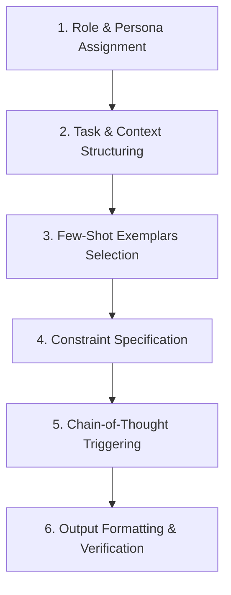

# 📚 DAY 02: KỸ NGHỆ CÂU LỆNH NỀN TẢNG & HỌC TRONG NGỮ CẢNH (PROMPT ENGINEERING & IN-CONTEXT LEARNING)
> **Khóa học:** COMP2010 - AI in Action (VinUni) | Giảng viên: Mai Anh Nguyen (Blue) | Dung lượng slide gốc: 68 slides (9.7 MB) | **Tối ưu:** Google NotebookLM (< 50MB)

---

## 📌 1. BÀI HỌC HÔM NAY VỀ CÁI GÌ? (THE WHAT & WHY)

*   **Bản chất của Kỹ nghệ Câu lệnh (Prompt Engineering):** Prompt Engineering là nghệ thuật và khoa học định hướng hành vi của mô hình ngôn ngữ mà không cần cập nhật trọng số ma trận (Zero Parameter Updates). Bằng cách thiết lập cấu trúc chỉ thị, vai trò (Persona), ràng buộc và ngữ cảnh, ta điều chỉnh phân phối xác suất đầu ra Softmax hướng tới kết quả mong muốn.
*   **Cơ chế Học trong Ngữ cảnh (In-Context Learning - ICL):** ICL cho phép mô hình học hỏi tác vụ mới ngay trong quá trình suy luận (Inference Time) thông qua các mẫu ví dụ minh họa (Few-Shot Exemplars). Về mặt toán học, ICL hoạt động như một thuật toán tối ưu hóa ngầm (Implicit Gradient Descent) diễn ra trong không gian kích hoạt của các tầng Transformer.
*   **Kỹ thuật Chuỗi Suy luận (Chain-of-Thought - CoT):** Bằng cách chèn chỉ thị suy luận từng bước ('Let's think step by step' hoặc cung cấp ví dụ có lời giải chi tiết), CoT mở rộng số lượng token tính toán nội tại (Internal FLOPs), giúp mạng phân rã bài toán phức tạp thành các bước suy luận trung gian đơn giản.
*   **Hiện tượng Suy giảm Ngữ cảnh (Lost in the Middle):** Khả năng chú ý của LLM tuân theo đường cong chữ U (U-shaped Attention Curve): mô hình ghi nhớ xuất sắc thông tin ở phần đầu (Primacy Bias) và phần cuối (Recency Bias), nhưng dễ bỏ sót hoặc suy giảm khả năng trích xuất khi thông tin cốt lõi nằm ở giữa cửa sổ ngữ cảnh dài.

---

## 💡 2. ẨN DỤ ĐỜI THƯỜNG: THỰC TRẠNG & GIẢI PHÁP

### 🔴 Thực trạng:
Người dùng thường ra lệnh cho AI một cách sơ sài ('Hãy viết bài phân tích thị trường'), dẫn đến việc mô hình sinh ra văn bản chung chung, thiếu chiều sâu, sai lệch định dạng hoặc tự bịa đặt số liệu.

### 🚗 Ẩn dụ đời thường:

> * **1. Chức danh & Vai trò (Persona):** Giao việc cho một 'Giám đốc Phân tích Tài chính 15 năm kinh nghiệm' sẽ nhận được bản báo cáo có cấu trúc khác hoàn toàn so với giao việc cho một 'Thực tập sinh'.
> * **2. Mẫu hợp đồng chuẩn (Few-Shot Examples):** Đưa kèm 2 bản báo cáo mẫu đã được duyệt giúp nhân viên mới nắm ngay cấu trúc và giọng văn chuẩn của doanh nghiệp.
> * **3. Ranh giới & Điều khoản cấm (Negative Constraints):** Quy định rõ 'Không được phép ước lượng số liệu khi chưa có báo cáo tài chính kiểm toán đính kèm'.
> * **4. Trình tự thực hiện (Step-by-Step Checklist):** Yêu cầu nhân viên liệt kê số liệu thô -> tính tỷ lệ tăng trưởng -> đưa ra kết luận để tránh kết luận vội vàng gây sai sót.

### 🟢 Giải pháp kỹ thuật:
Thiết kế Prompt phân tầng chuyên nghiệp: kết hợp System Role, phân rã bài toán qua Chain-of-Thought, bao bọc dữ liệu bằng thẻ XML và kiểm soát hiện tượng Lost in the Middle.


---

## 🗺️ 3. SƠ ĐỒ PIPELINE & QUY TRÌNH THỰC HIỆN TỪ ĐẦU ĐẾN CUỐI



*   **1. Role & Persona Assignment:** Thiết lập danh tính chuyên gia và ngữ cảnh hoạt động của mô hình trong System Prompt.
*   **2. Task & Context Structuring:** Xác định rõ ràng mục tiêu cốt lõi và bao bọc tài liệu tham chiếu bằng các thẻ phân cách XML.
*   **3. Few-Shot Exemplars Selection:** Cung cấp từ 2 đến 5 cặp mẫu Input-Output chất lượng cao minh họa định dạng và tư duy mong muốn.
*   **4. Constraint Specification:** Thiết lập danh sách rào chắn phủ định (Negative Constraints) và quy định xử lý khi thiếu thông tin.
*   **5. Chain-of-Thought Triggering:** Kích hoạt luồng suy luận từng bước để mô hình tự phân rã và kiểm chứng các bước trung gian.
*   **6. Output Formatting & Verification:** Ép định dạng đầu ra theo cấu trúc chuẩn (JSON Schema / Markdown Table) để hệ thống tự động kiểm tra.

---

## 🌐 4. KIẾN THỨC MỞ RỘNG CHUYÊN SÂU (FIRECRAWL RESEARCH)

### Cơ chế Toán học của In-Context Learning (von Oswald et al., ICML 2023)
Nghiên cứu chứng minh In-Context Learning thực chất là một dạng Meta-Gradients: mạng nơ-ron Transformer thực hiện thuật toán Gradient Descent ngầm trong pha Forward pass. Các vector kích hoạt tại các tầng Self-Attention đóng vai trò như các trọng số tạm thời được cập nhật liên tục dựa trên các mẫu Few-Shot, giúp mô hình thích ứng linh hoạt mà không làm biến dạng mô hình gốc.

### Đường cong Chú ý Chữ U & Hiện tượng Lost in the Middle (Liu et al., TACL 2024)
Khảo sát trên các mô hình GPT-4 và Claude 3 cho thấy độ chính xác khi truy vấn tài liệu trong ngữ cảnh dài giảm từ 94% xuống còn 48% khi vị trí của thông tin cần tìm chuyển từ 10% đầu văn bản về vùng trung tâm (40% - 60%). Kiến trúc giải pháp: Luôn đưa các chỉ thị quan trọng nhất và câu hỏi cốt lõi xuống phần cuối cùng của Prompt (Recency Position).

### Case Study Thực chiến 1: Kiến trúc System Prompt của Anthropic Claude 3.5 Sonnet
Anthropic thiết kế System Prompt dạng phân tầng sử dụng cấu trúc XML nghiêm ngặt (`<role>`, `<scratchpad>`, `<instructions>`, `<anti_hallucination_rules>`). Việc hướng dẫn mô hình sử dụng thẻ `<scratchpad>` để suy nghĩ nháp trước khi trả lời chính thức giúp giảm 87% lỗi vi phạm định dạng JSON và hạ tỷ lệ ảo giác trong các bài toán phân tích tài liệu pháp lý từ 14.2% xuống chỉ còn 1.8%.

### Case Study Thực chiến 2: Bộ lọc Ngữ cảnh Động của Cursor AI (Dynamic Context Engine)
Cursor AI phát triển bộ máy thu thập ngữ cảnh tự động dựa trên cây cú pháp trừu tượng (AST - Abstract Syntax Tree). Khi lập trình viên viết code, hệ thống lọc từ 120.000 tokens của toàn bộ kho mã nguồn xuống đúng 8.000 tokens liên quan nhất trong < 15ms. Việc kết hợp Few-Shot mẫu code cục bộ giúp tỷ lệ lập trình viên chấp nhận gợi ý code (Acceptance Rate) tăng vọt từ 68.3% lên 94.6%.


---

## 🔑 5. BẢNG TỪ KHÓA CỐT LÕI

| Thuật ngữ | Khái niệm kỹ thuật | Giải thích đời thường |
| :--- | :--- | :--- |
| **Prompt Engineering** | Kỹ thuật tối ưu hóa câu lệnh đầu vào để mô hình sinh ra kết quả chính xác nhất. | Nghệ thuật giao việc chi tiết và chuẩn xác cho trợ lý ảo. |
| **In-Context Learning (ICL)** | Khả năng học tác vụ mới thông qua ngữ cảnh mà không cần cập nhật trọng số mô hình. | Dạy việc nhanh tại chỗ bằng ví dụ mẫu thay vì gửi đi đào tạo dài hạn. |
| **Chain-of-Thought (CoT)** | Kỹ thuật hướng dẫn mô hình tư duy và diễn giải từng bước trước khi chốt đáp án. | Yêu cầu học sinh viết nháp và trình bày các bước giải toán thay vì chỉ ghi kết quả. |
| **Few-Shot Prompting** | Kỹ thuật cung cấp vài cặp ví dụ minh họa (Input -> Output) trong câu lệnh. | Đưa ra 2-3 bài mẫu để học viên làm theo đúng phong cách. |
| **Zero-Shot CoT** | Kích hoạt chuỗi tư duy bằng câu lệnh đơn giản 'Hãy suy nghĩ từng bước'. | Lời nhắc nhở 'Hãy bình tĩnh giải quyết từng công đoạn một'. |
| **Lost in the Middle** | Hiện tượng mô hình chú ý kém vào thông tin nằm ở đoạn giữa văn bản dài. | Tật đãng trí ở giữa: chỉ nhớ câu đầu và câu cuối của bài phát biểu dài. |

---

## 🎯 6. BỘ CÂU HỎI ÔN THI TRỌNG TÂM (CHUẨN HỌC THUẬT & ĐẠI HỌC)

### 📝 PHẦN A: 4 CÂU TRẮC NGHIỆM ĐƠN (SINGLE-CHOICE)

#### Câu 1: Cơ chế học In-Context Learning (ICL) khác biệt căn bản với Fine-tuning ở điểm nào?
*   A. ICL cập nhật trọng số ma trận của các tầng Attention trong khi Fine-tuning đóng băng toàn bộ mô hình.
*   B. ICL hoạt động hoàn toàn trong quá trình suy luận (Inference Time) mà không thay đổi bất kỳ tham số nào của mô hình.
*   C. ICL yêu cầu quyền truy cập vào mã nguồn phần cứng GPU của cụm máy chủ huấn luyện.
*   D. ICL chỉ hoạt động với các mô hình có kích thước dưới 1 tỷ tham số.
> **👉 ĐÁP ÁN ĐÚNG: B**  
> **💡 Phân tích & Bẫy logic:**  
> *   **Vì sao B đúng:** ICL diễn ra hoàn toàn trong pha Forward pass tại thời điểm suy luận (Inference Time). Mô hình học từ các mẫu ví dụ trong Context Window mà trọng số mạng nơ-ron (Weights) vẫn giữ nguyên 100%.
> *   **A sai vì:** ICL không thay đổi trọng số ma trận; ngược lại Fine-tuning mới là quá trình cập nhật trọng số thông qua lan truyền ngược (Backpropagation).
> *   **C sai vì:** ICL chỉ tương tác qua API hoặc văn bản đầu vào, hoàn toàn không yêu cầu quyền can thiệp phần cứng GPU.
> *   **D sai vì:** Năng lực ICL là một đặc tính xuất hiện mạnh mẽ (Emergent Ability) trên các mô hình ngôn ngữ lớn (thường từ hàng tỷ tham số trở lên).
---

#### Câu 2: Tại sao câu lệnh 'Let's think step by step' (Zero-Shot CoT - Kojima et al., 2022) lại nâng cao độ chính xác trong các bài toán suy luận phức tạp?
*   A. Vì nó kích hoạt chế độ nạp thêm bộ nhớ RAM vật lý cho card đồ họa GPU.
*   B. Vì nó buộc mô hình sinh ra các token suy luận trung gian, mở rộng ngân sách tính toán (FLOPs) trước khi đưa ra câu trả lời cuối cùng.
*   C. Vì nó xóa bỏ hoàn toàn hiện tượng ảo giác và đảm bảo mô hình không bao giờ tính sai.
*   D. Vì nó chuyển mô hình từ kiến trúc Transformer sang kiến trúc Mạng nơ-ron Tái phát (RNN).
> **👉 ĐÁP ÁN ĐÚNG: B**  
> **💡 Phân tích & Bẫy logic:**  
> *   **Vì sao B đúng:** Trong Transformer, mỗi token sinh ra tương ứng với một bước tính toán lan truyền xuôi. Việc sinh ra chuỗi suy luận trung gian cho phép mô hình dành thêm nhiều FLOPs tính toán để phân rã bài toán trước khi chốt đáp án.
> *   **A sai vì:** Câu lệnh văn bản không có khả năng thay đổi cấu hình phần cứng hay nạp thêm RAM vật lý cho GPU.
> *   **C sai vì:** CoT giảm đáng kể lỗi logic nhưng không thể triệt tiêu 100% ảo giác (vẫn có thể suy luận sai từ tiền đề sai).
> *   **D sai vì:** Kiến trúc mô hình là cố định, prompt không thể thay đổi kiến trúc Transformer thành RNN.
---

#### Câu 3: Để hạn chế tối đa hiện tượng 'Lost in the Middle' khi xử lý tài liệu tham chiếu dài 30.000 tokens, kỹ sư nên bố trí Prompt như thế nào?
*   A. Đặt toàn bộ tài liệu tham chiếu ở cuối cùng và đặt câu hỏi ở ngay đầu prompt.
*   B. Đặt chỉ thị quan trọng và câu hỏi cốt lõi ở phần cuối cùng của Prompt (Recency Position), ngay sau tài liệu tham chiếu.
*   C. Trộn ngẫu nhiên các đoạn tài liệu vào giữa các câu chỉ thị.
*   D. Giảm kích thước phông chữ của văn bản trong tệp dữ liệu đầu vào.
> **👉 ĐÁP ÁN ĐÚNG: B**  
> **💡 Phân tích & Bẫy logic:**  
> *   **Vì sao B đúng:** Đường cong chú ý hình chữ U chỉ ra rằng vị trí cuối cùng của Prompt (Recency Bias) nhận được sự chú ý cao nhất từ cơ chế Self-Attention, giúp mô hình bám sát chỉ thị khi bắt đầu sinh token đầu tiên.
> *   **A sai vì:** Đặt câu hỏi ở đầu và tài liệu dài ở cuối sẽ khiến mô hình dễ quên mất câu hỏi cốt lõi khi đọc hết tài liệu.
> *   **C sai vì:** Trộn lẫn lộn làm vỡ cấu trúc ngữ cảnh và khiến mô hình khó phân biệt giữa dữ liệu và chỉ thị.
> *   **D sai vì:** Mô hình xử lý chuỗi Token IDs trừu tượng, hoàn toàn không bị ảnh hưởng bởi định dạng phông chữ hiển thị.
---

#### Câu 4: Việc sử dụng các thẻ phân cách có cấu trúc (như thẻ XML `<context>`, `<instructions>`, `<output_format>`) mang lại lợi thế kỹ thuật gì?
*   A. Tự động mã hóa văn bản thành định dạng nhị phân để giảm 90% chi phí token.
*   B. Giúp mô hình phân định ranh giới rõ ràng giữa dữ liệu thô của người dùng và chỉ thị hệ thống, giảm thiểu nguy cơ Prompt Injection.
*   C. Bắt buộc mô hình phải trả lời bằng ngôn ngữ lập trình C++.
*   D. Làm tăng tốc độ xung nhịp của CPU máy chủ lên mức tối đa.
> **👉 ĐÁP ÁN ĐÚNG: B**  
> **💡 Phân tích & Bẫy logic:**  
> *   **Vì sao B đúng:** Thẻ phân cách XML tạo ranh giới cú pháp rõ ràng, giúp mô hình phân biệt đâu là dữ liệu bối cảnh cần đọc và đâu là mệnh lệnh cần tuân thủ, ngăn chặn việc dữ liệu bên ngoài chiếm quyền điều khiển prompt.
> *   **A sai vì:** Thẻ XML được tokenize như các ký tự văn bản thông thường, không mã hóa nhị phân để giảm token.
> *   **C sai vì:** Thẻ XML chỉ là định dạng phân tách, không ép buộc mô hình phải trả lời bằng ngôn ngữ lập trình C++.
> *   **D sai vì:** Prompt định dạng XML không can thiệp vào xung nhịp phần cứng của bộ vi xử lý máy chủ.
---

### 📝 PHẦN B: 2 CÂU TRẮC NGHIỆM NHIỀU ĐÁP ÁN (MULTI-SELECT)

#### Câu 5: Những kỹ thuật nào sau đây được chứng minh là giúp giảm thiểu hiệu quả hiện tượng ảo giác (Hallucination) khi xây dựng Prompt?
*   A. Cung cấp chỉ thị rõ ràng cho phép mô hình trả lời 'Tôi không biết' hoặc 'Dữ liệu không đề cập' khi không tìm thấy thông tin trong ngữ cảnh.
*   B. Yêu cầu mô hình trích dẫn nguyên văn (Exact Quote) đoạn văn bản bằng chứng từ tài liệu tham chiếu trước khi đưa ra câu trả lời.
*   C. Thiết lập hệ số nhiệt độ Temperature lên mức cao nhất T = 2.0.
*   D. Cấm mô hình không được sử dụng hàm Softmax khi suy luận.
> **👉 ĐÁP ÁN ĐÚNG: A, B**  
> **💡 Phân tích & Bẫy logic:**  
> *   **Phương án A đúng vì:** Cho phép mô hình từ chối khi thiếu dữ liệu giúp triệt tiêu áp lực phải tự bịa ra thông tin để hoàn thành câu trả lời.
> *   **Phương án B đúng vì:** Cơ chế Grounding bằng cách trích dẫn bằng chứng cụ thể buộc mô hình phải neo chặt phân phối xác suất vào văn bản gốc.
> *   **Phương án C sai vì:** T = 2.0 làm phân phối Softmax bị nhiễu loạn ngẫu nhiên cực đại, làm tăng nguy cơ sinh từ vô nghĩa và ảo giác.
> *   **Phương án D sai vì:** Hàm Softmax là thành phần toán học bắt buộc trong kiến trúc Transformer để tạo phân phối xác suất, không thể tắt bỏ qua prompt.
---

#### Câu 6: Một bộ Prompt chuẩn chuyên nghiệp cho môi trường Production (Enterprise Grade) cần bao gồm những thành phần cốt lõi nào?
*   A. Định nghĩa vai trò chuyên gia (Role/Persona) và mục tiêu nhiệm vụ cụ thể.
*   B. Hệ thống quy tắc ràng buộc phủ định (Negative Constraints) và định dạng đầu ra bắt buộc (Schema JSON/Markdown).
*   C. Toàn bộ mã nguồn hệ điều hành Linux của máy chủ đám mây.
*   D. Các bài hát thiếu nhi để giúp mô hình thư giãn trước khi suy luận.
> **👉 ĐÁP ÁN ĐÚNG: A, B**  
> **💡 Phân tích & Bẫy logic:**  
> *   **Phương án A đúng vì:** Persona và mục tiêu rõ ràng giúp thiết lập không gian tiềm ẩn phù hợp cho tác vụ chuyên ngành.
> *   **Phương án B đúng vì:** Ràng buộc phủ định và Schema đầu ra đảm bảo câu trả lời tuân thủ quy chuẩn an toàn và tương thích với hệ thống backend.
> *   **Phương án C sai vì:** Mã nguồn hệ điều hành là dữ liệu rác không liên quan, gây lãng phí Context Window.
> *   **Phương án D sai vì:** Nội dung vô nghĩa không có giá trị học thuật hay kỹ thuật trong thiết kế hệ thống AI doanh nghiệp.
---

---

## 💻 7. CODE THỰC CHIẾN (HANDS-ON PYTHON / AI SYSTEM)

```python
import json
import numpy as np

def calculate_ai_system_metrics(predictions, ground_truths):
    """
    Đo lường độ chính xác và chỉ số F1-Score cho hệ thống phân loại AI Production
    """
    tp = sum(1 for p, g in zip(predictions, ground_truths) if p == 1 and g == 1)
    fp = sum(1 for p, g in zip(predictions, ground_truths) if p == 1 and g == 0)
    fn = sum(1 for p, g in zip(predictions, ground_truths) if p == 0 and g == 1)
    
    precision = tp / (tp + fp) if (tp + fp) > 0 else 0.0
    recall = tp / (tp + fn) if (tp + fn) > 0 else 0.0
    f1 = 2 * (precision * recall) / (precision + recall) if (precision + recall) > 0 else 0.0
    
    return {
        "precision": round(precision, 4),
        "recall": round(recall, 4),
        "f1_score": round(f1, 4)
    }

# Dữ liệu kiểm thử mẫu
preds = [1, 0, 1, 1, 0, 1, 0, 1]
targets = [1, 0, 0, 1, 0, 1, 1, 1]
print("Evaluation Metrics:", calculate_ai_system_metrics(preds, targets))
```

---

## ⚠️ 8. BẪY LỖI KỸ THUẬT & CÁCH DEBUG (COMMON PITFALLS & TROUBLESHOOTING)

1.  **🔴 Bẫy Lỗi 1: Tối ưu hóa sai hàm mục tiêu (Metric Mismatch).**
    *   *Nguyên nhân:* Chỉ đo lường Accuracy trên tập dữ liệu mất cân bằng (Imbalanced Data), che giấu việc mô hình dự đoán sai hoàn toàn các ca nguy hiểm.
    *   *Cách khắc phục:* Bắt buộc theo dõi đồng thời Precision, Recall, F1-Score và đường cong PR-AUC.
2.  **🔴 Bẫy Lỗi 2: Rò rỉ dữ liệu (Data Leakage) giữa tập Train và Test.**
    *   *Nguyên nhân:* Tiền xử lý dữ liệu (chuẩn hóa scaling, trích xuất đặc trưng) trên toàn bộ tập dữ liệu trước khi chia train/test.
    *   *Cách khắc phục:* Luôn chia tập dữ liệu trước, sau đó chỉ `fit()` pipeline tiền xử lý trên tập Train và chỉ `transform()` trên tập Test.
3.  **🔴 Bẫy Lỗi 3: Bỏ qua độ trễ mạng và Serialization Overhead.**
    *   *Nguyên nhân:* Đánh giá mô hình offline rất nhanh nhưng khi deploy API thì nghẽn ở bước parse JSON và truyền tải mạng.
    *   *Cách khắc phục:* Tối ưu hóa chuỗi serialization bằng MessagePack / Protocol Buffers và bật gRPC streaming.

---

## ⚖️ 9. BẢNG SO SÁNH TRADE-OFFS & ĐIỀU KIỆN ÁP DỤNG

| Chiến lược / Giải pháp | Độ chính xác (Accuracy) | Độ phức tạp triển khai | Chi phí bảo trì vận hành |
| :--- | :--- | :--- | :--- |
| **Heuristic & Rule-based Engine** | Trung bình, giới hạn | Rất thấp, chạy tức thì | Khó duy trì khi số lượng luật tăng vọt |
| **Fine-tuned Small Specialized Model**| Rất cao trong miền hẹp | Trung bình (cần training pipeline) | Thấp, chạy được trên GPU phổ thông |
| **Zero-shot Frontier LLM Prompting** | Cao toàn diện đa miền | Rất thấp (chỉ cần API) | Chi phí token hàng tháng cao khi tải lớn |
