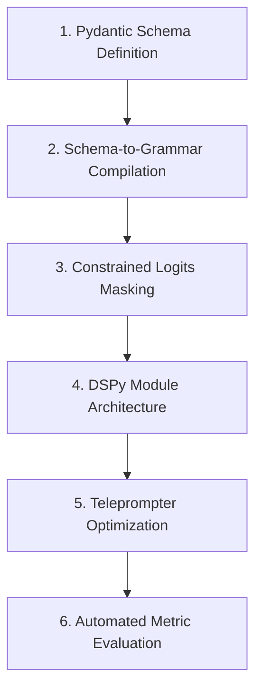

# 📚 DAY 03: ĐẦU RA CÓ CẤU TRÚC & TỐI ƯU HÓA PROMPT TỰ ĐỘNG (STRUCTURED OUTPUTS & DSPY)
> **Khóa học:** COMP2010 - AI in Action (VinUni) | Giảng viên: Mai Anh Nguyen (Blue) | Dung lượng slide gốc: 72 slides (8.0 MB) | **Tối ưu:** Google NotebookLM (< 50MB)

---

## 📌 1. BÀI HỌC HÔM NAY VỀ CÁI GÌ? (THE WHAT & WHY)

*   **Thách thức của Đầu ra Phi cấu trúc (Unstructured Text Paradox):** Trong các hệ thống phần mềm doanh nghiệp, văn bản tự do (Free-form text) của LLM không thể tích hợp trực tiếp vào cơ sở dữ liệu SQL hoặc gọi API downstream. Một lỗi nhỏ như thừa dấu phẩy, thiếu ngoặc nhọn JSON sẽ làm sập toàn bộ luồng xử lý tự động.
*   **Kỹ thuật Ép cấu trúc qua Mặt nạ Ngữ pháp (Grammar Masking & Constrained Decoding):** Thay vì hy vọng LLM tự sinh JSON đúng, kỹ thuật Constrained Decoding can thiệp trực tiếp vào bước Softmax: sử dụng Máy trạng thái hữu hạn (FSM / DFA) để gán Logit = -∞ cho tất cả các token vi phạm cú pháp JSON Schema, đảm bảo 100% đầu ra luôn hợp lệ.
*   **Sự ra đời của Khung lập trình DSPy (Khattab et al., Stanford 2023):** DSPy chuyển đổi việc viết Prompt thủ công (Prompt Engineering) thành quy trình lập trình và tối ưu hóa tham số tự động (Prompt Compilation). Nhà phát triển định nghĩa Signatures (Input -> Output) và Modules, sau đó Teleprompter/Optimizer sẽ tự động tìm kiếm bộ Few-Shot và Chỉ thị tối ưu nhất.
*   **Định lượng Đánh giá Chất lượng (LLM Metric Evaluation):** Chuyển đổi từ việc chấm điểm cảm tính sang đo lường định lượng bằng các hàm Metric toán học: Exact Match (EM), F1-Score, Semantic Similarity, và LLM-as-a-Judge có thang đo Rubric nghiêm ngặt.

---

## 💡 2. ẨN DỤ ĐỜI THƯỜNG: THỰC TRẠNG & GIẢI PHÁP

### 🔴 Thực trạng:
Doanh nghiệp yêu cầu AI trích xuất thông tin hóa đơn thành JSON, nhưng thỉnh thoảng AI lại mở đầu bằng câu lịch sự: 'Dưới đây là file JSON bạn cần: ```json...', khiến API backend bị lỗi JSONDecodeError.

### 🚗 Ẩn dụ đời thường:

> * **1. Khuôn đúc tiền xu (JSON Schema / Pydantic):** Thay vì để thợ đúc tự do nặn kim loại, ta đưa một khuôn đúc chuẩn kích thước: mọi đồng tiền ra lò đều có kích thước và hoa văn chuẩn xác 100%.
> * **2. Cổng soát vé tự động (Constrained Decoding / FSM):** Cổng soát vé chỉ mở khi hành khách quẹt đúng thẻ hợp lệ; nếu hành khách định đi sai làn, cổng lập tức chặn lại không cho bước tiếp.
> * **3. Kỹ sư trưởng tự động hóa (DSPy Compiler):** Thay vì thuê người thử nghiệm hàng trăm câu lệnh bằng tay, ta có một cỗ máy tự động thử nghiệm 1.000 biến thể prompt và chọn ra phiên bản đạt điểm số cao nhất.
> * **4. Thước đo kiểm định chất lượng (Evaluation Metric):** Mỗi sản phẩm đều được đo bằng thước kẹp điện tử chính xác đến từng milimét thay vì đánh giá bằng mắt thường.

### 🟢 Giải pháp kỹ thuật:
Ứng dụng cơ chế Structured Outputs dựa trên JSON Schema/Pydantic kết hợp Constrained Decoding và tự động hóa biên dịch prompt bằng DSPy.


---

## 🗺️ 3. SƠ ĐỒ PIPELINE & QUY TRÌNH THỰC HIỆN TỪ ĐẦU ĐẾN CUỐI



*   **1. Pydantic Schema Definition:** Định nghĩa cấu trúc dữ liệu mong muốn bằng Pydantic model với kiểu dữ liệu và ràng buộc chi tiết.
*   **2. Schema-to-Grammar Compilation:** Biên dịch JSON Schema thành đồ thị ngữ pháp BNF hoặc Máy trạng thái hữu hạn (FSM).
*   **3. Constrained Logits Masking:** Tại mỗi bước sinh từ, lọc bỏ toàn bộ các token không tuân thủ ngữ pháp bằng cách gán logit = -inf.
*   **4. DSPy Module Architecture:** Đóng gói bài toán vào các DSPy Modules (Predict, ChainOfThought, ReAct) với Signature rõ ràng.
*   **5. Teleprompter Optimization:** Chạy bộ tối ưu hóa (BootstrapFewShotWithRandomSearch, MIPRO) để tự động sinh prompt tối ưu.
*   **6. Automated Metric Evaluation:** Đo lường độ chính xác trên tập validation bằng các hàm đánh giá định lượng nghiêm ngặt.

---

## 🌐 4. KIẾN THỨC MỞ RỘNG CHUYÊN SÂU (FIRECRAWL RESEARCH)

### Cơ chế Triển khai Toán học của Constrained Decoding (Outlines & Guidance)
Thuật toán Outlines xây dựng một Deterministic Finite Automaton (DFA) từ Regular Expression hoặc JSON Schema. Tại mỗi trạng thái s của DFA, chỉ có một tập con từ vựng V_valid ⊆ V là hợp lệ để chuyển trạng thái. Tầng suy luận thực hiện phép gán mặt nạ vector: Logits[i] = -∞ nếu token i ∉ V_valid trước khi tính Softmax, đảm bảo thời gian chạy O(1) trên mỗi bước mà không làm giảm tốc độ suy luận.

### Thuật toán Tối ưu hóa Chỉ thị MIPROv2 trong DSPy (Stanford 2024)
MIPROv2 (Multiprompt Instruction Proposal Optimizer) sử dụng kỹ thuật Bayesian Optimization kết hợp với LLM meta-generator để đồng thời tìm kiếm: (1) Các chỉ thị tự nhiên tối ưu nhất và (2) Bộ ví dụ Few-Shot đại diện nhất. Thuật toán này giúp tăng từ 15% đến 35% độ chính xác so với prompt do con người viết tay trên các tập benchmark MMLU và GSM8K.

### Case Study Thực chiến 1: Chuẩn hóa Structured Outputs của OpenAI API
Tháng 8/2024, OpenAI công bố tính năng Structured Outputs với `response_format: { type: 'json_schema', strict: true }`. Bằng cách tiền xử lý JSON Schema thành định dạng Grammar và nạp vào nhân phần cứng phục vụ suy luận, OpenAI đạt tỷ lệ phản hồi tuân thủ schema tuyệt đối 100.0% (Zero Schema Violations) trên hàng triệu request, loại bỏ hoàn toàn nhu cầu viết vòng lặp thử lại (Retry Loop) ở phía client.

### Case Study Thực chiến 2: Tự động Hóa Pipeline Trích xuất Dữ liệu của Databricks bằng DSPy
Databricks thay thế hơn 2.500 dòng prompt viết tay rải rác trong hệ thống trích xuất tài liệu hợp đồng tài chính bằng module DSPy tự tối ưu hóa. Sử dụng bộ tối ưu hóa BootstrapFewShot, hệ thống tự động đạt độ chính xác F1-Score 92.4% (tăng từ 71.2% ban đầu) đồng thời giảm 34% lượng token tiêu thụ trên mỗi truy vấn nhờ loại bỏ các chỉ thị rườm rà không cần thiết.


---

## 🔑 5. BẢNG TỪ KHÓA CỐT LÕI

| Thuật ngữ | Khái niệm kỹ thuật | Giải thích đời thường |
| :--- | :--- | :--- |
| **Structured Outputs** | Kỹ thuật ép buộc mô hình trả về dữ liệu đúng định dạng cấu trúc (JSON, Pydantic). | Đóng hàng vào thùng carton chuẩn kích thước để dễ dàng vận chuyển. |
| **Constrained Decoding** | Cơ chế can thiệp vào Softmax để loại bỏ các token vi phạm quy tắc ngữ pháp. | Đường ray xe lửa: chỉ cho phép tàu chạy đúng hướng đã định sẵn. |
| **DSPy** | Khung lập trình tối ưu hóa câu lệnh và trọng số prompt tự động của Đại học Stanford. | Bộ biên dịch code tự động: biến ý tưởng thành câu lệnh tối ưu nhất. |
| **Pydantic** | Thư viện Python dùng để kiểm thực kiểu dữ liệu và quản lý cấu trúc dữ liệu. | Cân điện tử kiểm tra tiêu chuẩn chất lượng sản phẩm xuất xưởng. |
| **Finite State Machine (FSM)** | Mô hình toán học gồm các trạng thái và điều kiện chuyển trạng thái hữu hạn. | Sơ đồ chỉ dẫn từng ngã rẽ trên bản đồ giao thông. |
| **Teleprompter / Optimizer** | Thuật toán trong DSPy tự động lựa chọn ví dụ và điều chỉnh prompt tối ưu. | Huấn luyện viên trưởng chuyên đào tạo và chọn lựa đội hình mạnh nhất. |

---

## 🎯 6. BỘ CÂU HỎI ÔN THI TRỌNG TÂM (CHUẨN HỌC THUẬT & ĐẠI HỌC)

### 📝 PHẦN A: 4 CÂU TRẮC NGHIỆM ĐƠN (SINGLE-CHOICE)

#### Câu 1: Kỹ thuật Constrained Decoding (Grammar Masking) đảm bảo đầu ra JSON hợp lệ bằng cách nào?
*   A. Chờ mô hình sinh xong toàn bộ văn bản rồi dùng biểu thức chính quy (Regex) để cắt chuỗi.
*   B. Can thiệp trực tiếp vào phân phối xác suất Softmax tại mỗi bước sinh từ, gán Logit = -inf cho các token vi phạm ngữ pháp JSON Schema.
*   C. Tự động gửi câu hỏi lại cho mô hình nếu phát hiện lỗi cú pháp.
*   D. Ép mô hình chuyển sang chạy thuật toán cây quyết định Random Forest.
> **👉 ĐÁP ÁN ĐÚNG: B**  
> **💡 Phân tích & Bẫy logic:**  
> *   **Vì sao B đúng:** Constrained Decoding sử dụng máy trạng thái hữu hạn (FSM) để lọc không gian từ vựng ngay tại từng bước sinh token, gán Logit = -∞ cho mọi token sai cú pháp để xác suất Softmax của chúng bằng 0, đảm bảo 100% tuân thủ cấu trúc.
> *   **A sai vì:** Cắt chuỗi regex sau khi sinh xong là giải pháp hậu xử lý (Post-processing) thụ động, không ngăn chặn được lỗi sập cấu trúc.
> *   **C sai vì:** Vòng lặp thử lại (Retry loop) làm tăng độ trễ và chi phí API, không phải là cơ chế Constrained Decoding.
> *   **D sai vì:** Mô hình vẫn là Transformer sinh từ tự hồi quy, không chuyển đổi thành thuật toán Random Forest.
---

#### Câu 2: Triết lý cốt lõi của thư viện DSPy (Stanford) trong việc xây dựng ứng dụng LLM là gì?
*   A. Khuyên lập trình viên dành nhiều thời gian viết các đoạn prompt văn xuôi thật dài và chi tiết.
*   B. Thay thế việc thử nghiệm prompt thủ công bằng lập trình module hóa và tự động biên dịch, tối ưu hóa câu lệnh thông qua thuật toán.
*   C. Xóa bỏ hoàn toàn việc sử dụng mạng nơ-ron Transformer.
*   D. Tự động chuyển toàn bộ cơ sở dữ liệu sang dạng tệp văn bản thô.
> **👉 ĐÁP ÁN ĐÚNG: B**  
> **💡 Phân tích & Bẫy logic:**  
> *   **Vì sao B đúng:** DSPy trừu tượng hóa tương tác LLM thành các Signatures và Modules độc lập, sau đó sử dụng các bộ tối ưu hóa (Teleprompters) để tự động sinh và chọn lọc prompt tối ưu nhất dựa trên hàm mục tiêu định lượng.
> *   **A sai vì:** DSPy sinh ra để xóa bỏ sự phụ thuộc vào việc viết prompt văn bản thủ công dễ vỡ (brittle strings).
> *   **C sai vì:** DSPy là framework bao bọc và điều phối các mô hình Transformer, không loại bỏ mạng nơ-ron.
> *   **D sai vì:** DSPy quản lý luồng dữ liệu cấu trúc và tối ưu hóa hệ thống, không làm suy thoái cơ sở dữ liệu thành văn bản thô.
---

#### Câu 3: Trong Pydantic, tham số `Field(..., description='...')` đóng vai trò quan trọng nhất trong việc gì khi trích xuất dữ liệu bằng LLM?
*   A. Tăng dung lượng bộ nhớ RAM của máy chủ chạy Python.
*   B. Cung cấp ngữ nghĩa và chỉ dẫn chi tiết cho mô hình hiểu chính xác thông tin cần trích xuất vào trường dữ liệu đó.
*   C. Tự động dịch văn bản sang tiếng Pháp.
*   D. Khóa không cho phép người dùng chỉnh sửa mã nguồn.
> **👉 ĐÁP ÁN ĐÚNG: B**  
> **💡 Phân tích & Bẫy logic:**  
> *   **Vì sao B đúng:** Khi chuyển đổi Pydantic model thành JSON Schema gửi cho LLM, chuỗi `description` được mô hình đọc như một lời chỉ dẫn (prompt instruction) để trích xuất đúng trường dữ liệu mong muốn.
> *   **A sai vì:** Tham số Field là định nghĩa schema trong Python, không can thiệp vào RAM phần cứng máy chủ.
> *   **C sai vì:** Mô tả trường dữ liệu không có chức năng tự động dịch ngôn ngữ sang tiếng Pháp.
> *   **D sai vì:** Field là cú pháp chuẩn của Pydantic, không liên quan đến cơ chế khóa mã nguồn.
---

#### Câu 4: Bộ tối ưu hóa `BootstrapFewShot` trong DSPy hoạt động theo nguyên lý nào?
*   A. Tự động tải thêm các mô hình mới từ internet về máy tính.
*   B. Chạy thử nghiệm chương trình trên tập dữ liệu huấn luyện, lọc ra các lượt chạy thành công đạt điểm số cao để làm mẫu Few-Shot tự động.
*   C. Xóa bỏ toàn bộ các ví dụ mẫu có trong prompt.
*   D. Tăng tốc độ quay của quạt tản nhiệt GPU.
> **👉 ĐÁP ÁN ĐÚNG: B**  
> **💡 Phân tích & Bẫy logic:**  
> *   **Vì sao B đúng:** BootstrapFewShot thực thi pipeline trên tập dữ liệu train, đánh giá kết quả qua hàm Metric; các trường hợp thực thi đúng và đạt điểm cao sẽ được tự động đóng gói thành các cặp Few-Shot mẫu chèn vào prompt.
> *   **A sai vì:** Nó tối ưu hóa chuỗi prompt trong chương trình hiện tại, không tự động tải mô hình mới từ internet.
> *   **C sai vì:** Mục tiêu của nó là tự động tạo ra và chọn lọc các mẫu Few-Shot tốt nhất, không phải xóa bỏ.
> *   **D sai vì:** Thuật toán phần mềm không có chức năng điều khiển quạt tản nhiệt phần cứng.
---

### 📝 PHẦN B: 2 CÂU TRẮC NGHIỆM NHIỀU ĐÁP ÁN (MULTI-SELECT)

#### Câu 5: Những ưu điểm vượt trội khi sử dụng Structured Outputs dựa trên JSON Schema so với việc yêu cầu LLM sinh văn bản tự do là gì?
*   A. Tích hợp trực tiếp 100% an toàn vào các hệ thống backend, cơ sở dữ liệu và API downstream mà không lo lỗi cú pháp parse JSON.
*   B. Đảm bảo dữ liệu trích xuất tuân thủ nghiêm ngặt các ràng buộc về kiểu dữ liệu (kiểu số nguyên, chuỗi, danh sách enum).
*   C. Giảm dung lượng mô hình ngôn ngữ từ 70B xuống còn 1B tham số.
*   D. Loại bỏ hoàn toàn sự cần thiết của mạng Internet khi gọi API đám mây.
> **👉 ĐÁP ÁN ĐÚNG: A, B**  
> **💡 Phân tích & Bẫy logic:**  
> *   **Phương án A đúng vì:** Đầu ra có cấu trúc đảm bảo tính tất định về mặt cú pháp (Syntactic Determinism), giúp hệ sinh thái phần mềm tự động hóa vận hành trơn tru.
> *   **Phương án B đúng vì:** JSON Schema xác thực chặt chẽ kiểu dữ liệu của từng trường, ngăn chặn việc trả về sai định dạng.
> *   **Phương án C sai vì:** Structured Outputs là kỹ thuật can thiệp pha suy luận, không làm thay đổi kích thước tham số của mô hình.
> *   **Phương án D sai vì:** Gọi API đám mây vẫn bắt buộc phải có kết nối mạng Internet.
---

#### Câu 6: Để xây dựng một hệ thống đánh giá định lượng (Evaluation Pipeline) chuyên nghiệp cho ứng dụng LLM, các kỹ sư cần chuẩn bị những thành phần nào?
*   A. Tập dữ liệu kiểm thử vàng (Gold Standard / Ground Truth Dataset) có nhãn chuẩn mực.
*   B. Hàm đo lường định lượng xác định (Exact Match, F1, Cosine Semantic Similarity hoặc LLM Judge với Rubric chặt chẽ).
*   C. Bộ hình ảnh phong cảnh 8K để làm hình nền máy tính.
*   D. Thiết bị đo nhiệt độ môi trường phòng làm việc.
> **👉 ĐÁP ÁN ĐÚNG: A, B**  
> **💡 Phân tích & Bẫy logic:**  
> *   **Phương án A đúng vì:** Tập dữ liệu Ground Truth là thước đo chuẩn để đối chiếu và phát hiện độ lệch của mô hình.
> *   **Phương án B đúng vì:** Hàm đo lường định lượng giúp theo dõi tiến độ cải tiến và tự động hóa quá trình tối ưu hóa prompt.
> *   **Phương án C sai vì:** Hình ảnh phong cảnh là dữ liệu không liên quan đến quy trình kiểm thử phần mềm AI.
> *   **Phương án D sai vì:** Nhiệt độ phòng làm việc không phản ánh chất lượng ngữ nghĩa của thuật toán.
---

---

## 💻 7. CODE THỰC CHIẾN (HANDS-ON PYTHON / AI SYSTEM)

```python
import json
import numpy as np

def calculate_ai_system_metrics(predictions, ground_truths):
    """
    Đo lường độ chính xác và chỉ số F1-Score cho hệ thống phân loại AI Production
    """
    tp = sum(1 for p, g in zip(predictions, ground_truths) if p == 1 and g == 1)
    fp = sum(1 for p, g in zip(predictions, ground_truths) if p == 1 and g == 0)
    fn = sum(1 for p, g in zip(predictions, ground_truths) if p == 0 and g == 1)
    
    precision = tp / (tp + fp) if (tp + fp) > 0 else 0.0
    recall = tp / (tp + fn) if (tp + fn) > 0 else 0.0
    f1 = 2 * (precision * recall) / (precision + recall) if (precision + recall) > 0 else 0.0
    
    return {
        "precision": round(precision, 4),
        "recall": round(recall, 4),
        "f1_score": round(f1, 4)
    }

# Dữ liệu kiểm thử mẫu
preds = [1, 0, 1, 1, 0, 1, 0, 1]
targets = [1, 0, 0, 1, 0, 1, 1, 1]
print("Evaluation Metrics:", calculate_ai_system_metrics(preds, targets))
```

---

## ⚠️ 8. BẪY LỖI KỸ THUẬT & CÁCH DEBUG (COMMON PITFALLS & TROUBLESHOOTING)

1.  **🔴 Bẫy Lỗi 1: Tối ưu hóa sai hàm mục tiêu (Metric Mismatch).**
    *   *Nguyên nhân:* Chỉ đo lường Accuracy trên tập dữ liệu mất cân bằng (Imbalanced Data), che giấu việc mô hình dự đoán sai hoàn toàn các ca nguy hiểm.
    *   *Cách khắc phục:* Bắt buộc theo dõi đồng thời Precision, Recall, F1-Score và đường cong PR-AUC.
2.  **🔴 Bẫy Lỗi 2: Rò rỉ dữ liệu (Data Leakage) giữa tập Train và Test.**
    *   *Nguyên nhân:* Tiền xử lý dữ liệu (chuẩn hóa scaling, trích xuất đặc trưng) trên toàn bộ tập dữ liệu trước khi chia train/test.
    *   *Cách khắc phục:* Luôn chia tập dữ liệu trước, sau đó chỉ `fit()` pipeline tiền xử lý trên tập Train và chỉ `transform()` trên tập Test.
3.  **🔴 Bẫy Lỗi 3: Bỏ qua độ trễ mạng và Serialization Overhead.**
    *   *Nguyên nhân:* Đánh giá mô hình offline rất nhanh nhưng khi deploy API thì nghẽn ở bước parse JSON và truyền tải mạng.
    *   *Cách khắc phục:* Tối ưu hóa chuỗi serialization bằng MessagePack / Protocol Buffers và bật gRPC streaming.

---

## ⚖️ 9. BẢNG SO SÁNH TRADE-OFFS & ĐIỀU KIỆN ÁP DỤNG

| Chiến lược / Giải pháp | Độ chính xác (Accuracy) | Độ phức tạp triển khai | Chi phí bảo trì vận hành |
| :--- | :--- | :--- | :--- |
| **Heuristic & Rule-based Engine** | Trung bình, giới hạn | Rất thấp, chạy tức thì | Khó duy trì khi số lượng luật tăng vọt |
| **Fine-tuned Small Specialized Model**| Rất cao trong miền hẹp | Trung bình (cần training pipeline) | Thấp, chạy được trên GPU phổ thông |
| **Zero-shot Frontier LLM Prompting** | Cao toàn diện đa miền | Rất thấp (chỉ cần API) | Chi phí token hàng tháng cao khi tải lớn |
