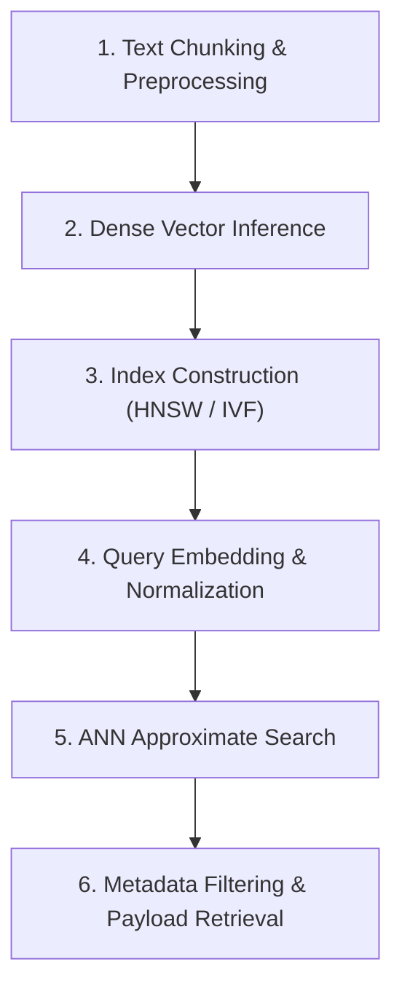

# 📚 DAY 04: BIỂU DIỄN VECTOR & TÌM KIẾM NGỮ NGHĨA (VECTOR EMBEDDINGS & SEMANTIC SEARCH)
> **Khóa học:** COMP2010 - AI in Action (VinUni) | Giảng viên: Mai Anh Nguyen (Blue) | Dung lượng slide gốc: 84 slides (12.4 MB) | **Tối ưu:** Google NotebookLM (< 50MB)

---

## 📌 1. BÀI HỌC HÔM NAY VỀ CÁI GÌ? (THE WHAT & WHY)

*   **Từ Khớp Từ khóa (Lexical Search) đến Hiểu Ngữ nghĩa (Semantic Search):** Tìm kiếm truyền thống dựa trên tần suất từ khóa (TF-IDF, BM25) hoàn toàn bất lực trước hiện tượng đồng nghĩa (Synonyms: 'bệnh viện' vs 'cơ sở y tế') hoặc đa nghĩa (Polysemy: 'ngân hàng' - tài chính vs 'ngân hàng' - mô máu). Vector Embedding giải quyết triệt để vấn đề này bằng cách ánh xạ văn bản thành vector đặc trưng trong không gian đa chiều.
*   **Không gian Biểu diễn Dày đặc (Dense Embedding Spaces):** Các mô hình Embedding hiện đại (như text-embedding-3 của OpenAI, BGE-M3, Cohere v3) nén thông tin ngữ nghĩa của đoạn văn thành vector thực d chiều (ví dụ d = 1536 hoặc 1024). Độ tương đồng ngữ nghĩa được tính toán bằng tích vô hướng hoặc Cosine Similarity giữa hai vector: cos(u, v) = (u · v) / (||u|| ||v||).
*   **Cấu trúc Dữ liệu Tìm kiếm Láng giềng Gần đúng (Approximate Nearest Neighbors - ANN):** Khi cơ sở dữ liệu đạt hàng triệu vector, việc tính khoảng cách vét cạn (Exhaustive kNN) có độ phức tạp O(N·d) gây tắc nghẽn nghiêm trọng. Các cấu trúc chỉ mục ANN hiện đại như HNSW (Hierarchical Navigable Small World) và IVF (Inverted File Index) cho phép tìm kiếm với độ phức tạp logarithmic O(log N) và độ trễ dưới 10ms.
*   **Kỹ thuật Giảm chiều Vector Matryoshka (Matryoshka Representation Learning - MRL):** MRL cho phép cắt ngắn vector embedding (ví dụ từ 1536 chiều xuống còn 256 chiều) mà vẫn giữ được 95%+ năng lực phân loại ngữ nghĩa, giúp tiết kiệm 75% chi phí lưu trữ RAM và tăng tốc độ tính toán lên 4 lần.

---

## 💡 2. ẨN DỤ ĐỜI THƯỜNG: THỰC TRẠNG & GIẢI PHÁP

### 🔴 Thực trạng:
Người dùng tìm kiếm 'cách khắc phục xe không nổ máy', nhưng hệ thống tìm kiếm từ khóa cũ chỉ trả về các bài viết chứa chính xác chữ 'không nổ máy', bỏ qua hàng nghìn tài liệu hữu ích có tiêu đề 'hướng dẫn xử lý ắc-quy hết điện'.

### 🚗 Ẩn dụ đời thường:

> * **1. Tọa độ định vị vệ tinh GPS (Vector Embeddings):** Mỗi khái niệm trong cuộc sống được gắn một tọa độ GPS trong không gian tri thức: 'Trường Đại học' và 'Học viện' nằm sát cạnh nhau dù mặt chữ hoàn toàn khác biệt.
> * **2. Thước đo khoảng cách bay (Cosine Similarity):** Đo góc lệch giữa 2 hướng bay: nếu góc lệch bằng 0 độ (cos = 1), hai ý niệm cùng chung một hướng tư duy và ý nghĩa.
> * **3. Mạng lưới đường cao tốc liên tỉnh (HNSW Graph):** Thay vì đi bộ qua từng ngôi nhà trên toàn quốc để tìm người, ta đi máy bay giữa các thành phố lớn (tầng cao HNSW), sau đó đi đường cao tốc và rẽ vào đường làng (tầng thấp) để đến đích siêu nhanh.
> * **4. Búp bê lồng gỗ Nga (Matryoshka Embeddings):** Búp bê lớn chứa các búp bê nhỏ bên trong: ta có thể chỉ lấy búp bê nhỏ ở lõi để mang đi du lịch gọn nhẹ mà vẫn giữ nguyên hình dáng biểu trưng.

### 🟢 Giải pháp kỹ thuật:
Xây dựng hệ thống tìm kiếm ngữ nghĩa kết hợp mô hình Dense Embedding, cấu trúc chỉ mục đồ thị HNSW và kỹ thuật nén vector MRL.


---

## 🗺️ 3. SƠ ĐỒ PIPELINE & QUY TRÌNH THỰC HIỆN TỪ ĐẦU ĐẾN CUỐI



*   **1. Text Chunking & Preprocessing:** Làm sạch văn bản và phân đoạn thành các chunks có độ dài tối ưu (256 - 512 tokens) kèm overlap.
*   **2. Dense Vector Inference:** Truyền các text chunks qua mô hình Embedding (như BGE-M3) để sinh ra ma trận vector d chiều.
*   **3. Index Construction (HNSW / IVF):** Xây dựng đồ thị liên kết đa tầng HNSW với các siêu tham số M (số liên kết) và efConstruction.
*   **4. Query Embedding & Normalization:** Mã hóa câu hỏi của người dùng thành vector truy vấn và chuẩn hóa độ dài vector (L2 norm).
*   **5. ANN Approximate Search:** Duyệt đồ thị HNSW từ tầng đỉnh xuống tầng đáy để tìm Top-K vector có khoảng cách Cosine gần nhất.
*   **6. Metadata Filtering & Payload Retrieval:** Kết hợp bộ lọc thuộc tính (Scalar Filtering) và trích xuất nội dung văn bản gốc trả về cho người dùng.

---

## 🌐 4. KIẾN THỨC MỞ RỘNG CHUYÊN SÂU (FIRECRAWL RESEARCH)

### Toán học của Cấu trúc Đồ thị HNSW (Malkov & Yashunin, IEEE TPAMI 2020)
HNSW xây dựng cấu trúc đồ thị phân tầng tương tự Skip-List. Tầng trên cùng có mật độ thưa thớt giúp bước nhảy tìm kiếm bao quát khoảng cách xa; các tầng dưới có mật độ dày đặc giúp định vị chính xác điểm cực tiểu cục bộ. Độ phức tạp tìm kiếm đạt O(log N) với tỷ lệ Recall@10 đạt trên 99.2% ngay cả trên các tập dữ liệu quy mô 100 triệu vectors.

### Biểu diễn Đa tầng Matryoshka Representation Learning (Kusupati et al., NeurIPS 2022)
MRL tối ưu hóa hàm mất mát trên nhiều tiền tố độ dài khác nhau của vector đồng thời: Loss = ∑ w_m · L(v_{1:m}). Kết quả là các chiều đầu tiên (ví dụ 128 hoặc 256 chiều đầu) chứa các đặc trưng ngữ nghĩa quan trọng nhất, cho phép hệ thống triển khai tìm kiếm 2 pha: Lọc nhanh trên 256d và Tinh chỉnh chính xác trên 1536d.

### Case Study Thực chiến 1: Hệ thống Tìm kiếm Podcast 100 Triệu Bản ghi của Spotify
Spotify triển khai kiến trúc Dense Vector Search phục vụ hơn 100 triệu tập Podcast trên toàn cầu. Sử dụng chỉ mục HNSW trên hạ tầng phân tán, hệ thống đạt độ trễ p95 < 12ms ở mức tải 45.000 QPS. Việc chuyển từ tìm kiếm từ khóa sang tìm kiếm vector giúp tăng 38.4% thời lượng nghe Podcast nhờ đề xuất chính xác các chủ đề trừu tượng.

### Case Study Thực chiến 2: Tối ưu Hóa Cơ sở Dữ liệu Vector của Cohere Embed v3 trên Milvus
Cohere áp dụng kỹ thuật nén vector MRL trên mô hình Embed v3, cho phép nén vector từ 1024 chiều xuống 256 chiều kết hợp với lượng tử hóa Scalar Quantization (SQ8). Đột phá này giúp giảm 75% dung lượng bộ nhớ RAM trên cụm máy chủ Milvus, giảm 65% chi phí hạ tầng phần cứng mà vẫn giữ được 98.6% độ chính xác tìm kiếm trên bảng xếp hạng MTEB Benchmark.


---

## 🔑 5. BẢNG TỪ KHÓA CỐT LÕI

| Thuật ngữ | Khái niệm kỹ thuật | Giải thích đời thường |
| :--- | :--- | :--- |
| **Vector Embedding** | Bản đồ số hóa chuyển đổi văn bản thành tọa độ vector thực trong không gian đa chiều. | Tọa độ GPS định vị vị trí của ý niệm trên bản đồ tri thức nhân loại. |
| **Cosine Similarity** | Độ đo góc giữa hai vector để xác định mức độ tương đồng ngữ nghĩa (-1 đến 1). | Thước đo góc lệch giữa hai la bàn: chỉ cùng hướng là cùng ý nghĩa. |
| **HNSW Graph** | Cấu trúc dữ liệu đồ thị phân tầng giúp tìm kiếm láng giềng gần nhất siêu tốc. | Hệ thống giao thông phân cấp: đường bay trên cao -> cao tốc -> đường ngõ hẻm. |
| **Dense vs Sparse Vector** | Vector dày đặc (chứa số thực ở mọi chiều) vs Vector thưa thớt (chỉ chứa giá trị tại vị trí từ xuất hiện). | Bức tranh sơn dầu vẽ kín toan vs tờ giấy trắng chỉ chấm vài giọt mực. |
| **Matryoshka Embedding (MRL)** | Kỹ thuật huấn luyện nén vector cho phép cắt ngắn độ dài mà không mất ngữ nghĩa. | Búp bê gỗ Nga: mở lớp ngoài ra vẫn thấy búp bê hoàn chỉnh bên trong. |
| **Recall@K** | Tỷ lệ phần trăm các kết quả thực sự liên quan được tìm thấy trong Top-K kết quả trả về. | Tỷ lệ bắt đúng tội phạm có trong danh sách tình nghi hàng đầu. |

---

## 🎯 6. BỘ CÂU HỎI ÔN THI TRỌNG TÂM (CHUẨN HỌC THUẬT & ĐẠI HỌC)

### 📝 PHẦN A: 4 CÂU TRẮC NGHIỆM ĐƠN (SINGLE-CHOICE)

#### Câu 1: Điểm vượt trội cốt lõi của Tìm kiếm Ngữ nghĩa (Semantic Search) bằng Vector so với Tìm kiếm Từ khóa (BM25) là gì?
*   A. Semantic Search chạy nhanh hơn BM25 trên các máy tính cá nhân đời cũ.
*   B. Semantic Search có khả năng tìm thấy các tài liệu đồng nghĩa hoặc có liên quan về mặt khái niệm ngay cả khi không trùng lặp bất kỳ từ khóa nào.
*   C. Semantic Search không cần bất kỳ không gian bộ nhớ nào để lưu trữ dữ liệu.
*   D. Semantic Search chỉ hoạt động được khi người dùng nhập câu hỏi bằng mã nhị phân.
> **👉 ĐÁP ÁN ĐÚNG: B**  
> **💡 Phân tích & Bẫy logic:**  
> *   **Vì sao B đúng:** Vector Embedding mã hóa ý nghĩa ngữ nghĩa vào không gian tiềm ẩn đa chiều, do đó hai câu có từ ngữ khác nhau nhưng cùng ý nghĩa (ví dụ: 'bác sĩ' và 'thầy thuốc') sẽ có vector nằm gần nhau và được tìm thấy dễ dàng.
> *   **A sai vì:** Tính toán vector đòi hỏi mô hình học sâu và tài nguyên tính toán cao hơn so với giải thuật đếm tần suất từ khóa BM25 đơn giản.
> *   **C sai vì:** Vector database đòi hỏi dung lượng RAM và ổ cứng lớn để lưu trữ các ma trận vector nhiều chiều.
> *   **D sai vì:** Người dùng nhập văn bản ngôn ngữ tự nhiên bình thường, hệ thống tự động gọi mô hình embedding để chuyển thành vector.
---

#### Câu 2: Trong không gian vector, tại sao độ đo Cosine Similarity thường được ưa chuộng hơn khoảng cách Euclid (L2 Distance) khi so sánh văn bản?
*   A. Vì khoảng cách Euclid luôn cho ra kết quả bằng số âm.
*   B. Vì Cosine Similarity tập trung đo lường góc lệch hướng ngữ nghĩa giữa 2 vector và ít bị ảnh hưởng bởi độ dài ngắn của đoạn văn bản.
*   C. Vì Cosine Similarity không yêu cầu tính toán các phép nhân ma trận.
*   D. Vì khoảng cách Euclid bị cấm sử dụng trong các tiêu chuẩn phần mềm quốc tế.
> **👉 ĐÁP ÁN ĐÚNG: B**  
> **💡 Phân tích & Bẫy logic:**  
> *   **Vì sao B đúng:** Cosine Similarity chuẩn hóa độ dài vector và chỉ đo góc lệch: cos(u, v) = (u · v) / (||u|| ||v||), do đó một đoạn văn ngắn và một bài viết dài có cùng chủ đề vẫn có độ tương đồng cosine rất cao.
> *   **A sai vì:** Khoảng cách Euclid luôn là một số thực không âm (L2 ≥ 0).
> *   **C sai vì:** Cosine Similarity vẫn sử dụng phép tính tích vô hướng (Dot Product) của các ma trận/vector.
> *   **D sai vì:** Khoảng cách Euclid vẫn được dùng phổ biến trong nhiều bài toán thị giác máy tính và phân cụm không gian chuẩn hóa.
---

#### Câu 3: Cấu trúc chỉ mục HNSW (Hierarchical Navigable Small World) giải quyết bài toán tìm kiếm vector quy mô lớn nhờ cơ chế nào?
*   A. Quét tuần tự toàn bộ các vector trong cơ sở dữ liệu từ đầu đến cuối.
*   B. Xây dựng đồ thị phân tầng đa lớp cho phép bỏ qua hàng triệu vector không liên quan và tìm kiếm láng giềng gần đúng với độ phức tạp O(log N).
*   C. Nén tất cả các vector thành chuỗi văn bản 1 ký tự.
*   D. Tự động xóa bỏ 90% dữ liệu của người dùng sau mỗi lần truy vấn.
> **👉 ĐÁP ÁN ĐÚNG: B**  
> **💡 Phân tích & Bẫy logic:**  
> *   **Vì sao B đúng:** HNSW sử dụng cấu trúc đồ thị đa tầng (tương tự Skip-List): tầng cao thực hiện các bước nhảy lớn để bao quát không gian, tầng thấp định vị chính xác láng giềng gần nhất, giúp giảm độ phức tạp từ O(N) xuống O(log N).
> *   **A sai vì:** Quét tuần tự là thuật toán tìm kiếm vét cạn (Exhaustive Flat Search) có độ phức tạp O(N), chạy rất chậm khi dữ liệu lớn.
> *   **C sai vì:** Vector được bảo toàn các chiều số thực trong không gian đa chiều, không nén thành 1 ký tự văn bản.
> *   **D sai vì:** HNSW chỉ lập chỉ mục tra cứu, hoàn toàn không xóa dữ liệu của cơ sở dữ liệu.
---

#### Câu 4: Kỹ thuật Matryoshka Representation Learning (MRL) mang lại lợi ích gì cho việc triển khai Vector Database?
*   A. Bắt buộc mô hình phải sinh ra hình ảnh búp bê Nga.
*   B. Cho phép cắt ngắn số chiều của vector (ví dụ từ 1536d xuống 256d) giúp tiết kiệm dung lượng RAM và tăng tốc độ tìm kiếm mà vẫn duy trì độ chính xác cao.
*   C. Tự động chuyển đổi vector thành các file âm thanh MP3.
*   D. Làm tăng gấp 10 lần dung lượng bộ nhớ cần lưu trữ.
> **👉 ĐÁP ÁN ĐÚNG: B**  
> **💡 Phân tích & Bẫy logic:**  
> *   **Vì sao B đúng:** MRL huấn luyện mô hình sao cho các chiều đầu tiên chứa phần lớn thông tin ngữ nghĩa quan trọng, cho phép cắt giảm 75% số chiều vector để tiết kiệm RAM và tăng tốc độ tính toán mà hiệu năng chỉ giảm không đáng kể.
> *   **A sai vì:** Tên gọi Matryoshka là một ẩn dụ khoa học về cấu trúc lồng nhau, không liên quan đến sinh ảnh búp bê.
> *   **C sai vì:** MRL là kỹ thuật biểu diễn vector ngữ nghĩa, không chuyển đổi dữ liệu thành âm thanh MP3.
> *   **D sai vì:** Lợi ích cốt lõi của MRL là giảm dung lượng lưu trữ bộ nhớ chứ không phải làm tăng dung lượng.
---

### 📝 PHẦN B: 2 CÂU TRẮC NGHIỆM NHIỀU ĐÁP ÁN (MULTI-SELECT)

#### Câu 5: Khi phân đoạn văn bản (Text Chunking) để tạo Vector Embeddings cho hệ thống RAG, các kỹ sư cần cân nhắc những yếu tố quan trọng nào?
*   A. Kích thước chunk (Chunk Size) phải đủ lớn để chứa trọn vẹn ngữ cảnh nhưng không quá dài gây loãng vector embedding.
*   B. Độ dài chồng lấn (Chunk Overlap) giữa các đoạn liền kề để tránh việc ngắt đứt thông tin quan trọng ở ranh giới cắt.
*   C. Màu sắc của văn bản trong tệp PDF gốc.
*   D. Tên hãng sản xuất màn hình máy tính của người dùng.
> **👉 ĐÁP ÁN ĐÚNG: A, B**  
> **💡 Phân tích & Bẫy logic:**  
> *   **Phương án A đúng vì:** Chunk quá nhỏ làm mất ngữ cảnh, trong khi chunk quá lớn làm vector embedding bị trung bình hóa và mất tính chi tiết sắc nét.
> *   **Phương án B đúng vì:** Overlap (thường từ 10% - 20%) đảm bảo các câu văn nằm ở biên không bị chia cắt làm đôi, giữ trọn vẹn mạch ý nghĩa.
> *   **Phương án C sai vì:** Màu sắc hiển thị là thuộc tính đồ họa bên ngoài, không ảnh hưởng đến nội dung ký tự văn bản.
> *   **Phương án D sai vì:** Nhà sản xuất màn hình là yếu tố phần cứng hiển thị ngoại vi, hoàn toàn không liên quan đến xử lý ngôn ngữ tự nhiên.
---

#### Câu 6: Những kỹ thuật nào sau đây giúp cải thiện độ chính xác của hệ thống tìm kiếm vector trong môi trường thực tế?
*   A. Kết hợp Tìm kiếm Lai (Hybrid Search): kết hợp điểm số của Dense Semantic Search và Sparse Keyword Search (BM25) qua thuật toán RRF (Reciprocal Rank Fusion).
*   B. Sử dụng mô hình Tái xếp hạng (Cross-Encoder Reranker) trên Top-K kết quả thô ban đầu để chấm điểm tương đồng sâu sắc.
*   C. Xóa bỏ toàn bộ các từ nối và dấu câu trong cơ sở dữ liệu.
*   D. Giới hạn số lượng tài liệu trong cơ sở dữ liệu không vượt quá 10 văn bản.
> **👉 ĐÁP ÁN ĐÚNG: A, B**  
> **💡 Phân tích & Bẫy logic:**  
> *   **Phương án A đúng vì:** Hybrid Search tận dụng thế mạnh của cả hai: BM25 bắt chính xác mã sản phẩm/tên riêng và Dense Vector hiểu ngữ nghĩa trừu tượng.
> *   **Phương án B đúng vì:** Cross-Encoder Reranker cho câu hỏi và tài liệu tương tác qua lại qua các tầng Attention đầy đủ, mang lại độ chính xác cao vượt trội so với Bi-Encoder.
> *   **Phương án C sai vì:** Xóa hết dấu câu và từ nối làm biến dạng ngữ pháp và phá vỡ cấu trúc ngữ nghĩa tự nhiên của đoạn văn.
> *   **Phương án D sai vì:** Hệ thống vector search sinh ra để xử lý quy mô hàng triệu văn bản, không phải giới hạn ở 10 văn bản.
---

---

## 💻 7. CODE THỰC CHIẾN (HANDS-ON PYTHON / PYTORCH)

```python
import torch
import torch.nn.functional as F
from sentence_transformers import SentenceTransformer

# 1. Khởi tạo mô hình Embedding chuyên dụng
model = SentenceTransformer('BAAI/bge-large-en-v1.5')

# 2. Danh sách văn bản tài liệu và câu truy vấn
docs = [
    "Transformer utilizes self-attention mechanism to process tokens in parallel.",
    "Convolutional neural networks excel at spatial feature extraction in computer vision.",
    "KV Cache accelerates autoregressive generation by storing previous key-value tensors."
]
query = "How does Transformer achieve parallel processing across sequence length?"

# 3. Mã hóa văn bản thành Dense Vectors (d = 1024)
doc_embeddings = model.encode(docs, convert_to_tensor=True)
query_embedding = model.encode(query, convert_to_tensor=True)

# 4. Chuẩn hóa L2-norm để tối ưu hóa phép tính Cosine
doc_norm = F.normalize(doc_embeddings, p=2, dim=1)
query_norm = F.normalize(query_embedding, p=2, dim=0)

# 5. Tính toán ma trận độ tương đồng Cosine Similarity qua Dot Product
similarities = torch.matmul(doc_norm, query_norm)
top_k_indices = torch.topk(similarities, k=2).indices

print(f"Top 1 Relevant Doc: {docs[top_k_indices[0]]} (Score: {similarities[top_k_indices[0]]:.4f})")
```

---

## ⚠️ 8. BẪY LỖI KỸ THUẬT & CÁCH DEBUG (COMMON PITFALLS & TROUBLESHOOTING)

1.  **🔴 Bẫy Lỗi 1: Không chuẩn hóa L2 Norm trước khi tính Dot Product.**
    *   *Nguyên nhân:* Khi sử dụng độ đo Dot Product mà vector chưa chuẩn hóa (||v|| != 1), tài liệu có độ dài văn bản dài hơn sẽ có vector magnitude lớn hơn và bị thiên lệch điểm cao giả tạo.
    *   *Cách khắc phục:* Luôn áp dụng `F.normalize(vectors, p=2, dim=-1)` hoặc chuyển cấu hình Vector DB sang metric `Cosine`.
2.  **🔴 Bẫy Lỗi 2: Hiện tượng Embedding Drift khi nâng cấp Model.**
    *   *Nguyên nhân:* Nâng cấp mô hình từ version cũ sang version mới nhưng không re-index lại kho dữ liệu cũ, khiến vector query và vector doc nằm ở hai không gian tiềm ẩn hoàn toàn khác nhau.
    *   *Cách khắc phục:* Thiết lập quy trình versioning Vector Collection (ví dụ `kb_docs_v2_bge_large`) và chạy offline pipeline re-embedding trước khi trỏ production traffic sang collection mới.
3.  **🔴 Bẫy Lỗi 3: Chunking cắt đứt ngữ cảnh thực thể (Entity Splitting).**
    *   *Nguyên nhân:* Sử dụng Fixed-length Character Chunking cắt ngang giữa tên riêng hoặc số liệu bảng biểu.
    *   *Cách khắc phục:* Áp dụng Semantic Chunking hoặc Markdown-aware Header Chunking kèm 10-15% Chunk Overlap.

---

## ⚖️ 9. BẢNG SO SÁNH TRADE-OFFS & ĐIỀU KIỆN ÁP DỤNG

| Công nghệ / Giải pháp | Ưu điểm vượt trội | Nhược điểm & Rủi ro | Điều kiện khuyên dùng |
| :--- | :--- | :--- | :--- |
| **Dense Vector Search (HNSW)** | Nắm bắt 100% ngữ nghĩa sâu, hiểu từ đồng nghĩa | Tốn RAM, chi phí tính toán cao, dễ trôi dạt mã ID | Tìm kiếm ngữ nghĩa tổng quát, RAG kiến thức mở |
| **Sparse Search (BM25 / SPLADE)**| Chính xác tuyệt đối mã SKU, tên riêng, ít tốn RAM | Không hiểu từ đồng nghĩa, gãy đổ khi sai chính tả | Tra cứu mã lỗi, số seri sản phẩm, điều khoản luật |
| **Hybrid Search (Dense + BM25 + RRF)**| Kết hợp độ chính xác từ khóa và độ sâu ngữ nghĩa | Gấp đôi chi phí lưu trữ và độ trễ truy vấn | Hệ thống Enterprise Search & RAG Production |
