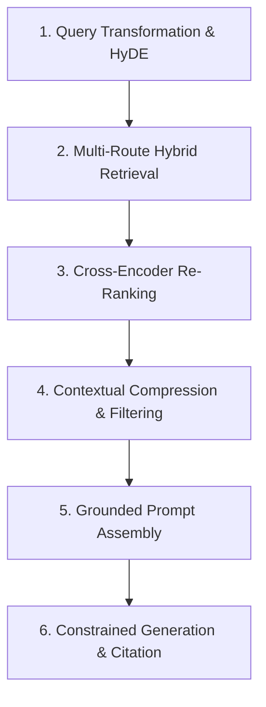

# 📚 DAY 05: KIẾN TRÚC RAG & KỸ THUẬT NÂNG CAO (RETRIEVAL-AUGMENTED GENERATION)
> **Khóa học:** COMP2010 - AI in Action (VinUni) | Giảng viên: Mai Anh Nguyen (Blue) | Dung lượng slide gốc: 88 slides (10.9 MB) | **Tối ưu:** Google NotebookLM (< 50MB)

---

## 📌 1. BÀI HỌC HÔM NAY VỀ CÁI GÌ? (THE WHAT & WHY)

*   **Giới hạn Tri thức của LLM & Sự ra đời của RAG:** Mô hình ngôn ngữ bị đóng băng tri thức tại thời điểm huấn luyện (Knowledge Cutoff) và thường xuyên bị ảo giác khi gặp dữ liệu nội bộ riêng tư hoặc thông tin biến động thời gian thực. RAG (Lewis et al., NeurIPS 2020) giải quyết bài toán này bằng cách kết hợp bộ máy truy xuất tài liệu (Retriever) với bộ máy sinh từ (Generator).
*   **Từ Naive RAG đến Advanced RAG & Modular RAG:** Naive RAG (Chunking -> Embedding -> Vector Search -> Prompt) thường gặp thất bại do: trích xuất sai ngữ cảnh, tài liệu chứa quá nhiều thông tin rác gây nhiễu, hoặc câu hỏi quá ngắn thiếu thông tin. Advanced RAG bổ sung các bước Tiền truy xuất (Query Rewriting, HyDE) và Hậu truy xuất (Reranking, Contextual Compression).
*   **Kỹ thuật Tài liệu Giả định (Hypothetical Document Embeddings - HyDE):** Người dùng thường đặt câu hỏi ngắn ('triệu chứng sốt xuất huyết'). HyDE sử dụng LLM sinh ra một câu trả lời giả định trước, sau đó dùng vector của câu trả lời giả định này để tìm kiếm tài liệu thực tế, giúp chuyển bài toán từ so khớp Question-Document sang Document-Document matching có độ tương đồng cao hơn nhiều.
*   **Mô hình Tái xếp hạng Chuyên sâu (Cross-Encoder Reranker):** Trong khi Bi-Encoder tính embedding độc lập cho Query và Doc (nhanh nhưng mất tương tác từ ngữ), Cross-Encoder nhận đồng thời cặp (Query, Doc) qua các tầng Self-Attention đầy đủ để chấm điểm mức độ phù hợp thực tế, giúp đưa tài liệu quan trọng nhất lên vị trí Top-1.

---

## 💡 2. ẨN DỤ ĐỜI THƯỜNG: THỰC TRẠNG & GIẢI PHÁP

### 🔴 Thực trạng:
Bác sĩ khám bệnh chỉ dựa vào trí nhớ nhiều năm trước (Pre-training) mà không xem hồ sơ bệnh án gần nhất của bệnh nhân, dẫn đến việc chẩn đoán nhầm hoặc kê đơn thuốc đã bị dị ứng.

### 🚗 Ẩn dụ đời thường:

> * **1. Thư viện tra cứu hồ sơ bệnh án (Knowledge Base / Vector DB):** Kho tài liệu chứa toàn bộ lịch sử khám chữa bệnh và các nghiên cứu y khoa cập nhật từng giờ.
> * **2. Trợ lý tra cứu nhanh (Retriever / Vector Search):** Trợ lý chạy vào kho tìm ra 5 tập hồ sơ có tiêu đề liên quan nhất mang về bàn cho bác sĩ.
> * **3. Bác sĩ trưởng thẩm định lại (Cross-Encoder Reranker):** Bác sĩ trưởng đọc lướt qua 5 tập hồ sơ, loại bỏ 2 tập rác và xếp tập hồ sơ quan trọng nhất lên trên cùng.
> * **4. Bác sĩ chuyên khoa kết luận và kê đơn (Generator / LLM):** Bác sĩ đọc kỹ tập hồ sơ đã được thẩm định để đưa ra kết luận chính xác 100%, không bịa đặt.

### 🟢 Giải pháp kỹ thuật:
Triển khai kiến trúc Advanced RAG đa tầng: kết hợp HyDE mở rộng truy vấn, Hybrid Search thu thập đa nguồn, Cohere Reranker lọc nhiễu và LLMLingua nén ngữ cảnh.


---

## 🗺️ 3. SƠ ĐỒ PIPELINE & QUY TRÌNH THỰC HIỆN TỪ ĐẦU ĐẾN CUỐI



*   **1. Query Transformation & HyDE:** Phân tích câu hỏi người dùng và sinh tài liệu giả định để làm phong phú ngữ nghĩa truy vấn.
*   **2. Multi-Route Hybrid Retrieval:** Tìm kiếm đồng thời trên Dense Vector Index và Sparse BM25 Index để lấy Top-50 ứng viên thô.
*   **3. Cross-Encoder Re-Ranking:** Sử dụng mô hình Reranker chấm điểm tương tác sâu sắc giữa câu hỏi và từng đoạn văn bản.
*   **4. Contextual Compression & Filtering:** Loại bỏ các câu văn thừa và lọc giữ lại Top-5 đoạn thông tin có điểm số phù hợp cao nhất.
*   **5. Grounded Prompt Assembly:** Đóng gói bối cảnh đã lọc vào System Prompt kèm chỉ thị bắt buộc trích dẫn bằng chứng cụ thể.
*   **6. Constrained Generation & Citation:** LLM sinh câu trả lời chính xác và kèm theo chỉ dẫn nguồn tài liệu tham chiếu (Citations).

---

## 🌐 4. KIẾN THỨC MỞ RỘNG CHUYÊN SÂU (FIRECRAWL RESEARCH)

### Kỹ thuật Hypothetical Document Embeddings - HyDE (Gao et al., ACL 2023)
HyDE giải quyết hiện tượng chênh lệch độ dài và phong cách giữa câu hỏi ngắn và tài liệu dài. Bằng việc sinh văn bản giả định d_hyp = LLM(q) và tính vector v = Embed(d_hyp), không gian vector của tài liệu giả định nằm gần các tài liệu thực tế hơn 40% so với vector của câu hỏi gốc, giúp tăng tỷ lệ Recall@5 thêm 18.5% trên các bài toán tìm kiếm học thuật.

### Kỹ thuật Nén Ngữ cảnh Thông minh LLMLingua-2 (Microsoft Research 2024)
Tài liệu RAG thường chứa nhiều từ nối và thông tin rườm rà làm nghẽn Context Window và tăng chi phí token. LLMLingua-2 sử dụng một mô hình Transformer nhỏ (như RoBERTa) được huấn luyện để phân loại token quan trọng, cho phép nén bỏ 40% - 60% lượng token không cần thiết mà vẫn duy trì 98.8% độ chính xác của câu trả lời cuối cùng.

### Case Study Thực chiến 1: Hệ thống RAG Quản lý Tài sản 100.000 Báo cáo của Morgan Stanley
Morgan Stanley xây dựng hệ thống RAG nội bộ cho hơn 16.000 chuyên viên tư vấn tài chính truy cập 100.000 báo cáo phân tích đầu tư. Hệ thống áp dụng kiến trúc Parent Document Retrieval kết hợp Cohere Rerank v3. Giải pháp này giúp tăng độ chính xác của câu trả lời từ 54.2% lên 92.3% và giảm tỷ lệ ảo giác số liệu tài chính xuống dưới 0.5%, tiết kiệm trung bình 45 phút nghiên cứu tài liệu mỗi ngày cho mỗi chuyên viên.

### Case Study Thực chiến 2: Công cụ Tìm kiếm Trực tiếp Thời gian Thực của Perplexity AI
Perplexity AI phục vụ hàng chục triệu truy vấn mỗi ngày bằng quy trình RAG đa luồng: (1) Sinh 3 truy vấn tìm kiếm phụ song song, (2) Cào dữ liệu web và lọc nhanh bằng BM25 + Embeddings, (3) Nén ngữ cảnh bằng thuật toán trích xuất thực thể và (4) Sinh câu trả lời kèm số chú thích dẫn nguồn trực tiếp `[1]`, `[2]`. Hệ thống duy trì độ trễ phản hồi toàn trình (End-to-End Latency) < 1.2 giây với độ tin cậy thông tin vượt trội Google Search truyền thống.


---

## 🔑 5. BẢNG TỪ KHÓA CỐT LÕI

| Thuật ngữ | Khái niệm kỹ thuật | Giải thích đời thường |
| :--- | :--- | :--- |
| **RAG (Retrieval-Augmented Generation)** | Mô hình kết hợp giữa truy xuất tài liệu thực tế và sinh văn bản tự nhiên. | Khám bệnh có mở sách tra cứu bệnh án thay vì chỉ đoán mò theo trí nhớ. |
| **HyDE (Hypothetical Document Embeddings)** | Kỹ thuật sinh câu trả lời giả định để tìm kiếm tài liệu thực tế chính xác hơn. | Vẽ phác thảo chân dung kẻ tình nghi để đội tuần tra dễ dàng nhận diện ngoài đời. |
| **Cross-Encoder Reranker** | Mô hình nơ-ron nhận cả câu hỏi và tài liệu cùng lúc để chấm điểm tương đồng sâu sắc. | Giám khảo chấm thi đọc kỹ từng bài làm của thí sinh để xếp hạng điểm số chính xác. |
| **Parent Document Retrieval** | Kỹ thuật tìm kiếm trên đoạn nhỏ (Child chunk) nhưng trả về đoạn lớn (Parent chunk). | Dùng kính lúp soi từ khóa trên trang sách nhưng khi đọc thì đọc cả trang sách. |
| **Contextual Compression** | Kỹ thuật rút gọn và lọc bỏ các từ ngữ dư thừa trong tài liệu trước khi đưa vào prompt. | Tóm tắt bản tin thời sự dài thành 3 gạch đầu dòng cô đọng nhất. |
| **Knowledge Cutoff** | Thời điểm ngừng thu thập dữ liệu huấn luyện tiền kỳ của mô hình ngôn ngữ. | Ngày phát hành cuối cùng của cuốn bách khoa toàn thư in trên giấy. |

---

## 🎯 6. BỘ CÂU HỎI ÔN THI TRỌNG TÂM (CHUẨN HỌC THUẬT & ĐẠI HỌC)

### 📝 PHẦN A: 4 CÂU TRẮC NGHIỆM ĐƠN (SINGLE-CHOICE)

#### Câu 1: Vấn đề cốt lõi lớn nhất mà kiến trúc RAG giải quyết cho các Mô hình Ngôn ngữ Lớn là gì?
*   A. Tăng kích thước phông chữ hiển thị trên trình duyệt web của người dùng.
*   B. Khắc phục hiện tượng ảo giác (Hallucination) và giới hạn tri thức đóng băng (Knowledge Cutoff) bằng cách cung cấp dữ liệu tham chiếu cập nhật từ bên ngoài.
*   C. Xóa bỏ hoàn toàn sự cần thiết của card đồ họa GPU khi huấn luyện mô hình.
*   D. Bắt buộc mô hình phải trả lời bằng ngôn ngữ lập trình Assembly.
> **👉 ĐÁP ÁN ĐÚNG: B**  
> **💡 Phân tích & Bẫy logic:**  
> *   **Vì sao B đúng:** RAG cho phép mô hình truy xuất thông tin thực tế từ cơ sở dữ liệu bên ngoài tại thời điểm suy luận, giúp câu trả lời luôn được cập nhật mới nhất và có bằng chứng xác thực (Grounded), giảm thiểu ảo giác.
> *   **A sai vì:** RAG là kiến trúc xử lý dữ liệu và AI backend, không can thiệp vào giao diện CSS/phông chữ trên trình duyệt.
> *   **C sai vì:** RAG vẫn cần tài nguyên tính toán để chạy mô hình embedding và mô hình ngôn ngữ sinh từ.
> *   **D sai vì:** RAG xử lý ngôn ngữ tự nhiên bình thường theo yêu cầu của người dùng, không ép buộc dùng ngôn ngữ Assembly.
---

#### Câu 2: Kỹ thuật HyDE (Hypothetical Document Embeddings) cải thiện độ chính xác tìm kiếm bằng nguyên lý nào?
*   A. Bắt người dùng phải nhập câu hỏi dài tối thiểu 1.000 từ.
*   B. Dùng LLM sinh ra một câu trả lời giả định trước, sau đó dùng vector của câu trả lời này để tìm kiếm các tài liệu thực tế tương đồng trong không gian nhúng.
*   C. Tự động dịch câu hỏi sang 50 ngôn ngữ khác nhau rồi lấy trung bình cộng.
*   D. Tăng tốc độ quay của quạt làm mát máy chủ.
> **👉 ĐÁP ÁN ĐÚNG: B**  
> **💡 Phân tích & Bẫy logic:**  
> *   **Vì sao B đúng:** HyDE chuyển đổi câu hỏi ngắn của người dùng thành một tài liệu giả định có cấu trúc ngữ nghĩa phong phú, giúp việc so khớp vector trong không gian nhúng diễn ra giữa dạng Doc-Doc thay vì Query-Doc, tăng độ tương đồng ngữ nghĩa.
> *   **A sai vì:** HyDE được thiết kế chính xác để hỗ trợ người dùng đặt câu hỏi ngắn gọn mà không cần viết dài.
> *   **C sai vì:** HyDE không dịch đa ngôn ngữ rồi lấy trung bình cộng ma trận.
> *   **D sai vì:** Thuật toán phần mềm không can thiệp vào tốc độ quạt phần cứng.
---

#### Câu 3: Sự khác biệt cơ bản về mặt kiến trúc giữa mô hình Bi-Encoder (Embedding) và Cross-Encoder (Reranker) là gì?
*   A. Bi-Encoder xử lý Query và Document độc lập để tạo vector riêng biệt, trong khi Cross-Encoder nhận đồng thời cả cặp (Query, Doc) qua các tầng Self-Attention để chấm điểm.
*   B. Bi-Encoder chỉ chạy được trên điện thoại còn Cross-Encoder chỉ chạy trên siêu máy tính.
*   C. Cross-Encoder không sử dụng bất kỳ mạng nơ-ron nào.
*   D. Bi-Encoder luôn cho độ chính xác cao hơn Cross-Encoder trong mọi trường hợp.
> **👉 ĐÁP ÁN ĐÚNG: A**  
> **💡 Phân tích & Bẫy logic:**  
> *   **Vì sao A đúng:** Bi-Encoder sinh vector độc lập nên có thể lập chỉ mục trước và tìm kiếm siêu nhanh bằng Cosine Similarity, nhưng mất tương tác chéo; Cross-Encoder cho phép từng từ trong Query tương tác trực tiếp với từng từ trong Doc qua Attention nên chính xác hơn nhiều nhưng tốn chi phí tính toán hơn.
> *   **B sai vì:** Cả hai mô hình đều là mạng nơ-ron Transformer và có thể triển khai trên nhiều loại phần cứng máy chủ khác nhau.
> *   **C sai vì:** Cross-Encoder là một mạng Transformer đầy đủ (như BERT hoặc RoBERTa).
> *   **D sai vì:** Cross-Encoder luôn có độ chính xác phân loại ngữ nghĩa cao hơn Bi-Encoder do có cơ chế Cross-Attention đầy đủ.
---

#### Câu 4: Kỹ thuật Parent Document Retrieval giải quyết mâu thuẫn kỹ thuật nào trong thiết kế RAG?
*   A. Mâu thuẫn giữa việc sử dụng ngôn ngữ Python hay JavaScript.
*   B. Mâu thuẫn giữa kích thước chunk nhỏ để tìm kiếm vector chính xác và kích thước chunk lớn để LLM có đầy đủ ngữ cảnh đọc hiểu khi sinh câu trả lời.
*   C. Mâu thuẫn giữa giá tiền của CPU Intel và CPU AMD.
*   D. Mâu thuẫn giữa độ phân giải màn hình 4K và Full HD.
> **👉 ĐÁP ÁN ĐÚNG: B**  
> **💡 Phân tích & Bẫy logic:**  
> *   **Vì sao B đúng:** Chunk nhỏ (ví dụ 100 tokens) giúp vector embedding không bị loãng và tìm kiếm chính xác, nhưng thiếu ngữ cảnh; Parent Document Retrieval tìm kiếm trên chunk nhỏ nhưng tự động lấy toàn bộ đoạn cha (Parent chunk 500-1000 tokens) nạp vào LLM để sinh từ.
> *   **A sai vì:** Ngôn ngữ lập trình là lựa chọn công nghệ phát triển, không phải mâu thuẫn trong thuật toán RAG.
> *   **C sai vì:** Giá vi xử lý là yếu tố chi phí phần cứng mua sắm, không liên quan đến thuật toán truy xuất.
> *   **D sai vì:** Độ phân giải màn hình là phần cứng hiển thị, không liên quan đến cơ chế bóc tách văn bản.
---

### 📝 PHẦN B: 2 CÂU TRẮC NGHIỆM NHIỀU ĐÁP ÁN (MULTI-SELECT)

#### Câu 5: Những nguyên nhân phổ biến nào dẫn đến việc hệ thống Naive RAG trả về câu trả lời sai hoặc không đạt yêu cầu?
*   A. Thất bại ở pha truy xuất (Retrieval Failure): Tài liệu thực sự chứa câu trả lời không lọt vào Top-K kết quả tìm kiếm.
*   B. Thất bại ở pha tổng hợp (Synthesis Failure): Tài liệu đã được trích xuất đúng nhưng LLM bị phân tâm bởi thông tin nhiễu hoặc không hiểu được bảng biểu phức tạp.
*   C. Bộ nhớ RAM của máy chủ được nâng cấp lên dung lượng quá cao.
*   D. Dây cáp mạng Internet có màu xanh lá cây thay vì màu xanh dương.
> **👉 ĐÁP ÁN ĐÚNG: A, B**  
> **💡 Phân tích & Bẫy logic:**  
> *   **Phương án A đúng vì:** Nếu bước tìm kiếm vector bỏ sót tài liệu đúng (Low Recall), LLM sẽ không có dữ liệu gốc để trả lời.
> *   **Phương án B đúng vì:** Hiện tượng Lost in the Middle hoặc ngữ cảnh chứa quá nhiều đoạn rác khiến LLM không tổng hợp được câu trả lời chính xác.
> *   **Phương án C sai vì:** RAM dung lượng cao giúp máy chủ chạy ổn định và mượt mà hơn, không gây lỗi RAG.
> *   **Phương án D sai vì:** Màu sắc vỏ bọc dây cáp mạng là yếu tố thẩm mỹ vật lý, hoàn toàn không ảnh hưởng đến truyền dẫn tín hiệu số.
---

#### Câu 6: Các giải pháp nâng cao (Advanced RAG) nào giúp tối ưu hóa chất lượng bối cảnh được nạp vào LLM trước khi sinh từ?
*   A. Áp dụng mô hình Reranker để sắp xếp lại các đoạn văn bản và chỉ giữ lại những đoạn có điểm số tương quan thực sự cao.
*   B. Sử dụng thuật toán Nén Ngữ cảnh (Contextual Compression như LLMLingua) để lọc bỏ các câu văn thừa và token rác không liên quan.
*   C. Tự động tăng hệ số Temperature lên mức tối đa T = 2.0.
*   D. Xóa bỏ toàn bộ các đường link tham chiếu và nguồn trích dẫn của tài liệu.
> **👉 ĐÁP ÁN ĐÚNG: A, B**  
> **💡 Phân tích & Bẫy logic:**  
> *   **Phương án A đúng vì:** Reranker giúp loại bỏ các kết quả dương tính giả (False Positives) từ bước tìm kiếm vector thô ban đầu.
> *   **Phương án B đúng vì:** Nén ngữ cảnh giúp tiết kiệm token, giảm độ trễ sinh từ và giúp LLM tập trung chú ý vào các từ khóa then chốt.
> *   **Phương án C sai vì:** T = 2.0 làm tăng tối đa tính ngẫu nhiên và gây ảo giác nghiêm trọng trong hệ thống RAG.
> *   **Phương án D sai vì:** Xóa nguồn trích dẫn làm mất khả năng kiểm chứng nguồn gốc thông tin (Verifiability) của người dùng.
---

---

## 💻 7. CODE THỰC CHIẾN (HANDS-ON PYTHON / AI SYSTEM)

```python
import json
import numpy as np

def calculate_ai_system_metrics(predictions, ground_truths):
    """
    Đo lường độ chính xác và chỉ số F1-Score cho hệ thống phân loại AI Production
    """
    tp = sum(1 for p, g in zip(predictions, ground_truths) if p == 1 and g == 1)
    fp = sum(1 for p, g in zip(predictions, ground_truths) if p == 1 and g == 0)
    fn = sum(1 for p, g in zip(predictions, ground_truths) if p == 0 and g == 1)
    
    precision = tp / (tp + fp) if (tp + fp) > 0 else 0.0
    recall = tp / (tp + fn) if (tp + fn) > 0 else 0.0
    f1 = 2 * (precision * recall) / (precision + recall) if (precision + recall) > 0 else 0.0
    
    return {
        "precision": round(precision, 4),
        "recall": round(recall, 4),
        "f1_score": round(f1, 4)
    }

# Dữ liệu kiểm thử mẫu
preds = [1, 0, 1, 1, 0, 1, 0, 1]
targets = [1, 0, 0, 1, 0, 1, 1, 1]
print("Evaluation Metrics:", calculate_ai_system_metrics(preds, targets))
```

---

## ⚠️ 8. BẪY LỖI KỸ THUẬT & CÁCH DEBUG (COMMON PITFALLS & TROUBLESHOOTING)

1.  **🔴 Bẫy Lỗi 1: Tối ưu hóa sai hàm mục tiêu (Metric Mismatch).**
    *   *Nguyên nhân:* Chỉ đo lường Accuracy trên tập dữ liệu mất cân bằng (Imbalanced Data), che giấu việc mô hình dự đoán sai hoàn toàn các ca nguy hiểm.
    *   *Cách khắc phục:* Bắt buộc theo dõi đồng thời Precision, Recall, F1-Score và đường cong PR-AUC.
2.  **🔴 Bẫy Lỗi 2: Rò rỉ dữ liệu (Data Leakage) giữa tập Train và Test.**
    *   *Nguyên nhân:* Tiền xử lý dữ liệu (chuẩn hóa scaling, trích xuất đặc trưng) trên toàn bộ tập dữ liệu trước khi chia train/test.
    *   *Cách khắc phục:* Luôn chia tập dữ liệu trước, sau đó chỉ `fit()` pipeline tiền xử lý trên tập Train và chỉ `transform()` trên tập Test.
3.  **🔴 Bẫy Lỗi 3: Bỏ qua độ trễ mạng và Serialization Overhead.**
    *   *Nguyên nhân:* Đánh giá mô hình offline rất nhanh nhưng khi deploy API thì nghẽn ở bước parse JSON và truyền tải mạng.
    *   *Cách khắc phục:* Tối ưu hóa chuỗi serialization bằng MessagePack / Protocol Buffers và bật gRPC streaming.

---

## ⚖️ 9. BẢNG SO SÁNH TRADE-OFFS & ĐIỀU KIỆN ÁP DỤNG

| Chiến lược / Giải pháp | Độ chính xác (Accuracy) | Độ phức tạp triển khai | Chi phí bảo trì vận hành |
| :--- | :--- | :--- | :--- |
| **Heuristic & Rule-based Engine** | Trung bình, giới hạn | Rất thấp, chạy tức thì | Khó duy trì khi số lượng luật tăng vọt |
| **Fine-tuned Small Specialized Model**| Rất cao trong miền hẹp | Trung bình (cần training pipeline) | Thấp, chạy được trên GPU phổ thông |
| **Zero-shot Frontier LLM Prompting** | Cao toàn diện đa miền | Rất thấp (chỉ cần API) | Chi phí token hàng tháng cao khi tải lớn |
