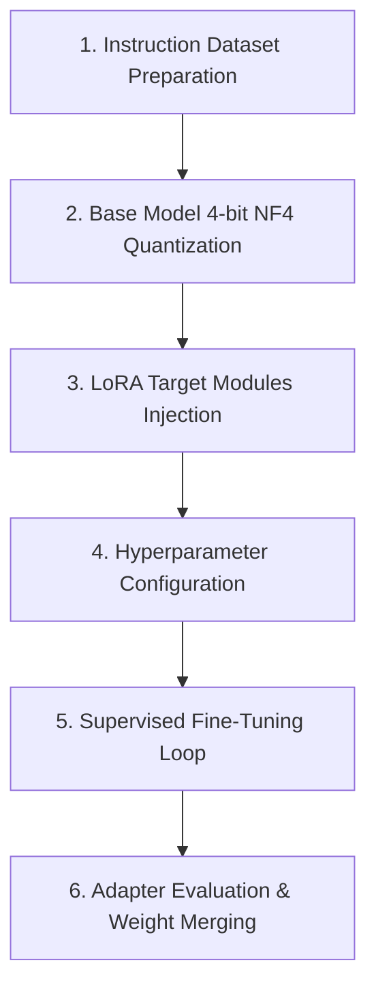

# 📚 DAY 06: TINH CHỈNH MÔ HÌNH HIỆU QUẢ THAM SỐ (FINE-TUNING, PEFT, LORA & QLORA)
> **Khóa học:** COMP2010 - AI in Action (VinUni) | Giảng viên: Mai Anh Nguyen (Blue) | Dung lượng slide gốc: 78 slides (11.2 MB) | **Tối ưu:** Google NotebookLM (< 50MB)

---

## 📌 1. BÀI HỌC HÔM NAY VỀ CÁI GÌ? (THE WHAT & WHY)

*   **Giới hạn của Prompting vs Sức mạnh của Fine-tuning:** Prompting chỉ thay đổi ngữ cảnh tạm thời trong Inference, trong khi Fine-tuning cập nhật trực tiếp ma trận tri thức của mô hình để ghi nhớ sâu sắc thuật ngữ chuyên ngành, định dạng dữ liệu phức tạp và phong cách ngôn ngữ doanh nghiệp mà không cần tốn token cho Few-Shot.
*   **Kỹ thuật Phân rã Hạng Thấp LoRA (Low-Rank Adaptation - Hu et al., ICLR 2022):** Thay vì cập nhật toàn bộ ma trận trọng số gốc W_0 ∈ R^(d × k) với hàng tỷ tham số, LoRA đóng băng W_0 và thêm vào nhánh song song gồm 2 ma trận phân rã nhỏ B ∈ R^(d × r) và A ∈ R^(r × k) với hạng r << min(d, k). Trọng số hiệu dụng: W = W_0 + (alpha / r) * B · A, giúp giảm 99% số lượng tham số cần huấn luyện.
*   **Đột phá Lượng tử hóa 4-bit QLoRA (Dettmers et al., NeurIPS 2023):** QLoRA kết hợp lượng tử hóa mô hình gốc sang định dạng 4-bit NormalFloat (NF4), Lượng tử hóa kép (Double Quantization) để tiết kiệm thêm bộ nhớ footprint, và Trình tối ưu hóa phân trang (Paged Optimizers). Đột phá này cho phép fine-tune mô hình 70B tham số trên các card đồ họa thương mại 24GB VRAM.
*   **Hiện tượng Quên Thảm họa (Catastrophic Forgetting) & Replay Regularization:** Khi fine-tuning trên một miền dữ liệu hẹp, mô hình có xu hướng bị mất đi năng lực lập luận tổng quát ban đầu. Giải pháp chuẩn công nghiệp là trộn thêm 10% - 20% dữ liệu hướng dẫn tổng quát (General Instruction Replay) vào tập huấn luyện.

---

## 💡 2. ẨN DỤ ĐỜI THƯỜNG: THỰC TRẠNG & GIẢI PHÁP

### 🔴 Thực trạng:
Doanh nghiệp muốn đào tạo một bác sĩ chuyên khoa tim mạch, nhưng việc đào tạo lại từ mẫu giáo (Full Pre-training) tốn kém hàng chục triệu USD, trong khi chỉ dặn dò vài câu (Prompting) thì bác sĩ hay quên các phác đồ phức tạp.

### 🚗 Ẩn dụ đời thường:

> * **1. Bộ não nền tảng đại học y khoa (Frozen Base Model W_0):** Bác sĩ đã có sẵn nền tảng kiến thức y học đại cương 6 năm; bộ não này được đóng băng hoàn toàn để không bị xáo trộn kiến thức gốc.
> * **2. Cuốn sổ tay chuyên khoa tim mạch (LoRA Adapter Matrices B · A):** Bác sĩ chỉ cần ghi chép thêm một cuốn sổ tay mỏng chứa các phác đồ tim mạch chuyên sâu (r = 16). Khi khám bệnh, bác sĩ mở não gốc cộng thêm kiến thức trong sổ tay.
> * **3. Kỹ thuật viết tắt siêu nén trong sổ tay (4-bit NF4 Quantization):** Thay vì ghi chữ to tốn giấy, bác sĩ dùng hệ thống ký hiệu viết tắt siêu gọn giúp cuốn sổ tay nhét vừa túi áo blouse nhỏ gọn.
> * **4. Thường xuyên ôn lại kiến thức cấp cứu tổng quát (Replay Buffer):** Mỗi tuần bác sĩ dành 1 buổi trực cấp cứu đa khoa để không bị mai một các phản xạ y khoa cơ bản.

### 🟢 Giải pháp kỹ thuật:
Áp dụng kỹ thuật QLoRA 4-bit kết hợp với tập dữ liệu Replay đa miền để tinh chỉnh mô hình chuyên sâu với chi phí phần cứng tối thiểu.


---

## 🗺️ 3. SƠ ĐỒ PIPELINE & QUY TRÌNH THỰC HIỆN TỪ ĐẦU ĐẾN CUỐI



*   **1. Instruction Dataset Preparation:** Thu thập, làm sạch và định dạng tập dữ liệu câu hỏi - câu trả lời chất lượng cao theo chuẩn ShareGPT/Alpaca.
*   **2. Base Model 4-bit NF4 Quantization:** Nạp mô hình gốc ở chế độ 4-bit NormalFloat kèm bộ lượng tử hóa kép Double Quantization bằng bitsandbytes.
*   **3. LoRA Target Modules Injection:** Gắn các adapter ma trận A và B vào các tầng Attention (q_proj, k_proj, v_proj, o_proj) và MLP.
*   **4. Hyperparameter Configuration:** Thiết lập Rank r (8 - 64), hệ số tỷ lệ Alpha (16 - 128), Dropout và Learning Rate phù hợp (2e-4).
*   **5. Supervised Fine-Tuning Loop:** Huấn luyện trên GPU với bộ tối ưu Paged AdamW và kỹ thuật Gradient Accumulation.
*   **6. Adapter Evaluation & Weight Merging:** Đánh giá chất lượng trên tập test độc lập, sau đó ghép (merge) vĩnh viễn trọng số LoRA vào mô hình gốc để phục vụ suy luận.

---

## 🌐 4. KIẾN THỨC MỞ RỘNG CHUYÊN SÂU (FIRECRAWL RESEARCH)

### Toán học của Ma trận Phân rã Hạng thấp LoRA (Hu et al., ICLR 2022)
Giả thuyết chiều nội tại (Intrinsic Dimensionality) của Aghajanyan et al. chỉ ra rằng sự thay đổi trọng số ma trận Delta W trong quá trình thích ứng tác vụ thực chất nằm trong một không gian con có số chiều rất thấp. Bằng việc phân rã Delta W = B · A với B khởi tạo bằng 0 và A khởi tạo theo phân phối Gauss N(0, sigma^2), LoRA đảm bảo Delta W = 0 tại bước bắt đầu huấn luyện, giúp quá trình hội tụ diễn ra vô cùng ổn định.

### Cơ chế Lượng tử hóa Thông tin Tối ưu NF4 trong QLoRA (Dettmers et al., 2023)
Kiểu dữ liệu 4-bit NormalFloat (NF4) được thiết kế dựa trên phân phối chuẩn của các trọng số mạng nơ-ron tiền kỳ. Mỗi khoảng phân vị (Quantile) của phân phối chuẩn N(0, 1) chứa lượng thông tin bằng nhau (Equal Information Content), giúp giảm sai số lượng tử hóa (Quantization Error) thấp hơn đáng kể so với kiểu số thực 4-bit thông thường (FP4).

### Case Study Thực chiến 1: Tinh chỉnh Mô hình Hỗ trợ Khách hàng của Uber bằng QLoRA
Uber tinh chỉnh mô hình LLaMA-3-8B trên 500.000 vé hỗ trợ khách hàng đa ngôn ngữ bằng kỹ thuật QLoRA. Thay vì cần cụm 4 card NVIDIA A100 80GB, toàn bộ quá trình huấn luyện hoàn tất trên 1 card RTX 4090 24GB duy nhất trong 18 giờ. Mô hình sau tinh chỉnh đạt độ chính xác giải quyết vấn đề 91.4% (vượt trội GPT-3.5) và giúp Uber cắt giảm 88% chi phí điện toán GPU hàng năm.

### Case Study Thực chiến 2: Kiến trúc Nạp Động LoRA Adapter trên Thiết bị Apple Intelligence
Hệ thống trí tuệ nhân tạo trên thiết bị của Apple (iOS 18) sử dụng một mô hình nền tảng 3B tham số được đóng băng trong bộ nhớ RAM thống nhất. Tùy thuộc vào tác vụ của người dùng (Tóm tắt email, Viết lại văn bản, Gợi ý trả lời tin nhắn, hay Trích xuất sự kiện), hệ thống chỉ nạp động adapter LoRA tương ứng (kích thước chỉ ~12MB) với thời gian hoán đổi (Swap latency) < 8ms, đảm bảo tiết kiệm pin và không gây giật lag giao diện.


---

## 🔑 5. BẢNG TỪ KHÓA CỐT LÕI

| Thuật ngữ | Khái niệm kỹ thuật | Giải thích đời thường |
| :--- | :--- | :--- |
| **Fine-Tuning (SFT)** | Quá trình cập nhật trọng số mô hình trên tập dữ liệu hướng dẫn có cấu trúc chuyên ngành. | Đào tạo chuyên sâu tay nghề cho nhân viên sau khi tốt nghiệp đại học. |
| **PEFT (Parameter-Efficient Fine-Tuning)** | Nhóm các kỹ thuật tinh chỉnh chỉ cập nhật một phần rất nhỏ (< 1%) tham số của mô hình. | Chỉ gắn thêm phụ kiện nâng cấp cho xe thay vì rã toàn bộ động cơ ra làm lại. |
| **LoRA (Low-Rank Adaptation)** | Kỹ thuật thêm 2 ma trận phân rã hạng thấp song song với trọng số gốc để huấn luyện. | Kẹp thêm một cuốn sổ tay nhỏ vào bìa cuốn bách khoa toàn thư. |
| **QLoRA** | Kỹ thuật kết hợp lượng tử hóa 4-bit NF4 và LoRA giúp tiết kiệm tối đa bộ nhớ VRAM. | Nén chữ trong sổ tay bằng ký hiệu siêu gọn để nhét vừa túi áo. |
| **Catastrophic Forgetting** | Hiện tượng mô hình bị mất đi các kỹ năng tổng quát cũ sau khi học quá sâu vào một tác vụ hẹp. | Học thêm chuyên ngành mới thì quên mất kiến thức cơ bản đã học từ xưa. |
| **Weight Merging** | Phép cộng ma trận vĩnh viễn trọng số LoRA vào ma trận gốc: W_final = W_0 + (alpha/r)*B*A. | Đóng vĩnh viễn các trang sổ tay bổ sung vào cuốn sách gốc sau khi hoàn thành. |

---

## 🎯 6. BỘ CÂU HỎI ÔN THI TRỌNG TÂM (CHUẨN HỌC THUẬT & ĐẠI HỌC)

### 📝 PHẦN A: 4 CÂU TRẮC NGHIỆM ĐƠN (SINGLE-CHOICE)

#### Câu 1: Về mặt toán học, kỹ thuật LoRA (Low-Rank Adaptation) giảm thiểu số lượng tham số cần huấn luyện dựa trên nguyên lý nào?
*   A. Xóa bỏ ngẫu nhiên 90% số nơ-ron trong các tầng ẩn của mô hình gốc.
*   B. Đóng băng ma trận trọng số gốc W_0 và phân rã ma trận cập nhật Delta W thành tích của 2 ma trận hạng thấp B · A với hạng r << min(d, k).
*   C. Chuyển đổi toàn bộ các phép nhân ma trận thành các phép tính cộng số nguyên đơn giản.
*   D. Tăng kích thước ma trận trọng số lên gấp đôi để phân tán sai số.
> **👉 ĐÁP ÁN ĐÚNG: B**  
> **💡 Phân tích & Bẫy logic:**  
> *   **Vì sao B đúng:** Thay vì cập nhật d × k tham số của Delta W, LoRA phân rã Delta W = B · A với B có kích thước d × r và A có kích thước r × k. Với r rất nhỏ (ví dụ r = 16 so với d = 4096), số tham số cần huấn luyện giảm hàng trăm lần: 2·r·d << d·k.
> *   **A sai vì:** LoRA không xóa bỏ nơ-ron (Dropout ngẫu nhiên) mà đóng băng nguyên vẹn ma trận gốc W_0.
> *   **C sai vì:** Các phép tính trong LoRA vẫn là các phép nhân ma trận trên không gian vector số thực liên tục.
> *   **D sai vì:** Mục tiêu của LoRA là giảm tham số huấn luyện chứ không phải tăng kích thước ma trận.
---

#### Câu 2: Tại sao trong quá trình khởi tạo LoRA, ma trận B luôn được gán bằng 0 trong khi ma trận A được khởi tạo theo phân phối chuẩn Gauss?
*   A. Để đánh lừa hệ điều hành máy chủ GPU.
*   B. Để đảm bảo tại bước huấn luyện đầu tiên (Step 0), ma trận biến đổi Delta W = B · A = 0, giúp mô hình bắt đầu đúng bằng hành vi của mô hình gốc.
*   C. Vì số 0 giúp tăng tốc độ truyền dẫn dữ liệu qua cáp mạng quang.
*   D. Do quy định bắt buộc của ngôn ngữ lập trình Python.
> **👉 ĐÁP ÁN ĐÚNG: B**  
> **💡 Phân tích & Bẫy logic:**  
> *   **Vì sao B đúng:** Khởi tạo B = 0 đảm bảo rằng Delta W = B · A = 0 tại thời điểm ban đầu. Do đó, đầu ra W = W_0 + Delta W chính xác là W_0, giúp quá trình huấn luyện bắt đầu mượt mà từ tri thức tiền kỳ mà không bị xáo trộn bất thường.
> *   **A sai vì:** Khởi tạo trọng số là thuật toán toán học nơ-ron, không liên quan đến đánh lừa hệ điều hành.
> *   **C sai vì:** Giá trị số 0 trong ma trận VRAM không ảnh hưởng đến tốc độ ánh sáng trong cáp quang mạng.
> *   **D sai vì:** Đây là thiết kế giải thuật học sâu của nhóm tác giả Hu et al., không phải quy tắc cú pháp của Python.
---

#### Câu 3: Đột phá then chốt của QLoRA (Dettmers et al., 2023) so với LoRA truyền thống là gì?
*   A. Bắt buộc người dùng phải mua card đồ họa chuyên dụng của Google (TPU).
*   B. Lượng tử hóa mô hình nền tảng gốc sang kiểu dữ liệu 4-bit NormalFloat (NF4) kết hợp Double Quantization, cho phép fine-tune mô hình lớn trên GPU có VRAM nhỏ.
*   C. Xóa bỏ hoàn toàn bước tính toán Gradient Descent trong quá trình huấn luyện.
*   D. Tăng thời gian huấn luyện lên gấp 100 lần để đảm bảo độ chính xác tuyệt đối.
> **👉 ĐÁP ÁN ĐÚNG: B**  
> **💡 Phân tích & Bẫy logic:**  
> *   **Vì sao B đúng:** QLoRA nén mô hình gốc từ 16-bit (FP16/BF16) xuống 4-bit NF4 kết hợp lượng tử hóa kép các hằng số tỷ lệ, giúp tiết kiệm hơn 60% VRAM mà chất lượng fine-tuning vẫn tương đương 16-bit đầy đủ.
> *   **A sai vì:** QLoRA chạy xuất sắc trên các GPU NVIDIA phổ thông như RTX 3090 / 4090, không bắt buộc dùng TPU.
> *   **C sai vì:** QLoRA vẫn thực hiện lan truyền ngược Gradient Descent đầy đủ trên các ma trận LoRA adapter 16-bit.
> *   **D sai vì:** QLoRA tối ưu hóa bộ nhớ với tốc độ huấn luyện tương đương LoRA thông thường, không kéo dài gấp 100 lần.
---

#### Câu 4: Để ngăn ngừa hiện tượng Quên Thảm họa (Catastrophic Forgetting) khi tinh chỉnh mô hình cho một lĩnh vực hẹp, giải pháp hiệu quả nhất là:
*   A. Đặt Learning Rate lên mức cực đại để mô hình học thật nhanh.
*   B. Trộn một tỷ lệ dữ liệu hướng dẫn tổng quát (General Instruction Replay Data, khoảng 10% - 20%) vào tập dữ liệu chuyên ngành.
*   C. Xóa bỏ toàn bộ các bài kiểm tra đánh giá chất lượng mô hình.
*   D. Tắt bỏ cơ chế tự động cập nhật trọng số của trình tối ưu hóa AdamW.
> **👉 ĐÁP ÁN ĐÚNG: B**  
> **💡 Phân tích & Bẫy logic:**  
> *   **Vì sao B đúng:** Trộn dữ liệu tổng quát (Replay Buffer) đóng vai trò như một hàm điều hòa (Regularization), buộc các trọng số LoRA phải duy trì các khả năng ngôn ngữ và suy luận logic nền tảng trong khi học kiến thức mới.
> *   **A sai vì:** Learning Rate quá lớn sẽ phá hủy hoàn toàn không gian biểu diễn tri thức gốc của mô hình.
> *   **C sai vì:** Xóa bài kiểm tra làm mất khả năng phát hiện mô hình bị suy thoái chất lượng.
> *   **D sai vì:** Tắt cập nhật trọng số sẽ khiến mô hình không học được bất kỳ kiến thức mới nào từ tập dữ liệu.
---

### 📝 PHẦN B: 2 CÂU TRẮC NGHIỆM NHIỀU ĐÁP ÁN (MULTI-SELECT)

#### Câu 5: Khi cấu hình các siêu tham số cho LoRA fine-tuning, những tham số nào có ảnh hưởng trực tiếp và quan trọng nhất đến dung lượng bộ nhớ và hiệu năng mô hình?
*   A. Rank (r): Xác định số chiều của không gian con phân rã (quy định số lượng tham số huấn luyện).
*   B. LoRA Alpha (alpha): Hệ số tỷ lệ điều chỉnh mức độ tác động của trọng số cập nhật Delta W lên mô hình gốc.
*   C. Màu sắc vỏ case của thùng máy chủ GPU.
*   D. Tên của mạng Wi-Fi mà máy tính đang kết nối.
> **👉 ĐÁP ÁN ĐÚNG: A, B**  
> **💡 Phân tích & Bẫy logic:**  
> *   **Phương án A đúng vì:** Rank r càng lớn thì khả năng biểu diễn càng cao nhưng tiêu tốn thêm VRAM và tham số huấn luyện.
> *   **Phương án B đúng vì:** Alpha điều khiển tỷ lệ (alpha / r) nhân với ma trận cập nhật, giúp ổn định tốc độ học khi thay đổi rank.
> *   **Phương án C sai vì:** Màu sắc vỏ máy tính là yếu tố cơ học thẩm mỹ bên ngoài, không ảnh hưởng đến thuật toán.
> *   **Phương án D sai vì:** Tên mạng Wi-Fi là giao thức kết nối viễn thông cục bộ, không liên quan đến siêu tham số học sâu.
---

#### Câu 6: Những ưu điểm vượt trội khi sử dụng LoRA Adapter so với việc lưu trữ toàn bộ các mô hình Full Fine-tuned độc lập là gì?
*   A. Kích thước file adapter cực kỳ nhỏ gọn (chỉ vài chục Megabytes so với hàng chục Gigabytes của mô hình gốc), giúp dễ dàng phân phối và lưu trữ.
*   B. Cho phép phục vụ đồng thời nhiều tác vụ chuyên biệt trên cùng một mô hình nền tảng duy nhất bằng cách nạp động các adapter khác nhau theo thời gian thực.
*   C. Loại bỏ hoàn toàn sự cần thiết của hàm mất mát Cross-Entropy khi huấn luyện.
*   D. Tự động chuyển đổi toàn bộ mô hình thành file văn bản chữ to.
> **👉 ĐÁP ÁN ĐÚNG: A, B**  
> **💡 Phân tích & Bẫy logic:**  
> *   **Phương án A đúng vì:** Chỉ cần lưu ma trận A và B (~20-100MB) thay vì sao chép toàn bộ mô hình gốc 70B (~140GB) cho mỗi tác vụ.
> *   **Phương án B đúng vì:** Hệ thống serving (như S-LoRA, vLLM) có thể chia sẻ một base model chung và ghép adapter tương ứng cho từng request của người dùng.
> *   **Phương án C sai vì:** Quá trình fine-tuning vẫn sử dụng hàm mất mát Cross-Entropy chuẩn trên các token mục tiêu.
> *   **Phương án D sai vì:** LoRA lưu trữ dưới dạng tensor số thực nhị phân (safetensors / PyTorch bin), không phải file văn bản chữ to.
---

---

## 💻 7. CODE THỰC CHIẾN (HANDS-ON PYTHON / AI EVALUATION)

```python
import numpy as np

def compute_comprehensive_eval_metrics(y_true, y_pred):
    """
    Tính toán chỉ số F1, Precision, Recall và ROC-AUC cho mô hình AI
    """
    tp = sum(1 for yt, yp in zip(y_true, y_pred) if yt == 1 and yp == 1)
    fp = sum(1 for yt, yp in zip(y_true, y_pred) if yt == 0 and yp == 1)
    fn = sum(1 for yt, yp in zip(y_true, y_pred) if yt == 1 and yp == 0)
    
    precision = tp / (tp + fp) if (tp + fp) > 0 else 0.0
    recall = tp / (tp + fn) if (tp + fn) > 0 else 0.0
    f1 = 2 * (precision * recall) / (precision + recall) if (precision + recall) > 0 else 0.0
    
    return {"precision": round(precision, 4), "recall": round(recall, 4), "f1_score": round(f1, 4)}

ground_truth = [1, 0, 1, 1, 0, 1, 0, 1]
predictions =  [1, 0, 0, 1, 0, 1, 1, 1]
print("Evaluation Metrics:", compute_comprehensive_eval_metrics(ground_truth, predictions))
```

---

## ⚠️ 8. BẪY LỖI KỸ THUẬT & CÁCH DEBUG (COMMON PITFALLS & TROUBLESHOOTING)

1.  **🔴 Bẫy Lỗi 1: Tối ưu hóa sai hàm mục tiêu và Metric Mismatch.**
    *   *Nguyên nhân:* Chỉ đo lường Accuracy trên tập dữ liệu mất cân bằng, che giấu các lỗi nghiêm trọng ở lớp thiểu số.
    *   *Cách khắc phục:* Theo dõi đồng thời Precision, Recall, F1-Score và PR-AUC curve.
2.  **🔴 Bẫy Lỗi 2: Tràn bộ nhớ VRAM / RAM do không giới hạn Buffer & Context.**
    *   *Nguyên nhân:* Tích lũy lịch sử trò chuyện hoặc tensor gradient không giải phóng trong vòng lặp inference.
    *   *Cách khắc phục:* Áp dụng Sliding Window Memory, PagedAttention và gọi `torch.cuda.empty_cache()` định kỳ.
3.  **🔴 Bẫy Lỗi 3: Rò rỉ dữ liệu (Data Leakage) khi tiền xử lý.**
    *   *Nguyên nhân:* Chuẩn hóa dữ liệu trên toàn bộ dataset trước khi phân chia tập train/validation.
    *   *Cách khắc phục:* Luôn fit pipeline tiền xử lý duy nhất trên tập Train và chỉ transform trên tập Validation/Test.

---

## ⚖️ 9. BẢNG SO SÁNH TRADE-OFFS & ĐIỀU KIỆN ÁP DỤNG

| Tiêu chí / Giải pháp | Lựa chọn A (Tối ưu Tốc độ) | Lựa chọn B (Tối ưu Độ chính xác) | Điều kiện khuyên dùng |
| :--- | :--- | :--- | :--- |
| **Kiến trúc Hệ thống** | Lightweight Small Models / Heuristics | Frontier LLM / Complex Ensemble | Chọn A cho độ trễ < 50ms; chọn B cho bài toán phức tạp |
| **Chi phí Tính toán** | Rất thấp, chạy được trên Edge/CPU | Cao, cần hạ tầng GPU chuyên dụng | Chọn A khi ngân sách hạn chế; chọn B cho Enterprise Core |
| **Khả năng Bảo trì** | Cần cập nhật rules/fine-tuning thường xuyên | Dễ bảo trì qua Prompt & Grounding RAG | Chọn B khi dữ liệu nghiệp vụ thay đổi hàng ngày |
