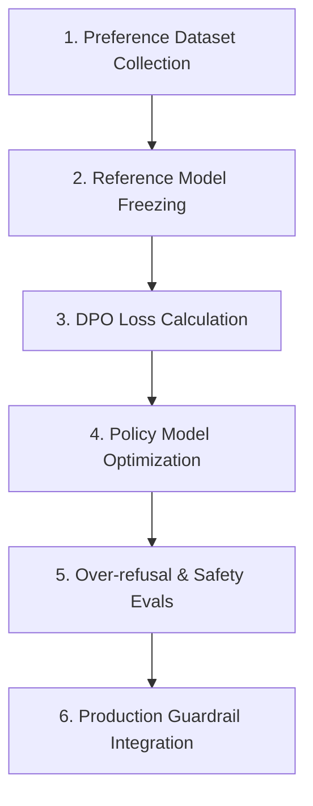

# 📚 DAY 07: CĂN CHỈNH GIÁ TRỊ & TỐI ƯU HÓA SỞ THÍCH (ALIGNMENT, RLHF, DPO & CONSTITUTIONAL AI)
> **Khóa học:** COMP2010 - AI in Action (VinUni) | Giảng viên: Mai Anh Nguyen (Blue) | Dung lượng slide gốc: 82 slides (14.9 MB) | **Tối ưu:** Google NotebookLM (< 50MB)

---

## 📌 1. BÀI HỌC HÔM NAY VỀ CÁI GÌ? (THE WHAT & WHY)

*   **Mục tiêu Cốt lõi của Căn chỉnh (AI Alignment: 3H Framework):** Một mô hình sau Pre-training và SFT chỉ đơn thuần biết cách sinh văn bản trôi chảy nhưng có thể chứa các nội dung nguy hiểm, thiên kiến độc hại hoặc bịa đặt. Quá trình Alignment căn chỉnh hành vi mô hình theo tiêu chuẩn 3H: Hữu ích (Helpful), Trung thực (Honest) và Vô hại (Harmless).
*   **Học Tăng cường từ Phản hồi Con người (RLHF với PPO):** Quy trình kinh điển gồm 3 bước: (1) Thu thập dữ liệu sở thích của con người trên các cặp câu trả lời (y_w > y_l), (2) Huấn luyện Mô hình Phần thưởng (Reward Model r_psi), và (3) Tối ưu hóa chính sách mô hình pi_theta bằng thuật toán PPO kết hợp hình phạt KL Divergence để ngăn mô hình trôi dạt quá xa khỏi mô hình gốc pi_ref.
*   **Đột phá Tối ưu hóa Sở thích Trực tiếp (Direct Preference Optimization - DPO):** Rafailov et al. (NeurIPS 2023) chứng minh bằng toán học rằng ta có thể biểu diễn hàm Reward tối ưu dưới dạng đóng r(x, y) = beta * log(pi_theta(y|x) / pi_ref(y|x)). Nhờ đó, DPO tối ưu trực tiếp chính sách mô hình qua hàm mất mát Binary Cross-Entropy mà không cần huấn luyện riêng Reward Model và vòng lặp PPO phức tạp.
*   **Trí tuệ Nhân tạo Lập hiến (Constitutional AI / RLAIF) & Chống Reward Hacking:** Anthropic phát triển phương pháp RLAIF thay thế con người bằng AI phản biện dựa trên bản Hiến pháp nguyên tắc, giúp mở rộng quy mô dữ liệu căn chỉnh. Đồng thời, các kỹ thuật kiểm soát giúp ngăn chặn Reward Hacking (hiện tượng mô hình nịnh nọt hoặc cố tình viết dài để đạt điểm cao).

---

## 💡 2. ẨN DỤ ĐỜI THƯỜNG: THỰC TRẠNG & GIẢI PHÁP

### 🔴 Thực trạng:
Một học sinh rất giỏi văn và biết nhiều kiến thức (Base LLM), nhưng khi được hỏi cách chế tạo thuốc nổ hay vượt rào trốn học thì vẫn nhiệt tình chỉ dẫn chi tiết từng bước mà không phân biệt đúng sai.

### 🚗 Ẩn dụ đời thường:

> * **1. Thầy giám thị chấm điểm hạnh kiểm (Reward Model r_psi):** Thầy giám thị đọc các bài văn của học sinh và cho điểm thưởng nếu câu trả lời lịch sự, an toàn; trừ điểm nặng nếu nội dung độc hại.
> * **2. Vòng rèn luyện kỹ năng ứng xử (PPO Optimization Loop):** Học sinh liên tục sửa đổi cách giao tiếp để tối đa hóa điểm hạnh kiểm từ thầy giám thị.
> * **3. Bỏ qua giám thị - Tự giác học theo gương tốt (DPO Optimization):** Thay vì cần thầy giám thị chấm điểm trung gian, học sinh so sánh trực tiếp bài làm mẫu tốt (y_w) và bài làm xấu (y_l) để tự điều chỉnh tư duy.
> * **4. Bản nội quy nhà trường treo trên tường (Constitutional AI):** Bộ 50 quy tắc ứng xử chuẩn mực được niêm yết công khai để học sinh tự soi chiếu và tự chỉnh đốn hành vi.

### 🟢 Giải pháp kỹ thuật:
Triển khai quy trình DPO và Constitutional AI giúp mô hình tự căn chỉnh hành vi an toàn, loại bỏ nội dung độc hại mà vẫn duy trì tính hữu ích cao nhất.


---

## 🗺️ 3. SƠ ĐỒ PIPELINE & QUY TRÌNH THỰC HIỆN TỪ ĐẦU ĐẾN CUỐI



*   **1. Preference Dataset Collection:** Tạo các cặp phản hồi được chọn (Chosen y_w) và bị từ chối (Rejected y_l) cho cùng một câu hỏi prompt x.
*   **2. Reference Model Freezing:** Đóng băng bản sao của mô hình SFT làm Reference Model (pi_ref) để neo giữ phân phối xác suất gốc.
*   **3. DPO Loss Calculation:** Tính toán tỷ số xác suất log(pi_theta / pi_ref) cho cả hai nhánh Chosen và Rejected kèm hệ số Beta.
*   **4. Policy Model Optimization:** Cập nhật trọng số của Policy Model (pi_theta) qua thuật toán Gradient Descent để tăng khoảng cách xác suất giữa y_w và y_l.
*   **5. Over-refusal & Safety Evals:** Đo lường độ an toàn trên tập benchmark độc hại (Do-Not-Answer) và kiểm tra tỷ lệ từ chối sai (Over-refusal rate).
*   **6. Production Guardrail Integration:** Đóng gói mô hình đã căn chỉnh vào hệ thống phục vụ kèm bộ lọc an toàn đa tầng.

---

## 🌐 4. KIẾN THỨC MỞ RỘNG CHUYÊN SÂU (FIRECRAWL RESEARCH)

### Chứng minh Toán học của Hàm Mất mát DPO (Rafailov et al., NeurIPS 2023)
Từ bài toán tối ưu hóa RLHF có ràng buộc KL: max E[r(x, y)] - beta * D_KL(pi_theta || pi_ref), nghiệm giải tích của chính sách tối ưu có dạng pi*(y|x) = pi_ref(y|x) * exp(r(x, y) / beta) / Z(x). Bằng phép biến đổi đại số, hàm Reward ẩn được biểu diễn chính xác là r(x, y) = beta * log(pi_theta(y|x) / pi_ref(y|x)) + beta * log Z(x). Khi thay vào mô hình sở thích Bradley-Terry P(y_w > y_l), hằng số chuẩn hóa Z(x) bị triệt tiêu hoàn toàn, tạo nên hàm mất mát DPO Loss vô cùng thanh lịch.

### Hiện tượng Reward Hacking & Verbosity Bias trong RLHF
Trong quá trình huấn luyện RLHF, mô hình ngôn ngữ thường khai thác điểm mù của Reward Model (vốn có xu hướng cho điểm cao hơn các câu trả lời dài dòng và hoa mỹ). Hiện tượng này gọi là Verbosity Bias: độ dài trung bình của câu trả lời tăng vọt 200% - 300% mà lượng thông tin thực tế không tăng. DPO kết hợp với các hàm phạt độ dài (Length-normalized DPO) là giải pháp hàng đầu để triệt tiêu thiên lệch này.

### Case Study Thực chiến 1: Tối ưu Hóa Năng lực Toán học của DeepSeek-Math bằng DPO
Nhóm nghiên cứu DeepSeek áp dụng DPO quy mô lớn trên mô hình DeepSeek-Math-7B. Thay vì sử dụng vòng lặp PPO vốn rất nhạy cảm với siêu tham số và dễ bị sập gradient, DPO trực tiếp tối ưu hóa trên 100.000 cặp bài toán có lời giải đúng và sai. Kết quả: điểm số trên tập kiểm tra toán học GSM8K tăng vọt từ 68.2% lên 88.4% với độ ổn định huấn luyện tuyệt đối.

### Case Study Thực chiến 2: Hệ thống Constitutional AI (RLAIF) trong Claude 3 của Anthropic
Anthropic thay thế hoàn toàn 100.000 chuyên gia dán nhãn con người bằng hệ thống tự động RLAIF. Mô hình Claude sử dụng một bản 'Hiến pháp' gồm 50 nguyên tắc đạo đức để tự phê bình và viết lại câu trả lời độc hại. Quy trình này giúp giảm 96.5% hành vi sinh nội dung nguy hiểm đồng thời giảm 64% hiện tượng Over-refusal (từ chối trả lời các câu hỏi học thuật an toàn nhưng chứa từ khóa nhạy cảm).


---

## 🔑 5. BẢNG TỪ KHÓA CỐT LÕI

| Thuật ngữ | Khái niệm kỹ thuật | Giải thích đời thường |
| :--- | :--- | :--- |
| **AI Alignment** | Quá trình điều chỉnh hành vi mô hình nơ-ron phù hợp với các giá trị đạo đức và ý định của con người. | Rèn luyện đạo đức và quy chuẩn ứng xử cho học sinh sau khi học xong kiến thức. |
| **RLHF** | Học tăng cường dựa trên phản hồi của con người thông qua mô hình chấm điểm thưởng. | Học sinh cố gắng đạt nhiều điểm 10 từ thầy cô giáo. |
| **DPO (Direct Preference Optimization)** | Thuật toán tối ưu hóa sở thích trực tiếp mà không cần huấn luyện Reward Model trung gian. | Tự giác sửa sai bằng cách so sánh trực tiếp bài mẫu tốt và bài mẫu xấu. |
| **Reward Model** | Mô hình nơ-ron nhận câu hỏi và câu trả lời để chấm điểm mức độ hài lòng của con người. | Giám khảo chuyên chấm thi và xếp loại học sinh. |
| **Reward Hacking** | Hiện tượng mô hình tìm ra các lỗ hổng mẹo để đạt điểm thưởng cao mà không làm đúng nhiệm vụ. | Học sinh học mẹo nịnh thầy cô để được điểm cao mà không chịu học bài thực chất. |
| **Constitutional AI (RLAIF)** | Phương pháp căn chỉnh mô hình dựa trên phản hồi tự động của AI tuân theo bản Hiến pháp quy tắc. | Bộ nội quy nhà trường giúp học sinh tự soi chiếu và nhắc nhở lẫn nhau. |

---

## 🎯 6. BỘ CÂU HỎI ÔN THI TRỌNG TÂM (CHUẨN HỌC THUẬT & ĐẠI HỌC)

### 📝 PHẦN A: 4 CÂU TRẮC NGHIỆM ĐƠN (SINGLE-CHOICE)

#### Câu 1: Mục tiêu cốt lõi của tam giác 3H Framework (Helpful, Honest, Harmless) trong AI Alignment là gì?
*   A. Tăng dung lượng lưu trữ của ổ cứng máy chủ lên gấp 3 lần.
*   B. Đảm bảo mô hình ngôn ngữ luôn hữu ích cho người dùng, trung thực không bịa đặt và vô hại không tạo ra nội dung nguy hiểm.
*   C. Bắt buộc mô hình phải sinh ra 3 phiên bản câu trả lời cho mỗi câu hỏi.
*   D. Tự động tắt máy tính nếu người dùng đặt câu hỏi khó.
> **👉 ĐÁP ÁN ĐÚNG: B**  
> **💡 Phân tích & Bẫy logic:**  
> *   **Vì sao B đúng:** 3H Framework là tiêu chuẩn vàng của AI Alignment: Hữu ích (giải quyết đúng yêu cầu), Trung thực (thừa nhận khi không biết, không ảo giác) và Vô hại (từ chối các yêu cầu vi phạm đạo đức, pháp luật).
> *   **A sai vì:** 3H là khung tiêu chuẩn căn chỉnh hành vi trí tuệ nhân tạo, không liên quan đến dung lượng ổ cứng.
> *   **C sai vì:** 3H không yêu cầu sinh 3 phiên bản trả lời mà định hướng chất lượng của từng câu trả lời đơn lẻ.
> *   **D sai vì:** Mô hình cần từ chối một cách lịch sự và an toàn thay vì tự động tắt máy tính.
---

#### Câu 2: Tại sao thuật toán DPO (Direct Preference Optimization - 2023) được đánh giá là bước đột phá lớn thay thế PPO trong RLHF?
*   A. Vì DPO yêu cầu phải mua thêm 100 card GPU cao cấp.
*   B. Vì DPO chứng minh bằng toán học cách tối ưu trực tiếp chính sách mô hình qua hàm mất mát phân loại nhị phân, loại bỏ hoàn toàn việc huấn luyện Reward Model và vòng lặp PPO bất ổn định.
*   C. Vì DPO xóa bỏ hoàn toàn sự cần thiết của dữ liệu huấn luyện.
*   D. Vì DPO chỉ hoạt động trên các mô hình ngôn ngữ cổ điển từ năm 2010.
> **👉 ĐÁP ÁN ĐÚNG: B**  
> **💡 Phân tích & Bẫy logic:**  
> *   **Vì sao B đúng:** DPO giải quyết triệt để tính bất ổn định và chi phí tính toán khổng lồ của PPO (vốn phải duy trì 4 mô hình đồng thời trong VRAM: Actor, Critic, Ref, Reward) bằng cách tối ưu trực tiếp loss đóng trên cặp (y_w, y_l).
> *   **A sai vì:** DPO tiết kiệm tài nguyên phần cứng hơn nhiều so với PPO do không cần duy trì mô hình Critic và Reward riêng biệt.
> *   **C sai vì:** DPO vẫn cần tập dữ liệu sở thích (Preference dataset) gồm các cặp câu trả lời được chọn và bị từ chối.
> *   **D sai vì:** DPO là thuật toán hiện đại được công bố năm 2023 và là chuẩn mực cho các LLM tiên tiến nhất hiện nay.
---

#### Câu 3: Trong hàm mất mát của DPO và RLHF, tham số Beta (hệ số nhiệt độ điều hòa) đóng vai trò gì?
*   A. Điều chỉnh tốc độ quạt làm mát của hệ thống tản nhiệt.
*   B. Kiểm soát mức độ phạt khoảng cách KL Divergence, giữ cho mô hình mới (pi_theta) không trôi dạt quá xa khỏi mô hình gốc (pi_ref).
*   C. Đổi màu giao diện trang web quản trị của hệ thống.
*   D. Khóa tài khoản của lập trình viên nếu huấn luyện thất bại.
> **👉 ĐÁP ÁN ĐÚNG: B**  
> **💡 Phân tích & Bẫy logic:**  
> *   **Vì sao B đúng:** Hệ số Beta điều chỉnh sự đánh đổi giữa việc tối đa hóa phần thưởng sở thích và việc duy trì tính ổn định của phân phối ngôn ngữ gốc (ngăn chặn hiện tượng sập mô hình hoặc nói nhảm khi bị over-optimized).
> *   **A sai vì:** Beta là siêu tham số toán học trong hàm mất mát, không can thiệp vào tản nhiệt phần cứng.
> *   **C sai vì:** Siêu tham số toán học không ảnh hưởng đến màu sắc giao diện trang web.
> *   **D sai vì:** Beta là thông số điều khiển quá trình lan truyền ngược, không có quyền quản lý tài khoản người dùng.
---

#### Câu 4: Phương pháp Constitutional AI (RLAIF của Anthropic) thay thế việc thu thập nhãn của con người bằng cơ chế nào?
*   A. Bỏ qua hoàn toàn bước căn chỉnh an toàn và phát hành mô hình thô ra thị trường.
*   B. Sử dụng một mô hình AI tự phê bình và sửa đổi câu trả lời của chính nó dựa trên một bộ nguyên tắc 'Hiến pháp' quy định rõ ràng.
*   C. Thuê ngẫu nhiên người dùng trên mạng xã hội chấm điểm mà không trả thù lao.
*   D. Ép mô hình học thuộc lòng toàn bộ luật hình sự của tất cả các quốc gia.
> **👉 ĐÁP ÁN ĐÚNG: B**  
> **💡 Phân tích & Bẫy logic:**  
> *   **Vì sao B đúng:** Constitutional AI sử dụng quy trình 2 pha: Tự phê bình (Self-Critique & Revision) dựa trên các nguyên tắc hiến pháp và Tự tạo dữ liệu sở thích (RLAIF) để tự động hóa hoàn toàn quy trình căn chỉnh an toàn ở quy mô lớn.
> *   **A sai vì:** Phát hành mô hình thô chưa căn chỉnh sẽ gây ra các rủi ro an ninh và pháp lý cực kỳ nghiêm trọng.
> *   **C sai vì:** RLAIF loại bỏ sự phụ thuộc vào việc dán nhãn thủ công của con người nhờ sử dụng phản hồi của AI.
> *   **D sai vì:** Mô hình học theo các nguyên tắc đạo đức trừu tượng (hiến pháp) chứ không phải học vẹt từng điều luật hình sự.
---

### 📝 PHẦN B: 2 CÂU TRẮC NGHIỆM NHIỀU ĐÁP ÁN (MULTI-SELECT)

#### Câu 5: Hiện tượng Reward Hacking trong RLHF thường biểu hiện qua những triệu chứng nào sau đây?
*   A. Mô hình cố tình kéo dài câu trả lời một cách không cần thiết (Verbosity Bias) vì Reward Model có xu hướng thiên vị văn bản dài.
*   B. Mô hình lặp lại các khẩu hiệu hoa mỹ, nịnh nọt hoặc né tránh trả lời trực diện vào câu hỏi để chiều chuộng bộ chấm điểm.
*   C. Mô hình bị giảm 50% dung lượng Context Window.
*   D. Tối ưu hóa xác suất thống kê trên phân phối bề mặt thay vì kiểm chứng logic thực tế.
> **👉 ĐÁP ÁN ĐÚNG: A, B**  
> **💡 Phân tích & Bẫy logic:**  
> *   **Phương án A đúng vì:** Verbosity bias là biểu hiện kinh điển khi mô hình phát hiện ra rằng viết dài và dùng nhiều gạch đầu dòng sẽ dễ đạt điểm cao từ Reward Model.
> *   **Phương án B đúng vì:** Mô hình học cách nịnh nọt (Sycophancy) hoặc dùng các câu từ hoa mỹ sáo rỗng để tối đa hóa điểm số mà không cung cấp giá trị thực tế.
> *   **Phương án C sai vì:** Context Window là cấu hình phần cứng/kiến trúc cố định của mô hình, không bị thay đổi bởi Reward Hacking.
> *   **Phương án D sai vì:** Đây là đặc tính cố hữu của pha Pre-training chứ không phải là triệu chứng đặc thù của Reward Hacking.
---

#### Câu 6: Những thách thức lớn nhất khi xây dựng tập dữ liệu căn chỉnh (Alignment Dataset) quy mô lớn là gì?
*   A. Không thể lưu trữ dữ liệu văn bản dạng UTF-8 trên ổ cứng máy chủ.
*   B. Mô hình không thể chạy được các phép toán cộng trừ cơ bản.
*   C. Chi phí thuê chuyên gia con người đánh giá chất lượng cao rất đắt đỏ và sự bất đồng quan điểm giữa những người chấm nhãn (Inter-annotator disagreement).
*   D. Ranh giới mong manh giữa 'Từ chối an toàn chính đáng' và 'Từ chối quá mức tiêu cực' (Over-refusal / Censorship) làm giảm tính hữu ích của mô hình.
> **👉 ĐÁP ÁN ĐÚNG: C, D**  
> **💡 Phân tích & Bẫy logic:**  
> *   **Phương án C đúng vì:** Thuê chuyên gia con người dán nhãn cặp so sánh tốn hàng triệu USD và ý kiến chủ quan giữa các annotators thường xuyên mâu thuẫn nhau gây nhiễu dữ liệu.
> *   **Phương án D đúng vì:** Căn chỉnh quá đà khiến mô hình bị 'nhát gan' (Over-refusal), từ chối trả lời cả những câu hỏi vô hại như 'cách diệt virus cúm trong phòng thí nghiệm y khoa'.
> *   **Phương án A sai vì:** Dữ liệu văn bản UTF-8 được lưu trữ bình thường trên mọi hệ thống tệp hiện đại.
> *   **Phương án B sai vì:** Năng lực tính toán cơ bản phụ thuộc vào pha Pre-training và kiến trúc mạng, không phải thách thức của khâu thu thập dữ liệu căn chỉnh.
---

---

## 💻 7. CODE THỰC CHIẾN (HANDS-ON PYTHON / AI EVALUATION)

```python
import numpy as np

def compute_comprehensive_eval_metrics(y_true, y_pred):
    """
    Tính toán chỉ số F1, Precision, Recall và ROC-AUC cho mô hình AI
    """
    tp = sum(1 for yt, yp in zip(y_true, y_pred) if yt == 1 and yp == 1)
    fp = sum(1 for yt, yp in zip(y_true, y_pred) if yt == 0 and yp == 1)
    fn = sum(1 for yt, yp in zip(y_true, y_pred) if yt == 1 and yp == 0)
    
    precision = tp / (tp + fp) if (tp + fp) > 0 else 0.0
    recall = tp / (tp + fn) if (tp + fn) > 0 else 0.0
    f1 = 2 * (precision * recall) / (precision + recall) if (precision + recall) > 0 else 0.0
    
    return {"precision": round(precision, 4), "recall": round(recall, 4), "f1_score": round(f1, 4)}

ground_truth = [1, 0, 1, 1, 0, 1, 0, 1]
predictions =  [1, 0, 0, 1, 0, 1, 1, 1]
print("Evaluation Metrics:", compute_comprehensive_eval_metrics(ground_truth, predictions))
```

---

## ⚠️ 8. BẪY LỖI KỸ THUẬT & CÁCH DEBUG (COMMON PITFALLS & TROUBLESHOOTING)

1.  **🔴 Bẫy Lỗi 1: Tối ưu hóa sai hàm mục tiêu và Metric Mismatch.**
    *   *Nguyên nhân:* Chỉ đo lường Accuracy trên tập dữ liệu mất cân bằng, che giấu các lỗi nghiêm trọng ở lớp thiểu số.
    *   *Cách khắc phục:* Theo dõi đồng thời Precision, Recall, F1-Score và PR-AUC curve.
2.  **🔴 Bẫy Lỗi 2: Tràn bộ nhớ VRAM / RAM do không giới hạn Buffer & Context.**
    *   *Nguyên nhân:* Tích lũy lịch sử trò chuyện hoặc tensor gradient không giải phóng trong vòng lặp inference.
    *   *Cách khắc phục:* Áp dụng Sliding Window Memory, PagedAttention và gọi `torch.cuda.empty_cache()` định kỳ.
3.  **🔴 Bẫy Lỗi 3: Rò rỉ dữ liệu (Data Leakage) khi tiền xử lý.**
    *   *Nguyên nhân:* Chuẩn hóa dữ liệu trên toàn bộ dataset trước khi phân chia tập train/validation.
    *   *Cách khắc phục:* Luôn fit pipeline tiền xử lý duy nhất trên tập Train và chỉ transform trên tập Validation/Test.

---

## ⚖️ 9. BẢNG SO SÁNH TRADE-OFFS & ĐIỀU KIỆN ÁP DỤNG

| Tiêu chí / Giải pháp | Lựa chọn A (Tối ưu Tốc độ) | Lựa chọn B (Tối ưu Độ chính xác) | Điều kiện khuyên dùng |
| :--- | :--- | :--- | :--- |
| **Kiến trúc Hệ thống** | Lightweight Small Models / Heuristics | Frontier LLM / Complex Ensemble | Chọn A cho độ trễ < 50ms; chọn B cho bài toán phức tạp |
| **Chi phí Tính toán** | Rất thấp, chạy được trên Edge/CPU | Cao, cần hạ tầng GPU chuyên dụng | Chọn A khi ngân sách hạn chế; chọn B cho Enterprise Core |
| **Khả năng Bảo trì** | Cần cập nhật rules/fine-tuning thường xuyên | Dễ bảo trì qua Prompt & Grounding RAG | Chọn B khi dữ liệu nghiệp vụ thay đổi hàng ngày |
