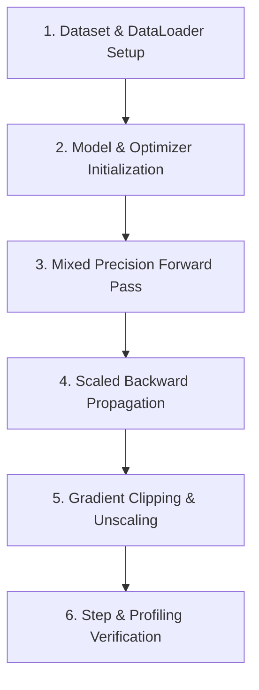

# 📚 DAY 08: KỸ THUẬT HỌC SÂU VỚI PYTORCH & TỐI ƯU HÓA HUẤN LUYỆN (PYTORCH DEEP LEARNING & DISTRIBUTED TRAINING)
> **Khóa học:** COMP2010 - AI in Action (VinUni) | Giảng viên: Mai Anh Nguyen (Blue) | Dung lượng slide gốc: Thực hành Lab Milestone (slide_0KB) | **Tối ưu:** Google NotebookLM (< 50MB)

---

## 📌 1. BÀI HỌC HÔM NAY VỀ CÁI GÌ? (THE WHAT & WHY)

*   **Vòng lặp Huấn luyện Cốt lõi trong PyTorch (Core Training Loop):** PyTorch vận hành dựa trên đồ thị tính toán động (Dynamic Computation Graph / Autograd). Vòng lặp chuẩn mực bắt buộc tuân theo 5 bước tuần tự: (1) `model.train()`, (2) `optimizer.zero_grad(set_to_none=True)`, (3) `loss.backward()`, (4) `torch.nn.utils.clip_grad_norm_()`, và (5) `optimizer.step()` kết hợp `lr_scheduler.step()`.
*   **Tự động Tính toán Độ chính xác Hỗn hợp (Automatic Mixed Precision - AMP):** Sử dụng `torch.cuda.amp.autocast(dtype=torch.bfloat16)` và `GradScaler` để thực hiện các phép nhân ma trận ở kiểu dữ liệu 16-bit (FP16/BF16) trên Tensor Cores trong khi lưu giữ bản sao Master Weights ở FP32, giúp giảm 50% VRAM và tăng tốc độ huấn luyện từ 2x đến 3x.
*   **Kiểm soát Bất ổn định Gradient: Nổ & Triệt tiêu Gradient:** Hiện tượng Exploding Gradients làm trọng số bị tràn số (NaN/Inf); Vanishing Gradients làm các tầng đầu ngừng học. Giải pháp: Áp dụng kỹ thuật Kẹp Gradient (Gradient Clipping), khởi tạo trọng số He/Xavier phù hợp và chuẩn hóa LayerNorm/RMSNorm.
*   **Chiến lược Huấn luyện Phân tán Đa GPU (DDP vs FSDP / ZeRO):** Distributed Data Parallel (DDP) nhân bản mô hình trên mỗi GPU và đồng bộ gradient qua All-Reduce; trong khi Fully Sharded Data Parallel (FSDP / DeepSpeed ZeRO-3) phân mảnh toàn bộ Optimizer States, Gradients và Model Parameters qua các node, cho phép huấn luyện mô hình vượt quá dung lượng VRAM của 1 card đơn lẻ.

---

## 💡 2. ẨN DỤ ĐỜI THƯỜNG: THỰC TRẠNG & GIẢI PHÁP

### 🔴 Thực trạng:
Một nhóm kỹ sư xây dựng tòa nhà chọc trời nhưng không có quy trình phối hợp nhịp nhàng: thợ xây làm việc quá nhanh gây nứt móng (Nổ Gradient), thiếu vật liệu ở các tầng cao (Triệt tiêu Gradient) và các tổ đội dẫm chân lên nhau gây lãng phí tài nguyên.

### 🚗 Ẩn dụ đời thường:

> * **1. Vòng tuần hoàn thi công chuẩn mực (PyTorch Training Loop):** Mỗi ngày: Nhận bản vẽ -> Đo đạc sai số -> Báo cáo lỗi cho tổ trưởng -> Thợ sửa lại các điểm lỗi -> Cập nhật tiến độ.
> * **2. Vật liệu nhẹ siêu bền (Automatic Mixed Precision AMP):** Sử dụng gạch siêu nhẹ (BF16) cho phần thân nhà để thi công nhanh gấp đôi, nhưng vẫn dùng khung thép chịu lực vững chắc (FP32) cho phần móng.
> * **3. Van an toàn áp suất (Gradient Clipping):** Lắp đặt van xả áp: khi áp lực bơm bê tông vượt quá ngưỡng an toàn (max_norm = 1.0), van tự động xả bớt để không làm vỡ đường ống dẫn.
> * **4. Đội ngũ thi công phân tán đa công trường (FSDP / ZeRO-3):** Thay vì mỗi công nhân phải mang theo cả bộ máy móc nặng 100 tấn, các thiết bị được chia nhỏ cho từng nhóm quản lý và chia sẻ linh hoạt qua mạng lưới thông tin liên lạc siêu tốc.

### 🟢 Giải pháp kỹ thuật:
Xây dựng pipeline huấn luyện PyTorch chuẩn công nghiệp: tích hợp AMP BF16, Gradient Clipping, bộ tối ưu hóa AdamW phân trang và phân mảnh phân tán FSDP.


---

## 🗺️ 3. SƠ ĐỒ PIPELINE & QUY TRÌNH THỰC HIỆN TỪ ĐẦU ĐẾN CUỐI



*   **1. Dataset & DataLoader Setup:** Xây dựng PyTorch Dataset, áp dụng kỹ thuật Dynamic Padding và cấu hình DataLoader với num_workers và pin_memory.
*   **2. Model & Optimizer Initialization:** Khởi tạo kiến trúc mạng, cấu hình bộ tối ưu hóa AdamW với Weight Decay (0.01) và Warmup Cosine LR Scheduler.
*   **3. Mixed Precision Forward Pass:** Bao bọc pha tính toán xuôi trong khối `torch.cuda.amp.autocast()` để tận dụng nhân phần cứng Tensor Cores.
*   **4. Scaled Backward Propagation:** Tính toán đạo hàm ngược thông qua `scaler.scale(loss).backward()` để tránh hiện tượng underflow ở kiểu dữ liệu FP16.
*   **5. Gradient Clipping & Unscaling:** Giải phóng thang đo `scaler.unscale_()` và kẹp chuẩn vector gradient không vượt quá ngưỡng quy định.
*   **6. Step & Profiling Verification:** Thực hiện `scaler.step(optimizer)`, cập nhật scheduler và theo dõi bộ nhớ qua PyTorch Profiler / Weights & Biases.

---

## 🌐 4. KIẾN THỨC MỞ RỘNG CHUYÊN SÂU (FIRECRAWL RESEARCH)

### Toán học của Trình tối ưu hóa AdamW & Phân rã Trọng số (Loshchilov & Hutter, ICLR 2019)
Trong trình tối ưu hóa Adam cổ điển, L2 Regularization bị gộp chung vào gradient làm biến dạng ước lượng mô-men bậc 2 (v_t). AdamW tách rời hoàn toàn phép phân rã trọng số: theta_{t+1} = theta_t - eta * (m_hat / (sqrt(v_hat) + eps)) - eta * lambda * theta_t. Sự tách biệt này giúp mô hình học sâu tổng quát hóa tốt hơn và hội tụ nhanh hơn trên các tập dữ liệu quy mô lớn.

### Phân tích Bộ nhớ & Kiến trúc Zero Redundancy Optimizer (ZeRO / Rajbhandari et al., SC 20)
Bộ nhớ huấn luyện một mô hình N tham số gồm: Trọng số (2N bytes ở FP16), Gradients (2N bytes), và Optimizer States của Adam (12N bytes ở FP32) -> Tổng cộng 16N bytes. ZeRO chia nhỏ bộ nhớ thành 3 giai đoạn: ZeRO-1 phân mảnh Optimizer States (giảm 4x bộ nhớ), ZeRO-2 phân mảnh thêm Gradients (giảm 8x), và ZeRO-3 phân mảnh toàn bộ Trọng số, cho phép huấn luyện mô hình 100B+ tham số trên cụm GPU tiêu chuẩn.

### Case Study Thực chiến 1: Huấn luyện Mô hình Mistral 8x7B MoE với PyTorch FSDP
Mistral AI huấn luyện mô hình Mixture-of-Experts 8x7B (tổng cộng 46.7B tham số) trên cụm 512 GPU H100 kết nối qua mạng InfiniBand 3.2 Tbps. Sử dụng PyTorch FSDP (Full Sharding) kết hợp FlashAttention-2, nhóm kỹ sư đạt hiệu suất tính toán 185 TFLOPs/GPU (tương đương 58% Model FLOPs Utilization - MFU), hoàn thành quá trình huấn luyện trong thời gian kỷ lục mà không gặp bất kỳ sự cố tràn bộ nhớ nào.

### Case Study Thực chiến 2: Tối ưu Hóa Hệ thống Huấn luyện Thị giác Tự hành của Tesla
Tesla triển khai mạng nơ-ron đa camera Occupancy Network (1.2B tham số) trên cụm siêu máy tính Dojo và GPU H100. Bằng việc kích hoạt `torch.cuda.amp.autocast(dtype=torch.bfloat16)` kết hợp Gradient Accumulation 8 bước, nhóm kỹ sư giảm 48% dung lượng VRAM cho activations, cho phép tăng kích thước Batch Size lên gấp 3 lần và rút ngắn chu kỳ huấn luyện từ 14 ngày xuống chỉ còn 4.5 ngày.


---

## 🔑 5. BẢNG TỪ KHÓA CỐT LÕI

| Thuật ngữ | Khái niệm kỹ thuật | Giải thích đời thường |
| :--- | :--- | :--- |
| **Dynamic Computation Graph** | Đồ thị tính toán được xây dựng lại động trong từng lượt chạy của PyTorch (Autograd). | Bản đồ đường đi tự động vẽ lại theo thời gian thực tùy thuộc vào tình hình giao thông. |
| **Automatic Mixed Precision (AMP)** | Kỹ thuật tự động kết hợp kiểu dữ liệu 16-bit và 32-bit trong quá trình huấn luyện. | Dùng vật liệu nhẹ thi công nhanh kết hợp khung thép chịu lực kiên cố. |
| **Gradient Clipping** | Kỹ thuật kẹp độ dài vector gradient không vượt quá một ngưỡng tối đa cho phép. | Van an toàn tự động xả áp suất để đường ống không bị nổ khi bơm quá tải. |
| **AdamW** | Bộ tối ưu hóa thích nghi tách biệt thành phần phân rã trọng số (Weight Decay) khỏi gradient. | Động cơ xe thông minh tự động tăng giảm ga và phanh nhịp nhàng trên từng cung đường. |
| **FSDP (Fully Sharded Data Parallel)** | Kỹ thuật phân tán phân mảnh toàn bộ tham số, gradient và optimizer qua các GPU. | Chia nhỏ các bộ phận máy móc hạng nặng cho từng đội công nhân cùng vận chuyển. |
| **Pin Memory** | Cơ chế khóa trang bộ nhớ RAM máy chủ để tăng tốc độ nạp dữ liệu trực tiếp sang VRAM GPU. | Làn đường ưu tiên riêng giúp xe buýt chạy thẳng không bị tắc nghẽn giao thông. |

---

## 🎯 6. BỘ CÂU HỎI ÔN THI TRỌNG TÂM (CHUẨN HỌC THUẬT & ĐẠI HỌC)

### 📝 PHẦN A: 4 CÂU TRẮC NGHIỆM ĐƠN (SINGLE-CHOICE)

#### Câu 1: Trong vòng lặp huấn luyện chuẩn của PyTorch, tại sao lệnh `optimizer.zero_grad(set_to_none=True)` bắt buộc phải được gọi trước `loss.backward()`?
*   A. Để xóa sạch toàn bộ mã nguồn của mô hình trong bộ nhớ.
*   B. Vì mặc định PyTorch tự động tích lũy (cộng dồn) gradient qua các lượt chạy; nếu không reset thì gradient của batch mới sẽ bị cộng dồn với batch cũ gây sai lệch hướng cập nhật.
*   C. Để tắt nguồn điện của card đồ họa GPU.
*   D. Để tự động chuyển đổi mô hình từ chế độ Train sang chế độ Eval.
> **👉 ĐÁP ÁN ĐÚNG: B**  
> **💡 Phân tích & Bẫy logic:**  
> *   **Vì sao B đúng:** PyTorch thiết kế cơ chế tích lũy gradient mặc định (`grad += new_grad`) để hỗ trợ kỹ thuật Gradient Accumulation. Do đó, trong các bước huấn luyện thông thường, bắt buộc phải reset gradient về 0 (hoặc None để tiết kiệm bộ nhớ) trước khi tính đạo hàm mới.
> *   **A sai vì:** Lệnh này chỉ xóa các giá trị trong thuộc tính `.grad` của các tham số, không xóa mã nguồn hay trọng số mô hình.
> *   **C sai vì:** Lệnh phần mềm trong framework không ngắt nguồn điện phần cứng của thiết bị.
> *   **D sai vì:** Chuyển chế độ do lệnh `model.train()` hoặc `model.eval()` đảm nhiệm, không liên quan đến `zero_grad()`.
---

#### Câu 2: Kỹ thuật Automatic Mixed Precision (AMP) với kiểu dữ liệu BF16 mang lại lợi thế vượt trội gì so với FP16 truyền thống khi huấn luyện trên GPU NVIDIA hiện đại?
*   A. BF16 có số bit phần mũ (Exponent bits) tương đương FP32 (8 bits), giúp tránh hoàn toàn hiện tượng tràn số dưới (Underflow) mà không bắt buộc phải dùng GradScaler.
*   B. BF16 chỉ sử dụng 2 bit để biểu diễn số thực.
*   C. BF16 giúp tăng độ phân giải của màn hình máy tính.
*   D. BF16 là kiểu dữ liệu độc quyền chỉ có trên hệ điều hành Windows.
> **👉 ĐÁP ÁN ĐÚNG: A**  
> **💡 Phân tích & Bẫy logic:**  
> *   **Vì sao A đúng:** Bfloat16 (Brain Floating Point) có 8 bit exponent (giống FP32) và 7 bit mantissa, cho dải động (Dynamic Range) tương đương FP32. Do đó nó rất hiếm khi bị underflow/overflow như FP16 (chỉ có 5 bit exponent), giúp huấn luyện mô hình sâu ổn định tuyệt đối mà không cần cân chỉnh thang đo phức tạp.
> *   **B sai vì:** Bfloat16 sử dụng đúng 16 bits (1 bit dấu + 8 bits exponent + 7 bits mantissa), không phải 2 bit.
> *   **C sai vì:** BF16 là kiểu biểu diễn số thực trong tính toán số học, không liên quan đến độ phân giải màn hình hiển thị.
> *   **D sai vì:** BF16 là chuẩn phần cứng công nghiệp quốc tế được hỗ trợ trên Linux, Windows và mọi hệ điều hành hiện đại.
---

#### Câu 3: Mục đích chính của kỹ thuật Kẹp Gradient (Gradient Clipping qua `torch.nn.utils.clip_grad_norm_`) là gì?
*   A. Tăng tốc độ nạp dữ liệu từ ổ cứng HDD vào bộ nhớ RAM.
*   B. Giới hạn độ dài chuẩn L2 của toàn bộ vector gradient không vượt quá ngưỡng `max_norm`, ngăn chặn hiện tượng Nổ Gradient (Exploding Gradients) làm hỏng trọng số mô hình.
*   C. Xóa bỏ các giá trị âm trong ma trận trọng số.
*   D. Tự động chuyển đổi toàn bộ mô hình sang ngôn ngữ C++.
> **👉 ĐÁP ÁN ĐÚNG: B**  
> **💡 Phân tích & Bẫy logic:**  
> *   **Vì sao B đúng:** Khi gradient vượt quá ngưỡng an toàn, Gradient Clipping thực hiện phép nhân co giãn tỷ lệ: g = g * (max_norm / (||g|| + eps)), giữ nguyên hướng của vector gradient nhưng thu nhỏ độ lớn, ngăn chặn các bước nhảy quá lớn làm mô hình phân kỳ.
> *   **A sai vì:** Gradient Clipping là bước toán học diễn ra trên GPU sau `loss.backward()`, không liên quan đến nạp dữ liệu I/O từ ổ cứng.
> *   **C sai vì:** Nó co giãn độ lớn của vector, không xóa bỏ hay gán giá trị âm về 0.
> *   **D sai vì:** Thuật toán xử lý ma trận số thực trong PyTorch, không chuyển đổi mã nguồn sang C++.
---

#### Câu 4: Sự khác biệt then chốt giữa kiến trúc phân tán DDP (Distributed Data Parallel) và FSDP (Fully Sharded Data Parallel) là gì?
*   A. DDP sao chép 100% mô hình trên mỗi GPU dẫn đến dư thừa bộ nhớ, trong khi FSDP phân mảnh toàn bộ tham số, gradient và optimizer states qua các GPU để tiết kiệm tối đa VRAM.
*   B. DDP chỉ chạy được trên 1 GPU duy nhất.
*   C. FSDP không thể huấn luyện được các mô hình Transformer.
*   D. DDP chỉ dành cho xử lý âm thanh còn FSDP chỉ dành cho xử lý hình ảnh.
> **👉 ĐÁP ÁN ĐÚNG: A**  
> **💡 Phân tích & Bẫy logic:**  
> *   **Vì sao A đúng:** DDP giữ một bản sao đầy đủ của mô hình trên mỗi GPU (Replication), gây nghẽn bộ nhớ khi mô hình lớn hơn dung lượng 1 card; FSDP áp dụng nguyên lý ZeRO-3 chia nhỏ tất cả các thành phần qua cụm GPU (Sharding), cho phép huấn luyện mô hình siêu lớn.
> *   **B sai vì:** DDP sinh ra để chạy phân tán trên nhiều GPU (Multi-GPU / Multi-Node).
> *   **C sai vì:** FSDP là giải pháp hàng đầu được thiết kế đặc biệt để huấn luyện các mô hình Transformer khổng lồ như LLaMA, Mistral.
> *   **D sai vì:** Cả hai đều là kỹ thuật phân tán toán học tổng quát cho mọi dạng dữ liệu (văn bản, hình ảnh, âm thanh).
---

### 📝 PHẦN B: 2 CÂU TRẮC NGHIỆM NHIỀU ĐÁP ÁN (MULTI-SELECT)

#### Câu 5: Những kỹ thuật nào sau đây giúp phòng ngừa và khắc phục hiện tượng Nổ Gradient (Exploding Gradients) khi huấn luyện mô hình sâu trong PyTorch?
*   A. Sử dụng kỹ thuật kẹp Gradient (Gradient Clipping) bằng lệnh `torch.nn.utils.clip_grad_norm_`.
*   B. Tăng Learning Rate lên gấp 100 lần ngay khi phát hiện loss tăng đột biến.
*   C. Khởi tạo trọng số chuẩn mực (như He/Kaiming Initialization hoặc Xavier Initialization) kết hợp kết nối tắt Residual Connections.
*   D. Tắt bỏ toàn bộ các hàm kích hoạt phi tuyến trong mạng nơ-ron.
> **👉 ĐÁP ÁN ĐÚNG: A, C**  
> **💡 Phân tích & Bẫy logic:**  
> *   **Phương án A đúng vì:** Gradient Clipping giới hạn độ lớn của vector đạo hàm, ngăn chặn hiện tượng cập nhật trọng số quá mức gây tràn số NaN.
> *   **Phương án C đúng vì:** Khởi tạo trọng số phù hợp và Residual Connections giúp duy trì phương sai của tín hiệu ổn định qua hàng chục tầng sâu của mạng.
> *   **Phương án B sai vì:** Tăng Learning Rate lên 100 lần sẽ làm các bước nhảy gradient bùng nổ mạnh hơn và phá hủy hoàn toàn mô hình.
> *   **Phương án D sai vì:** Bỏ hàm kích hoạt phi tuyến sẽ biến toàn bộ mạng sâu thành một phép biến đổi tuyến tính đơn giản, làm mất năng lực học sâu.
---

#### Câu 6: Kỹ thuật Automatic Mixed Precision (AMP) trong PyTorch mang lại những lợi ích vượt trội nào khi huấn luyện mô hình trên GPU NVIDIA hiện đại?
*   A. Loại bỏ hoàn toàn sự cần thiết của việc chia tập dữ liệu Train/Test.
*   B. Tận dụng các nhân phần cứng Tensor Cores để tăng tốc độ tính toán ma trận với kiểu dữ liệu 16-bit (FP16/BF16).
*   C. Tự động sửa lỗi cú pháp Python trong mã nguồn của lập trình viên.
*   D. Tiết kiệm tới 50% dung lượng bộ nhớ VRAM cho các ma trận kích hoạt (Activations) và trọng số tạm thời.
> **👉 ĐÁP ÁN ĐÚNG: B, D**  
> **💡 Phân tích & Bẫy logic:**  
> *   **Phương án B đúng vì:** Tensor Cores trên kiến trúc Ampere/Hopper được tối ưu riêng cho phép tính FP16/BF16, mang lại thông lượng TFLOPs cao gấp nhiều lần FP32.
> *   **Phương án D đúng vì:** Lưu trữ activations và weights tạm thời ở 16-bit (2 bytes) thay vì 32-bit (4 bytes) giúp giải phóng một nửa bộ nhớ VRAM.
> *   **Phương án A sai vì:** Phân chia tập train/test/val là nguyên lý nền tảng của học máy, không bị thay đổi bởi kiểu dữ liệu số học.
> *   **Phương án C sai vì:** AMP là kỹ thuật tối ưu hóa phần cứng GPU, hoàn toàn không có chức năng biên dịch hay sửa lỗi cú pháp code Python.
---

---

## 💻 7. CODE THỰC CHIẾN (HANDS-ON PYTHON / PYTORCH DDP)

```python
import os, torch
import torch.distributed as dist

def run_distributed_tensor_sync():
    # 1. Khởi tạo cụm GPU phân tán qua backend NCCL / NVLink
    dist.init_process_group(backend="nccl", init_method="env://")
    local_rank = int(os.environ.get("LOCAL_RANK", 0))
    global_rank = int(os.environ.get("RANK", 0))
    torch.cuda.set_device(local_rank)
    
    # 2. Khởi tạo Tensor dữ liệu cục bộ trên VRAM
    local_tensor = torch.ones(1024, 1024, device=f"cuda:{local_rank}") * (global_rank + 1)
    
    # 3. Thực hiện toán tử All-Reduce đồng bộ gradient song song
    dist.all_reduce(local_tensor, op=dist.ReduceOp.SUM)
    
    if global_rank == 0:
        print("All-Reduce Sync Value at Rank 0:", local_tensor[0, 0].item())
    dist.destroy_process_group()

if __name__ == "__main__":
    if "WORLD_SIZE" in os.environ:
        run_distributed_tensor_sync()
```

---

## ⚠️ 8. BẪY LỖI KỸ THUẬT & CÁCH DEBUG (COMMON PITFALLS & TROUBLESHOOTING)

1.  **🔴 Bẫy Lỗi 1: Tối ưu hóa sai hàm mục tiêu và Metric Mismatch.**
    *   *Nguyên nhân:* Chỉ đo lường Accuracy trên tập dữ liệu mất cân bằng, che giấu các lỗi nghiêm trọng ở lớp thiểu số.
    *   *Cách khắc phục:* Theo dõi đồng thời Precision, Recall, F1-Score và PR-AUC curve.
2.  **🔴 Bẫy Lỗi 2: Tràn bộ nhớ VRAM / RAM do không giới hạn Buffer & Context.**
    *   *Nguyên nhân:* Tích lũy lịch sử trò chuyện hoặc tensor gradient không giải phóng trong vòng lặp inference.
    *   *Cách khắc phục:* Áp dụng Sliding Window Memory, PagedAttention và gọi `torch.cuda.empty_cache()` định kỳ.
3.  **🔴 Bẫy Lỗi 3: Rò rỉ dữ liệu (Data Leakage) khi tiền xử lý.**
    *   *Nguyên nhân:* Chuẩn hóa dữ liệu trên toàn bộ dataset trước khi phân chia tập train/validation.
    *   *Cách khắc phục:* Luôn fit pipeline tiền xử lý duy nhất trên tập Train và chỉ transform trên tập Validation/Test.

---

## ⚖️ 9. BẢNG SO SÁNH TRADE-OFFS & ĐIỀU KIỆN ÁP DỤNG

| Tiêu chí / Giải pháp | Lựa chọn A (Tối ưu Tốc độ) | Lựa chọn B (Tối ưu Độ chính xác) | Điều kiện khuyên dùng |
| :--- | :--- | :--- | :--- |
| **Kiến trúc Hệ thống** | Lightweight Small Models / Heuristics | Frontier LLM / Complex Ensemble | Chọn A cho độ trễ < 50ms; chọn B cho bài toán phức tạp |
| **Chi phí Tính toán** | Rất thấp, chạy được trên Edge/CPU | Cao, cần hạ tầng GPU chuyên dụng | Chọn A khi ngân sách hạn chế; chọn B cho Enterprise Core |
| **Khả năng Bảo trì** | Cần cập nhật rules/fine-tuning thường xuyên | Dễ bảo trì qua Prompt & Grounding RAG | Chọn B khi dữ liệu nghiệp vụ thay đổi hàng ngày |
