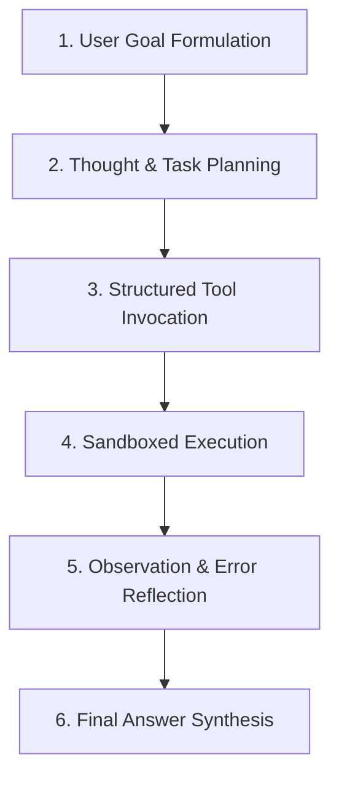

# 📚 DAY 09: TÁC TỬ TỰ HÀNH & KỸ THUẬT GỌI CÔNG CỤ (AI AGENTS & AUTONOMOUS TOOL CALLING)
> **Khóa học:** COMP2010 - AI in Action (VinUni) | Giảng viên: Mai Anh Nguyen (Blue) | Dung lượng slide gốc: 86 slides (15.6 MB) | **Tối ưu:** Google NotebookLM (< 50MB)

---

## 📌 1. BÀI HỌC HÔM NAY VỀ CÁI GÌ? (THE WHAT & WHY)

*   **Từ Chatbot Thụ động đến Tác tử Tự hành (Autonomous AI Agents):** Chatbot truyền thống chỉ tiếp nhận câu hỏi và sinh văn bản đóng kín trong ngữ cảnh. AI Agent là thực thể tự hành thông minh sở hữu 4 trụ cột cốt lõi: Bộ não suy luận (LLM Reasoning), Khối lập kế hoạch (Planning), Hệ thống bộ nhớ (Memory đa tầng) và Bộ công cụ tương tác môi trường (Tools / Function Calling).
*   **Vòng lặp Suy luận & Hành động ReAct (Yao et al., ICLR 2023):** Mô hình ReAct kết hợp đồng thời Suy nghĩ (Thought) và Hành động (Action). Agent liên tục lặp qua chu trình 4 bước: (1) Quan sát môi trường, (2) Suy nghĩ phân tích bước tiếp theo, (3) Gọi công cụ phù hợp kèm tham số, và (4) Đọc kết quả phản hồi (Observation) từ công cụ để ra quyết định tiếp theo.
*   **Chuẩn hóa Giao thức Gọi Hàm (Function Calling & Tool Calling):** Mô hình ngôn ngữ được huấn luyện chuyên sâu để sinh mã JSON đúng theo định nghĩa Schema (OpenAPI / JSON Schema). Ứng dụng backend chặn mã JSON này, thực thi hàm cục bộ an toàn (như truy vấn SQL, gọi API thời tiết, thực thi Python sandbox) và nạp kết quả trở lại hội thoại.
*   **Thuật toán Tự phản tỉnh (Self-Reflection / Reflexion - Shinn et al., 2023):** Khi công cụ trả về thông báo lỗi (ví dụ mã lỗi HTTP 404 hoặc Python Traceback), thay vì dừng cuộc chơi, Agent tự động phân tích nguyên nhân thất bại, lưu trữ bài học vào bộ nhớ tự phê bình (Episodic Reflection Memory) và thay đổi chiến lược hành động ở vòng lặp kế tiếp.

---

## 💡 2. ẨN DỤ ĐỜI THƯỜNG: THỰC TRẠNG & GIẢI PHÁP

### 🔴 Thực trạng:
Một người đầu bếp chỉ đọc sách dạy nấu ăn (LLM) nhưng bị trói tay chân: khi được yêu cầu làm món phở, anh ta chỉ có thể mô tả bằng lời nói chứ không thể tự bật bếp, cắt thịt hay nêm nếm gia vị thực tế.

### 🚗 Ẩn dụ đời thường:

> * **1. Bộ não đầu bếp chuyên nghiệp (LLM Core Engine):** Đầu bếp hiểu toàn bộ công thức và nguyên lý kết hợp nguyên liệu để lên thực đơn hoàn hảo.
> * **2. Đôi bàn tay và dụng cụ nhà bếp (Tool Calling / APIs):** Trang bị cho đầu bếp dao, thớt, bếp gas và nồi hầm: khi cần thái thịt, anh ta cầm dao; khi cần luộc bánh, anh ta bật bếp.
> * **3. Kế hoạch nấu nướng từng bước (Planning & ReAct Loop):** Đầu bếp suy nghĩ trong đầu: 'Bước 1: Rửa xương -> Bước 2: Hầm lấy nước dùng -> Bước 3: Nếm thử -> Bước 4: Hoàn thiện'.
> * **4. Nếm thử và nêm lại gia vị (Self-Reflection & Reflexion):** Nếu nếm thử thấy nước dùng bị nhạt (Tool Error / Observation), đầu bếp tự phản tỉnh: 'Cần thêm 2 muỗng muối' thay vì bê nguyên nồi phở nhạt ra cho khách.

### 🟢 Giải pháp kỹ thuật:
Xây dựng kiến trúc Agent hoàn chỉnh: tích hợp ReAct loop, Schema công cụ chặt chẽ, cơ chế ngắt vòng lặp an toàn và bộ nhớ tự phản tỉnh Reflexion.


---

## 🗺️ 3. SƠ ĐỒ PIPELINE & QUY TRÌNH THỰC HIỆN TỪ ĐẦU ĐẾN CUỐI



*   **1. User Goal Formulation:** Tiếp nhận mục tiêu phức tạp từ người dùng và thiết lập vai trò tác tử kèm danh mục công cụ khả dụng.
*   **2. Thought & Task Planning:** Mô hình phân rã mục tiêu lớn thành chuỗi các hành động nhỏ cần thực hiện tuần tự.
*   **3. Structured Tool Invocation:** Mô hình sinh câu lệnh gọi hàm (Tool Call) chứa tên công cụ và tham số chuẩn định dạng JSON.
*   **4. Sandboxed Execution:** Hệ thống backend thực thi công cụ trong môi trường cô lập an toàn và thu thập kết quả trả về.
*   **5. Observation & Error Reflection:** Nạp kết quả thực thi vào ngữ cảnh; nếu phát sinh lỗi, kích hoạt luồng tự phản tỉnh để sửa đổi tham số.
*   **6. Final Answer Synthesis:** Khi tất cả các bước con hoàn thành và đạt mục tiêu, Agent tổng hợp câu trả lời cuối cùng cho người dùng.

---

## 🌐 4. KIẾN THỨC MỞ RỘNG CHUYÊN SÂU (FIRECRAWL RESEARCH)

### Toán học của Khung Lập luận ReAct (Yao et al., ICLR 2023)
ReAct mở rộng không gian hành động A_hat = A ∪ L, trong đó L là không gian các suy nghĩ ngôn ngữ tự nhiên (Thoughts). Bằng việc xen kẽ các bước tư duy t_i ∈ L giữa các hành động a_i ∈ A, mô hình duy trì và cập nhật vết theo dõi kế hoạch hành động (Action Plan Tracking) trong khi vẫn đồng bộ với trạng thái quan sát o_i. Kết quả thực nghiệm trên bài toán ALFWorld và HotpotQA cho thấy ReAct giảm 42% lỗi suy diễn mù quáng (Hallucinatory actions) so với các phương pháp Act-only hoặc Chain-of-Thought đơn thuần.

### Thuật toán Tự phản tỉnh Reflexion (Shinn et al., NeurIPS 2023)
Reflexion biến đổi tín hiệu phản hồi nhị phân hoặc thông báo lỗi từ môi trường thành các chỉ dẫn ngôn ngữ tự phê bình chi tiết: r_t = Evaluate(tau_t). Phản hồi này được ghi vào bộ nhớ đệm nhiều tập (Episodic Memory Buffer) M_ep. Ở vòng lặp tiếp theo, Agent đọc lại các thất bại trong quá khứ làm ngữ cảnh Few-Shot, giúp tăng tỷ lệ giải quyết thành công bài toán lập trình HumanEval từ 68.1% lên 91.0% mà không cần cập nhật bất kỳ trọng số nào.

### Case Study Thực chiến 1: Tác tử Chăm sóc Khách hàng Tự động của Klarna
Klarna triển khai hệ thống AI Agent xử lý dịch vụ khách hàng trên toàn cầu dựa trên kiến trúc ReAct và Tool Calling. Agent tích hợp an toàn với hơn 15 hệ thống API nội bộ (Tra cứu trạng thái đơn hàng, Hoàn tiền tự động, Đổi lịch thanh toán). Hệ thống đã xử lý hơn 2.3 triệu cuộc hội thoại bằng 35 ngôn ngữ (tương đương khối lượng công việc của 700 nhân sự toàn thời gian), rút ngắn thời gian giải quyết vấn đề từ 11 phút xuống 2 phút và tiết kiệm 40 triệu USD chi phí vận hành hàng năm.

### Case Study Thực chiến 2: Kỹ sư Phần mềm Tự hành Devin của Cognition AI
Devin là tác tử AI lập trình tự hành hàng đầu thế giới hoạt động dựa trên vòng lặp Planning - Action - Self-Correction liên tục. Được trang bị môi trường sandbox hoàn chỉnh (Terminal, Code Editor, Trình duyệt Web), Devin tự động cài đặt thư viện, viết code, chạy unit tests và đọc thông báo lỗi từ compiler để tự sửa lỗi. Trên bảng đánh giá chuẩn kỹ sư phần mềm thực tế SWE-bench Verified, Devin đạt tỷ lệ giải quyết thành công 13.86% các bài toán GitHub issues phức tạp mà không cần con người can thiệp.


---

## 🔑 5. BẢNG TỪ KHÓA CỐT LÕI

| Thuật ngữ | Khái niệm kỹ thuật | Giải thích đời thường |
| :--- | :--- | :--- |
| **AI Agent** | Thực thể trí tuệ nhân tạo tự hành có khả năng lập kế hoạch, sử dụng công cụ và ghi nhớ để đạt mục tiêu. | Trợ lý đa năng có đôi bàn tay biết tự tay làm việc và giải quyết vấn đề. |
| **ReAct Loop** | Mô hình kết hợp xen kẽ giữa Suy nghĩ (Reasoning) và Hành động (Acting) trong từng bước. | Vừa làm vừa quan sát và suy nghĩ điều chỉnh hành vi liên tục. |
| **Tool Calling (Function Calling)** | Khả năng của LLM sinh tham số có cấu trúc để gọi các hàm phần mềm bên ngoài. | Bấm nút trên bàn điều khiển để kích hoạt cánh tay robot làm việc. |
| **Reflexion** | Cơ chế tự phản tỉnh và rút kinh nghiệm từ các thông báo lỗi để đổi chiến lược hành động. | Vấp ngã tự đứng dậy, rút kinh nghiệm vào nhật ký để lần sau không tái phạm. |
| **Episodic Memory** | Bộ nhớ lưu trữ các trải nghiệm và bài học thành công/thất bại từ các phiên làm việc trước. | Cuốn sổ tay ghi chép nhật ký kinh nghiệm sống của trợ lý. |
| **Circuit Breaker** | Cơ chế rào chắn tự động ngắt vòng lặp Agent khi phát hiện hành động lặp vô tận hoặc quá thời gian. | Cầu dao tự động ngắt điện khi hệ thống bị quá tải để chống cháy chập. |

---

## 🎯 6. BỘ CÂU HỎI ÔN THI TRỌNG TÂM (CHUẨN HỌC THUẬT & ĐẠI HỌC)

### 📝 PHẦN A: 4 CÂU TRẮC NGHIỆM ĐƠN (SINGLE-CHOICE)

#### Câu 1: Điểm khác biệt bản chất nhất giữa một Chatbot ngôn ngữ thông thường và một AI Agent tự hành là gì?
*   A. Chatbot thông thường sử dụng màn hình hiển thị màu xanh còn AI Agent dùng màu trắng.
*   B. AI Agent có khả năng chủ động lập kế hoạch, duy trì bộ nhớ dài hạn và sử dụng các công cụ ngoại vi (Tools) để tác động và thay đổi trạng thái môi trường thực tế.
*   C. Chatbot thông thường chạy nhanh hơn AI Agent trên tất cả các loại máy tính.
*   D. AI Agent không sử dụng Mô hình Ngôn ngữ Lớn làm bộ não suy luận.
> **👉 ĐÁP ÁN ĐÚNG: B**  
> **💡 Phân tích & Bẫy logic:**  
> *   **Vì sao B đúng:** Chatbot truyền thống chỉ đóng vai trò sinh văn bản đóng kín trong phạm vi hội thoại; AI Agent là một hệ thống hoàn chỉnh kết hợp LLM với Planning, Memory và Tools để tự động thực thi các chuỗi hành động trong thế giới thực.
> *   **A sai vì:** Màu sắc hiển thị là giao diện người dùng, không phản ánh kiến trúc của hệ thống AI.
> *   **C sai vì:** Tốc độ phụ thuộc vào độ phức tạp của tác vụ và số lượng bước gọi công cụ trung gian.
> *   **D sai vì:** LLM đóng vai trò là bộ não lập luận trung tâm (Core Reasoning Engine) không thể thiếu của mọi AI Agent hiện đại.
---

#### Câu 2: Trong khung kiến trúc ReAct (Yao et al., 2023), bước 'Thought' (Suy nghĩ) đóng vai trò gì trước khi mô hình thực hiện 'Action' (Hành động)?
*   A. Tự động tắt máy tính nếu phát hiện câu hỏi khó.
*   B. Cho phép mô hình phân tích tình trạng hiện tại, lập luận về thông tin còn thiếu và lựa chọn công cụ phù hợp nhất kèm tham số chính xác.
*   C. Xóa sạch bộ nhớ Context Window của cuộc hội thoại.
*   D. Bắt buộc người dùng phải trả thêm phí dịch vụ qua thẻ tín dụng.
> **👉 ĐÁP ÁN ĐÚNG: B**  
> **💡 Phân tích & Bẫy logic:**  
> *   **Vì sao B đúng:** Bước Thought giúp phân rã bài toán, theo dõi tiến độ kế hoạch và giải thích lý do tại sao cần gọi một công cụ cụ thể, giúp giảm thiểu đáng kể các hành vi gọi tool mù quáng hoặc sai tham số.
> *   **A sai vì:** Bước Thought là chuỗi token suy luận ngôn ngữ, không can thiệp tắt nguồn máy chủ.
> *   **C sai vì:** Nó lưu giữ và bổ sung chuỗi suy luận vào context, không xóa bộ nhớ hội thoại.
> *   **D sai vì:** Thought là cơ chế suy luận kỹ thuật nội tại của thuật toán, không liên quan đến cổng thanh toán tài chính.
---

#### Câu 3: Thuật toán Tự phản tỉnh Reflexion (Shinn et al., 2023) giúp Agent cải thiện hiệu năng sau mỗi lần thất bại bằng cơ chế nào?
*   A. Fine-tune lại toàn bộ 70 tỷ tham số của mô hình sau mỗi lần chạy sai.
*   B. Ghi nhận thông báo lỗi và tự sinh lời phê bình ngôn ngữ vào bộ nhớ tự phản tỉnh (Episodic Memory) để làm bối cảnh Few-Shot điều chỉnh chiến lược ở vòng lặp sau.
*   C. Xóa bỏ toàn bộ công cụ và từ chối không phục vụ người dùng nữa.
*   D. Tăng điện áp cấp nguồn cho card đồ họa GPU.
> **👉 ĐÁP ÁN ĐÚNG: B**  
> **💡 Phân tích & Bẫy logic:**  
> *   **Vì sao B đúng:** Reflexion không cần fine-tuning tốn kém mà tận dụng khả năng In-Context Learning: mô hình tự đọc lại nhật ký các sai lầm vừa mắc phải để tự động thay đổi hướng tiếp cận ở lượt thử tiếp theo.
> *   **A sai vì:** Reflexion hoạt động hoàn toàn ở thời điểm suy luận (Inference-time), không cập nhật trọng số mô hình.
> *   **C sai vì:** Mục tiêu của Reflexion là kiên trì thử lại và vượt qua lỗi, không phải bỏ cuộc.
> *   **D sai vì:** Thuật toán phần mềm không can thiệp vào điện áp mạch điện tử phần cứng.
---

#### Câu 4: Để phòng chống nguy cơ Agent bị kẹt trong vòng lặp vô tận (Infinite Loop) khi gọi công cụ thất bại liên tục, các kỹ sư bắt buộc phải thiết lập rào chắn nào?
*   A. Đổi mật khẩu tài khoản quản trị hệ thống mỗi ngày.
*   B. Cài đặt cơ chế Cầu dao ngắt mạch (Circuit Breakers / Max Iterations Limit) giới hạn số bước lặp tối đa và tự động kích hoạt chế độ Fallback hoặc Human-in-the-loop.
*   C. Giảm dung lượng ổ cứng của máy chủ xuống dưới 1GB.
*   D. Cấm mô hình không được sử dụng ngôn ngữ Tiếng Anh.
> **👉 ĐÁP ÁN ĐÚNG: B**  
> **💡 Phân tích & Bẫy logic:**  
> *   **Vì sao B đúng:** Cài đặt `max_iterations = 10` hoặc bộ phát hiện hành động lặp (Loop Detector) đảm bảo Agent không tiêu tốn tài nguyên vô ích khi gặp ngõ cụt, chuyển quyền xử lý cho con người một cách an toàn.
> *   **A sai vì:** Đổi mật khẩu không ngăn chặn được lỗi logic vòng lặp trong mã nguồn Agent.
> *   **C sai vì:** Giảm ổ cứng gây lỗi tràn bộ đệm hệ thống, không giải quyết được vấn đề an toàn Agent.
> *   **D sai vì:** Ngôn ngữ không ảnh hưởng đến cấu trúc vòng lặp điều khiển của chương trình.
---

### 📝 PHẦN B: 2 CÂU TRẮC NGHIỆM NHIỀU ĐÁP ÁN (MULTI-SELECT)

#### Câu 5: Những thành phần cốt lõi nào bắt buộc phải có trong một kiến trúc Autonomous AI Agent hoàn chỉnh?
*   A. Khối Lập kế hoạch & Suy luận (Planning & Reasoning Engine) dựa trên LLM.
*   B. Card âm thanh chuyên dụng 7.1 kênh.
*   C. Ổ đĩa mềm dung lượng 1.44MB.
*   D. Hệ thống Bộ nhớ (Memory Systems gồm Short-term Context và Long-term Vector/Episodic Memory).
> **👉 ĐÁP ÁN ĐÚNG: A, D**  
> **💡 Phân tích & Bẫy logic:**  
> *   **Phương án A đúng vì:** Planning & Reasoning là bộ não định hướng hành vi, phân rã mục tiêu và lựa chọn hành động của Agent.
> *   **Phương án D đúng vì:** Memory đa tầng giúp Agent ghi nhớ trạng thái phiên làm việc hiện tại và lưu trữ bài học kinh nghiệm dài hạn.
> *   **Phương án B sai vì:** Card âm thanh là thiết bị giải trí ngoại vi, hoàn toàn không liên quan đến kiến trúc Agent thông minh.
> *   **Phương án C sai vì:** Ổ đĩa mềm là công nghệ lưu trữ cổ điển lỗi thời không đáp ứng được yêu cầu AI hiện đại.
---

#### Câu 6: Khi thiết kế Tool Schema (JSON Schema) cho Agent sử dụng, các kỹ sư cần tuân thủ những nguyên tắc nào để tối đa hóa độ chính xác?
*   A. Đặt tên hàm bằng các chuỗi ký tự ngẫu nhiên không có ý nghĩa như `func_9921_x`.
*   B. Mô tả chi tiết mục đích của hàm (Function Description) và ý nghĩa của từng tham số một cách rõ ràng, không gây nhập nhằng.
*   C. Định rõ kiểu dữ liệu (Type), danh sách giá trị hợp lệ (Enum) và đánh dấu các tham số bắt buộc (Required Fields).
*   D. Giấu kín mô tả của hàm để bắt mô hình tự đoán.
> **👉 ĐÁP ÁN ĐÚNG: B, C**  
> **💡 Phân tích & Bẫy logic:**  
> *   **Phương án B đúng vì:** Mô tả hàm rõ ràng giúp LLM hiểu đúng ngữ cảnh và thời điểm chính xác cần kích hoạt công cụ.
> *   **Phương án C đúng vì:** Schema chặt chẽ kèm Enum và Required fields đảm bảo tham số sinh ra luôn hợp lệ và không bị thiếu thông tin.
> *   **Phương án A sai vì:** Tên hàm vô nghĩa khiến mô hình không thể suy luận được công năng và dễ sinh ảo giác.
> *   **Phương án D sai vì:** Giấu mô tả sẽ tước bỏ thông tin ngữ nghĩa cốt lõi khiến LLM không thể chọn đúng công cụ.
---

---

## 💻 7. CODE THỰC CHIẾN (HANDS-ON PYTHON / LANGGRAPH)

```python
from typing import TypedDict, Annotated, List
import operator
from langgraph.graph import StateGraph, END

# 1. Định nghĩa Agent State Schema
class AgentState(TypedDict):
    trajectory: Annotated[List[str], operator.add]
    step_count: int
    is_done: bool

# 2. Các Node chức năng của Tác tử
def actor_step(state: AgentState):
    step = state.get("step_count", 0) + 1
    return {"trajectory": [f"Actor executed Action Step #{step}"], "step_count": step}

def critic_step(state: AgentState):
    # Evaluator chấm điểm và xác thực kết quả
    done = state["step_count"] >= 2
    return {"is_done": done}

def router(state: AgentState):
    return "end" if state["is_done"] or state["step_count"] >= 3 else "retry"

# 3. Xây dựng đồ thị có vòng lặp phản tư
graph = StateGraph(AgentState)
graph.add_node("actor", actor_step)
graph.add_node("critic", critic_step)
graph.set_entry_point("actor")
graph.add_edge("actor", "critic")
graph.add_conditional_edges("critic", router, {"end": END, "retry": "actor"})

agent_executor = graph.compile()
result = agent_executor.invoke({"trajectory": ["Init Task"], "step_count": 0, "is_done": False})
print("Result Trajectory:", result["trajectory"])
```

---

## ⚠️ 8. BẪY LỖI KỸ THUẬT & CÁCH DEBUG (COMMON PITFALLS & TROUBLESHOOTING)

1.  **🔴 Bẫy Lỗi 1: Tối ưu hóa sai hàm mục tiêu và Metric Mismatch.**
    *   *Nguyên nhân:* Chỉ đo lường Accuracy trên tập dữ liệu mất cân bằng, che giấu các lỗi nghiêm trọng ở lớp thiểu số.
    *   *Cách khắc phục:* Theo dõi đồng thời Precision, Recall, F1-Score và PR-AUC curve.
2.  **🔴 Bẫy Lỗi 2: Tràn bộ nhớ VRAM / RAM do không giới hạn Buffer & Context.**
    *   *Nguyên nhân:* Tích lũy lịch sử trò chuyện hoặc tensor gradient không giải phóng trong vòng lặp inference.
    *   *Cách khắc phục:* Áp dụng Sliding Window Memory, PagedAttention và gọi `torch.cuda.empty_cache()` định kỳ.
3.  **🔴 Bẫy Lỗi 3: Rò rỉ dữ liệu (Data Leakage) khi tiền xử lý.**
    *   *Nguyên nhân:* Chuẩn hóa dữ liệu trên toàn bộ dataset trước khi phân chia tập train/validation.
    *   *Cách khắc phục:* Luôn fit pipeline tiền xử lý duy nhất trên tập Train và chỉ transform trên tập Validation/Test.

---

## ⚖️ 9. BẢNG SO SÁNH TRADE-OFFS & ĐIỀU KIỆN ÁP DỤNG

| Tiêu chí / Giải pháp | Lựa chọn A (Tối ưu Tốc độ) | Lựa chọn B (Tối ưu Độ chính xác) | Điều kiện khuyên dùng |
| :--- | :--- | :--- | :--- |
| **Kiến trúc Hệ thống** | Lightweight Small Models / Heuristics | Frontier LLM / Complex Ensemble | Chọn A cho độ trễ < 50ms; chọn B cho bài toán phức tạp |
| **Chi phí Tính toán** | Rất thấp, chạy được trên Edge/CPU | Cao, cần hạ tầng GPU chuyên dụng | Chọn A khi ngân sách hạn chế; chọn B cho Enterprise Core |
| **Khả năng Bảo trì** | Cần cập nhật rules/fine-tuning thường xuyên | Dễ bảo trì qua Prompt & Grounding RAG | Chọn B khi dữ liệu nghiệp vụ thay đổi hàng ngày |
