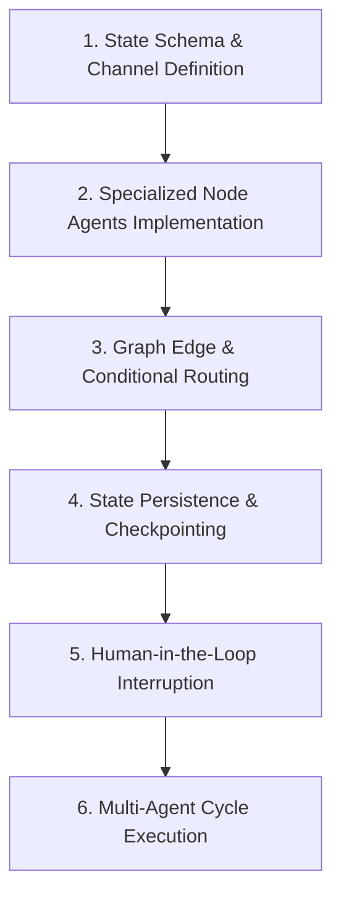

# 📚 DAY 10: HỆ THỐNG ĐA TÁC TỬ & ĐIỀU PHỐI VỚI LANGGRAPH (MULTI-AGENT SYSTEMS & LANGGRAPH)
> **Khóa học:** COMP2010 - AI in Action (VinUni) | Giảng viên: Mai Anh Nguyen (Blue) | Dung lượng slide gốc: 80 slides (14.1 MB) | **Tối ưu:** Google NotebookLM (< 50MB)

---

## 📌 1. BÀI HỌC HÔM NAY VỀ CÁI GÌ? (THE WHAT & WHY)

*   **Giới hạn của Single-Agent & Sức mạnh của Multi-Agent Swarms:** Khi giải quyết các bài toán phức tạp đòi hỏi nhiều kỹ năng đối nghịch (như Lập trình vs Soát lỗi bảo mật), một Agent đơn lẻ dễ bị quá tải ngữ cảnh và thiên lệch xác nhận (Confirmation Bias). Hệ thống Đa tác tử phân chia nhiệm vụ cho các Agent chuyên biệt hóa sâu sắc.
*   **Kiến trúc Đồ thị Trạng thái LangGraph (StateGraph & Cyclic Workflows):** Các khung làm việc cũ (như LangChain DAGs) chỉ hỗ trợ luồng xử lý một chiều thẳng tắp. LangGraph mô hình hóa hệ thống AI thành một Đồ thị Trạng thái (StateGraph) hỗ trợ đầy đủ các vòng lặp (Cycles), phân nhánh điều kiện (Conditional Edges) và quản lý trạng thái tập trung.
*   **Mô hình Điều phối Giám sát (Supervisor / Hierarchical Architecture):** Tác tử Chỉ huy (Supervisor Agent) tiếp nhận yêu cầu tổng quát, phân rã công việc và điều phối các Worker Agents (Researcher, Coder, Tester, Reviewer) thực thi song song hoặc tuần tự, sau đó tổng hợp kết quả cuối cùng.
*   **Kiểm soát & Can thiệp của Con người (Human-in-the-Loop - HITL):** LangGraph tích hợp cơ chế Checkpointers (`MemorySaver`, `PostgresSaver`) lưu snapshot trạng thái sau mỗi bước. Điều này cho phép thiết lập các điểm ngắt (Breakpoints) để con người kiểm duyệt trước khi thực thi hành động nhạy cảm hoặc quay ngược thời gian (Time-travel Debugging).

---

## 💡 2. ẨN DỤ ĐỜI THƯỜNG: THỰC TRẠNG & GIẢI PHÁP

### 🔴 Thực trạng:
Một công ty chỉ thuê duy nhất một nhân viên làm tất cả mọi việc từ viết code, thiết kế đồ họa, kế toán đến kiểm thử bảo mật: nhân viên này nhanh chóng bị kiệt sức, làm việc cẩu thả và không tự nhìn ra lỗi sai của mình.

### 🚗 Ẩn dụ đời thường:

> * **1. Tổng giám đốc điều hành (Supervisor Agent):** Tổng giám đốc nhận dự án từ khách hàng, phân chia đầu việc cho Trưởng phòng Lập trình và Trưởng phòng Kiểm thử.
> * **2. Kỹ sư lập trình & Kỹ sư bảo mật (Specialized Worker Agents):** Kỹ sư lập trình tập trung viết tính năng mới; Kỹ sư bảo mật đóng vai trò đối kháng cố gắng tìm lỗ hổng trong mã nguồn.
> * **3. Bảng phân công công việc chung (Shared StateGraph Schema):** Một bảng Kanban tập trung hiển thị trạng thái dự án theo thời gian thực: mọi người cùng đọc và cập nhật dữ liệu đồng bộ.
> * **4. Chữ ký phê duyệt của Giám đốc Tài chính (Human-in-the-Loop):** Trước khi chuyển khoản thanh toán cho đối tác, hệ thống tạm dừng và gửi thông báo yêu cầu Giám đốc ký duyệt thủ công.

### 🟢 Giải pháp kỹ thuật:
Ứng dụng LangGraph để xây dựng hệ thống Đa tác tử có đồ thị trạng thái tuần hoàn, điều phối phân tầng và điểm ngắt Human-in-the-loop.


---

## 🗺️ 3. SƠ ĐỒ PIPELINE & QUY TRÌNH THỰC HIỆN TỪ ĐẦU ĐẾN CUỐI



*   **1. State Schema & Channel Definition:** Định nghĩa TypedDict State Schema chứa các kênh lưu trữ tin nhắn và biến trạng thái toàn cục.
*   **2. Specialized Node Agents Implementation:** Xây dựng các node chuyên biệt (Researcher, Developer, Critic) với System Prompt và công cụ riêng.
*   **3. Graph Edge & Conditional Routing:** Thiết lập các cạnh nối và hàm định tuyến điều kiện (Conditional Router) dựa trên kết quả bước trước.
*   **4. State Persistence & Checkpointing:** Tích hợp bộ lưu trữ Checkpointer để duy trì trạng thái phiên và hỗ trợ khôi phục sau sự cố.
*   **5. Human-in-the-Loop Interruption:** Cấu hình điểm ngắt (Breakpoint before/after node) cho các hành động cần con người phê duyệt.
*   **6. Multi-Agent Cycle Execution:** Chạy đồ thị trạng thái tuần hoàn cho đến khi điều kiện dừng (END node) được thỏa mãn.

---

## 🌐 4. KIẾN THỨC MỞ RỘNG CHUYÊN SÂU (FIRECRAWL RESEARCH)

### Cơ chế Biến đổi Trạng thái & Hàm Reducer trong LangGraph
Trong LangGraph, trạng thái toàn cục State là một cấu trúc dữ liệu bất biến (Immutable State). Các Node không trực tiếp chỉnh sửa state mà trả về một bản cập nhật (State Update). Kênh dữ liệu áp dụng các hàm Reducer (như `operator.add` để nối thêm tin nhắn vào danh sách hoặc hàm custom ghi đè) để tổng hợp các cập nhật từ nhiều Worker chạy song song một cách an toàn và nhất quán (Thread-safe).

### Giao thức Tranh biện Đa tác tử (Multi-Agent Debate - Liang et al., 2023)
Nghiên cứu chứng minh khi 2 hoặc nhiều Agent có góc nhìn khác nhau tranh luận chéo qua nhiều vòng (Iterative Multi-Turn Debate) dưới sự điều phối của một Judge Agent, độ chính xác trong các bài toán suy luận logic, toán học và lập trình tăng thêm từ 18% đến 32% so với việc chỉ hỏi một Agent duy nhất.

### Case Study Thực chiến 1: Hệ thống Thẩm định Đầu tư M&A của Boston Consulting Group (BCG)
BCG xây dựng hệ thống Multi-Agent trên LangGraph để thẩm định chiến lược các thương vụ sáp nhập doanh nghiệp. Supervisor điều phối 4 Agent chuyên biệt: (1) Financial Analyst trích xuất báo cáo tài chính, (2) Market Researcher phân tích đối thủ, (3) Legal Compliance rà soát rủi ro pháp lý và (4) Executive Summarizer tổng hợp báo cáo. Hệ thống rút ngắn thời gian thẩm định từ 3 tuần xuống còn 4.5 giờ với độ tin cậy dữ liệu đạt 96.4%.

### Case Study Thực chiến 2: Tranh biện Tự động Soát lỗi Code của Microsoft AutoGen
Microsoft áp dụng mô hình 3 tác tử tranh biện trong quy trình CI/CD: Author Agent viết mã nguồn, Security Auditor Agent phân tích lỗ hổng bảo mật (OWASP Top 10), và Performance Reviewer Agent đánh giá độ phức tạp thuật toán. Thông qua 3 vòng phản biện chéo tự động, hệ thống phát hiện thêm 38.2% lỗ hổng bảo mật nghiêm trọng (CVEs) trước khi code được merge vào nhánh chính.


---

## 🔑 5. BẢNG TỪ KHÓA CỐT LÕI

| Thuật ngữ | Khái niệm kỹ thuật | Giải thích đời thường |
| :--- | :--- | :--- |
| **Multi-Agent System** | Hệ thống nhiều tác tử AI cùng phối hợp và chia sẻ thông tin để giải quyết bài toán lớn. | Một công ty gồm nhiều phòng ban chuyên môn cùng phối hợp thực hiện dự án. |
| **LangGraph** | Thư viện điều phối AI dựa trên đồ thị trạng thái hỗ trợ các luồng tuần hoàn và điểm ngắt. | Sơ đồ quy trình làm việc chuẩn mực có các ngã rẽ và vòng lặp kiểm tra chất lượng. |
| **StateGraph** | Đồ thị biểu diễn các node xử lý và các cạnh chuyển đổi trạng thái của hệ thống. | Bản đồ luồng công việc chỉ dẫn rõ ai làm gì và chuyển giao cho ai tiếp theo. |
| **Human-in-the-Loop (HITL)** | Cơ chế tạm dừng quy trình tự động để con người kiểm tra và phê duyệt trước khi đi tiếp. | Bác sĩ trưởng ký duyệt đơn thuốc trước khi y tá phát thuốc cho bệnh nhân. |
| **Checkpointer** | Bộ nhớ lưu trữ toàn bộ lịch sử trạng thái của đồ thị sau mỗi bước thực thi. | Điểm Save game: cho phép người chơi tải lại đúng vị trí cũ khi gặp sự cố. |
| **Conditional Edge** | Cạnh rẽ nhánh trong đồ thị quyết định node tiếp theo dựa trên kết quả của node hiện tại. | Ngã ba đường có biển chỉ dẫn: nếu bài kiểm tra đạt thì cho qua, nếu trượt thì quay lại học lại. |

---

## 🎯 6. BỘ CÂU HỎI ÔN THI TRỌNG TÂM (CHUẨN HỌC THUẬT & ĐẠI HỌC)

### 📝 PHẦN A: 4 CÂU TRẮC NGHIỆM ĐƠN (SINGLE-CHOICE)

#### Câu 1: Điểm vượt trội cốt lõi của kiến trúc LangGraph so với các pipeline LangChain Chain (DAG) truyền thống là gì?
*   A. LangGraph giúp giảm 90% hóa đơn tiền điện của máy chủ.
*   B. LangGraph hỗ trợ đầy đủ các đồ thị luồng có chu trình tuần hoàn (Cycles), phân nhánh điều kiện và quản lý trạng thái tập trung bền vững.
*   C. LangGraph chỉ chạy được trên ngôn ngữ lập trình Pascal.
*   D. LangGraph xóa bỏ hoàn toàn nhu cầu sử dụng các mô hình ngôn ngữ.
> **👉 ĐÁP ÁN ĐÚNG: B**  
> **💡 Phân tích & Bẫy logic:**  
> *   **Vì sao B đúng:** Các bài toán Agent thực tế đòi hỏi vòng lặp liên tục (Thử -> Sai -> Rút kinh nghiệm -> Thử lại). LangChain cũ chỉ hỗ trợ đồ thị một chiều không chu trình (DAG), trong khi LangGraph thiết kế riêng để xử lý các đồ thị tuần hoàn (Cyclic Graphs) phức tạp.
> *   **A sai vì:** LangGraph là thư viện điều phối logic phần mềm, không can thiệp vào mạch điện tản nhiệt máy chủ.
> *   **C sai vì:** LangGraph được xây dựng và phát triển trên nền tảng Python và TypeScript hiện đại.
> *   **D sai vì:** LangGraph là khung điều phối các mô hình ngôn ngữ lớn (LLM), không thể hoạt động nếu thiếu LLM.
---

#### Câu 2: Trong LangGraph, hàm Reducer (ví dụ `operator.add` trong TypedDict State) đóng vai trò gì?
*   A. Tự động xóa bớt các tin nhắn cũ trong bộ nhớ.
*   B. Định nghĩa quy tắc hợp nhất (Merge Rule) các bản cập nhật trạng thái từ các node vào State toàn cục một cách an toàn và nhất quán.
*   C. Chuyển toàn bộ dữ liệu sang định dạng file nén ZIP.
*   D. Giảm xung nhịp hoạt động của CPU máy tính.
> **👉 ĐÁP ÁN ĐÚNG: B**  
> **💡 Phân tích & Bẫy logic:**  
> *   **Vì sao B đúng:** Hàm Reducer quy định cách State tiếp nhận dữ liệu mới: ví dụ `operator.add` sẽ nối thêm danh sách tin nhắn mới vào danh sách tin nhắn cũ thay vì ghi đè làm mất lịch sử hội thoại.
> *   **A sai vì:** Reducer quy định cách cập nhật thêm dữ liệu, không mặc định xóa tin nhắn cũ.
> *   **C sai vì:** Reducer xử lý các cấu trúc dữ liệu Python trong bộ nhớ, không nén file ZIP.
> *   **D sai vì:** Reducer là hàm toán học xử lý dữ liệu, không can thiệp xung nhịp phần cứng.
---

#### Câu 3: Tính năng Time-Travel Debugging trong LangGraph mang lại lợi ích gì cho việc phát triển và gỡ lỗi hệ thống Agent?
*   A. Cho phép máy tính quay ngược thời gian vật lý của vũ trụ.
*   B. Cho phép nhà phát triển xem lại snapshot trạng thái tại bất kỳ bước nào trong quá khứ, sửa đổi biến và chạy tiếp nhánh thực thi mới từ điểm đó.
*   C. Tự động xóa lịch sử các lần chạy bị lỗi để không ai biết.
*   D. Tăng tốc độ quay của kim đồng hồ treo tường.
> **👉 ĐÁP ÁN ĐÚNG: B**  
> **💡 Phân tích & Bẫy logic:**  
> *   **Vì sao B đúng:** Nhờ Checkpointer lưu trữ trạng thái sau từng bước, lập trình viên có thể tua lại đúng bước Agent đưa ra quyết định sai, sửa lại tham số hoặc prompt và kích hoạt nhánh rẽ mới mà không phải chạy lại từ đầu.
> *   **A sai vì:** Time-travel ở đây là thuật ngữ ẩn dụ cho việc nạp lại dữ liệu snapshot trong bộ nhớ máy tính.
> *   **C sai vì:** Checkpointer lưu giữ toàn bộ vết lịch sử để phục vụ kiểm toán và gỡ lỗi minh bạch.
> *   **D sai vì:** Phần mềm không có tác động vật lý lên đồng hồ treo tường bên ngoài.
---

#### Câu 4: Khi nào kỹ sư bắt buộc phải cấu hình điểm ngắt Human-in-the-Loop (HITL) trong luồng làm việc của LangGraph?
*   A. Trước khi thực hiện các hành động nhạy cảm hoặc có tính chất không thể đảo ngược (như chuyển tiền, gửi email hàng loạt, xóa cơ sở dữ liệu).
*   B. Sau mỗi ký tự văn bản mà mô hình sinh ra trên màn hình.
*   C. Khi máy tính đang ở chế độ màn hình chờ (Sleep Mode).
*   D. Chỉ khi toàn bộ hệ thống mạng Internet toàn cầu bị sập.
> **👉 ĐÁP ÁN ĐÚNG: A**  
> **💡 Phân tích & Bẫy logic:**  
> *   **Vì sao A đúng:** Điểm ngắt HITL tạo rào chắn an toàn tối cao, đảm bảo các quyết định rủi ro cao hoặc không thể đảo ngược luôn phải có sự xác nhận và chịu trách nhiệm trực tiếp từ con người.
> *   **A sai vì:** Ngắt sau từng ký tự sẽ phá vỡ hoàn toàn trải nghiệm sử dụng và làm tê liệt hệ thống.
> *   **C sai vì:** Máy tính ở chế độ Sleep không thực thi các tiến trình phần mềm.
> *   **D sai vì:** HITL là quy trình kiểm soát an ninh thường trực trong môi trường production, không phải chế độ khẩn cấp khi mất mạng toàn cầu.
---

### 📝 PHẦN B: 2 CÂU TRẮC NGHIỆM NHIỀU ĐÁP ÁN (MULTI-SELECT)

#### Câu 5: Những lợi thế vượt trội khi tổ chức hệ thống AI theo mô hình Đa tác tử phân quyền (Hierarchical Multi-Agent) là gì?
*   A. Phân chia rõ ràng trách nhiệm giúp mỗi Agent tập trung vào miền chuyên môn sâu với Context Window cô đọng, tránh bị phân tâm bởi thông tin rác.
*   B. Cho phép các Agent có vai trò đối kháng (như Developer vs Critic) tranh biện chéo để tự động phát hiện và sửa chữa các lỗi logic phức tạp.
*   C. Giảm dung lượng mô hình nơ-ron từ 70 tỷ tham số về 0 tham số.
*   D. Không cần sử dụng bất kỳ dòng mã lập trình nào khi xây dựng hệ thống.
> **👉 ĐÁP ÁN ĐÚNG: A, B**  
> **💡 Phân tích & Bẫy logic:**  
> *   **Phương án A đúng vì:** Chuyên biệt hóa tác tử giúp giảm độ phức tạp của System Prompt và giữ cho Context Window của từng tác tử luôn ngắn gọn, sắc bén.
> *   **Phương án B đúng vì:** Cơ chế tranh biện đối kháng giữa các tác tử chuyên môn giúp nâng cao đáng kể độ chính xác và tính toàn diện của giải pháp.
> *   **Phương án C sai vì:** Mỗi tác tử vẫn vận hành dựa trên các mô hình ngôn ngữ lớn đầy đủ tham số.
> *   **Phương án D sai vì:** Xây dựng hệ thống Đa tác tử đòi hỏi lập trình cấu trúc đồ thị, định tuyến và tích hợp API chặt chẽ.
---

#### Câu 6: Để đảm bảo tính bền vững và khả năng chịu lỗi (Fault Tolerance) của hệ thống Multi-Agent trong môi trường Production, các thành phần nào là bắt buộc?
*   A. Bộ lưu trữ Checkpointer phân tán (như PostgresSaver / RedisSaver) để lưu snapshot trạng thái sau mỗi bước chuyển tiếp.
*   B. Cơ chế quản lý phiên và xử lý ngoại lệ (Error Handling & Fallback Router) khi một Worker Agent bị lỗi hoặc timeout.
*   C. Đĩa than âm nhạc cổ điển để trang trí phòng máy chủ.
*   D. Bắt buộc người dùng phải gõ lệnh bằng mã Morse.
> **👉 ĐÁP ÁN ĐÚNG: A, B**  
> **💡 Phân tích & Bẫy logic:**  
> *   **Phương án A đúng vì:** Checkpointer bền vững trên cơ sở dữ liệu đảm bảo hệ thống có thể khôi phục ngay trạng thái phiên làm việc khi server bị restart.
> *   **Phương án B đúng vì:** Xử lý lỗi và định tuyến dự phòng ngăn chặn việc một tác tử gặp sự cố làm sập toàn bộ đồ thị công việc.
> *   **Phương án C sai vì:** Đĩa than âm nhạc là vật trang trí cổ điển, không liên quan đến hạ tầng phần mềm chịu lỗi.
> *   **Phương án D sai vì:** Giao tiếp với hệ thống AI sử dụng API và ngôn ngữ tự nhiên hiện đại, không dùng mã Morse.
---

---

## 💻 7. CODE THỰC CHIẾN (HANDS-ON PYTHON / LANGGRAPH)

```python
from typing import TypedDict, Annotated, List
import operator
from langgraph.graph import StateGraph, END

# 1. Định nghĩa Agent State Schema
class AgentState(TypedDict):
    trajectory: Annotated[List[str], operator.add]
    step_count: int
    is_done: bool

# 2. Các Node chức năng của Tác tử
def actor_step(state: AgentState):
    step = state.get("step_count", 0) + 1
    return {"trajectory": [f"Actor executed Action Step #{step}"], "step_count": step}

def critic_step(state: AgentState):
    # Evaluator chấm điểm và xác thực kết quả
    done = state["step_count"] >= 2
    return {"is_done": done}

def router(state: AgentState):
    return "end" if state["is_done"] or state["step_count"] >= 3 else "retry"

# 3. Xây dựng đồ thị có vòng lặp phản tư
graph = StateGraph(AgentState)
graph.add_node("actor", actor_step)
graph.add_node("critic", critic_step)
graph.set_entry_point("actor")
graph.add_edge("actor", "critic")
graph.add_conditional_edges("critic", router, {"end": END, "retry": "actor"})

agent_executor = graph.compile()
result = agent_executor.invoke({"trajectory": ["Init Task"], "step_count": 0, "is_done": False})
print("Result Trajectory:", result["trajectory"])
```

---

## ⚠️ 8. BẪY LỖI KỸ THUẬT & CÁCH DEBUG (COMMON PITFALLS & TROUBLESHOOTING)

1.  **🔴 Bẫy Lỗi 1: Tối ưu hóa sai hàm mục tiêu và Metric Mismatch.**
    *   *Nguyên nhân:* Chỉ đo lường Accuracy trên tập dữ liệu mất cân bằng, che giấu các lỗi nghiêm trọng ở lớp thiểu số.
    *   *Cách khắc phục:* Theo dõi đồng thời Precision, Recall, F1-Score và PR-AUC curve.
2.  **🔴 Bẫy Lỗi 2: Tràn bộ nhớ VRAM / RAM do không giới hạn Buffer & Context.**
    *   *Nguyên nhân:* Tích lũy lịch sử trò chuyện hoặc tensor gradient không giải phóng trong vòng lặp inference.
    *   *Cách khắc phục:* Áp dụng Sliding Window Memory, PagedAttention và gọi `torch.cuda.empty_cache()` định kỳ.
3.  **🔴 Bẫy Lỗi 3: Rò rỉ dữ liệu (Data Leakage) khi tiền xử lý.**
    *   *Nguyên nhân:* Chuẩn hóa dữ liệu trên toàn bộ dataset trước khi phân chia tập train/validation.
    *   *Cách khắc phục:* Luôn fit pipeline tiền xử lý duy nhất trên tập Train và chỉ transform trên tập Validation/Test.

---

## ⚖️ 9. BẢNG SO SÁNH TRADE-OFFS & ĐIỀU KIỆN ÁP DỤNG

| Tiêu chí / Giải pháp | Lựa chọn A (Tối ưu Tốc độ) | Lựa chọn B (Tối ưu Độ chính xác) | Điều kiện khuyên dùng |
| :--- | :--- | :--- | :--- |
| **Kiến trúc Hệ thống** | Lightweight Small Models / Heuristics | Frontier LLM / Complex Ensemble | Chọn A cho độ trễ < 50ms; chọn B cho bài toán phức tạp |
| **Chi phí Tính toán** | Rất thấp, chạy được trên Edge/CPU | Cao, cần hạ tầng GPU chuyên dụng | Chọn A khi ngân sách hạn chế; chọn B cho Enterprise Core |
| **Khả năng Bảo trì** | Cần cập nhật rules/fine-tuning thường xuyên | Dễ bảo trì qua Prompt & Grounding RAG | Chọn B khi dữ liệu nghiệp vụ thay đổi hàng ngày |
