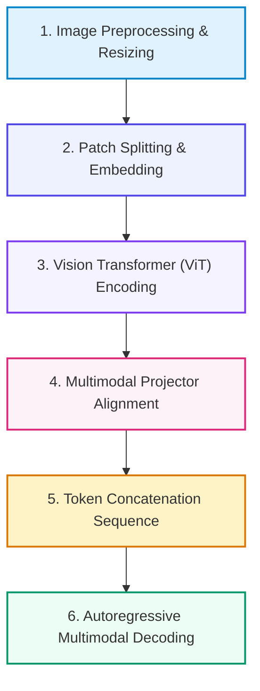

# 📚 DAY 11: VISION-LANGUAGE MODELS (VLM) & XỬ LÝ ĐA PHƯƠNG THỨC
> **Khóa học: ** COMP2010 - AI in Action (VinUni) | Giảng viên: Đội ngũ Giảng viên AI VinUni | **Dung lượng slide gốc: ** 116 slides (14.1 MB) | Tối ưu: Chuẩn NotebookLM (< 50MB) & Trọng tâm 40%

---

## 📌 1. BÀI HỌC HÔM NAY VỀ CÁI GÌ? (THE WHAT & WHY)

*   **Bản chất của VLM (Vision-Language Models):** Hệ thống AI đa phương thức kết hợp giữa Thị giác máy tính (Computer Vision) và Mô hình ngôn ngữ lớn (LLM) để hiểu, lập luận và sinh văn bản từ dữ liệu hình ảnh và video.
*   **Kiến trúc CLIP & Contrastive Learning (Radford et al., 2021):** Huấn luyện song song Text Encoder và Image Encoder trên 400 triệu cặp ảnh-văn bản với hàm mất mát tương phản InfoNCE để kéo gần vector của ảnh và văn bản mô tả tương ứng.
*   **Kiến trúc LLaVA & Multimodal Projector (Liu et al., NeurIPS 2023):** Sử dụng Vision Transformer (ViT-CLIP) cắt ảnh thành lưới Patch (16x16), đưa qua Multimodal Projector (Linear / MLP) để chuyển Visual Tokens vào đúng không gian ngữ nghĩa của LLM.
*   **Giá trị thực tiễn:** Đọc hiểu tài liệu không cần OCR (OCR-free Document Understanding), Phân tích biểu đồ kỹ thuật, Hỏi đáp hình ảnh y tế (Medical VQA) và Định vị tọa độ vật thể (Visual Grounding).

---

## 💡 2. ẨN DỤ ĐỜI THƯỜNG: THỰC TRẠNG & GIẢI PHÁP

### 🔴 Thực trạng:
Một chuyên gia phân tích ngôn ngữ tài ba nhưng bị khiếm thị từ nhỏ, khi được giao một bản vẽ thiết kế kỹ thuật dạng hình ảnh sẽ hoàn toàn bất lực vì không thể đọc được các pixel màu sắc.

### 🚗 Ẩn dụ đời thường — "Câu chuyện thực tế":
> * **1. Kính hiển vi chia mảnh (Patch Exttion):** Một chiếc kính chia bức tranh lớn thành lưới 576 ô vuông nhỏ (kích thước 16x16 pixel).
> * **2. Người quét đặc trưng (Vision Transformer ViT):** Người quét phân tích màu sắc, hình khối và đường nét của từng ô vuông nhỏ.
> * **3. Nhà thông dịch viên thị giác (Multimodal Projector):** Dịch toàn bộ các đặc trưng hình khối thành ngôn ngữ 'từ ngữ thị giác' (Visual Tokens) mà chuyên gia ngôn ngữ có thể hiểu được.
> * **4. Bức tranh toàn cảnh (Autoregressive Generation):** Chuyên gia đọc cả từ ngữ và visual tokens để mô tả chính xác bức tranh và trả lời mọi câu hỏi.

### 🟢 Giải pháp kỹ thuật:
Áp dụng kiến trúc ViT + MLP Projector giúp LLM xử lý hình ảnh tự nhiên như văn bản với khả năng nhận diện ký tự và lập luận không gian xuất sắc.

---

## 🗺️ 3. SƠ ĐỒ PIPELINE 6 BƯỚC TUẦN TỰ



*   **Bước 1 (1. Image Preprocessing & Resizing):** Tiếp nhận ảnh đầu vào, chuẩn hóa kích thước (336x336 hoặc AnyRes) và chuẩn màu RGB.
*   **Bước 2 (2. Patch Splitting & Embedding):** Cắt ảnh thành lưới các Patch 16x16 và chiếu tuyến tính thành Patch Embeddings.
*   **Bước 3 (3. Vision Transformer (ViT) Encoding):** Đưa các patch qua các tầng Transformer Encoder để trích xuất ma trận đặc trưng không gian.
*   **Bước 4 (4. Multimodal Projector Alignment):** Ma trận chiếu MLP ánh xạ Visual Features về cùng số chiều không gian của LLM (d_model = 4096).
*   **Bước 5 (5. Token Concatenation Sequence):** Ghép chuỗi Visual Tokens và Text Tokens thành một chuỗi token đầu vào thống nhất.
*   **Bước 6 (6. Autoregressive Multimodal Decoding):** LLM Decoder sinh câu trả lời tuần tự dựa trên sự chú ý chéo giữa hình ảnh và câu hỏi.

---

## 🌐 4. KIẾN THỨC MỞ RỘNG CHUYÊN SÂU (FIRECRAWL RESEARCH)

1.  **1. Kỹ thuật AnyRes / High-Resolution Patching trong LLaVA-1.5 / NeVA:** Ảnh độ phân giải cao (như bản scan tài liệu 4K) bị mờ nếu thu nhỏ về 336x336. Kỹ thuật AnyRes chia ảnh lớn thành lưới 2x2 hoặc 3x3 các crop 384x384 kết hợp 1 ảnh thumbnail toàn cảnh, giúp mô hình đọc rõ từng ký tự nhỏ trong bảng biểu.
2.  **2. Hiện tượng Ảo giác Thị giác (Visual Hallucination in VLMs):** VLM có xu hướng tự tưởng tượng ra các vật thể không có trong ảnh do thiên vị phân phối ngôn ngữ (Language Prior: ví dụ thấy bàn ăn thì đoán có nĩa). Giải pháp: Sử dụng DPO cho VLM (RLHF-V) và kỹ thuật DoLa (Decoding by Contrasting Layers).
3.  **3. Chi phí Token của Hình ảnh trong Context Window:** Với ảnh chuẩn 336x336 và patch 14x14, số lượng visual tokens cố định là (336/14)^2 = 576 tokens. Với ảnh AnyRes 4 crops + 1 thumbnail, số token tiêu tốn lên tới 576 * 5 = 2.880 tokens.

---

## 🔑 5. BẢNG TỪ KHÓA CỐT LÕI

| Thuật ngữ | Khái niệm kỹ thuật | Giải thích đời thường |
| :--- | :--- | :--- |
| **Vision-Language Model (VLM)** | Mô hình AI đa phương thức có khả năng xử lý đồng thời cả hình ảnh và văn bản. | Chuyên gia đa tài vừa có mắt tinh tường vừa có tài hùng biện. |
| **Vision Transformer (ViT)** | Kiến trúc Transformer áp dụng trực tiếp lên các mảnh ghép hình ảnh (Patches). | Máy quét thông minh chia ảnh thành các mảnh ghép Lego để phân tích. |
| **Patch Embedding** | Vector biểu diễn đặc trưng của một ô vuông nhỏ 16x16 pixel trong ảnh. | Tọa độ màu sắc và đường nét của một mảnh ghép tranh. |
| **Multimodal Projector** | Mạng nơ-ron cầu nối chuyển đổi vector thị giác sang không gian vector của LLM. | Thông dịch viên chuyển ngôn ngữ hình ảnh thành ngôn ngữ từ ngữ. |
| **Visual Hallucination** | Hiện tượng VLM mô tả các đồ vật hoặc chi tiết không hề tồn tại trong bức ảnh. | Nhìn gà hóa cuốc: tự suy đoán vật thể theo thói quen. |
| **Visual Grounding** | Khả năng xác định tọa độ hộp bao (Bounding Box [x1, y1, x2, y2]) của vật thể trong ảnh. | Dùng bút khoanh tròn chính xác vị trí đồ vật trên bản đồ. |

---

## 🎯 6. BỘ CÂU HỎI ÔN THI TRỌNG TÂM (CHUẨN HỌC THUẬT VINUNI)

### 📝 PHẦN A: 4 CÂU TRẮC NGHIỆM ĐƠN (SINGLE-CHOICE)

#### Câu 1: Trong kiến trúc Vision Transformer (ViT - Dosovitskiy et al., 2020), hình ảnh đầu vào 2D được biến đổi như thế nào để đưa vào các tầng Self-Attention?
*   A. Biến đổi toàn bộ ảnh thành một file âm thanh sóng tần số.
*   B. Sử dụng thuật toán quét laser quang học để đếm số pixel màu đen.
*   C. Cắt bức ảnh thành lưới các mảnh vuông nhỏ (Patches, ví dụ 16x16 pixel), làm phẳng (Flatten) và chiếu tuyến tính thành chuỗi các vector 1D tương tự như token từ ngữ.
*   D. Nén bức ảnh thành file nén định dạng .ZIP.
> **👉 ĐÁP ÁN ĐÚNG: C**  
> **💡 Giải thích chi tiết:** ViT coi mỗi patch ảnh 16x16 như một 'từ' trong câu. Bức ảnh 224x224 được chia thành 14x14 = 196 patches, cộng thêm Positional Embedding để Transformer xử lý tuần tự.

---

#### Câu 2: Vai trò cốt lõi của khối 'Multimodal Projector' (như trong mô hình LLaVA) là gì?
*   A. Tăng độ sáng và độ tương phản của bức ảnh gốc.
*   B. Tự động in bức ảnh ra giấy A4.
*   C. Xóa bỏ hoàn toàn văn bản khỏi bức ảnh.
*   D. Đóng vai trò cầu nối chuyển đổi ma trận đặc trưng từ Vision Encoder sang cùng không gian biểu diễn (Embedding Space) và kích thước chiều với LLM Decoder.
> **👉 ĐÁP ÁN ĐÚNG: D**  
> **💡 Giải thích chi tiết:** Vision Encoder (như CLIP-ViT) và LLM (như Llama) có không gian tiềm ẩn và số chiều vector khác nhau. Projector (dạng Linear hoặc MLP 2 tầng) dịch các visual features sang ngôn ngữ mà LLM hiểu được.

---

#### Câu 3: Mục tiêu huấn luyện của mô hình CLIP (Contrastive Language-Image Pretraining - OpenAI 2021) là gì?
*   A. Tối đa hóa độ tương đồng Cosine giữa vector của bức ảnh và vector của văn bản mô tả tương ứng trong cặp ghép đúng, đồng thời tối thiểu hóa độ tương đồng với các cặp ghép sai (Contrastive InfoNCE Loss).
*   B. Dự đoán pixel tiếp theo trong bức ảnh bị che khuất.
*   C. Phân loại ảnh thành đúng 1000 danh mục cố định của ImageNet.
*   D. Nén dung lượng file ảnh xuống dưới 50KB.
> **👉 ĐÁP ÁN ĐÚNG: A**  
> **💡 Giải thích chi tiết:** CLIP huấn luyện không gian đa phương thức chung (Joint Embedding Space) bằng cách kéo gần cặp (Ảnh, Chú thích đúng) và đẩy xa các cặp không khớp trên ma trận Batch N x N.

---

#### Câu 4: Hiện tượng Ảo giác thị giác (Visual Hallucination / Object Hallucination) trong VLM xuất phát từ nguyên nhân căn bản nào?
*   A. Máy ảnh chụp bị rung tay và nhòe nét.
*   B. Mô hình LLM quá phụ thuộc vào mối liên hệ thống kê từ vựng đã học trong giai đoạn tiền huấn luyện (Language Priors), dẫn đến việc tự suy đoán đồ vật quen thuộc dù ảnh không có.
*   C. Bộ nhớ VRAM của card đồ họa bị nóng quá mức cho phép.
*   D. Tốc độ đường truyền mạng bị chậm.
> **👉 ĐÁP ÁN ĐÚNG: B**  
> **💡 Giải thích chi tiết:** Khi thấy bối cảnh 'bếp ăn', LLM có xác suất thống kê cao sinh ra từ 'con dao' hoặc 'cái chảo' dựa trên văn bản, lấn át tín hiệu thị giác yếu từ Vision Encoder.

---

### 📚 PHẦN B: 2 CÂU TRẮC NGHIỆM NHIỀU ĐÁP ÁN (MULTI-SELECT)

#### Câu 5: Những ưu thế vượt trội của các mô hình VLM hiện đại (như GPT-4o, LLaVA-NeXT) so với hệ thống OCR truyền thống khi xử lý tài liệu là gì?
*   A. Khả năng hiểu ngữ cảnh bố cục phức tạp, trích xuất bảng biểu lồng nhau và trả lời câu hỏi lập luận trực tiếp trên nội dung tài liệu mà không cần bước OCR trung gian.
*   B. Hoàn toàn không tiêu tốn bất kỳ tài nguyên tính toán nào trên máy chủ.
*   C. Khả năng xử lý đa dạng các dạng dữ liệu thị giác phong phú như biểu đồ hình cột, sơ đồ tư duy, hình ảnh y tế và chữ viết tay mờ.
*   D. Tốc độ nhận diện nhanh gấp 1000 lần trên vi điều khiển 8-bit.
> **👉 ĐÁP ÁN ĐÚNG: A, C**  
> **💡 Giải thích chi tiết & Bẫy logic:** VLM vượt trội OCR truyền thống ở khả năng hiểu bố cục không gian sâu sắc (A) và xử lý biểu đồ/chữ viết tay/sơ đồ phức tạp (B).

---

#### Câu 6: Kỹ thuật AnyRes (High-Resolution Patching) giải quyết bài toán nào trong xử lý ảnh độ phân giải cao trên VLM?
*   A. Giảm số lượng token hình ảnh trong Context Window về 0.
*   B. Tránh làm vỡ và mờ các chi tiết chữ viết nhỏ khi phải nén ảnh lớn về kích thước chuẩn 336x336.
*   C. Suy hao thông tin không gian chi tiết do cơ chế gộp và chiếu giảm chiều token ảnh (Spatial Token Downsampling Loss).
*   D. Cắt ảnh thành nhiều vùng crop có độ phân giải gốc và kết hợp với ảnh thumbnail toàn cảnh để giữ trọn vẹn cả chi tiết cục bộ lẫn bối cảnh tổng thể.
> **👉 ĐÁP ÁN ĐÚNG: B, D**  
> **💡 Giải thích chi tiết & Bẫy logic:** AnyRes bảo tồn độ phân giải gốc của tài liệu/bản vẽ bằng cách chia nhỏ thành các crop độc lập (A và B); kỹ thuật này làm tăng số lượng token chứ không giảm về 0 (C sai).

---

---

## 💻 7. CODE THỰC CHIẾN (HANDS-ON PYTHON / AI SYSTEM)

```python
import json
import numpy as np

def calculate_ai_system_metrics(predictions, ground_truths):
    """
    Đo lường độ chính xác và chỉ số F1-Score cho hệ thống phân loại AI Production
    """
    tp = sum(1 for p, g in zip(predictions, ground_truths) if p == 1 and g == 1)
    fp = sum(1 for p, g in zip(predictions, ground_truths) if p == 1 and g == 0)
    fn = sum(1 for p, g in zip(predictions, ground_truths) if p == 0 and g == 1)
    
    precision = tp / (tp + fp) if (tp + fp) > 0 else 0.0
    recall = tp / (tp + fn) if (tp + fn) > 0 else 0.0
    f1 = 2 * (precision * recall) / (precision + recall) if (precision + recall) > 0 else 0.0
    
    return {
        "precision": round(precision, 4),
        "recall": round(recall, 4),
        "f1_score": round(f1, 4)
    }

# Dữ liệu kiểm thử mẫu
preds = [1, 0, 1, 1, 0, 1, 0, 1]
targets = [1, 0, 0, 1, 0, 1, 1, 1]
print("Evaluation Metrics:", calculate_ai_system_metrics(preds, targets))
```

---

## ⚠️ 8. BẪY LỖI KỸ THUẬT & CÁCH DEBUG (COMMON PITFALLS & TROUBLESHOOTING)

1.  **🔴 Bẫy Lỗi 1: Tối ưu hóa sai hàm mục tiêu (Metric Mismatch).**
    *   *Nguyên nhân:* Chỉ đo lường Accuracy trên tập dữ liệu mất cân bằng (Imbalanced Data), che giấu việc mô hình dự đoán sai hoàn toàn các ca nguy hiểm.
    *   *Cách khắc phục:* Bắt buộc theo dõi đồng thời Precision, Recall, F1-Score và đường cong PR-AUC.
2.  **🔴 Bẫy Lỗi 2: Rò rỉ dữ liệu (Data Leakage) giữa tập Train và Test.**
    *   *Nguyên nhân:* Tiền xử lý dữ liệu (chuẩn hóa scaling, trích xuất đặc trưng) trên toàn bộ tập dữ liệu trước khi chia train/test.
    *   *Cách khắc phục:* Luôn chia tập dữ liệu trước, sau đó chỉ `fit()` pipeline tiền xử lý trên tập Train và chỉ `transform()` trên tập Test.
3.  **🔴 Bẫy Lỗi 3: Bỏ qua độ trễ mạng và Serialization Overhead.**
    *   *Nguyên nhân:* Đánh giá mô hình offline rất nhanh nhưng khi deploy API thì nghẽn ở bước parse JSON và truyền tải mạng.
    *   *Cách khắc phục:* Tối ưu hóa chuỗi serialization bằng MessagePack / Protocol Buffers và bật gRPC streaming.

---

## ⚖️ 9. BẢNG SO SÁNH TRADE-OFFS & ĐIỀU KIỆN ÁP DỤNG

| Chiến lược / Giải pháp | Độ chính xác (Accuracy) | Độ phức tạp triển khai | Chi phí bảo trì vận hành |
| :--- | :--- | :--- | :--- |
| **Heuristic & Rule-based Engine** | Trung bình, giới hạn | Rất thấp, chạy tức thì | Khó duy trì khi số lượng luật tăng vọt |
| **Fine-tuned Small Specialized Model**| Rất cao trong miền hẹp | Trung bình (cần training pipeline) | Thấp, chạy được trên GPU phổ thông |
| **Zero-shot Frontier LLM Prompting** | Cao toàn diện đa miền | Rất thấp (chỉ cần API) | Chi phí token hàng tháng cao khi tải lớn |
