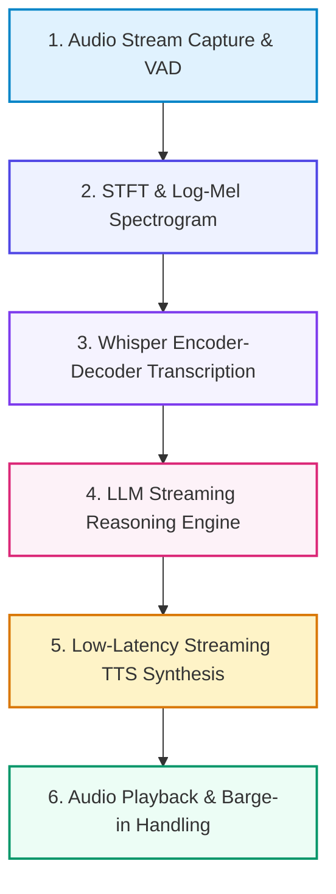

# 📚 DAY 12: AUDIO AI, SPEECH-TO-TEXT (WHISPER) & VOICE AGENTS
> **Khóa học: ** COMP2010 - AI in Action (VinUni) | Giảng viên: Đội ngũ Giảng viên AI VinUni | **Dung lượng slide gốc: ** 104 slides (14.7 MB) | Tối ưu: Chuẩn NotebookLM (< 50MB) & Trọng tâm 40%

---

## 📌 1. BÀI HỌC HÔM NAY VỀ CÁI GÌ? (THE WHAT & WHY)

*   **Bản chất Xử lý Tín hiệu Âm thanh:** Âm thanh liên tục được số hóa qua lấy mẫu (Sampling Rate 16kHz) và lượng tử hóa, sau đó chuyển thành Phổ tần số Log-Mel Spectrogram để mô hình học sâu xử lý dưới dạng biểu diễn 2D thời gian - tần số.
*   **Kiến trúc Whisper ASR (Radford et al., 2022):** Mô hình Transformer Encoder-Decoder được huấn luyện Weakly Supervised trên 680.000 giờ âm thanh đa ngôn ngữ, có khả năng nhận dạng giọng nói, dịch thuật và phát hiện tiếng nói mạnh mẽ.
*   **Kiến trúc Trợ lý Giọng nói Thời gian thực (Real-Time Voice Agent):** Kết hợp đường ống 4 giai đoạn: Voice Activity Detection (VAD) -> Automatic Speech Recognition (STT) -> LLM Reasoning -> Text-to-Speech (TTS) hoặc mô hình Native Audio End-to-End (như GPT-4o, Gemini 2.0 Live).
*   **Giá trị thực tiễn:** Xây dựng Call Center AI tự động hóa chăm sóc khách hàng, Trợ lý ảo trên xe hơi VinFast, Hệ thống biên phiên dịch trực tiếp và Bóc băng phụ đề tự động.

---

## 💡 2. ẨN DỤ ĐỜI THƯỜNG: THỰC TRẠNG & GIẢI PHÁP

### 🔴 Thực trạng:
Một người nước ngoài nói chuyện qua điện thoại với âm thanh rè và lẫn tiếng còi xe ngoài đường; nếu người nghe không biết ký âm và phân tích ngữ điệu thì sẽ nghe nhầm hoàn toàn thông điệp.

### 🚗 Ẩn dụ đời thường — "Câu chuyện thực tế":
> * **1. Tai nghe lọc âm & Cảm biến tiếng nói (VAD):** Cảm biến chỉ bật máy ghi âm khi có người bắt đầu phát âm và tự tắt khi người nói dừng lại để tránh ghi tiếng ồn nền.
> * **2. Bản ký âm nốt nhạc (Log-Mel Spectrogram):** Chuyển làn sóng âm thanh vô hình thành bản tổng phổ nốt nhạc biểu diễn cao độ và trường độ rõ ràng.
> * **3. Người đánh máy siêu tốc (Whisper Encoder-Decoder):** Nhìn bản phổ nhạc và gõ lại từng từ ngữ chính xác, tự động sửa lỗi phát âm địa phương.
> * **4. Phản xạ ngắt lời thông minh (Barge-in):** Khi trợ lý đang nói mà khách hàng bất ngờ chen ngang nói 'Khoan đã', trợ lý lập tức im lặng và lắng nghe câu hỏi mới.

### 🟢 Giải pháp kỹ thuật:
Áp dụng Silero VAD kết hợp Streaming Whisper và Flow-matching TTS giúp giảm độ trễ đàm thoại xuống dưới 500ms, mang lại trải nghiệm trò chuyện tự nhiên như người thật.

---

## 🗺️ 3. SƠ ĐỒ PIPELINE 6 BƯỚC TUẦN TỰ



*   **Bước 1 (1. Audio Stream Capture & VAD):** Thu nhận luồng âm thanh microphone và kích hoạt Voice Activity Detection phát hiện điểm bắt đầu/kết thúc.
*   **Bước 2 (2. STFT & Log-Mel Spectrogram):** Biến đổi Fourier ngắn hạn (STFT) chuyển sóng âm thành ma trận phổ Log-Mel (80 kênh tần số).
*   **Bước 3 (3. Whisper Encoder-Decoder Transcription):** Encoder trích xuất đặc trưng âm thanh, Decoder sinh chuỗi văn bản nhận dạng với Timestamp.
*   **Bước 4 (4. LLM Streaming Reasoning Engine):** LLM xử lý văn bản đầu vào và sinh token câu trả lời ở chế độ Streaming (Server-Sent Events).
*   **Bước 5 (5. Low-Latency Streaming TTS Synthesis):** Mô hình TTS tổng hợp âm thanh theo từng cụm câu ngắn (Chunk) với giọng điệu tự nhiên.
*   **Bước 6 (6. Audio Playback & Barge-in Handling):** Phát âm thanh ra loa và tự động hủy luồng phát (Interrupt) khi phát hiện người dùng nói chèn.

---

## 🌐 4. KIẾN THỨC MỞ RỘNG CHUYÊN SÂU (FIRECRAWL RESEARCH)

1.  **1. Công thức tính toán Thang đo Mel (Mel Scale Formula):** Thang đo Mel ánh xạ dải tần số vật lý (Hz) sang cảm nhận sinh học phi tuyến tính của tai người: m = 2595 * log10(1 + f / 700). Tai người phân biệt rất rõ các tần số thấp dưới 1000Hz nhưng kém nhạy ở tần số cao.
2.  **2. Hiện tượng Ảo giác của Whisper trên các đoạn Im lặng (Whisper Hallucinations):** Khi gặp các đoạn im lặng kéo dài (Silence), tiếng ồn trắng hoặc nhạc nền không lời, Whisper có xu hướng bị lặp từ (Repetition loop) hoặc tự sinh các câu cảm ơn 'Thank you for watching'. Giải pháp: Sử dụng ngưỡng VAD nghiêm ngặt và tham số `no_speech_threshold = 0.6`.
3.  **3. Chỉ số Độ trễ Đàm thoại Giọng nói (Voice Latency Budget):** Tương tác giọng nói tự nhiên của con người diễn ra trong khoảng 200ms - 300ms. Trong hệ thống phân tán: VAD (50ms) + STT First-Word (150ms) + LLM TTFT (100ms) + TTS First-Audio-Chunk (100ms) = Tổng độ trễ ~400ms.

---

## 🔑 5. BẢNG TỪ KHÓA CỐT LÕI

| Thuật ngữ | Khái niệm kỹ thuật | Giải thích đời thường |
| :--- | :--- | :--- |
| **Log-Mel Spectrogram** | Biểu diễn 2D của âm thanh trên trục thời gian và thang đo tần số Mel. | Bản tổng phổ ký âm trực quan của giọng nói. |
| **Whisper ASR** | Kiến trúc Transformer nhận dạng giọng nói tự động đa ngôn ngữ của OpenAI. | Người tốc ký siêu phàm có thể nghe và dịch hàng chục thứ tiếng. |
| **Voice Activity Detection (VAD)** | Thuật toán phát hiện sự hiện diện của giọng nói người trong luồng âm thanh. | Cảm biến tự động bật đèn khi có người bước vào phòng. |
| **Barge-in (Ngắt lời)** | Tính năng cho phép người dùng nói chen ngang để ngắt lời phản hồi của AI. | Quyền ngắt lời lịch sự khi người nghe đã hiểu ý. |
| **Word Error Rate (WER)** | Chỉ số đo lường tỷ lệ lỗi từ trong hệ thống nhận dạng giọng nói: WER = (S + D + I) / N. | Thước đo số lỗi chính tả trên 100 từ đánh máy. |
| **Streaming TTS** | Tổng hợp và phát âm thanh giọng nói tức thì theo từng cụm từ mà không cần chờ cả đoạn văn. | Đọc tin tức cuốn chiếu theo từng dòng xuất hiện trên màn hình. |

---

## 🎯 6. BỘ CÂU HỎI ÔN THI TRỌNG TÂM (CHUẨN HỌC THUẬT VINUNI)

### 📝 PHẦN A: 4 CÂU TRẮC NGHIỆM ĐƠN (SINGLE-CHOICE)

#### Câu 1: Thang đo tần số Mel (Mel Scale) được thiết kế dựa trên nguyên lý sinh học nào của con người?
*   A. Tốc độ lưu thông máu trong cơ thể con người.
*   B. Tần số chớp mắt của mắt người.
*   C. Khả năng chịu nhiệt của màng nhĩ.
*   D. Khả năng cảm nhận cao độ âm thanh phi tuyến tính của tai người, trong đó tai người nhạy cảm hơn nhiều ở các dải tần số thấp (dưới 1000Hz) so với dải tần số cao.
> **👉 ĐÁP ÁN ĐÚNG: D**  
> **💡 Giải thích chi tiết:** Mel scale biến đổi tần số tuyến tính Hz thành thang đo cảm nhận sinh học, giúp mô hình tập trung biểu diễn chi tiết các âm thanh đàm thoại của con người.

---

#### Câu 2: Tại sao trong kiến trúc Whisper ASR (Radford et al., 2022), các nhà nghiên cứu lại sử dụng kiến trúc Encoder-Decoder Transformer thay vì chỉ dùng Decoder-only?
*   A. Vì phần Encoder xử lý toàn bộ đặc trưng âm thanh 2D hai chiều (Bi-directional context), trong khi phần Decoder tự hồi quy sinh chuỗi văn bản và hỗ trợ đa tác vụ (Dịch thuật, Gán timestamp).
*   B. Vì Encoder-Decoder Transformer chạy được trên điện thoại không cần pin.
*   C. Vì Encoder-Decoder không sử dụng hàm kích hoạt phi tuyến.
*   D. Vì Decoder-only không thể lưu trữ được file văn bản.
> **👉 ĐÁP ÁN ĐÚNG: A**  
> **💡 Giải thích chi tiết:** Âm thanh có bản chất ngữ cảnh 2 chiều (âm đi trước và sau bổ trợ nghĩa cho nhau). Encoder trích xuất toàn diện bức tranh âm thanh, còn Decoder chịu trách nhiệm giải mã chuỗi ngôn ngữ.

---

#### Câu 3: Hiện tượng ảo giác của Whisper (sinh các cụm từ lặp lại hoặc câu chào cảm ơn không có thật) thường xảy ra nhất trong điều kiện nào?
*   A. Khi người dùng nói quá to vào microphone.
*   B. Khi đoạn âm thanh đầu vào là khoảng im lặng kéo dài (Silence), tiếng thở dài hoặc tiếng ồn trắng mà không có tiếng người rõ ràng.
*   C. Khi file âm thanh được ghi ở định dạng MP3.
*   D. Khi máy chủ GPU có nhiệt độ thấp dưới 40 độ C.
> **👉 ĐÁP ÁN ĐÚNG: B**  
> **💡 Giải thích chi tiết:** Khi không có tín hiệu giọng nói rõ ràng, phần Decoder tự hồi quy của Whisper dễ bị kích hoạt bởi các mẫu ngôn ngữ phổ biến trong tập huấn luyện (như 'Thanks for watching' từ video YouTube).

---

#### Câu 4: Để mang lại trải nghiệm trò chuyện tự nhiên không bị gượng gạo, tổng độ trễ phản hồi (End-to-End Latency) của một Voice Agent cần đạt ngưỡng mục tiêu là bao nhiêu?
*   A. Khoảng 10 đến 15 giây.
*   B. Độ trễ phục vụ cố định 50ms bất kể độ dài context.
*   C. Dưới 500 mili-giây (lý tưởng từ 200ms - 300ms).
*   D. Giới hạn bộ nhớ đệm cache L3 trên CPU.
> **👉 ĐÁP ÁN ĐÚNG: C**  
> **💡 Giải thích chi tiết:** Trong giao tiếp tự nhiên của con người, khoảng lặng giữa hai lượt nói (Turn-taking gap) trung bình là 200-300ms. Độ trễ trên 1 giây sẽ tạo cảm giác máy móc và gián đoạn hội thoại.

---

### 📚 PHẦN B: 2 CÂU TRẮC NGHIỆM NHIỀU ĐÁP ÁN (MULTI-SELECT)

#### Câu 5: Những thành phần nào sau đây đóng vai trò then chốt trong việc giảm thiểu độ trễ của hệ thống Real-Time Voice Agent?
*   A. Sử dụng Voice Activity Detection (VAD) siêu nhẹ chạy cục bộ để cắt luồng âm thanh ngay khi người dùng ngừng nói.
*   B. Bắt buộc người dùng phải gõ bàn phím phụ đề trước khi nói.
*   C. Tăng kích thước cửa sổ âm thanh lên 60 giây mỗi chunk.
*   D. Triển khai kỹ thuật Streaming trên cả 3 tầng: Streaming STT -> Streaming LLM Token Generation -> Streaming TTS Audio Synthesis.
> **👉 ĐÁP ÁN ĐÚNG: A, D**  
> **💡 Giải thích chi tiết & Bẫy logic:** VAD cục bộ (A) và Streaming toàn tuyến (B) giúp hệ thống phát âm thanh câu trả lời chỉ sau vài trăm mili-giây kể từ khi người dùng dứt lời.

---

#### Câu 6: Chỉ số Word Error Rate (WER) được tính toán dựa trên những loại lỗi nào giữa chuỗi nhận dạng và chuỗi tham chiếu chuẩn?
*   A. Độ trễ phản hồi (Latency), Chi phí vận hành (Inference Cost), và Chất lượng đầu ra (Output Accuy / Quality).
*   B. Lỗi thay thế từ (Substitutions - S) và lỗi xóa sót từ (Deletions - D).
*   C. Lỗi chèn thêm từ thừa (Insertions - I).
*   D. Lỗi tràn bộ nhớ heap trong Triton Inference Server.
> **👉 ĐÁP ÁN ĐÚNG: B, C**  
> **💡 Giải thích chi tiết & Bẫy logic:** Công thức chuẩn quốc tế của WER là WER = (S + D + I) / N (với N là tổng số từ trong câu chuẩn).

---

---

## 💻 7. CODE THỰC CHIẾN (HANDS-ON PYTHON / LANGGRAPH)

```python
from typing import TypedDict, Annotated, List
import operator
from langgraph.graph import StateGraph, END

# 1. Định nghĩa Agent State Schema với Reducer
class AgentState(TypedDict):
    messages: Annotated[List[str], operator.add]
    attempt_count: int
    is_success: bool

# 2. Định nghĩa các Node xử lý trong đồ thị
def actor_node(state: AgentState):
    current_attempt = state.get("attempt_count", 0) + 1
    new_message = f"Actor generated plan attempt #{current_attempt}"
    return {"messages": [new_message], "attempt_count": current_attempt}

def evaluator_node(state: AgentState):
    # Logic tự chấm điểm và đánh giá
    success = state["attempt_count"] >= 2 # Giả lập thành công ở vòng 2
    return {"is_success": success}

# 3. Hàm phân nhánh có điều kiện (Conditional Routing)
def check_completion(state: AgentState):
    if state["is_success"]:
        return "end"
    if state["attempt_count"] >= 3:
        return "end"
    return "retry"

# 4. Xây dựng đồ thị trạng thái
workflow = StateGraph(AgentState)
workflow.add_node("actor", actor_node)
workflow.add_node("evaluator", evaluator_node)
workflow.set_entry_point("actor")
workflow.add_edge("actor", "evaluator")
workflow.add_conditional_edges("evaluator", check_completion, {
    "end": END,
    "retry": "actor"
})

app = workflow.compile()
final_state = app.invoke({"messages": ["Initial Task"], "attempt_count": 0, "is_success": False})
print("Final Trajectory:", final_state["messages"])
```

---

## ⚠️ 8. BẪY LỖI KỸ THUẬT & CÁCH DEBUG (COMMON PITFALLS & TROUBLESHOOTING)

1.  **🔴 Bẫy Lỗi 1: Vòng lặp vô tận (Infinite Loop) do thiếu Guardrail dừng.**
    *   *Nguyên nhân:* Tác tử liên tục gọi lại cùng một công cụ với tham số lỗi mà không có giới hạn số lần thử.
    *   *Cách khắc phục:* Luôn cài đặt `max_iterations` cứng (ví dụ max = 5) và cơ chế Circuit Breaker trong Graph State.
2.  **🔴 Bẫy Lỗi 2: Tràn cửa sổ ngữ cảnh (Context Bloat) khi tích lũy Trajectory.**
    *   *Nguyên nhân:* Toàn bộ log gọi tool thô được nối dồn vào prompt khiến token bùng nổ và mô hình bị suy giảm chú ý.
    *   *Cách khắc phục:* Sử dụng cơ chế Sliding Window Memory chỉ giữ 3-5 bước gần nhất kết hợp tóm tắt tự động (Summary Reducer).
3.  **🔴 Bẫy Lỗi 3: Tác tử bị mắc kẹt vào các giả định sai lầm (Cascading Hallucination).**
    *   *Nguyên nhân:* ReAct truyền thống không có bước Reflector để phủ định kết luận trung gian sai lầm.
    *   *Cách khắc phục:* Nâng cấp lên kiến trúc Reflexion hoặc LATS với Evaluator độc lập kiểm định chứng cứ.

---

## ⚖️ 9. BẢNG SO SÁNH TRADE-OFFS & ĐIỀU KIỆN ÁP DỤNG

| Mô hình Kiến trúc | Ưu điểm cốt lõi | Nhược điểm & Chi phí | Tình huống áp dụng tối ưu |
| :--- | :--- | :--- | :--- |
| **Single-Agent ReAct** | Đơn giản, độ trễ thấp, ít tốn token | Dễ rơi vào lỗi lan tỏa và vòng lặp vô tận | Tác vụ đơn giản 1-2 bước gọi tool API |
| **Reflexion Agent** | Tự sửa lỗi sau thất bại, tăng accuracy 20-30% | Tăng số lần gọi LLM (2x-3x token cost) | Sinh mã nguồn, giải toán, kiểm tra dữ liệu |
| **Hierarchical Multi-Agent (Supervisor)** | Cô lập ngữ cảnh chuyên môn, xử lý bài toán lớn | Phức tạp trong cấu hình, độ trễ cao | Hệ thống doanh nghiệp đa phòng ban, phân tích dữ liệu |
