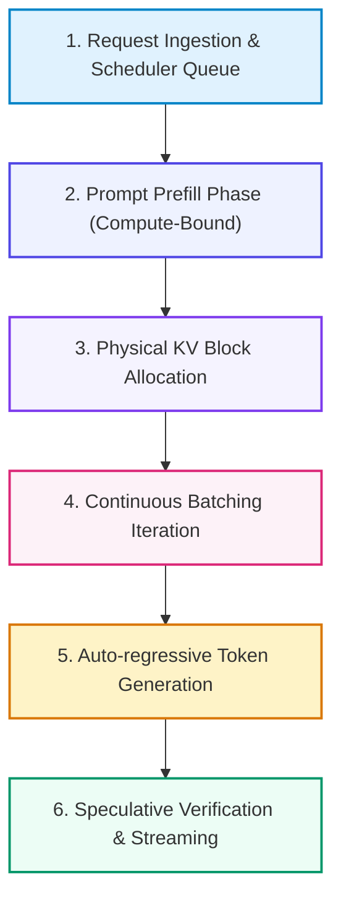

# 📚 DAY 13: LLM SERVING, VLLM, PAGEDATTENTION & TỐI ƯU TRIỂN KHAI
> **Khóa học: ** COMP2010 - AI in Action (VinUni) | Giảng viên: Đội ngũ Giảng viên AI VinUni | **Dung lượng slide gốc: ** 114 slides (13.1 MB) | Tối ưu: Chuẩn NotebookLM (< 50MB) & Trọng tâm 40%

---

## 📌 1. BÀI HỌC HÔM NAY VỀ CÁI GÌ? (THE WHAT & WHY)

*   **Hai giai đoạn suy luận LLM (Prefill vs Decode):** Prefill Phase (Xử lý toàn bộ prompt đầu vào song song, tính chất Compute-bound - giới hạn bởi năng lực tính toán FLOPs) vs Decode Phase (Sinh tuần tự từng token tự hồi quy, tính chất Memory-bandwidth-bound - giới hạn bởi băng thông bộ nhớ VRAM).
*   **Vấn đề phân mảnh bộ nhớ KV Cache:** Trong PyTorch truyền thống, bộ nhớ KV Cache phải được cấp phát tĩnh liên tục theo chiều dài ngữ cảnh tối đa, gây lãng phí 60% - 80% bộ nhớ GPU do phân mảnh nội bộ (Internal Fragmentation) và phân mảnh bộ nhớ động.
*   **Đột phá của PagedAttention & vLLM (Kwon et al., SOSP 2023):** Lấy cảm hứng từ Bộ nhớ ảo (Virtual Memory) và Phân trang (Paging) trong Hệ điều hành, PagedAttention chia KV Cache thành các khối trang (Blocks) vật lý không liên tục, giảm lãng phí bộ nhớ xuống dưới 4% và tăng thông lượng phục vụ lên 2x - 4x.
*   **Kỹ thuật Phục vụ Hiệu năng cao:** Continuous Batching (Gộp request ở cấp độ từng vòng lặp token), Tensor Parallelism (Phân chia ma trận trên nhiều GPU qua Megatron-LM), Speculative Decoding (Dùng Draft Model sinh nhanh và Target Model xác thực song song).

---

## 💡 2. ẨN DỤ ĐỜI THƯỜNG: THỰC TRẠNG & GIẢI PHÁP

### 🔴 Thực trạng:
Một nhà hàng buffet 5 sao phục vụ khách nhưng lại bắt buộc mỗi nhóm khách đến phải giữ trọn gói một bàn dài 50 chỗ suốt 4 tiếng dù họ chỉ có 2 người; kết quả là 80% chỗ ngồi bị bỏ trống trong khi hàng trăm khách khác phải xếp hàng bên ngoài.

### 🚗 Ẩn dụ đời thường — "Câu chuyện thực tế":
> * **1. Đặt bàn truyền thống (Static Allocation):** Cấp phát trước ô nhớ cố định 4096 tokens cho mỗi người dùng khiến GPU nhanh chóng báo lỗi Out of Memory (OOM).
> * **2. Quản lý bàn ăn thông minh (PagedAttention):** Khách ăn đến đâu nhà hàng kéo thêm ghế nhỏ (Block 16 tokens) ghép vào đến đó; các ghế có thể nằm rải rác nhưng được liên kết qua một sổ quản lý.
> * **3. Ghép bàn cuốn chiếu (Continuous Batching):** Khách nào ăn xong đứng dậy thì ghế lập tức được chuyển cho khách mới ngay tại vòng quay tiếp theo.
> * **4. Phục vụ hai tốc độ (Speculative Decoding):** Một anh phục vụ phụ chạy bàn siêu tốc mang trước 3 món ăn nhanh (Draft model), đầu bếp trưởng chỉ việc liếc mắt kiểm tra chất lượng trong 1 giây.

### 🟢 Giải pháp kỹ thuật:
Triển khai cụm máy chủ vLLM với PagedAttention giúp tăng Throughput từ 15 req/s lên 65 req/s trên cùng một máy chủ 8x A100.

---

## 🗺️ 3. SƠ ĐỒ PIPELINE 6 BƯỚC TUẦN TỰ



*   **Bước 1 (1. Request Ingestion & Scheduler Queue):** Tiếp nhận các yêu cầu HTTP/gRPC từ client vào hàng đợi lập lịch tập trung.
*   **Bước 2 (2. Prompt Prefill Phase (Compute-Bound)):** Xử lý song song ma trận prompt ban đầu trên GPU Tensor Cores và tính KV Cache.
*   **Bước 3 (3. Physical KV Block Allocation):** vLLM Block Manager cấp phát các trang bộ nhớ vật lý không liên tục trong VRAM.
*   **Bước 4 (4. Continuous Batching Iteration):** Gộp các request đang trong pha Decode và request mới vào cùng một bước chạy ma trận.
*   **Bước 5 (5. Auto-regressive Token Generation):** Sinh token tiếp theo cho toàn bộ batch với độ trễ liên token (ITL) tối thiểu.
*   **Bước 6 (6. Speculative Verification & Streaming):** Nếu kích hoạt Speculative Decoding: Xác thực song song các token nháp và stream kết quả về client.

---

## 🌐 4. KIẾN THỨC MỞ RỘNG CHUYÊN SÂU (FIRECRAWL RESEARCH)

1.  **1. Cường độ Tính toán (Arithmetic Intensity) và Memory Wall:** Arithmetic Intensity = FLOPs / Memory Access Bytes. Pha Prefill có cường độ cao (~100 FLOPs/Byte) tận dụng tối đa GPU Compute; pha Decode có cường độ rất thấp (~1 FLOP/Byte) khiến GPU phải ngồi chờ nạp trọng số từ HBM sang SRAM -> Giải pháp: Tăng Batch Size bằng Continuous Batching.
2.  **2. Cơ chế Chia sẻ Bộ nhớ Prefix Caching trong vLLM:** Khi nhiều người dùng cùng chia sẻ một System Prompt dài (ví dụ 3.000 tokens trong RAG), PagedAttention cho phép các request khác nhau cùng trỏ tới chung các Physical Blocks của đoạn Prefix mà không cần nhân bản bộ nhớ (Copy-on-Write).
3.  **3. Các chỉ số SLA cốt lõi khi triển khai LLM Serving:** TTFT (Time-to-First-Token: Thời gian từ lúc gửi prompt đến khi nhận token đầu tiên), ITL (Inter-Token Latency: Thời gian giữa 2 token liên tiếp, mục tiêu < 30ms) và Throughput (Tổng số token sinh ra trên giây trên toàn hệ thống).

---

## 🔑 5. BẢNG TỪ KHÓA CỐT LÕI

| Thuật ngữ | Khái niệm kỹ thuật | Giải thích đời thường |
| :--- | :--- | :--- |
| **PagedAttention** | Thuật toán quản lý bộ nhớ KV Cache theo cơ chế phân trang ảo không liên tục. | Chia nhỏ kho hàng thành các thùng chứa tiêu chuẩn để xếp kín không gian. |
| **Continuous Batching** | Kỹ thuật gộp batch linh hoạt ở cấp độ từng bước sinh token thay vì chờ cả câu hoàn thành. | Băng chuyền liên tục cho khách mới lên ngay khi có ghế trống. |
| **Prefill Phase** | Giai đoạn tính toán song song toàn bộ prompt đầu vào của người dùng. | Đọc lướt một lượt toàn bộ đề thi trước khi làm bài. |
| **Decode Phase** | Giai đoạn sinh từng token tuần tự tự hồi quy của mô hình. | Đặt bút viết từng chữ một vào bài làm. |
| **TTFT (Time-to-First-Token)** | Thời gian chờ đợi để nhận được ký tự đầu tiên của câu trả lời. | Thời gian từ lúc gọi món đến khi đĩa khai vị được bưng ra bàn. |
| **Speculative Decoding** | Dùng mô hình nhỏ sinh nhanh chuỗi token và dùng mô hình lớn xác thực song song. | Trợ lý viết nháp nhanh văn bản để sếp ký duyệt hàng loạt trong một lần đọc. |

---

## 🎯 6. BỘ CÂU HỎI ÔN THI TRỌNG TÂM (CHUẨN HỌC THUẬT VINUNI)

### 📝 PHẦN A: 4 CÂU TRẮC NGHIỆM ĐƠN (SINGLE-CHOICE)

#### Câu 1: Vấn đề cốt lõi mà thuật toán PagedAttention (Kwon et al., SOSP 2023) trong vLLM giải quyết là gì?
*   A. Triệt tiêu sự lãng phí và phân mảnh bộ nhớ VRAM của KV Cache bằng cách cấp phát các khối nhớ vật lý không liên tục theo cơ chế bộ nhớ ảo.
*   B. Giảm dung lượng file cài đặt của hệ điều hành Linux.
*   C. Tự động dịch chuyển mô hình sang ngôn ngữ JavaScript.
*   D. Tăng độ phân giải của hình ảnh đồ họa.
> **👉 ĐÁP ÁN ĐÚNG: A**  
> **💡 Giải thích chi tiết:** PagedAttention cho phép lưu trữ Key và Value của các token trong các trang nhớ vật lý rời rạc, loại bỏ việc phải đặt chỗ trước không gian nhớ lớn, giảm lãng phí bộ nhớ từ 80% xuống dưới 4%.

---

#### Câu 2: Tại sao pha sinh từ tuần tự (Decode Phase) trong LLM Inference lại có tính chất Memory-bandwidth-bound (Giới hạn bởi băng thông bộ nhớ)?
*   A. Vì card đồ họa GPU bị tắt các nhân Tensor Cores.
*   B. Vì tại mỗi bước sinh 1 token duy nhất, toàn bộ ma trận trọng số hàng chục tỷ tham số của mô hình và toàn bộ KV Cache phải được nạp lại từ bộ nhớ HBM vào chip tính toán SRAM.
*   C. Vì dữ liệu đầu vào luôn là các file video dung lượng lớn.
*   D. Vì đường truyền cáp quang biển bị đứt.
> **👉 ĐÁP ÁN ĐÚNG: B**  
> **💡 Giải thích chi tiết:** Tỷ lệ Arithmetic Intensity ở pha Decode chỉ xấp xỉ 1 FLOP/Byte. GPU dành phần lớn thời gian chờ nạp dữ liệu qua bus bộ nhớ thay vì tính toán. Cách duy nhất để tăng hiệu năng là tăng Batch Size.

---

#### Câu 3: Cơ chế 'Continuous Batching' (Iteration-level Scheduling) vượt trội hơn phương pháp Static Batching truyền thống ở điểm nào?
*   A. Continuous Batching bắt buộc mọi câu trả lời phải có cùng độ dài chính xác 100 từ.
*   B. Continuous Batching chỉ chạy được trên CPU lõi đơn.
*   C. Cho phép đưa yêu cầu mới vào batch ngay tại bước sinh token tiếp theo và giải phóng ngay yêu cầu đã hoàn thành mà không phải chờ câu dài nhất kết thúc.
*   D. Continuous Batching làm tăng độ trễ TTFT lên 10 lần.
> **👉 ĐÁP ÁN ĐÚNG: C**  
> **💡 Giải thích chi tiết:** Static batching bị lãng phí do hiện tượng padding chờ câu trả lời dài nhất hoàn thành. Continuous batching hoạt động cuốn chiếu liên tục ở từng bước token iteration.

---

#### Câu 4: Kỹ thuật 'Speculative Decoding' tăng tốc độ sinh văn bản của LLM dựa trên nguyên lý nào?
*   A. Xóa bỏ hoàn toàn mô hình chính và chỉ dùng mô hình nhỏ.
*   B. Ép mô hình chỉ được trả lời bằng một từ duy nhất 'Có' hoặc 'Không'.
*   C. Tăng điện áp nguồn cấp cho máy chủ.
*   D. Sử dụng một mô hình nhỏ (Draft Model) sinh nhanh một chuỗi K token dự đoán, sau đó đưa chuỗi này qua mô hình lớn (Target Model) để xác thực song song trong một bước forward duy nhất.
> **👉 ĐÁP ÁN ĐÚNG: D**  
> **💡 Giải thích chi tiết:** Vì bước Forward của mô hình lớn trên K token chạy song song rất nhanh (tận dụng compute-bound), nếu K token nháp được chấp nhận thì tốc độ sinh tăng từ 2x đến 3x mà không làm giảm chất lượng output.

---

### 📚 PHẦN B: 2 CÂU TRẮC NGHIỆM NHIỀU ĐÁP ÁN (MULTI-SELECT)

#### Câu 5: Những chỉ số SLA kỹ thuật then chốt nào được các kỹ sư AI dùng để đo lường chất lượng phục vụ (Quality of Service) của hệ thống LLM Serving?
*   A. Time-to-First-Token (TTFT) - Thời gian phản hồi token đầu tiên.
*   B. Inter-Token Latency (ITL / Time-per-Output-Token) - Độ trễ trung bình giữa các token liên tiếp.
*   C. Dung lượng file ảnh đại diện của người dùng trên web.
*   D. Tốc độ quay của quạt nguồn máy chủ tính bằng RPM.
> **👉 ĐÁP ÁN ĐÚNG: A, B**  
> **💡 Giải thích chi tiết & Bẫy logic:** TTFT đo độ nhạy ban đầu và ITL đo độ mượt mà khi đọc văn bản là 2 chỉ số trải nghiệm người dùng quan trọng nhất bên cạnh Throughput.

---

#### Câu 6: Kỹ thuật Automatic Prefix Caching trong vLLM mang lại lợi ích lớn nhất trong những kịch bản ứng dụng nào?
*   A. Các câu hỏi hoàn toàn ngẫu nhiên không có bất kỳ từ nào trùng lặp.
*   B. Khi toàn bộ máy chủ bị ngắt kết nối cơ sở dữ liệu.
*   C. Hệ thống RAG doanh nghiệp nơi hàng nghìn nhân viên cùng chia sẻ một tập tài liệu bối cảnh hoặc System Prompt đồ sộ giống nhau.
*   D. Các ứng dụng Chatbot hội thoại nhiều lượt (Multi-turn Chat) nơi lịch sử hội thoại cũ được lặp lại liên tục qua từng lượt hỏi.
> **👉 ĐÁP ÁN ĐÚNG: C, D**  
> **💡 Giải thích chi tiết & Bẫy logic:** Prefix Caching tránh tính toán lại KV Cache cho các đoạn văn bản mở đầu trùng nhau (System prompt chung hoặc lịch sử chat nhiều lượt), giúp giảm TTFT xuống gần bằng 0 cho phần bối cảnh cũ.

---

---

## 💻 7. CODE THỰC CHIẾN (HANDS-ON PYTHON / INFRASTRUCTURE)

```python
import os
import torch
import torch.distributed as dist

def init_distributed_cluster():
    # 1. Khởi tạo môi trường huấn luyện phân tán PyTorch DDP
    dist.init_process_group(
        backend="nccl", # NCCL tối ưu hóa cho giao tiếp NVLink giữa các GPU NVIDIA
        init_method="env://"
    )
    
    local_rank = int(os.environ["LOCAL_RANK"])
    global_rank = int(os.environ["RANK"])
    world_size = int(os.environ["WORLD_SIZE"])
    
    torch.cuda.set_device(local_rank)
    print(f"[Rank {global_rank}/{world_size}] GPU Initialized on Device cuda:{local_rank}")
    
    # 2. Khởi tạo Tensor dữ liệu trên từng GPU
    tensor_data = torch.ones(1024, 1024, device=f"cuda:{local_rank}") * (global_rank + 1)
    
    # 3. Thực hiện toán tử All-Reduce tính tổng gradient phân tán qua NVLink
    dist.all_reduce(tensor_data, op=dist.ReduceOp.SUM)
    
    if global_rank == 0:
        print("All-Reduce Sync Complete. Value at Rank 0:", tensor_data[0, 0].item())
        
    dist.destroy_process_group()

if __name__ == "__main__":
    if "WORLD_SIZE" in os.environ:
        init_distributed_cluster()
```

---

## ⚠️ 8. BẪY LỖI KỸ THUẬT & CÁCH DEBUG (COMMON PITFALLS & TROUBLESHOOTING)

1.  **🔴 Bẫy Lỗi 1: GPU Starvation do nghẽn cổ chai DataLoader CPU.**
    *   *Nguyên nhân:* Nhân Tensor Cores GPU tính toán siêu tốc nhưng phải chờ CPU giải nén và nạp dữ liệu từ ổ cứng SSD chậm.
    *   *Cách khắc phục:* Đặt `num_workers = 4 * num_gpus`, bật `pin_memory=True` và áp dụng GPUDirect Storage (GDS).
2.  **🔴 Bẫy Lỗi 2: Tràn bộ nhớ VRAM (CUDA Out of Memory) trong pha Inference.**
    *   *Nguyên nhân:* Không giới hạn kích thước KV Cache khi số lượng request đồng thời tăng đột biến.
    *   *Cách khắc phục:* Sử dụng thư viện serving tối ưu như vLLM với PagedAttention để phân bổ động các khối nhớ KV Cache.
3.  **🔴 Bẫy Lỗi 3: Chết tiến trình (Deadlock) trong All-Reduce khi 1 Worker bị chậm.**
    *   *Nguyên nhân:* Một node mạng bị rớt gói tin hoặc lỗi phần cứng khiến toàn bộ cụm GPU đứng chờ vô tận.
    *   *Cách khắc phục:* Thiết lập biến môi trường `TORCH_NCCL_HEARTBEAT_TIMEOUT_SEC=60` và bật cơ chế phục hồi checkpoint tự động.

---

## ⚖️ 9. BẢNG SO SÁNH TRADE-OFFS & ĐIỀU KIỆN ÁP DỤNG

| Giải pháp Phục vụ / Hạ tầng | Thông lượng (Throughput) | Độ trễ (Latency P95) | Chi phí & Độ phức tạp |
| :--- | :--- | :--- | :--- |
| **Native PyTorch Serving** | Thấp (Không có PagedAttention) | Cao khi batch size tăng | Đơn giản, dễ debug cho nghiên cứu |
| **vLLM (PagedAttention + Continuous Batching)** | Cực cao (Gấp 4x-10x PyTorch) | Thấp, ổn định | Tiêu chuẩn vàng cho Production LLM Serving |
| **TensorRT-LLM (Kernel Fusion & FP8)**| Cao nhất trên phần cứng NVIDIA H100 | Siêu thấp | Phức tạp khi build engine, phụ thuộc NVIDIA GPU |
