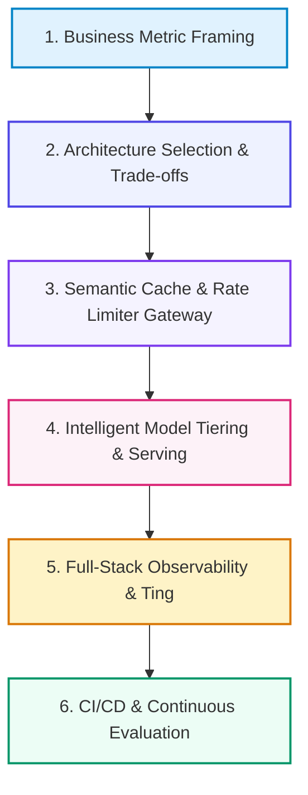

# 📚 DAY 15: AI SYSTEM DESIGN, CAPSTONE ARCHITECTURE & TỔNG KẾT KHÓA HỌC
> **Khóa học: ** COMP2010 - AI in Action (VinUni) | Giảng viên: Đội ngũ Giảng viên AI VinUni | **Dung lượng slide gốc: ** 55 slides (7.7 MB) | Tối ưu: Chuẩn NotebookLM (< 50MB) & Trọng tâm 40%

---

## 📌 1. BÀI HỌC HÔM NAY VỀ CÁI GÌ? (THE WHAT & WHY)

*   **Vòng đời Thiết kế Hệ thống AI Toàn diện (AI System Design Lifecycle):** Quy trình chuyển đổi từ ý tưởng kinh doanh sang kiến trúc kỹ thuật sản xuất: Business Problem Framing -> Architecture Selection -> Data Pipeline -> Model Serving & Guardrails -> Full-Stack Observability -> CI/CD & Production Scaling.
*   **Tam giác Đánh đổi Kỹ thuật (Trade-off Triangles):** Cân đối 3 yếu tố mâu thuẫn: Độ trễ (Latency) vs Chất lượng suy luận (Quality) vs Chi phí hạ tầng (Cost); Độ chính xác truy hồi (Accuy) vs Tính riêng tư (Privacy) vs Độ phức tạp kiến trúc (Complexity).
*   **Kiến trúc Phân tầng Định tuyến Thông minh (Smart Tiered Routing):** 80% truy vấn đơn giản được định tuyến sang Mô hình nhỏ giá rẻ (Small Model: Llama-3-8B / GPT-4o-mini) kết hợp Semantic Cache; chỉ 20% bài toán suy luận phức tạp mới chuyển lên Mô hình lớn đầu bảng (Frontier Model: Claude 3.5 Sonnet / Gemini Pro).
*   **Giá trị thực tiễn:** Bức tranh toàn cảnh để sinh viên tự tin thiết kế, bảo vệ đồ án Capstone Project Milestone và sẵn sàng đảm nhận vị trí AI Engineer / AI Product Lead trong ngành công nghiệp.

---

## 💡 2. ẨN DỤ ĐỜI THƯỜNG: THỰC TRẠNG & GIẢI PHÁP

### 🔴 Thực trạng:
Một công ty công nghệ muốn xây dựng hệ thống AI nhưng chỉ mua một mô hình đắt tiền nhất và mở cổng cho toàn bộ nhân viên dùng tự do; chỉ sau 1 tuần, hóa đơn tiền điện toán đám mây tăng vọt lên hàng tỷ đồng và hệ thống bị sập do quá tải.

### 🚗 Ẩn dụ đời thường — "Câu chuyện thực tế":
> * **1. Bản vẽ quy hoạch tổng thể (System Blueprint):** Kiến trúc sư trưởng thiết kế mạng lưới giao thông, điện nước và phân vùng chức năng rõ ràng cho toàn thành phố.
> * **2. Trạm gác thu phí & Bộ đệm thông minh (Semantic Cache):** Những câu hỏi người dân đã hỏi trước đó được lưu trong bộ nhớ đệm, trả kết quả trong 1 phần nghìn giây với chi phí 0 đồng.
> * **3. Phân luồng giao thông thông minh (Model Router):** Xe máy và người đi bộ đi vào làn đường nhỏ (Small LLM); chỉ xe siêu trường siêu trọng mới được cấp phép đi vào cao tốc đặc biệt (Frontier LLM).
> * **4. Tháp kiểm soát không lưu (Full-Stack Observability):** Màn hình trung tâm hiển thị thời gian thực lưu lượng xe, điểm tắc nghẽn, chi phí từng chuyến đi và phát hiện sự cố tức thì.

### 🟢 Giải pháp kỹ thuật:
Xây dựng kiến trúc phân tầng kết hợp Semantic Cache (GPTCache) và Ting (Langfuse) giúp giảm 65% chi phí vận hành và tăng thông lượng phục vụ lên 5 lần.

---

## 🗺️ 3. SƠ ĐỒ PIPELINE 6 BƯỚC TUẦN TỰ



*   **Bước 1 (1. Business Metric Framing):** Định nghĩa bài toán nghiệp vụ, chỉ số ROI, ngân sách chi phí và tiêu chuẩn SLA kỹ thuật.
*   **Bước 2 (2. Architecture Selection & Trade-offs):** Lựa chọn chiến lược: Prompt Engineering vs RAG vs Fine-tuning vs Multi-Agent.
*   **Bước 3 (3. Semantic Cache & Rate Limiter Gateway):** Kiểm tra truy vấn trùng lặp qua Semantic Cache (Redis) trước khi gọi LLM.
*   **Bước 4 (4. Intelligent Model Tiering & Serving):** Bộ định tuyến phân loại độ khó: chuyển Small Model (8B) hoặc Frontier Model (70B+).
*   **Bước 5 (5. Full-Stack Observability & Ting):** Ghi nhận toàn bộ Spans qua OpenTelemetry, đo lường chi phí token và điểm RAGAS thời gian thực.
*   **Bước 6 (6. CI/CD & Continuous Evaluation):** Tự động chạy kiểm thử hồi quy (Regression Testing), đánh giá Prompt phiên bản mới và Canary Deploy.

---

## 🌐 4. KIẾN THỨC MỞ RỘNG CHUYÊN SÂU (FIRECRAWL RESEARCH)

1.  **1. Cơ chế Semantic Caching (GPTCache / Redis Vector):** Thay vì cache từ khóa chính xác (Exact match), Semantic Cache embed câu hỏi mới và tìm kiếm trong cache xem có câu hỏi cũ nào có độ tương đồng Cosine > 0.95 hay không. Nếu có (Cache Hit), trả về kết quả cũ ngay lập tức với độ trễ < 10ms và chi phí 0 USD.
2.  **2. Khung Giám sát Toàn diện (LLM Observability with Langfuse / Arize):** Theo dõi dấu vết (Distributed Ting) toàn bộ cây thực thi: thời gian từng bước RAG, chi phí từng lượt gọi API, phát hiện các bước Agent bị lỗi và đo lường độ trôi dạt dữ liệu (Data Drift) trên môi trường Production.
3.  **3. Chiến lược Triển khai An toàn: Canary Deployment & Shadow Testing:** Khi cập nhật System Prompt hoặc Model mới: Shadow Testing cho model mới chạy ngầm song song với model cũ để so sánh chất lượng mà không ảnh hưởng người dùng; Canary Deployment mở dần 5% -> 25% -> 100% lưu lượng truy cập.

---

## 🔑 5. BẢNG TỪ KHÓA CỐT LÕI

| Thuật ngữ | Khái niệm kỹ thuật | Giải thích đời thường |
| :--- | :--- | :--- |
| **AI System Design** | Nghệ thuật và khoa học thiết kế kiến trúc hệ thống AI quy mô lớn, đáng tin cậy và tối ưu chi phí. | Bản vẽ quy hoạch tổng thể thành phố thông minh. |
| **Semantic Caching** | Bộ đệm lưu trữ câu trả lời dựa trên sự tương đồng về mặt ý nghĩa của câu hỏi. | Ký ức tức thì: câu hỏi tương tự thì trả lời ngay không cần nghĩ lại. |
| **Model Tiering / Routing** | Chiến lược điều hướng câu hỏi đến mô hình phù hợp theo độ khó và chi phí. | Bác sĩ phân loại bệnh nhân ở phòng cấp cứu: ca nhẹ cho y tá, ca nặng chuyển chuyên khoa. |
| **Observability & Ting** | Năng lực giám sát chi tiết từng bước thực thi và đo lường chỉ số vận hành của hệ thống. | Hộp đen máy bay và camera hành trình toàn tuyến. |
| **Canary Deployment** | Quy trình phát hành phiên bản mới bằng cách mở dần cho một nhóm nhỏ người dùng trước. | Thử nghiệm thuốc trên nhóm nhỏ tình nguyện viên trước khi phân phối đại trà. |
| **Capstone Milestone** | Cột mốc bảo vệ đồ án tốt nghiệp tổng hợp toàn diện kiến thức khóa học. | Lễ khánh thành công trình kiến trúc hoàn mỹ. |

---

## 🎯 6. BỘ CÂU HỎI ÔN THI TRỌNG TÂM (CHUẨN HỌC THUẬT VINUNI)

### 📝 PHẦN A: 4 CÂU TRẮC NGHIỆM ĐƠN (SINGLE-CHOICE)

#### Câu 1: Trong thiết kế hệ thống AI Doanh nghiệp, chiến lược 'Model Tiering / Smart Routing' mang lại lợi ích kinh tế lớn nhất nào?
*   A. Cho phép công ty sa thải toàn bộ nhân viên kỹ thuật.
*   B. Bắt buộc mọi người dùng phải trả tiền trước khi gõ phím.
*   C. Phân loại độ phức tạp của câu hỏi để chuyển 80% truy vấn đơn giản sang các mô hình nhỏ giá rẻ (như 8B models), chỉ dành 20% truy vấn phức tạp cho mô hình đắt tiền, giúp tiết kiệm 60-80% chi phí vận hành.
*   D. Giải phóng bộ nhớ VRAM của GPU khi không có batch suy luận mới trong 30 giây.
> **👉 ĐÁP ÁN ĐÚNG: C**  
> **💡 Giải thích chi tiết:** Đa số câu hỏi thực tế của người dùng là các tác vụ định tuyến, tra cứu đơn giản mà mô hình 8B xử lý hoàn hảo. Routing thông minh tối ưu hóa bài toán chi phí mà không làm giảm chất lượng trải nghiệm.

---

#### Câu 2: Cơ chế 'Semantic Caching' (như GPTCache) hoạt động khác biệt như thế nào so với bộ đệm Cache truyền thống (như Redis Key-Value)?
*   A. Semantic Cache chỉ lưu trữ các file hình ảnh đồ họa.
*   B. Semantic Cache làm tăng gấp đôi thời gian chờ đợi của người dùng.
*   C. Semantic Cache không cần sử dụng bộ nhớ RAM.
*   D. Cache truyền thống chỉ khớp khi chuỗi ký tự giống hệt 100%; Semantic Cache mã hóa câu hỏi thành Vector và trả về kết quả nếu độ tương đồng ngữ nghĩa vượt qua ngưỡng quy định (ví dụ Cosine > 0.95).
> **👉 ĐÁP ÁN ĐÚNG: D**  
> **💡 Giải thích chi tiết:** Người dùng hỏi 'Thời tiết Hà Nội hôm nay thế nào?' và 'Hà Nội hôm nay có mưa không?' có ngữ nghĩa tương đương. Semantic Cache nhận diện được sự tương đồng này để trả về kết quả có sẵn trong 5ms.

---

#### Câu 3: Trong quy trình CI/CD cho ứng dụng GenAI, phương pháp 'Shadow Testing' (Thử nghiệm bóng râm) được thực hiện như thế nào?
*   A. Nhân bản luồng truy cập thực tế của người dùng và gửi đồng thời tới cả phiên bản mô hình cũ (đang phục vụ) và phiên bản mô hình mới (chạy ngầm), sau đó so sánh chất lượng và độ trễ mà không làm ảnh hưởng đến người dùng cuối.
*   B. Tắt toàn bộ đèn trong phòng làm việc của lập trình viên.
*   C. Xóa bỏ toàn bộ mã nguồn cũ trên GitHub.
*   D. Tự động sinh ra các bức ảnh nghệ thuật.
> **👉 ĐÁP ÁN ĐÚNG: A**  
> **💡 Giải thích chi tiết:** Shadow Testing là kỹ thuật an toàn tuyệt đối: Mô hình mới nhận dữ liệu thật nhưng không trả kết quả cho khách, giúp đội ngũ kỹ thuật đo đạc chính xác hiệu năng trước khi chính thức go-live.

---

#### Câu 4: Khi thiết kế hệ thống AI, tam giác đánh đổi (Trade-off Triangle) kinh điển nào mà mọi AI Architect bắt buộc phải cân nhắc?
*   A. Tốc độ mạng LAN (Bandwidth) vs Độ dài dây cáp vật lý vs Dung lượng lưu trữ đĩa từ HDD.
*   B. Độ trễ (Latency) vs Chất lượng suy luận (Quality) vs Chi phí hạ tầng (Cost).
*   C. Số lượng micro đàm thoại vs Kích thước màn hình phụ vs Độ phân giải Webcam.
*   D. Số lượng luồng CPU tiến trình vs Tần số quét màn hình 144Hz vs Tốc độ đọc USB 3.0.
> **👉 ĐÁP ÁN ĐÚNG: B**  
> **💡 Giải thích chi tiết:** Không thể có hệ thống vừa siêu nhanh (vài ms), vừa siêu thông minh (Frontier Model) lại vừa có chi phí gần bằng 0. Kỹ sư trưởng phải cân bằng các tham số này dựa trên yêu cầu kinh doanh cụ thể.

---

### 📚 PHẦN B: 2 CÂU TRẮC NGHIỆM NHIỀU ĐÁP ÁN (MULTI-SELECT)

#### Câu 5: Những trụ cột không thể thiếu của một hệ thống Giám sát Toàn diện (Full-Stack AI Observability) trong môi trường Production là gì?
*   A. Truy vết phân tán (Distributed Ting) ghi nhận chi tiết chuỗi thực thi qua từng bước của Prompt, RAG và Tool Calls.
*   B. Bộ sưu tập hình nền máy tính 4K.
*   C. Trò chơi điện tử cài sẵn trên máy chủ.
*   D. Giám sát số liệu định lượng về chi phí tiêu thụ token (Cost tking), độ trễ (TTFT/ITL) và đánh giá chất lượng liên tục (Online Evals).
> **👉 ĐÁP ÁN ĐÚNG: A, D**  
> **💡 Giải thích chi tiết & Bẫy logic:** Distributed Ting (A) và Cost/Latency/Quality monitoring (B) là 2 trụ cột sống còn giúp vận hành và gỡ lỗi hệ thống GenAI quy mô lớn.

---

#### Câu 6: Để bảo vệ thành công đồ án tốt nghiệp Capstone Project về AI, sinh viên cần thể hiện được những năng lực then chốt nào?
*   A. Chỉ cần sao chép một đoạn code mẫu có sẵn trên mạng mà không hiểu nguyên lý hoạt động.
*   B. Khả năng phân tích sâu sắc bài toán thực tế, lựa chọn kiến trúc phù hợp và giải thích rõ ràng các quyết định đánh đổi kỹ thuật (Trade-offs).
*   C. Xây dựng được sản phẩm hoàn chỉnh có quy trình kiểm thử đánh giá định lượng (Evals) và kiến trúc triển khai bền vững.
*   D. Tránh né không trả lời các câu hỏi phản biện của hội đồng giám khảo.
> **👉 ĐÁP ÁN ĐÚNG: B, C**  
> **💡 Giải thích chi tiết & Bẫy logic:** Lập luận kiến trúc & trade-offs (A) và sản phẩm hoàn chỉnh có đo lường định lượng (B) là tiêu chuẩn vàng của các kỹ sư AI xuất sắc.

---

---

## 💻 7. CODE THỰC CHIẾN (HANDS-ON PYTHON / AI SYSTEM)

```python
import json
import numpy as np

def calculate_ai_system_metrics(predictions, ground_truths):
    """
    Đo lường độ chính xác và chỉ số F1-Score cho hệ thống phân loại AI Production
    """
    tp = sum(1 for p, g in zip(predictions, ground_truths) if p == 1 and g == 1)
    fp = sum(1 for p, g in zip(predictions, ground_truths) if p == 1 and g == 0)
    fn = sum(1 for p, g in zip(predictions, ground_truths) if p == 0 and g == 1)
    
    precision = tp / (tp + fp) if (tp + fp) > 0 else 0.0
    recall = tp / (tp + fn) if (tp + fn) > 0 else 0.0
    f1 = 2 * (precision * recall) / (precision + recall) if (precision + recall) > 0 else 0.0
    
    return {
        "precision": round(precision, 4),
        "recall": round(recall, 4),
        "f1_score": round(f1, 4)
    }

# Dữ liệu kiểm thử mẫu
preds = [1, 0, 1, 1, 0, 1, 0, 1]
targets = [1, 0, 0, 1, 0, 1, 1, 1]
print("Evaluation Metrics:", calculate_ai_system_metrics(preds, targets))
```

---

## ⚠️ 8. BẪY LỖI KỸ THUẬT & CÁCH DEBUG (COMMON PITFALLS & TROUBLESHOOTING)

1.  **🔴 Bẫy Lỗi 1: Tối ưu hóa sai hàm mục tiêu (Metric Mismatch).**
    *   *Nguyên nhân:* Chỉ đo lường Accuracy trên tập dữ liệu mất cân bằng (Imbalanced Data), che giấu việc mô hình dự đoán sai hoàn toàn các ca nguy hiểm.
    *   *Cách khắc phục:* Bắt buộc theo dõi đồng thời Precision, Recall, F1-Score và đường cong PR-AUC.
2.  **🔴 Bẫy Lỗi 2: Rò rỉ dữ liệu (Data Leakage) giữa tập Train và Test.**
    *   *Nguyên nhân:* Tiền xử lý dữ liệu (chuẩn hóa scaling, trích xuất đặc trưng) trên toàn bộ tập dữ liệu trước khi chia train/test.
    *   *Cách khắc phục:* Luôn chia tập dữ liệu trước, sau đó chỉ `fit()` pipeline tiền xử lý trên tập Train và chỉ `transform()` trên tập Test.
3.  **🔴 Bẫy Lỗi 3: Bỏ qua độ trễ mạng và Serialization Overhead.**
    *   *Nguyên nhân:* Đánh giá mô hình offline rất nhanh nhưng khi deploy API thì nghẽn ở bước parse JSON và truyền tải mạng.
    *   *Cách khắc phục:* Tối ưu hóa chuỗi serialization bằng MessagePack / Protocol Buffers và bật gRPC streaming.

---

## ⚖️ 9. BẢNG SO SÁNH TRADE-OFFS & ĐIỀU KIỆN ÁP DỤNG

| Chiến lược / Giải pháp | Độ chính xác (Accuracy) | Độ phức tạp triển khai | Chi phí bảo trì vận hành |
| :--- | :--- | :--- | :--- |
| **Heuristic & Rule-based Engine** | Trung bình, giới hạn | Rất thấp, chạy tức thì | Khó duy trì khi số lượng luật tăng vọt |
| **Fine-tuned Small Specialized Model**| Rất cao trong miền hẹp | Trung bình (cần training pipeline) | Thấp, chạy được trên GPU phổ thông |
| **Zero-shot Frontier LLM Prompting** | Cao toàn diện đa miền | Rất thấp (chỉ cần API) | Chi phí token hàng tháng cao khi tải lớn |
