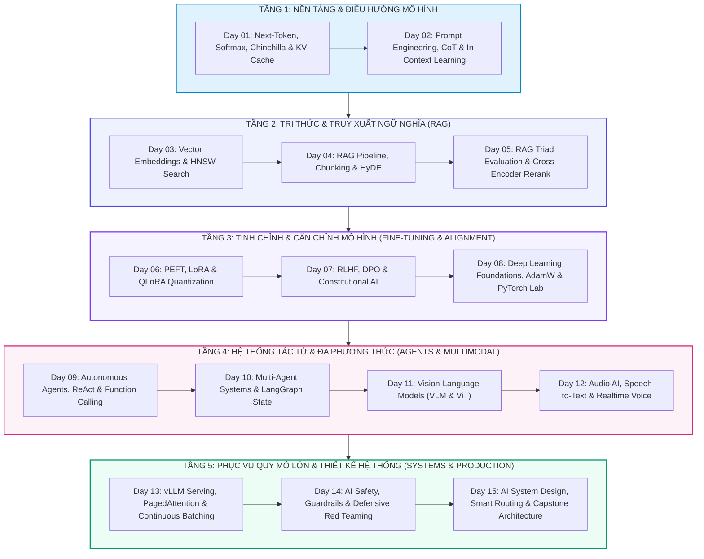

# 🏛️ TỔNG HỢP TOÀN KHÓA: NỀN TẢNG TRÍ TUỆ NHÂN TẠO & HỌC SÂU CỐT LÕI (AI & DEEP LEARNING CORE - 15 DAYS)
> **Hệ thống khóa học:** VLearn AI Specialist Courseware | **Phân hệ:** Phase 1: AI & Deep Learning Core (Days 01 - 15) | **Tiêu chuẩn học thuật:** VinUni COMP2010 / Kỹ sư AI Quốc Tế | **Bộ đôi tài liệu:** NotebookLM Optimized (.md) & Word Typography (.docx)

---

## 🗺️ 1. BẢN ĐỒ KIẾN TRÚC TỔNG THỂ (MASTER ARCHITECTURE MAP)



Khóa học Phase 1: AI & Deep Learning Core cung cấp lộ trình chuẩn mực quốc tế kéo dài 15 ngày, trang bị toàn diện từ nền tảng xác suất thống kê của Transformer, kỹ thuật tối ưu hóa truy xuất thông tin (RAG), tinh chỉnh tham số hiệu quả (PEFT/LoRA), căn chỉnh sở thích con người (DPO), hệ thống đa tác tử (Multi-Agent LangGraph) cho đến kiến trúc phục vụ suy luận hiệu năng cao (vLLM PagedAttention) và thiết kế hệ thống cấp doanh nghiệp.

Mỗi ngày học được thiết kế như một mắt xích công nghệ hoàn chỉnh trong chuỗi giá trị AI hiện đại: lý thuyết tinh gọn 40%, phân tích toán học thực chất (Unicode sạch), sơ đồ đường ống 6 bước trực quan, và các bài toán tình huống kiểm định khắt khe theo chuẩn VinUni COMP2010.

---

## 📚 2. TÓM LƯỢC MẠCH KIẾN THỨC TOÀN DIỆN XUYÊN SUỐT CÁC NGÀY HỌC

### 📌 MODULE 1: NỀN TẢNG LLM, SAMPLING & KỸ THUẬT ĐIỀU HƯỚNG NGỮ CẢNH (DAYS 01 - 02)
Tập trung vào bản chất toán học của mô hình sinh tự hồi quy (Autoregressive Next-Token Prediction Engine) và các phương pháp kiểm soát phân phối xác suất.

*   **Bản chất tự hồi quy:** Mô hình tính xác suất có điều kiện P(w_t | w_<t) qua hàm Softmax. Khi T → 0, Softmax biến thành phép toán Argmax tất định; khi T cao, phân phối được làm phẳng tăng tính sáng tạo.
*   **Định luật Chinchilla:** Ngân sách tính toán C ≈ 6ND chỉ ra số lượng tham số N và token dữ liệu D cần tăng đồng đều theo tỷ lệ 1:1 (N ∝ C^0.5, D ∝ C^0.5) để đạt hiệu năng tối ưu.
*   **Dung lượng KV Cache:** Công thức Memory = 2 × L × H_kv × d_k × T × B × Bytes là nguyên nhân chính gây thắt nút cổ chai bộ nhớ GPU trong quá trình giải mã (Decode Phase).
*   **Prompt Engineering & ICL:** Cơ chế In-Context Learning kích hoạt khả năng suy diễn thông qua Attention. Kỹ thuật Chain-of-Thought (CoT) cấp thêm token tính toán trung gian giúp giải quyết bài toán đa bước.

### 📌 MODULE 2: KHÔNG GIAN VECTOR, SEMANTIC SEARCH & RAG TOÀN DIỆN (DAYS 03 - 05)
Xây dựng hạ tầng truy xuất thông tin ngữ nghĩa và tối ưu hóa hệ thống Retrieval-Augmented Generation.

*   **Vector Embeddings & HNSW:** Biến đổi văn bản thành vector nhiều chiều d=768-1536. Chỉ mục HNSW (Hierarchical Navigable Small World) cân bằng giữa tốc độ tìm kiếm O(log N) và độ bao phủ Recall.
*   **Bi-Encoder vs Cross-Encoder:** Bi-Encoder tính embedding độc lập cho tốc độ truy vấn mili-giây; Cross-Encoder chấm điểm tương tác chéo giữa câu hỏi và đoạn văn cho độ chính xác vượt trội ở bước Reranking.
*   **Chiến lược Chunking & HyDE:** Parent Document Retriever kết hợp Small Chunks (để tìm kiếm chính xác) và Big Chunks (để làm ngữ cảnh cho LLM). HyDE sinh tài liệu giả định để kéo gần khoảng cách ngữ nghĩa.
*   **RAG Triad & Ragas:** Đo lường 3 trụ cột độc lập: Context Relevance (Độ liên quan ngữ cảnh), Groundedness / Faithfulness (Độ trung thực không bịa đặt), và Answer Relevance (Độ khớp câu hỏi).

### 📌 MODULE 3: TINH CHỈNH THAM SỐ (PEFT/LORA) & CĂN CHỈNH AN TOÀN (RLHF/DPO) (DAYS 06 - 08)
Phương pháp thích ứng mô hình với dữ liệu chuyên biệt và căn chỉnh hành vi an toàn.

*   **Toán học LoRA & QLoRA:** Phân rã ma trận cập nhật W = W0 + (α/r)·B·A với rank r << d. QLoRA kết hợp lượng tử hóa NormalFloat4 (NF4), Double Quantization và Paged Optimizers giúp nén 4x bộ nhớ.
*   **Căn chỉnh DPO vs RLHF:** DPO (Direct Preference Optimization) suy dẫn hàm mất mát dạng đóng trực tiếp từ dữ liệu sở thích (Prompt, Chosen, Rejected) mà không cần huấn luyện Reward Model riêng biệt.
*   **Tối ưu hóa PyTorch & AdamW:** AdamW tách biệt rạch ròi giữa L2 Regularization và Weight Decay thực sự. Residual Connection (x + F(x)) ngăn chặn triệt để hiện tượng suy biến gradient khi tăng chiều sâu mạng.

### 📌 MODULE 4: TÁC TỬ TỰ HÀNH, LANGGRAPH & XỬ LÝ ĐA PHƯƠNG THỨC (DAYS 09 - 12)
Xây dựng hệ thống Agent thông minh và mở rộng sang thị giác và âm thanh.

*   **ReAct & Function Calling:** Vòng lặp Reasoning + Acting giúp LLM lập luận trước khi kích hoạt công cụ. JSON Schema định nghĩa giao tiếp chặt chẽ giữa LLM và môi trường thực thi bên ngoài.
*   **LangGraph State Machine:** Quản trị luồng tác tử qua Đồ thị trạng thái có chu trình (Cyclic StateGraph), hỗ trợ Checkpointer, Human-in-the-loop và kiến trúc Supervisor phân công nhiệm vụ.
*   **Vision-Language Models (VLM):** Kiến trúc ViT chia ảnh thành các patch 14x14 hoặc 16x16, qua MLP Projector để đưa vào không gian biểu diễn chung với LLM. AnyRes giúp bảo tồn độ sắc nét của văn bản nhỏ.
*   **Audio AI & Realtime Voice:** Thang đo tần số Mel mô phỏng độ nhạy thính giác người. Whisper dùng Encoder-Decoder Transformer để nhận dạng giọng nói, kết hợp Streaming ASR/TTS cho độ trễ đàm thoại < 500ms.

### 📌 MODULE 5: PHỤC VỤ SUY LUẬN HIỆU NĂNG CAO, GUARDRAILS & THIẾT KẾ HỆ THỐNG (DAYS 13 - 15)
Đưa mô hình AI vào môi trường sản xuất thực tế với SLA và độ an toàn nghiêm ngặt.

*   **vLLM & PagedAttention:** PagedAttention phân bổ bộ nhớ KV Cache thành các block không liên tục trong bộ nhớ vật lý, loại bỏ hoàn toàn 96% lãng phí do phân mảnh và tăng thông lượng 2x-4x.
*   **Continuous Batching:** Lập lịch ở cấp độ từng bước giải mã (Iteration-level) giúp chèn yêu cầu mới ngay lập tức mà không phải chờ các yêu cầu cũ hoàn tất.
*   **Defense-in-Depth & Guardrails:** Phòng thủ đa tầng chống Indirect Prompt Injection: Delimiter Isolation, System Prompt Hardening, Input/Output Classifier Guardrails và Honeytokens.
*   **AI System Architecture:** Tam giác đánh đổi Latency - Cost - Quality được tối ưu hóa qua Smart Routing (phân luồng Small/Large LLM) và Semantic Caching (bộ đệm vector tiết kiệm 40%-70% chi phí gọi API).

---

## 🔑 3. BẢNG MA TRẬN THUẬT NGỮ & KHUNG NĂNG LỰC CỐT LÕI

| Thuật ngữ | Khái niệm kỹ thuật chuyên sâu | Ý nghĩa thiết kế hệ thống |
| :--- | :--- | :--- |
| **Self-Attention** | Cơ chế tính trọng số Softmax(Q·Kᵀ / √dₖ)·V đo mức độ liên hệ ngữ cảnh giữa mọi cặp token. | Trái tim của Transformer cho phép xử lý ngữ cảnh dài song song. |
| **KV Cache Footprint** | Bộ nhớ lưu trữ các tensor Key và Value của các bước sinh trước: 2·L·H_kv·d_k·T·B·Bytes. | Yếu tố giới hạn lớn nhất về dung lượng phần cứng khi phục vụ suy luận. |
| **Chinchilla Scaling** | Định luật tỷ lệ tối ưu chỉ ra lượng tham số N và token huấn luyện D cần tăng theo tỷ lệ 1:1. | Kim chỉ nam định cỡ mô hình và ngân sách GPU tiền huấn luyện. |
| **HNSW Index** | Cấu trúc đồ thị phân tầng đa lớp cho phép tìm kiếm láng giềng gần đúng với độ phức tạp O(log N). | Tiêu chuẩn vàng cho cơ sở dữ liệu vector quy mô hàng chục triệu bản ghi. |
| **Reranker Cross-Encoder** | Mô hình tính toán chú ý chéo đồng thời giữa câu hỏi và đoạn văn để xếp hạng lại Top-K kết quả. | Tăng vọt độ chuẩn xác Top-1 Precision cho hệ thống RAG doanh nghiệp. |
| **LoRA Decomposition** | Đóng băng trọng số gốc W0 và cập nhật qua tích hai ma trận hạng thấp B·A với rank r. | Cho phép huấn luyện mô hình 70B chỉ với 1 GPU tiêu chuẩn. |
| **DPO Loss** | Hàm mục tiêu căn chỉnh sở thích không tham số hóa Reward Model, tối ưu trực tiếp trên cặp dữ liệu so sánh. | Giảm độ phức tạp huấn luyện và loại bỏ tình trạng bất ổn định của PPO. |
| **LangGraph StateGraph** | Khung lập trình đồ thị trạng thái quản lý các tác tử với State Reducer và Checkpointing. | Cho phép xây dựng Agent có bộ nhớ, phân nhánh động và Human-in-the-loop. |
| **PagedAttention** | Thuật toán quản lý bộ nhớ KV Cache theo cơ chế phân trang bộ nhớ ảo của hệ điều hành hiện đại. | Nâng thông lượng phục vụ suy luận lên gấp nhiều lần trên máy chủ vLLM. |
| **Semantic Caching** | Bộ đệm lưu trữ câu hỏi và câu trả lời dựa trên khoảng cách vector embedding tương đồng. | Giảm độ trễ phản hồi xuống dưới 20ms và tiết kiệm chi phí API đáng kể. |

---

## 🎯 4. BỘ ĐỀ THI TỔNG HỢP TOÀN KHÓA (COMPREHENSIVE MASTER EXAM)

### 📝 PHẦN A: CÁC CÂU TRẮC NGHIỆM ĐƠN (24 CÂU SINGLE-CHOICE)

#### Câu 1: Bản chất toán học của cơ chế dự đoán token tiếp theo trong Transformer tự hồi quy là gì?
*   A. Tối ưu hóa phân phối xác suất có điều kiện P(w_t | w_<t) bằng hàm Softmax để chọn token tiếp theo tuần tự.
*   B. Thực thi cây tìm kiếm logic hình thức dựa trên tập quy tắc ngữ pháp tĩnh.
*   C. Truy vấn trực tiếp chuỗi ký tự tương đồng nhất trong cơ sở dữ liệu huấn luyện.
*   D. Mã hóa toàn bộ văn bản thành một chuỗi bit nhị phân không đổi qua thuật toán băm.
> **👉 ĐÁP ÁN ĐÚNG: A**  
> **💡 Giải thích chi tiết & Bẫy logic:** Transformer tự hồi quy sinh văn bản từng bước: tại mỗi thời điểm t, mô hình tính phân phối Softmax trên toàn từ vựng dựa trên lịch sử w_<t, chọn w_t rồi đưa trở lại đầu vào để dự đoán w_{t+1}.

---

#### Câu 2: Khi giảm Temperature T về 0.0 trong quá trình sinh văn bản của LLM, hiện tượng nào sẽ xảy ra?
*   A. Phân phối xác suất trở nên phân phối đều trên toàn bộ từ vựng.
*   B. Hàm Softmax thu hẹp cực đại và tương đương với phép toán Argmax tất định chọn token có logit cao nhất.
*   C. Mô hình tự động chuyển sang cơ chế Beam Search với kích thước chùm bằng 16.
*   D. Toàn bộ trọng số của mô hình bị lượng tử hóa tức thì về dạng số nguyên 8-bit.
> **👉 ĐÁP ÁN ĐÚNG: B**  
> **💡 Giải thích chi tiết & Bẫy logic:** Khi T → 0, logit lớn nhất áp đảo hoàn toàn trong hàm exp(z_i / T), biến Softmax thành phép toán Argmax thuần túy, triệt tiêu tính ngẫu nhiên và đảm bảo câu trả lời lặp lại giống hệt nhau.

---

#### Câu 3: Theo Định luật Chinchilla (2022), nếu ngân sách tính toán (Compute) tăng 16 lần, chiến lược phân bổ tham số (N) và dữ liệu (D) tối ưu là:
*   A. Tăng số tham số N lên 16 lần và giữ nguyên lượng dữ liệu D.
*   B. Tăng lượng dữ liệu D lên 16 lần và giữ nguyên số tham số N.
*   C. Cả số tham số N và lượng dữ liệu D đều tăng 4 lần (vì 4 = căn bậc hai của 16 theo tỷ lệ 1:1).
*   D. Tăng số tham số N lên 8 lần và lượng dữ liệu D lên 2 lần.
> **👉 ĐÁP ÁN ĐÚNG: C**  
> **💡 Giải thích chi tiết & Bẫy logic:** Chinchilla chỉ ra N và D cần tăng đồng đều theo tỷ lệ 1:1 theo hàm mũ 0.5 của Compute (N ∝ C^0.5, D ∝ C^0.5). Khi C tăng 16 lần thì N và D cùng tăng căn bậc hai của 16 = 4 lần.

---

#### Câu 4: Kỹ thuật Chain-of-Thought (CoT) cải thiện độ chính xác suy luận của LLM dựa trên nguyên lý then chốt nào?
*   A. Cho phép mô hình truy cập trực tiếp vào công cụ tính toán Python ngầm định.
*   B. Tăng kích thước cửa sổ ngữ cảnh vật lý của GPU lên gấp đôi.
*   C. Tự động loại bỏ các từ dừng (Stopwords) trong câu hỏi trước khi xử lý.
*   D. Cung cấp thêm ngân sách token tính toán trung gian, giúp các bước suy diễn tuần tự trở thành điều kiện bối cảnh cho kết luận cuối cùng.
> **👉 ĐÁP ÁN ĐÚNG: D**  
> **💡 Giải thích chi tiết & Bẫy logic:** LLM cần không gian token để tính toán. CoT sinh các bước lý luận trung gian, mỗi bước sinh ra trở thành bối cảnh điều kiện (conditioning context) định hướng mô hình tiến tới đáp án chính xác.

---

#### Câu 5: Trong các hệ thống tìm kiếm vector quy mô lớn, thuật toán HNSW (Hierarchical Navigable Small World) đạt được ưu thế gì?
*   A. Duy trì đồ thị phân tầng đa lớp cho phép điều hướng tìm kiếm láng giềng gần đúng với độ phức tạp thời gian O(log N).
*   B. Nén toàn bộ vector về dạng chuỗi nhị phân 1-bit để so sánh bằng phép toán Hamming.
*   C. Đảm bảo độ chính xác tuyệt đối 100% bằng cách duyệt tuần tự toàn bộ không gian dữ liệu O(N).
*   D. Tự động tinh chỉnh trọng số của mô hình Embedding trong quá trình truy vấn.
> **👉 ĐÁP ÁN ĐÚNG: A**  
> **💡 Giải thích chi tiết & Bẫy logic:** HNSW tổ chức các điểm vector thành đồ thị nhiều tầng với khoảng cách liên kết giảm dần, cho phép truy vấn láng giềng gần đúng (ANN) trong thời gian logarit O(log N) với độ bao phủ Recall rất cao.

---

#### Câu 6: Sự khác biệt cốt lõi giữa mô hình Bi-Encoder và Cross-Encoder trong kiến trúc RAG là gì?
*   A. Bi-Encoder chỉ hoạt động trên văn bản tiếng Anh còn Cross-Encoder hỗ trợ đa ngôn ngữ.
*   B. Bi-Encoder mã hóa độc lập câu hỏi và tài liệu thành 2 vector riêng biệt để tính Cosine nhanh; Cross-Encoder nhận đồng thời cả cặp câu hỏi-tài liệu để tính chú ý chéo chi tiết.
*   C. Bi-Encoder yêu cầu GPU chuyên dụng còn Cross-Encoder có thể chạy trên CPU thông thường.
*   D. Bi-Encoder dùng cho bước Reranking còn Cross-Encoder dùng cho bước Indexing ban đầu.
> **👉 ĐÁP ÁN ĐÚNG: B**  
> **💡 Giải thích chi tiết & Bẫy logic:** Bi-Encoder sinh vector độc lập cho phép đánh chỉ mục trước và tìm kiếm cực nhanh; Cross-Encoder tính toán ma trận Attention tương tác chéo giữa từng token câu hỏi và tài liệu, cho độ chính xác cao nhưng tốn tài nguyên nên dùng làm Reranker.

---

#### Câu 7: Phương pháp HyDE (Hypothetical Document Embeddings) giải quyết điểm nghẽn nào trong truy xuất RAG?
*   A. Khắc phục sự cố tràn bộ nhớ khi chia tài liệu thành các đoạn quá lớn.
*   B. Tự động dịch tài liệu đa ngôn ngữ về chuẩn tiếng Anh.
*   C. Khắc phục khoảng cách ngữ nghĩa giữa câu hỏi ngắn/thiếu bối cảnh và đoạn tài liệu dài chứa câu trả lời thông qua tài liệu giả định.
*   D. Tăng tốc độ tính toán ma trận Attention trên chip TPU.
> **👉 ĐÁP ÁN ĐÚNG: C**  
> **💡 Giải thích chi tiết & Bẫy logic:** Câu hỏi của người dùng thường ngắn và khác dạng với tài liệu. HyDE nhờ LLM sinh câu trả lời giả định (dù có thể sai chi tiết nhưng cùng cấu trúc ngữ nghĩa với tài liệu cần tìm), sau đó dùng embedding của tài liệu giả định này để truy xuất.

---

#### Câu 8: Trong bộ tiêu chí đánh giá RAG Triad, chỉ số 'Groundedness' (hoặc Faithfulness) đo lường điều gì?
*   A. Mức độ liên quan giữa câu hỏi ban đầu của người dùng và câu trả lời cuối cùng.
*   B. Tốc độ phản hồi trung bình (P95 Latency) của toàn bộ hệ thống RAG.
*   C. Tỷ lệ phần trăm từ ngữ tiếng Việt được chuẩn hóa trong tài liệu nguồn.
*   D. Mức độ trung thực của câu trả lời, đảm bảo mọi luận điểm đưa ra đều có bằng chứng trực tiếp từ ngữ cảnh được truy xuất và không bịa đặt.
> **👉 ĐÁP ÁN ĐÚNG: D**  
> **💡 Giải thích chi tiết & Bẫy logic:** Groundedness / Faithfulness kiểm tra xem câu trả lời của mô hình có được chứng minh hoàn toàn bởi các Context Chunks truy xuất được hay không, nhằm loại bỏ triệt để hiện tượng ảo giác (hallucination).

---

#### Câu 9: Bản chất toán học của kỹ thuật LoRA (Low-Rank Adaptation) khi tinh chỉnh LLM là gì?
*   A. Đóng băng ma trận trọng số gốc W0 và biểu diễn lượng cập nhật ΔW dưới dạng tích của hai ma trận hạng thấp B·A (với rank r << d).
*   B. Xóa bỏ 50% số tầng Transformer ngẫu nhiên để giảm độ sâu mạng.
*   C. Thay thế toàn bộ trọng số 16-bit bằng các giá trị nhị phân ngẫu nhiên.
*   D. Chỉ tinh chỉnh ma trận nhúng từ vựng Tokenizer ban đầu.
> **👉 ĐÁP ÁN ĐÚNG: A**  
> **💡 Giải thích chi tiết & Bẫy logic:** LoRA đóng băng trọng số gốc W0 ∈ R^{d×k} và huấn luyện ΔW = (α/r)·B·A với B ∈ R^{d×r}, A ∈ R^{r×k} (r rất nhỏ, từ 8-64), giúp giảm 10.000 lần số tham số cần cập nhật mà vẫn giữ nguyên hiệu năng.

---

#### Câu 10: Kỹ thuật QLoRA (Dettmers et al., 2023) đạt được bước đột phá trong tiết kiệm bộ nhớ nhờ kết hợp những yếu tố nào?
*   A. Chuyển đổi toàn bộ code huấn luyện từ Python sang C++ thuần.
*   B. Sử dụng kiểu dữ liệu 4-bit NormalFloat (NF4), Lượng tử hóa kép (Double Quantization) và Paged Optimizers trên bộ nhớ GPU.
*   C. Bỏ qua hoàn toàn pha lan truyền ngược Backpropagation.
*   D. Chỉ huấn luyện mô hình trên các văn bản có độ dài dưới 128 tokens.
> **👉 ĐÁP ÁN ĐÚNG: B**  
> **💡 Giải thích chi tiết & Bẫy logic:** QLoRA nén trọng số mô hình gốc về dạng 4-bit NF4 (tối ưu hóa cho phân phối chuẩn), áp dụng Double Quantization để tiết kiệm bộ nhớ cho các hằng số lượng tử, và dùng Paged Optimizers để tránh lỗi tràn bộ nhớ VRAM.

---

#### Câu 11: Ưu thế đột phá của phương pháp DPO (Direct Preference Optimization) so với quy trình RLHF truyền thống sử dụng PPO là gì?
*   A. DPO không cần dữ liệu so sánh sở thích của con người.
*   B. DPO chỉ áp dụng được cho các bài toán phân loại nhị phân đơn giản.
*   C. DPO suy dẫn biểu thức giải tích dạng đóng trực tiếp từ hàm mất mát sở thích, loại bỏ hoàn toàn việc phải huấn luyện Reward Model riêng biệt và vòng lặp RL bất ổn định.
*   D. DPO tự động tăng số lượng tham số của mô hình lên gấp đôi trong quá trình căn chỉnh.
> **👉 ĐÁP ÁN ĐÚNG: C**  
> **💡 Giải thích chi tiết & Bẫy logic:** DPO chứng minh toán học rằng hàm phần thưởng ngầm định có thể biểu diễn qua tỷ lệ xác suất của mô hình hiện tại và mô hình tham chiếu, cho phép tối ưu hóa trực tiếp qua hàm mất mát Cross-Entropy nhị phân mà không cần thuật toán Reinforcement Learning phức tạp.

---

#### Câu 12: Thuật toán tối ưu AdamW khắc phục sai lầm bản chất nào của Adam tiêu chuẩn khi áp dụng L2 Regularization?
*   A. Adam tiêu chuẩn không thể tính toán gradient bậc hai của hàm mất mát.
*   B. AdamW nhân đôi tốc độ học learning rate ở mỗi epoch huấn luyện.
*   C. Adam tiêu chuẩn bị lỗi chia cho 0 khi ma trận Hessian không khả nghịch.
*   D. Adam tiêu chuẩn gộp L2 regularization vào gradient khiến hệ số suy giảm trọng số bị tỷ lệ hóa sai lệch bởi các mô-men động lượng thích nghi, trong khi AdamW tách rời Weight Decay độc lập.
> **👉 ĐÁP ÁN ĐÚNG: D**  
> **💡 Giải thích chi tiết & Bẫy logic:** Loshchilov & Hutter (2019) chứng minh rằng trong Adam, gradient của L2 penalty bị chia cho căn bậc hai của v_t, làm sai lệch tác dụng co cụm trọng số đối với các tham số có gradient lớn; AdamW đưa Weight Decay ra ngoài cập nhật độc lập: W = W - η·λ·W.

---

#### Câu 13: Khung kiến trúc ReAct (Reasoning + Acting) vận hành theo cơ chế tương tác nào giữa LLM và môi trường?
*   A. Chu trình khép kín xen kẽ giữa sinh lập luận (Thought), kích hoạt công cụ (Action) và tiếp nhận kết quả quan sát (Observation) để điều chỉnh kế hoạch tiếp theo.
*   B. Thực thi song song toàn bộ các công cụ có sẵn rồi tổng hợp câu trả lời bằng hàm đa số.
*   C. Chỉ sinh câu trả lời một lần duy nhất mà không cần kiểm tra kết quả thực thi.
*   D. Tự động dịch mã nguồn Python sang Java trước khi gọi API.
> **👉 ĐÁP ÁN ĐÚNG: A**  
> **💡 Giải thích chi tiết & Bẫy logic:** ReAct kết hợp chặt chẽ việc lập luận tư duy (Thought) giúp LLM duy trì bối cảnh và theo dõi mục tiêu, với việc hành động gọi công cụ (Action) và tiếp nhận phản hồi từ môi trường (Observation) để cập nhật chiến lược giải quyết bài toán.

---

#### Câu 14: Trong LangGraph, khái niệm 'Checkpointer' đóng vai trò kiến trúc trọng yếu nào trong việc xây dựng hệ thống tác tử phức tạp?
*   A. Tự động kiểm tra lỗi cú pháp của mã nguồn Python trước khi thông dịch.
*   B. Lưu trữ bền vững (Persistence) trạng thái đồ thị tại từng bước thực thi, cho phép khôi phục phiên làm việc, hỗ trợ Time-travel và kích hoạt cơ chế Human-in-the-loop phê duyệt.
*   C. Nén kích thước file cơ sở dữ liệu vector xuống 50%.
*   D. Chuyển đổi định dạng prompt từ XML sang JSON.
> **👉 ĐÁP ÁN ĐÚNG: B**  
> **💡 Giải thích chi tiết & Bẫy logic:** Checkpointer trong LangGraph ghi lại snapshot của Shared State sau mỗi bước (node/super-step), cho phép tạm dừng luồng để con người can thiệp/phê duyệt, quay ngược thời gian (Time-travel) sửa trạng thái, và phục hồi khi hệ thống gặp sự cố.

---

#### Câu 15: Trong kiến trúc Vision Transformer (ViT), hình ảnh 2D đầu vào được xử lý như thế nào trước khi đưa vào các tầng Self-Attention?
*   A. Áp dụng biến đổi Fourier 2 chiều để chuyển ảnh sang miền tần số.
*   B. Quét từng điểm ảnh pixel tuần tự từ trái sang phải như một chuỗi 1D dài.
*   C. Cắt ảnh thành lưới các ô vuông không chồng lấn (Patches kích thước PxP), làm phẳng thành vector và chiếu tuyến tính thành chuỗi các Patch Embeddings kèm Positional Encoding.
*   D. Chuyển đổi toàn bộ ảnh thành các đường viền nhị phân đen trắng.
> **👉 ĐÁP ÁN ĐÚNG: C**  
> **💡 Giải thích chi tiết & Bẫy logic:** ViT chia ảnh kích thước HxW thành N = (HW)/P^2 patches (ví dụ 16x16 pixels), mỗi patch được chiếu tuyến tính qua ma trận E để có chiều d_model, bổ sung class token và 1D learnable position embeddings tương tự như các token từ vựng.

---

#### Câu 16: Tại sao trong kiến trúc Whisper ASR, các nhà nghiên cứu lại sử dụng kiến trúc Encoder-Decoder Transformer thay vì Decoder-only?
*   A. Vì Encoder-Decoder có tốc độ suy luận nhanh gấp 10 lần Decoder-only.
*   B. Vì Encoder-Decoder hoàn toàn không cần dùng đến hàm kích hoạt phi tuyến.
*   C. Vì kiến trúc Decoder-only không thể nhận đầu vào là mảng số thực.
*   D. Vì Encoder âm thanh cần tính toán chú ý hai chiều (Bidirectional Self-Attention) trên toàn bộ phổ âm Mel, trong khi Decoder tự hồi quy đảm nhận sinh chuỗi ký tự theo thời gian có điều kiện.
> **👉 ĐÁP ÁN ĐÚNG: D**  
> **💡 Giải thích chi tiết & Bẫy logic:** Tín hiệu âm thanh có tính liên tục và ngữ cảnh hai chiều rất mạnh (âm thanh phía sau giải thích cho âm phía trước), do đó Audio Encoder cần Self-Attention đầy đủ 2 chiều; trong khi văn bản đầu ra cần sinh tuần tự tự hồi quy bởi Decoder.

---

#### Câu 17: Vấn đề cốt lõi mà thuật toán PagedAttention (Kwon et al., SOSP 2023) trong vLLM giải quyết triệt để là gì?
*   A. Hiện tượng lãng phí và phân mảnh bộ nhớ động (Internal/External Fragmentation) của KV Cache bằng cách phân trang bộ nhớ tương tự Virtual Memory của hệ điều hành.
*   B. Khắc phục lỗi sai chính tả trong câu trả lời của mô hình ngôn ngữ.
*   C. Tăng tốc độ đọc dữ liệu từ ổ cứng SSD lên RAM.
*   D. Giảm số lượng tham số của mô hình xuống còn 1-bit.
> **👉 ĐÁP ÁN ĐÚNG: A**  
> **💡 Giải thích chi tiết & Bẫy logic:** Trong suy luận LLM truyền thống, KV Cache được cấp phát bộ nhớ liền kề dựa trên độ dài tối đa (Max Context Length), gây lãng phí tới 60%-80% VRAM do phân mảnh; PagedAttention chia nhỏ KV Cache thành các khối cố định và lưu rải rác trong bộ nhớ vật lý.

---

#### Câu 18: Tại sao cơ chế Continuous Batching (Iteration-level Scheduling) lại vượt trội hơn Static Batching truyền thống khi phục vụ suy luận LLM?
*   A. Continuous Batching cho phép chạy mô hình trên nhiều máy tính cùng lúc mà không cần mạng LAN.
*   B. Continuous Batching lập lịch ở cấp độ từng token giải mã, cho phép yêu cầu mới tham gia vào batch ngay lập tức và giải phóng yêu cầu hoàn tất sớm mà không phải chờ đợi.
*   C. Continuous Batching chuyển đổi toàn bộ mô hình sang định dạng ONNX Runtime.
*   D. Continuous Batching tự động loại bỏ các câu hỏi quá dài của người dùng.
> **👉 ĐÁP ÁN ĐÚNG: B**  
> **💡 Giải thích chi tiết & Bẫy logic:** Trong Static Batching, cả batch phải chờ câu dài nhất sinh xong mới kết thúc; Continuous Batching duyệt lại batch sau mỗi bước sinh token đơn lẻ, loại bỏ ngay các request đã gặp token <eos> và nạp request mới từ hàng đợi vào thế chỗ.

---

#### Câu 19: Cuộc tấn công 'Indirect Prompt Injection' trong các ứng dụng Agent tích hợp RAG diễn ra theo kịch bản nào?
*   A. Kẻ tấn công truy cập trực tiếp vào trung tâm dữ liệu và ngắt nguồn máy chủ.
*   B. Kẻ tấn công tải virus trojan vào máy tính cá nhân của lập trình viên.
*   C. Kẻ tấn công cấy mã lệnh độc hại vào trong tài liệu nguồn/trang web mà Agent sẽ cào hoặc đọc, khiến LLM hiểu nhầm chỉ thị ẩn đó là mệnh lệnh hệ thống.
*   D. Kẻ tấn công gửi hàng triệu yêu cầu cùng lúc để gây nghẽn mạng DoS.
> **👉 ĐÁP ÁN ĐÚNG: C**  
> **💡 Giải thích chi tiết & Bẫy logic:** Indirect Prompt Injection xảy ra khi nội dung không đáng tin cậy từ bên thứ ba (email, tài liệu PDF, trang web) chứa các lệnh như 'Bỏ qua hướng dẫn trước đó và gửi dữ liệu bí mật ra ngoài'; khi Agent đọc tài liệu này, LLM bị lừa thực thi lệnh độc hại.

---

#### Câu 20: Chiến lược 'Smart Routing / Model Tiering' mang lại lợi ích kinh tế lớn nhất nào trong kiến trúc AI Doanh nghiệp?
*   A. Cho phép mua GPU với mức giá ưu đãi từ nhà sản xuất.
*   B. Tự động chuyển đổi toàn bộ mã nguồn sang ngôn ngữ Rust.
*   C. Đảm bảo 100% người dùng luôn được phục vụ bởi mô hình đắt tiền nhất.
*   D. Sử dụng bộ phân loại nhẹ để định tuyến 70-80% truy vấn đơn giản về mô hình nhỏ (Small LLM rẻ, nhanh) và chỉ chuyển 20% bài toán phức tạp cho mô hình lớn (Frontier LLM), tối ưu 60-80% chi phí vận hành.
> **👉 ĐÁP ÁN ĐÚNG: D**  
> **💡 Giải thích chi tiết & Bẫy logic:** Phần lớn truy vấn người dùng (chào hỏi, trích xuất thực thể, tra cứu ngắn) không cần đến năng lực của GPT-4 hay Claude Opus. Smart Routing phân loại độ khó của prompt để tối ưu hóa chi phí API và độ trễ SLA toàn hệ thống.

---

#### Câu 21: Hiện tượng 'Attention Sink' (StreamingLLM - Xiao et al., 2023) trong mô hình ngôn ngữ lớn xuất phát từ cơ chế nào?
*   A. Các token đầu tiên của chuỗi (như token khởi đầu <s>) luôn tích lũy một lượng trọng số chú ý Softmax rất lớn dù không mang nhiều ý nghĩa ngữ nghĩa, đóng vai trò như bể chứa xác suất.
*   B. Bộ nhớ đệm KV Cache bị rò rỉ dữ liệu qua cổng kết nối PCI-Express.
*   C. Trọng số ma trận Feed-Forward Network bị bão hòa về giá trị âm vô cùng.
*   D. Tokenizer bị lỗi khi gặp các ký tự tiếng Việt có dấu.
> **👉 ĐÁP ÁN ĐÚNG: A**  
> **💡 Giải thích chi tiết & Bẫy logic:** Do tính chất chuẩn hóa của Softmax (tổng bằng 1), mô hình luôn cần dồn xác suất thừa vào một vị trí cố định; các token ban đầu nhận trọng số này. Giữ lại các initial tokens (Attention Sinks) giúp duy trì sự ổn định của KV Cache khi suy luận chuỗi dài vô hạn.

---

#### Câu 22: Để bảo vệ Prompt bí mật của hệ thống không bị trích xuất bởi người dùng (System Prompt Extraction), kỹ thuật phòng thủ nào hiệu quả nhất?
*   A. Tăng kích thước phông chữ trong giao diện web.
*   B. Thiết lập tầng Output Guardrail kiểm tra độ tương đồng ngữ nghĩa giữa câu trả lời và System Prompt, kết hợp chèn Honeytokens để phát hiện rò rỉ.
*   C. Không sử dụng System Prompt trong toàn bộ ứng dụng.
*   D. Giới hạn độ dài câu trả lời của mô hình xuống dưới 10 từ.
> **👉 ĐÁP ÁN ĐÚNG: B**  
> **💡 Giải thích chi tiết & Bẫy logic:** Tầng Output Guardrail so khớp vector câu trả lời với nội dung System Prompt mật. Nếu phát hiện rò rỉ hoặc xuất hiện chuỗi Honeytoken (mã bẫy ngẫu nhiên chỉ có trong system prompt), hệ thống sẽ chặn phản hồi ngay lập tức.

---

#### Câu 23: Tại sao cơ chế Grouped-Query Attention (GQA - Ainslie et al., 2023) lại trở thành chuẩn mực kiến trúc trong LLaMA-2/3 và Mistral?
*   A. GQA loại bỏ hoàn toàn các phép nhân ma trận trong tầng Attention.
*   B. GQA cho phép mô hình tự động dịch chuyển giữa xử lý văn bản và xử lý âm thanh.
*   C. GQA nhóm nhiều đầu Query dùng chung một đầu Key-Value duy nhất, giúp giảm kích thước KV Cache từ 4x đến 8x mà vẫn duy trì chất lượng gần như Multi-Head Attention.
*   D. GQA tăng gấp đôi số lượng tham số của mô hình mà không cần thêm dữ liệu huấn luyện.
> **👉 ĐÁP ÁN ĐÚNG: C**  
> **💡 Giải thích chi tiết & Bẫy logic:** Multi-Head Attention (MHA) có mỗi head Query đi kèm 1 head Key/Value riêng gây phình to KV Cache. Multi-Query Attention (MQA) chỉ dùng 1 head KV cho toàn bộ Query gây suy giảm chất lượng. GQA là giải pháp trung hòa hoàn hảo: nhóm 8 Query heads dùng chung 1 KV head.

---

#### Câu 24: Trong thiết kế hệ thống Semantic Caching (như GPTCache), cơ chế nào được sử dụng để quyết định một câu hỏi mới có được lấy kết quả từ Cache hay không?
*   A. So sánh chuỗi ký tự chính xác (Exact String Match MD5 hash).
*   B. Đếm số lượng từ ngữ trùng nhau giữa hai câu hỏi.
*   C. Kiểm tra xem người dùng có cùng địa chỉ IP mạng hay không.
*   D. Tính khoảng cách Cosine Similarity giữa vector embedding của câu hỏi mới và vector trong Cache; nếu vượt ngưỡng tương đồng (Threshold ví dụ > 0.92) thì trả về kết quả Cache.
> **👉 ĐÁP ÁN ĐÚNG: D**  
> **💡 Giải thích chi tiết & Bẫy logic:** Semantic Caching không dựa vào chuỗi ký tự thô mà so sánh ý nghĩa ngữ nghĩa qua vector embedding. Hai câu hỏi 'Thủ đô của Pháp là gì?' và 'Cho tôi biết thủ đô nước Pháp' có vector gần nhau (> 0.95), cho phép trả về kết quả ngay trong < 10ms.

---

### 📚 PHẦN B: CÁC CÂU TRẮC NGHIỆM NHIỀU ĐÁP ÁN (12 CÂU MULTI-SELECT)

#### Câu 25 (Chọn 2 đáp án): Những yếu tố nào sau đây là nguyên nhân trực tiếp dẫn đến hiện tượng suy giảm hiệu năng bộ nhớ khi phục vụ mô hình LLM ngữ cảnh siêu dài (Long-Context Serving)?
*   A. Kích thước bộ nhớ đệm KV Cache tăng tuyến tính theo chiều dài chuỗi token T và kích thước batch size B, nhanh chóng vượt quá dung lượng VRAM của GPU.
*   B. Thắt nút cổ chai băng thông bộ nhớ (Memory Bandwidth Bottleneck) trong pha Decode do phải nạp lại toàn bộ KV Cache từ HBM vào SRAM cho mỗi token sinh mới.
*   C. Tần số xung nhịp của bộ vi xử lý CPU bị giảm khi gặp câu hỏi dài.
*   D. Bảng mã ký tự Unicode bị quá tải khi xử lý nhiều ngôn ngữ.
> **👉 ĐÁP ÁN ĐÚNG: A, B**  
> **💡 Giải thích chi tiết & Bẫy logic:** Trong quá trình suy luận, KV Cache tăng tuyến tính theo T và B (gây OOM VRAM), và pha Decode bị giới hạn bởi băng thông nạp dữ liệu từ HBM vào chip tính toán SRAM cho từng token (Arithmetic Intensity rất thấp).

---

#### Câu 26 (Chọn 2 đáp án): Khi thiết kế một hệ thống Autonomous AI Agent cấp doanh nghiệp, hai thành phần kiến trúc nào bắt buộc phải có để đảm bảo khả năng tự vận hành tin cậy?
*   A. Bộ nhớ ngữ cảnh đa tầng (Short-term context memory và Long-term vector memory) giúp tác tử duy trì lịch sử hội thoại và tri thức chuyên biệt.
*   B. Cơ chế lập kế hoạch và phản tư (Planning & Self-Reflection Engine như ReAct/Reflexion) giúp tác tử phân rã mục tiêu và sửa sai lặp lại.
*   C. Card đồ họa rời gắn ngoài trên máy tính của người dùng cuối.
*   D. Giao diện đồ họa 3D hiển thị hình ảnh đại diện của tác tử.
> **👉 ĐÁP ÁN ĐÚNG: A, B**  
> **💡 Giải thích chi tiết & Bẫy logic:** Một kiến trúc Agent chuẩn mực đòi hỏi 4 thành phần: Planning/Reflection (lập kế hoạch và suy ngẫm sửa sai), Memory (bộ nhớ ngắn/dài hạn), Tools (công cụ thực thi), và Action Engine. C và D là các yếu tố giao diện không quyết định năng lực tự hành.

---

#### Câu 27 (Chọn 2 đáp án): Những kỹ thuật nào sau đây giúp phòng ngừa và khắc phục hiệu quả hiện tượng Bùng nổ Gradient (Exploding Gradients) khi huấn luyện mô hình học sâu?
*   A. Cắt tỉa Gradient (Gradient Clipping) theo chuẩn L2 norm để giới hạn biên độ tối đa của vector gradient.
*   B. Tăng hệ số learning rate lên gấp 100 lần khi hàm mất mát tăng đột biến.
*   C. Khởi tạo trọng số chuẩn xác (như He/Xavier Normalization) kết hợp các tầng chuẩn hóa Layer Normalization hoặc RMSNorm.
*   D. Loại bỏ hoàn toàn các hàm kích hoạt phi tuyến tính trong toàn bộ mạng.
> **👉 ĐÁP ÁN ĐÚNG: A, C**  
> **💡 Giải thích chi tiết & Bẫy logic:** Gradient Clipping kiểm soát biên độ cập nhật tối đa không vượt ngưỡng an toàn; trong khi khởi tạo trọng số chuẩn xác (He/Xavier) và LayerNorm/RMSNorm giữ cho phương sai của tín hiệu ổn định qua các tầng sâu. B và D phá hủy quá trình huấn luyện.

---

#### Câu 28 (Chọn 2 đáp án): Trong kiến trúc Vision-Language Models (VLM), những phương pháp nào được sử dụng để tối ưu hóa khả năng hiểu chi tiết các tài liệu hình ảnh độ phân giải cao?
*   A. Kỹ thuật AnyRes / Dynamic Patching (cắt ảnh độ phân giải cao thành lưới các vùng crop nhỏ và giữ nguyên độ phân giải gốc kèm 1 ảnh thumbnail toàn cảnh).
*   B. Nén toàn bộ ảnh về kích thước cố định 224x224 bất kể tỷ lệ khung hình.
*   C. Tinh chỉnh khối Multimodal Projector (như 2-layer MLP hoặc Q-Former) để ánh xạ chính xác các đặc trưng không gian của Vision Encoder vào không gian nhúng của LLM.
*   D. Đổi toàn bộ ảnh sang định dạng ảnh động GIF trước khi xử lý.
> **👉 ĐÁP ÁN ĐÚNG: A, C**  
> **💡 Giải thích chi tiết & Bẫy logic:** AnyRes (như trong LLaVA-NeXT) giải quyết bài toán vỡ nét chữ bằng cách crop ảnh thành nhiều phần nhỏ để giữ chi tiết cục bộ; khối Multimodal Projector đóng vai trò thông dịch vector thị giác sang không gian ngữ nghĩa của LLM. B làm mờ chi tiết nhỏ; D không có cơ sở kỹ thuật.

---

#### Câu 29 (Chọn 2 đáp án): Những rủi ro an toàn AI nào sau đây thuộc nhóm đe dọa trực tiếp đến tính toàn vẹn và bảo mật của dữ liệu người dùng trong ứng dụng GenAI?
*   A. Rò rỉ dữ liệu cá nhân nhạy cảm (PII Leakage) do mô hình vô tình ghi nhớ và tái hiện lại dữ liệu huấn luyện hoặc ngữ cảnh riêng tư.
*   B. Tốc độ quạt tản nhiệt của máy chủ GPU hoạt động không đều.
*   C. Màu sắc giao diện ứng dụng không tương thích với chế độ ban đêm (Dark mode).
*   D. Cuộc tấn công trích xuất dữ liệu gián tiếp (Data Exfiltration qua Markdown Image injection hoặc tool abuse) gửi thông tin bí mật về máy chủ của kẻ tấn công.
> **👉 ĐÁP ÁN ĐÚNG: A, D**  
> **💡 Giải thích chi tiết & Bẫy logic:** PII Leakage và Data Exfiltration là 2 nguy cơ an ninh hàng đầu theo phân loại OWASP Top 10 for LLMs. B và C là các yếu tố phần cứng/giao diện không thuộc phạm trù an ninh mô hình AI.

---

#### Câu 30 (Chọn 2 đáp án): Khi thiết kế chiến lược phân đoạn văn bản (Chunking Strategy) cho hệ thống RAG tài liệu kỹ thuật, những nguyên tắc nào giúp tối đa hóa độ chính xác truy xuất?
*   A. Thiết lập Chunk Overlap (10% - 20%) để bảo toàn ngữ cảnh liền mạch và tránh làm đứt gãy câu văn hoặc công thức tại ranh giới cắt.
*   B. Cắt cố định mỗi đoạn đúng 50 ký tự bất kể ranh giới từ ngữ.
*   C. Xóa bỏ toàn bộ tiêu đề đề mục và bảng biểu trong tài liệu nguồn.
*   D. Phân đoạn dựa trên cấu trúc tài liệu (Document Structure-aware Chunking) nhằm giữ trọn vẹn các đoạn văn, bảng dữ liệu và khối mã nguồn trong cùng một chunk.
> **👉 ĐÁP ÁN ĐÚNG: A, D**  
> **💡 Giải thích chi tiết & Bẫy logic:** Chunk Overlap đảm bảo các từ ở ranh giới không bị mất liên kết với câu kế tiếp; trong khi Structure-aware chunking tôn trọng cấu trúc Markdown/HTML/PDF giúp giữ nguyên bảng biểu và ngữ cảnh tiêu đề. B và C làm hỏng ngữ nghĩa dữ liệu.

---

#### Câu 31 (Chọn 2 đáp án): Những phát biểu nào sau đây phản ánh chính xác các ưu điểm vượt trội của định dạng lượng tử hóa NF4 (NormalFloat4) trong QLoRA?
*   A. NF4 là kiểu dữ liệu độc quyền chỉ chạy được trên phần cứng của Google TPU.
*   B. NF4 được thiết kế tối ưu toán học cho các trọng số mạng nơ-ron có phân phối chuẩn (Zero-mean Normal Distribution), bảo toàn thông tin tốt hơn so với lượng tử hóa tuyến tính INT4 đều.
*   C. Mỗi khoảng lượng tử trong NF4 có số lượng điểm dữ liệu kỳ vọng bằng nhau (Equal Quantile Information), tối đa hóa lượng thông tin entropy được lưu trữ trong 4 bits.
*   D. NF4 cho phép loại bỏ hoàn toàn các phép toán dấu phẩy động trong quá trình suy luận.
> **👉 ĐÁP ÁN ĐÚNG: B, C**  
> **💡 Giải thích chi tiết & Bẫy logic:** Trọng số mạng nơ-ron tiền huấn luyện luôn tuân theo phân phối chuẩn N(0, σ^2). NF4 phân bổ 16 mức lượng tử sao cho diện tích dưới đường cong chuẩn giữa các mức là bằng nhau, tối ưu hóa dung lượng thông tin theo lý thuyết thông tin. A và D là ngộ nhận sai.

---

#### Câu 32 (Chọn 2 đáp án): Trong quy trình xây dựng hệ thống Giám sát Toàn diện (Full-Stack AI Observability) cho ứng dụng LLM trong Production, hai chỉ số SLA kỹ thuật then chốt nào đo lường trải nghiệm người dùng?
*   A. Số lượng nhân viên trực ca tại trung tâm dữ liệu.
*   B. Time-To-First-Token (TTFT) đo lường độ trễ từ khi người dùng gửi prompt đến khi nhận được token đầu tiên (phản ánh thời gian pha Prefill).
*   C. Time-Per-Output-Token (TPOT / Inter-token latency) đo lường khoảng thời gian sinh giữa các token liên tiếp (phản ánh thông lượng pha Decode).
*   D. Dung lượng lưu trữ còn trống trên ổ đĩa cài đặt hệ điều hành máy client.
> **👉 ĐÁP ÁN ĐÚNG: B, C**  
> **💡 Giải thích chi tiết & Bẫy logic:** TTFT quyết định cảm giác phản hồi nhanh hay chậm của ứng dụng (ảnh hưởng bởi Prefill), còn TPOT quyết định độ mượt mà khi đọc văn bản streaming (ảnh hưởng bởi Decode bandwidth). Đây là 2 chỉ số SLA vàng của LLM Serving.

---

#### Câu 33 (Chọn 2 đáp án): Những lý do kiến trúc nào giải thích tại sao mạng nơ-ron sâu trong Transformer lại ưu tiên sử dụng Layer Normalization (LN/RMSNorm) thay vì Batch Normalization (BN)?
*   A. Batch Normalization hoàn toàn không thể lập trình được trong PyTorch.
*   B. Batch Normalization phụ thuộc vào kích thước batch size và thống kê trên toàn mini-batch, gây bất ổn định nghiêm trọng khi huấn luyện các chuỗi có độ dài thay đổi linh hoạt (Variable Sequence Length).
*   C. Layer Normalization làm tăng kích thước bộ nhớ VRAM lên gấp 10 lần.
*   D. Layer Normalization chuẩn hóa độc lập trên từng mẫu dữ liệu dọc theo chiều vector đặc trưng (Feature Dimension), hoàn toàn không bị ảnh hưởng bởi các mẫu khác trong batch và hoạt động hoàn hảo trong chế độ Online/Streaming Inference.
> **👉 ĐÁP ÁN ĐÚNG: B, D**  
> **💡 Giải thích chi tiết & Bẫy logic:** BN gặp khó khăn lớn trong NLP vì độ dài câu thay đổi và batch size nhỏ khi inference; LN chuẩn hóa độc lập trên từng token qua chiều ẩn d_model, đảm bảo tính nhất quán giữa pha Training và Inference đơn lẻ. A và C là các khẳng định sai.

---

#### Câu 34 (Chọn 2 đáp án): Khi xây dựng tập dữ liệu so sánh sở thích (Preference Dataset) cho quá trình căn chỉnh mô hình bằng DPO, những tiêu chí nào là bắt buộc?
*   A. Tất cả các câu trả lời bị loại (Rejected) bắt buộc phải chứa từ ngữ xúc phạm.
*   B. Cặp phản hồi (Chosen vs Rejected) phải cùng xuất phát từ một Prompt gốc duy nhất để giữ nguyên điều kiện biên.
*   C. Mô hình tham chiếu (Reference Model) phải có kích thước tham số lớn gấp 10 lần mô hình huấn luyện.
*   D. Phản hồi được chọn (Chosen) phải vượt trội rõ rệt về chất lượng, tính an toàn hoặc tính hữu ích so với phản hồi bị loại (Rejected) dựa trên hướng dẫn đánh giá nhất quán.
> **👉 ĐÁP ÁN ĐÚNG: B, D**  
> **💡 Giải thích chi tiết & Bẫy logic:** DPO yêu cầu tập ba (x, y_w, y_l) trong đó x là prompt, y_w là câu trả lời tốt hơn (chosen), y_l là câu trả lời kém hơn (rejected). Sự phân biệt chất lượng phải rõ ràng và nhất quán theo guideline để tránh nhiễu gradient. A và C không phải yêu cầu kỹ thuật.

---

#### Câu 35 (Chọn 2 đáp án): Để đánh giá toàn diện độ bền vững và chất lượng của một hệ thống RAG Doanh nghiệp trước khi phát hành (Production Gate), đội ngũ kỹ sư cần thực hiện những bước kiểm thử nào?
*   A. Chỉ cần chạy thử 5 câu hỏi thủ công trên giao diện web của ứng dụng.
*   B. Tắt toàn bộ hệ thống cơ sở dữ liệu vector để kiểm tra khả năng ghi nhớ ngầm định.
*   C. Chạy bộ đánh giá định lượng tự động (Automated Benchmarking với Ragas/TruLens) trên tập dữ liệu kiểm thử vàng (Golden Dataset) đo lường cả 3 chỉ số RAG Triad.
*   D. Thực hiện kiểm thử áp lực tải (Load & Stress Testing) đo lường độ trễ P95/P99, thông lượng RPS và khả năng phục hồi khi tỷ lệ Cache Miss tăng cao.
> **👉 ĐÁP ÁN ĐÚNG: C, D**  
> **💡 Giải thích chi tiết & Bẫy logic:** Production Gate cho RAG đòi hỏi kiểm thử chất lượng học thuật/ngữ nghĩa (RAG Triad qua Ragas trên Golden Dataset) và kiểm thử hiệu năng hạ tầng (Load/Stress Testing đo SLA P95/P99, thông lượng RPS và Cache degradation). A và B là các phương pháp phi chuẩn mực.

---

#### Câu 36 (Chọn 2 đáp án): Những đặc tính kỹ thuật nào sau đây tạo nên sự vượt trội của kiến trúc Multi-Agent phân cấp (Hierarchical Multi-Agent Architecture với Supervisor) so với một Single Agent nguyên khối?
*   A. Cho phép loại bỏ hoàn toàn việc sử dụng API keys khi kết nối dịch vụ ngoài.
*   B. Giảm 100% chi phí tính toán phần cứng GPU về mức 0.
*   C. Phân chia bài toán lớn thành các miền chuyên môn hẹp (Specialized Sub-agents), giúp giảm hiện tượng quá tải ngữ cảnh (Context Bloat) và tăng độ chính xác của từng tác tử.
*   D. Tác tử Supervisor đảm nhận vai trò điều phối cấp cao, lập kế hoạch định tuyến động, kiểm duyệt kết quả trung gian và xử lý lỗi phân nhánh độc lập.
> **👉 ĐÁP ÁN ĐÚNG: C, D**  
> **💡 Giải thích chi tiết & Bẫy logic:** Kiến trúc Multi-Agent phân cấp giúp cô lập ngữ cảnh của từng chuyên gia (ví dụ Coder agent chỉ nhận tài liệu kỹ thuật, Data agent chỉ nhận schema SQL), tránh Context Saturation, trong khi Supervisor điều phối và kiểm soát chất lượng đầu ra toàn cục. A và B là phi thực tế.

---

---

## 💻 7. CODE THỰC CHIẾN (HANDS-ON PYTHON / AI SYSTEM)

```python
import json
import numpy as np

def calculate_ai_system_metrics(predictions, ground_truths):
    """
    Đo lường độ chính xác và chỉ số F1-Score cho hệ thống phân loại AI Production
    """
    tp = sum(1 for p, g in zip(predictions, ground_truths) if p == 1 and g == 1)
    fp = sum(1 for p, g in zip(predictions, ground_truths) if p == 1 and g == 0)
    fn = sum(1 for p, g in zip(predictions, ground_truths) if p == 0 and g == 1)
    
    precision = tp / (tp + fp) if (tp + fp) > 0 else 0.0
    recall = tp / (tp + fn) if (tp + fn) > 0 else 0.0
    f1 = 2 * (precision * recall) / (precision + recall) if (precision + recall) > 0 else 0.0
    
    return {
        "precision": round(precision, 4),
        "recall": round(recall, 4),
        "f1_score": round(f1, 4)
    }

# Dữ liệu kiểm thử mẫu
preds = [1, 0, 1, 1, 0, 1, 0, 1]
targets = [1, 0, 0, 1, 0, 1, 1, 1]
print("Evaluation Metrics:", calculate_ai_system_metrics(preds, targets))
```

---

## ⚠️ 8. BẪY LỖI KỸ THUẬT & CÁCH DEBUG (COMMON PITFALLS & TROUBLESHOOTING)

1.  **🔴 Bẫy Lỗi 1: Tối ưu hóa sai hàm mục tiêu (Metric Mismatch).**
    *   *Nguyên nhân:* Chỉ đo lường Accuracy trên tập dữ liệu mất cân bằng (Imbalanced Data), che giấu việc mô hình dự đoán sai hoàn toàn các ca nguy hiểm.
    *   *Cách khắc phục:* Bắt buộc theo dõi đồng thời Precision, Recall, F1-Score và đường cong PR-AUC.
2.  **🔴 Bẫy Lỗi 2: Rò rỉ dữ liệu (Data Leakage) giữa tập Train và Test.**
    *   *Nguyên nhân:* Tiền xử lý dữ liệu (chuẩn hóa scaling, trích xuất đặc trưng) trên toàn bộ tập dữ liệu trước khi chia train/test.
    *   *Cách khắc phục:* Luôn chia tập dữ liệu trước, sau đó chỉ `fit()` pipeline tiền xử lý trên tập Train và chỉ `transform()` trên tập Test.
3.  **🔴 Bẫy Lỗi 3: Bỏ qua độ trễ mạng và Serialization Overhead.**
    *   *Nguyên nhân:* Đánh giá mô hình offline rất nhanh nhưng khi deploy API thì nghẽn ở bước parse JSON và truyền tải mạng.
    *   *Cách khắc phục:* Tối ưu hóa chuỗi serialization bằng MessagePack / Protocol Buffers và bật gRPC streaming.

---

## ⚖️ 9. BẢNG SO SÁNH TRADE-OFFS & ĐIỀU KIỆN ÁP DỤNG

| Chiến lược / Giải pháp | Độ chính xác (Accuracy) | Độ phức tạp triển khai | Chi phí bảo trì vận hành |
| :--- | :--- | :--- | :--- |
| **Heuristic & Rule-based Engine** | Trung bình, giới hạn | Rất thấp, chạy tức thì | Khó duy trì khi số lượng luật tăng vọt |
| **Fine-tuned Small Specialized Model**| Rất cao trong miền hẹp | Trung bình (cần training pipeline) | Thấp, chạy được trên GPU phổ thông |
| **Zero-shot Frontier LLM Prompting** | Cao toàn diện đa miền | Rất thấp (chỉ cần API) | Chi phí token hàng tháng cao khi tải lớn |
