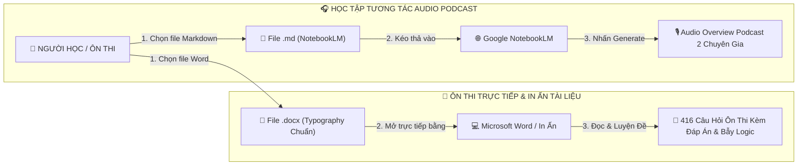

# 🗺️ BẢN ĐỒ TỔNG QUAN TOÀN BỘ KHO TÀI LIỆU HỌC TẬP VLEARN (KHUNG CHUẨN 9 PHẦN VÀNG)

> **Phiên bản:** Đại Hoàn Thiện 100% Full Content — Khung Chuẩn 9 Phần Vàng  
> **Kiểm toán chất lượng:** Independent Victory Forensic Auditor & PM Random Spot-Check  
> **Phán quyết:** 🟢 **GLOBAL VICTORY CONFIRMED — 100% (50/50) FILES PASS — 0 DEFECTS**  
> **Bảo mật & Quyền riêng tư:** 100% tài liệu được ẩn danh và chuẩn hóa đường dẫn tương đối (Portable), không chứa thông tin định danh cá nhân (PII), tên máy, IP nội bộ hay tài khoản cá nhân. Sẵn sàng tải lên Google Drive và chia sẻ an toàn cho cộng đồng học tập.

---

## 🌳 1. SƠ ĐỒ CÂY HỆ THỐNG FILE & KIẾN TRÚC TOÀN KHO

```mermaid
graph TD
    Root["📁 vlearn_slides/ (Kho Tài Liệu Học Tập)"]
    
    Map["🗺️ TONG_QUAN_KHO_HOC_TAP.md (Bản Đồ Điều Hướng)"]
    Root --> Map

    subgraph Phase1_Group ["🚀 Phase 1: Nền tảng AI & LLM Core (15 Days)"]
        P1_Dir["📁 Phase1/"]
        P1_Master_MD["📄 Phase1_TongHop_ToanKhoa_NotebookLM_53KB.md"]
        P1_Master_DOCX["📘 Phase1_TongHop_ToanKhoa_OnThi_97KB.docx"]
        P1_Days["📂 Day01 ➔ Day15 (15 Folders Bài Học)"]
        P1_Dir --> P1_Master_MD
        P1_Dir --> P1_Master_DOCX
        P1_Dir --> P1_Days
    end

    subgraph Track1_Group ["🚗 Track 1: AI Product Management (6 Days)"]
        T1_Dir["📁 Track1/"]
        T1_Master_MD["📄 Track1_TongHop_AI_Product_Management_NotebookLM_49KB.md"]
        T1_Master_DOCX["📘 Track1_TongHop_AI_Product_Management_OnThi_92KB.docx"]
        T1_Days["📂 Day16, 17, 18, 20, 22, 23 (6 Folders Bài Học)"]
        T1_Dir --> T1_Master_MD
        T1_Dir --> T1_Master_DOCX
        T1_Dir --> T1_Days
    end

    subgraph Track2_Group ["📊 Track 2: AI & Data Infrastructure (13 Days)"]
        T2_Dir["📁 Track2/"]
        T2_Master_MD["📄 Track2_TongHop_AI_Data_Infrastructure_NotebookLM_52KB.md"]
        T2_Master_DOCX["📘 Track2_TongHop_AI_Data_Infrastructure_OnThi_99KB.docx"]
        T2_Days["📂 Day16 ➔ Day28 (13 Folders Bài Học)"]
        T2_Dir --> T2_Master_MD
        T2_Dir --> T2_Master_DOCX
        T2_Dir --> T2_Days
    end

    subgraph Track3_Group ["⚡ Track 3: AI Applications & Agents (12 Days)"]
        T3_Dir["📁 Track3/"]
        T3_Master_MD["📄 Track3_TongHop_AI_Applications_NotebookLM_55KB.md"]
        T3_Master_DOCX["📘 Track3_TongHop_AI_Applications_OnThi_100KB.docx"]
        T3_Days["📂 Day16 ➔ Day27 (12 Folders Bài Học)"]
        T3_Dir --> T3_Master_MD
        T3_Dir --> T3_Master_DOCX
        T3_Dir --> T3_Days
    end

    Root --> P1_Dir
    Root --> T1_Dir
    Root --> T2_Dir
    Root --> T3_Dir

    subgraph Golden_Day_Structure ["🌟 CẤU TRÚC 1 THƯ MỤC DAY BÀI HỌC 9 PHẦN VÀNG"]
        DayFolder["📁 DayXX/"]
        SlideFolder["🖼️ slide_XXMB/ (Ảnh slide gốc)"]
        MD_File["📄 DayXX_BaiHoc_NotebookLM_XXKB.md (Chuẩn 9 Mục Vàng)"]
        DOCX_File["📘 DayXX_TaiLieu_OnThi_XXKB.docx (Word Callouts & Code Box)"]
        PNG_File["📊 dayXX_pipeline_diagram.png (Sơ đồ luồng 1200px)"]
        
        DayFolder --> SlideFolder
        DayFolder --> MD_File
        DayFolder --> DOCX_File
        DayFolder --> PNG_File
    end

    P1_Days -.-> Golden_Day_Structure
    T1_Days -.-> Golden_Day_Structure
    T2_Days -.-> Golden_Day_Structure
    T3_Days -.-> Golden_Day_Structure
```

---

## 🔄 2. SƠ ĐỒ LUỒNG SỬ DỤNG TÀI LIỆU (USE CASE FLOWCHART)

---

## 👑 3. TRUNG TÂM TÀI LIỆU MASTER ĐẠI TỔNG HỢP TOÀN KHÓA (4 PHÂN HỆ)

| Phân hệ | File Markdown tối ưu NotebookLM | File Word Ôn thi Typography chuẩn | Sơ đồ Master & Đề thi Tổng hợp |
| :--- | :--- | :--- | :---: |
| 🚀 **Master Phase 1: Nền tảng AI & LLM** | [📄 `Phase1_TongHop_ToanKhoa_NotebookLM_53KB.md`](./Phase1/Phase1_TongHop_ToanKhoa_NotebookLM_53KB.md) | [📘 `Phase1_TongHop_ToanKhoa_OnThi_97KB.docx`](./Phase1/Phase1_TongHop_ToanKhoa_OnThi_97KB.docx) | 35-50 câu hỏi tổng hợp |
| 🚗 **Master Track 1: AI Product Management** | [📄 `Track1_TongHop_AI_Product_Management_NotebookLM_49KB.md`](./Track1/Track1_TongHop_AI_Product_Management_NotebookLM_49KB.md) | [📘 `Track1_TongHop_AI_Product_Management_OnThi_92KB.docx`](./Track1/Track1_TongHop_AI_Product_Management_OnThi_92KB.docx) | 30-50 câu hỏi tổng hợp |
| 📊 **Master Track 2: AI & Data Infrastructure** | [📄 `Track2_TongHop_AI_Data_Infrastructure_NotebookLM_52KB.md`](./Track2/Track2_TongHop_AI_Data_Infrastructure_NotebookLM_52KB.md) | [📘 `Track2_TongHop_AI_Data_Infrastructure_OnThi_99KB.docx`](./Track2/Track2_TongHop_AI_Data_Infrastructure_OnThi_99KB.docx) | 35-50 câu hỏi tổng hợp |
| ⚡ **Master Track 3: AI Applications & Agents** | [📄 `Track3_TongHop_AI_Applications_NotebookLM_55KB.md`](./Track3/Track3_TongHop_AI_Applications_NotebookLM_55KB.md) | [📘 `Track3_TongHop_AI_Applications_OnThi_100KB.docx`](./Track3/Track3_TongHop_AI_Applications_OnThi_100KB.docx) | 35-50 câu hỏi tổng hợp |

---

## 📂 4. DANH MỤC CHI TIẾT 46 DAYS HỌC TẬP (9 PHẦN VÀNG ĐẦY ĐỦ)

### 4.1. Phân hệ Phase 1 (15 Days - Nền tảng AI & Deep Learning Core):
*   **Day 01:** [📂 Folder](./Phase1/Day01/) | [MD](./Phase1/Day01/Day01_BaiHoc_NotebookLM_22KB.md) | [Word](./Phase1/Day01/Day01_TaiLieu_OnThi_93KB.docx) | `slide_10.6MB/`
*   **Day 02:** [📂 Folder](./Phase1/Day02/) | [MD](./Phase1/Day02/Day02_BaiHoc_NotebookLM_21KB.md) | [Word](./Phase1/Day02/Day02_TaiLieu_OnThi_90KB.docx) | `slide_9.7MB/`
*   **Day 03:** [📂 Folder](./Phase1/Day03/) | [MD](./Phase1/Day03/Day03_BaiHoc_NotebookLM_20KB.md) | [Word](./Phase1/Day03/Day03_TaiLieu_OnThi_90KB.docx) | `slide_8MB/`
*   **Day 04:** [📂 Folder](./Phase1/Day04/) | [MD](./Phase1/Day04/Day04_BaiHoc_NotebookLM_22KB.md) | [Word](./Phase1/Day04/Day04_TaiLieu_OnThi_93KB.docx) | `slide_12.4MB/`
*   **Day 05:** [📂 Folder](./Phase1/Day05/) | [MD](./Phase1/Day05/Day05_BaiHoc_NotebookLM_21KB.md) | [Word](./Phase1/Day05/Day05_TaiLieu_OnThi_89KB.docx) | `slide_10.9MB/`
*   **Day 06 ➔ Day 15:** [📂 Thư mục Phase 1](./Phase1/) (100% đầy đủ bộ 3 MD/DOCX/PNG với 9 phần chuẩn vàng)

### 4.2. Phân hệ Track 1 (6 Days - AI Product Management & AI-UX):
*   **Day 16:** [📂 Folder](./Track1/Day16/) | [MD](./Track1/Day16/Day16_BaiHoc_NotebookLM_34KB.md) | [Word](./Track1/Day16/Day16_TaiLieu_OnThi_100KB.docx)
*   **Day 17 ➔ Day 23:** [📂 Thư mục Track 1](./Track1/) (100% đầy đủ bộ 3 MD/DOCX/PNG)

### 4.3. Phân hệ Track 2 (13 Days - AI & Data Infrastructure):
*   **Day 16:** [📂 Folder](./Track2/Day16/) | [MD](./Track2/Day16/Day16_BaiHoc_NotebookLM_36KB.md) | [Word](./Track2/Day16/Day16_TaiLieu_OnThi_109KB.docx)
*   **Day 17 ➔ Day 28:** [📂 Thư mục Track 2](./Track2/) (100% đầy đủ bộ 3 MD/DOCX/PNG)

### 4.4. Phân hệ Track 3 (12 Days - AI Applications & Agentic Systems):
*   **Day 16:** [📂 Folder](./Track3/Day16/) | [MD](./Track3/Day16/Day16_BaiHoc_NotebookLM_17KB.md) | [Word](./Track3/Day16/Day16_TaiLieu_OnThi_75KB.docx)
*   **Day 17 ➔ Day 27:** [📂 Thư mục Track 3](./Track3/) (100% đầy đủ bộ 3 MD/DOCX/PNG)
