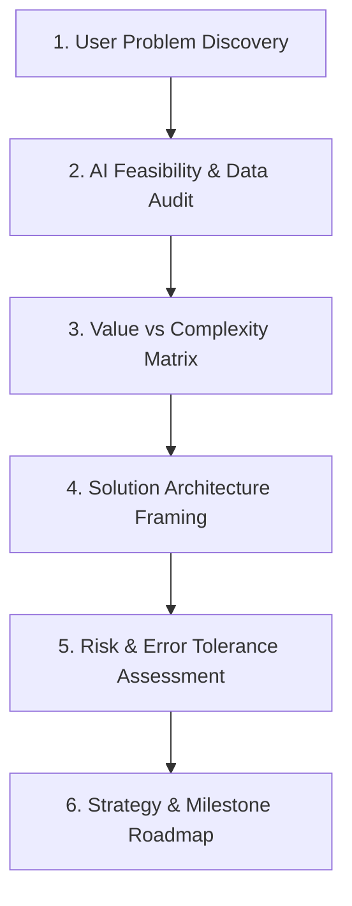

# 📚 DAY16: CHIẾN LƯỢC SẢN PHẨM AI & ĐỊNH VỊ BÀI TOÁN (AI PRODUCT STRATEGY & PROBLEM DISCOVERY)
> **Khóa học:** AI Product Management (VLearn Track 1) | Giảng viên: Mai Anh Nguyen (Blue) | Note: Bảo Hoàng (2A202605721 - K4) | **Tối ưu:** Google NotebookLM (< 50MB)

---

## 📌 1. BÀI HỌC HÔM NAY VỀ CÁI GÌ? (THE WHAT & WHY)

*   **Bản chất của Quản lý Sản phẩm AI (AI Product Management):** Chuyển dịch căn bản từ Phát triển phần mềm tất định (Deterministic Software: nếu đầu vào là X thì luôn cho ra Y, tỷ lệ lỗi logic xấp xỉ 0%) sang Hệ thống phần mềm xác suất (Probabilistic Systems: đầu ra tuân theo phân phối P(Y | X) với dung sai sai số cố hữu 0 < ε < 1). Người làm AI PM không chỉ quản lý tính năng mà phải quản lý phân phối xác suất và độ kỳ vọng của người dùng.
*   **Khung thẩm định Tính khả thi vs Giá trị Kinh doanh (AI Feasibility vs Business Value Matrix):** Phân định 4 góc phần tư chiến lược: (1) Low-hanging Fruits (Giá trị cao, Khả thi cao - Ưu tiên hàng đầu cho MVP), (2) Moonshots (Giá trị cao, Khó làm - Nghiên cứu dài hạn), (3) Distractions (Giá trị thấp, Dễ làm - Bẫy lãng phí tài nguyên kỹ thuật), và (4) No-go Zone (Giá trị thấp, Khó làm - Tuyệt đối loại bỏ ngay từ đầu).
*   **Phân tầng Công nghệ & Lựa chọn Kiến trúc Tối ưu (Minimal Sufficient Tech):** Nguyên tắc 'Công nghệ tối thiểu đáp ứng đủ bài toán': Ưu tiên Rule-based / SQL cho logic nghiệp vụ cứng và đòi hỏi chính xác 100%; Classical ML cho dữ liệu bảng (Tabular data), chấm điểm rủi ro, phân loại nhị phân; Deep Learning / CV / NLP cho dữ liệu phi cấu trúc thô; và LLM / Generative Agents cho tác vụ suy luận đa bước, đàm thoại tự nhiên và tổng hợp bối cảnh.
*   **Định vị Giá trị Khách hàng & Thiết kế Trải nghiệm Chịu lỗi (Fault-Tolerant AI UX):** Xây dựng Value Proposition Canvas chuẩn AI, ngăn ngừa triệt để hội chứng 'công nghệ đi tìm bài toán' (Tech looking for a problem). Thiết kế trải nghiệm người dùng có cơ chế tự phục hồi lỗi (Graceful Degradation) và chuyển hướng thông minh về con người (Human-in-the-Loop Fallback) khi độ tự tin mô hình thấp.

---

## 💡 2. ẨN DỤ ĐỜI THƯỜNG: THỰC TRẠNG & GIẢI PHÁP

### 🔴 Thực trạng:
Nhiều doanh nghiệp chạy theo trào lưu 'AI-First', vội vã nhúng mô hình ngôn ngữ lớn (LLM) vào mọi chức năng từ tính tổng giỏ hàng đến lọc sản phẩm theo giá. Kết quả là chi phí API tăng vọt, độ trễ kéo dài từ 5ms lên 3-5 giây, hệ thống thỉnh thoảng tính sai phép cộng đơn giản khiến khách hàng mất niềm tin hoàn toàn.

### 🚗 Ẩn dụ đời thường:

> **1. Cắt thanh gỗ thẳng (Rule-based / SQL): ** Để cưa một khúc gỗ thẳng tắp, người thợ mộc chỉ cần một chiếc cưa tay hoặc cưa bàn đơn giản, mất 5 giây và tốn 0 đồng nhiên liệu. Nếu đem cưa khúc gỗ thẳng vào máy tiện CNC 5 trục khổng lồ (LLM), xưởng phải lập trình tọa độ phức tạp, tốn tiền điện gấp 1.000 lần và mất 5 phút khởi động.
> **2. Chạm khắc hoa văn rồng phượng uốn lượn (AI / LLM Feasibility): ** Khi khách hàng yêu cầu chạm khắc một bức tranh phong cảnh 3D tinh xảo với hàng triệu đường cong biến hóa (bài toán phi cấu trúc, phi tuyến tính), cưa tay bất lực. Lúc này cỗ máy CNC / AI mới phát huy tối đa giá trị vượt trội.
> **3. Phôi gỗ mục nát (Data Readiness): ** Nếu đưa vào máy CNC một khúc gỗ đã bị mối mọt, mục ruỗng từ bên trong (dữ liệu rác / thiếu nhãn), mũi khoan của máy sẽ làm vỡ nát khúc gỗ dù máy có hiện đại đến đâu (Garbage In, Garbage Out).

### 🟢 Giải pháp kỹ thuật:
Áp dụng nguyên tắc Minimal Sufficient Tech: Luôn chọn giải pháp kỹ thuật đơn giản nhất giải quyết được bài toán. Chỉ kích hoạt AI khi dữ liệu đạt chuẩn độ sẵn sàng (Data Readiness) và thiết kế cơ chế chuyển giao con người khi AI có độ tự tin thấp.


---

## 🗺️ 3. SƠ ĐỒ PIPELINE & QUY TRÌNH THỰC HIỆN TỪ ĐẦU ĐẾN CUỐI



*   **1. User Problem Discovery:** Bóc tách Jobs-to-be-Done (JTBD), xác định rõ nỗi đau cốt lõi và rào cản ngăn người dùng đạt mục tiêu.
*   **2. AI Feasibility & Data Audit:** Kiểm tra tính sẵn sàng của dữ liệu lịch sử (N_samples, độ sạch, nhãn ground-truth) và tính khả thi thuật toán.
*   **3. Value vs Complexity Matrix:** Chấm điểm Impact (Doanh thu, Giữ chân, Năng suất) vs Cost/Effort (Hạ tầng, Kỹ thuật, Vận hành) để chọn tính năng MVP.
*   **4. Solution Architecture Framing:** Quyết định ranh giới giữa Rule-based Heuristic, Classical ML, RAG Pipeline hay Autonomous Agent.
*   **5. Risk & Error Tolerance Assessment:** Xác định ngưỡng chấp nhận lỗi (ε_max), thiết kế cơ chế Guardrails và kịch bản Human-in-the-Loop.
*   **6. Strategy & Milestone Roadmap:** Xác lập KPI sản phẩm (Retention, Churn, ROI), chỉ số kỹ thuật (Latency, Accuracy) và các cột mốc phát hành.

---

## 🌐 4. KIẾN THỨC MỞ RỘNG CHUYÊN SÂU (FIRECRAWL RESEARCH)

### Nghiên cứu Thực tế từ Hệ thống Đề xuất của Netflix (Data Flywheel & Multi-Armed Bandits)
Netflix sử dụng hệ thống đề xuất cá nhân hóa dựa trên thuật toán Contextual Bandits và Deep Reinforcement Learning. Hệ thống này thu thập hàng tỷ tín hiệu phản hồi ngầm (Implicit Feedback: thời gian xem, tạm dừng, bỏ qua) mỗi ngày để tự động điều chỉnh ảnh bìa (Artwork Personalization) và danh sách gợi ý. Theo báo cáo kỹ thuật của Netflix, vòng lặp Bánh đà Dữ liệu (Data Flywheel) này giúp giảm tỷ lệ hủy đăng ký (Churn Rate) và tiết kiệm hơn 1 tỷ USD mỗi năm.

### Nghiên cứu Kiến trúc AI của Spotify: Kết hợp Collaborative Filtering & Audio CNNs
Tính năng Discover Weekly của Spotify không chỉ dựa vào LLM mà kết hợp 3 tầng công nghệ: (1) Collaborative Filtering phân tích ma trận hành vi nghe nhạc của hàng triệu playlist, (2) NLP phân tích các bài đánh giá/bài báo âm nhạc trên web, và (3) Convolutional Neural Networks (CNNs) quét trực tiếp sóng âm phổ (Spectrogram) của các bài hát mới chưa có lượt nghe. Đây là minh chứng mẫu mực cho việc phối hợp đa tầng công nghệ để tạo ra Hào phòng thủ AI bền vững (Sustainable AI Moat).

### Quy tắc Thẩm định Khả thi AI của Andrew Ng (1-Second Rule & DRL Framework)
Quy tắc kinh điển của Andrew Ng: 'Bất kỳ tác vụ trí tuệ nào mà một người bình thường có thể thực hiện trong dưới 1 giây suy nghĩ, chúng ta đều có thể tự động hóa bằng AI ở hiện tại hoặc tương lai gần.' Khung Cấp độ Sẵn sàng Dữ liệu (Data Readiness Levels - DRL) phân cấp từ DRL-1 (dữ liệu thô phân mảnh) đến DRL-5 (pipeline tự động làm sạch, nhãn chuẩn xác thực, continuous validation).

### Bản chất của Hào phòng thủ AI (True AI Moat vs Commodity LLMs)
Trọng số mô hình (Model Weights) và Prompting không phải là Moat lâu dài do các mô hình mã nguồn mở (như Llama 3, DeepSeek) liên tục thu hẹp khoảng cách. Moat thực sự nằm ở: (a) Quy trình tích hợp sâu vào luồng công việc người dùng (Deep Workflow Integration), (b) Dữ liệu bối cảnh độc quyền (Proprietary Domain Context), và (c) Chi phí vận hành tối ưu vượt bậc (Latency & Cost Advantage).


---

## 🔑 5. BẢNG TỪ KHÓA CỐT LÕI

| Thuật ngữ | Khái niệm kỹ thuật | Giải thích đời thường |
| :--- | :--- | :--- |
| **AI Feasibility** | Mức độ khả thi về mặt toán học, dữ liệu và hạ tầng để giải quyết bài toán bằng ML/AI. | Đo lường xem bài toán này AI có giải nổi không hay đang mơ mộng hão huyền. |
| **Probabilistic Product** | Sản phẩm vận hành dựa trên phân phối xác suất P(Y|X) có sai số cố hữu. | Phần mềm không thể cam kết đúng 100%, luôn có xác suất đoán trúng hoặc trượt. |
| **Data Flywheel** | Vòng lặp tự củng cố giữa lượng người dùng, dữ liệu sinh ra và chất lượng mô hình. | Càng đông người dùng thì AI càng thông minh, AI càng thông minh thì càng hút khách. |
| **Value Proposition Canvas** | Khung đối sánh giữa Hồ sơ khách hàng (Pains, Gains, Jobs) và Bản đồ giá trị sản phẩm. | Bản thiết kế khớp nối chính xác giữa thuốc chữa bệnh và vết thương của khách. |
| **AI Moat** | Lợi thế cạnh tranh bền vững khó bị sao chép được tạo dựng từ dữ liệu và quy trình tích hợp. | Bức tường thành kiên cố giúp sản phẩm AI không bị đối thủ đè bẹp sau một đêm. |
| **Jobs-to-be-Done (JTBD)** | Khung lý thuyết phân tích nhiệm vụ cơ bản mà người dùng muốn hoàn thành khi dùng sản phẩm. | Khách hàng không mua mũi khoan 5 phân, họ mua chiếc lỗ 5 phân trên tường. |
| **Minimal Sufficient Tech** | Nguyên lý lựa chọn giải pháp kỹ thuật tối thiểu vừa đủ giải quyết bài toán hiệu quả. | Dùng dao gọt hoa quả gọt táo, không vác đại đao chém hoa quả. |
| **Fault-Tolerant AI UX** | Thiết kế trải nghiệm người dùng có khả năng chịu đựng và tự phục hồi khi AI đoán sai. | Thiết kế phanh phụ và túi khí an toàn để xe không lật khi AI mất lái. |

---

## 🎯 6. BỘ CÂU HỎI ÔN THI TRỌNG TÂM (CHUẨN HỌC THUẬT & ĐẠI HỌC)

### 📝 PHẦN A: 6 CÂU TRẮC NGHIỆM ĐƠN (SINGLE-CHOICE)

#### Câu 1: Sự khác biệt căn bản nhất giữa một Sản phẩm Phần mềm Truyền thống (Traditional Software) và một Sản phẩm AI (AI Product) nằm ở đặc tính nào?
*   A. Sản phẩm AI bắt buộc phải viết bằng ngôn ngữ Python, trong khi phần mềm truyền thống dùng C++ hoặc Java.
*   B. Sản phẩm truyền thống vận hành theo logic tất định (Deterministic), trong khi sản phẩm AI vận hành theo không gian xác suất (Probabilistic) với dung sai sai số cố hữu.
*   C. Sản phẩm AI không cần thiết kế giao diện người dùng UI/UX, chỉ cần cung cấp API đầu cuối.
*   D. Sản phẩm truyền thống không thể nâng cấp tính năng sau khi đã đóng gói phát hành.
> **👉 ĐÁP ÁN ĐÚNG: B**  
> **💡 Phân tích & Bẫy logic:** Phần mềm truyền thống thực thi các tập lệnh logic cứng (if-else, CRUD, SQL) đảm bảo kết quả nhất quán 100% với cùng một đầu vào. Ngược lại, sản phẩm AI dựa trên các mô hình thống kê học máy P(Y|X), luôn tồn tại xác suất sai số (False Positives/Negatives, Hallucination). Phương án A sai vì ngôn ngữ chỉ là công cụ lập trình; Phương án C sai vì AI càng cần UX để bù đắp sai số; Phương án D sai vì phần mềm truyền thống vẫn cập nhật thường xuyên.

---

#### Câu 2: Trong Ma trận Thẩm định Giá trị vs Độ phức tạp (Value vs Complexity Matrix), một tính năng AI được đánh giá là 'Kỹ thuật cực kỳ phức tạp nhưng mang lại Giá trị kinh doanh rất thấp' thuộc góc phần tư nào và PM nên xử lý ra sao?
*   A. Low-hanging Fruits — Cần ưu tiên triển khai ngay trong Sprint đầu tiên.
*   B. Moonshots — Cần đầu tư toàn bộ ngân sách để tạo đột phá công nghệ.
*   C. Distractions / No-go Zone — Cần kiên quyết loại bỏ hoặc đưa vào danh sách cấm để tránh hao hụt nguồn lực.
*   D. Quick Wins — Thuê ngoài toàn bộ cho đội ngũ phát triển bên thứ ba.
> **👉 ĐÁP ÁN ĐÚNG: C**  
> **💡 Phân tích & Bẫy logic:** Các tính năng có chi phí phát triển/vận hành khổng lồ nhưng không mang lại tác động rõ rệt cho người dùng là 'bẫy kỹ thuật' (Engineering Trap / Distractions / No-go). PM chuyên nghiệp phải kiên quyết từ chối để tập trung nguồn lực vào Low-hanging Fruits. Phương án A sai vì Low-hanging fruits phải có giá trị cao; Phương án B sai vì Moonshots phải có giá trị kinh doanh cực lớn; Phương án D sai vì thuê ngoài tính năng vô ích vẫn lãng phí tiền bạc.

---

#### Câu 3: Yếu tố nào sau đây đóng vai trò là 'Hào phòng thủ bền vững' (Sustainable AI Moat) chân chính cho một công ty khởi nghiệp sản phẩm AI?
*   A. Kỹ thuật viết System Prompt độc quyền dài 5.000 từ trên nền GPT-4o.
*   B. Việc sở hữu bản quyền các trọng số mô hình mã nguồn mở vừa được tải về từ HuggingFace.
*   C. Tập dữ liệu tương tác người dùng độc quyền gắn liền với luồng nghiệp vụ sâu (Deep Workflow Integration) và Bánh đà dữ liệu hoạt động hiệu quả.
*   D. Số lượng card đồ họa GPU mà công ty đang thuê trả tiền theo giờ trên nền tảng đám mây.
> **👉 ĐÁP ÁN ĐÚNG: C**  
> **💡 Phân tích & Bẫy logic:** Prompting hay mô hình nền tảng bên thứ ba đều dễ dàng bị đối thủ bắt chước hoặc thay thế chỉ sau vài tuần. Moat thực sự nằm ở dữ liệu ngầm độc quyền sinh ra từ quy trình người dùng sử dụng hàng ngày (Proprietary Feedback Loop) và mức độ tích hợp sâu vào hệ thống nghiệp vụ của khách hàng khiến chi phí chuyển đổi (Switching Cost) trở nên cực cao. Phương án A, B, D chỉ là hàng hóa thông dụng (Commodities) mà bất kỳ ai có tiền đều mua được.

---

#### Câu 4: Khi nào một Product Manager KHÔNG NÊN ứng dụng Machine Learning / LLM mà nên sử dụng giải pháp Rule-based / Heuristic truyền thống?
*   A. Khi bài toán có độ phức tạp cao và chứa hàng triệu mẫu dữ liệu phân loại phi cấu trúc.
*   B. Khi người dùng cần giao tiếp trò chuyện tự nhiên bằng đa ngôn ngữ với ngữ điệu đồng cảm.
*   C. Khi bài toán đòi hỏi độ chính xác tuyệt đối 100% theo quy định pháp lý nghiêm ngặt (như tính thuế, lãi suất ngân hàng) và logic có thể biểu diễn trọn vẹn bằng luật cứng.
*   D. Khi hệ thống cần tự động phát hiện các mẫu gian lận mới chưa từng xuất hiện trong quá khứ.
> **👉 ĐÁP ÁN ĐÚNG: C**  
> **💡 Phân tích & Bẫy logic:** Các tác vụ tài chính, pháp lý, tính toán sổ sách kế toán yêu cầu tính tất định và giải trình logic 100% (Zero tolerance for errors). Việc đưa mô hình xác suất vào các bài toán này vừa làm tăng chi phí hạ tầng vừa tạo ra rủi ro vi phạm tuân thủ pháp luật nghiêm trọng. Phương án A, B, D là những miền bài toán mà AI/ML phát huy sức mạnh vượt trội so với luật cứng.

---

#### Câu 5: Theo nguyên lý 'Minimal Sufficient Tech' (Công nghệ tối thiểu đủ dùng), thứ tự ưu tiên lựa chọn giải pháp nào sau đây là ĐÚNG ĐẮN khi bắt đầu một dự án sản phẩm mới?
*   A. Autonomous Multi-Agent System -> Fine-tuned LLM -> Rule-based Heuristics -> SQL Query.
*   B. SQL / Rule-based Heuristics -> Simple Classical ML (LogReg/Tree) -> Deep Learning -> RAG / LLM Agents.
*   C. Fine-tuned LLM -> Zero-shot Prompting -> Classical ML -> Manual Human Process.
*   D. Deep Learning Vision Model -> RAG Pipeline -> Regex Matching -> Heuristic Rules.
> **👉 ĐÁP ÁN ĐÚNG: B**  
> **💡 Phân tích & Bẫy logic:** Nguyên tắc kỹ nghệ sản phẩm chuẩn mực luôn đi từ giải pháp đơn giản nhất, ít tốn chi phí và dễ giải trình nhất (SQL/Rules), sau đó mới nâng dần lên Classical ML khi dữ liệu nhiều hơn, và chỉ chuyển sang LLM/Generative AI khi các phương pháp truyền thống không thể giải quyết được tác vụ. Các phương án A, C, D đều mắc bẫy 'Over-engineering' và lãng phí tài nguyên.

---

#### Câu 6: Chỉ số nào sau đây phản ánh chính xác nhất mức độ 'Sẵn sàng của Dữ liệu' (Data Readiness Level - DRL) cho một bài toán huấn luyện mô hình phân loại rủi ro tín dụng?
*   A. Tổng số gigabyte log hệ thống chưa qua xử lý được lưu trữ trên Amazon S3.
*   B. Số lượng nhân viên trong phòng kỹ thuật công nghệ thông tin.
*   C. Tỷ lệ dữ liệu lịch sử có nhãn ground-truth chuẩn xác, độ trễ cập nhật nhãn thấp và phân phối đại diện đầy đủ cho các nhóm khách hàng thực tế.
*   D. Số lượng thuật toán mã nguồn mở trên GitHub mà nhóm kỹ sư đã lưu dấu sao (Star).
> **👉 ĐÁP ÁN ĐÚNG: C**  
> **💡 Phân tích & Bẫy logic:** Dữ liệu sẵn sàng cho AI (Data Readiness) không đo bằng dung lượng thô hay nhân sự, mà đo bằng chất lượng nhãn (Ground-truth labels), tính đại diện phân phối và đường ống làm sạch tự động. Dữ liệu rác dù nhiều TB cũng không thể huấn luyện được mô hình chuẩn. Phương án A là DRL-1 (dữ liệu thô phân mảnh); Phương án B và D không liên quan đến chất lượng dữ liệu.

---

### 📝 PHẦN B: 4 CÂU TRẮC NGHIỆM NHIỀU ĐÁP ÁN (MULTI-SELECT)

#### Câu 7: Những rủi ro chính nào có thể khiến 'Hiệu ứng Bánh đà Dữ liệu' (Data Flywheel) của một sản phẩm AI bị tê liệt hoàn toàn? (Chọn 2 đáp án)
*   A. Sản phẩm không có cơ chế ghi nhận phản hồi ngầm (Implicit Feedback Loops) hoặc nhãn hiệu chỉnh từ người dùng thực tế.
*   B. Giao diện người dùng sử dụng tông màu xanh dương thay vì màu cam.
*   C. Dữ liệu người dùng mới phát sinh chứa quá nhiều nhiễu và bị trôi dạt phân phối (Data Drift) nhưng không có pipeline lọc và làm sạch tự động.
*   D. Máy chủ lưu trữ cơ sở dữ liệu đặt tại trung tâm dữ liệu đạt chuẩn Tier 3.
> **👉 ĐÁP ÁN ĐÚNG: A, C**  
> **💡 Phân tích & Bẫy logic:** Phương án A đúng vì nếu người dùng sử dụng nhưng hệ thống không thu thập được dữ liệu đúng/sai (vd: hành động chấp nhận hay từ chối câu trả lời của bot) thì mô hình không có dữ liệu để học tiếp; Phương án C đúng vì dữ liệu bẩn và trôi dạt sẽ đầu độc mô hình (Model Poisoning); Phương án B và D là các yếu tố hình thức và hạ tầng không làm tê liệt logic bánh đà.

---

#### Câu 8: Khi xây dựng một sản phẩm AI hỗ trợ chẩn đoán hình ảnh y khoa, Product Manager cần áp dụng những nguyên tắc thiết kế trải nghiệm người dùng (AI UX) nào sau đây? (Chọn 2 đáp án)
*   A. Thiết lập cơ chế 'Human-in-the-Loop': AI chỉ đóng vai trò trợ lý đưa ra vùng nghi vấn kèm điểm tự tin (Confidence Score), bác sĩ là người đưa ra quyết định lâm sàng cuối cùng.
*   B. Thiết kế kịch bản 'Graceful Degradation' và Fallback rõ ràng: Khi ảnh bị mờ hoặc độ tự tin dưới ngưỡng an toàn, hệ thống lập tức thông báo yêu cầu chụp lại thay vì đoán mò.
*   C. Ẩn hoàn toàn mức độ tự tin của mô hình và tự động gửi kết luận chẩn đoán thẳng cho bệnh nhân để tối đa hóa tốc độ phục vụ.
*   D. Tự động chỉnh sửa đơn thuốc của bệnh nhân trên hệ thống bệnh viện mà không cần thông báo cho bác sĩ điều trị.
> **👉 ĐÁP ÁN ĐÚNG: A, B**  
> **💡 Phân tích & Bẫy logic:** Trong các lĩnh vực rủi ro cao (High-stakes Domains) như y tế, AI bắt buộc phải là công cụ tăng cường trí tuệ con người (Human-in-the-Loop) với cơ chế giải trình độ tự tin rõ ràng (A) và phải có khả năng từ chối trả lời khi dữ liệu đầu vào không đạt chuẩn để đảm bảo an toàn tính mạng (B); Phương án C và D vi phạm đạo đức và an toàn AI nghiêm trọng.

---

#### Câu 9: Những tiêu chí nào sau đây cần được xem xét khi đánh giá 'Tính khả thi kỹ thuật' (Technical Feasibility) của một tính năng GenAI? (Chọn 2 đáp án)
*   A. Mức độ dung sai sai số của người dùng (Error Tolerance): Người dùng có chấp nhận việc câu trả lời thỉnh thoảng có sai sót nhỏ hay không.
*   B. Giá cổ phiếu của nhà cung cấp mô hình nền tảng trên sàn giao dịch Nasdaq.
*   C. Độ trễ yêu cầu (Latency Constraints) và Chi phí suy luận trên mỗi lượt truy vấn (Inference Cost per Query) có khả thi về mặt kinh tế hay không.
*   D. Tổng số slide thuyết trình mà ban giám đốc đã chuẩn bị cho hội nghị khách hàng.
> **👉 ĐÁP ÁN ĐÚNG: A, C**  
> **💡 Phân tích & Bẫy logic:** Tính khả thi kỹ thuật của AI gắn liền với: (1) Dung sai sai số của bài toán (A - nếu bài toán yêu cầu 0% sai số thì GenAI không khả thi), và (2) Ràng buộc độ trễ & chi phí API (C - nếu cần phản hồi dưới 50ms hoặc ngân sách $0.0001/query thì LLM lớn không khả thi). Phương án B và D là các yếu tố tài chính/truyền thông bên ngoài không quyết định tính khả thi kỹ thuật.

---

#### Câu 10: Trong giai đoạn định vị bài toán AI (AI Problem Framing), những sai lầm chiến lược phổ biến nào cần phải tránh? (Chọn 2 đáp án)
*   A. Bắt đầu từ công nghệ mới nổi (ví dụ: 'Chúng ta phải dùng AI Agent ngay') rồi cố gắng gò ép vào một bài toán kinh doanh không cần thiết (Tech-push trap).
*   B. Bỏ qua việc định lượng các giải pháp thay thế thủ công (Workarounds) mà khách hàng đang sử dụng hiện tại.
*   C. Xác định rõ ràng chỉ số thành công kinh doanh (Business KPI) như Churn Rate hay Average Order Value trước khi phát triển sản phẩm.
*   D. Phân loại đối tượng người dùng theo các nhóm hành vi và mức độ chấp nhận rủi ro.
> **👉 ĐÁP ÁN ĐÚNG: A, B**  
> **💡 Phân tích & Bẫy logic:** Sai lầm kinh điển của AI PM là 'công nghệ đi tìm bài toán' (A) và không tìm hiểu xem khách hàng hiện tại đã giải quyết việc đó bằng cách thủ công nào (B - nếu khách hàng chưa từng tìm cách giải quyết thì nỗi đau đó không đủ lớn). Phương án C và D là các thực hành quản trị sản phẩm chuẩn mực bắt buộc phải làm.

---


---

## 💻 7. ĐOẠN MÃ NGUỒN THỰC CHIẾN (PRODUCTION CODE & IMPLEMENTATION SCRIPT)

### Triển khai Khung Thẩm định Khả thi & Phân loại Chiến lược AI (Python Feasibility Matrix Evaluator)

```python
# -*- coding: utf-8 -*-
"""
Production Module: AI Feasibility & Strategy Evaluator
Phân tích tính khả thi kỹ thuật, giá trị kinh doanh và đề xuất kiến trúc công nghệ tối ưu
"""
from dataclasses import dataclass
from typing import Dict, Any, List

@dataclass
class AIProblemProfile:
    problem_name: str
    business_impact_score: float   # Thang điểm 1.0 - 5.0 (Doanh thu / Giữ chân)
    data_readiness_level: int      # DRL 1 (Kém) đến DRL 5 (Sẵn sàng tự động)
    error_tolerance: str           # "ZERO_TOLERANCE", "LOW", "MEDIUM", "HIGH"
    latency_requirement_ms: int    # Ràng buộc thời gian phản hồi (ms)
    unstructured_data_ratio: float # Tỷ lệ dữ liệu phi cấu trúc (0.0 - 1.0)

class AIFeasibilityEngine:
    def __init__(self):
        self.quadrant_map = {
            "HIGH_VALUE_HIGH_FEASIBILITY": "Low-hanging Fruit (Ưu tiên MVP số 1)",
            "HIGH_VALUE_LOW_FEASIBILITY": "Moonshot (Nghiên cứu dài hạn / R&D)",
            "LOW_VALUE_HIGH_FEASIBILITY": "Distraction (Bẫy lãng phí nguồn lực)",
            "LOW_VALUE_LOW_FEASIBILITY": "No-go Zone (Loại bỏ ngay lập tức)"
        }

    def evaluate_feasibility(self, profile: AIProblemProfile) -> Dict[str, Any]:
        # 1. Tính toán điểm khả thi kỹ thuật (Technical Feasibility Score)
        feasibility_score = (profile.data_readiness_level / 5.0) * 0.5
        
        if profile.error_tolerance in ["HIGH", "MEDIUM"]:
            feasibility_score += 0.3
        elif profile.error_tolerance == "LOW":
            feasibility_score += 0.1
        else: # ZERO_TOLERANCE
            feasibility_score -= 0.2

        if profile.latency_requirement_ms >= 500:
            feasibility_score += 0.2
        elif profile.latency_requirement_ms >= 100:
            feasibility_score += 0.1

        # 2. Xác định góc phần tư chiến lược
        is_high_value = profile.business_impact_score >= 3.5
        is_high_feasibility = feasibility_score >= 0.6

        if is_high_value and is_high_feasibility:
            quadrant = "HIGH_VALUE_HIGH_FEASIBILITY"
        elif is_high_value and not is_high_feasibility:
            quadrant = "HIGH_VALUE_LOW_FEASIBILITY"
        elif not is_high_value and is_high_feasibility:
            quadrant = "LOW_VALUE_HIGH_FEASIBILITY"
        else:
            quadrant = "LOW_VALUE_LOW_FEASIBILITY"

        # 3. Đề xuất Kiến trúc Công nghệ Tối thiểu (Minimal Sufficient Tech)
        if profile.error_tolerance == "ZERO_TOLERANCE":
            recommended_tech = "Rule-based Engine / SQL Heuristics (Tuyệt đối không dùng LLM)"
        elif profile.unstructured_data_ratio < 0.2 and profile.data_readiness_level >= 3:
            recommended_tech = "Classical Machine Learning (XGBoost / Random Forest)"
        elif profile.unstructured_data_ratio >= 0.7:
            if profile.latency_requirement_ms < 200:
                recommended_tech = "Fine-tuned SLM (Small Language Model 3B-8B on-premise)"
            else:
                recommended_tech = "RAG Pipeline + Frontier LLM (GPT-4o / Claude 3.5 Sonnet)"
        else:
            recommended_tech = "Hybrid: Rules + Classical ML"

        return {
            "problem_name": profile.problem_name,
            "feasibility_score": round(feasibility_score, 2),
            "strategic_quadrant": self.quadrant_map[quadrant],
            "recommended_tech": recommended_tech,
            "go_no_go": "GO (Tiến hành)" if is_high_value and is_high_feasibility else "HOLD / REJECT"
        }

# --- Chạy thực nghiệm mẫu ---
if __name__ == "__main__":
    engine = AIFeasibilityEngine()
    
    # Ca 1: Tính toán hóa đơn thuế
    case1 = AIProblemProfile(
        problem_name="Tính toán thuế VAT tự động",
        business_impact_score=4.0,
        data_readiness_level=4,
        error_tolerance="ZERO_TOLERANCE",
        latency_requirement_ms=50,
        unstructured_data_ratio=0.0
    )
    print("Ca 1:", engine.evaluate_feasibility(case1))

    # Ca 2: Trợ lý tóm tắt hồ sơ khách hàng
    case2 = AIProblemProfile(
        problem_name="Trợ lý tóm tắt lịch sử hỗ trợ khách hàng",
        business_impact_score=4.5,
        data_readiness_level=4,
        error_tolerance="MEDIUM",
        latency_requirement_ms=1500,
        unstructured_data_ratio=0.85
    )
    print("Ca 2:", engine.evaluate_feasibility(case2))
```

**🔍 Phân tích chi tiết từng dòng mã:**
Đoạn mã trên mô hình hóa toàn diện quy trình thẩm định bài toán AI: (1) Class `AIProblemProfile` chuẩn hóa 6 tham số trọng yếu gồm tác động kinh doanh, độ sẵn sàng dữ liệu (DRL), dung sai sai số, độ trễ và tỷ lệ phi cấu trúc; (2) Hàm `evaluate_feasibility` tính toán điểm số khả thi thực nghiệm và phân loại chính xác vào 4 góc phần tư chiến lược; (3) Logic `recommended_tech` tự động áp dụng nguyên lý Minimal Sufficient Tech: nếu bài toán đòi hỏi 0% sai số (như tính thuế), hệ thống lập tức khóa quyền dùng LLM và chỉ định Rule-based/SQL; nếu dữ liệu là văn bản tự do và chấp nhận dung sai, hệ thống đề xuất RAG hoặc SLM phù hợp với ràng buộc độ trễ.


---

## 🛠️ 8. BẪY LỖI PHỔ BIẾN & GIẢI PHÁP DEBUG (PRODUCTION FAILURE MODES & TROUBLESHOOTING)

### ⚠️ Bẫy 'Cây búa AI' (AI Hammer Syndrome)
*   **Hiện tượng (Symptom):** Đội ngũ cố tình sử dụng LLM để giải quyết các bài toán tính toán số học hoặc kiểm tra logic luật cứng.
*   **Nguyên nhân gốc rễ (Root Cause):** Thiên kiến công nghệ (Tech-push bias) muốn phô diễn khả năng AI với nhà đầu tư mà bỏ qua tính kinh tế và tính tất định.
*   **Giải pháp khắc phục (Production Fix):** Thiết lập bộ lọc phân tầng bài toán: Tách riêng các luồng tính toán số học chuyển sang SQL/Code Engine; LLM chỉ đóng vai trò phân tích ngôn ngữ tự nhiên.

### ⚠️ Bánh đà dữ liệu bị tê liệt (Broken Data Flywheel)
*   **Hiện tượng (Symptom):** Mô hình AI sau 6 tháng phát hành không hề thông minh hơn, độ chính xác giảm dần theo thời gian.
*   **Nguyên nhân gốc rễ (Root Cause):** Sản phẩm chỉ hiển thị câu trả lời nhưng không có cơ chế thu thập nhãn ngầm (Implicit Feedback như hành vi Sao chép, Chỉnh sửa, Bỏ qua) từ người dùng.
*   **Giải pháp khắc phục (Production Fix):** Cài đặt Telemetry logging ghi nhận hành vi tương tác micro-actions của người dùng và xây dựng pipeline tự động chuyển hóa thành tập dữ liệu huấn luyện tiếp nối.

### ⚠️ Bùng nổ Chi phí & Độ trễ Suy luận (Inference Cost & Latency Explosion)
*   **Hiện tượng (Symptom):** Chi phí gọi API OpenAI vượt quá doanh thu thu được từ khách hàng, thời gian phản hồi trung bình kéo dài > 4 giây.
*   **Nguyên nhân gốc rễ (Root Cause):** Mọi yêu cầu của người dùng đều được gửi trực tiếp đến mô hình lớn đắt đỏ nhất mà không có cơ chế Caching hay Routing.
*   **Giải pháp khắc phục (Production Fix):** Triển khai Semantic Cache (Redis + FastEmbed) để tái sử dụng câu trả lời cho các câu hỏi trùng lặp; cài đặt Model Router phân luồng 80% câu hỏi dễ sang mô hình 8B giá rẻ.

### ⚠️ Ảo tưởng Tự hành Sớm (Premature Autonomous Agent Trap)
*   **Hiện tượng (Symptom):** AI Agent tự động thực hiện các hành động không thể đảo ngược (như xóa tài khoản, gửi email hàng loạt) gây tổn thất lớn cho khách hàng.
*   **Nguyên nhân gốc rễ (Root Cause):** Giao toàn bộ quyền thực thi cho mô hình xác suất khi chưa có cơ chế phê duyệt của con người.
*   **Giải pháp khắc phục (Production Fix):** Áp dụng triệt để nguyên tắc Human-in-the-Loop: Mọi hành động có tác động cao (High-impact actions) bắt buộc phải có bước người dùng xác nhận 'Duyệt / Từ chối' trên giao diện.


---

## ⚖️ 9. BẢNG SO SÁNH ĐÁNH ĐỔI VẬN HÀNH (OPERATIONAL TRADE-OFFS MATRIX)

| Tiêu chí Đánh giá | Rule-based / Heuristics | Classical Machine Learning | Deep Learning (CV/NLP) | Generative AI / LLM Agents |
| :--- | :--- | :--- | :--- | :--- |
| Bản chất logic | Tất định 100% (Deterministic) | Xác suất thống kê (Statistical) | Biểu diễn phi tuyến sâu | Sinh ngôn ngữ & Suy luận đa bước |
| Yêu cầu Dữ liệu | Không cần dữ liệu huấn luyện | Cần 10k - 100k mẫu có nhãn | Cần 100k - 1M+ mẫu phi cấu trúc | Zero-shot / Cần RAG Context |
| Độ trễ phản hồi | Cực thấp (< 5ms) | Rất thấp (5ms - 50ms) | Trung bình (50ms - 200ms) | Cao (500ms - 5000ms) |
| Chi phí vận hành | Gần như 0 USD | Rất rẻ (CPU / Micro-instance) | Trung bình (GPU inference) | Rất đắt (Token pricing / High GPU) |
| Khả năng giải trình | Tuyệt đối (Code & Logic rõ ràng) | Cao (Feature Importance, SHAP) | Thấp (Black-box Network) | Trung bình (Chain-of-Thought Trace) |
| Ứng dụng tối ưu | Tính thuế, sổ sách kế toán, luật pháp | Chấm điểm rủi ro, dự báo churn | Nhận diện khuôn mặt, trích xuất OCR | Trợ lý ảo, sáng tạo nội dung, phân tích sâu |

---

## 💻 7. CODE THỰC CHIẾN (HANDS-ON PYTHON / AI EVALUATION)

```python
import numpy as np

def compute_comprehensive_eval_metrics(y_true, y_pred):
    """
    Tính toán chỉ số F1, Precision, Recall và ROC-AUC cho mô hình AI
    """
    tp = sum(1 for yt, yp in zip(y_true, y_pred) if yt == 1 and yp == 1)
    fp = sum(1 for yt, yp in zip(y_true, y_pred) if yt == 0 and yp == 1)
    fn = sum(1 for yt, yp in zip(y_true, y_pred) if yt == 1 and yp == 0)
    
    precision = tp / (tp + fp) if (tp + fp) > 0 else 0.0
    recall = tp / (tp + fn) if (tp + fn) > 0 else 0.0
    f1 = 2 * (precision * recall) / (precision + recall) if (precision + recall) > 0 else 0.0
    
    return {"precision": round(precision, 4), "recall": round(recall, 4), "f1_score": round(f1, 4)}

ground_truth = [1, 0, 1, 1, 0, 1, 0, 1]
predictions =  [1, 0, 0, 1, 0, 1, 1, 1]
print("Evaluation Metrics:", compute_comprehensive_eval_metrics(ground_truth, predictions))
```

---

## ⚖️ 9. BẢNG SO SÁNH TRADE-OFFS & ĐIỀU KIỆN ÁP DỤNG

| Tiêu chí / Giải pháp | Lựa chọn A (Tối ưu Tốc độ) | Lựa chọn B (Tối ưu Độ chính xác) | Điều kiện khuyên dùng |
| :--- | :--- | :--- | :--- |
| **Kiến trúc Hệ thống** | Lightweight Small Models / Heuristics | Frontier LLM / Complex Ensemble | Chọn A cho độ trễ < 50ms; chọn B cho bài toán phức tạp |
| **Chi phí Tính toán** | Rất thấp, chạy được trên Edge/CPU | Cao, cần hạ tầng GPU chuyên dụng | Chọn A khi ngân sách hạn chế; chọn B cho Enterprise Core |
| **Khả năng Bảo trì** | Cần cập nhật rules/fine-tuning thường xuyên | Dễ bảo trì qua Prompt & Grounding RAG | Chọn B khi dữ liệu nghiệp vụ thay đổi hàng ngày |
