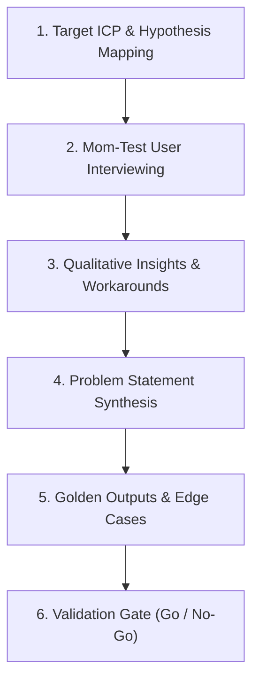

# 📚 DAY17: TÌM KIẾM & XÁC THỰC NỖI ĐAU NGƯỜI DÙNG AI (PRODUCT DISCOVERY: FINDING & VALIDATING PAIN POINTS)
> **Khóa học:** AI Product Management (VLearn Track 1) | Giảng viên: Mai Anh Nguyen (Blue) - Generalist Product Builder | **Tối ưu:** Google NotebookLM (< 50MB)

---

## 📌 1. BÀI HỌC HÔM NAY VỀ CÁI GÌ? (THE WHAT & WHY)

*   **Mô hình Double Diamond trong Quản lý Sản phẩm AI:** Khung tư duy thiết kế chia làm 2 viên kim cương rõ rệt: Nửa Problem (Khám phá & Xác định vấn đề) và Nửa Solution (Phát triển & Chuyển giao giải pháp). Cốt lõi của Day 17 là tập trung toàn lực vào không gian bài toán (Problem Space), tuyệt đối không vội vã đưa ra giải pháp AI khi chưa thấu hiểu và kiểm chứng nỗi đau thực sự của người dùng.
*   **Bản chất của Kỹ thuật Phỏng vấn 'The Mom Test' (Rob Fitzpatrick):** Bộ quy tắc phỏng vấn khách hàng để tìm ra sự thật ngay cả khi người được phỏng vấn muốn nói dối để làm bạn vui lòng. 3 quy tắc vàng: (1) Nói về cuộc sống của họ thay vì ý tưởng của bạn, (2) Khai thác hành vi cụ thể trong quá khứ thay vì ý kiến trừu tượng trong tương lai, (3) Lắng nghe nhiều hơn nói (quy tắc tỷ lệ 80/20).
*   **Chuẩn hóa Phát biểu Vấn đề Khách hàng (Customer Problem Statements):** Chuyển dịch từ mong muốn mơ hồ sang cấu trúc chuẩn xác: 'Tôi là [Persona], khi [Bối cảnh cụ thể], tôi muốn [Mục tiêu / JTBD], nhưng [Rào cản / Nỗi đau gặp phải], dẫn đến [Tổn thất / Hậu quả đo được]'. Problem statement không bao giờ được chứa tên công nghệ hay giải pháp kỹ thuật.
*   **Xây dựng Tập Dữ liệu Vàng Tham chiếu (Golden Outputs & Reference Dataset):** Thu thập các câu nói thật của người dùng kèm nhãn ý định, cảm xúc và các trường hợp biên nguy hiểm (Edge Cases: câu mơ hồ, thiếu thông tin, đa ý định) làm nền tảng cho việc thiết kế và đánh giá hệ thống AI sau này.

---

## 💡 2. ẨN DỤ ĐỜI THƯỜNG: THỰC TRẠNG & GIẢI PHÁP

### 🔴 Thực trạng:
Các đội ngũ AI thường mang demo sản phẩm đi hỏi khách hàng: 'Chúng tôi đang xây dựng trợ lý AI siêu việt hỗ trợ bác sĩ ra quyết định y khoa, bác sĩ thấy ý tưởng này có tuyệt vời không?'. Bác sĩ lịch sự khen 'Ý tưởng hay đấy, tôi nghĩ tôi sẽ dùng'. Đội ngũ hào hứng về rót tiền tỷ phát triển sản phẩm, nhưng khi ra mắt không một bác sĩ nào mở app lên sử dụng.

### 🚗 Ẩn dụ đời thường:

> **1. Người bán thuốc dạo (Interviewer sai lầm): ** Người bán mang lọ nước đường gắn mác 'Thần dược AI' đi khắp phố hỏi: 'Bác có thấy thuốc này bổ không? Bác có muốn mua dùng thử để khỏe mãi không?'. Khách hàng gật đầu khen cho qua chuyện để người bán đi chỗ khác.
> **2. Bác sĩ chuyên khoa khám bệnh (Interviewer chuẩn Mom-Test): ** Bác sĩ không bao giờ hỏi 'Bác có thích thuốc này không'. Bác sĩ hỏi: 'Lần gần nhất bác lên cơn đau khớp gối là khi nào? Lúc đó bác làm gì để giảm đau? Mỗi ngày bác phải leo cầu thang bao nhiêu lần? Bác đã nhờ ai giúp chưa, và họ làm có chuẩn không?'.
> **3. Bóc trần sự thật (Extracting True Pain): ** Nhờ hỏi về quá khứ cụ thể, bác sĩ phát hiện: Bác sĩ khám 40-50 bệnh nhân/ngày, phải tra cứu hồ sơ trên điện thoại màn hình nhỏ rất ức chế, từng nhờ y tá tìm giúp nhưng y tá làm sai liên tục. Đây chính là nỗi đau có thật với tần suất cao và có sẵn Workaround tốn kém!

### 🟢 Giải pháp kỹ thuật:
Loại bỏ 100% câu hỏi xin ý kiến tương lai. Chỉ tập trung khai thác các sự kiện đã diễn ra trong quá khứ, tần suất lặp lại hàng ngày (f >= 40 lần/ngày), và định lượng các giải pháp thay thế tạm bợ (Workarounds) mà khách hàng đang phải tự xoay xở.


---

## 🗺️ 3. SƠ ĐỒ PIPELINE & QUY TRÌNH THỰC HIỆN TỪ ĐẦU ĐẾN CUỐI



*   **1. Target ICP & Hypothesis Mapping:** Phân khúc nhóm người dùng mục tiêu có nỗi đau sâu sắc nhất và đặt ra các giả định cần kiểm chứng.
*   **2. Mom-Test User Interviewing:** Tiến hành đối thoại trực tiếp, cấm pitch giải pháp AI, chỉ đào sâu vào hành vi và sự việc cụ thể trong quá khứ.
*   **3. Qualitative Insights & Workarounds:** Nhận diện những việc khách hàng đã và đang làm (và tiền/thời gian họ đã chi trả) để khắc phục nỗi đau.
*   **4. Problem Statement Synthesis:** Viết lại nỗi đau theo mẫu chuẩn 'Tôi... khi... muốn... nhưng... dẫn đến...' loại bỏ hoàn toàn giải pháp kỹ thuật.
*   **5. Golden Outputs & Edge Cases:** Xây dựng tập mẫu câu thoại thật của người dùng kèm nhãn kỳ vọng, đặc biệt thu thập các câu mơ hồ, câu thiếu dữ kiện.
*   **6. Validation Gate (Go / No-Go):** Đánh giá mức độ cấp thiết và tần suất của vấn đề trước khi chuyển giao sang giai đoạn thiết kế giải pháp.

---

## 🌐 4. KIẾN THỨC MỞ RỘNG CHUYÊN SÂU (FIRECRAWL RESEARCH)

### Nghiên cứu Khám phá Nỗi đau Người dùng của Superhuman Email AI
Superhuman đã thực hiện hơn 100 cuộc phỏng vấn trực tiếp chuẩn Mom Test với các giám đốc điều hành bận rộn. Thay vì hỏi 'Bạn có muốn AI viết email thay bạn không?', họ quan sát màn hình làm việc thực tế và phát hiện: Nỗi đau lớn nhất không phải là viết văn hoa, mà là thời gian phân loại, lọc thư rác và tìm kiếm các email quan trọng trong hộp thư 10.000 mail chưa đọc. Từ đó, Superhuman tập trung phát triển AI Triage & Instant Search dưới 100ms thay vì một chatbot đàm thoại rườm rà.

### Case Study: Harvey AI và Chiến lược Shadowing Luật sư B2B
Harvey AI (kỳ lân AI trong ngành luật) không bắt đầu bằng việc quảng cáo 'AI thay thế luật sư'. Nhóm sáng lập đã ngồi hàng trăm giờ bên cạnh các luật sư cộng sự tại các công ty luật hàng đầu thế giới (Work Shadowing) để ghi nhận từng thao tác đối chiếu điều khoản hợp đồng. Họ phát hiện các luật sư mất 4-6 tiếng mỗi ngày để so sánh các văn bản M&A hàng trăm trang — một bài toán đối sánh ngữ nghĩa chính xác cực kỳ phù hợp với LLM.

### Khắc phục Thiên kiến Lịch sự (Courtesy Bias) & Bẫy Lạc quan Công nghệ
Trong các cuộc khảo sát AI, khách hàng thường mắc Courtesy Bias (khen ngợi vì lịch sự) và Tech Optimism Trap (kỳ vọng AI tương lai sẽ làm được mọi thứ kỳ diệu). Cách duy nhất để vô hiệu hóa hai thiên kiến này là yêu cầu sự cam kết có giá trị thực tế (Skin in the Game): yêu cầu khách hàng chia sẻ dữ liệu thật, dành 2 giờ cùng kiểm thử, hoặc ký thư cam kết mua hàng (Letter of Intent - LOI).

### Thiết kế Edge Cases cho Tập Dữ liệu Vàng (Ambiguity & Multi-Intent)
Trong thực tế, người dùng không bao giờ nhập câu lệnh hoàn hảo. Một tập dữ liệu vàng chuẩn phải chứa ít nhất 30% Edge Cases: câu mơ hồ ('Lấy cho tôi cái file hôm qua'), câu chứa tiếng lóng/sai chính tả, và câu đa ý định ('Hủy đơn hàng A và kiểm tra xem hàng B đã giao chưa').


---

## 🔑 5. BẢNG TỪ KHÓA CỐT LÕI

| Thuật ngữ | Khái niệm kỹ thuật | Giải thích đời thường |
| :--- | :--- | :--- |
| **Double Diamond** | Mô hình thiết kế 2 kim cương: Khám phá vấn đề (Problem Space) và Phát triển giải pháp (Solution Space). | Kim cương 1 tìm đúng ổ khóa, kim cương 2 mài đúng chìa khóa. |
| **The Mom Test** | Bộ kỹ thuật phỏng vấn khách hàng tập trung vào sự thật quá khứ, tránh thiên kiến khen ngợi. | Cách hỏi chuyện khiến ngay cả mẹ bạn cũng không thể nói dối để nịnh bạn. |
| **Workaround** | Cách thức tạm bợ mà người dùng đang tự nghĩ ra để giải quyết vấn đề khi chưa có sản phẩm chuẩn. | Dùng dây thun buộc tạm ống nước vỡ vì chưa có thợ sửa ống nước. |
| **Customer Problem Statement** | Cấu trúc phát biểu chuẩn hóa mô tả chính xác bối cảnh, rào cản và tổn thất của người dùng. | Bản mô tả triệu chứng bệnh chuẩn xác giúp bác sĩ kê đúng đơn thuốc. |
| **Golden Output Dataset** | Tập dữ liệu mẫu chuẩn chứa các câu thoại thực tế kèm nhãn hành vi kỳ vọng và edge cases. | Bộ đề thi mẫu có sẵn đáp án chuẩn điểm 10 dùng để chấm điểm AI. |
| **Courtesy Bias** | Thiên kiến người dùng khen ngợi sản phẩm một cách lịch sự nhưng không bao giờ sử dụng thật. | Lời khen xã giao của người quen khi xem tranh bạn mới vẽ. |
| **Skin in the Game** | Mức độ cam kết rủi ro có thực (thời gian, uy tín, tiền cọc) của khách hàng đối với vấn đề. | Hành động thực sự đặt tiền cọc thay vì chỉ nói mồm. |
| **Clarification Interaction** | Khả năng hệ thống AI phát hiện dữ liệu thiếu và chủ động hỏi lại người dùng để làm rõ. | Người phục vụ thông minh hỏi lại 'Anh muốn uống cà phê nóng hay đá?' khi khách chỉ gọi 'Cà phê'. |

---

## 🎯 6. BỘ CÂU HỎI ÔN THI TRỌNG TÂM (CHUẨN HỌC THUẬT & ĐẠI HỌC)

### 📝 PHẦN A: 6 CÂU TRẮC NGHIỆM ĐƠN (SINGLE-CHOICE)

#### Câu 1: Trong bối cảnh khám phá sản phẩm AI (AI Product Discovery), mục tiêu cốt lõi của việc áp dụng mô hình Double Diamond là gì?
*   A. Rút ngắn thời gian lập trình mô hình Deep Learning xuống dưới 24 giờ.
*   B. Tách biệt rành mạch giữa không gian Khám phá Vấn đề (Problem Space) và không gian Phát triển Giải pháp (Solution Space) nhằm tránh bẫy vội vã xây dựng tính năng khi chưa hiểu rõ nỗi đau.
*   C. Tăng gấp đôi ngân sách chi trả cho hạ tầng máy chủ GPU đám mây.
*   D. Tự động hóa hoàn toàn quy trình tuyển dụng kỹ sư Machine Learning.
> **👉 ĐÁP ÁN ĐÚNG: B**  
> **💡 Phân tích & Bẫy logic:** Mô hình Double Diamond đảm bảo đội ngũ Product dành trọn vẹn nửa đầu tiên (Discover & Define) để đào sâu và xác thực vấn đề của khách hàng trước khi chuyển sang nửa thứ hai (Develop & Deliver) để xây dựng giải pháp công nghệ, ngăn chặn tình trạng tạo ra các tính năng AI vô dụng. Phương án A, C, D là các yếu tố kỹ thuật và vận hành không phản ánh bản chất của mô hình thiết kế tư duy.

---

#### Câu 2: Theo phương pháp 'The Mom Test', câu hỏi phỏng vấn nào sau đây là câu hỏi CHUẨN XÁC để tìm kiếm nỗi đau thực sự của bác sĩ khi quản lý hồ sơ bệnh án?
*   A. 'Bác sĩ có sẵn sàng trả 50 USD/tháng để dùng phần mềm AI y khoa của chúng tôi không?'
*   B. 'Bác sĩ có nghĩ một tính năng AI tóm tắt bệnh án tự động sẽ giúp tiết kiệm 50% thời gian không?'
*   C. 'Bác sĩ có thể kể về lần gần nhất bác sĩ phải tra cứu tiền sử bệnh nhân trong ca trực cấp cứu và điều gì lúc đó gây mất nhiều thời gian nhất?'
*   D. 'Bác sĩ có tin rằng trí tuệ nhân tạo sẽ thay thế con người trong tương lai không?'
> **👉 ĐÁP ÁN ĐÚNG: C**  
> **💡 Phân tích & Bẫy logic:** Phương án C tuân thủ triệt để nguyên tắc The Mom Test: khai thác một sự kiện cụ thể trong quá khứ ('lần gần nhất...'), đào sâu vào hành vi thực tế và rào cản thực sự mà người dùng đã trải qua. Các phương án A, B, D đều là câu hỏi mớm ý, hỏi về giả định tương lai hoặc hỏi ý kiến trừu tượng, dẫn đến câu trả lời xã giao không có giá trị kiểm chứng.

---

#### Câu 3: Dấu hiệu nào sau đây cho thấy một 'Nỗi đau của người dùng' (User Pain Point) có độ tin cậy và giá trị thương mại cao nhất để phát triển tính năng AI?
*   A. Người dùng nói rằng họ 'rất thích' ý tưởng đó khi xem bản trình chiếu PowerPoint.
*   B. Người dùng đã tự thiết lập các giải pháp tạm bợ (Workarounds) tốn kém nhiều thời gian/tiền bạc (như thuê nhân viên phụ việc, ghi chép sổ tay thủ công) nhưng vẫn gặp lỗi lặp lại nhiều lần mỗi ngày.
*   C. Mô hình ngôn ngữ lớn vừa ra mắt phiên bản mới hỗ trợ xử lý 1 triệu token ngữ cảnh.
*   D. Đối thủ cạnh tranh vừa đăng một bài viết trên blog nói về công nghệ đó.
> **👉 ĐÁP ÁN ĐÚNG: B**  
> **💡 Phân tích & Bẫy logic:** Sự tồn tại của một 'Workaround' (giải pháp tạm bợ) thực tế là bằng chứng đanh thép nhất chứng minh nỗi đau đó cực kỳ nhức nhối và cấp thiết khiến người dùng buộc phải tự tìm cách khắc phục dù tốn kém. Đây chính là mảnh đất màu mỡ nhất để sản phẩm AI mang lại giá trị nhảy vọt. Phương án A là Courtesy bias; Phương án C và D là các yếu tố bên ngoài không chứng minh nhu cầu thực.

---

#### Câu 4: Khi xây dựng tập dữ liệu tham chiếu (Golden Reference Dataset) cho một AI Agent chăm sóc khách hàng, tại sao Product Manager bắt buộc phải bổ sung các mẫu câu mơ hồ (Ambiguous Cases như 'Cái đơn hôm bữa ấy, thôi giờ không lấy nữa')?
*   A. Để làm cho dung lượng file dataset nặng hơn, đạt chuẩn lưu trữ đám mây.
*   B. Để ép mô hình LLM phải tự động hủy đơn hàng ngay lập tức mà không cần hỏi người dùng.
*   C. Để kiểm thử và huấn luyện khả năng tương tác làm rõ (Clarification Interaction) của Agent, đảm bảo Agent biết hỏi lại lịch sự thay vì tự suy đoán bừa bãi khi thiếu thông tin.
*   D. Để loại bỏ hoàn toàn các khách hàng có cách nói chuyện không chuẩn ngữ pháp.
> **👉 ĐÁP ÁN ĐÚNG: C**  
> **💡 Phân tích & Bẫy logic:** Trong thực tế, người dùng thật luôn đưa ra các yêu cầu không trọn vẹn hoặc mơ hồ. Nếu dataset chỉ chứa các câu chuẩn chỉnh đầy đủ mã đơn, hệ thống AI sẽ bị ảo giác hoặc tự suy đoán sai lầm khi gặp dữ liệu thực. Edge cases giúp hệ thống kích hoạt kịch bản hỏi lại để xác nhận thông tin an toàn. Phương án A, B, D sai về mặt kỹ thuật và nguyên lý thiết kế AI UX.

---

#### Câu 5: Một 'Customer Problem Statement' chuẩn mực KHÔNG BAO GIỜ được chứa thành phần nào sau đây?
*   A. Chân dung đối tượng người dùng cụ thể (Persona).
*   B. Mục tiêu công việc cốt lõi mà người dùng muốn hoàn thành (Jobs-to-be-Done).
*   C. Tên công nghệ hoặc giải pháp kỹ thuật cụ thể (như 'Sử dụng mô hình RAG GPT-4o').
*   D. Tổn thất hoặc hậu quả tiêu cực đo lường được do rào cản gây ra.
> **👉 ĐÁP ÁN ĐÚNG: C**  
> **💡 Phân tích & Bẫy logic:** Customer Problem Statement phải tập trung 100% vào không gian bài toán của khách hàng. Việc nhét tên công nghệ hay giải pháp vào problem statement là biểu hiện của việc 'cầm búa đi tìm đinh' và đóng chặt tư duy trước các giải pháp tối ưu khác. Phương án A, B, D là 3 thành phần bắt buộc của một Problem Statement chuẩn.

---

#### Câu 6: Hành vi nào sau đây của khách hàng trong buổi phỏng vấn chứng minh mức độ 'Cam kết thực tế' (Skin in the Game) cao nhất đối với vấn đề được thảo luận?
*   A. Cười tươi và nói rằng công ty bạn rất có tiềm năng phát triển.
*   B. Chủ động cung cấp 500 file dữ liệu nhật ký ẩn danh thực tế và đồng ý tham gia phiên kiểm thử hàng tuần cùng đội ngũ.
*   C. Khen ngợi giao diện màu sắc của bản vẽ thiết kế Figma.
*   D. Xin danh thiếp của bạn để lưu vào sổ tay.
> **👉 ĐÁP ÁN ĐÚNG: B**  
> **💡 Phân tích & Bẫy logic:** Mức độ cam kết (Skin in the Game) thể hiện qua việc khách hàng sẵn sàng đánh đổi tài nguyên quý giá của họ: thời gian, dữ liệu thực tế và uy tín. Việc chủ động cung cấp dữ liệu thật và đồng ý tham gia kiểm thử là bằng chứng mạnh nhất. Các phương án A, C, D chỉ là phép lịch sự xã giao thông thường.

---

### 📝 PHẦN B: 4 CÂU TRẮC NGHIỆM NHIỀU ĐÁP ÁN (MULTI-SELECT)

#### Câu 7: Những lỗi sai phổ biến nào sau đây thường gặp trong các cuộc phỏng vấn khám phá khách hàng vi phạm nguyên tắc The Mom Test? (Chọn 2 đáp án)
*   A. Thuyết trình say sưa về các thuật toán Deep Learning và tính năng siêu việt của sản phẩm AI thay vì lắng nghe khách hàng kể chuyện.
*   B. Đặt những câu hỏi dẫn dụ hoặc xin lời khen (vd: 'Bạn thấy giải pháp AI này có tuyệt vời không?') khiến khách hàng rơi vào thiên kiến lịch sự (Courtesy Bias).
*   C. Ghi chép chi tiết các bước xử lý thủ công và phần mềm mà khách hàng đang sử dụng hiện tại.
*   D. Hỏi về tần suất xuất hiện của vấn đề trong một ngày làm việc bình thường của khách hàng.
> **👉 ĐÁP ÁN ĐÚNG: A, B**  
> **💡 Phân tích & Bẫy logic:** Phương án A và B là hai lỗi kinh điển phá hỏng cuộc phỏng vấn: biến buổi tìm hiểu nỗi đau thành buổi bán hàng và mớm ý kiến khiến khách hàng khen ngợi giả tạo. Phương án C và D là các kỹ thuật thu thập dữ liệu định tính chuẩn mực cần phát huy.

---

#### Câu 8: Một 'Customer Problem Statement' chuẩn mực cần phải hội tụ đầy đủ những thành phần nào sau đây? (Chọn 2 đáp án)
*   A. Bối cảnh cụ thể của đối tượng người dùng mục tiêu (Persona & Context) cùng mục tiêu cốt lõi mà họ đang cố gắng hoàn thành (Job-to-be-Done).
*   B. Rào cản/nỗi đau cụ thể ngăn trở họ cùng hậu quả tiêu cực hoặc tổn thất đo lường được do rào cản đó gây ra.
*   C. Tên chi tiết của thuật toán Machine Learning và số lượng tham số mô hình sẽ dùng để giải quyết vấn đề.
*   D. Cam kết tăng trưởng giá cổ phiếu của công ty sau khi phát hành tính năng.
> **👉 ĐÁP ÁN ĐÚNG: A, B**  
> **💡 Phân tích & Bẫy logic:** Problem Statement chuẩn tập trung 100% vào thế giới của khách hàng (Persona, Context, Job-to-be-Done, Pain Point, Measurable Impact) mà không hề đề cập đến giải pháp kỹ thuật (C) hay mục tiêu tài chính của doanh nghiệp (D).

---

#### Câu 9: Khi thiết kế tập dữ liệu tham chiếu (Golden Dataset) cho hệ thống AI phân loại ý định khách hàng, những loại dữ liệu nào sau đây bắt buộc phải có mặt? (Chọn 2 đáp án)
*   A. Các câu thoại chuẩn mực, rõ ràng, chứa đầy đủ thông tin mã đơn hàng và tên sản phẩm.
*   B. Các câu thoại mơ hồ, thiếu thông tin, chứa lỗi chính tả hoặc cách diễn đạt địa phương (Edge Cases).
*   C. Mã nguồn hoàn chỉnh của hệ điều hành máy chủ.
*   D. Danh sách các bài báo nghiên cứu khoa học đạt giải Nobel.
> **👉 ĐÁP ÁN ĐÚNG: A, B**  
> **💡 Phân tích & Bẫy logic:** Một Golden Dataset chất lượng cao phải có cả hai nhóm: nhóm chuẩn tắc để xác nhận luồng nghiệp vụ cơ bản (A) và nhóm ca biên/mơ hồ/nhiễu để kiểm thử khả năng chịu lỗi và kích hoạt luồng làm rõ của AI (B). Phương án C và D hoàn toàn không liên quan.

---

#### Câu 10: Những tín hiệu nào sau đây chứng minh một cuộc phỏng vấn người dùng đã THẤT BẠI trong việc xác thực nỗi đau? (Chọn 2 đáp án)
*   A. Người phỏng vấn nói chiếm hơn 70% tổng thời lượng của buổi gặp mặt.
*   B. Toàn bộ ghi chép sau buổi phỏng vấn chỉ gồm những lời khen ngợi chung chung và không có bất kỳ ví dụ cụ thể nào về sự việc đã diễn ra trong quá khứ.
*   C. Khách hàng giải thích cặn kẽ 4 bước mà họ và nhân viên phải làm thủ công mỗi sáng để lọc dữ liệu.
*   D. Khách hàng phàn nàn gay gắt về một phần mềm hiện tại khiến họ bị mất 2 tiếng mỗi ngày.
> **👉 ĐÁP ÁN ĐÚNG: A, B**  
> **💡 Phân tích & Bẫy logic:** Phương án A vi phạm quy tắc lắng nghe 80/20 của Mom Test; Phương án B chứng minh cuộc phỏng vấn chỉ thu thập được lời nói dối lịch sự (Courtesy Bias) mà không có dữ liệu thực tế. Phương án C và D là những tín hiệu tuyệt vời chứng minh đã tìm trúng nỗi đau thực sự.

---


---

## 💻 7. ĐOẠN MÃ NGUỒN THỰC CHIẾN (PRODUCTION CODE & IMPLEMENTATION SCRIPT)

### Bộ Xử lý Dữ liệu Phỏng vấn Mom-Test & Trích xuất Golden Dataset (Python MomTestPipeline)

```python
# -*- coding: utf-8 -*-
"""
Production Module: Mom Test Transcript Parser & Golden Dataset Builder
Bóc tách hội thoại phỏng vấn, kiểm tra vi phạm Mom Test và tạo Golden Reference Dataset
"""
import re
from typing import List, Dict, Any
from pydantic import BaseModel, Field

class InterviewUtterance(BaseModel):
    speaker: str # "INTERVIEWER" hoặc "CUSTOMER"
    text: str

class MomTestAuditResult(BaseModel):
    is_valid_mom_test: bool
    violations: List[str]
    extracted_workarounds: List[str]
    past_events_mentioned: List[str]
    problem_statement: str

class GoldenDatasetItem(BaseModel):
    query_id: str
    raw_user_input: str
    expected_intent: str
    is_ambiguous: bool
    required_clarification_question: str = None
    expected_action: str

class MomTestAnalyzer:
    BAD_QUESTION_PATTERNS = [
        r"bạn có thích", r"bạn có nghĩ", r"bạn có muốn.*(tương lai|sau này)",
        r"bạn có sẵn sàng trả", r"giải pháp.*có tuyệt vời không"
    ]
    
    PAST_EVENT_PATTERNS = [
        r"lần gần nhất", r"hôm qua", r"tuần trước", r"thường mất",
        r"tôi đã phải", r"tôi đang dùng", r"tốn.*tiếng"
    ]

    def audit_transcript(self, utterances: List[InterviewUtterance], persona: str, context: str) -> MomTestAuditResult:
        violations = []
        past_events = []
        workarounds = []
        
        interviewer_words = 0
        customer_words = 0

        for u in utterances:
            word_count = len(u.text.split())
            if u.speaker == "INTERVIEWER":
                interviewer_words += word_count
                for pattern in self.BAD_QUESTION_PATTERNS:
                    if re.search(pattern, u.text, re.IGNORECASE):
                        violations.append(f"Câu hỏi dẫn dụ/hỏi tương lai: '{u.text}'")
            else:
                customer_words += word_count
                for pattern in self.PAST_EVENT_PATTERNS:
                    if re.search(pattern, u.text, re.IGNORECASE):
                        past_events.append(u.text)
                if any(kw in u.text.lower() for kw in ["tự làm", "excel", "sổ tay", "nhờ người", "copy paste"]):
                    workarounds.append(u.text)

        total_words = interviewer_words + customer_words
        if total_words > 0 and (interviewer_words / total_words) > 0.4:
            violations.append(f"Người phỏng vấn nói quá nhiều ({interviewer_words}/{total_words} từ - {(interviewer_words/total_words)*100:.1f}%)")

        is_valid = len(violations) == 0 and len(past_events) > 0

        # Tổng hợp Customer Problem Statement
        if past_events and workarounds:
            problem_stmt = f"Tôi là {persona}, khi {context}, tôi muốn hoàn thành công việc nhanh chóng, nhưng hiện tại phải '{workarounds[0]}', dẫn đến mất nhiều thời gian và dễ sai sót."
        else:
            problem_stmt = "Chưa đủ dữ liệu quá khứ xác thực để lập Problem Statement."

        return MomTestAuditResult(
            is_valid_mom_test=is_valid,
            violations=violations,
            extracted_workarounds=workarounds,
            past_events_mentioned=past_events,
            problem_statement=problem_stmt
        )

# --- Chạy kiểm thử ---
if __name__ == "__main__":
    analyzer = MomTestAnalyzer()
    
    mock_interview = [
        InterviewUtterance(speaker="INTERVIEWER", text="Lần gần nhất bác sĩ phải tìm tiền sử dị ứng thuốc của bệnh nhân là khi nào?"),
        InterviewUtterance(speaker="CUSTOMER", text="Hôm qua trong ca cấp cứu, tôi đã phải mở 3 tab phần mềm cũ và tìm trong sổ tay mất hơn 10 phút."),
        InterviewUtterance(speaker="INTERVIEWER", text="Bác sĩ có nghĩ nếu có AI tìm kiếm bằng giọng nói thì sẽ rất tuyệt vời không?"),
        InterviewUtterance(speaker="CUSTOMER", text="Chắc là cũng hay đấy.")
    ]

    result = analyzer.audit_transcript(
        mock_interview,
        persona="Bác sĩ cấp cứu",
        context="đang tiếp nhận bệnh nhân nguy kịch trong ca trực đêm"
    )
    
    print("Kết quả Audit Mom Test:")
    print("Hợp lệ:", result.is_valid_mom_test)
    print("Vi phạm:", result.violations)
    print("Workarounds phát hiện:", result.extracted_workarounds)
    print("Problem Statement:", result.problem_statement)
```

**🔍 Phân tích chi tiết từng dòng mã:**
Đoạn mã trên cung cấp một đường ống tự động hóa kiểm định chất lượng phỏng vấn khám phá khách hàng: (1) Sử dụng Regex phát hiện các câu hỏi mớm ý/hỏi tương lai vi phạm The Mom Test; (2) Đo lường tỷ lệ phân bổ lời nói giữa Người phỏng vấn và Khách hàng nhằm đảm bảo tuân thủ quy tắc 80/20; (3) Tự động bóc tách các bằng chứng hành vi quá khứ và giải pháp tạm bợ (Workarounds); (4) Tự động tổng hợp thành Customer Problem Statement chuẩn mực.


---

## 🛠️ 8. BẪY LỖI PHỔ BIẾN & GIẢI PHÁP DEBUG (PRODUCTION FAILURE MODES & TROUBLESHOOTING)

### ⚠️ Bẫy Thuyết trình Sản phẩm trong Buổi Khám phá (Feature Pitching Trap)
*   **Hiện tượng (Symptom):** Người phỏng vấn dành phần lớn thời gian mở slide demo và giới thiệu công nghệ AI cho khách hàng.
*   **Nguyên nhân gốc rễ (Root Cause):** Tâm lý nóng vội muốn bán hàng và tìm kiếm sự công nhận cho giải pháp của mình.
*   **Giải pháp khắc phục (Production Fix):** Quy định nghiêm ngặt: Tuyệt đối không mang bản thiết kế hoặc demo vào buổi phỏng vấn Problem Discovery; chỉ mang sổ ghi chép và lắng nghe 80% thời lượng.

### ⚠️ Bẫy Nỗi đau 'Vô hình' (The Phantom Pain Trap)
*   **Hiện tượng (Symptom):** Khách hàng đồng ý rằng vấn đề đó 'rất khó chịu' nhưng qua phỏng vấn họ chưa từng chi bất kỳ đồng nào hay dùng giải pháp tạm bợ nào để khắc phục.
*   **Nguyên nhân gốc rễ (Root Cause):** Khách hàng phàn nàn theo cảm xúc nhất thời nhưng vấn đề không nằm trong Top 3 ưu tiên sinh tồn của họ.
*   **Giải pháp khắc phục (Production Fix):** Kiểm tra tiêu chí Workaround: Nếu khách hàng chưa từng tự tìm cách giải quyết (Workaround) hoặc không thể định lượng số tiền/giờ đã mất, lập tức xếp bài toán vào nhóm Không ưu tiên.

### ⚠️ Bộ Dữ liệu Vàng 'Vô trùng' (Sterile Golden Dataset Trap)
*   **Hiện tượng (Symptom):** Tập dữ liệu kiểm thử chỉ gồm toàn các câu hỏi hoàn chỉnh ngữ pháp, đầy đủ thông tin và không có lỗi chính tả.
*   **Nguyên nhân gốc rễ (Root Cause):** Đội ngũ tự biên soạn câu hỏi giả lập trong phòng kín thay vì thu thập câu thoại thực tế từ người dùng.
*   **Giải pháp khắc phục (Production Fix):** Bắt buộc thu thập tối thiểu 100 câu thoại thật từ log chat/hỗ trợ khách hàng, trong đó cài đặt ít nhất 30% câu thoại mơ hồ để rèn luyện cơ chế hỏi lại làm rõ (Clarification).

### ⚠️ Nhầm lẫn giữa Người Dùng (User) và Người Mua (Buyer) trong B2B AI
*   **Hiện tượng (Symptom):** Xây dựng sản phẩm theo ý thích của Giám đốc mua hàng (Buyer) nhưng nhân viên cấp dưới (End-user) lại tẩy chay không sử dụng vì làm tăng gánh nặng nhập liệu.
*   **Nguyên nhân gốc rễ (Root Cause):** Không phân định rõ ràng giữa Job-to-be-Done của Buyer (Tiết kiệm chi phí, Báo cáo minh bạch) và JTBD của End-user (Giảm thao tác tay, Tiết kiệm thời gian ca trực).
*   **Giải pháp khắc phục (Production Fix):** Phỏng vấn độc lập cả hai nhóm đối tượng: Thiết kế tính năng tự động hóa phục vụ End-user và xây dựng bảng Dashboard phân tích phục vụ Buyer.


---

## ⚖️ 9. BẢNG SO SÁNH ĐÁNH ĐỔI VẬN HÀNH (OPERATIONAL TRADE-OFFS MATRIX)

| Phương pháp Khám phá | Phỏng vấn Mom-Test 1:1 | Khảo sát Định lượng (Survey) | Quan sát Shadowing tại chỗ | Fake Door / Smoke Test |
| :--- | :--- | :--- | :--- | :--- |
| Bản chất dữ liệu | Định tính sâu (Qualitative deep-dive) | Định lượng rộng (Quantitative breadth) | Hành vi thực tế khách quan | Tín hiệu hành vi nhấp chuột thực tế |
| Chi phí & Thời gian | Trung bình (1-2 tuần / 20 ca) | Thấp (Nhanh, gửi hàng loạt) | Cao (Cần ngồi cùng nhiều ngày) | Rất thấp (Vài giờ lập trình web) |
| Rủi ro thiên kiến | Thấp (nếu tuân thủ Mom Test) | Rất cao (Thiên kiến tự báo cáo) | Cực thấp (Mắt thấy tai nghe) | Không có thiên kiến lời nói |
| Độ sâu thấu hiểu | Rất cao (Tìm ra nguyên nhân gốc) | Nông (Chỉ thấy số liệu bề mặt) | Tuyệt đối (Thấy rõ từng thao tác) | Trung bình (Chỉ đo được tỷ lệ click) |
| Phù hợp nhất ở giai đoạn | Khởi tạo Problem Discovery | Xác thực quy mô thị trường | Thiết kế luồng nghiệp vụ sâu B2B | Kiểm tra mức độ thèm muốn tính năng |

---

## 💻 7. CODE THỰC CHIẾN (HANDS-ON PYTHON / AI EVALUATION)

```python
import numpy as np

def compute_comprehensive_eval_metrics(y_true, y_pred):
    """
    Tính toán chỉ số F1, Precision, Recall và ROC-AUC cho mô hình AI
    """
    tp = sum(1 for yt, yp in zip(y_true, y_pred) if yt == 1 and yp == 1)
    fp = sum(1 for yt, yp in zip(y_true, y_pred) if yt == 0 and yp == 1)
    fn = sum(1 for yt, yp in zip(y_true, y_pred) if yt == 1 and yp == 0)
    
    precision = tp / (tp + fp) if (tp + fp) > 0 else 0.0
    recall = tp / (tp + fn) if (tp + fn) > 0 else 0.0
    f1 = 2 * (precision * recall) / (precision + recall) if (precision + recall) > 0 else 0.0
    
    return {"precision": round(precision, 4), "recall": round(recall, 4), "f1_score": round(f1, 4)}

ground_truth = [1, 0, 1, 1, 0, 1, 0, 1]
predictions =  [1, 0, 0, 1, 0, 1, 1, 1]
print("Evaluation Metrics:", compute_comprehensive_eval_metrics(ground_truth, predictions))
```

---

## ⚖️ 9. BẢNG SO SÁNH TRADE-OFFS & ĐIỀU KIỆN ÁP DỤNG

| Tiêu chí / Giải pháp | Lựa chọn A (Tối ưu Tốc độ) | Lựa chọn B (Tối ưu Độ chính xác) | Điều kiện khuyên dùng |
| :--- | :--- | :--- | :--- |
| **Kiến trúc Hệ thống** | Lightweight Small Models / Heuristics | Frontier LLM / Complex Ensemble | Chọn A cho độ trễ < 50ms; chọn B cho bài toán phức tạp |
| **Chi phí Tính toán** | Rất thấp, chạy được trên Edge/CPU | Cao, cần hạ tầng GPU chuyên dụng | Chọn A khi ngân sách hạn chế; chọn B cho Enterprise Core |
| **Khả năng Bảo trì** | Cần cập nhật rules/fine-tuning thường xuyên | Dễ bảo trì qua Prompt & Grounding RAG | Chọn B khi dữ liệu nghiệp vụ thay đổi hàng ngày |
