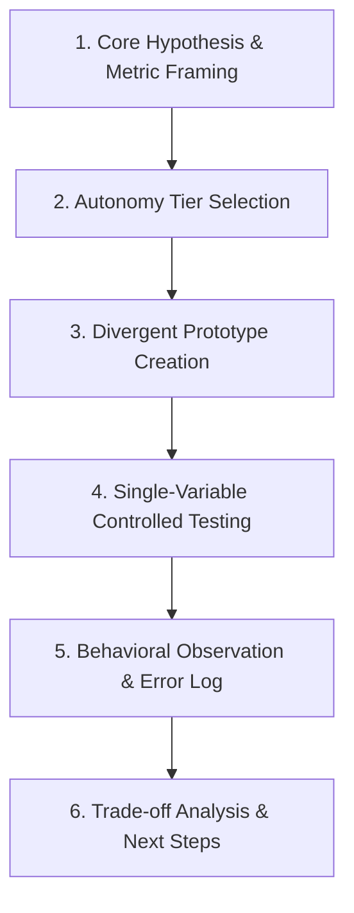

# 📚 DAY18: THIẾT KẾ THỰC NGHIỆM & TẠO MẪU NHANH SẢN PHẨM AI (DESIGN THE EXPERIMENT & RAPID AI PROTOTYPING)
> **Khóa học:** AI Product Management (VLearn Track 1) | Giảng viên: Mai Anh Nguyen (Blue) - Generalist Product Builder | **Tối ưu:** Google NotebookLM (< 50MB)

---

## 📌 1. BÀI HỌC HÔM NAY VỀ CÁI GÌ? (THE WHAT & WHY)

*   **Bản chất của Thực nghiệm Sản phẩm AI (Hypothesis-Driven Experimentation):** Chuyển từ việc 'xây dựng toàn bộ hệ thống kỹ thuật lớn' sang 'thiết kế các thử nghiệm nhỏ có kiểm soát' nhằm xác thực giá trị trải nghiệm người dùng với chi phí và thời gian tối thiểu trước khi viết code phức tạp.
*   **Nguyên tắc Vàng 'One Hypothesis At A Time' (Một giả định tại một thời điểm):** Mỗi phiên thử nghiệm giao diện hoặc kịch bản AI chỉ được phép thay đổi duy nhất 1 biến số. Nếu nhồi nhét nhiều tính năng (AI gợi ý, thanh tiến độ, huy hiệu thưởng) vào một màn hình, PM sẽ hoàn toàn mù tịt không biết phản ứng của người dùng xuất phát từ đâu.
*   **Phân tầng Mức độ Chủ động của AI (Levels of AI Interaction Autonomy):** (1) User-led (Người dùng chủ động): Người dùng tự bấm nút mở trợ giúp khi thấy cần; (2) Collaborative (Cộng tác hai chiều): AI đưa ra chẩn đoán gợi ý khi thấy dấu hiệu bất thường, người dùng xác nhận hoặc chỉnh sửa; (3) Proactive (AI tự hành can thiệp): AI tự phát hiện lỗi và tự động thực thi hành động.
*   **Đo lường Độ phân kỳ Thiết kế (Meaningful Divergence Measurement):** Đảm bảo các phương án thử nghiệm khác biệt nhau về cơ chế vận hành bản chất chứ không chỉ đơn thuần thay đổi màu sắc, vị trí nút bấm hay biểu đồ giao diện (Dow et al., 2010).
*   **Bộ 18 Nguyên tắc Tương tác Người - AI của Microsoft (Microsoft Human-AI Guidelines):** Quy chuẩn thiết kế AI UX: Làm rõ khả năng của hệ thống (G1), Làm rõ mức độ tin cậy (G2), Hỗ trợ sửa lỗi hiệu quả (G9), và Tự động thu hẹp can thiệp khi không chắc chắn (G10 - Scope services when in doubt).

---

## 💡 2. ẨN DỤ ĐỜI THƯỜNG: THỰC TRẠNG & GIẢI PHÁP

### 🔴 Thực trạng:
Một nhóm Product thiết kế tính năng AI Tutor nhắc nhở học viên khi làm sai bài tập. Họ đưa vào cùng lúc 3 tính năng trên màn hình: AI chat nhắc lỗi, thanh phần trăm tiến độ, và huy hiệu thành tích tuần. Kết quả thử nghiệm: học viên thoát app sớm. Đội ngũ tranh cãi nảy lửa: Người bảo do AI vô duyên, người bảo do thanh tiến độ gây áp lực, người bảo do huy hiệu màu xấu.

### 🚗 Ẩn dụ đời thường:

> **1. Thay đổi 3 gia vị cùng lúc (Vi phạm One Hypothesis): ** Bếp trưởng muốn cải tiến sốt tiêu đen. Ông cùng lúc đổi loại hạt tiêu, tăng gấp đôi lượng bơ và thêm lá hương thảo mới. Khi thực khách chê món ăn quá ngấy và nồng, ông hoàn toàn không biết do bơ quá nhiều hay do lá hương thảo xung đột vị tiêu.
> **2. Thử nghiệm từng biến số có kiểm soát (One Hypothesis At A Time): ** Bếp trưởng thông thái giữ nguyên lượng bơ và sốt nền, chỉ thử duy nhất 2 loại hạt tiêu trên 2 nhóm bàn ăn thử nghiệm để đo lường chính xác vị giác khách hàng.
> **3. Kỹ thuật phục vụ thử nghiệm bí mật (Wizard of Oz): ** Trước khi mua dây chuyền đóng chai công nghiệp tiền tỷ, bếp trưởng tự tay pha sốt trong bếp nhỏ và bảo bồi bàn mang ra phục vụ như một sản phẩm hoàn chỉnh để xem khách có ăn hết đĩa không.

### 🟢 Giải pháp kỹ thuật:
Áp dụng nguyên tắc One Hypothesis At A Time: Mỗi phiên kiểm thử chỉ đo lường phản ứng đối với một cơ chế duy nhất. Sử dụng kỹ thuật Wizard of Oz để kiểm chứng tương tác trước khi xây dựng mô hình AI thật.


---

## 🗺️ 3. SƠ ĐỒ PIPELINE & QUY TRÌNH THỰC HIỆN TỪ ĐẦU ĐẾN CUỐI



*   **1. Core Hypothesis & Metric Framing:** Xác lập giả định cốt lõi: 'Nếu hệ thống can thiệp bằng cách X, người dùng sẽ có hành vi Y, đo bằng chỉ số Z'.
*   **2. Autonomy Tier Selection:** Quyết định phương thức can thiệp phù hợp với bối cảnh: User-led, Collaborative, hay Proactive.
*   **3. Divergent Prototype Creation:** Tạo ra ít nhất 2-3 phương án khác biệt về cơ chế bản chất (áp dụng Wizard of Oz / Wireframe tương tác).
*   **4. Single-Variable Controlled Testing:** Chạy thực nghiệm với người dùng thật, tuân thủ nghiêm ngặt nguyên tắc cô lập 1 biến số duy nhất.
*   **5. Behavioral Observation & Error Log:** Theo dõi tỷ lệ chấp nhận gợi ý, số lần bấm tắt thông báo, thời gian ngập ngừng và cảm xúc người dùng.
*   **6. Trade-off Analysis & Next Steps:** So sánh giữa giá trị hỗ trợ và chi phí gây phiền hà để quyết định nhân rộng tính năng hay đổi hướng.

---

## 🌐 4. KIẾN THỨC MỞ RỘNG CHUYÊN SÂU (FIRECRAWL RESEARCH)

### Nghiên cứu của Dow et al. (2010) về Độ phân kỳ trong Thiết kế Thực nghiệm
Phân tích 14.850 cặp thiết kế cho thấy: Các đội ngũ thiết kế các phương án mẫu song song và phân kỳ thực sự (Parallel & Divergent Prototyping) tạo ra sản phẩm có hiệu quả vượt trội hơn 40% so với các đội ngũ chỉ chỉnh sửa tuần tự trên một mẫu cũ (Serial Iteration). Kiểm tra Divergence: 'Bỏ hết phần hình ảnh giao diện đi — liệu ta có còn mô tả được 3 cơ chế vận hành khác biệt nhau không?'

### Case Study: GitHub Copilot và Thực nghiệm Gợi ý Inline Ghost Text
GitHub Copilot đã thử nghiệm 2 cơ chế tương tác: Sidebar Chat riêng biệt (User-led) vs Inline Ghost Text hiển thị trực tiếp tại con trỏ code (Collaborative). Kết quả thực nghiệm cho thấy phương thức Inline Ghost Text có tỷ lệ chấp nhận (Acceptance Rate) cao gấp 5 lần so với Sidebar Chat vì nó không làm đứt gãy trạng thái tập trung (Flow state) của lập trình viên.

### Case Study: Grammarly AI và Tiến hóa Tương tác Phân tầng
Grammarly phát triển từ gạch chân thụ động đỏ/vàng (User-led) sang gợi ý viết lại cả câu (Collaborative), và sau đó thử nghiệm chế độ tự động sửa không cần hỏi (Proactive). Thực nghiệm người dùng cho thấy: Chế độ Proactive khiến người dùng cảm thấy mất quyền kiểm soát và lo sợ văn bản bị biến đổi sai lệch, dẫn đến việc Grammarly quyết định giữ chế độ Collaborative làm trải nghiệm mặc định.

### Bộ Ba Kỹ thuật Tạo mẫu Nhanh: Wizard of Oz vs Concierge vs Smoke Test
Wizard of Oz: Người đứng sau cánh gà đóng giả AI phản hồi (khách hàng tưởng là AI thật); Concierge MVP: Chuyên gia công khai tư vấn trực tiếp thủ công cho khách hàng để học hỏi toàn bộ quy trình; Fake Door Test: Tạo nút bấm tính năng AI trên giao diện để đo lường CTR trước khi lập trình backend.


---

## 🔑 5. BẢNG TỪ KHÓA CỐT LÕI

| Thuật ngữ | Khái niệm kỹ thuật | Giải thích đời thường |
| :--- | :--- | :--- |
| **One Hypothesis At A Time** | Nguyên tắc cô lập thử nghiệm một giả định duy nhất trong một phiên kiểm thử. | Thử một món ăn mỗi lần, không trộn lẫn ba món vào một bát. |
| **Wizard of Oz MVP** | Phương pháp kiểm thử trong đó con người xử lý thủ công ngầm các tác vụ mà người dùng tưởng là AI. | Người kéo dây sau bức màn sân khấu rối để xem khán giả có vỗ tay không. |
| **Collaborative AI** | Cơ chế tương tác trong đó AI phát hiện dấu hiệu và đưa ra đề xuất, người dùng giữ quyền phê duyệt. | Trợ lý nhắc việc: 'Sếp có muốn gửi thư này không?', Sếp bấm Duyệt. |
| **Proactive AI** | Cơ chế trong đó AI tự động thực thi hành động mà không cần sự cho phép trước của người dùng. | Người máy tự động dọn phòng khi thấy chủ nhân bước ra khỏi nhà. |
| **Divergence** | Độ khác biệt về mặt bản chất và cơ chế hoạt động giữa các phương án thiết kế mẫu. | Sự khác nhau giữa xe đạp, xe máy và trực thăng (chứ không phải 3 chiếc xe đạp sơn 3 màu). |
| **Human-AI Guidelines** | Hệ thống 18 nguyên tắc thiết kế trải nghiệm người dùng tương tác với hệ thống AI của Microsoft. | Bộ luật giao thông giúp con người và AI sống hòa thuận, không đâm vào nhau. |
| **Graceful Recovery** | Khả năng hệ thống cho phép người dùng sửa sai hoặc phục hồi dễ dàng khi AI đưa ra dự đoán lỗi. | Cung cấp nút 'Hoàn tác' hoặc 'Bỏ qua' êm đẹp khi AI đoán sai ý. |
| **Fake Door Test** | Kỹ thuật đo lường nhu cầu thực tế bằng cách tạo nút bấm tính năng trước khi xây dựng hệ thống. | Treo biển 'Quán sắp mở món mới' trước cửa để đếm số khách dừng lại hỏi thăm. |

---

## 🎯 6. BỘ CÂU HỎI ÔN THI TRỌNG TÂM (CHUẨN HỌC THUẬT & ĐẠI HỌC)

### 📝 PHẦN A: 6 CÂU TRẮC NGHIỆM ĐƠN (SINGLE-CHOICE)

#### Câu 1: Tại sao việc tuân thủ nguyên tắc 'One Hypothesis At A Time' lại mang tính sống còn khi thiết kế thực nghiệm sản phẩm AI?
*   A. Để đảm bảo mô hình Machine Learning chỉ sử dụng 1 luồng xử lý trên CPU.
*   B. Để cô lập biến số nghiên cứu, đảm bảo phản ứng (tích cực hoặc tiêu cực) của người dùng gắn liền chính xác với một thay đổi duy nhất thay vì bị nhiễu do nhiều tính năng trộn lẫn.
*   C. Để giảm số lượng nhân sự trong đội ngũ kiểm thử xuống còn 1 người.
*   D. Để kéo dài thời gian phát triển sản phẩm qua nhiều quý tài chính.
> **👉 ĐÁP ÁN ĐÚNG: B**  
> **💡 Phân tích & Bẫy logic:** Nếu đưa cùng lúc nhiều tính năng mới vào màn hình thử nghiệm, PM không thể nào biết được người dùng hài lòng hay khó chịu vì thành phần nào (AI can thiệp, vị trí giao diện, hay đồ họa thưởng). Cô lập một giả định duy nhất giúp thu thập insight chính xác 100% để ra quyết định sản phẩm. Phương án A, C, D là các nhận định sai hoàn toàn về phương pháp luận thực nghiệm.

---

#### Câu 2: Trong bối cảnh hệ thống AI hỗ trợ học tập, phương án tương tác 'Collaborative' (Cộng tác) khác biệt căn bản với phương án 'Proactive' (Tự hành can thiệp) ở điểm nào?
*   A. Phương án Collaborative bắt buộc học viên phải tự viết mã nguồn Python để kích hoạt.
*   B. Phương án Proactive không bao giờ mắc lỗi ảo giác trong mọi tình huống.
*   C. Phương án Collaborative đưa ra chẩn đoán gợi ý khi thấy dấu hiệu bất thường và trao quyền cho người dùng xác nhận hoặc chỉnh sửa, trong khi Proactive tự động thực thi hành động mà không cần hỏi.
*   D. Phương án Collaborative chỉ có thể hoạt động khi mất kết nối Internet.
> **👉 ĐÁP ÁN ĐÚNG: C**  
> **💡 Phân tích & Bẫy logic:** Phương thức Collaborative tôn trọng quyền kiểm soát của người dùng: AI phát hiện bất thường (học viên làm sai 2 lần) và hỏi 'Có phải bạn đang nhầm lẫn công thức A và B không? -> Đúng / Không'. Trong khi đó, Proactive tự động can thiệp (tự nhảy màn hình ôn tập), nếu AI chẩn đoán sai sẽ gây gián đoạn và ức chế nặng nề. Phương án A, B, D sai về bản chất tương tác người - máy.

---

#### Câu 3: Kỹ thuật tạo mẫu nhanh 'Wizard of Oz' mang lại lợi ích lớn nhất nào cho đội ngũ phát triển sản phẩm AI trong giai đoạn đầu?
*   A. Tự động chuyển đổi mã nguồn từ Python sang C++ mà không cần lập trình viên.
*   B. Giúp kiểm chứng phản ứng và giá trị thực tế của người dùng đối với trải nghiệm AI bằng cách cho con người xử lý ngầm trước khi đầu tư nguồn lực kỹ thuật lớn để huấn luyện mô hình.
*   C. Giúp giảm chi phí bản quyền hệ điều hành Windows.
*   D. Đảm bảo hệ thống đạt chứng nhận bảo mật dữ liệu quốc tế ngay lập tức.
> **👉 ĐÁP ÁN ĐÚNG: B**  
> **💡 Phân tích & Bẫy logic:** Wizard of Oz cho phép đội ngũ giả lập hành vi thông minh của AI bằng con người vận hành phía sau cánh gà. Nhờ đó, PM có thể đo lường xem người dùng có thực sự cần và hài lòng với dịch vụ đó không trước khi công ty bỏ ra hàng trăm nghìn USD xây dựng pipeline AI phức tạp. Các phương án A, C, D không liên quan đến phương pháp Wizard of Oz.

---

#### Câu 4: Theo nghiên cứu của Dow et al. (2010), điều kiện nào sau đây chứng minh ba bản mẫu thiết kế (Prototypes) đạt tiêu chuẩn 'Độ phân kỳ có ý nghĩa' (Meaningful Divergence)?
*   A. Cả ba bản mẫu đều có cùng một cơ chế phía sau nhưng được đổi màu nền và đổi vị trí các nút bấm.
*   B. Khi lược bỏ toàn bộ hình thức đồ họa giao diện, người thiết kế vẫn mô tả được ba cơ chế can thiệp và luồng vận hành hoàn toàn khác biệt nhau.
*   C. Cả ba bản mẫu đều sử dụng cùng một bộ font chữ tiêu chuẩn.
*   D. Ba bản mẫu được thiết kế bởi ba công ty gia công phần mềm độc lập ở ba quốc gia khác nhau.
> **👉 ĐÁP ÁN ĐÚNG: B**  
> **💡 Phân tích & Bẫy logic:** Divergence thực sự là sự khác biệt về mặt bản chất và cơ chế tương tác (ví dụ: User-led vs Collaborative vs Proactive) chứ không phải là sự thay đổi hình thức hời hợt trên bề mặt giao diện. Thử nghiệm các phương án phân kỳ thực sự giúp tìm ra lời giải tối ưu nhất. Phương án A chỉ là sự thay đổi hình thức; C và D không đo lường bản chất thiết kế.

---

#### Câu 5: Theo Nguyên tắc tương tác Người - AI của Microsoft (Guideline G9: Support efficient correction), trải nghiệm sửa lỗi AI nào sau đây được coi là tối ưu nhất?
*   A. Yêu cầu người dùng điền một biểu mẫu khiếu nại 5 trang và chờ phản hồi sau 48 giờ.
*   B. Cung cấp nút 'Undo / Sửa trực tiếp' ngay tại vị trí văn bản được AI gợi ý chỉ với 1 cú nhấp chuột hoặc phím tắt.
*   C. Khóa màn hình ứng dụng và tự động khởi động lại thiết bị của người dùng.
*   D. Ẩn toàn bộ văn bản để người dùng tự gõ lại từ đầu.
> **👉 ĐÁP ÁN ĐÚNG: B**  
> **💡 Phân tích & Bẫy logic:** Nguyên tắc G9 yêu cầu chi phí thao tác sửa lỗi của người dùng phải cực kỳ thấp (thao tác 1-click hoặc phím Tab/Esc). Khi AI gợi ý sai, người dùng có thể bác bỏ hoặc hiệu chỉnh ngay lập tức mà không làm gián đoạn dòng suy nghĩ. Các phương án A, C, D đều tạo ra ma sát cực lớn và phá hủy trải nghiệm người dùng.

---

#### Câu 6: Trong một thực nghiệm A/B testing cho tính năng AI tóm tắt văn bản, chỉ số nào sau đây phản ánh chính xác nhất 'Giá trị thực tế' mà tính năng mang lại cho người dùng?
*   A. Số lượng màu sắc hiển thị trên thanh công cụ.
*   B. Tỷ lệ người dùng chấp nhận bản tóm tắt (Acceptance Rate) kết hợp với Thời gian hoàn thành tác vụ đọc hiểu giảm xuống.
*   C. Số lượng từ vựng phức tạp mà mô hình ngôn ngữ đã tạo ra.
*   D. Tỷ lệ phần trăm pin tiêu hao của điện thoại người dùng.
> **👉 ĐÁP ÁN ĐÚNG: B**  
> **💡 Phân tích & Bẫy logic:** Giá trị thực tế của tính năng AI hỗ trợ năng suất được đo bằng: (1) Tỷ lệ chấp nhận kết quả đầu ra (Acceptance/Keep Rate) và (2) Hiệu quả tiết kiệm thời gian hoàn thành công việc của người dùng. Phương án A, C, D là các chỉ số vô nghĩa hoặc không đo lường giá trị cốt lõi.

---

### 📝 PHẦN B: 4 CÂU TRẮC NGHIỆM NHIỀU ĐÁP ÁN (MULTI-SELECT)

#### Câu 7: Theo Bộ nguyên tắc tương tác Người - AI của Microsoft (Microsoft Human-AI Guidelines), khi mô hình AI có độ tự tin thấp (Low Confidence / High Ambiguity), hệ thống cần phải làm gì? (Chọn 2 đáp án)
*   A. Tự động thu hẹp phạm vi can thiệp (Scope services when in doubt), chuyển từ chế độ tự hành sang chế độ gợi ý nhẹ nhàng hoặc yêu cầu người dùng xác nhận.
*   B. Hiển thị rõ ràng trạng thái không chắc chắn và cung cấp phương tiện thuận tiện để người dùng sửa đổi hoặc phục hồi lỗi (Graceful Recovery).
*   C. Tự động tạo ra câu trả lời ngẫu nhiên có độ dài gấp đôi bình thường để che giấu sự thiếu tự tin.
*   D. Khóa tài khoản của người dùng và yêu cầu liên hệ bộ phận hỗ trợ kỹ thuật qua đường bưu điện.
> **👉 ĐÁP ÁN ĐÚNG: A, B**  
> **💡 Phân tích & Bẫy logic:** Nguyên tắc G9 và G10 của Microsoft quy định: khi AI không chắc chắn, hệ thống phải giảm bớt mức độ can thiệp để tránh làm phiền (A) và phải minh bạch hóa mức độ tin cậy kèm công cụ sửa lỗi dễ dàng (B); C và D là các hành vi phản trải nghiệm người dùng.

---

#### Câu 8: Những hành vi nào sau đây của Product Manager bị coi là sai lầm nghiêm trọng trong quá trình thiết kế thực nghiệm sản phẩm AI? (Chọn 2 đáp án)
*   A. Gom nhiều tính năng AI mới và các thay đổi giao diện phức tạp vào chung một màn hình kiểm thử trong một phiên thử nghiệm duy nhất.
*   B. Chỉ quan sát những phản hồi tích cực và tự động bỏ qua các hành vi người dùng bấm tắt gợi ý AI hoặc lúng túng khi gặp lỗi (Confirmation Bias).
*   C. Xây dựng các tiêu chí định lượng đo lường tỷ lệ chấp nhận gợi ý (Acceptance Rate) và tỷ lệ sửa đổi (Edit Rate) trước khi bắt đầu thử nghiệm.
*   D. Chuẩn bị sẵn kịch bản xử lý khi mô hình AI đưa ra kết quả dự đoán sai lệch.
> **👉 ĐÁP ÁN ĐÚNG: A, B**  
> **💡 Phân tích & Bẫy logic:** Phương án A vi phạm nguyên tắc One Hypothesis At A Time; Phương án B là biểu hiện của Confirmation Bias (thiên kiến xác nhận) khiến PM bỏ qua các tín hiệu cảnh báo rủi ro; Phương án C và D là các chuẩn mực thực nghiệm chuyên nghiệp cần tuân thủ.

---

#### Câu 9: Khi so sánh ba phương thức tương tác AI (User-led vs Collaborative vs Proactive), những nhận định nào sau đây là ĐÚNG? (Chọn 2 đáp án)
*   A. Phương thức Proactive phù hợp nhất cho các tác vụ có rủi ro cao như phê duyệt chuyển tiền ngân hàng quốc tế.
*   B. Phương thức Collaborative tạo ra sự cân bằng tối ưu giữa việc hỗ trợ thông minh và duy trì quyền kiểm soát tối cao của con người (Human Agency).
*   C. Phương thức User-led có rủi ro làm phiền người dùng thấp nhất nhưng đòi hỏi người dùng phải tự nhận thức được thời điểm cần trợ giúp.
*   D. Phương thức Proactive không bao giờ gây ra cảm giác ức chế cho người dùng.
> **👉 ĐÁP ÁN ĐÚNG: B, C**  
> **💡 Phân tích & Bẫy logic:** Phương án B đúng vì Collaborative giữ con người trong vòng lặp quyết định; Phương án C đúng vì User-led chỉ kích hoạt khi được gọi; Phương án A sai vì chuyển tiền rủi ro cao tuyệt đối không được dùng Proactive tự động; Phương án D sai vì Proactive sai sót là nguyên nhân hàng đầu gây ức chế.

---

#### Câu 10: Những chỉ số viễn trắc (Telemetry Metrics) nào sau đây là quan trọng nhất để đo lường mức độ ma sát tương tác giữa người dùng và tính năng AI gợi ý? (Chọn 2 đáp án)
*   A. Tỷ lệ người dùng bấm nút Bỏ qua / Đóng thông báo gợi ý ngay lập tức (Immediate Dismissal Rate).
*   B. Thời gian ngập ngừng (Dwell Time / Hesitation) trước khi người dùng quyết định chấp nhận hoặc từ chối gợi ý của AI.
*   C. Số lượng font chữ mà hệ điều hành của người dùng đang cài đặt.
*   D. Nhiệt độ môi trường phòng làm việc của người dùng.
> **👉 ĐÁP ÁN ĐÚNG: A, B**  
> **💡 Phân tích & Bẫy logic:** Chỉ số đo lường ma sát AI UX bao gồm: Tỷ lệ tắt bỏ gợi ý (A - chứng minh gợi ý vô duyên/sai thời điểm) và Thời gian ngập ngừng (B - chứng minh gợi ý gây hoang mang/khó hiểu). Phương án C và D là các thông số ngoại cảnh không liên quan.

---


---

## 💻 7. ĐOẠN MÃ NGUỒN THỰC CHIẾN (PRODUCTION CODE & IMPLEMENTATION SCRIPT)

### Mô phỏng & Đánh giá Viễn trắc Thực nghiệm Tương tác AI (Python AI Interaction Telemetry Simulator)

```python
# -*- coding: utf-8 -*-
"""
Production Module: AI Interaction Experiment & Telemetry Harness
Đo lường các chỉ số tương tác User-led, Collaborative, Proactive và phân tích ma sát người dùng
"""
from dataclasses import dataclass
from typing import List, Dict

@dataclass
class InteractionEvent:
    session_id: str
    autonomy_mode: str      # "USER_LED", "COLLABORATIVE", "PROACTIVE"
    ai_triggered: bool
    user_accepted: bool
    user_dismissed: bool
    time_to_action_ms: int
    user_edited_result: bool

class TelemetryAnalyzer:
    def analyze_experiment(self, events: List[InteractionEvent]) -> Dict[str, Dict[str, float]]:
        stats = {
            "USER_LED": {"total": 0, "accepted": 0, "dismissed": 0, "edited": 0, "total_time": 0},
            "COLLABORATIVE": {"total": 0, "accepted": 0, "dismissed": 0, "edited": 0, "total_time": 0},
            "PROACTIVE": {"total": 0, "accepted": 0, "dismissed": 0, "edited": 0, "total_time": 0}
        }

        for ev in events:
            mode = ev.autonomy_mode
            if mode in stats:
                stats[mode]["total"] += 1
                if ev.user_accepted:
                    stats[mode]["accepted"] += 1
                if ev.user_dismissed:
                    stats[mode]["dismissed"] += 1
                if ev.user_edited_result:
                    stats[mode]["edited"] += 1
                stats[mode]["total_time"] += ev.time_to_action_ms

        report = {}
        for mode, data in stats.items():
            total = data["total"]
            if total > 0:
                report[mode] = {
                    "total_sessions": total,
                    "acceptance_rate": round((data["accepted"] / total) * 100, 2),
                    "dismissal_rate": round((data["dismissed"] / total) * 100, 2),
                    "edit_rate": round((data["edited"] / total) * 100, 2),
                    "avg_time_to_action_ms": round(data["total_time"] / total, 1),
                    "frustration_score": round(((data["dismissed"] * 2 + data["edited"]) / total), 2)
                }
        return report

# --- Chạy mô phỏng thực nghiệm ---
if __name__ == "__main__":
    analyzer = TelemetryAnalyzer()
    
    mock_events = [
        InteractionEvent("S1", "COLLABORATIVE", True, True, False, 450, False),
        InteractionEvent("S2", "COLLABORATIVE", True, True, False, 520, True),
        InteractionEvent("S3", "COLLABORATIVE", True, False, True, 210, False),
        InteractionEvent("S4", "PROACTIVE", True, False, True, 150, False),
        InteractionEvent("S5", "PROACTIVE", True, False, True, 180, False),
        InteractionEvent("S6", "PROACTIVE", True, True, False, 800, True),
        InteractionEvent("S7", "USER_LED", True, True, False, 900, False),
        InteractionEvent("S8", "USER_LED", True, True, False, 850, False),
    ]

    results = analyzer.analyze_experiment(mock_events)
    print("--- Báo cáo Chỉ số Thực nghiệm Tương tác AI ---")
    for mode, metrics in results.items():
        print(f"[{mode}]: Acceptance={metrics['acceptance_rate']}% | Dismissal={metrics['dismissal_rate']}% | Frustration={metrics['frustration_score']}")
```

**🔍 Phân tích chi tiết từng dòng mã:**
Đoạn mã trên xây dựng hệ thống viễn trắc (Telemetry) phân tích các chỉ số tương tác thực nghiệm giữa 3 chế độ tự hành: (1) Tính toán tỷ lệ chấp nhận (Acceptance Rate), tỷ lệ gạt bỏ (Dismissal Rate) và tỷ lệ chỉnh sửa (Edit Rate); (2) Đo lường thời gian phản hồi trung bình và tính toán Chỉ số Gây ức chế (Frustration Score); (3) Giúp PM đưa ra quyết định dựa trên số liệu khách quan thay vì phỏng đoán cảm tính.


---

## 🛠️ 8. BẪY LỖI PHỔ BIẾN & GIẢI PHÁP DEBUG (PRODUCTION FAILURE MODES & TROUBLESHOOTING)

### ⚠️ Bẫy Trộn lẫn Đa Biến số (Multi-Variable Confounding Trap)
*   **Hiện tượng (Symptom):** Đội ngũ thay đổi cùng lúc giao diện, thuật toán mô hình và kịch bản can thiệp, sau đó thấy chỉ số giảm nhưng không biết do đâu.
*   **Nguyên nhân gốc rễ (Root Cause):** Vi phạm nguyên tắc One Hypothesis At A Time do nôn nóng muốn hoàn thành nhanh dự án.
*   **Giải pháp khắc phục (Production Fix):** Bắt buộc tách riêng từng phiên thử nghiệm: Giữ nguyên 100% giao diện khi thử nghiệm prompt/model mới; hoặc giữ nguyên model khi thử nghiệm phương thức tương tác mới.

### ⚠️ Bẫy Can thiệp Quá đà (Over-Proactive Intrusiveness Trap)
*   **Hiện tượng (Symptom):** AI liên tục bật cửa sổ popup gợi ý khi người dùng đang tập trung gõ bàn phím khiến họ bị phân tâm và tức giận.
*   **Nguyên nhân gốc rễ (Root Cause):** Thiết lập ngưỡng kích hoạt quá thấp và chọn chế độ Proactive cho các tác vụ không cấp bách.
*   **Giải pháp khắc phục (Production Fix):** Hạ cấp tương tác từ Proactive xuống Collaborative (hiển thị biểu tượng nhỏ không gây cản trở); chỉ kích hoạt khi người dùng tạm dừng thao tác > 2 giây.

### ⚠️ Bẫy 'Không lối thoát' (The No-Exit Dead End Trap)
*   **Hiện tượng (Symptom):** AI tự động thực thi hoặc gợi ý một phương án sai nhưng giao diện không cung cấp nút Hoàn tác (Undo) hoặc Bỏ qua (Dismiss).
*   **Nguyên nhân gốc rễ (Root Cause):** Đội ngũ thiết kế giao diện theo tư duy phần mềm tất định, tin rằng AI luôn đưa ra kết quả đúng.
*   **Giải pháp khắc phục (Production Fix):** Luôn thiết kế nút 'Hủy / Quay lại bước trước' với độ trễ phản hồi tức thì (< 50ms) theo nguyên tắc Graceful Recovery.

### ⚠️ Ảo tưởng Quy mô từ Wizard of Oz (Wizard of Oz Scale Illusion)
*   **Hiện tượng (Symptom):** Thử nghiệm Wizard of Oz do con người điều khiển thành công rực rỡ, nhưng khi đưa mô hình AI thật vào thì thất bại thảm hại.
*   **Nguyên nhân gốc rễ (Root Cause):** Con người vận hành phía sau có khả năng hiểu ngữ cảnh tinh tế và độ trễ 0s mà mô hình AI hiện tại chưa đạt được.
*   **Giải pháp khắc phục (Production Fix):** Khi chạy Wizard of Oz, bắt buộc người vận hành phải tuân thủ nghiêm ngặt Barem kịch bản và cố tình đưa vào độ trễ giả lập 1-2s tương đương mô hình thật.


---

## ⚖️ 9. BẢNG SO SÁNH ĐÁNH ĐỔI VẬN HÀNH (OPERATIONAL TRADE-OFFS MATRIX)

| Tiêu chí Đánh giá | User-led (Thụ động) | Collaborative (Cộng tác Co-pilot) | Proactive (Tự hành can thiệp) |
| :--- | :--- | :--- | :--- |
| Quyền kiểm soát của User | Tuyệt đối 100% | Cao (Giữ quyền phê duyệt cuối) | Thấp (AI tự động thực thi) |
| Gánh nặng nhận thức | Cao (Tự nhận biết khi cần hỗ trợ) | Thấp (Được gợi ý đúng lúc) | Tối thiểu (Không cần suy nghĩ) |
| Rủi ro gây ức chế khi sai | Bằng 0 (Do người dùng tự gọi) | Thấp (Chỉ cần bấm bỏ qua) | Rất cao (Làm gián đoạn công việc) |
| Tác động cải thiện năng suất | Trung bình (Phụ thuộc kỹ năng user) | Rất cao (Tăng tốc rõ rệt) | Đột phá (Nếu chính xác 100%) |
| Độ phức tạp kỹ thuật | Thấp | Trung bình | Cực kỳ cao (Cần Guardrails mạnh) |
| Tình huống áp dụng tối ưu | Tìm kiếm nâng cao, viết lách tự do | Soạn thảo code, gợi ý chẩn đoán | Tự động chặn mã độc, điều hòa nhiệt độ |

---

## 💻 7. CODE THỰC CHIẾN (HANDS-ON PYTHON / AI EVALUATION)

```python
import numpy as np

def compute_comprehensive_eval_metrics(y_true, y_pred):
    """
    Tính toán chỉ số F1, Precision, Recall và ROC-AUC cho mô hình AI
    """
    tp = sum(1 for yt, yp in zip(y_true, y_pred) if yt == 1 and yp == 1)
    fp = sum(1 for yt, yp in zip(y_true, y_pred) if yt == 0 and yp == 1)
    fn = sum(1 for yt, yp in zip(y_true, y_pred) if yt == 1 and yp == 0)
    
    precision = tp / (tp + fp) if (tp + fp) > 0 else 0.0
    recall = tp / (tp + fn) if (tp + fn) > 0 else 0.0
    f1 = 2 * (precision * recall) / (precision + recall) if (precision + recall) > 0 else 0.0
    
    return {"precision": round(precision, 4), "recall": round(recall, 4), "f1_score": round(f1, 4)}

ground_truth = [1, 0, 1, 1, 0, 1, 0, 1]
predictions =  [1, 0, 0, 1, 0, 1, 1, 1]
print("Evaluation Metrics:", compute_comprehensive_eval_metrics(ground_truth, predictions))
```

---

## ⚖️ 9. BẢNG SO SÁNH TRADE-OFFS & ĐIỀU KIỆN ÁP DỤNG

| Tiêu chí / Giải pháp | Lựa chọn A (Tối ưu Tốc độ) | Lựa chọn B (Tối ưu Độ chính xác) | Điều kiện khuyên dùng |
| :--- | :--- | :--- | :--- |
| **Kiến trúc Hệ thống** | Lightweight Small Models / Heuristics | Frontier LLM / Complex Ensemble | Chọn A cho độ trễ < 50ms; chọn B cho bài toán phức tạp |
| **Chi phí Tính toán** | Rất thấp, chạy được trên Edge/CPU | Cao, cần hạ tầng GPU chuyên dụng | Chọn A khi ngân sách hạn chế; chọn B cho Enterprise Core |
| **Khả năng Bảo trì** | Cần cập nhật rules/fine-tuning thường xuyên | Dễ bảo trì qua Prompt & Grounding RAG | Chọn B khi dữ liệu nghiệp vụ thay đổi hàng ngày |
