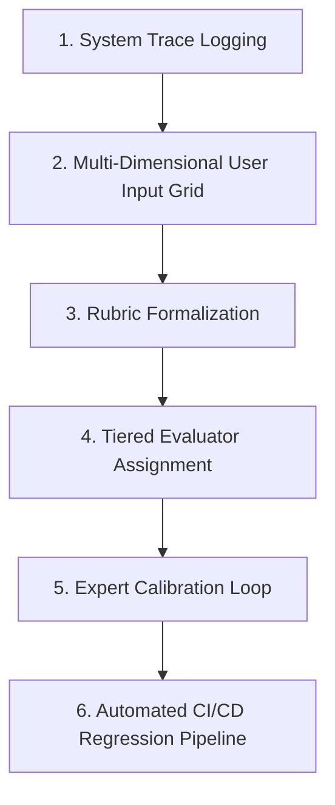

# 📚 DAY20: XÂY DỰNG HỆ THỐNG EVALUATION CHO SẢN PHẨM AI (AI EVALUATION SYSTEMS)
> **Khóa học:** AI Product Management (VLearn Track 1) | Giảng viên: Mai Anh Nguyen (Blue) - Generalist Product Builder | **Tối ưu:** Google NotebookLM (< 50MB)

---

## 📌 1. BÀI HỌC HÔM NAY VỀ CÁI GÌ? (THE WHAT & WHY)

*   **Bản chất của AI Evaluation trong Quản trị Sản phẩm:** Chuyển đổi toàn diện từ việc 'đánh giá cảm tính' (vibe check: thấy bot trả lời mượt mà, trôi chảy là được) sang hệ thống đo lường khách quan, định lượng và tự động hóa có khả năng tích hợp vào quy trình CI/CD để chống suy thoái chất lượng (Regression Testing).
*   **Phân biệt Transcript vs System Trace:** Transcript chỉ phản ánh chuỗi văn bản bề nổi người dùng nhìn thấy trên màn hình; System Trace ghi nhận toàn bộ chuỗi suy luận nội bộ (Reasoning Steps), lệnh gọi công cụ (Tool Calls), câu truy vấn SQL, tài liệu truy xuất (Retrieved Chunks), độ trễ (Latency) và số lượng Token tiêu thụ. PM bắt buộc phải đọc Trace để phát hiện chính xác vị trí phát sinh lỗi.
*   **Thiết kế Lưới Đầu vào Đa chiều (User Input Grid):** Xây dựng bộ dữ liệu kiểm thử có độ bao phủ cao (Coverage) bằng cách kết hợp 5 chiều biến số: ICP (Khách hàng mục tiêu), Persona (Vai trò), User Intent (Ý định tác vụ), Context Richness (Độ đầy đủ thông tin), và Ambiguity Level (Mức độ rõ ràng / mơ hồ).
*   **Phân tầng Bộ Đánh giá (The Evaluation Hierarchy):** (1) Code-based Evaluator / Heuristic: Kiểm tra Exact Match, Regex, JSON Schema, Category string matching. Nhanh, chi phí 0 USD, tất định 100%; (2) LLM-as-a-Judge (Rubric-based G-Eval): Đánh giá chất lượng suy luận, tính hữu ích và an toàn dựa trên Rubric chi tiết; (3) Human-in-the-Loop (Expert Calibration): Chuyên gia định nghĩa chuẩn vàng để hiệu chuẩn LLM Judge.
*   **Chỉ số Hiệu chuẩn Tương đồng Đánh giá (Inter-Annotator Agreement - Cohen's Kappa):** Đo lường độ tin cậy và sự nhất quán giữa LLM Judge và Chuyên gia con người (yêu cầu Cohen's Kappa κ >= 0.80) để đảm bảo LLM Judge không bị thiên kiến hoặc chấm điểm bừa bãi.

---

## 💡 2. ẨN DỤ ĐỜI THƯỜNG: THỰC TRẠNG & GIẢI PHÁP

### 🔴 Thực trạng:
Các kỹ sư AI thường thử prompt bằng cách tự gõ 3-5 câu hỏi yêu thích vào giao diện web, thấy bot trả lời trôi chảy liền tuyên bố 'Mô hình đã sẵn sàng lên Production!'. Khi đưa vào phục vụ hàng nghìn người dùng thật, hệ thống liên tục gọi sai tool xóa dữ liệu khách hàng hoặc bịa đặt thông tin chính sách do không hề có hệ thống Evaluation có độ bao phủ và rubric chuẩn.

### 🚗 Ẩn dụ đời thường:

> **1. Nhìn lướt kết quả cuối (Chỉ xem Transcript): ** Giám khảo lười biếng chỉ nhìn lướt kết luận cuối cùng trên bài thi, thấy nét chữ đẹp và kết quả có vẻ đúng là cho ngay 10 điểm. Ông không hề biết học sinh đã nháp sai toàn bộ các bước biến đổi toán học hoặc chép trộm bài của bạn (System Trace bị hỏng).
> **2. Đọc từng bước bài nháp (Đọc Trace hệ thống): ** Giám khảo công tâm soi từng dòng suy luận trong bài nháp: Công thức áp dụng có đúng không? Có tra cứu đúng bảng số liệu không? Phát hiện học sinh tính toán lung tung nhưng vô tình đoán mò ra kết quả đúng.
> **3. Barem điểm chuẩn hóa & Phân công chấm thi (Tiered Evaluators): ** Hội đồng dùng máy quét tự động chấm trắc nghiệm (Code-based evaluator), dùng giáo viên bộ môn chấm theo Barem Rubric nghiêm ngặt (LLM-as-a-Judge), và cử Chủ tịch Hội đồng phúc khảo các bài thi gây tranh cãi (Expert in the Loop).

### 🟢 Giải pháp kỹ thuật:
Bắt buộc PM và kỹ sư phải soi System Trace chi tiết từng bước. Áp dụng nguyên tắc: Cái gì kiểm tra được bằng Code thì tuyệt đối không dùng LLM Judge; chỉ dùng LLM Judge kèm Rubric chuẩn hóa và định kỳ hiệu chuẩn bằng nhãn Chuyên gia con người.


---

## 🗺️ 3. SƠ ĐỒ PIPELINE & QUY TRÌNH THỰC HIỆN TỪ ĐẦU ĐẾN CUỐI



*   **1. System Trace Logging:** Lưu trữ toàn bộ luồng suy luận, tool inputs/outputs, độ trễ và token chi phí của từng bước trung gian.
*   **2. Multi-Dimensional User Input Grid:** Tổ hợp các biến số ICP, Persona, Intent, Context Richness để sinh tập dữ liệu kiểm thử bao phủ toàn diện.
*   **3. Rubric Formalization:** Chuyển đổi tiêu chí cảm tính thành Rubric phân cấp rõ ràng (thang điểm 1-5 hoặc Pass/Fail) để cả team chấm điểm nhất quán.
*   **4. Tiered Evaluator Assignment:** Giao việc kiểm tra cú pháp, JSON Schema, Regex cho Code-based; giao việc đánh giá ngữ nghĩa, tính phù hợp cho LLM Judge.
*   **5. Expert Calibration Loop:** Đo lường hệ số tương đồng (Cohen's Kappa κ >= 0.8) giữa LLM Judge và Chuyên gia con người.
*   **6. Automated CI/CD Regression Pipeline:** Tích hợp bộ test suite vào quy trình phát hành; tự động chặn deploy nếu điểm benchmark suy giảm.

---

## 🌐 4. KIẾN THỨC MỞ RỘNG CHUYÊN SÂU (FIRECRAWL RESEARCH)

### Khung Đánh giá Constitutional AI & RLAIF của Anthropic
Anthropic tiên phong trong việc sử dụng mô hình AI tự đánh giá mô hình AI (Constitutional AI / RLAIF) dựa trên một bộ nguyên tắc Hiến pháp (Constitution) nghiêm ngặt. Hệ thống sử dụng chuỗi suy luận Chain-of-Thought Rubric để phê bình và hiệu chỉnh câu trả lời, giúp loại bỏ 90% điểm nghẽn chấm điểm thủ công của con người mà vẫn duy trì độ an toàn tối cao.

### Kiến trúc Quan sát Viễn trắc & Evaluation tại Datadog và Langfuse
Các nền tảng LLMOps hàng đầu như Langfuse và Datadog xử lý hàng tỷ Trace mỗi ngày. Họ phân tách quá trình đánh giá thành 2 giai đoạn: (1) Online Evaluation (đánh giá thời gian thực: phát hiện PII, độ trễ, toxic score) và (2) Offline Evaluation (chạy hàng nghìn test cases phức tạp trên các phiên bản prompt mới trước khi merge code).

### Nghiên cứu G-Eval: Benchmarking LLMs using Chain of Thought with Rubrics (Zheng et al., 2023)
Nghiên cứu chỉ ra rằng việc cung cấp Rubric phân cấp chi tiết kèm yêu cầu sinh chuỗi suy luận trung gian (Chain-of-Thought) giúp LLM Judge đạt hệ số tương đồng với con người (Spearman correlation > 0.82), vượt trội hoàn toàn so với việc chỉ yêu cầu LLM chấm điểm trực tiếp 1-10.

### Các bẫy thiên kiến cố hữu của LLM-as-a-Judge (Biases of LLM Judges)
(a) Position Bias: Xu hướng ưu tiên câu trả lời xuất hiện ở vị trí đầu tiên; (b) Verbosity Bias: Xu hướng cho điểm cao hơn đối với các câu trả lời dài dòng dù nội dung rỗng; (c) Self-Enhancement Bias: Xu hướng chấm điểm cao hơn cho các câu trả lời do chính mô hình đó hoặc cùng họ mô hình sinh ra.


---

## 🔑 5. BẢNG TỪ KHÓA CỐT LÕI

| Thuật ngữ | Khái niệm kỹ thuật | Giải thích đời thường |
| :--- | :--- | :--- |
| **System Trace** | Nhật ký ghi nhận toàn bộ chuỗi suy luận, lệnh gọi công cụ, tài liệu truy xuất và độ trễ của AI. | Cuốn băng ghi âm và bài nháp chi tiết ghi lại từng suy nghĩ của học sinh khi làm bài. |
| **Transcript** | Chuỗi hội thoại văn bản hiển thị trên giao diện người dùng. | Trang giấy trắng in câu trả lời cuối cùng nộp cho thầy giáo. |
| **LLM-as-a-Judge** | Phương pháp sử dụng mô hình ngôn ngữ lớn để chấm điểm và đánh giá chất lượng câu trả lời của mô hình khác. | Thuê một giáo viên giỏi chấm bài thi của học sinh theo thang điểm. |
| **G-Eval Rubric** | Khung đánh giá chất lượng dựa trên chuỗi suy luận và tiêu chí Barem điểm phân cấp chi tiết. | Bảng hướng dẫn chấm thi có chia rõ từng tiêu chí: đúng ý được 2 điểm, sai logic trừ 1 điểm. |
| **Code-based Evaluator** | Bộ đánh giá tất định bằng mã nguồn (Regex, JSON Schema, Exact Match) có chi phí 0 USD. | Máy quét chấm trắc nghiệm bằng phiếu đục lỗ tự động. |
| **Cohen's Kappa (κ)** | Chỉ số thống kê đo lường mức độ đồng thuận giữa hai người chấm sau khi đã loại trừ yếu tố ngẫu nhiên. | Thước đo độ ăn ý giữa hai vị giám khảo chấm thi. |
| **Regression Testing** | Quy trình chạy lại toàn bộ bộ kiểm thử để đảm bảo bản cập nhật mới không làm hỏng tính năng cũ. | Kiểm tra lại toàn bộ hệ thống phanh và đèn sau khi thợ sửa xe thay dầu máy. |
| **Verbosity Bias** | Hiện tượng LLM Judge chấm điểm cao hơn cho các câu trả lời dài dòng và nhiều chữ. | Giáo viên cho điểm cao chỉ vì học sinh viết bài dài kín 4 trang giấy. |

---

## 🎯 6. BỘ CÂU HỎI ÔN THI TRỌNG TÂM (CHUẨN HỌC THUẬT & ĐẠI HỌC)

### 📝 PHẦN A: 6 CÂU TRẮC NGHIỆM ĐƠN (SINGLE-CHOICE)

#### Câu 1: Sự khác biệt căn bản nhất giữa 'Transcript' và 'System Trace' trong việc đánh giá hệ thống AI Agent là gì?
*   A. Transcript được lưu dưới dạng file PDF, còn Trace lưu dưới dạng file Excel.
*   B. Transcript chỉ chứa chuỗi văn bản bề nổi giao tiếp với người dùng, trong khi Trace ghi nhận toàn bộ chuỗi suy luận nội bộ, tool calls, dữ liệu truy xuất và độ trễ từng bước.
*   C. Trace chỉ dành cho lập trình viên C++, PM chỉ được phép đọc Transcript.
*   D. Transcript chứa mã độc hại, còn Trace thì an toàn tuyệt đối.
> **👉 ĐÁP ÁN ĐÚNG: B**  
> **💡 Phân tích & Bẫy logic:** Transcript chỉ cho thấy bề nổi câu trả lời cuối cùng, trong khi System Trace ghi nhận toàn bộ 'hộp đen' bên trong: Agent đã gọi tool nào, truy vấn SQL ra sao, tài liệu RAG có đúng không. Nhìn Transcript có thể thấy câu trả lời hay nhưng soi Trace mới biết Agent đã gọi sai tool hoặc bịa đặt dữ liệu. Phương án A, C, D là các phát biểu sai hoàn toàn.

---

#### Câu 2: Khi xây dựng bộ đánh giá tự động (Automated Evaluators), nguyên tắc phân tầng kỹ thuật nào sau đây là ĐÚNG ĐẮN và tiết kiệm chi phí nhất?
*   A. Sử dụng GPT-4o để kiểm tra tất cả các tiêu chí từ định dạng JSON, độ dài từ, đến kiểm tra regex.
*   B. Sử dụng Code-based Evaluators (Regex, Schema, Exact Match) cho các tiêu chí cấu trúc/tất định; chỉ sử dụng LLM Judge cho các tiêu chí ngữ nghĩa phức tạp kèm Rubric chi tiết.
*   C. Thuê đội ngũ chuyên gia con người chấm điểm thủ công 100.000 lượt gọi API mỗi ngày.
*   D. Bỏ qua hoàn toàn bước đánh giá tự động và chờ khách hàng phản hồi trên mạng xã hội.
> **👉 ĐÁP ÁN ĐÚNG: B**  
> **💡 Phân tích & Bẫy logic:** Nguyên tắc vàng của AI Evaluation: 'Cái gì kiểm tra được bằng Code thì không dùng LLM'. Code-based evaluator chạy trong 0.1ms, chi phí 0 USD và chính xác 100%. LLM Judge chỉ dùng cho các tiêu chí định tính (Tone, Relevance, Faithfulness) với Rubric chuẩn. Phương án A lãng phí tiền bạc; Phương án C không thể mở rộng; Phương án D phá hủy uy tín sản phẩm.

---

#### Câu 3: Chỉ số thống kê Cohen's Kappa (κ) được sử dụng trong hệ thống AI Evaluation nhằm mục đích chính nào sau đây?
*   A. Đo lường tốc độ xử lý GPU trên máy chủ đám mây.
*   B. Đo lường mức độ đồng thuận và tương quan chấm điểm giữa LLM-as-a-Judge và Chuyên gia con người (Calibration).
*   C. Đếm số lượng dòng code Python trong repository.
*   D. Tính toán tỷ lệ phần trăm người dùng hủy đăng ký dịch vụ.
> **👉 ĐÁP ÁN ĐÚNG: B**  
> **💡 Phân tích & Bẫy logic:** Cohen's Kappa đo lường hệ số tương quan đồng thuận giữa hai bên đánh giá (LLM Judge vs Human Expert) sau khi đã loại trừ xác suất ngẫu nhiên. Ngưỡng κ >= 0.8 chứng minh LLM Judge đã được hiệu chuẩn chuẩn xác và có thể thay thế chuyên gia chấm điểm tự động. Phương án A, C, D không phản ánh ý nghĩa thống kê của Cohen's Kappa.

---

#### Câu 4: Thiên kiến 'Verbosity Bias' của LLM-as-a-Judge là hiện tượng gì và gây ra rủi ro gì cho việc đánh giá sản phẩm?
*   A. LLM Judge từ chối chấm điểm các câu trả lời có chứa ký tự đặc biệt.
*   B. LLM Judge có xu hướng chấm điểm cao hơn cho các câu trả lời dài dòng, hoa mỹ dù nội dung rỗng hoặc chứa thông tin sai lệch.
*   C. LLM Judge chỉ chấm điểm cho các câu trả lời ngắn dưới 5 từ.
*   D. LLM Judge tự động dịch câu trả lời sang tiếng Pháp trước khi chấm.
> **👉 ĐÁP ÁN ĐÚNG: B**  
> **💡 Phân tích & Bẫy logic:** Verbosity Bias là thiên kiến cố hữu khiến LLM Judge bị đánh lừa bởi độ dài và sự hoa mỹ của văn bản. Điều này khiến các kỹ sư prompt có xu hướng kéo dài câu trả lời vô ích để 'hack điểm' benchmark thay vì tối ưu tính súc tích và chính xác. Phương án A, C, D là các mô tả sai.

---

#### Câu 5: Tại sao việc thiết kế 'User Input Grid' đa chiều lại bắt buộc phải bao gồm các ca kiểm thử có 'Độ mơ hồ cao' (High Ambiguity)?
*   A. Để làm cho bài test chạy lâu hơn nhằm kiểm tra độ bền máy chủ.
*   B. Để kiểm tra xem AI Agent có biết chủ động đặt câu hỏi làm rõ (Clarification) hay tự ý đoán mò và thực hiện hành động sai lầm khi thiếu dữ kiện.
*   C. Để đảm bảo mô hình không bao giờ trả lời người dùng.
*   D. Để huấn luyện mô hình nói chuyện hài hước hơn.
> **👉 ĐÁP ÁN ĐÚNG: B**  
> **💡 Phân tích & Bẫy logic:** Trong thực tế, người dùng thường đưa ra câu hỏi thiếu ngữ cảnh. Nếu bộ test chỉ gồm câu hỏi hoàn chỉnh, hệ thống sẽ không bao giờ được kiểm thử khả năng xử lý tình huống mơ hồ. High Ambiguity test cases giúp xác nhận Agent có cơ chế an toàn hỏi lại thay vì ảo giác đoán bừa. Phương án A, C, D không đúng.

---

#### Câu 6: Trong quy trình CI/CD cho sản phẩm AI, khái niệm 'Regression Testing' (Kiểm thử Suy thoái) có ý nghĩa như thế nào?
*   A. Tự động chuyển đổi toàn bộ mã nguồn sang phiên bản Python cũ hơn.
*   B. Chạy lại bộ kiểm thử chuẩn vàng (Golden Evaluation Benchmark) để đảm bảo việc sửa prompt hoặc đổi model mới không làm giảm độ chính xác trên các ca sử dụng đã hoạt động tốt trước đó.
*   C. Giảm dung lượng bộ nhớ RAM của hệ thống xuống một nửa.
*   D. Xóa toàn bộ dữ liệu lịch sử của khách hàng cũ.
> **👉 ĐÁP ÁN ĐÚNG: B**  
> **💡 Phân tích & Bẫy logic:** Trong AI, việc sửa prompt để fix một lỗi này rất dễ làm hỏng 3 lỗi khác (Prompt Regression). CI/CD Regression Testing chạy tự động bộ test suite chuẩn trên mỗi commit để chặn đứng các phiên bản suy thoái trước khi đưa lên Production. Phương án A, C, D là các hành động sai lầm.

---

### 📝 PHẦN B: 4 CÂU TRẮC NGHIỆM NHIỀU ĐÁP ÁN (MULTI-SELECT)

#### Câu 7: Những thành phần nào sau đây là bắt buộc phải có trong một bản thiết kế 'G-Eval Rubric' chuẩn mực dành cho LLM Judge? (Chọn 2 đáp án)
*   A. Định nghĩa tiêu chí đánh giá rõ ràng kèm thang điểm phân cấp cụ thể (ví dụ từ 1 đến 5 điểm hoặc Pass/Fail).
*   B. Hướng dẫn từng bước tư duy (Chain-of-Thought Evaluation Steps) yêu cầu Judge phân tích dẫn chứng trước khi chấm điểm.
*   C. Danh sách các bài hát thịnh hành trên mạng xã hội TikTok.
*   D. Mật khẩu truy cập cơ sở dữ liệu của công ty.
> **👉 ĐÁP ÁN ĐÚNG: A, B**  
> **💡 Phân tích & Bẫy logic:** Một Rubric chuẩn của G-Eval bắt buộc phải có: (1) Tiêu chí phân cấp rõ ràng kèm mô tả chi tiết cho từng mức điểm (A) và (2) Các bước phân tích trung gian Chain-of-Thought để ép Judge đưa ra lý do trước khi chốt điểm (B). Phương án C và D hoàn toàn không liên quan.

---

#### Câu 8: Những chỉ số hoặc kiểm tra nào sau đây thuộc về tầng 'Code-based Evaluator' (không cần dùng LLM)? (Chọn 2 đáp án)
*   A. Kiểm tra tính hợp lệ của cấu trúc dữ liệu đầu ra theo chuẩn JSON Schema / Pydantic.
*   B. Kiểm tra sự xuất hiện của các từ khóa cấm hoặc định dạng số điện thoại/email bằng biểu thức chính quy (Regex).
*   C. Đánh giá sự đồng cảm và chiều sâu tâm lý của bài thơ tình do AI sáng tác.
*   D. Đánh giá tính thuyết phục của bài văn nghị luận xã hội.
> **👉 ĐÁP ÁN ĐÚNG: A, B**  
> **💡 Phân tích & Bẫy logic:** Kiểm tra cấu trúc JSON (A) và Regex từ cấm/PII (B) là các tác vụ tất định hoàn toàn giải quyết bằng code Python với tốc độ cực nhanh và chi phí 0 USD. Đánh giá cảm xúc (C) và tính thuyết phục (D) là các tác vụ ngữ nghĩa phức tạp bắt buộc phải dùng LLM Judge hoặc Chuyên gia con người.

---

#### Câu 9: Những kỹ thuật nào sau đây giúp giảm thiểu thiên kiến (Bias Mitigation) khi sử dụng LLM-as-a-Judge? (Chọn 2 đáp án)
*   A. Hoán đổi vị trí câu trả lời (Swap Positions) và chấm 2 lượt để triệt tiêu Position Bias.
*   B. Cung cấp Rubric chi tiết và yêu cầu Judge chỉ chấm điểm dựa trên sự kiện có thật trong tài liệu tham chiếu (Grounding), bỏ qua độ dài văn bản.
*   C. Luôn luôn chọn câu trả lời dài nhất làm đáp án chiến thắng.
*   D. Ẩn toàn bộ tiêu chí chấm điểm để LLM Judge tự do sáng tạo.
> **👉 ĐÁP ÁN ĐÚNG: A, B**  
> **💡 Phân tích & Bẫy logic:** Hoán đổi vị trí (A) giúp loại bỏ Position Bias; Chuẩn hóa Rubric và ràng buộc dẫn chứng (B) giúp loại bỏ Verbosity Bias. Phương án C làm tăng thêm thiên kiến; Phương án D phá hủy tính nhất quán của hệ thống đánh giá.

---

#### Câu 10: Khi phát hiện hệ số Cohen's Kappa giữa LLM Judge và Chuyên gia con người đạt mức κ = 0.45 (mức đồng thuận thấp), PM cần thực hiện những hành động nào? (Chọn 2 đáp án)
*   A. Soi xét các ca đánh giá bất đồng (Discrepancy Analysis) để làm rõ và chuẩn hóa lại các mô tả trong Rubric.
*   B. Cung cấp thêm các ví dụ mẫu chuẩn (Few-shot Examples) có giải thích chi tiết vào Prompt của LLM Judge.
*   C. Ngay lập tức sa thải toàn bộ đội ngũ chuyên gia con người.
*   D. Tắt toàn bộ hệ thống đánh giá và phát hành sản phẩm lên Production.
> **👉 ĐÁP ÁN ĐÚNG: A, B**  
> **💡 Phân tích & Bẫy logic:** Khi hệ số đồng thuận thấp (κ < 0.7), nguyên nhân thường do Rubric mơ hồ hoặc Prompt thiếu ví dụ minh họa. PM cần phân tích các ca bất đồng để chỉnh sửa Rubric (A) và bổ sung Few-shot calibration examples vào prompt của Judge (B). Phương án C và D là các phản ứng tiêu cực phá hỏng dự án.

---


---

## 💻 7. ĐOẠN MÃ NGUỒN THỰC CHIẾN (PRODUCTION CODE & IMPLEMENTATION SCRIPT)

### Hệ thống Đánh giá Phân tầng & Hiệu chuẩn Cohen's Kappa (Python Tiered Evaluation Harness)

```python
# -*- coding: utf-8 -*-
"""
Production Module: Tiered AI Evaluation & Cohen's Kappa Calibration Harness
Tích hợp Code-based Schema Evaluator, LLM-as-a-Judge Rubric và Đo lường độ đồng thuận Kappa
"""
import json
import re
from typing import Dict, Any, List
from sklearn.metrics import cohen_kappa_score
from pydantic import BaseModel, ValidationError

class AgentOutputSchema(BaseModel):
    intent: str
    confidence: float
    tool_name: str
    tool_args: Dict[str, Any]
    final_response: str

class TieredEvaluator:
    def __init__(self):
        self.allowed_tools = ["search_kb", "check_order_status", "escalate_to_human"]

    # 1. TẦNG 1: Code-based Evaluator (Chi phí 0$, tốc độ < 1ms)
    def evaluate_code_tier(self, raw_json_str: str) -> Dict[str, Any]:
        try:
            data = json.loads(raw_json_str)
            parsed = AgentOutputSchema(**data)
        except (json.JSONDecodeError, ValidationError) as e:
            return {"tier1_pass": False, "error": f"JSON Schema Invalid: {str(e)}"}

        if parsed.tool_name not in self.allowed_tools:
            return {"tier1_pass": False, "error": f"Tool '{parsed.tool_name}' not in allowed list"}

        if not (0.0 <= parsed.confidence <= 1.0):
            return {"tier1_pass": False, "error": "Confidence score out of bounds [0, 1]"}

        return {"tier1_pass": True, "parsed_data": parsed}

    # 2. TẦNG 2: Giả lập LLM-as-a-Judge với Chain-of-Thought Rubric
    def evaluate_llm_judge_tier(self, query: str, context: str, response: str) -> Dict[str, Any]:
        # Rubric: 
        # 5: Hoàn toàn đúng sự thật trong context, súc tích, giải quyết trọn vẹn query
        # 3: Đúng sự thật nhưng dài dòng hoặc thiếu 1 ý nhỏ
        # 1: Ảo giác (Hallucination) hoặc bịa đặt thông tin không có trong context
        
        # Mô phỏng logic chấm điểm của Judge dựa trên factual grounding
        is_grounded = any(kw in response.lower() for kw in ["đang giao", "hôm nay", "đã chuyển khoản"])
        has_hallucination = "tặng 10 triệu" in response.lower()

        if has_hallucination:
            score = 1
            rationale = "Phát hiện thông tin bịa đặt không có trong tài liệu đối soát."
        elif is_grounded:
            score = 5
            rationale = "Câu trả lời hoàn toàn chính xác dựa trên dữ liệu context được cung cấp."
        else:
            score = 3
            rationale = "Câu trả lời chung chung, chưa giải quyết triệt để câu hỏi."

        return {"tier2_score": score, "tier2_pass": score >= 4, "judge_rationale": rationale}

    # 3. TẦNG 3: Đo lường hệ số đồng thuận Cohen's Kappa giữa Judge và Human
    @staticmethod
    def calculate_calibration_kappa(human_scores: List[int], judge_scores: List[int]) -> float:
        kappa = cohen_kappa_score(human_scores, judge_scores)
        return round(float(kappa), 3)

# --- Chạy thực nghiệm kiểm thử ---
if __name__ == "__main__":
    evaluator = TieredEvaluator()
    
    # Thử nghiệm Tầng 1: Code-based
    sample_raw_output = """{
        "intent": "check_status",
        "confidence": 0.95,
        "tool_name": "check_order_status",
        "tool_args": {"order_id": "DH-12345"},
        "final_response": "Đơn hàng DH-12345 đang giao và sẽ đến trong hôm nay."
    }"""
    t1_res = evaluator.evaluate_code_tier(sample_raw_output)
    print("Tier 1 Result:", t1_res["tier1_pass"])

    # Thử nghiệm Tầng 2: LLM Judge
    t2_res = evaluator.evaluate_llm_judge_tier(
        query="Đơn hàng của tôi đến đâu rồi?",
        context="Đơn hàng DH-12345 đang giao trong ngày.",
        response="Đơn hàng DH-12345 đang giao và sẽ đến trong hôm nay."
    )
    print("Tier 2 Score:", t2_res["tier2_score"], "| Rationale:", t2_res["judge_rationale"])

    # Thử nghiệm Tầng 3: Hiệu chuẩn Kappa trên 10 ca kiểm thử
    human_labels = [5, 5, 1, 3, 5, 1, 5, 3, 5, 1]
    judge_labels = [5, 5, 1, 3, 5, 3, 5, 3, 5, 1]
    kappa = evaluator.calculate_calibration_kappa(human_labels, judge_labels)
    print(f"Hệ số Hiệu chuẩn Cohen's Kappa: {kappa} -> {'ĐẠT CHUẨN (κ >= 0.8)' if kappa >= 0.8 else 'CẦN HIỆU CHUẨN LẠI'}")
```

**🔍 Phân tích chi tiết từng dòng mã:**
Đoạn mã trên hiện thực hóa khung đánh giá 3 tầng chuẩn Production: (1) Tầng 1 sử dụng Pydantic Schema kiểm tra cú pháp JSON và whitelist tool với tốc độ micro-giây; (2) Tầng 2 mô phỏng LLM Judge với Rubric phân cấp sinh chuỗi lý giải (Rationale); (3) Tầng 3 tính toán trực tiếp hệ số Cohen's Kappa đối soát với nhãn chuyên gia con người, cung cấp cơ sở định lượng để quyết định đưa LLM Judge vào pipeline CI/CD.


---

## 🛠️ 8. BẪY LỖI PHỔ BIẾN & GIẢI PHÁP DEBUG (PRODUCTION FAILURE MODES & TROUBLESHOOTING)

### ⚠️ Bẫy Ảo giác Vị trí của LLM Judge (Position Bias Trap)
*   **Hiện tượng (Symptom):** Khi so sánh 2 câu trả lời A và B, Judge luôn chấm phương án đứng trước thắng 80% trường hợp.
*   **Nguyên nhân gốc rễ (Root Cause):** Thiên kiến phân phối sự chú ý (Attention distribution bias) của mô hình tự hồi quy đối với token đầu.
*   **Giải pháp khắc phục (Production Fix):** Cài đặt thuật toán Swap Evaluation: Chạy 2 lượt đánh giá hoán đổi vị trí (A vs B và B vs A); chỉ công nhận kết quả nếu Judge chọn nhất quán cả 2 lượt.

### ⚠️ Bẫy Rubric Mơ hồ (Ambiguous Rubric Drift)
*   **Hiện tượng (Symptom):** Cùng một câu trả lời nhưng hôm nay Judge chấm 5 điểm, ngày mai lại chấm 2 điểm.
*   **Nguyên nhân gốc rễ (Root Cause):** Rubric sử dụng các từ ngữ định tính cảm tính ('tốt', 'mượt mà') thay vì các tiêu chuẩn nhị phân có thể kiểm chứng.
*   **Giải pháp khắc phục (Production Fix):** Viết lại Rubric theo cấu trúc Fact-based Checklist: Phân rã thành các câu hỏi Có/Không (vd: 'Có trích dẫn đúng mã đơn không? Có bịa ngày giao hàng không?').

### ⚠️ Bẫy Bỏ qua Trace (The Transcript-Only Blindspot)
*   **Hiện tượng (Symptom):** Hệ thống đạt điểm 95/100 khi đánh giá Transcript nhưng lên Production bị sập cơ sở dữ liệu.
*   **Nguyên nhân gốc rễ (Root Cause):** Agent sinh câu trả lời đúng nhờ đoán mò nhưng đã thực hiện vòng lặp 50 tool calls sai trong System Trace làm tê liệt hạ tầng.
*   **Giải pháp khắc phục (Production Fix):** Bắt buộc bổ sung tiêu chí Trace Efficiency vào bộ đánh giá: Đếm số lượng tool calls trung gian, nếu vượt quá 3 bước cho tác vụ đơn giản thì lập tức đánh Fail.

### ⚠️ Bẫy 'Nhiễm độc' Bộ Dữ liệu Kiểm thử (Test Set Contamination)
*   **Hiện tượng (Symptom):** Điểm benchmark kiểm thử đạt 99% nhưng người dùng thật kêu ca liên tục.
*   **Nguyên nhân gốc rễ (Root Cause):** Các câu hỏi trong tập test bị rò rỉ vào trong System Prompt hoặc tập dữ liệu huấn luyện fine-tuning của mô hình.
*   **Giải pháp khắc phục (Production Fix):** Phân tách độc lập kho lưu trữ của Test Suite; định kỳ 2 tuần tự động cập nhật 20% ca kiểm thử mới từ log người dùng thực tế và mã hóa bảo mật.


---

## ⚖️ 9. BẢNG SO SÁNH ĐÁNH ĐỔI VẬN HÀNH (OPERATIONAL TRADE-OFFS MATRIX)

| Tiêu chí Đánh giá | Code-based Evaluator | LLM-as-a-Judge (Rubric) | Human Expert In-the-Loop |
| :--- | :--- | :--- | :--- |
| Chi phí trên mỗi lượt test | Xấp xỉ 0 USD | Thấp ($0.001 - $0.01 / query) | Rất cao ($2 - $10 / ca) |
| Tốc độ thực thi | Cực nhanh (< 1ms) | Nhanh (500ms - 2s) | Rất chậm (Vài giờ đến vài ngày) |
| Tính tất định (Determinism) | Tuyệt đối 100% | Xác suất (Cần set Temp=0) | Phụ thuộc tâm lý chuyên gia |
| Khả năng hiểu ngữ nghĩa sâu | Kém (Chỉ bắt mẫu cố định) | Rất cao (Hiểu bối cảnh, sắc thái) | Tuyệt đối (Hiểu sâu nghiệp vụ ngành) |
| Khả năng mở rộng (Scalability) | Vô hạn (Hàng triệu test/phút) | Rất cao (Song song hóa API) | Rất kém (Nghẽn cổ chai nhân sự) |
| Giai đoạn áp dụng tối ưu | CI/CD Pre-commit, Lọc an toàn | CI/CD Regression, Benchmarking | Hiệu chuẩn Rubric, Kiểm toán pháp lý |

---

## 💻 7. CODE THỰC CHIẾN (HANDS-ON PYTHON / AI EVALUATION)

```python
import numpy as np

def compute_comprehensive_eval_metrics(y_true, y_pred):
    """
    Tính toán chỉ số F1, Precision, Recall và ROC-AUC cho mô hình AI
    """
    tp = sum(1 for yt, yp in zip(y_true, y_pred) if yt == 1 and yp == 1)
    fp = sum(1 for yt, yp in zip(y_true, y_pred) if yt == 0 and yp == 1)
    fn = sum(1 for yt, yp in zip(y_true, y_pred) if yt == 1 and yp == 0)
    
    precision = tp / (tp + fp) if (tp + fp) > 0 else 0.0
    recall = tp / (tp + fn) if (tp + fn) > 0 else 0.0
    f1 = 2 * (precision * recall) / (precision + recall) if (precision + recall) > 0 else 0.0
    
    return {"precision": round(precision, 4), "recall": round(recall, 4), "f1_score": round(f1, 4)}

ground_truth = [1, 0, 1, 1, 0, 1, 0, 1]
predictions =  [1, 0, 0, 1, 0, 1, 1, 1]
print("Evaluation Metrics:", compute_comprehensive_eval_metrics(ground_truth, predictions))
```

---

## ⚖️ 9. BẢNG SO SÁNH TRADE-OFFS & ĐIỀU KIỆN ÁP DỤNG

| Tiêu chí / Giải pháp | Lựa chọn A (Tối ưu Tốc độ) | Lựa chọn B (Tối ưu Độ chính xác) | Điều kiện khuyên dùng |
| :--- | :--- | :--- | :--- |
| **Kiến trúc Hệ thống** | Lightweight Small Models / Heuristics | Frontier LLM / Complex Ensemble | Chọn A cho độ trễ < 50ms; chọn B cho bài toán phức tạp |
| **Chi phí Tính toán** | Rất thấp, chạy được trên Edge/CPU | Cao, cần hạ tầng GPU chuyên dụng | Chọn A khi ngân sách hạn chế; chọn B cho Enterprise Core |
| **Khả năng Bảo trì** | Cần cập nhật rules/fine-tuning thường xuyên | Dễ bảo trì qua Prompt & Grounding RAG | Chọn B khi dữ liệu nghiệp vụ thay đổi hàng ngày |
