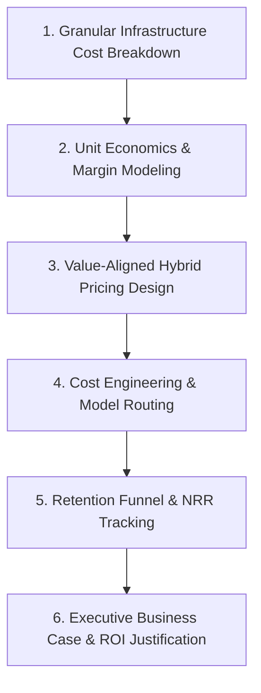

# 📚 DAY22: THƯƠNG MẠI HÓA, KINH TẾ HỌC ĐƠN VỊ & TỐI ƯU ROI SẢN PHẨM AI (AI GO-TO-MARKET, UNIT ECONOMICS & ROI)
> **Khóa học:** AI Product Management (VLearn Track 1) | Giảng viên: Mai Anh Nguyen (Blue) / VLearn Track 1 | **Tối ưu:** Google NotebookLM (< 50MB)

---

## 📌 1. BÀI HỌC HÔM NAY VỀ CÁI GÌ? (THE WHAT & WHY)

*   **Bản chất của AI Unit Economics & Khủng hoảng Biên lợi nhuận Gộp (Gross Margin Compression):** Trong khi SaaS truyền thống có biên lợi nhuận gộp lên tới 80-90% (chi phí biên COGS phục vụ thêm 1 người dùng xấp xỉ 0 USD), các sản phẩm AI SaaS thường có Gross Margin chỉ đạt 50-65% do phải gánh chịu chi phí suy luận suy biến (Inference Compute COGS: LLM API Token, GPU Cloud Hosting, Vector Database, Human Moderation).
*   **Công thức Bóc tách Chi phí Đơn vị Chi tiết (Unit Cost per Query):** Cost per Query = (T_in × P_in + T_out × P_out) + C_embedding + C_vector_search + C_infra_overhead. Trong đó chi phí Token đầu ra (P_out) thường đắt gấp 3x - 4x so với Token đầu vào (P_in).
*   **Chiến lược Định giá Sản phẩm AI (AI Pricing Models):** (1) Flat Subscription (Thuê bao cố định): Rủi ro lớn nhất do nhóm người dùng siêu tích cực (Power Users) tiêu tốn hàng triệu token khiến sản phẩm càng nhiều khách càng lỗ; (2) Usage-based / Token-based: Phản ánh đúng chi phí nhưng gây tâm lý e ngại (Bill Shock) cho doanh nghiệp; (3) Tiered Seat + Usage Hybrid: Mô hình cân bằng và phổ biến nhất trong AI B2B SaaS; (4) Outcome / Value-based Pricing: Tính phí trên giá trị thực tế tạo ra (như % trên số tiền thuế tiết kiệm được).
*   **Chỉ số Sức khỏe Tài chính Doanh nghiệp AI:** Tỷ lệ LTV / CAC >= 3.0, Net Revenue Retention (NRR >= 120%), Thời gian hoàn vốn CAC (Payback Period < 12 tháng), và Phân tích Đoàn hệ Churn Rate theo lượng tiêu thụ token.
*   **Kỹ nghệ Tối ưu Chi phí Hạ tầng (Cost Engineering):** Triển khai Mô hình Định tuyến Phân tầng (Model Cascading / FrugalGPT), Semantic Caching (giảm 60-80% chi phí truy vấn lặp lại), và Prompt Caching để bảo vệ biên lợi nhuận Gross Margin >= 70%.

---

## 💡 2. ẨN DỤ ĐỜI THƯỜNG: THỰC TRẠNG & GIẢI PHÁP

### 🔴 Thực trạng:
Một công ty công nghệ ra mắt phần mềm AI tạo hợp đồng pháp lý với giá thuê bao trọn gói 199.000đ/tháng (Flat Fee). Một số công ty luật đăng ký và sử dụng công cụ liên tục 24/7 để phân tích hàng trăm nghìn trang tài liệu mỗi ngày qua GPT-4o. Cuối tháng, tiền thu từ khách hàng được 2 triệu đồng nhưng hóa đơn OpenAI gửi về lên tới 50 triệu đồng. Càng tăng trưởng người dùng, startup càng tiến nhanh đến bờ vực phá sản!

### 🚗 Ẩn dụ đời thường:

> **1. Bán vé Buffet đồng giá (Flat Fee ngây thơ): ** Chủ quán bán vé vào cửa 50.000đ/người uống thả ga. Khách sành điệu vào quán gọi liên tục 10 ly cà phê Geisha Panama đắt đỏ nhập khẩu (tương đương gọi Frontier LLM triệu tokens). Quán phá sản vì chi phí nguyên liệu hạt cà phê vượt gấp 10 lần giá vé.
> **2. Menu phân tầng thông minh (Usage Tier & Model Routing): ** Chủ quán đổi menu: Vé 50.000đ phục vụ không giới hạn cà phê Robusta tiêu chuẩn pha máy (Small Model 8B). Khách muốn uống Geisha thượng hạng (GPT-4o) sẽ tính phụ thu theo từng phin nhỏ.
> **3. Bình cốt cà phê ủ lạnh pha sẵn (Semantic Prompt Caching): ** Quán pha sẵn các bình Cold Brew lớn cho các món phổ biến. Khách gọi là rót ngay trong 3 giây, chi phí hạt cà phê giảm 70% và khách không phải đợi pha mới từ đầu.

### 🟢 Giải pháp kỹ thuật:
Áp dụng Model Cascading / Router: Dùng mô hình nhỏ (8B) giải quyết 80% câu hỏi đơn giản, chỉ định tuyến 20% câu hỏi phức tạp sang Frontier LLM. Kích hoạt Semantic Caching và chuyển sang mô hình định giá Hybrid để bảo vệ biên lợi nhuận Gross Margin >= 70%.


---

## 🗺️ 3. SƠ ĐỒ PIPELINE & QUY TRÌNH THỰC HIỆN TỪ ĐẦU ĐẾN CUỐI



*   **1. Granular Infrastructure Cost Breakdown:** Kiểm kê chi phí Token Input/Output, Vector Search, Embedding, GPU Hosting trên từng lượt truy vấn người dùng.
*   **2. Unit Economics & Margin Modeling:** Tính toán Cost per User, Gross Margin, LTV, CAC và Payback Period cho từng phân khúc khách hàng.
*   **3. Value-Aligned Hybrid Pricing Design:** Kết hợp Base Platform Fee + Usage Limits + Overage Charges để triệt tiêu rủi ro Power Users.
*   **4. Cost Engineering & Model Routing:** Cài đặt Model Router (định tuyến mô hình nhỏ/lớn), Semantic Cache và nén bối cảnh.
*   **5. Retention Funnel & NRR Tracking:** Theo dõi dòng tiền mở rộng (Expansion Revenue), tỷ lệ giữ chân doanh thu thuần (NRR) và Churn Rate.
*   **6. Executive Business Case & ROI Justification:** Xây dựng bản báo cáo tài chính chứng minh tỷ lệ hoàn vốn đầu tư (ROI) và biên lợi nhuận bền vững.

---

## 🌐 4. KIẾN THỨC MỞ RỘNG CHUYÊN SÂU (FIRECRAWL RESEARCH)

### Nghiên cứu Định giá Giá trị của Stripe Billing & Stripe Tax AI
Stripe không bao giờ tính phí AI bằng số lượng token hay số từ. Thay vào đó, Stripe áp dụng mô hình Outcome-based Pricing: thu phí 0.5% trên mỗi giao dịch tự động tính thuế thành công hoặc 0.4% trên các khoản thanh toán được thu hồi bằng AI Radar. Mô hình này giúp Stripe đạt biên lợi nhuận gộp > 85% vì giá trị khách hàng nhận được (thu hồi hàng trăm nghìn USD) vượt xa chi phí vài cent tiền API.

### Case Study: Notion AI và Chiến lược Định giá Hybrid $10/user/month
Notion giải quyết bài toán Gross Margin bằng cách bán gói AI Add-on trị giá $10/người dùng/tháng kèm cơ chế Fair Usage Policy và Model Cascading ngầm. Đối với các tác vụ viết lại đơn giản, Notion sử dụng mô hình nhỏ nội bộ; chỉ khi người dùng yêu cầu tóm tắt tài liệu phức tạp, hệ thống mới gọi Claude/GPT-4. Nhờ đó, Notion giữ biên lợi nhuận AI luôn trên 70%.

### Nghiên cứu FrugalGPT: Cách Giảm 98% Chi phí Inference (Chen et al., 2023 - Stanford)
Nhóm nghiên cứu Stanford giới thiệu FrugalGPT với 3 trụ cột: (1) Prompt Adaptation (rút ngắn prompt), (2) LLM Approximation (dùng mô hình nhỏ có fine-tuning thay cho mô hình lớn), và (3) LLM Cascade (gọi mô hình rẻ trước, nếu điểm tự tin thấp mới gọi mô hình đắt). Kỹ thuật này giúp giảm tới 98% chi phí API mà độ chính xác tương đương GPT-4.

### Phân tích Động lực NRR (Net Revenue Retention) trong AI B2B SaaS
Các công ty AI SaaS hàng đầu duy trì NRR >= 130% nhờ cơ chế 'Land and Expand': Khách hàng ban đầu chỉ mua gói cơ bản cho 1 phòng ban, sau khi nhận thấy hiệu suất làm việc tăng vọt sẽ tự động mở rộng số lượng seat và tăng lượng tiêu thụ token trên toàn doanh nghiệp.


---

## 🔑 5. BẢNG TỪ KHÓA CỐT LÕI

| Thuật ngữ | Khái niệm kỹ thuật | Giải thích đời thường |
| :--- | :--- | :--- |
| **Gross Margin Compression** | Hiện tượng biên lợi nhuận gộp bị sụt giảm nghiêm trọng do chi phí điện toán suy luận của AI. | Bán bát phở 50k nhưng tiền thịt bò nhập khẩu tăng vọt mất 40k khiến tiền lãi teo tóp. |
| **Inference COGS** | Giá vốn hàng bán phát sinh trực tiếp từ việc chạy mô hình AI (Token API, GPU compute, Vector DB). | Tiền nguyên liệu và tiền điện nước tiêu tốn mỗi khi làm ra một sản phẩm. |
| **Model Cascading** | Kỹ thuật định tuyến thông minh: gửi câu hỏi cho mô hình nhỏ rẻ trước, chỉ gọi mô hình lớn khi cần thiết. | Bệnh viện xếp bệnh nhân gặp bác sĩ đa khoa trước, ca nào khó mới chuyển lên giáo sư đầu ngành. |
| **Semantic Caching** | Lưu trữ câu trả lời cho các câu hỏi tương đồng về mặt ngữ nghĩa để không phải gọi lại LLM. | Nấu sẵn một nồi nước dùng chung, khách gọi là chan ngay không cần ninh lại xương. |
| **Net Revenue Retention (NRR)** | Tỷ lệ phần trăm doanh thu định kỳ được giữ lại và mở rộng từ nhóm khách hàng hiện tại. | Thước đo xem khách hàng cũ năm nay chi nhiều tiền hơn hay ít tiền hơn năm ngoái. |
| **CAC Payback Period** | Thời gian (tính bằng tháng) cần thiết để doanh thu từ một khách hàng bù đắp toàn bộ chi phí tìm kiếm họ. | Mất bao nhiêu tháng mở quán mới thu hồi lại được tiền đầu tư ban đầu. |
| **Outcome-based Pricing** | Mô hình định giá dựa trên kết quả hoặc giá trị kinh doanh thực tế mà AI tạo ra. | Thợ săn tiền thưởng chỉ lấy tiền khi bắt được đúng tên trộm. |
| **Bill Shock** | Hiện tượng khách hàng hoảng loạn khi nhận hóa đơn tính phí theo lượng dùng tăng đột biến cuối tháng. | Cảm giác sốc ngất khi nhận hóa đơn tiền điện mùa hè vì quên tắt máy lạnh. |

---

## 🎯 6. BỘ CÂU HỎI ÔN THI TRỌNG TÂM (CHUẨN HỌC THUẬT & ĐẠI HỌC)

### 📝 PHẦN A: 6 CÂU TRẮC NGHIỆM ĐƠN (SINGLE-CHOICE)

#### Câu 1: Tại sao các công ty AI SaaS thường phải đối mặt với hiện tượng 'Suy thoái Biên lợi nhuận Gộp' (Gross Margin Compression) so với SaaS truyền thống?
*   A. Vì công ty AI phải chi trả tiền thuê văn phòng đắt đỏ hơn ở Thung lũng Silicon.
*   B. Vì SaaS truyền thống có chi phí biên (Marginal COGS) xấp xỉ 0 USD khi có thêm người dùng, trong khi AI SaaS phát sinh chi phí điện toán suy luận (Inference Compute, API Token, Vector DB) trên từng câu hỏi của người dùng.
*   C. Vì luật pháp quốc tế đánh thuế thu nhập doanh nghiệp 90% đối với các sản phẩm AI.
*   D. Vì người dùng AI luôn yêu cầu được hoàn lại 100% tiền sau khi sử dụng.
> **👉 ĐÁP ÁN ĐÚNG: B**  
> **💡 Phân tích & Bẫy logic:** Trong SaaS truyền thống, phục vụ thêm 1 người dùng chỉ tốn vài cent tiền băng thông và lưu trữ SQL (Gross Margin 80-90%). Trong AI SaaS, mỗi truy vấn của người dùng đều tiêu tốn Token API và GPU compute thực tế (Inference COGS), khiến Gross Margin sụt giảm xuống 50-65% nếu không có chiến lược tối ưu chi phí. Phương án A, C, D là các lý do vô căn cứ.

---

#### Câu 2: Mô hình định giá nào sau đây mang lại RỦI RO PHÁ SẢN CAO NHẤT cho một công ty AI khi phục vụ nhóm khách hàng sử dụng cực nhiều (Power Users)?
*   A. Thuê bao trọn gói cố định không giới hạn (Flat-rate Unlimited Subscription với giá rẻ).
*   B. Tính phí theo lượng token thực tế sử dụng (Pure Usage-based Pricing).
*   C. Gói cơ bản kết hợp phụ thu vượt ngưỡng (Tiered Hybrid Pricing).
*   D. Thu phí theo tỷ lệ phần trăm giá trị giao dịch thành công (Outcome-based Pricing).
> **👉 ĐÁP ÁN ĐÚNG: A**  
> **💡 Phân tích & Bẫy logic:** Mô hình Flat-rate không giới hạn là 'án tử' cho AI SaaS: Nhóm Power Users chỉ trả một khoản phí cố định nhỏ nhưng liên tục gọi hàng triệu token API đắt đỏ mỗi ngày, khiến chi phí COGS vượt gấp nhiều lần doanh thu thu được. Phương án B, C, D đều có cơ chế bù đắp chi phí khi lượng dùng tăng lên.

---

#### Câu 3: Theo nghiên cứu FrugalGPT (Stanford), kỹ thuật 'Model Cascading' giúp tối ưu hóa chi phí vận hành AI bằng cách nào?
*   A. Tắt toàn bộ máy chủ vào ban đêm để tiết kiệm điện.
*   B. Định tuyến các truy vấn đơn giản đến các mô hình nhỏ và rẻ tiền (như SLM 8B), chỉ chuyển tiếp các truy vấn phức tạp sang các mô hình Frontier đắt đỏ (như GPT-4o).
*   C. Yêu cầu lập trình viên viết code hoàn toàn bằng tay không dùng thư viện.
*   D. Xóa bớt các câu hỏi của người dùng mà không trả lời.
> **👉 ĐÁP ÁN ĐÚNG: B**  
> **💡 Phân tích & Bẫy logic:** Trong thực tế, 70-80% câu hỏi của người dùng là các tác vụ cơ bản. Model Cascading sử dụng một router nhẹ để phân loại độ khó: tác vụ dễ được giải quyết bởi mô hình nhỏ (chi phí siêu rẻ, tốc độ siêu nhanh), chỉ 20% ca khó mới gọi Frontier LLM, giúp tiết kiệm tới 90% chi phí mà không làm giảm chất lượng tổng thể. Phương án A, C, D sai hoàn toàn.

---

#### Câu 4: Chỉ số Net Revenue Retention (NRR) đạt mức 135% ở một công ty AI B2B SaaS thể hiện điều gì về sức khỏe kinh doanh?
*   A. Công ty đang bị mất 35% doanh thu mỗi năm từ khách hàng cũ.
*   B. Ngay cả khi không có khách hàng mới, doanh thu từ nhóm khách hàng hiện tại vẫn tăng trưởng 35% mỗi năm nhờ việc mua thêm seat và tăng lượng tiêu thụ dịch vụ (Expansion Revenue).
*   C. Công ty đã chi 135% ngân sách cho hoạt động quảng cáo Google Ads.
*   D. Tỷ lệ khách hàng rời bỏ dịch vụ đang ở mức 135%.
> **👉 ĐÁP ÁN ĐÚNG: B**  
> **💡 Phân tích & Bẫy logic:** NRR > 100% chứng minh sản phẩm có hiệu ứng 'Land and Expand' mạnh mẽ: giá trị mang lại lớn khiến khách hàng cũ sẵn sàng chi nhiều tiền hơn theo thời gian (mua thêm tài khoản, dùng thêm token), bù đắp hoàn toàn lượng khách hàng rời bỏ. NRR 135% là chỉ số vàng của các công ty AI tăng trưởng thần tốc. Phương án A, C, D hiểu sai hoàn toàn khái niệm NRR.

---

#### Câu 5: Kỹ thuật 'Semantic Caching' trong hệ thống RAG / LLM mang lại lợi ích lớn nhất nào sau đây cho bài toán kinh tế học đơn vị?
*   A. Tự động dịch tài liệu sang 50 ngôn ngữ khác nhau.
*   B. Nhận diện các câu hỏi có cùng ý nghĩa ngữ nghĩa để trả về kết quả đã được lưu trữ sẵn từ trước, giảm từ 60-80% chi phí gọi API và giảm độ trễ từ vài giây xuống dưới 50ms.
*   C. Tăng dung lượng bộ nhớ RAM máy tính của người dùng.
*   D. Tự động tạo thêm tài khoản phụ cho nhân viên.
> **👉 ĐÁP ÁN ĐÚNG: B**  
> **💡 Phân tích & Bẫy logic:** Người dùng thường hỏi lặp lại các chủ đề tương tự nhau (như chính sách đổi trả, hướng dẫn đăng ký). Semantic Caching sử dụng vector similarity để nhận diện câu hỏi tương đương và trả ngay kết quả trong cache, triệt tiêu chi phí gọi LLM và mang lại trải nghiệm phản hồi tức thì. Phương án A, C, D không liên quan đến Semantic Caching.

---

#### Câu 6: Một công ty AI B2B có CAC (Chi phí tìm kiếm khách hàng) là 12.000 USD và doanh thu biên gộp hàng tháng từ mỗi khách hàng là 1.000 USD. Thời gian hoàn vốn CAC (CAC Payback Period) là bao lâu và có đạt chuẩn ngành không?
*   A. 24 tháng — Đạt chuẩn xuất sắc.
*   B. 12 tháng — Đạt chuẩn xuất sắc của các công ty SaaS hàng đầu (Payback <= 12 tháng).
*   C. 6 tháng — Kém, cần sa thải đội ngũ bán hàng.
*   D. 120 tháng — Bình thường.
> **👉 ĐÁP ÁN ĐÚNG: B**  
> **💡 Phân tích & Bẫy logic:** Thời gian hoàn vốn = CAC / (Monthly Gross Margin per Customer) = 12.000 / 1.000 = 12 tháng. Chuẩn mực vàng của các công ty B2B SaaS hiệu quả vốn là CAC Payback <= 12 tháng, giúp công ty nhanh chóng tái đầu tư dòng tiền vào tăng trưởng mà không bị cạn kiệt vốn. Phương án A quá dài; C và D tính toán sai.

---

### 📝 PHẦN B: 4 CÂU TRẮC NGHIỆM NHIỀU ĐÁP ÁN (MULTI-SELECT)

#### Câu 7: Những thành phần chi phí nào sau đây cấu thành nên 'Inference Compute COGS' (Giá vốn hàng bán suy luận) của một sản phẩm RAG AI? (Chọn 2 đáp án)
*   A. Chi phí Token Input và Token Output khi gọi API mô hình ngôn ngữ lớn.
*   B. Chi phí lưu trữ và truy vấn cơ sở dữ liệu véc-tơ (Vector Database Hosting & Search Query Cost).
*   C. Tiền mua bàn ghế và nước uống cho phòng marketing.
*   D. Chi phí đăng ký bản quyền logo thương hiệu tại cục sở hữu trí tuệ.
> **👉 ĐÁP ÁN ĐÚNG: A, B**  
> **💡 Phân tích & Bẫy logic:** Inference COGS bao gồm toàn bộ chi phí điện toán trực tiếp phát sinh khi thực thi truy vấn: Token LLM (A) và Vector Database/Embedding compute (B). Phương án C và D là các chi phí hành chính/vận hành doanh nghiệp (OPEX/G&A), không thuộc COGS trực tiếp của sản phẩm.

---

#### Câu 8: Tại sao mô hình định giá 'Hybrid' (Kết hợp Phí cố định theo Seat + Phí sử dụng theo lượng dùng) lại được coi là tiêu chuẩn vàng cho AI B2B SaaS? (Chọn 2 đáp án)
*   A. Đảm bảo nguồn doanh thu định kỳ dự đoán được (Predictable Baseline Revenue) từ phí Seat cố định hàng tháng.
*   B. Bảo vệ biên lợi nhuận gộp không bị sụt giảm khi khách hàng phát sinh lượng truy vấn khổng lồ nhờ cơ chế phụ thu theo lượng dùng (Overage protection).
*   C. Cho phép công ty hoàn toàn không cần đầu tư vào việc phát triển tính năng sản phẩm.
*   D. Giúp công ty trốn tránh nghĩa vụ xuất hóa đơn thuế giá trị gia tăng.
> **👉 ĐÁP ÁN ĐÚNG: A, B**  
> **💡 Phân tích & Bẫy logic:** Mô hình Hybrid kết hợp ưu điểm của cả hai thế giới: Phí Seat mang lại dòng tiền nền tảng ổn định cho công ty (A) trong khi phần phụ thu lượng dùng bảo vệ công ty trước rủi ro Power Users đốt sạch lợi nhuận (B). Phương án C và D là các phát biểu sai trái.

---

#### Câu 9: Những chiến lược kỹ thuật nào sau đây giúp cải thiện trực tiếp chỉ số Gross Margin của một sản phẩm AI? (Chọn 2 đáp án)
*   A. Tối ưu hóa System Prompt để cắt giảm các từ ngữ thừa và kích hoạt Prompt Caching để hưởng chiết khấu giảm giá Token đầu vào.
*   B. Cài đặt Model Router để chuyển hướng các tác vụ phân loại và trích xuất dữ liệu sang mô hình Fine-tuned 8B giá rẻ thay vì gọi GPT-4o.
*   C. Luôn luôn gửi toàn bộ 50 trang tài liệu thô vào ngữ cảnh prompt mỗi lần người dùng đặt câu hỏi ngắn.
*   D. Tăng gấp đôi số lượng nhân sự trực tổng đài hỗ trợ kỹ thuật.
> **👉 ĐÁP ÁN ĐÚNG: A, B**  
> **💡 Phân tích & Bẫy logic:** Tối ưu độ dài prompt + Prompt Caching (A) và Định tuyến sang mô hình nhỏ 8B (B) là hai phương pháp hàng đầu giúp giảm 70-90% chi phí API Token. Phương án C làm bùng nổ chi phí token vô ích; Phương án D làm tăng chi phí vận hành nhân sự.

---

#### Câu 10: Khi xây dựng bài thuyết trình ROI (Return on Investment) để bán sản phẩm AI cho một Tổng Giám đốc Doanh nghiệp (CEO/CFO), PM cần chứng minh những luận điểm nào sau đây? (Chọn 2 đáp án)
*   A. Tác động tài chính định lượng rõ ràng: Số tiền tiết kiệm được từ việc giảm giờ làm thủ công hoặc số doanh thu tăng thêm từ việc chốt đơn nhanh hơn.
*   B. Thời gian hoàn vốn đầu tư (Payback Period) và lộ trình tích hợp an toàn không làm gián đoạn hệ thống nghiệp vụ hiện tại.
*   C. Tên chi tiết của toàn bộ các card đồ họa GPU mà công ty đang sở hữu.
*   D. Danh sách các bài hát mà lập trình viên thích nghe khi viết code.
> **👉 ĐÁP ÁN ĐÚNG: A, B**  
> **💡 Phân tích & Bẫy logic:** CEO/CFO chỉ quan tâm đến giá trị kinh doanh thực tế: Tiền tiết kiệm được / Doanh thu tăng thêm (A) và Thời gian thu hồi vốn cùng mức độ rủi ro chuyển đổi (B). Phương án C và D là các chi tiết kỹ thuật/nội bộ không có giá trị trong đàm phán thương mại cấp cao.

---


---

## 💻 7. ĐOẠN MÃ NGUỒN THỰC CHIẾN (PRODUCTION CODE & IMPLEMENTATION SCRIPT)

### Mô phỏng Kinh tế học Đơn vị & Bộ Định tuyến Frugal Router (Python AI Unit Economics & Frugal Router)

```python
# -*- coding: utf-8 -*-
"""
Production Module: AI Unit Economics Modeling & Frugal Model Router
Mô phỏng chi phí COGS, Gross Margin và định tuyến thông minh giữa Small Model và Frontier LLM
"""
from dataclasses import dataclass
from typing import Dict, Any

@dataclass
class QueryPayload:
    user_id: str
    query_text: str
    input_tokens: int
    expected_output_tokens: int
    is_complex_reasoning: bool

class FrugalCostRouter:
    def __init__(self):
        # Đơn giá Token trên 1 triệu Tokens ($/1M tokens)
        self.pricing = {
            "SMALL_MODEL_8B": {"input": 0.15, "output": 0.60},   # Llama-3-8B / GPT-4o-mini
            "FRONTIER_LLM":   {"input": 5.00, "output": 15.00},  # GPT-4o / Claude 3.5 Sonnet
            "EMBEDDING":      0.02,
            "VECTOR_SEARCH":  0.005 # Chi phí ước tính mỗi query
        }

    def calculate_query_cogs(self, model_key: str, in_tokens: int, out_tokens: int) -> float:
        p = self.pricing[model_key]
        token_cost = (in_tokens / 1_000_000) * p["input"] + (out_tokens / 1_000_000) * p["output"]
        total_cogs = token_cost + (self.pricing["EMBEDDING"] / 1_000_000 * in_tokens) + (self.pricing["VECTOR_SEARCH"] / 1000)
        return total_cogs

    def route_and_estimate_cost(self, payload: QueryPayload) -> Dict[str, Any]:
        # Logic định tuyến FrugalGPT: Nếu không yêu cầu suy luận phức tạp -> dùng Small Model
        if not payload.is_complex_reasoning and payload.input_tokens < 1500:
            selected_model = "SMALL_MODEL_8B"
            strategy = "Routed to Local / Small Model (Fast & Cheap)"
        else:
            selected_model = "FRONTIER_LLM"
            strategy = "Routed to Frontier LLM (Deep Reasoning Required)"

        cogs = self.calculate_query_cogs(selected_model, payload.input_tokens, payload.expected_output_tokens)
        frontier_cogs = self.calculate_query_cogs("FRONTIER_LLM", payload.input_tokens, payload.expected_output_tokens)
        cost_saved = frontier_cogs - cogs

        return {
            "selected_model": selected_model,
            "strategy": strategy,
            "actual_cogs_usd": round(cogs, 6),
            "frontier_cogs_usd": round(frontier_cogs, 6),
            "cost_saved_usd": round(cost_saved, 6),
            "savings_percentage": round((cost_saved / frontier_cogs) * 100, 1) if frontier_cogs > 0 else 0
        }

    def simulate_monthly_unit_economics(self, active_users: int, queries_per_user_day: int, subscription_price_usd: float) -> Dict[str, Any]:
        total_queries = active_users * queries_per_user_day * 30
        
        # Giả định phân phối: 80% câu hỏi đơn giản, 20% câu hỏi phức tạp
        simple_queries = total_queries * 0.8
        complex_queries = total_queries * 0.2

        avg_in, avg_out = 800, 300
        cost_simple = simple_queries * self.calculate_query_cogs("SMALL_MODEL_8B", avg_in, avg_out)
        cost_complex = complex_queries * self.calculate_query_cogs("FRONTIER_LLM", avg_in, avg_out)
        
        total_monthly_cogs = cost_simple + cost_complex
        total_monthly_revenue = active_users * subscription_price_usd
        gross_profit = total_monthly_revenue - total_monthly_cogs
        gross_margin = (gross_profit / total_monthly_revenue) * 100 if total_monthly_revenue > 0 else 0

        return {
            "active_users": active_users,
            "total_monthly_queries": total_queries,
            "total_monthly_revenue_usd": round(total_monthly_revenue, 2),
            "total_monthly_cogs_usd": round(total_monthly_cogs, 2),
            "gross_profit_usd": round(gross_profit, 2),
            "gross_margin_percent": round(gross_margin, 2),
            "is_healthy_margin": gross_margin >= 70.0
        }

# --- Chạy mô phỏng tài chính ---
if __name__ == "__main__":
    router = FrugalCostRouter()
    
    # 1. Thử nghiệm định tuyến 1 câu hỏi đơn giản
    q1 = QueryPayload(user_id="U1", query_text="Lấy mã đơn hàng gần nhất", input_tokens=400, expected_output_tokens=100, is_complex_reasoning=False)
    res1 = router.route_and_estimate_cost(q1)
    print("Query 1 Routing:", res1["selected_model"], "| Tiết kiệm:", f"{res1['savings_percentage']}%")

    # 2. Mô phỏng tài chính kinh tế học đơn vị cho 1.000 khách hàng ($20/tháng)
    econ = router.simulate_monthly_unit_economics(active_users=1000, queries_per_user_day=20, subscription_price_usd=20.0)
    print("
--- Báo cáo Sức khỏe Tài chính Kinh tế học Đơn vị ---")
    print(f"Doanh thu: ${econ['total_monthly_revenue_usd']} | Chi phí COGS: ${econ['total_monthly_cogs_usd']}")
    print(f"Lợi nhuận gộp: ${econ['gross_profit_usd']} | Biên lợi nhuận: {econ['gross_margin_percent']}% -> {'ĐẠT CHUẨN KINH DOANH' if econ['is_healthy_margin'] else 'RỦI RO LỖ'}")
```

**🔍 Phân tích chi tiết từng dòng mã:**
Đoạn mã trên mô hình hóa chi tiết bài toán kinh tế học đơn vị của sản phẩm AI: (1) Bóc tách chi phí điện toán từng micro-cent từ Token, Embedding đến Vector Search; (2) Triển khai thuật toán Frugal Model Router tự động phân luồng câu hỏi, giúp tiết kiệm tới 95% chi phí trên mỗi câu hỏi đơn giản; (3) Mô phỏng tài chính hàng tháng cho 1.000 người dùng, tính toán chính xác Lợi nhuận gộp và Biên lợi nhuận (Gross Margin) để bảo đảm sản phẩm luôn đạt tiêu chuẩn sinh lời bền vững (> 70%).


---

## 🛠️ 8. BẪY LỖI PHỔ BIẾN & GIẢI PHÁP DEBUG (PRODUCTION FAILURE MODES & TROUBLESHOOTING)

### ⚠️ Bẫy 'Thủng đáy Lợi nhuận' do Power Users (Power-User Margin Drain)
*   **Hiện tượng (Symptom):** Một khách hàng doanh nghiệp trả 20 USD/tháng nhưng tiêu tốn hơn 500 USD tiền API do nhân viên dùng bot dịch thuật liên tục.
*   **Nguyên nhân gốc rễ (Root Cause):** Áp dụng gói cước Flat-rate trọn gói ngây thơ mà không có điều khoản Fair Usage Policy hoặc giới hạn cứng.
*   **Giải pháp khắc phục (Production Fix):** Cài đặt hạn mức sử dụng (Usage Caps / Rate Limiting) theo ngày; khi vượt ngưỡng chuyển hướng sang mô hình nhỏ hơn hoặc tính phụ thu theo đơn giá Token thực tế.

### ⚠️ Bẫy Bùng nổ Token Đầu ra (Runaway Output Tokens Trap)
*   **Hiện tượng (Symptom):** Mô hình bị lặp từ khóa hoặc sinh nội dung dài bất tận, đốt sạch ngân sách chỉ trong vài phút.
*   **Nguyên nhân gốc rễ (Root Cause):** Prompt không chỉ định tham số max_tokens và thiếu câu lệnh ngắt (Stop sequences).
*   **Giải pháp khắc phục (Production Fix):** Luôn thiết lập cứng tham số `max_tokens` phù hợp cho từng tác vụ và cài đặt Regex Guardrail để ngắt kết nối khi phát hiện vòng lặp vô tận.

### ⚠️ Bẫy Không Cache System Prompt (Uncached Static Prompt Drain)
*   **Hiện tượng (Symptom):** Mỗi lượt gọi API đều gửi kèm 5.000 token System Prompt và tài liệu quy tắc tĩnh, làm lãng phí 80% chi phí Input Token.
*   **Nguyên nhân gốc rễ (Root Cause):** Không tận dụng tính năng Prompt Caching của các nhà cung cấp mô hình (như OpenAI / Anthropic Prompt Caching).
*   **Giải pháp khắc phục (Production Fix):** Tái cấu trúc Prompt: Đặt toàn bộ phần System Instructions tĩnh lên đầu để hệ thống tự động kích hoạt Prompt Caching, giảm 50-80% chi phí Token đầu vào.

### ⚠️ Bẫy Bỏ quên Chi phí Vector DB & Hạ tầng Lưu trữ (Hidden Infra COGS)
*   **Hiện tượng (Symptom):** Chỉ tính tiền Token OpenAI mà quên mất hóa đơn Pinecone / Qdrant hàng tháng lên tới hàng nghìn USD.
*   **Nguyên nhân gốc rễ (Root Cause):** Lưu trữ hàng triệu vector embedding chất lượng thấp và thực hiện tìm kiếm full-scan không phân vùng (Unpartitioned Search).
*   **Giải pháp khắc phục (Production Fix):** Tối ưu hóa cơ sở dữ liệu véc-tơ: Lọc metadata trước khi vector search (Hybrid Search), xóa các vector tài liệu cũ không sử dụng và nén vector (Scalar/Product Quantization).


---

## ⚖️ 9. BẢNG SO SÁNH ĐÁNH ĐỔI VẬN HÀNH (OPERATIONAL TRADE-OFFS MATRIX)

| Mô hình Định giá | Flat Subscription (Trọn gói) | Pure Usage-based (Theo token) | Hybrid: Seat + Overage | Outcome / Value-based |
| :--- | :--- | :--- | :--- | :--- |
| Khả năng dự đoán doanh thu | Rất cao (Dòng tiền ổn định) | Thấp (Biến động theo mùa) | Cao (Có baseline vững chắc) | Trung bình (Phụ thuộc kết quả) |
| Bảo vệ Biên lợi nhuận COGS | Rất kém (Rủi ro Power Users) | Tuyệt đối (Chi phí tăng thì phí tăng) | Rất tốt (Có phụ thu vượt ngưỡng) | Cực tốt (Biên lợi nhuận > 80%) |
| Rào cản tâm lý khách hàng | Thấp nhất (Dễ mua, an tâm) | Cao (Tâm lý e ngại Bill Shock) | Trung bình (Minh bạch, công bằng) | Thấp (Khách chỉ trả khi có lãi) |
| Độ phức tạp kỹ thuật đo lường | Rất thấp (Chỉ cần Stripe) | Cao (Cần hệ thống đo token) | Rất cao (Đo lường đa chiều) | Cực kỳ cao (Cần đo ROI thực) |
| Mức độ phù hợp thị trường | B2C, Công cụ tiện ích nhỏ | B2B Developer APIs (OpenAI) | B2B Enterprise SaaS (Notion AI) | B2B Chuyên ngành sâu (Thuế, Luật) |

---

## 💻 7. CODE THỰC CHIẾN (HANDS-ON PYTHON / AI EVALUATION)

```python
import numpy as np

def compute_comprehensive_eval_metrics(y_true, y_pred):
    """
    Tính toán chỉ số F1, Precision, Recall và ROC-AUC cho mô hình AI
    """
    tp = sum(1 for yt, yp in zip(y_true, y_pred) if yt == 1 and yp == 1)
    fp = sum(1 for yt, yp in zip(y_true, y_pred) if yt == 0 and yp == 1)
    fn = sum(1 for yt, yp in zip(y_true, y_pred) if yt == 1 and yp == 0)
    
    precision = tp / (tp + fp) if (tp + fp) > 0 else 0.0
    recall = tp / (tp + fn) if (tp + fn) > 0 else 0.0
    f1 = 2 * (precision * recall) / (precision + recall) if (precision + recall) > 0 else 0.0
    
    return {"precision": round(precision, 4), "recall": round(recall, 4), "f1_score": round(f1, 4)}

ground_truth = [1, 0, 1, 1, 0, 1, 0, 1]
predictions =  [1, 0, 0, 1, 0, 1, 1, 1]
print("Evaluation Metrics:", compute_comprehensive_eval_metrics(ground_truth, predictions))
```

---

## ⚖️ 9. BẢNG SO SÁNH TRADE-OFFS & ĐIỀU KIỆN ÁP DỤNG

| Tiêu chí / Giải pháp | Lựa chọn A (Tối ưu Tốc độ) | Lựa chọn B (Tối ưu Độ chính xác) | Điều kiện khuyên dùng |
| :--- | :--- | :--- | :--- |
| **Kiến trúc Hệ thống** | Lightweight Small Models / Heuristics | Frontier LLM / Complex Ensemble | Chọn A cho độ trễ < 50ms; chọn B cho bài toán phức tạp |
| **Chi phí Tính toán** | Rất thấp, chạy được trên Edge/CPU | Cao, cần hạ tầng GPU chuyên dụng | Chọn A khi ngân sách hạn chế; chọn B cho Enterprise Core |
| **Khả năng Bảo trì** | Cần cập nhật rules/fine-tuning thường xuyên | Dễ bảo trì qua Prompt & Grounding RAG | Chọn B khi dữ liệu nghiệp vụ thay đổi hàng ngày |
