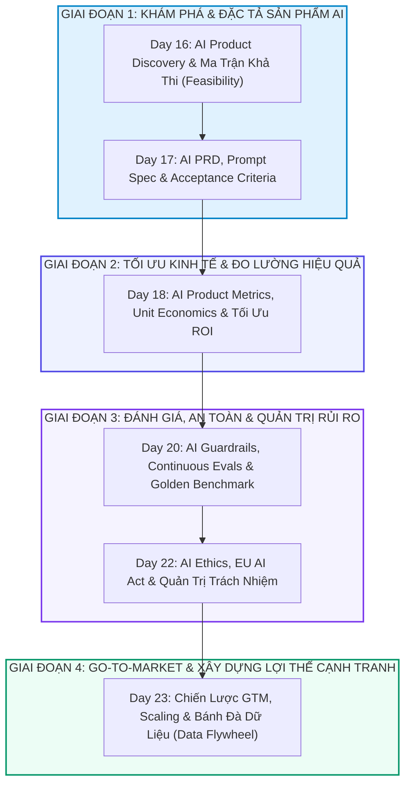

# 🏛️ TỔNG HỢP TOÀN KHÓA: AI PRODUCT MANAGEMENT & CHIẾN LƯỢC SẢN PHẨM AI DOANH NGHIỆP (TRACK 1 - 6 DAYS)
> **Hệ thống khóa học:** VLearn AI Specialist Courseware | **Phân hệ:** Track 1: AI Product Management (Day 16, 17, 18, 20, 22, 23) | **Tiêu chuẩn học thuật:** VinUni COMP2010 / Kỹ sư AI Quốc Tế | **Bộ đôi tài liệu:** NotebookLM Optimized (.md) & Word Typography (.docx)

---

## 🗺️ 1. BẢN ĐỒ KIẾN TRÚC TỔNG THỂ (MASTER ARCHITECTURE MAP)



Track 1: AI Product Management trang bị tư duy chiến lược và bộ công cụ thực chiến toàn diện cho Giám đốc Sản phẩm AI (AI Product Manager) và các nhà lãnh đạo công nghệ, bao quát toàn bộ vòng đời sản phẩm từ xác định cơ hội AI, viết PRD chuẩn xác, định giá theo Unit Economics, thiết lập khung kiểm thử Evals, quản trị an toàn đạo đức cho đến xây dựng chiến lược Go-To-Market và rào cản phòng thủ (Data Moat).

Chương trình kết nối liền mạch giữa bài toán kinh doanh (Business Value) và ranh giới kỹ thuật (Technical Feasibility), giúp AI PM tự tin ra quyết định kiến trúc, tối ưu hóa ngân sách và đưa sản phẩm AI ra thị trường thành công với độ tin cậy tuyệt đối.

---

## 📚 2. TÓM LƯỢC MẠCH KIẾN THỨC TOÀN DIỆN XUYÊN SUỐT CÁC NGÀY HỌC

### 📌 MODULE 1: KHÁM PHÁ CƠ HỘI AI, MA TRẬN KHẢ THI & MÔ HÌNH TÂM LÝ NGƯỜI DÙNG (DAY 16)
Phương pháp xác định bài toán kinh doanh phù hợp cho AI và thiết kế trải nghiệm người dùng thích ứng với tính bất định (Probabilistic UX).

*   **Ma trận Khả thi AI:** Đánh giá bài toán dựa trên 2 trục: Giá trị kinh doanh (Business Impact) và Độ khả thi kỹ thuật (Technical Feasibility / Data Readiness). Tránh bẫy 'dùng búa AI đi tìm đinh'.
*   **Tâm lý học Người dùng trong GenAI:** Khác với phần mềm tất định (Deterministic), sản phẩm AI có tính xác suất. Cần thiết kế các cơ chế dung sai (Tolerance UX), cung cấp khả năng can thiệp/chỉnh sửa của người dùng (User Override) và minh bạch hóa nguồn gốc thông tin.

### 📌 MODULE 2: SOẠN THẢO AI PRD, ĐẶC TẢ PROMPT & TIÊU CHUẨN NGHIỆM THU (DAY 17)
Kỹ năng cốt lõi của AI PM trong việc chuyển dịch yêu cầu nghiệp vụ thành bản vẽ kỹ thuật AI PRD chi tiết.

*   **Cấu trúc AI PRD Chuẩn mực:** Bao gồm: Mục tiêu & Phạm vi bài toán, Chỉ số đo lường thành công (North Star Metric), Đặc tả Prompt & JSON Schema đầu ra, Ngân sách độ trễ (Latency Budget) và Kế hoạch xử lý trường hợp ngoại lệ (Fallback & Graceful Degradation).
*   **Tiêu chuẩn Nghiệm thu AI:** Xác định rõ tỷ lệ chính xác mục tiêu (ví dụ: F1-score > 0.92, Hallucination Rate < 1%), ngưỡng từ chối trả lời (Confidence Threshold) và các kịch bản kiểm thử biên (Edge Cases).

### 📌 MODULE 3: HỆ THỐNG CHỈ SỐ, UNIT ECONOMICS & TỐI ƯU HÓA ROI (DAY 18)
Quản trị tài chính và mô hình hóa chi phí vận hành suy luận (Inference Cost Modeling) cho sản phẩm AI.

*   **Unit Economics trong GenAI:** Mô hình hóa chi phí trên từng truy vấn: Cost_per_Query = (Input_Tokens × P_in + Output_Tokens × P_out) / 1000 + Infrastructure_Cost. Đảm bảo LTV (Lifetime Value) lớn hơn ít nhất 3x so với CAC (Customer Acquisition Cost) sau khi trừ chi phí API.
*   **Chiến lược Tối ưu Hóa Chi phí:** Kết hợp Caching (Semantic Cache giảm 50% API calls), Model Cascading / Tiering (định tuyến 80% câu hỏi đơn giản về Small Model) và Prompt Compression để kéo biên lợi nhuận gộp lên trên 70%.

### 📌 MODULE 4: ĐÁNH GIÁ LIÊN TỤC, GUARDRAILS & KIỂM ĐỊNH CHẤT LƯỢNG (DAY 20)
Xây dựng hạ tầng kiểm thử chất lượng tự động và bảo vệ sản phẩm trước các cuộc tấn công dữ liệu.

*   **Khung Đánh giá Evals Tự động:** Xây dựng tập dữ liệu kiểm thử vàng (Golden Evaluation Dataset) đa dạng các tình huống; sử dụng phương pháp LLM-as-a-Judge kết hợp các chỉ số định lượng để đo lường liên tục trong quy trình CI/CD.
*   **Hệ thống Phòng thủ Đa tầng Guardrails:** Thiết lập Input Guardrails (phát hiện Jailbreak, Prompt Injection, chặn nội dung độc hại) và Output Guardrails (che giấu PII, kiểm duyệt ngôn từ, kiểm tra tính trung thực Groundedness trước khi phản hồi người dùng).

### 📌 MODULE 5: ĐẠO ĐỨC AI, TUÂN THỦ PHÁP LÝ, GO-TO-MARKET & LỢI THẾ PHÒNG THỦ (DAYS 22 - 23)
Đưa sản phẩm AI ra thị trường quy mô lớn, tuân thủ các quy định quốc tế và xây dựng hào phòng thủ dữ liệu bền vững.

*   **Tuân thủ EU AI Act & Đạo đức AI:** Phân loại mức độ rủi ro hệ thống AI (Unacceptable, High-Risk, Specific Transparency, Minimal Risk). Đảm bảo tính giải thích được (Explainability), công bằng (Fairness) và quyền riêng tư theo GDPR.
*   **Chiến lược GTM & Bánh đà Dữ liệu:** Thiết kế vòng lặp phản hồi người dùng (User Feedback Loop / RLHF Data Engine): Sản phẩm tốt → Nhiều người dùng → Thu thập nhiều dữ liệu độc quyền → Cải thiện mô hình → Tạo Hào phòng thủ cạnh tranh (Data Moat) không thể sao chép.

---

## 🔑 3. BẢNG MA TRẬN THUẬT NGỮ & KHUNG NĂNG LỰC CỐT LÕI

| Thuật ngữ | Khái niệm kỹ thuật chuyên sâu | Ý nghĩa thiết kế hệ thống |
| :--- | :--- | :--- |
| **AI PRD** | Bản đặc tả yêu cầu sản phẩm AI bao gồm Prompt Specs, Latency Budget, Fallback flows và Evals. | Văn bản xương sống kết nối giữa đội ngũ Kinh doanh và Kỹ sư AI. |
| **Unit Economics GenAI** | Mô hình đo lường chi phí suy luận trên từng tương tác người dùng so với doanh thu tạo ra. | Quyết định sự sống còn và khả năng mở rộng quy mô sinh lời của sản phẩm. |
| **Probabilistic UX** | Triết lý thiết kế trải nghiệm người dùng chấp nhận tính bất định và sai số thống kê của AI. | Tạo cảm giác tin cậy và trao quyền kiểm soát/chỉnh sửa cho người dùng. |
| **Golden Dataset** | Tập dữ liệu câu hỏi và câu trả lời chuẩn được chuyên gia thẩm định dùng để chạy Evals tự động. | Thước đo khách quan bảo vệ sản phẩm không bị thoái hóa chất lượng sau mỗi lần cập nhật. |
| **Latency Budget** | Hạn mức thời gian tối đa cho từng thành phần (ASR, Retrieval, LLM TTFT, TTS) trong luồng sản phẩm. | Đảm bảo trải nghiệm tương tác thời gian thực không gây ức chế cho người dùng. |
| **Hallucination Rate** | Tỷ lệ phần trăm câu trả lời chứa thông tin sai sự thật hoặc bịa đặt ngoài ngữ cảnh. | Chỉ số an toàn quan trọng nhất cần kiểm soát dưới 1% trước khi phát hành. |
| **Model Tiering** | Cơ chế định tuyến thông minh chuyển các truy vấn đơn giản cho mô hình nhỏ giá rẻ. | Giảm từ 60% đến 80% chi phí hóa đơn API hàng tháng. |
| **EU AI Act Compliance** | Khung pháp lý phân loại rủi ro và áp đặt các nghĩa vụ minh bạch, kiểm toán đối với hệ thống AI. | Điều kiện bắt buộc để sản phẩm AI thâm nhập thị trường châu Âu và toàn cầu. |
| **Data Flywheel** | Vòng lặp tự củng cố: Dữ liệu sử dụng thực tế được tái sử dụng để tinh chỉnh mô hình vượt trội hơn. | Rào cản phòng thủ duy nhất giúp sản phẩm không bị mô hình nền tảng vượt qua. |
| **Shadow Deployment** | Kỹ thuật thử nghiệm phiên bản AI mới bằng cách nhân bản traffic thực mà không hiển thị cho người dùng. | Kiểm thử an toàn độ ổn định và chất lượng trước khi chuyển đổi 100% người dùng. |

---

## 🎯 4. BỘ ĐỀ THI TỔNG HỢP TOÀN KHÓA (COMPREHENSIVE MASTER EXAM)

### 📝 PHẦN A: CÁC CÂU TRẮC NGHIỆM ĐƠN (20 CÂU SINGLE-CHOICE)

#### Câu 1: Khi đánh giá cơ hội ứng dụng AI cho một tính năng mới theo Ma trận Khả thi (AI Feasibility Matrix), đâu là tiêu chí then chốt để quyết định có nên dùng LLM hay không?
*   A. Tính năng đòi hỏi giải quyết bài toán xử lý ngôn ngữ/ngữ nghĩa phức tạp mà các thuật toán dựa trên tập luật (Rule-based) không thể đáp ứng hiệu quả, đồng thời bài toán có dung sai sai số chấp nhận được từ người dùng.
*   B. Tính năng yêu cầu độ chính xác tuyệt đối 100.000% không bao giờ được phép có sai số số học.
*   C. Doanh nghiệp muốn nâng giá trị cổ phiếu bằng cách đưa từ khóa AI vào thông cáo báo chí.
*   D. Chi phí xây dựng tính năng AI luôn rẻ hơn việc viết mã lập trình truyền thống.
> **👉 ĐÁP ÁN ĐÚNG: A**  
> **💡 Giải thích chi tiết & Bẫy logic:** GenAI là công nghệ xác suất, phù hợp nhất với các bài toán mở, sáng tạo nội dung, trích xuất ngữ nghĩa và hiểu ngôn ngữ tự nhiên nơi có thể dung sai sai số; không nên dùng LLM cho các bài toán đòi hỏi tính tất định 100% (như tính tiền giao dịch ngân hàng).

---

#### Câu 2: Điểm khác biệt cốt lõi nhất giữa một bản PRD phần mềm truyền thống và một bản AI PRD là gì?
*   A. AI PRD bắt buộc phải định nghĩa các đặc tả phi tất định: Prompt Specs, Ma trận dung sai sai số (Tolerance Matrix), Ngân sách độ trễ (Latency Budget), và Cơ chế dự phòng khi AI sinh kết quả sai (Fallback Flows).
*   B. AI PRD không cần xác định chân dung khách hàng mục tiêu.
*   C. AI PRD chỉ do các nhà nghiên cứu dữ liệu (Data Scientists) viết mà không cần Product Manager.
*   D. AI PRD không bao gồm các chỉ số đo lường kinh doanh.
> **👉 ĐÁP ÁN ĐÚNG: A**  
> **💡 Giải thích chi tiết & Bẫy logic:** Khác với phần mềm truyền thống có đầu ra tất định (deterministic), AI PRD phải thiết kế cho đầu ra xác suất, bao gồm System Prompts, JSON output schema, ngưỡng chấp nhận ảo giác, và quy trình xử lý khi mô hình từ chối hoặc trả về sai.

---

#### Câu 3: Trong thiết kế trải nghiệm người dùng cho sản phẩm GenAI (Probabilistic UX), kỹ thuật nào giúp gia tăng niềm tin và sự hài lòng của người dùng hiệu quả nhất?
*   A. Ẩn hoàn toàn thực tế rằng hệ thống đang sử dụng trí tuệ nhân tạo.
*   B. Không cho phép người dùng sửa đổi bất kỳ nội dung nào do AI tạo ra.
*   C. Cung cấp các bằng chứng trích dẫn nguồn (Citations / Inline Footnotes) minh bạch, kèm cơ chế biên tập/ghi đè dễ dàng (User In-place Editing) và nút tái tạo linh hoạt.
*   D. Tự động gửi câu trả lời ngay lập tức mà không cần người dùng xác nhận các thao tác quan trọng.
> **👉 ĐÁP ÁN ĐÚNG: C**  
> **💡 Giải thích chi tiết & Bẫy logic:** Minh bạch hóa nguồn trích dẫn giúp người dùng kiểm chứng thông tin (giảm nỗi sợ ảo giác), và tính năng In-place editing trao quyền kiểm soát cho người dùng, biến AI thành trợ lý đắc lực thay vì một hệ thống áp đặt.

---

#### Câu 4: Một AI Product Manager tính toán Unit Economics cho một tính năng Chatbot AI: Chi phí trung bình mỗi truy vấn là 0.02 USD, người dùng thực hiện 100 truy vấn/tháng. Giá gói thuê bao tối thiểu mà PM cần đề xuất để đảm bảo biên lợi nhuận gộp dịch vụ đạt 60% (chưa tính chi phí cố định khác) là bao nhiêu?
*   A. 2.00 USD / tháng.
*   B. 3.20 USD / tháng.
*   C. 4.00 USD / tháng.
*   D. 5.00 USD / tháng.
> **👉 ĐÁP ÁN ĐÚNG: D**  
> **💡 Giải thích chi tiết & Bẫy logic:** Tổng chi phí API hàng tháng = 100 × 0.02 = 2.00 USD. Để biên lợi nhuận gộp = 60%, chi phí chiếm 40% doanh thu. Doanh thu cần đạt = 2.00 / 0.40 = 5.00 USD/tháng.

---

#### Câu 5: Kỹ thuật 'Semantic Caching' giúp cải thiện trực tiếp chỉ số Unit Economics của sản phẩm AI như thế nào?
*   A. Bắt người dùng phải trả thêm phí đăng ký để sử dụng bộ đệm.
*   B. Tự động xóa bớt các câu hỏi cũ trong lịch sử của người dùng sau 24 giờ.
*   C. Lưu trữ các câu hỏi và câu trả lời tương đồng ngữ nghĩa trong cơ sở dữ liệu vector; khi gặp câu hỏi tương tự (> 90% cosine similarity), hệ thống trả về kết quả đệm ngay lập tức với chi phí API bằng 0 và độ trễ < 20ms.
*   D. Giảm chất lượng của mô hình ngôn ngữ xuống 50% để tiết kiệm tiền.
> **👉 ĐÁP ÁN ĐÚNG: C**  
> **💡 Giải thích chi tiết & Bẫy logic:** Trong sản phẩm thực tế, 30%-50% câu hỏi của người dùng có nội dung tương tự nhau (FAQ, tra cứu chính sách). Semantic Caching phục vụ trực tiếp các truy vấn này mà không cần gọi mô hình LLM đắt đỏ, giảm mạnh chi phí hóa đơn và tăng vọt tốc độ phản hồi.

---

#### Câu 6: Để đảm bảo quy trình kiểm định chất lượng sản phẩm AI (Continuous Evaluation) diễn ra khách quan và tái lập được, AI PM cần xây dựng thành phần nào làm trọng tâm?
*   A. Một trang khảo sát ý kiến ngẫu nhiên trên mạng xã hội.
*   B. Bảng đánh giá năng lực cá nhân của các kỹ sư trong nhóm phát triển.
*   C. Một bộ tiêu chuẩn kiểm thử vàng (Golden Evaluation Benchmark) gồm hàng trăm tình huống thực tế kèm nhãn chuẩn từ chuyên gia, chạy tự động qua CI/CD trước mỗi bản phát hành.
*   D. Danh sách các bài báo nghiên cứu lý thuyết mới nhất trên ArXiv.
> **👉 ĐÁP ÁN ĐÚNG: C**  
> **💡 Giải thích chi tiết & Bẫy logic:** Golden Benchmark đại diện cho phân phối dữ liệu thực tế và các tình huống biên hiểm hóc. Chạy tự động Golden Benchmark trong CI/CD đảm bảo việc tinh chỉnh prompt hoặc đổi model không gây ra hiện tượng thoái hóa chất lượng (Regression).

---

#### Câu 7: Chỉ số North Star Metric lý tưởng cho một sản phẩm AI Trợ lý Viết Hợp đồng Pháp lý (AI Legal Assistant) nên là chỉ số nào sau đây?
*   A. Tổng số lượng từ ngữ mà mô hình AI đã sinh ra trong tháng.
*   B. Số lượt nhấp chuột vào nút 'Tạo hợp đồng' trên giao diện.
*   C. Tỷ lệ điều khoản hợp đồng do AI đề xuất được luật sư chấp nhận không cần sửa đổi (Acceptance Rate) và thời gian hoàn tất một hợp đồng giảm (Time Saved per Contract).
*   D. Điểm số benchmark MMLU của mô hình nền tảng bên dưới.
> **👉 ĐÁP ÁN ĐÚNG: C**  
> **💡 Giải thích chi tiết & Bẫy logic:** North Star Metric của sản phẩm AI phải phản ánh trực tiếp giá trị thực tế mang lại cho người dùng cuối (chất lượng bản nháp được chấp nhận và thời gian tiết kiệm thực sự), chứ không phải các vanity metrics như số từ sinh ra hay điểm số học thuật thuần túy.

---

#### Câu 8: Khi phát hiện hiện tượng rò rỉ dữ liệu nhạy cảm PII (Personally Identifiable Information) trong câu trả lời của AI, giải pháp xử lý cấp sản phẩm (Product Guardrail) ưu tiên hàng đầu là gì?
*   A. Gửi email xin lỗi đến tất cả người dùng trong hệ thống.
*   B. Tạm thời ngừng cung cấp dịch vụ trong 6 tháng để đào tạo lại mô hình nền tảng từ đầu.
*   C. Khuyên người dùng không nên nhập các thông tin nhạy cảm vào ô chat.
*   D. Kích hoạt tầng Output Redaction Filter tự động phát hiện bằng biểu thức chính quy/NER model và che giấu (Masking) số tài khoản, CCCD/CMND, email trước khi gửi tới giao diện người dùng.
> **👉 ĐÁP ÁN ĐÚNG: D**  
> **💡 Giải thích chi tiết & Bẫy logic:** Output Guardrail với cơ chế Data Redaction/Masking (ví dụ: chuyển 0912345678 thành 0912***678) hoạt động như chốt chặn an toàn cuối cùng độc lập với LLM, đảm bảo không một thông tin cá nhân nhạy cảm nào bị lộ ra ngoài giao diện.

---

#### Câu 9: Theo Đạo luật Trí tuệ Nhân tạo của Liên minh Châu Âu (EU AI Act), các ứng dụng AI trong lĩnh vực Chấm điểm Tín dụng Tự động (Credit Scoring) hoặc Tuyển dụng Nhân sự được xếp vào phân nhóm rủi ro nào?
*   A. Nhóm Rủi ro Cao (High-Risk AI Systems) - bắt buộc phải tuân thủ các nghĩa vụ nghiêm ngặt về quản trị chất lượng dữ liệu, tính minh bạch, lưu vết kiểm toán và có sự giám sát của con người (Human Oversight).
*   B. Nhóm Rủi ro Không Thể Chấp Nhận (Unacceptable Risk) - bị cấm hoàn toàn không được phép triển khai.
*   C. Nhóm Rủi ro Tối thiểu (Minimal Risk) - hoàn toàn không chịu bất kỳ quy định quản lý nào.
*   D. Nhóm Rủi ro Kỹ thuật Phần cứng - chỉ áp dụng cho nhà sản xuất chip bán dẫn.
> **👉 ĐÁP ÁN ĐÚNG: A**  
> **💡 Giải thích chi tiết & Bẫy logic:** EU AI Act phân loại các hệ thống ảnh hưởng trực tiếp đến cơ hội việc làm, tài chính và quyền công dân của con người vào nhóm High-Risk, đòi hỏi hệ thống quản lý rủi ro, dữ liệu huấn luyện không thiên kiến và quyền kháng nghị của người dùng.

---

#### Câu 10: Khái niệm 'Bánh đà Dữ liệu' (Data Flywheel / Data Moat) trong chiến lược cạnh tranh của sản phẩm AI được hiểu như thế nào?
*   A. Mua lại các tập dữ liệu công khai trên Internet với số lượng lớn nhất có thể.
*   B. Xây dựng trung tâm máy chủ lưu trữ dữ liệu lớn nhất trong khu vực.
*   C. Cài đặt các phần mềm gián điệp để thu thập dữ liệu bí mật của đối thủ.
*   D. Vòng lặp chiến lược: Sản phẩm có trải nghiệm tốt thu hút nhiều người dùng → Người dùng tạo ra dữ liệu tương tác độc quyền (Proprietary Feedback/Edits) → Dữ liệu này dùng để tinh chỉnh mô hình vượt trội → Sản phẩm tốt hơn và tạo rào cản phòng thủ không thể sao chép.
> **👉 ĐÁP ÁN ĐÚNG: D**  
> **💡 Giải thích chi tiết & Bẫy logic:** Mô hình nền tảng (Foundation Models) như GPT hay Claude ngày càng bị hàng hóa hóa (Commoditized). Lợi thế cạnh tranh phòng thủ bền vững duy nhất của AI Startup/Doanh nghiệp đến từ vòng lặp dữ liệu người dùng độc quyền (Data Flywheel) trong thị trường ngách.

---

#### Câu 11: Khi thiết kế kế hoạch ra mắt tính năng AI mới ra thị trường (Go-To-Market Strategy), phương pháp triển khai 'Canary Release' hoặc 'Phased Rollout' mang lại lợi ích an toàn cốt lõi nào?
*   A. Cho phép tính phí gấp đôi đối với những người dùng đầu tiên.
*   B. Loại bỏ hoàn toàn sự cần thiết của đội ngũ Chăm sóc Khách hàng.
*   C. Phát hành tính năng mới cho một tỷ lệ nhỏ người dùng (ví dụ: 5% -> 25% -> 100%) để theo dõi tỷ lệ lỗi, độ trễ P95 và các phản hồi bất thường trước khi mở rộng quy mô toàn diện.
*   D. Đảm bảo đối thủ cạnh tranh không thể biết về tính năng mới.
> **👉 ĐÁP ÁN ĐÚNG: C**  
> **💡 Giải thích chi tiết & Bẫy logic:** Phased Rollout giúp AI PM cô lập rủi ro: nếu mô hình mới gặp lỗi ảo giác nghiêm trọng hoặc gây nghẽn tải hạ tầng, chỉ một lượng nhỏ người dùng bị ảnh hưởng và hệ thống có thể rollback ngay lập tức mà không làm gián đoạn toàn bộ dịch vụ.

---

#### Câu 12: Để xử lý sự cố khi nhà cung cấp mô hình AI chính (Primary LLM Provider) gặp sự cố ngừng hoạt động (Outage), kiến trúc sản phẩm AI của PM bắt buộc phải có tính năng nào?
*   A. Tự động hiển thị trang thông báo lỗi 404 cho người dùng.
*   B. Đóng băng toàn bộ hoạt động kinh doanh của công ty cho đến khi nhà cung cấp khắc phục xong.
*   C. Gửi email yêu cầu người dùng quay lại sau 24 giờ.
*   D. Cơ chế Chuyển đổi Dự phòng Tự động (Multi-Provider Fallback Routing) định tuyến truy vấn sang mô hình tương đương của nhà cung cấp khác (ví dụ: OpenAI gặp sự cố chuyển sang Anthropic/Google Cloud Vertex) theo SLA định sẵn.
> **👉 ĐÁP ÁN ĐÚNG: D**  
> **💡 Giải thích chi tiết & Bẫy logic:** Tính liên tục trong kinh doanh (Business Continuity) đòi hỏi kiến trúc sản phẩm AI phải trừu tượng hóa tầng Provider (thông qua AI Gateway như LiteLLM / Portkey), tự động fallback sang mô hình phụ khi mô hình chính gặp lỗi timeout hoặc HTTP 5xx.

---

#### Câu 13: Khi người dùng liên tục phàn nàn rằng phản hồi của Chatbot AI 'quá dài dòng và không đúng trọng tâm', đâu là hành động can thiệp tối ưu nhất ở tầng Product Management?
*   A. Tinh chỉnh System Prompt áp dụng kỹ thuật định dạng cấu trúc nghiêm ngặt (Output Structuring với Markdown Bullet points và giới hạn độ dài Length Constraint), kết hợp cập nhật Few-shot examples mẫu mực trong Prompt Spec.
*   B. Thay đổi màu sắc của khung chat sang màu đỏ để cảnh báo người dùng.
*   C. Tăng giá cước sử dụng của Chatbot lên gấp đôi.
*   D. Xóa bỏ hoàn toàn tính năng chat và chuyển sang dạng biểu mẫu tĩnh.
> **👉 ĐÁP ÁN ĐÚNG: A**  
> **💡 Giải thích chi tiết & Bẫy logic:** Tinh chỉnh System Prompt với cấu trúc rõ ràng (ví dụ: 'Chỉ trả lời trong tối đa 3 gạch đầu dòng, không thêm lời mở đầu xã giao') và bổ sung ví dụ Few-shot chất lượng cao là cách can thiệp nhanh nhất, rẻ nhất và hiệu quả nhất của AI PM.

---

#### Câu 14: Trong bài toán tối ưu hóa chuyển đổi phễu người dùng (User Funnel Optimization) cho sản phẩm AI B2B, việc cung cấp 'Bản dùng thử có giới hạn số lượng câu hỏi miễn phí' (Freemium với Usage Cap) mang lại tác động tích cực nào?
*   A. Khiến công ty bị lỗ vốn không thể bù đắp.
*   B. Loại bỏ hoàn toàn sự cần thiết của đội ngũ bán hàng Enterprise.
*   C. Bắt buộc tất cả người dùng phải nhập thẻ tín dụng ngay từ giây đầu tiên.
*   D. Giúp khách hàng tiềm năng trải nghiệm trực tiếp 'Khoảnh khắc Aha' (Aha Moment) về giá trị của AI mà không gặp rào cản thanh toán ban đầu, đồng thời bảo vệ công ty khỏi nguy cơ bùng nổ chi phí API do lạm dụng.
> **👉 ĐÁP ÁN ĐÚNG: D**  
> **💡 Giải thích chi tiết & Bẫy logic:** Usage-capped Freemium cho phép người dùng kiểm chứng năng lực AI trên bài toán thực tế của họ (kích hoạt Time-to-Value), trong khi giới hạn số lượt truy vấn (Cap) ngăn chặn các bot cào dữ liệu làm tiêu tốn ngân sách API của doanh nghiệp.

---

#### Câu 15: Khi một tính năng AI có tỷ lệ từ chối trả lời (Refusal Rate) quá cao (trên 25%) do các bộ lọc an toàn quá nhạy cảm (Over-moderation / False Positives), AI PM cần thực hiện điều chỉnh gì?
*   A. Tắt hoàn toàn tất cả các tầng bảo vệ an toàn của hệ thống.
*   B. Tinh chỉnh lại ngưỡng tin cậy (Confidence Thresholds) của bộ phân loại an toàn và viết lại quy tắc chính sách (Safety Policy Prompt) phân biệt rõ giữa truy vấn thảo luận học thuật/lành tính và tấn công thực sự.
*   C. Sa thải toàn bộ đội ngũ kỹ sư an toàn AI.
*   D. Chuyển sang sử dụng mô hình không có kiểm duyệt từ các nguồn không chính thức.
> **👉 ĐÁP ÁN ĐÚNG: B**  
> **💡 Giải thích chi tiết & Bẫy logic:** Over-moderation gây ức chế lớn cho người dùng hợp pháp (ví dụ: hỏi về bệnh lý y khoa bị từ chối vì nhầm với nội dung độc hại). Cần tinh chỉnh ngưỡng phân loại và tinh chỉnh system rules để cân bằng giữa An toàn (Safety) và Tính hữu ích (Helpfulness).

---

#### Câu 16: Chỉ số 'Time-to-Value' (TTV) của một sản phẩm AI tạo sinh được định nghĩa và tối ưu hóa như thế nào?
*   A. Thời gian cần thiết để công ty hoàn vốn đầu tư mua sắm phần cứng máy chủ.
*   B. Khoảng thời gian từ lúc người dùng đăng ký tài khoản đến khi họ nhận được giá trị hữu ích đầu tiên (First Useful Output) từ AI, được tối ưu hóa qua các Prompt Templates có sẵn và quy trình Onboarding thông minh.
*   C. Thời gian mà mô hình AI cần để đọc hết một cuốn sách giáo khoa.
*   D. Thời gian từ lúc viết PRD đến khi bảo vệ xong đồ án tốt nghiệp.
> **👉 ĐÁP ÁN ĐÚNG: B**  
> **💡 Giải thích chi tiết & Bẫy logic:** TTV trong sản phẩm AI đo lường tốc độ người dùng nhận được kết quả mong muốn. Rút ngắn TTV (qua các mẫu prompt gợi ý, 1-click generation, auto-fill context) là yếu tố sống còn để tăng tỷ lệ kích hoạt (Activation Rate) của người dùng mới.

---

#### Câu 17: Trong quản trị rủi ro Sở hữu Trí tuệ (IP & Copyright Risks) cho sản phẩm AI sinh hình ảnh hoặc văn bản, AI PM cần đưa ra chính sách bảo vệ nào cho khách hàng doanh nghiệp?
*   A. Cam kết Bồi thường Bản quyền (Copyright Indemnification) từ nhà cung cấp mô hình nền tảng, kết hợp bộ lọc kiểm tra trùng lặp bản quyền trước khi xuất kết quả thương mại.
*   B. Tuyên bố từ chối mọi trách nhiệm pháp lý trong điều khoản sử dụng.
*   C. Cấm người dùng sử dụng sản phẩm cho bất kỳ mục đích thương mại nào.
*   D. Yêu cầu người dùng tự nộp đơn xin bản quyền cho từng câu trả lời của AI.
> **👉 ĐÁP ÁN ĐÚNG: A**  
> **💡 Giải thích chi tiết & Bẫy logic:** Các khách hàng doanh nghiệp lớn (Enterprise B2B) chỉ mua sản phẩm AI khi có cam kết bồi thường pháp lý (Indemnification) chống lại các vụ kiện vi phạm bản quyền từ dữ liệu huấn luyện, đi kèm bộ lọc kiểm tra nội dung trùng lặp.

---

#### Câu 18: Hiện tượng 'Model Drift' hoặc 'Prompt Fragility' trong môi trường Production ảnh hưởng đến sản phẩm AI như thế nào?
*   A. Tự động đổi giao diện web sang ngôn ngữ khác mà không báo trước.
*   B. Hiệu năng và độ chính xác của sản phẩm bị suy giảm đột ngột khi nhà cung cấp cập nhật phiên bản mô hình nền tảng ngầm định, đòi hỏi PM phải cố định phiên bản mô hình (Pinned Model Version) trong production.
*   C. Làm tăng nhiệt độ phần cứng của máy chủ lên mức nguy hiểm.
*   D. Khiến toàn bộ dữ liệu người dùng bị mã hóa tống tiền.
> **👉 ĐÁP ÁN ĐÚNG: B**  
> **💡 Giải thích chi tiết & Bẫy logic:** Sử dụng các alias như `gpt-4-turbo` hoặc `claude-3-sonnet` có thể bị trôi dạt hành vi khi nhà cung cấp âm thầm cập nhật trọng số. AI PM chuyên nghiệp luôn ghim mã phiên bản cố định (như `gpt-4-0125-preview`) và chạy lại Evals trước khi nâng cấp version.

---

#### Câu 19: Để giải quyết mâu thuẫn giữa yêu cầu Bảo mật Dữ liệu Nội bộ của Doanh nghiệp (Data Privacy) và lợi ích của việc dùng Frontier LLMs trên Cloud, giải pháp sản phẩm nào là tối ưu?
*   A. Buộc doanh nghiệp phải công khai toàn bộ tài liệu nội bộ lên Internet.
*   B. Sử dụng kiến trúc Private VPC / On-Premise Deployment với hợp đồng Zero Data Retention (ZDR) cam kết không sử dụng dữ liệu khách hàng để huấn luyện mô hình.
*   C. Yêu cầu nhân viên ghi nhớ tài liệu và gõ thủ công từng câu vào hệ thống.
*   D. Từ chối phục vụ tất cả các khách hàng có yêu cầu bảo mật cao.
> **👉 ĐÁP ÁN ĐÚNG: B**  
> **💡 Giải thích chi tiết & Bẫy logic:** Các thỏa thuận Enterprise ZDR (Zero Data Retention) trên môi trường Cloud riêng (Azure OpenAI, AWS Bedrock) đảm bảo dữ liệu prompt không bị lưu trữ hay dùng để train mô hình, đáp ứng tiêu chuẩn SOC2, HIPAA và ISO 27001 của khách hàng doanh nghiệp.

---

#### Câu 20: Khi đo lường độ gắn kết người dùng (User Retention & Engagement) cho một sản phẩm Copilot AI chuyên ngành, tỷ lệ nào sau đây phản ánh độ phụ thuộc tích cực vào AI cao nhất?
*   A. Tỷ lệ người dùng mở ứng dụng nhưng không nhập bất kỳ câu hỏi nào.
*   B. Tỷ lệ DAU/MAU (Daily Active Users / Monthly Active Users) kết hợp với Tỷ lệ Chấp nhận Gợi ý AI (AI Suggestion Acceptance Rate > 60%) trong các phiên làm việc cốt lõi.
*   C. Số lượng đánh giá 1 sao trên kho ứng dụng.
*   D. Thời gian người dùng chờ đợi câu trả lời từ máy chủ.
> **👉 ĐÁP ÁN ĐÚNG: B**  
> **💡 Giải thích chi tiết & Bẫy logic:** Tỷ lệ DAU/MAU cao chứng minh thói quen sử dụng hàng ngày (Stickiness), và Acceptance Rate cao chứng minh các gợi ý của Copilot thực sự có giá trị chuyên môn cao giúp người dùng hoàn thành công việc nhanh hơn.

---

### 📚 PHẦN B: CÁC CÂU TRẮC NGHIỆM NHIỀU ĐÁP ÁN (12 CÂU MULTI-SELECT)

#### Câu 21 (Chọn 2 đáp án): Những thành phần cốt lõi nào bắt buộc phải có trong một bản Kế hoạch Kinh doanh Sản phẩm AI (AI Product Business Case) để thuyết phục Ban Giám đốc phê duyệt đầu tư?
*   A. Bảng phân tích Tỷ suất Hoàn vốn (ROI Projection) và Mô hình hóa Chi phí Đơn vị (Unit Economics: CAC, LTV, Cost per API call) theo quy mô tăng trưởng người dùng.
*   B. Kế hoạch Quản trị Rủi ro An toàn và Đạo đức AI (Risk Mitigation Plan: Hallucination rate, PII leakage, Fallback SLA).
*   C. Danh sách các trò chơi điện tử yêu thích của nhóm phát triển.
*   D. Bản vẽ thiết kế mạch điện tử của card đồ họa GPU.
> **👉 ĐÁP ÁN ĐÚNG: A, B**  
> **💡 Giải thích chi tiết & Bẫy logic:** Bản Business Case cho AI cần chứng minh hiệu quả tài chính bền vững (ROI & Unit Economics) và kế hoạch kiểm soát rủi ro pháp lý/an toàn đặc thù của AI. C và D hoàn toàn không liên quan.

---

#### Câu 22 (Chọn 2 đáp án): Khi thiết kế cơ chế Thu thập Phản hồi Người dùng (User Feedback Mechanism) trong giao diện sản phẩm AI, hai hình thức nào cung cấp tín hiệu dữ liệu giá trị nhất để tinh chỉnh mô hình?
*   A. Phản hồi ngầm định (Implicit Feedback): Hành vi Copy câu trả lời, thao tác Chấp nhận/Chèn bản nháp (Accept/Insert), hoặc Hành vi Biên tập trực tiếp (User Edits).
*   B. Phản hồi tường minh có ngữ cảnh (Explicit Feedback with Context): Đánh giá Thumbs Up / Thumbs Down kèm lý do cụ thể (chọn tag: Ảo giác, Quá dài, Sai sự thật...).
*   C. Việc người dùng tắt màn hình máy tính.
*   D. Tốc độ gõ phím của người dùng trên bàn phím vật lý.
> **👉 ĐÁP ÁN ĐÚNG: A, B**  
> **💡 Giải thích chi tiết & Bẫy logic:** Implicit feedback (hành động sao chép, sửa đổi trực tiếp) là dữ liệu vàng cho DPO/SFT, trong khi Explicit feedback có tag lý do giúp phân loại lỗi để debug prompt và cập nhật Golden Dataset. C và D không phản ánh chất lượng AI.

---

#### Câu 23 (Chọn 2 đáp án): Để tối ưu hóa chi phí vận hành API cho một sản phẩm AI có hàng triệu người dùng hoạt động hàng ngày, AI PM nên áp dụng những chiến lược kiến trúc nào?
*   A. Triển khai Hệ thống Định tuyến Mô hình Thông minh (Smart Model Routing): Phân luồng các câu hỏi đơn giản cho mô hình Small/Open-source rẻ tiền và chỉ dùng Frontier Model cho bài toán khó.
*   B. Tắt toàn bộ hệ thống vào ban đêm để tiết kiệm điện máy chủ.
*   C. Tích hợp Bộ đệm Ngữ nghĩa (Semantic Caching) kết hợp Kỹ thuật Rút gọn Prompt (Prompt Compression / Token Pruning) để giảm số lượng token đầu vào.
*   D. Tăng thời gian phản hồi của mô hình lên 5 phút để người dùng nản lòng bớt hỏi.
> **👉 ĐÁP ÁN ĐÚNG: A, C**  
> **💡 Giải thích chi tiết & Bẫy logic:** Smart Routing và Semantic Caching kết hợp Prompt Compression là 3 trụ cột kỹ thuật tối ưu hóa chi phí hàng đầu giúp giảm 60%-80% hóa đơn suy luận mà không làm suy giảm trải nghiệm người dùng. B và D là các giải pháp phi thực tế.

---

#### Câu 24 (Chọn 2 đáp án): Những nguyên tắc nào sau đây là bắt buộc khi thiết kế Thông báo Minh bạch (AI Transparency Notice) theo tiêu chuẩn đạo đức AI quốc tế?
*   A. Thông báo rõ ràng cho người dùng biết họ đang tương tác với một hệ thống Trí tuệ Nhân tạo chứ không phải con người thật.
*   B. Cung cấp mật khẩu tài khoản quản trị của máy chủ cơ sở dữ liệu cho người dùng.
*   C. Cảnh báo rõ ràng về giới hạn của mô hình (AI có thể sinh thông tin chưa chính xác) và khuyến cáo người dùng kiểm chứng các quyết định quan trọng.
*   D. Đảm bảo mọi dòng mã nguồn của công ty đều được mở công khai trên GitHub.
> **👉 ĐÁP ÁN ĐÚNG: A, C**  
> **💡 Giải thích chi tiết & Bẫy logic:** Minh bạch hóa danh tính tương tác của AI và cảnh báo giới hạn sai số là nghĩa vụ đạo đức và pháp lý cốt lõi theo quy định quốc tế (EU AI Act, FTC guidelines). B và D vi phạm an ninh doanh nghiệp.

---

#### Câu 25 (Chọn 2 đáp án): Khi thiết kế chỉ số đo lường hiệu năng kỹ thuật trong AI PRD, hai chỉ số nào phản ánh trực tiếp chất lượng dịch vụ (SLA) đối với người dùng cuối?
*   A. Time-To-First-Token (TTFT) đo lường độ nhanh nhạy của phản hồi ban đầu.
*   B. Phiên bản hệ điều hành Linux đang cài đặt trên máy chủ.
*   C. Thương hiệu của bàn phím mà kỹ sư AI đang sử dụng.
*   D. Tỷ lệ Lỗi Hệ thống & Timeout (System Error & Timeout Rate < 0.1%) đảm bảo độ sẵn sàng cao của dịch vụ.
> **👉 ĐÁP ÁN ĐÚNG: A, D**  
> **💡 Giải thích chi tiết & Bẫy logic:** TTFT và Error/Timeout Rate là 2 chỉ số SLA kỹ thuật sống còn quyết định cảm nhận mượt mà và độ tin cậy của sản phẩm đối với người dùng. B và C không phải chỉ số SLA sản phẩm.

---

#### Câu 26 (Chọn 2 đáp án): Trong quá trình xây dựng Lợi thế Cạnh tranh Bền vững (Competitive Moats) cho sản phẩm AI Startup, hai yếu tố nào mang lại sức mạnh phòng thủ lớn nhất?
*   A. Sự tích hợp sâu vào quy trình làm việc độc quyền của khách hàng doanh nghiệp (High Switching Costs & Workflow Integration).
*   B. Việc chỉ sử dụng duy nhất các câu lệnh Prompt ngắn gọn từ Internet.
*   C. Đặt tên sản phẩm có chứa chữ AI nhiều lần nhất có thể.
*   D. Sở hữu Bánh đà Dữ liệu Độc quyền (Proprietary Data Flywheel) được tạo ra liên tục từ tương tác chuyên ngành của người dùng thực tế.
> **👉 ĐÁP ÁN ĐÚNG: A, D**  
> **💡 Giải thích chi tiết & Bẫy logic:** Workflow Integration (khiến chi phí thay đổi giải pháp quá cao) và Proprietary Data Flywheel (dữ liệu ngách độc quyền liên tục cải thiện mô hình) là 2 hào phòng thủ mạnh mẽ nhất trước sự bành trướng của các Big Tech LLM providers. B và C là những ảo tưởng nông cạn.

---

#### Câu 27 (Chọn 2 đáp án): Những tiêu chí nào sau đây phân biệt một 'Ý tưởng AI Khả thi' với một 'Ý tưởng AI Bất khả thi hoặc Không nên làm' trong buổi xét duyệt sản phẩm?
*   A. Ý tưởng AI phải giải quyết được nạn đói toàn cầu trong vòng 3 tuần.
*   B. Dữ liệu cần thiết để giải quyết bài toán đã sẵn có, có thể thu thập hợp pháp và có chất lượng đủ tốt để huấn luyện/truy xuất.
*   C. Bài toán có giá trị kinh doanh rõ ràng và người dùng chấp nhận một tỷ lệ sai số nhất định có thể khắc phục được bằng thiết kế trải nghiệm UX.
*   D. Ý tưởng không cần đến bất kỳ lập trình viên nào tham gia phát triển.
> **👉 ĐÁP ÁN ĐÚNG: B, C**  
> **💡 Giải thích chi tiết & Bẫy logic:** Khả thi về dữ liệu (Data Readiness) và Khả thi về giá trị kinh doanh kèm mức độ dung sai sai số (Business Value & Error Tolerance) là 2 điều kiện tiên quyết để một dự án AI được bật đèn xanh. A và D là viển vông.

---

#### Câu 28 (Chọn 2 đáp án): Khi sản phẩm AI gặp lỗi nghiêm trọng do mô hình sinh ra thông tin xúc phạm hoặc vi phạm tiêu chuẩn cộng đồng (Toxicity & Bias), hai bước phản ứng khẩn cấp nào PM cần chỉ đạo?
*   A. Xóa toàn bộ cơ sở dữ liệu khách hàng để phi tang dấu vết.
*   B. Kích hoạt ngay lập tức bộ lọc từ khóa nóng (Emergency Hotfix Blacklist / Rule-based Blocker) tại tầng Guardrail để chặn đứng mẫu câu vi phạm.
*   C. Ghi nhận toàn bộ ngữ cảnh truy vấn gây lỗi vào tập dữ liệu kiểm thử biên (Adversarial Edge Case Dataset) để cập nhật Evals và tái huấn luyện mô hình.
*   D. Đổ lỗi hoàn toàn cho nhà cung cấp mô hình trên mạng xã hội.
> **👉 ĐÁP ÁN ĐÚNG: B, C**  
> **💡 Giải thích chi tiết & Bẫy logic:** Quy trình xử lý sự cố chuẩn gồm: Hotfix ngay ở tầng Guardrail/Blacklist để bảo vệ người dùng, sau đó đưa ca lỗi vào bộ kiểm thử biên để cải tiến toàn diện System Prompt và Evals. A vi phạm pháp luật; D thiếu chuyên nghiệp.

---

#### Câu 29 (Chọn 2 đáp án): Những chỉ số nào sau đây phản ánh chính xác Mức độ Hài lòng và Hiệu quả Thực tế của một Trợ lý AI Phân tích Dữ liệu (AI Data Analyst Copilot)?
*   A. Số lượng ký tự mã SQL mà mô hình đã sinh ra trong ngày.
*   B. Tỷ lệ câu truy vấn SQL do AI sinh ra được thực thi thành công và trả về kết quả chính xác ngay trong lần đầu tiên (First-Query Success Rate > 85%).
*   C. Tốc độ quay của quạt làm mát trên máy tính xách tay của người dùng.
*   D. Thời gian trung bình để người dùng nhận được biểu đồ phân tích giảm từ 45 phút xuống dưới 2 phút (Time-Saved Metric).
> **👉 ĐÁP ÁN ĐÚNG: B, D**  
> **💡 Giải thích chi tiết & Bẫy logic:** Độ chính xác lần đầu (First-Query Success Rate) và Thời gian tiết kiệm thực tế (Time Saved) là 2 thước đo giá trị cốt lõi của Copilot chuyên ngành. A là vanity metric; C là yếu tố phần cứng không liên quan.

---

#### Câu 30 (Chọn 2 đáp án): Để xây dựng một chiến lược Tiếp thị Sản phẩm AI (AI Product Marketing) đáng tin cậy và tránh hội chứng 'AI Hype' (Thổi phồng quá mức), AI PM cần đảm bảo những nguyên tắc nào?
*   A. Hứa hẹn rằng AI có thể thay thế 100% toàn bộ nhân sự trong công ty của khách hàng.
*   B. Trình bày trung thực về năng lực và giới hạn của sản phẩm, định vị AI như một 'Cộng sự tăng cường năng suất' (Superpower Copilot) thay vì giải pháp thay thế con người hoàn toàn.
*   C. Cấm khách hàng đặt các câu hỏi khó trong buổi Demo sản phẩm.
*   D. Cung cấp các Case Studies định lượng thực tế (dữ liệu chứng minh thời gian tiết kiệm, tỷ lệ ROI) từ các khách hàng tiên phong (Beta Testers).
> **👉 ĐÁP ÁN ĐÚNG: B, D**  
> **💡 Giải thích chi tiết & Bẫy logic:** Định vị trung thực như một công cụ tăng cường năng suất (Copilot) và cung cấp Case Studies đo lường bằng số liệu thật là cách xây dựng niềm tin thương hiệu bền vững, tránh thất vọng khi triển khai quy mô lớn. A gây phản cảm; C né tránh thực tế.

---

#### Câu 31 (Chọn 2 đáp án): Khi thiết kế tính năng AI cho người dùng Doanh nghiệp Đa quốc gia, hai yêu cầu Tuân thủ Pháp lý Toàn cầu (Global Compliance Requirements) nào là bắt buộc?
*   A. Bắt buộc toàn bộ dữ liệu phải được lưu trữ tại duy nhất một máy chủ đặt tại Mỹ.
*   B. Cấm người dùng sử dụng các ngôn ngữ ngoài tiếng Anh.
*   C. Tuân thủ quyền riêng tư dữ liệu theo chuẩn GDPR / CCPA, bao gồm 'Quyền được lãng quên' (Right to be Forgotten) và Quyền truy xuất dữ liệu cá nhân.
*   D. Cung cấp tính năng Lưu trữ Dữ liệu Cục bộ (Data Residency / Sovereignty) cho phép khách hàng lựa chọn lưu trữ và xử lý dữ liệu tại khu vực địa lý của quốc gia họ.
> **👉 ĐÁP ÁN ĐÚNG: C, D**  
> **💡 Giải thích chi tiết & Bẫy logic:** GDPR/CCPA (quyền riêng tư dữ liệu cá nhân) và Data Residency (chủ quyền lưu trữ dữ liệu tại chỗ) là 2 điều kiện pháp lý tiên quyết để ký hợp đồng với các tập đoàn đa quốc gia và tổ chức chính phủ. A và B vi phạm luật pháp quốc tế.

---

#### Câu 32 (Chọn 2 đáp án): Trong vai trò AI Product Manager, hai kỹ năng lãnh đạo liên chức năng (Cross-functional Leadership) nào là then chốt để dẫn dắt đội ngũ AI thành công?
*   A. Tự mình viết toàn bộ thuật toán học sâu và huấn luyện mô hình thay cho kỹ sư.
*   B. Chỉ đạo đội ngũ kinh doanh bằng các mệnh lệnh hành chính cứng nhắc.
*   C. Khả năng dịch thuật hai chiều (Bilingual Translation): Chuyển hóa bài toán kinh doanh thành đặc tả kỹ thuật AI rõ ràng cho Kỹ sư, và giải thích các giới hạn xác suất/độ tin cậy của AI bằng ngôn ngữ kinh doanh cho Ban Giám đốc.
*   D. Quản trị sự kỳ vọng (Expectation Management) và tạo lập văn hóa thử nghiệm lặp lại nhanh (Rapid Experimentation & Data-driven Decision Making) trong toàn nhóm.
> **👉 ĐÁP ÁN ĐÚNG: C, D**  
> **💡 Giải thích chi tiết & Bẫy logic:** AI PM xuất sắc là cầu nối dịch thuật giữa Kinh doanh và Kỹ thuật, đồng thời là người quản trị kỳ vọng thực tế cho các bên liên quan và thúc đẩy văn hóa thử nghiệm dựa trên dữ liệu Evals. A và B là các phong cách quản lý sai lầm.

---

---

## 💻 7. CODE THỰC CHIẾN (HANDS-ON PYTHON / AI SYSTEM)

```python
import json
import numpy as np

def calculate_ai_system_metrics(predictions, ground_truths):
    """
    Đo lường độ chính xác và chỉ số F1-Score cho hệ thống phân loại AI Production
    """
    tp = sum(1 for p, g in zip(predictions, ground_truths) if p == 1 and g == 1)
    fp = sum(1 for p, g in zip(predictions, ground_truths) if p == 1 and g == 0)
    fn = sum(1 for p, g in zip(predictions, ground_truths) if p == 0 and g == 1)
    
    precision = tp / (tp + fp) if (tp + fp) > 0 else 0.0
    recall = tp / (tp + fn) if (tp + fn) > 0 else 0.0
    f1 = 2 * (precision * recall) / (precision + recall) if (precision + recall) > 0 else 0.0
    
    return {
        "precision": round(precision, 4),
        "recall": round(recall, 4),
        "f1_score": round(f1, 4)
    }

# Dữ liệu kiểm thử mẫu
preds = [1, 0, 1, 1, 0, 1, 0, 1]
targets = [1, 0, 0, 1, 0, 1, 1, 1]
print("Evaluation Metrics:", calculate_ai_system_metrics(preds, targets))
```

---

## ⚠️ 8. BẪY LỖI KỸ THUẬT & CÁCH DEBUG (COMMON PITFALLS & TROUBLESHOOTING)

1.  **🔴 Bẫy Lỗi 1: Tối ưu hóa sai hàm mục tiêu (Metric Mismatch).**
    *   *Nguyên nhân:* Chỉ đo lường Accuracy trên tập dữ liệu mất cân bằng (Imbalanced Data), che giấu việc mô hình dự đoán sai hoàn toàn các ca nguy hiểm.
    *   *Cách khắc phục:* Bắt buộc theo dõi đồng thời Precision, Recall, F1-Score và đường cong PR-AUC.
2.  **🔴 Bẫy Lỗi 2: Rò rỉ dữ liệu (Data Leakage) giữa tập Train và Test.**
    *   *Nguyên nhân:* Tiền xử lý dữ liệu (chuẩn hóa scaling, trích xuất đặc trưng) trên toàn bộ tập dữ liệu trước khi chia train/test.
    *   *Cách khắc phục:* Luôn chia tập dữ liệu trước, sau đó chỉ `fit()` pipeline tiền xử lý trên tập Train và chỉ `transform()` trên tập Test.
3.  **🔴 Bẫy Lỗi 3: Bỏ qua độ trễ mạng và Serialization Overhead.**
    *   *Nguyên nhân:* Đánh giá mô hình offline rất nhanh nhưng khi deploy API thì nghẽn ở bước parse JSON và truyền tải mạng.
    *   *Cách khắc phục:* Tối ưu hóa chuỗi serialization bằng MessagePack / Protocol Buffers và bật gRPC streaming.

---

## ⚖️ 9. BẢNG SO SÁNH TRADE-OFFS & ĐIỀU KIỆN ÁP DỤNG

| Chiến lược / Giải pháp | Độ chính xác (Accuracy) | Độ phức tạp triển khai | Chi phí bảo trì vận hành |
| :--- | :--- | :--- | :--- |
| **Heuristic & Rule-based Engine** | Trung bình, giới hạn | Rất thấp, chạy tức thì | Khó duy trì khi số lượng luật tăng vọt |
| **Fine-tuned Small Specialized Model**| Rất cao trong miền hẹp | Trung bình (cần training pipeline) | Thấp, chạy được trên GPU phổ thông |
| **Zero-shot Frontier LLM Prompting** | Cao toàn diện đa miền | Rất thấp (chỉ cần API) | Chi phí token hàng tháng cao khi tải lớn |
