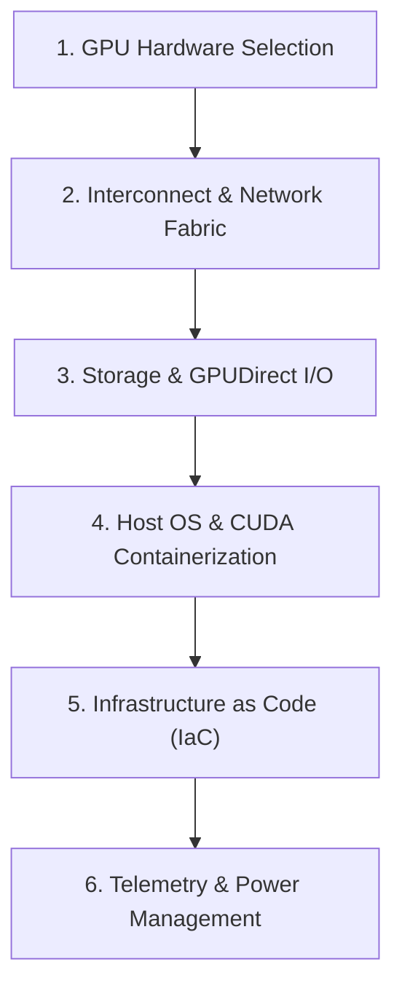

# 📚 DAY 16: CLOUD INFRASTRUCTURE FOR AI & GPU INSTANCE ARCHITECTURE
> **Khóa học:** COMP2010 - AI in Action (VinUni) | AICB-P2T2 | Giảng viên: Nguyễn Hải Dương | Phase 2 - Track 2 - Tuần 4 | **Tối ưu:** Google NotebookLM (< 50MB)

---

## 📌 1. BÀI HỌC HÔM NAY VỀ CÁI GÌ? (THE WHAT & WHY)

*   **Phân tầng Kiến trúc Đám mây cho AI (Cloud AI Hierarchy):** Bóc tách 3 lớp hạ tầng then chốt: IaaS (Bare-metal & GPU Cloud Instances như H100 SXM5 80GB, A100 80GB, L4, T4), PaaS (Managed Kubernetes EKS/GKE, Vertex AI, AWS SageMaker) và SaaS (Managed Inference APIs). Đối sánh chi phí và tính linh hoạt giữa On-Premises (Capex cố định lớn, kiểm soát bảo mật dữ liệu) vs Cloud GPU (Opex linh hoạt, tiếp cận công nghệ vi kiến trúc Hopper/Blackwell mới nhất).
*   **Băng thông Giao tiếp & Kiến trúc Kết nối GPU:** Sự khác biệt mang tính quyết định giữa băng thông PCIe Gen 5 (128 GB/s song công) và công nghệ NVLink 4 / NVSwitch (900 GB/s trên H100 SXM5). Tác động trực tiếp của băng thông truyền thông lên độ trễ của toán tử All-Reduce trong huấn luyện phân tán (Data Parallelism và Tensor Parallelism) khi số lượng tham số mô hình vượt quá 70 tỷ.
*   **Hiện tượng GPU Starvation & Tối ưu hóa I/O Pipeline:** Bản chất hiện tượng các nhân tính toán Tensor Cores bị nghẽn (idle) do tốc độ đọc dữ liệu từ Cloud Object Storage (S3/GCS) và tiền xử lý DataLoader trên CPU không theo kịp tốc độ tính toán ma trận của GPU. Giải pháp ứng dụng GPUDirect Storage (GDS) bỏ qua CPU RAM, mạng RDMA qua InfiniBand Quantum-2 (400 Gbps) / RoCE v2 và mảng ổ cứng SSD NVMe cục bộ RAID 0.
*   **Quản trị Hạ tầng bằng Mã (Terraform IaC) & An ninh IAM:** Tự động hóa toàn bộ vòng đời khởi tạo, mở rộng và hủy cụm GPU cluster với Terraform / OpenTofu. Thiết lập phân quyền IAM theo nguyên tắc Least Privilege (IAM Roles gắn trực tiếp cho Instance Profile thay vì lưu cứng API Keys trong mã nguồn) và thiết kế mạng VPC cô lập luồng dữ liệu nhạy cảm.

---

## 💡 2. ẨN DỤ ĐỜI THƯỜNG: THỰC TRẠNG & GIẢI PHÁP

### 🔴 Thực trạng:
Nhiều doanh nghiệp và startup AI 'đốt' hàng chục ngàn USD mỗi tháng cho cụm GPU đám mây đắt đỏ nhưng hiệu suất sử dụng thực tế (GPU Utilization) chỉ đạt dưới 25% do chọn sai loại máy ảo, nghẽn cổ chai đường truyền dữ liệu và cấu hình phân quyền lỏng lẻo.

### 🚗 Ẩn dụ đời thường:

> **1. Mua xe đua vs Thuê đội đua (Capex vs Opex):** Xây dựng phòng máy On-premise giống như mua đứt dàn siêu xe F1: tốn chi phí đầu tư khổng lồ ban đầu, bảo dưỡng phức tạp và nhanh lỗi thời; trong khi thuê GPU Cloud giống như dịch vụ thuê xe đua theo giờ, linh hoạt đổi xe đời mới khi cần.
> **2. Động cơ siêu nạp vs Đường ống dẫn nhiên liệu (Tensor Cores vs NVLink):** GPU H100 là khối động cơ phản lực cực mạnh. Nếu gắn vào khung gầm với ống dẫn nhiên liệu nhỏ hẹp (kết nối PCIe Gen 4/5 thông thường), động cơ sẽ liên tục bị hụt hơi; chỉ khi trang bị ống dẫn siêu tốc NVLink 4 (900 GB/s), động cơ mới bung hết 100% công suất.
> **3. Bếp trưởng đói nguyên liệu (GPU Starvation):** Bếp trưởng Michelin (GPU) có thể thái và xào rau củ trong 1 giây, nhưng nhân viên phụ bếp (CPU DataLoader & Storage) mất tới 10 giây mới lấy được rau từ kho lạnh xa xôi, khiến bếp trưởng phải khoanh tay chờ đợi.
> **4. Thẻ từ phân quyền ra vào nhà xưởng (IAM Least Privilege):** Thay vì cấp chìa khóa vạn năng cho bất kỳ ai bước vào phòng máy chủ, hệ thống thẻ từ thông minh chỉ mở đúng cánh cửa phòng chứa dữ liệu cho đúng máy ảo thực hiện tác vụ huấn luyện.

### 🟢 Giải pháp kỹ thuật:
Định cỡ chính xác loại GPU dựa trên dung lượng VRAM và băng thông tính toán; kết nối cụm node bằng mạng InfiniBand RDMA 400Gbps; triển khai GPUDirect Storage để nạp dữ liệu tốc độ cao và tự động hóa toàn bộ hạ tầng bằng Terraform IaC.


---

## 🗺️ 3. SƠ ĐỒ PIPELINE & QUY TRÌNH THỰC HIỆN TỪ ĐẦU ĐẾN CUỐI



*   **1. GPU Hardware Selection:** Phân tích yêu cầu mô hình (FP8/BF16, kích thước tham số, KV Cache)
Chọn dòng GPU tối ưu: H100 SXM5 cho Large Scale Pre-training, L4/A10G cho Inference
Định cỡ dung lượng VRAM và topology kết nối liên node.
*   **2. Interconnect & Network Fabric:** Thiết lập NVLink 4 (900 GB/s) giao tiếp nội node giữa 8 GPU
Cấu hình InfiniBand Quantum-2 400Gbps với Non-blocking Fat-Tree Topology
Kích hoạt giao thức RDMA / RoCE v2 giảm thiểu độ trễ truyền gói tin qua mạng.
*   **3. Storage & GPUDirect I/O:** Gắn mảng ổ đĩa NVMe SSD cục bộ tốc độ cao làm bộ đệm đệm cục bộ (Scratch disk)
Kích hoạt NVIDIA GPUDirect Storage (GDS) DMA trực tiếp từ NVMe vào GPU VRAM
Đồng bộ hóa luồng dữ liệu song song từ Cloud Object Store (S3/GCS).
*   **4. Host OS & CUDA Containerization:** Cài đặt Driver NVIDIA Data Center tương thích, CUDA Toolkit 12.x và cuDNN
Đóng gói Container chuẩn hóa thông qua Docker và NVIDIA Container Toolkit
Cấu hình cgroups và IPC namespace để chia sẻ bộ nhớ dùng chung (/dev/shm).
*   **5. Infrastructure as Code (IaC):** Khai báo tài nguyên hạ tầng máy ảo, mạng VPC và Security Group qua Terraform
Áp dụng chính sách IAM Least Privilege với Instance Profile tạm thời
Thiết lập cơ chế Auto-healing và dự phòng Spot Instances tiết kiệm chi phí.
*   **6. Telemetry & Power Management:** Triển khai NVIDIA Data Center GPU Manager (DCGM) Exporter tích hợp Prometheus
Theo dõi các chỉ số thời gian thực: GPU Utilization, VRAM Alloc, Power Draw, NVLink Error
Cấu hình cảnh báo sớm GPU throttling và tối ưu hóa chi phí FinOps tự động.

---

## 🌐 4. KIẾN THỨC MỞ RỘNG CHUYÊN SÂU (FIRECRAWL RESEARCH)

### Kiến trúc Vi mạch NVIDIA Hopper H100 & Công nghệ Transformer Engine
Vi kiến trúc NVIDIA Hopper H100 SXM5 mang đến bước nhảy vọt về năng lực tính toán AI nhờ tích hợp nhân phần cứng Transformer Engine thế hệ mới. Transformer Engine tự động phân tích và chuyển đổi động giữa định dạng dấu phẩy động 8-bit (FP8: gồm định dạng E4M3 cho forward pass và E5M2 cho backward pass) và 16-bit (BF16/FP16), giúp tăng gấp 4 lần thông lượng tính toán ma trận (đạt tới 2.000 TFLOPs FP8) trong khi giảm một nửa nhu cầu băng thông bộ nhớ VRAM HBM3 (3.35 TB/s trên H100).

### Mạng Kết nối Cụm Cấp độ Siêu máy tính: InfiniBand vs RoCEv2
Trong các cụm huấn luyện quy mô hàng nghìn GPU, băng thông mạng liên node là yếu tố quyết định hiệu suất tổng thể. Mạng InfiniBand Quantum-2 cung cấp băng thông 400 Gbps trên mỗi cổng với cơ chế kiểm soát tắc nghẽn dựa trên phần cứng (Hardware-based Congestion Control) và độ trễ cực thấp (<1 microsecond). Ngược lại, RoCEv2 (RDMA over Converged Ethernet) chạy trên nền Ethernet tiêu chuẩn với switch hỗ trợ PFC (Priority Flow Control) và ECN (Explicit Congestion Notification), giúp giảm chi phí triển khai phần cứng chuyên biệt nhưng đòi hỏi tinh chỉnh mạng phức tạp để tránh hiện tượng Deadlock do PFC Storms.

### Case Study Thực chiến 1: Hạ tầng Siêu cụm GPU 24.576 H100 của Meta cho LLaMA 3
Meta xây dựng 2 cụm siêu máy tính độc lập với quy mô 24.576 GPU NVIDIA H100 SXM5 (chia thành các node 8x H100 kết nối NVSwitch). Điểm đặc biệt là một cụm sử dụng mạng InfiniBand Quantum-2 trong khi cụm thứ hai sử dụng RoCEv2 400Gbps trên nền switch Arista. Quá trình vận hành thực tế chứng minh cả hai mạng đều đạt hiệu suất huấn luyện (MFU - Model Flops Utilization) trên 38% cho mô hình LLaMA 3 405B sau khi giải quyết triệt để lỗi phân mảnh gói tin RoCEv2 và cân bằng tải ECMP thích ứng.

### Case Study Thực chiến 2: Tối ưu Hóa Chi phí Hạ tầng Inference tại Uber
Đội ngũ Platform Engineering tại Uber chuyển đổi hạ tầng phục vụ mô hình ngôn ngữ và gợi ý thời gian thực từ các máy ảo GPU A100 đắt đỏ sang các dòng GPU thế hệ mới NVIDIA L4 kết hợp kiến trúc Kubernetes KEDA Autoscaler. Bằng việc áp dụng lượng tử hóa INT8/FP8 qua TensorRT-LLM và tận dụng mạng PCIe Gen 4 tối ưu, Uber giảm 62% chi phí hạ tầng điện toán đám mây mỗi tháng trong khi duy trì P99 latency ở mức dưới 45ms cho toàn bộ hệ thống gợi ý cuốc xe toàn cầu.


---

## 🔑 5. BẢNG TỪ KHÓA CỐT LÕI

| Thuật ngữ | Khái niệm kỹ thuật | Giải thích đời thường |
| :--- | :--- | :--- |
| **H100 SXM5** | Dòng GPU máy chủ AI cao cấp của NVIDIA gắn trực tiếp trên bo mạch chủ qua chuẩn cắm SXM, đạt công suất 700W và băng thông NVLink 900 GB/s. | Siêu xe đua chuyên dụng được hàn liền vào khung gầm để chạy với tốc độ tối đa. |
| **NVLink 4 / NVSwitch** | Giao thức và chip chuyển mạch kết nối trực tiếp bộ nhớ giữa các GPU với băng thông 900 GB/s mỗi GPU, gấp 7 lần PCIe Gen 5. | Cầu vượt cao tốc nhiều làn nối thông các tòa nhà văn phòng để nhân viên di chuyển lập tức. |
| **GPUDirect Storage (GDS)** | Công nghệ cho phép truyền dữ liệu trực tiếp từ ổ cứng NVMe qua PCIe vào bộ nhớ VRAM của GPU mà không qua CPU và RAM máy chủ. | Đường ống bơm nước thẳng từ hồ chứa vào nồi nấu của bếp trưởng, bỏ qua khâu trung chuyển. |
| **RDMA / InfiniBand** | Remote Direct Memory Access: Kỹ thuật truy xuất trực tiếp bộ nhớ của máy chủ từ xa qua mạng tốc độ cao mà không làm tiêu tốn CPU. | Ống nghiệm thông nhau giữa hai phòng thí nghiệm đặt ở hai tòa nhà khác nhau. |
| **GPU Utilization** | Tỷ lệ phần trăm thời gian nhân tính toán của GPU thực sự thực hiện phép toán ma trận trong chu kỳ đo lường. | Tỷ lệ thời gian bác sĩ thực sự phẫu thuật trên tổng thời gian ca trực. |
| **Infrastructure as Code (IaC)** | Phương pháp quản lý và cấp phát tài nguyên máy chủ, mạng thông qua các tệp mã nguồn khai báo (Terraform, CloudFormation). | Bản vẽ thiết kế kỹ thuật số tự động ra lệnh cho robot xây dựng nguyên một khu đô thị. |

---

## 🎯 6. BỘ CÂU HỎI ÔN THI TRỌNG TÂM (CHUẨN HỌC THUẬT & ĐẠI HỌC)

### 📝 PHẦN A: 6 CÂU TRẮC NGHIỆM ĐƠN (SINGLE-CHOICE)

#### Câu 1: Khi xây dựng cụm GPU phục vụ huấn luyện mô hình LLM phân tán 70B tham số, lý do cốt lõi nào khiến kiến trúc H100 SXM5 kết nối NVLink vượt trội hơn cấu hình H100 PCIe Gen 5?
*   A. H100 PCIe tiêu tốn nhiều điện năng hơn bản SXM5 trong cùng điều kiện tải.
*   B. H100 PCIe không hỗ trợ định dạng số học FP8 trong Transformer Engine.
*   C. Băng thông giao tiếp NVLink 4 (900 GB/s) của bản SXM5 cao gấp hơn 7 lần băng thông PCIe Gen 5 (128 GB/s), giúp triệt tiêu nghẽn cổ chai khi thực hiện toán tử All-Reduce.
*   D. H100 SXM5 có dung lượng VRAM lớn gấp 4 lần phiên bản H100 PCIe tiêu chuẩn.
> **👉 ĐÁP ÁN ĐÚNG: C**  
> **💡 Phân tích & Bẫy logic:** Vì sao C đúng: Toán tử All-Reduce trong huấn luyện phân tán (Data/Tensor Parallelism) đòi hỏi truyền tải hàng chục gigabyte trọng số và gradient liên tục giữa các GPU. Băng thông NVLink 900 GB/s giúp hoàn thành truyền thông cực nhanh, tránh hiện tượng GPU bị rảnh rỗi chờ dữ liệu.
* A sai vì: Bản SXM5 có TDP 700W, tiêu thụ nhiều điện hơn bản PCIe (350W).
* B sai vì: Cả hai bản đều trang bị Transformer Engine hỗ trợ FP8.
* D sai vì: Cả H100 SXM5 và PCIe ban đầu đều có dung lượng VRAM 80GB HBM3.

---

#### Câu 2: Hiện tượng 'GPU Starvation' trong các cụm huấn luyện AI phân tán phản ánh vấn đề cốt lõi nào sau đây?
*   A. Tốc độ đọc I/O từ hệ thống lưu trữ và tiền xử lý DataLoader trên CPU không theo kịp tốc độ tính toán ma trận của GPU, khiến GPU bị nhàn rỗi (idle).
*   B. Dung lượng bộ nhớ VRAM của GPU bị tràn do batch size quá lớn.
*   C. Nhiệt độ GPU tăng quá cao làm kích hoạt cơ chế Thermal Throttling giảm xung nhịp.
*   D. Điện áp nguồn cấp của trung tâm dữ liệu không đủ duy trì công suất 700W của GPU.
> **👉 ĐÁP ÁN ĐÚNG: A**  
> **💡 Phân tích & Bẫy logic:** Vì sao A đúng: GPU Starvation là hiện tượng nhân Tensor Core đạt hiệu suất sử dụng (utilization) thấp do pipeline nạp dữ liệu từ Storage -> CPU RAM -> GPU VRAM bị nghẽn ở khâu đọc đĩa hoặc giải nén dữ liệu trên CPU.
* B sai vì: Tràn VRAM sẽ gây lỗi Out-Of-Memory (OOM) làm crash tiến trình chứ không phải GPU Starvation.
* C sai vì: Thermal Throttling làm giảm xung nhịp phần cứng chứ không làm nhân GPU rảnh rỗi chờ dữ liệu.
* D sai vì: Lỗi nguồn điện sẽ dẫn đến sập nguồn máy chủ hoặc ngắt tải khẩn cấp.

---

#### Câu 3: Trong quản trị hạ tầng Cloud cho AI, thực hành nào sau đây đảm bảo chuẩn an ninh IAM Least Privilege tốt nhất khi chạy huấn luyện trên máy ảo GPU?
*   A. Nhúng trực tiếp AWS Access Key / Secret Key của tài khoản Admin vào tệp cấu hình script huấn luyện.
*   B. Cấp quyền AdministratorAccess toàn quyền cho máy ảo để tránh bị gián đoạn quyền truy cập dữ liệu.
*   C. Chia sẻ chung một file API Key tĩnh giữa tất cả các nhà nghiên cứu và máy chủ trong công ty.
*   D. Gắn IAM Role với chính sách Instance Profile tạm thời, chỉ cấp quyền đọc trên đúng S3 Bucket chứa dữ liệu huấn luyện và quyền ghi trên Checkpoint Bucket.
> **👉 ĐÁP ÁN ĐÚNG: D**  
> **💡 Phân tích & Bẫy logic:** Vì sao D đúng: Instance Profile sử dụng AWS STS tự động tạo credential ngắn hạn xoay vòng liên tục, chỉ cấp quyền tối thiểu trên các bucket cụ thể, loại bỏ hoàn toàn nguy cơ lộ secret key tĩnh.
* A sai vì: Hardcode Access Key tĩnh trong mã nguồn là lỗ hổng bảo mật nghiêm trọng bậc nhất.
* B sai vì: Cấp quyền AdministratorAccess vi phạm nghiêm trọng nguyên tắc Least Privilege, mở rộng nguy cơ bị tấn công leo thang đặc quyền.
* C sai vì: Chia sẻ secret tĩnh dùng chung khiến hệ thống không thể kiểm toán (audit) ai đã thực hiện hành động nào.

---

#### Câu 4: Công nghệ GPUDirect Storage (GDS) giải quyết vấn đề nghẽn cổ chai truyền dữ liệu bằng cơ chế kỹ thuật nào?
*   A. Nén toàn bộ dữ liệu ảnh thành định dạng JPEG trước khi gửi vào GPU.
*   B. Thiết lập kênh DMA trực tiếp truyền dữ liệu từ ổ cứng NVMe Storage vào bộ nhớ VRAM của GPU qua bus PCIe mà không cần sao chép qua CPU Page Cache.
*   C. Sử dụng mạng Internet công cộng để truyền dữ liệu trực tiếp vào bộ nhớ đệm L2 của GPU.
*   D. Tăng gấp đôi xung nhịp của CPU để tăng tốc độ sao chép bộ nhớ trong RAM hệ thống.
> **👉 ĐÁP ÁN ĐÚNG: B**  
> **💡 Phân tích & Bẫy logic:** Vì sao B đúng: GDS sử dụng cơ chế Direct Memory Access (DMA) qua PCIe switch nội bộ, loại bỏ hoàn toàn bước trung gian copy dữ liệu vào host CPU memory (bounce buffer), giúp giảm độ trễ và giải phóng tài nguyên CPU.
* A sai vì: GDS là giao thức truyền dữ liệu tầng phần cứng, không can thiệp vào thuật toán nén ảnh.
* C sai vì: GDS hoạt động trên bus PCIe cục bộ hoặc qua mạng nội bộ RDMA, không truyền qua Internet công cộng.
* D sai vì: GDS nhằm mục đích bỏ qua CPU chứ không phụ thuộc vào xung nhịp CPU.

---

#### Câu 5: Khi lựa chọn giữa hạ tầng On-Premises GPU và Cloud GPU Instances cho một dự án AI khởi nghiệp, nhận định nào sau đây là chính xác về mặt tài chính và kỹ thuật?
*   A. On-Premises luôn tiết kiệm chi phí hơn Cloud GPU trong mọi kịch bản sử dụng dưới 6 tháng.
*   B. Cloud GPU không bao giờ xảy ra tình trạng thiếu hụt hạn ngạch (quota) phần cứng tại các vùng địa lý.
*   C. Cloud GPU (Opex) phù hợp cho nhu cầu mở rộng linh hoạt, thử nghiệm mô hình mới và không yêu cầu vốn đầu tư ban đầu lớn; trong khi On-Premises (Capex) tối ưu chi phí hơn khi khối lượng công việc ổn định ở mức tải tối đa 24/7 trong nhiều năm.
*   D. Hiệu năng tính toán của cùng một dòng GPU trên Cloud luôn cao gấp đôi so với khi lắp đặt tại máy chủ On-Premises.
> **👉 ĐÁP ÁN ĐÚNG: C**  
> **💡 Phân tích & Bẫy logic:** Vì sao C đúng: Phân tích TCO (Total Cost of Ownership) chỉ ra rằng Cloud GPU mang lại sự linh hoạt tối đa về vốn (Opex), giúp doanh nghiệp tiếp cận phần cứng mới nhất mà không lo chi phí khấu hao; ngược lại On-Premises tối ưu hơn khi tài nguyên được chạy full-load 24/7 trên 2-3 năm.
* A sai vì: Trong ngắn hạn (<6 tháng), chi phí mua sắm máy chủ, lắp đặt phòng server lạnh và đường truyền điện On-premise đắt hơn rất nhiều so với thuê Cloud theo giờ.
* B sai vì: Tình trạng khan hiếm GPU H100/A100 thường xuyên xảy ra trên các nhà cung cấp đám mây lớn (AWS, GCP, Azure).
* D sai vì: Về bản chất vi mạch silicon, cùng một dòng GPU H100 sẽ có năng lực tính toán FLOPs tương đương nhau.

---

#### Câu 6: Chỉ số GPU Utilization hiển thị qua lệnh `nvidia-smi` thực chất đo lường điều gì?
*   A. Tỷ lệ phần trăm thời gian trong chu kỳ lấy mẫu gần nhất mà một hoặc nhiều nhân tính toán (CUDA/Tensor Cores) của GPU đang thực thi chỉ lệnh.
*   B. Tỷ lệ dung lượng bộ nhớ VRAM đang bị chiếm dụng so với tổng bộ nhớ vật lý của GPU.
*   C. Tỷ lệ phần trăm điện năng tiêu thụ thực tế so với giới hạn công suất cực đại (TDP) của card đồ họa.
*   D. Tốc độ truyền tải dữ liệu tức thời trên đường truyền PCIe tính theo Gigabyte/giây.
> **👉 ĐÁP ÁN ĐÚNG: A**  
> **💡 Phân tích & Bẫy logic:** Vì sao A đúng: Theo định nghĩa của NVIDIA NVML, GPU Utilization là tỷ lệ thời gian mà kernel của ứng dụng đang thực sự chiếm dụng execution engine trên GPU trong khoảng thời gian lấy mẫu (thường là 1/6 giây).
* B sai vì: Tỷ lệ chiếm dụng VRAM được đo bằng chỉ số Memory Usage (MiB), một GPU có thể chiếm 99% VRAM nhưng GPU Utilization bằng 0% nếu không có tính toán.
* C sai vì: Điện năng tiêu thụ được thể hiện qua chỉ số Power Draw (Watts).
* D sai vì: Tốc độ bus PCIe được theo dõi qua PCIe Throughput counter riêng biệt.

---

### 📝 PHẦN B: 4 CÂU TRẮC NGHIỆM NHIỀU ĐÁP ÁN (MULTI-SELECT)

#### Câu 7: Những yếu tố nào sau đây là nguyên nhân trực tiếp dẫn đến hiện tượng nghẽn mạng truyền thông (Communication Bottleneck) trong cụm huấn luyện AI phân tán? (Chọn 2 đáp án)
*   A. Sử dụng kết nối mạng Ethernet 1Gbps/10Gbps tiêu chuẩn thay vì InfiniBand 400Gbps hoặc RoCEv2 với RDMA.
*   B. Kích thước mô hình quá lớn khiến lượng gradient cần đồng bộ hóa qua toán tử All-Reduce vượt quá băng thông đường truyền giữa các node.
*   C. Dung lượng bộ nhớ đệm L1 cache của nhân GPU bị phân mảnh.
*   D. Nhiệt độ môi trường phòng máy lạnh đạt mức tối ưu 18 độ C.
> **👉 ĐÁP ÁN ĐÚNG: A, B**  
> **💡 Phân tích & Bẫy logic:** Vì sao A, B đúng: Mạng Ethernet tiêu chuẩn độ trễ cao và kích thước gradient khổng lồ của mô hình LLM khi đồng bộ qua All-Reduce sẽ làm đường truyền bị bão hòa, đẩy thời gian chờ đợi truyền thông lên mức áp đảo thời gian tính toán.
* C sai vì: Phân mảnh L1 cache là vấn đề vi kiến trúc xử lý luồng (thread warp) nội bộ trong chip, không liên quan trực tiếp đến băng thông mạng liên node.
* D sai vì: Nhiệt độ phòng máy 18 độ C là điều kiện lý tưởng giúp tản nhiệt phần cứng, không gây nghẽn mạng.

---

#### Câu 8: Đâu là các lợi ích cốt lõi của việc sử dụng Terraform để tự động hóa hạ tầng cụm GPU AI trên nền tảng đám mây? (Chọn 2 đáp án)
*   A. Tự động viết lại mã nguồn mô hình PyTorch sang ngôn ngữ C++ để chạy nhanh hơn.
*   B. Tự động sửa chữa các lỗi sai logic trong tập dữ liệu gán nhãn huấn luyện.
*   C. Đảm bảo tính nhất quán và khả năng tái lập (Reproducibility), loại bỏ rủi ro sai sót do cấu hình thủ công (Configuration Drift).
*   D. Quản lý trạng thái hạ tầng (State Management) và cho phép tích hợp vào quy trình CI/CD để tự động tạo và hủy môi trường thử nghiệm nhanh chóng.
> **👉 ĐÁP ÁN ĐÚNG: C, D**  
> **💡 Phân tích & Bẫy logic:** Vì sao C, D đúng: Terraform sử dụng tệp khai báo declarative định nghĩa chính xác toàn bộ cấu hình máy ảo, subnet, security group; lưu trữ trạng thái trong state file giúp đội ngũ DevOps kiểm soát phiên bản và tự động hóa quy trình triển khai.
* A sai vì: Terraform là công cụ IaC quản trị hạ tầng, hoàn toàn không can thiệp vào mã nguồn deep learning PyTorch.
* B sai vì: Quản lý chất lượng dữ liệu thuộc phạm vi của các công cụ DataOps (Great Expectations, DVC), không phải chức năng của Terraform.

---

#### Câu 9: Khi cấu hình cụm máy chủ nhiều GPU (Multi-GPU Node) với kiến trúc 8x H100 SXM5, những thành phần phần cứng nào sau đây đóng vai trò then chốt trong việc tối ưu hóa hiệu năng? (Chọn 2 đáp án)
*   A. Hệ thống chuyển mạch NVSwitch tích hợp trên bo mạch để định tuyến dữ liệu NVLink liên GPU ở tốc độ cực cao.
*   B. Bàn phím cơ có đèn nền RGB dành cho quản trị viên hệ thống.
*   C. Mạng Host Fabric Interface hỗ trợ GPUDirect RDMA kết nối trực tiếp GPU với Network Interface Card (NIC).
*   D. Ổ đĩa quang CD-ROM để cài đặt hệ điều hành từ đĩa vật lý.
> **👉 ĐÁP ÁN ĐÚNG: A, C**  
> **💡 Phân tích & Bẫy logic:** Vì sao A, C đúng: NVSwitch cung cấp kết nối all-to-all non-blocking giữa 8 GPU trong cùng một máy chủ; còn GPUDirect RDMA cho phép NIC truyền trực tiếp dữ liệu từ mạng vào VRAM mà không cần CPU tham gia.
* B sai vì: Phụ kiện ngoại vi bàn phím RGB không ảnh hưởng đến hiệu năng tính toán cụm máy chủ.
* D sai vì: Máy chủ trung tâm dữ liệu hiện đại cài đặt OS tự động qua mạng PXE Boot / Cloud-Init, không dùng ổ đĩa quang.

---

#### Câu 10: Những giải pháp nào sau đây giúp đội ngũ kỹ thuật tối ưu hóa chi phí vận hành (FinOps) cụm GPU trên Cloud mà không làm gián đoạn các tác vụ quan trọng? (Chọn 2 đáp án)
*   A. Tắt hoàn toàn hệ thống sao lưu dự phòng Checkpoint để tiết kiệm dung lượng ổ cứng.
*   B. Tận dụng Spot Instances / Preemptible VMs kết hợp cơ chế lưu Checkpoint định kỳ thường xuyên để giảm tới 60-70% chi phí huấn luyện.
*   C. Chạy toàn bộ các mô hình phân loại văn bản đơn giản trên GPU H100 để đảm bảo công nghệ hiện đại nhất.
*   D. Thiết lập chính sách Auto-scaling và tự động tắt các máy ảo GPU ở môi trường phát triển (Dev/Staging) ngoài giờ làm việc.
> **👉 ĐÁP ÁN ĐÚNG: B, D**  
> **💡 Phân tích & Bẫy logic:** Vì sao B, D đúng: Spot Instances có giá rẻ hơn 60-70% so với On-demand, rất phù hợp cho training nếu có checkpointing vững chắc; tắt tài nguyên Dev/Test khi không sử dụng giúp cắt giảm đáng kể chi phí lãng phí ngoài giờ.
* A sai vì: Bỏ checkpointing sẽ khiến toàn bộ tiến trình huấn luyện bị mất sạch khi gặp sự cố, gây lãng phí gấp nhiều lần.
* C sai vì: Dùng H100 cho các tác vụ đơn giản là sự lãng phí tài nguyên nghiêm trọng (overprovisioning).

---

## 💻 7. CODE THỰC CHIẾN SẢN XUẤT (PRODUCTION IMPLEMENTATION)

Đoạn mã Terraform khai báo hạ tầng cụm GPU Node trên AWS với cấu hình Instance GPU p4de.24xlarge (8x A100 80GB), gắn mảng ổ đĩa Scratch NVMe, kích hoạt Elastic Fabric Adapter (EFA) hỗ trợ GPUDirect RDMA và phân quyền IAM an toàn:

```hcl
# main.tf: Production Cloud GPU Infrastructure Deployment
terraform {
  required_version = ">= 1.5.0"
  required_providers {
    aws = {
      source  = "hashicorp/aws"
      version = "~> 5.0"
    }
  }
}

provider "aws" {
  region = var.aws_region
}

# 1. Placement Group for Low-Latency Inter-Node Communication
resource "aws_placement_group" "gpu_cluster_pg" {
  name     = "ai-training-cluster-pg"
  strategy = "cluster" # Pack instances close together inside same AZ for max network throughput
}

# 2. IAM Role with Least Privilege Instance Profile
resource "aws_iam_role" "gpu_instance_role" {
  name = "ai-gpu-training-node-role"
  assume_role_policy = jsonencode({
    Version = "2012-10-17"
    Statement = [{
      Action    = "sts:AssumeRole"
      Effect    = "Allow"
      Principal = { Service = "ec2.amazonaws.com" }
    }]
  })
}

resource "aws_iam_policy" "s3_training_data_access" {
  name        = "S3TrainingDataReadOnlyPolicy"
  description = "Allows read access to training dataset and write access to checkpoints"
  policy = jsonencode({
    Version = "2012-10-17"
    Statement = [
      {
        Effect   = "Allow"
        Action   = ["s3:GetObject", "s3:ListBucket"]
        Resource = ["arn:aws:s3:::production-ai-datasets/*", "arn:aws:s3:::production-ai-datasets"]
      },
      {
        Effect   = "Allow"
        Action   = ["s3:PutObject", "s3:GetObject", "s3:ListBucket"]
        Resource = ["arn:aws:s3:::ai-model-checkpoints-prod/*", "arn:aws:s3:::ai-model-checkpoints-prod"]
      }
    ]
  })
}

resource "aws_iam_role_policy_attachment" "attach_s3_policy" {
  role       = aws_iam_role.gpu_instance_role.name
  policy_arn = aws_iam_policy.s3_training_data_access.policy_arn
}

resource "aws_iam_instance_profile" "gpu_profile" {
  name = "ai-gpu-instance-profile"
  role = aws_iam_role.gpu_instance_role.name
}

# 3. Dedicated GPU Training Instance (8x A100 80GB SXM4 with EFA)
resource "aws_instance" "gpu_worker_node" {
  count                = var.node_count
  ami                  = var.deep_learning_ami_id
  instance_type        = "p4de.24xlarge"
  placement_group      = aws_placement_group.gpu_cluster_pg.id
  iam_instance_profile = aws_iam_instance_profile.gpu_profile.name
  subnet_id            = var.private_subnet_id

  # Enable Elastic Fabric Adapter (EFA) for GPUDirect RDMA
  network_interface {
    device_index          = 0
    network_interface_id  = aws_network_interface.efa_nic[count.index].id
  }

  root_block_device {
    volume_size           = 200
    volume_type           = "gp3"
    delete_on_termination = true
  }

  user_data = <<-EOF
              #!/bin/bash
              echo "Initializing GPU Node setup..."
              # Mount local NVMe instance store for high-speed scratch space
              mkfs.ext4 -F /dev/nvme1n1
              mkdir -p /mnt/scratch
              mount -o noatime /dev/nvme1n1 /mnt/scratch
              chmod 777 /mnt/scratch
              # Verify NVIDIA driver and DCGM telemetry daemon
              systemctl start nvidia-dcgm
              nvidia-smi
              EOF

  tags = {
    Name        = "gpu-worker-node-${count.index + 1}"
    Owner       = "BaoHoang_2A202605721_K4"
    Environment = "production-ai"
    ManagedBy   = "Terraform"
  }
}
```

### 🔍 Chú thích chi tiết từng khối mã nguồn:
*   **aws_placement_group (strategy='cluster'):** Nhóm các máy ảo vật lý trong cùng một phân vùng phần cứng của Availability Zone để đạt độ trễ mạng thấp nhất và băng thông truyền thông tối đa.
*   **aws_iam_policy (Least Privilege):** Cấp quyền truy cập S3 tối thiểu: chỉ đọc trên dataset bucket và đọc/ghi trên checkpoint bucket, sử dụng tạm thời qua Instance Profile thay vì lưu cứng access key.
*   **p4de.24xlarge & EFA:** Cấu hình dòng máy ảo trang bị 8 GPU A100 80GB SXM4 kết hợp card mạng Elastic Fabric Adapter hỗ trợ giao thức RDMA qua RoCEv2.
*   **user_data NVMe mount:** Định dạng và mount tức thì ổ đĩa NVMe cục bộ vào thư mục `/mnt/scratch` với cờ `noatime` để phục vụ làm bộ đệm nạp dữ liệu tốc độ cao.

---

## 🛠️ 8. BẪY LỖI PHỔ BIẾN & KỸ THUẬT DEBUG THỰC CHIẾN

### ⚠️ GPU Underutilization do DataLoader Bottleneck (GPU Starvation)
*   **🔍 Hiện tượng (Symptom):** Lệnh `nvidia-smi` cho thấy GPU Utilization liên tục dao động thất thường trong khoảng 15% - 35%, trong khi CPU load đạt 100% trên tất cả các core.
*   **💥 Nguyên nhân gốc rễ (Root Cause):** DataLoader trong PyTorch đang sử dụng `num_workers=0` (chạy đơn luồng trên main process) hoặc thực hiện giải nén ảnh/token hóa trực tiếp từ Cloud Storage chậm chạp trong vòng lặp huấn luyện.
*   **🛠️ Giải pháp khắc phục (Production Fix):** Tăng `num_workers` lên bằng số lượng CPU core khả dụng (ví dụ: `num_workers=4` hoặc `8` cho mỗi GPU), bật cờ `pin_memory=True` trong PyTorch DataLoader và sao chép trước (prefetch) tập dữ liệu vào ổ cứng NVMe SSD cục bộ `/mnt/scratch`.

### ⚠️ NCCL Communication Timeout Error trong Multi-Node Training
*   **🔍 Hiện tượng (Symptom):** Tiến trình huấn luyện phân tán bị treo đơ ở bước cập nhật gradient đầu tiên và ném ngoại lệ `RuntimeError: NCCL error: unhandled system error / connection reset by peer`.
*   **💥 Nguyên nhân gốc rễ (Root Cause):** Card mạng InfiniBand/RoCEv2 trên một trong các worker node bị mất kết nối hoặc biến môi trường `NCCL_IB_DISABLE` và `NCCL_SOCKET_IFNAME` bị cấu hình sai, khiến NCCL cố gắng định tuyến gói tin qua card mạng ảo Docker sai địa chỉ.
*   **🛠️ Giải pháp khắc phục (Production Fix):** Thiết lập tường minh biến môi trường mạng trong script khởi chạy: `export NCCL_SOCKET_IFNAME=eth0`, `export NCCL_IB_DISABLE=0`, `export NCCL_DEBUG=INFO` để kiểm tra log bắt tay và đảm bảo Security Group mở toàn bộ dải cổng giao tiếp TCP/UDP nội bộ giữa các node.

### ⚠️ CUDA Out of Memory (OOM) do Phân mảnh Bộ nhớ VRAM khi Khởi chạy Distributed Training
*   **🔍 Hiện tượng (Symptom):** Tiến trình crash ngay tại epoch đầu tiên với lỗi `torch.cuda.OutOfMemoryError: Tried to allocate 2.40 GiB (GPU 0; 79.15 GiB total capacity; 75.80 GiB already allocated)`.
*   **💥 Nguyên nhân gốc rễ (Root Cause):** Mô hình và kích thước Batch Size quá lớn, kết hợp với hiện tượng bộ cấp phát bộ nhớ PyTorch Caching Allocator bị phân mảnh (memory fragmentation) do cấp phát và giải phóng các tensor có kích thước biến động liên tục.
*   **🛠️ Giải pháp khắc phục (Production Fix):** Bật cơ chế quản lý phân mảnh bộ nhớ PyTorch bằng biến môi trường: `export PYTORCH_CUDA_ALLOC_CONF=expandable_segments:True,max_split_size_mb:128`, giảm per-device micro-batch size và kích hoạt Gradient Accumulation kết hợp Mixed Precision (BF16/FP16).

---

## ⚖️ 9. BẢNG SO SÁNH ĐỐI ĐẦU & ĐÁNH ĐỔI VẬN HÀNH (TRADE-OFFS MATRIX)

Bảng phân tích đối sánh giữa các lựa chọn hạ tầng điện toán phục vụ AI:

| Tiêu chí Đánh giá | On-Premises Bare-Metal | Cloud Dedicated GPU (IaaS) | Managed Cloud Platform (PaaS) | Serverless GPU Inference |
| :--- | :--- | :--- | :--- | :--- |
| **Mô hình Chi phí** | Capex rất lớn (đầu tư ban đầu) | Opex (trả theo giờ / tháng) | Opex (kèm phụ phí quản lý PaaS) | Opex (trả chính xác theo mili-giây) |
| **Độ linh hoạt & Mở rộng** | Rất thấp (mất nhiều tháng mua sắm) | Cao (cấp phát trong vài phút) | Rất cao (tự động co giãn theo tải) | Cực cao (tự động về 0 khi không dùng) |
| **Khả năng Tùy biến Kernel/Driver** | Toàn quyền (Kernel, BIOS, RoCE) | Toàn quyền trên OS máy ảo | Bị giới hạn trong container runtime | Bị cô lập hoàn toàn, không can thiệp |
| **Băng thông Mạng Liên Node** | Tối đa (InfiniBand thiết kế riêng) | Rất cao (EFA / InfiniBand Cloud) | Phụ thuộc vào cụm Kubernetes | Không hỗ trợ Multi-node training |
| **Thời gian Bắt đầu (Cold Start)** | Tức thì (máy chủ luôn sẵn sàng) | 1 - 3 phút để khởi động VM | 2 - 5 phút (nạp container image) | 5 - 30 giây (tải trọng số vào VRAM) |
| **Kịch bản Phù hợp Nhất** | Huấn luyện Foundation Model 24/7 | Huấn luyện phân tán quy mô lớn | Đội ngũ Data Science cần tiện ích | Ứng dụng API Inference tải biến động |

> **💡 Lời khuyên kiến trúc (Architectural Recommendation):** Với các tác vụ tiền huấn luyện mô hình nền tảng dài hạn (>1 năm) với ngân sách lớn, On-Premises mang lại TCO tối ưu nhất. Với giai đoạn R&D, Fine-tuning và huấn luyện linh hoạt, Cloud IaaS (H100 SXM5 qua Terraform) là lựa chọn chuẩn công nghiệp cân bằng hoàn hảo giữa hiệu năng và tốc độ triển khai.
