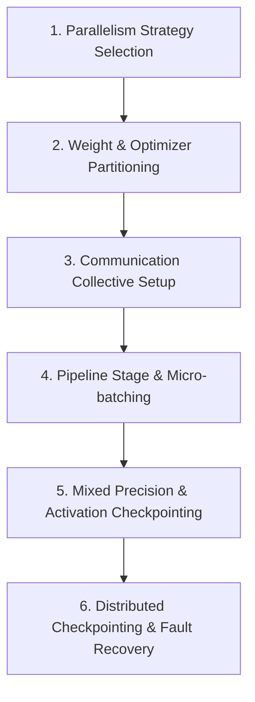

# 📚 DAY 17: DISTRIBUTED TRAINING INFRASTRUCTURE & PARALLELISM PARADIGMS
> **Khóa học:** COMP2010 - AI in Action (VinUni) | AICB-P2T2 | Giảng viên: Nguyễn Hải Dương | Phase 2 - Track 2 - Tuần 4 | **Tối ưu:** Google NotebookLM (< 50MB)

---

## 📌 1. BÀI HỌC HÔM NAY VỀ CÁI GÌ? (THE WHAT & WHY)

*   **Giới hạn Bộ nhớ GPU Đơn lẻ & Nhu cầu Huấn luyện Phân tán:** Một mô hình 70 tỷ tham số ở định dạng 16-bit (FP16/BF16) đòi hỏi tối thiểu 140GB chỉ để chứa trọng số; khi tính thêm trạng thái bộ tối ưu hóa Adam (12 bytes/param = 840GB), gradient (4 bytes/param = 280GB) và bộ nhớ kích hoạt (Activations), tổng bộ nhớ cần thiết vượt quá 1.400GB VRAM, hoàn toàn vượt xa dung lượng 80GB của một card GPU đơn lẻ. Huấn luyện phân tán là giải pháp sống còn để mở rộng không gian tính toán trên hàng trăm GPU.
*   **Các Mô hình Song song hóa Cốt lõi (Parallelism Taxonomy):** Phân loại 4 trục song song hóa chính: Data Parallelism (DDP - sao chép mô hình, chia nhỏ dữ liệu batch), Fully Sharded Data Parallelism (FSDP / ZeRO - phân mảnh trạng thái huấn luyện), Tensor Parallelism (TP - Megatron-LM chia nhỏ ma trận trọng số trong từng lớp Attention/MLP) và Pipeline Parallelism (PP - chia các lớp của mạng theo chiều dọc qua nhiều GPU).
*   **Kiến trúc DeepSpeed ZeRO & Tối ưu hóa Bộ nhớ Tuyệt đối:** Bóc tách 3 cấp độ của Zero Redundancy Optimizer: ZeRO-1 (Sharding Optimizer States, giảm 4x bộ nhớ mà không tăng chi phí truyền thông), ZeRO-2 (Sharding Optimizer States + Gradients, giảm 8x bộ nhớ), và ZeRO-3 (Sharding toàn bộ Optimizer States + Gradients + Model Parameters, cho phép huấn luyện mô hình hàng trăm tỷ tham số trên cụm GPU tiêu chuẩn).
*   **Toán tử Truyền thông Tập hợp (Collective Communications) & Thư viện NCCL:** Bản chất toán học và cơ chế vận hành của các toán tử truyền thông nền tảng: All-Reduce (tổng hợp gradient), All-Gather (thu thập tham số phân mảnh), Reduce-Scatter (tổng hợp và phân mảnh đồng thời) và Point-to-Point (truyền nhận giữa các tầng Pipeline). Hiệu năng của các toán tử này được tối ưu hóa tối đa thông qua thư viện NVIDIA NCCL trên nền Ring-AllReduce và Tree-AllReduce.

---

## 💡 2. ẨN DỤ ĐỜI THƯỜNG: THỰC TRẠNG & GIẢI PHÁP

### 🔴 Thực trạng:
Một dự án nghiên cứu muốn huấn luyện mô hình ngôn ngữ lớn nhưng chỉ biết dùng Data Parallelism thông thường (DDP), dẫn đến lỗi Out-Of-Memory ngay lập tức vì mô hình quá to để nhét vừa vào một GPU đơn lẻ.

### 🚗 Ẩn dụ đời thường:

> **1. Đội thợ may và cuốn sách khổng lồ (DDP):** Mỗi thợ may (GPU) giữ nguyên một cuốn sách mẫu đầy đủ và chỉ nhận một phần xấp vải (mini-batch) để may; cách này chỉ chạy được khi cuốn sách đủ nhỏ để thợ may ôm trọn trong tay.
> **2. Xé nhỏ cuốn sách thành từng trang (Tensor Parallelism):** Khi cuốn sách quá dày, 8 thợ may ngồi chung một bàn tròn xé từng trang sách ra, mỗi người tính toán một phần dòng chữ trên cùng một trang và thì thầm kết quả cho nhau nghe qua đường truyền tốc độ cao (NVLink).
> **3. Dây chuyền may nhiều công đoạn (Pipeline Parallelism):** Người thợ thứ nhất chỉ cắt vải (lớp 1-10), chuyền sang người thứ hai may cúc (lớp 11-20), và người thứ ba ủi đồ (lớp 21-30); để tránh người sau ngồi đợi người trước, họ áp dụng lịch điều phối 1F1B liên tục.
> **4. Chia sẻ kho dụng cụ dùng chung (ZeRO Sharding):** Thay vì mỗi thợ may đều tự mua và giữ một bộ đồ nghề sửa chữa đắt tiền cồng kềnh (Optimizer States), họ chia nhau mỗi người giữ một món và chuyền tay nhau khi cần dùng.

### 🟢 Giải pháp kỹ thuật:
Kết hợp chiến lược 3D Parallelism (Tensor Parallelism trong node qua NVLink, Pipeline Parallelism và ZeRO-3 / FSDP liên node qua mạng InfiniBand) để tối ưu hóa hoàn hảo giữa dung lượng VRAM và băng thông truyền thông.


---

## 🗺️ 3. SƠ ĐỒ PIPELINE & QUY TRÌNH THỰC HIỆN TỪ ĐẦU ĐẾN CUỐI



*   **1. Parallelism Strategy Selection:** Phân tích kích thước mô hình, tổng VRAM cụm và băng thông mạng liên node
Thiết lập quy mô song song: Tensor Parallelism (TP size=8 nội node), Pipeline Parallelism (PP size=4 liên node) và Data Parallelism (DP size=32)
Xác định kích thước Global Batch Size và Micro Batch Size.
*   **2. Weight & Optimizer Partitioning:** Áp dụng kỹ thuật DeepSpeed ZeRO-3 hoặc PyTorch FSDP (Fully Sharded Data Parallel)
Phân mảnh đồng đều trạng thái bộ tối ưu Adam (Momentum, Variance) và Gradients
Sharding trọng số mô hình qua toàn bộ các rank trong nhóm DP.
*   **3. Communication Collective Setup:** Khởi tạo tiến trình phân tán PyTorch Distributed Process Group với backend NCCL
Thiết lập cấu trúc liên lạc Ring-AllReduce và Non-blocking Streams
Đồng bộ hóa dữ liệu thông qua các hàm All-Gather và Reduce-Scatter tối ưu.
*   **4. Pipeline Stage & Micro-batching:** Phân chia cấu trúc mô hình thành các phân đoạn (Stages) đồng đều về khối lượng tính toán
Triển khai lịch biểu 1F1B (One Forward One Backward) giảm kích thước Pipeline Bubble
Quản lý bộ nhớ đệm Activations giữa các bước Forward và Backward.
*   **5. Mixed Precision & Activation Checkpointing:** Áp dụng kỹ thuật huấn luyện độ chính xác hỗn hợp Automatic Mixed Precision (AMP BF16/FP16)
Kích hoạt Selective Activation Checkpointing chỉ lưu trữ các activations quan trọng
Tái tính toán (recomputation) các tầng Attention trong backward pass để tiết kiệm 70% VRAM.
*   **6. Distributed Checkpointing & Fault Recovery:** Triển khai cơ chế Sharded Checkpointing không đồng bộ lưu trực tiếp từ GPU vào Storage
Tích hợp framework TorchElastic / PyTorch Elastic Agent tự động phát hiện node chết
Tái phân bổ cụm (Rendezvous) và tiếp tục huấn luyện tự động không cần can thiệp thủ công.

---

## 🌐 4. KIẾN THỨC MỞ RỘNG CHUYÊN SÂU (FIRECRAWL RESEARCH)

### Phân tích Kỹ thuật 3D Parallelism trong Huấn luyện Megatron-DeepSpeed
Để huấn luyện các mô hình quy mô hàng trăm tỷ tham số như GPT-4 hay LLaMA 3, các kỹ sư hàng đầu kết hợp đồng thời 3 chiều song song hóa (3D Parallelism): Tensor Parallelism (TP) được giới hạn trong phạm vi 1 máy chủ vật lý (thường là 8 GPU) để khai thác tối đa băng thông 900 GB/s của NVLink; Pipeline Parallelism (PP) chia mô hình thành nhiều stage liên kết qua mạng liên node 400Gbps; và Data Parallelism (DP/ZeRO) mở rộng trên hàng nghìn node để tăng kích thước batch size huấn luyện. Công thức tổng số GPU yêu cầu là: Total GPUs = TP × PP × DP.

### Kỹ thuật FlashAttention-2 & Tối ưu Hóa Bộ nhớ SRAM
FlashAttention (Dao et al.) giải quyết nghẽn cổ chai bộ nhớ trong phép tính Self-Attention O(N^2) bằng cách chia ma trận Q, K, V thành các khối (Tiling) vừa vặn với bộ nhớ nhanh SRAM của GPU (dung lượng ~50MB trên H100). Bằng cách tính toán lại (recompute) giá trị Softmax từng phần trong backward pass thay vì lưu toàn bộ ma trận Attention khổng lồ vào HBM, FlashAttention-2 tăng tốc độ huấn luyện lên 2.5x và giảm mức tiêu thụ bộ nhớ từ bậc hai O(N^2) xuống bậc tuyến tính O(N).

### Case Study Thực chiến 1: Huấn luyện Mô hình LLaMA 3 405B với 16.000 GPU (Meta)
Meta áp dụng cấu hình song song hóa 4D: Tensor Parallelism (TP=8), Pipeline Parallelism (PP=16), Context Parallelism (CP=4) để hỗ trợ độ dài ngữ cảnh 128K tokens, và Data Parallelism (FSDP). Với quy mô 16.384 GPU H100, nhóm kỹ sư đã vượt qua thách thức lớn nhất là tỷ lệ lỗi phần cứng (MTBF - Mean Time Between Failures chỉ khoảng vài giờ) bằng cách phát triển hệ thống lưu checkpoint không đồng bộ tốc độ cao (chỉ mất 12 giây để lưu 405B parameters) và cơ chế tự động cô lập node hỏng.

### Case Study Thực chiến 2: Tối ưu Hóa Huấn luyện Mô hình MoE tại Mistral AI
Mistral AI huấn luyện mô hình Mixture of Experts (Mixtral 8x7B và Mixtral 8x22B) bằng kỹ thuật Expert Parallelism (EP). Thay vì sao chép toàn bộ các mạng FFN chuyên gia (Experts) trên mọi GPU, họ phân phối mỗi Expert lên một GPU riêng biệt và sử dụng toán tử All-to-All communication để định tuyến token từ bộ Router đến đúng GPU chứa Expert tương ứng. Cải tiến này giúp giảm 75% chi phí VRAM cần thiết để huấn luyện mô hình MoE khổng lồ.


---

## 🔑 5. BẢNG TỪ KHÓA CỐT LÕI

| Thuật ngữ | Khái niệm kỹ thuật | Giải thích đời thường |
| :--- | :--- | :--- |
| **Data Parallelism (DDP)** | Kỹ thuật sao chép nguyên vẹn mô hình trên mọi GPU, mỗi GPU xử lý một phần dữ liệu batch độc lập và đồng bộ gradient qua toán tử All-Reduce. | Một đội công nhân mỗi người giữ một bản vẽ thiết kế giống hệt nhau để thi công từng phòng riêng lẻ. |
| **Tensor Parallelism (TP)** | Kỹ thuật phân chia các phép nhân ma trận trọng số trong từng lớp mạng nơ-ron (Attention/MLP) qua nhiều GPU trong cùng một node. | Chia một bài toán đại số ma trận khổng lồ cho 8 người ngồi chung một bàn cùng tính một góc. |
| **Pipeline Parallelism (PP)** | Kỹ thuật phân chia các tầng liên tiếp của mô hình theo chiều dọc qua các GPU khác nhau tạo thành dây chuyền xử lý tuần tự. | Dây chuyền sản xuất lắp ráp ô tô: khâu hàn khung -> khâu sơn vỏ -> khâu lắp động cơ. |
| **ZeRO-3 (FSDP)** | Zero Redundancy Optimizer cấp 3: Phân mảnh toàn bộ trạng thái bộ tối ưu, gradients và trọng số mô hình qua tất cả các GPU. | Hội nông dân góp tiền mua máy gặt dùng chung, luân phiên chuyển máy đến nhà ai đang cần gặt lúa. |
| **Activation Checkpointing** | Kỹ thuật bỏ qua việc lưu trữ activations trong forward pass và tự động tính toán lại chúng trong backward pass để tiết kiệm VRAM. | Không ghi chép toàn bộ các bước nháp toán học vào vở, khi nào cần thì giải nháp lại từ đầu. |
| **Pipeline Bubble** | Khoảng thời gian nhàn rỗi (idle time) của các GPU trong Pipeline Parallelism do phải chờ dữ liệu từ các stage phía trước. | Thời gian công nhân khâu đóng gói phải ngồi chờ mẻ bánh quy đầu tiên ra lò từ khâu nướng. |

---

## 🎯 6. BỘ CÂU HỎI ÔN THI TRỌNG TÂM (CHUẨN HỌC THUẬT & ĐẠI HỌC)

### 📝 PHẦN A: 6 CÂU TRẮC NGHIỆM ĐƠN (SINGLE-CHOICE)

#### Câu 1: Khi áp dụng kỹ thuật DeepSpeed ZeRO Cấp độ 2 (ZeRO-2), những thành phần nào trong bộ nhớ huấn luyện sẽ được phân mảnh (sharded) qua các GPU?
*   A. Chỉ có bộ nhớ Activations và Model Parameters.
*   B. Optimizer States (trạng thái bộ tối ưu Adam) và Gradients.
*   C. Toàn bộ trọng số mô hình (Model Parameters), Gradients và Optimizer States.
*   D. Chỉ có tập dữ liệu đầu vào (Input Tokens) và KV Cache.
> **👉 ĐÁP ÁN ĐÚNG: B**  
> **💡 Phân tích & Bẫy logic:** Vì sao B đúng: ZeRO-1 phân mảnh Optimizer States (tiết kiệm 4x), còn ZeRO-2 phân mảnh cả Optimizer States lẫn Gradients (tiết kiệm 8x bộ nhớ), trong khi vẫn giữ nguyên bản sao trọng số mô hình (Model Parameters) trên mỗi GPU.
* A sai vì: ZeRO không sharding Activations theo cơ chế phân mảnh trọng số mà quản lý riêng.
* C sai vì: Phân mảnh cả 3 thành phần (Model Params + Gradients + Optimizer States) là đặc trưng của ZeRO-3 (hoặc FSDP).
* D sai vì: Phân chia Input Tokens là nhiệm vụ của Data Parallelism thông thường.

---

#### Câu 2: Tại sao kỹ thuật Tensor Parallelism (Megatron-LM) thường chỉ được triển khai giới hạn trong phạm vi một máy chủ vật lý (Intra-node) thay vì mở rộng liên node qua mạng Internet/Ethernet thông thường?
*   A. Do phần mềm PyTorch không hỗ trợ giao thức mạng TCP/IP cho Tensor Parallelism.
*   B. Do các nhà mạng viễn thông chặn các gói tin ma trận phân tán của GPU.
*   C. Do các nhân Tensor Cores bị khóa cứng ở cấp độ phần cứng không cho gửi dữ liệu ra ngoài bo mạch chủ.
*   D. Do Tensor Parallelism yêu cầu thực hiện toán tử All-Reduce sau mỗi lớp Attention/MLP, đòi hỏi băng thông cực lớn (>600-900 GB/s) và độ trễ cực thấp mà chỉ có NVLink nội node mới đáp ứng được.
> **👉 ĐÁP ÁN ĐÚNG: D**  
> **💡 Phân tích & Bẫy logic:** Vì sao D đúng: Trong Tensor Parallelism, mỗi bước Forward và Backward của từng tầng Transformer đều cần trao đổi dữ liệu liên tục qua All-Reduce. Băng thông mạng liên node (kể cả 400Gbps InfiniBand = 50 GB/s) vẫn quá chậm so với NVLink (900 GB/s), nếu chạy liên node sẽ gây nghẽn mạng nghiêm trọng.
* A sai vì: PyTorch hỗ trợ đầy đủ các giao thức truyền thông mạng phân tán.
* B sai vì: Mạng nội bộ trung tâm dữ liệu không đi qua nhà mạng công cộng và không bị chặn gói tin.
* C sai vì: Phần cứng GPU không hề khóa giao tiếp ra ngoài qua card mạng NIC.

---

#### Câu 3: Kỹ thuật Activation Checkpointing (Gradient Checkpointing) giải quyết bài toán đánh đổi (trade-off) nào trong quá trình huấn luyện mô hình học sâu?
*   A. Đánh đổi thêm khoảng 20-30% thời gian tính toán (Compute Overhead do phải tính lại activations trong backward pass) để tiết kiệm 60-75% dung lượng bộ nhớ VRAM.
*   B. Đánh đổi độ chính xác hội tụ của mô hình (làm tăng hàm mất mát Loss) để giảm băng thông mạng.
*   C. Đánh đổi dung lượng đĩa cứng SSD để tăng tốc độ xung nhịp của CPU.
*   D. Đánh đổi độ phân giải ảnh đầu vào để giảm số lượng tham số của mô hình Transformer.
> **👉 ĐÁP ÁN ĐÚNG: A**  
> **💡 Phân tích & Bẫy logic:** Vì sao A đúng: Thay vì lưu trữ toàn bộ activations của tất cả các tầng trong forward pass (gây tốn hàng chục GB VRAM), Activation Checkpointing chỉ lưu các điểm mốc và tính toán lại các activations cục bộ khi lan truyền ngược, đánh đổi thêm một lượng nhỏ tính toán để giải phóng lượng lớn VRAM.
* B sai vì: Phép tính đạo hàm backward pass cho ra kết quả toán học chính xác 100%, không làm giảm độ chính xác hay ảnh hưởng đến sự hội tụ.
* C sai vì: Kỹ thuật này hoạt động hoàn toàn trên GPU VRAM, không liên quan đến đĩa cứng SSD.
* D sai vì: Không làm thay đổi kích thước hay độ phân giải dữ liệu đầu vào.

---

#### Câu 4: Trong lịch biểu điều phối 1F1B (One Forward One Backward) của Pipeline Parallelism, mục tiêu kỹ thuật then chốt là gì?
*   A. Tăng kích thước từ điển Tokenizer lên gấp 4 lần.
*   B. Loại bỏ hoàn toàn sự cần thiết của mạng kết nối liên node.
*   C. Giữ cho số lượng bộ nhớ đệm Activations đang hoạt động ở mức tối thiểu bằng cách thực hiện xen kẽ 1 bước Backward ngay sau 1 bước Forward cho mỗi micro-batch.
*   D. Chuyển toàn bộ quá trình tính toán của mô hình sang định dạng số nguyên 4-bit INT4.
> **👉 ĐÁP ÁN ĐÚNG: C**  
> **💡 Phân tích & Bẫy logic:** Vì sao C đúng: Lịch biểu 1F1B giúp giải phóng bộ nhớ Activations của micro-batch ngay khi backward pass của nó hoàn thành, khống chế số lượng activation buffer tối đa bằng số lượng stage của pipeline (thay vì tích lũy toàn bộ batch như lịch Non-interleaved), từ đó giảm mạnh nguy cơ OOM.
* A sai vì: Pipeline schedule không can thiệp vào Tokenizer vocabulary.
* B sai vì: Pipeline Parallelism vẫn bắt buộc phải truyền tensor kích hoạt giữa các node qua mạng.
* D sai vì: Lịch điều phối độc lập hoàn toàn với kỹ thuật lượng tử hóa dữ liệu.

---

#### Câu 5: Khi huấn luyện phân tán với PyTorch DDP (DistributedDataParallel), vai trò của toán tử Ring-AllReduce là gì?
*   A. Sao chép toàn bộ dữ liệu huấn luyện từ ổ cứng vào bộ nhớ RAM của máy chủ chính.
*   B. Tính tổng trung bình các Gradients được tính toán độc lập trên mỗi GPU và đồng bộ hóa kết quả giống hệt nhau về tất cả các GPU mà không cần máy chủ trung tâm (Parameter Server).
*   C. Xóa bỏ các trọng số mô hình có giá trị gradient tiệm cận 0 để giảm kích thước file checkpoint.
*   D. Tự động chuyển đổi mã nguồn PyTorch thành mã Assembly để tối ưu hóa nhân tính toán.
> **👉 ĐÁP ÁN ĐÚNG: B**  
> **💡 Phân tích & Bẫy logic:** Vì sao B đúng: Ring-AllReduce tổ chức các GPU thành một vòng tròn logic (ring), chia gradient thành các mảnh nhỏ và truyền tuần tự qua các láng giềng. Sau 2*(N-1) bước, tất cả các GPU đều nhận được gradient tổng hợp với tổng lượng dữ liệu truyền tải tối ưu 2*(N-1)/N * S.
* A sai vì: Đây là nhiệm vụ của DataLoader phân tán (DistributedSampler).
* C sai vì: Đây là kỹ thuật cắt tỉa mô hình (Pruning), không phải chức năng của All-Reduce.
* D sai vì: Trình biên dịch kernel (Triton/CUDA/NVCC) đảm nhận biên dịch mã máy, không phải All-Reduce.

---

#### Câu 6: Định dạng số học BF16 (Bfloat16) được ưu tiên sử dụng hơn định dạng FP16 (Float16) tiêu chuẩn trong huấn luyện mô hình Large Language Model vì lý do cốt lõi nào?
*   A. BF16 có dung lượng bộ nhớ chỉ bằng một nửa so với FP16 (8-bit vs 16-bit).
*   B. BF16 có tốc độ nhân ma trận nhanh gấp 10 lần FP16 trên mọi dòng phần cứng cũ.
*   C. BF16 loại bỏ hoàn toàn sự cần thiết của hàm kích hoạt phi tuyến tính trong mạng nơ-ron.
*   D. BF16 duy trì dải động (Dynamic Range) tương đương FP32 với 8 bit số mũ (Exponent bits), giúp hạn chế triệt để hiện tượng tràn số (Underflow/Overflow) mà không cần kỹ thuật Loss Scaling phức tạp.
> **👉 ĐÁP ÁN ĐÚNG: D**  
> **💡 Phân tích & Bẫy logic:** Vì sao D đúng: Cả FP16 và BF16 đều chiếm 16-bit (2 bytes). Tuy nhiên FP16 chỉ có 5-bit số mũ (dễ bị underflow/overflow khi gradient quá nhỏ/lớn, bắt buộc dùng Dynamic Loss Scaling), trong khi BF16 giữ nguyên 8-bit số mũ như FP32 nên có dải biểu diễn số cực rộng, giúp huấn luyện ổn định vượt trội.
* A sai vì: Cả hai định dạng đều có kích thước chính xác là 16 bits.
* B sai vì: Trên Tensor Cores hỗ trợ cả hai (như Ampere/Hopper), thông lượng tính toán TFLOPs của BF16 và FP16 là tương đương nhau.
* C sai vì: Định dạng số học biểu diễn giá trị số thực, không thay thế hàm kích hoạt phi tuyến.

---

### 📝 PHẦN B: 4 CÂU TRẮC NGHIỆM NHIỀU ĐÁP ÁN (MULTI-SELECT)

#### Câu 7: Trong kiến trúc 3D Parallelism, sự phân chia các trục song song hóa thường tuân theo những nguyên tắc thiết kế nào? (Chọn 2 đáp án)
*   A. Tensor Parallelism (TP) được đặt trong cùng một node vật lý để tận dụng băng thông siêu cao của NVLink.
*   B. Pipeline Parallelism (PP) và Data Parallelism (DP/ZeRO) được triển khai qua mạng liên node (Inter-node) thông qua kết nối InfiniBand hoặc RoCEv2.
*   C. Luôn đặt toàn bộ các tầng Pipeline Parallelism trên một GPU duy nhất để tiết kiệm điện.
*   D. Tuyệt đối không bao giờ được phép kết hợp Data Parallelism cùng với Pipeline Parallelism.
> **👉 ĐÁP ÁN ĐÚNG: A, B**  
> **💡 Phân tích & Bẫy logic:** Vì sao A, B đúng: 3D Parallelism phân cấp tối ưu theo băng thông phần cứng: giao tiếp mật độ cao nhất (TP) đặt trên NVLink nội node; giao tiếp điểm-điểm dung lượng nhỏ hơn (PP) và giao tiếp đồng bộ batch (DP/FSDP) đặt trên mạng liên node 400Gbps.
* C sai vì: Pipeline Parallelism sinh ra để chia các tầng qua NHIỀU GPU khác nhau, đặt trên 1 GPU là vô nghĩa.
* D sai vì: 3D Parallelism là sự kết hợp đồng thời của cả 3: DP, TP và PP.

---

#### Câu 8: Những lợi ích nổi bật của kỹ thuật Fully Sharded Data Parallel (PyTorch FSDP) so với PyTorch DDP truyền thống là gì? (Chọn 2 đáp án)
*   A. Cho phép huấn luyện các mô hình có kích thước vượt quá dung lượng VRAM của một GPU đơn lẻ nhờ phân mảnh toàn bộ tham số, gradient và optimizer states.
*   B. Hỗ trợ cơ chế CPU Offloading linh hoạt để đẩy các trạng thái chưa dùng xuống RAM hệ thống khi VRAM bị đầy.
*   C. Giúp mô hình tự động tạo ra thêm dữ liệu huấn luyện mới mà không cần con người thu thập.
*   D. Loại bỏ hoàn toàn sự cần thiết của việc tính toán đạo hàm lan truyền ngược (Backward pass).
> **👉 ĐÁP ÁN ĐÚNG: A, B**  
> **💡 Phân tích & Bẫy logic:** Vì sao A, B đúng: FSDP (tương đương ZeRO-3) giải phóng bộ nhớ triệt để bằng cách chỉ thu thập tham số của tầng hiện tại qua All-Gather khi cần tính toán rồi giải phóng ngay, đồng thời hỗ trợ offload xuống CPU RAM khi cần thiết.
* C sai vì: FSDP là kỹ thuật phân tán bộ nhớ, không có chức năng tạo sinh dữ liệu.
* D sai vì: Huấn luyện có giám sát bắt buộc phải thực hiện lan truyền ngược để tính gradient.

---

#### Câu 9: Đâu là các nguyên nhân phổ biến khiến tốc độ huấn luyện phân tán bị suy giảm nghiêm trọng (MFU thấp)? (Chọn 2 đáp án)
*   A. Tỷ lệ Pipeline Bubble quá lớn trong Pipeline Parallelism do số lượng micro-batches quá nhỏ so với số lượng stage.
*   B. Hiện tượng thắt cổ chai truyền thông (Communication Overhead) do băng thông mạng giữa các node quá thấp hoặc không hỗ trợ RDMA.
*   C. Nhiệt độ GPU duy trì ổn định ở mức 45 độ C trong suốt quá trình huấn luyện.
*   D. Mã nguồn sử dụng thư viện PyTorch phiên bản mới nhất.
> **👉 ĐÁP ÁN ĐÚNG: A, B**  
> **💡 Phân tích & Bẫy logic:** Vì sao A, B đúng: Nếu số micro-batch không đủ lớn (quy tắc ngón tay cái: `num_microbatches >= 4 * num_stages`), thời gian GPU ngồi chơi (bubble) sẽ chiếm tỷ trọng lớn; mạng chậm thiếu RDMA cũng khiến thời gian All-Reduce vượt trội thời gian tính toán.
* C sai vì: 45 độ C là nhiệt độ hoạt động rất mát mẻ và lý tưởng cho GPU máy chủ.
* D sai vì: PyTorch phiên bản mới thường mang lại các cải tiến tối ưu hóa hiệu năng tốt hơn.

---

#### Câu 10: Khi lưu trữ Checkpoint cho các mô hình AI khổng lồ (ví dụ: 70B - 405B tham số), những kỹ thuật nào sau đây giúp rút ngắn thời gian tạm dừng huấn luyện? (Chọn 2 đáp án)
*   A. Thu gom toàn bộ trọng số của tất cả các GPU về một tiến trình Rank 0 duy nhất rồi ghi tuần tự vào một ổ cứng USB.
*   B. Áp dụng Sharded Checkpointing không đồng bộ (Asynchronous Distributed Checkpointing), cho phép mỗi GPU ghi trực tiếp phần dữ liệu của mình xuống hệ thống tệp phân tán song song trong khi GPU tiếp tục huấn luyện bước tiếp theo.
*   C. Sử dụng định dạng lưu trữ tối ưu hóa I/O như Safetensors hoặc PyTorch Distributed Checkpoint (torch.distributed.checkpoint).
*   D. Tắt hoàn toàn tính năng lưu Checkpoint và chấp nhận huấn luyện lại từ đầu nếu máy chủ gặp sự cố.
> **👉 ĐÁP ÁN ĐÚNG: B, C**  
> **💡 Phân tích & Bẫy logic:** Vì sao B, C đúng: Async Sharded Checkpointing giúp GPU chỉ mất vài trăm mili-giây để copy tensor vào RAM đệm rồi tiếp tục tính toán trong khi luồng ngầm ghi ra đĩa; định dạng torch.distributed.checkpoint cho phép lưu và load song song cực nhanh.
* A sai vì: Gom toàn bộ hàng trăm GB về Rank 0 qua mạng sẽ gây nghẽn cổ chai nghiêm trọng và tốn hàng giờ đồng hồ dừng cụm.
* D sai vì: Tắt checkpoint là thảm họa vận hành, gây mất toàn bộ tiến trình huấn luyện khi có node lỗi.

---

## 💻 7. CODE THỰC CHIẾN SẢN XUẤT (PRODUCTION IMPLEMENTATION)

Đoạn mã PyTorch FSDP (Fully Sharded Data Parallel) chuẩn production khởi tạo môi trường huấn luyện phân tán, bọc mô hình Transformer với chính sách phân mảnh tự động (Auto Wrapping Policy) và kích hoạt Activation Checkpointing:

```python
import os
import torch
import torch.distributed as dist
from torch.distributed.fsdp import (
    FullyShardedDataParallel as FSDP,
    ShardingStrategy,
    MixedPrecision,
    BackwardPrefetch,
    CPUOffload
)
from torch.distributed.fsdp.wrap import (
    transformer_auto_wrap_policy,
    size_based_auto_wrap_policy
)
from transformers.models.llama.modeling_llama import LlamaDecoderLayer
from functools import partial

def setup_distributed_environment():
    """Initialize NCCL Distributed Process Group."""
    dist.init_process_group(
        backend="nccl",
        init_method="env://"
    )
    local_rank = int(os.environ["LOCAL_RANK"])
    torch.cuda.set_device(local_rank)
    return local_rank

def configure_fsdp_model(raw_model, local_rank):
    """Wrap standard PyTorch model with Production FSDP configuration."""
    
    # 1. Mixed Precision Configuration (BF16 for Compute and Buffers)
    bf16_policy = MixedPrecision(
        param_dtype=torch.bfloat16,
        reduce_dtype=torch.bfloat16, # Gradients reduction in BF16
        buffer_dtype=torch.bfloat16
    )

    # 2. Transformer Layer Auto-Wrap Policy (Shard layer-by-layer)
    llama_auto_wrap = partial(
        transformer_auto_wrap_policy,
        transformer_layer_cls={LlamaDecoderLayer}
    )

    # 3. Wrap Model in FSDP (FULL_SHARD = ZeRO-3 equivalent)
    fsdp_model = FSDP(
        raw_model,
        auto_wrap_policy=llama_auto_wrap,
        mixed_precision=bf16_policy,
        sharding_strategy=ShardingStrategy.FULL_SHARD, # Shard params, grads & optim states
        backward_prefetch=BackwardPrefetch.BACKWARD_PRE, # Overlap communication with compute
        cpu_offload=CPUOffload(offload_params=False), # Set True only if VRAM strictly insufficient
        device_id=torch.cuda.current_device(),
        limit_all_gathers=True, # Prevent memory spike during concurrent All-Gathers
        use_orig_params=True   # Enables standard PyTorch optimizer & parameter groups
    )

    return fsdp_model

def train_step(fsdp_model, optimizer, batch, scaler=None):
    """Single distributed training step with Gradient Clipping and Zero-Bubble overlap."""
    optimizer.zero_grad()
    
    input_ids = batch["input_ids"].to(torch.cuda.current_device())
    labels = batch["labels"].to(torch.cuda.current_device())
    
    outputs = fsdp_model(input_ids=input_ids, labels=labels)
    loss = outputs.loss
    loss.backward()
    
    # FSDP-aware Gradient Clipping
    fsdp_model.clip_grad_norm_(max_norm=1.0)
    
    optimizer.step()
    return loss.item()
```

### 🔍 Chú thích chi tiết từng khối mã nguồn:
*   **dist.init_process_group(backend='nccl'):** Khởi tạo nhóm tiến trình phân tán sử dụng backend NVIDIA NCCL tối ưu hóa cho mạng GPU NVLink và InfiniBand.
*   **MixedPrecision(param_dtype=torch.bfloat16):** Thiết lập định dạng số học BF16 cho tính toán ma trận và truyền thông All-Reduce giúp giảm 50% băng thông và bộ nhớ mà không cần Loss Scaling.
*   **transformer_auto_wrap_policy:** Chính sách tự động bọc từng khối giải mã (LlamaDecoderLayer) thành một đơn vị phân mảnh FSDP độc lập, giúp thu thập và giải phóng tham số mượt mà theo từng tầng.
*   **ShardingStrategy.FULL_SHARD:** Kích hoạt chế độ ZeRO-3 đầy đủ: phân mảnh đồng thời Model Parameters, Gradients và Optimizer States qua toàn bộ số lượng GPU trong cụm.
*   **BackwardPrefetch.BACKWARD_PRE:** Kỹ thuật chồng lấn (overlap) tính toán và truyền thông: tự động gửi lệnh All-Gather nạp trước tham số của tầng kế tiếp trong khi tầng hiện tại đang tính toán backward pass.

---

## 🛠️ 8. BẪY LỖI PHỔ BIẾN & KỸ THUẬT DEBUG THỰC CHIẾN

### ⚠️ NCCL Deadlock / Hang do Bất đồng bộ luồng tính toán (Collective Desynchronization)
*   **🔍 Hiện tượng (Symptom):** Tiến trình huấn luyện phân tán bị treo vô thời hạn (Hang) ở giữa epoch mà không ném ra bất kỳ thông báo lỗi nào, CPU và GPU đều rơi về 0% utilization.
*   **💥 Nguyên nhân gốc rễ (Root Cause):** Một GPU (ví dụ Rank 3) thực hiện rẽ nhánh điều kiện `if rank == 3:` gọi một toán tử tập hợp `dist.all_reduce()` mà các rank khác không gọi, dẫn đến toàn bộ Process Group bị khóa vĩnh viễn chờ đợi nhau.
*   **🛠️ Giải pháp khắc phục (Production Fix):** Đảm bảo 100% các toán tử Collective Communication (All-Reduce, Broadcast, Barrier) đều được gọi đồng bộ trên tất cả các GPU trong Process Group. Đặt biến môi trường `export TORCH_DISTRIBUTED_DEBUG=DETAIL` và `export NCCL_ASYNC_ERROR_HANDLING=1` để tự động crash và in stack trace khi có lỗi bất đối xứng.

### ⚠️ Tràn Bộ nhớ VRAM khi Khởi tạo Mô hình Khổng lồ trên Rank 0 (Init OOM Trap)
*   **🔍 Hiện tượng (Symptom):** Chương trình bị crash ngay ở bước load model trước khi bắt đầu huấn luyện: GPU 0 báo lỗi CUDA OOM trong khi GPU 1 đến 7 hoàn toàn trống rỗng.
*   **💥 Nguyên nhân gốc rễ (Root Cause):** Lập trình viên khởi tạo mô hình đầy đủ trên GPU 0 bằng `model.to('cuda:0')` rồi mới bọc FSDP/DDP, khiến toàn bộ 140GB tham số cố nhồi vào 1 GPU đơn lẻ.
*   **🛠️ Giải pháp khắc phục (Production Fix):** Sử dụng context manager `with torch.device('meta'):` để khởi tạo cấu trúc mô hình rỗng trên thiết bị ảo không tốn VRAM, sau đó bọc FSDP và nạp từng phần trọng số vào GPU thông qua `fsdp_model.load_state_dict()` phân tán.

### ⚠️ Cháy Gradient (Gradient NaN/Inf) khi Huấn luyện FP16 mà không bật Loss Scaling
*   **🔍 Hiện tượng (Symptom):** Sau vài trăm bước huấn luyện, hàm mất mát (Loss) đột ngột chuyển thành `nan`, độ đo gradient norm ném giá trị `inf` và mô hình bị phá hủy hoàn toàn.
*   **💥 Nguyên nhân gốc rễ (Root Cause):** Định dạng FP16 có dải biểu diễn số mũ hẹp (chỉ 5 bits), các giá trị gradient nhỏ bị underflow về 0 hoặc vượt ngưỡng 65.504 bị overflow thành Infinity.
*   **🛠️ Giải pháp khắc phục (Production Fix):** Chuyển đổi toàn bộ pipeline huấn luyện sang định dạng `torch.bfloat16` (BF16) có 8 bits số mũ tương đương FP32, hoặc nếu bắt buộc dùng FP16 phải sử dụng `torch.cuda.amp.GradScaler` với cơ chế Dynamic Loss Scaling tự động co giãn hệ số nhân gradient.

---

## ⚖️ 9. BẢNG SO SÁNH ĐỐI ĐẦU & ĐÁNH ĐỔI VẬN HÀNH (TRADE-OFFS MATRIX)

Bảng so sánh chi tiết các chiến lược song song hóa trong huấn luyện phân tán mô hình học sâu:

| Chiến lược Song song | Tiêu thụ Bộ nhớ VRAM | Băng thông Truyền thông Yêu cầu | Độ phức tạp Cấu hình | Quy mô Mô hình Tối ưu | Yêu cầu Phần cứng |
| :--- | :--- | :--- | :--- | :--- | :--- |
| **DDP (Data Parallel)** | Rất cao (chứa đủ 100% model/GPU) | Thấp (All-Reduce gradient cuối step) | Rất đơn giản (1 dòng code wrap) | Mô hình nhỏ (< 2 - 7 tỷ tham số) | Ethernet tiêu chuẩn hoặc PCIe |
| **ZeRO-2 (FSDP Shard Grad)** | Trung bình (tiết kiệm 8x optimizer/grad) | Trung bình (Reduce-Scatter + All-Gather) | Đơn giản (cấu hình DeepSpeed/FSDP) | Mô hình trung bình (7B - 13B params) | Mạng 100Gbps trở lên |
| **ZeRO-3 (FSDP Full Shard)** | Rất thấp (tiết kiệm tối đa VRAM) | Cao (All-Gather tham số mỗi layer) | Trung bình (cần layer auto-wrap) | Mô hình lớn (13B - 70B params) | InfiniBand / RoCEv2 200-400G |
| **Tensor Parallel (TP)** | Thấp (chia nhỏ ma trận theo cột/hàng) | Cực cao (All-Reduce liên tục mỗi layer) | Cao (sửa đổi kiến trúc nhân ma trận) | Mô hình khổng lồ trong 1 node | Bắt buộc NVLink 4 / NVSwitch |
| **Pipeline Parallel (PP)** | Thấp (chia theo tầng mạng) | Thấp (chỉ truyền activations giữa stages) | Rất cao (quản lý bubble, 1F1B schedule) | Mô hình siêu lớn (> 70B - 405B) | Mạng liên node băng thông cao |

> **💡 Lời khuyên kiến trúc (Architectural Recommendation):** Với các mô hình dưới 7B tham số, DDP hoặc ZeRO-2 là giải pháp đơn giản và hiệu quả nhất. Với các mô hình từ 7B đến 70B tham số, PyTorch FSDP (ZeRO-3) kết hợp BF16 là tiêu chuẩn vàng. Với các siêu mô hình vượt quá 70B tham số, kiến trúc kết hợp 3D Parallelism (TP nội node qua NVLink + PP và FSDP liên node) là bắt buộc.
