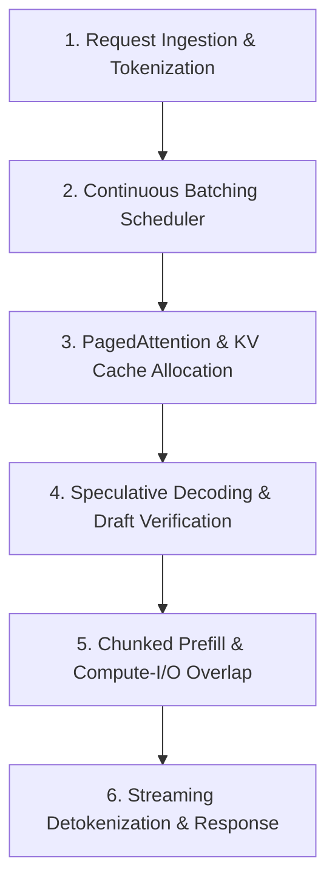

# 📚 DAY 18: HIGH-PERFORMANCE INFERENCE & SERVING SYSTEMS
> **Khóa học:** COMP2010 - AI in Action (VinUni) | AICB-P2T2 | Giảng viên: Nguyễn Hải Dương | Phase 2 - Track 2 - Tuần 4 | **Tối ưu:** Google NotebookLM (< 50MB)

---

## 📌 1. BÀI HỌC HÔM NAY VỀ CÁI GÌ? (THE WHAT & WHY)

*   **Sự Khác Biệt Bản Chất Giữa Training vs Inference:** Trong khi huấn luyện (Training) là tác vụ tập trung vào thông lượng tính toán ma trận (Compute-bound) xử lý theo lô lớn; phục vụ suy luận (Inference) gồm 2 pha tách biệt: Pha Prefill (xử lý toàn bộ prompt đầu vào song song, Compute-bound) và Pha Decode (sinh tuần tự từng token một theo thời gian thực, Memory-bound do bị giới hạn bởi băng thông truy xuất VRAM để nạp KV Cache).
*   **Nghẽn Cổ Chai Bộ Nhớ KV Cache & Đột Phá PagedAttention:** Trong kiến trúc giải mã truyền thống, KV Cache của mỗi request được cấp phát bộ nhớ liên tục tĩnh theo độ dài tối đa (Max Context Length), dẫn đến lãng phí 60-80% VRAM do phân mảnh nội bộ (Internal Fragmentation) và đặt trước dư thừa. Thuật toán PagedAttention (Kwon et al., vLLM) lấy cảm hứng từ bộ nhớ ảo của hệ điều hành, chia KV Cache thành các khối trang (Blocks) rời rạc và cấp phát động, nâng hiệu suất sử dụng VRAM lên trên 96% và tăng thông lượng phục vụ lên 2x - 4x.
*   **Lập Lịch Liên Tục (Continuous / Dynamic Batching):** Kỹ thuật Static Batching truyền thống bắt buộc toàn bộ các câu trong batch phải chờ câu dài nhất hoàn thành mới được trả về. Continuous Batching (Iteration-level Scheduling) cho phép chèn các request mới vào ngay giữa các bước decode của batch đang chạy và giải phóng ngay request đã sinh xong token kết thúc (EOS), triệt tiêu hoàn toàn thời gian chết của GPU.
*   **Tăng Tốc Giải Mã Nâng Cao: Speculative Decoding & TensorRT-LLM:** Cơ chế Speculative Decoding sử dụng một mô hình nhỏ gọn (Draft Model) để phỏng đoán nhanh một chuỗi K tokens, sau đó mô hình lớn (Target Model) chỉ cần chạy một lượt forward pass duy nhất để xác thực song song toàn bộ K tokens này. Kết hợp với các framework tối ưu kernel cấp thấp như NVIDIA TensorRT-LLM và Triton Inference Server, hệ thống giảm độ trễ sinh từ (Time-Per-Output-Token) xuống dưới 15ms.

---

## 💡 2. ẨN DỤ ĐỜI THƯỜNG: THỰC TRẠNG & GIẢI PHÁP

### 🔴 Thực trạng:
Một hệ thống Chatbot phục vụ 1.000 người dùng đồng thời bị sập và phản hồi cực chậm (mất 5 giây mới ra chữ đầu tiên) vì cấp phát bộ nhớ tĩnh cho mỗi người 4.000 từ dù họ chỉ hỏi một câu ngắn 10 từ.

### 🚗 Ẩn dụ đời thường:

> **1. Đặt bàn tiệc cưới cố định (Static Allocation):** Nhà hàng luôn dọn sẵn bàn tiệc 10 món cho mỗi vị khách dù họ chỉ vào uống một tách trà; kết quả là nhà hàng hết sạch bàn ghế (hết VRAM) dù phần lớn ghế ngồi đều bị bỏ trống.
> **2. Khách sạn chia phòng theo thẻ từ linh hoạt (PagedAttention):** Khách sạn không bắt khách thuê nguyên cả dãy nhà; khách đi tới đâu, hệ thống tự động cấp đúng 1 chiếc chìa khóa mở đúng căn phòng nhỏ (block 16 tokens), dùng xong phòng nào trả phòng đó ngay lập tức.
> **3. Xe buýt đón trả khách dọc đường (Continuous Batching):** Thay vì chờ xe buýt đầy khách và chạy một mạch từ bến đầu đến bến cuối mới cho khách khác lên xe; xe buýt hiện đại liên tục mở cửa đón khách mới và thả khách đã tới đích ở mỗi ngã tư mà không dừng máy.
> **4. Thư ký soạn nháp trước văn bản (Speculative Decoding):** Thư ký tập sự (mô hình nhỏ) gõ thật nhanh 5 câu dự thảo văn bản; giám đốc (mô hình lớn) chỉ liếc mắt qua duyệt cả 5 câu trong 1 giây thay vì phải tự tay gõ từng chữ từ đầu.

### 🟢 Giải pháp kỹ thuật:
Triển khai vLLM với PagedAttention để quản lý bộ nhớ động; áp dụng Continuous Batching để tối đa hóa GPU Utilization và tích hợp Speculative Decoding để giảm thiểu độ trễ sinh từ cho người dùng.


---

## 🗺️ 3. SƠ ĐỒ PIPELINE & QUY TRÌNH THỰC HIỆN TỪ ĐẦU ĐẾN CUỐI



*   **1. Request Ingestion & Tokenization:** Tiếp nhận các yêu cầu HTTP REST / gRPC từ Client Gateway
Phân tách chuỗi Prompt đầu vào thành Token IDs bằng Tokenizer C++ siêu tốc (HuggingFace Fast Tokenizers)
Đẩy các yêu cầu vào hàng đợi chờ xử lý (Waiting Queue) của Scheduler.
*   **2. Continuous Batching Scheduler:** Lập lịch điều phối ở cấp độ từng bước giải mã (Iteration-level batching)
Lựa chọn các request từ hàng đợi để ghép vào mẻ tính toán đang chạy
Cân đối giữa số lượng token của pha Prefill mới và pha Decode hiện tại.
*   **3. PagedAttention & KV Cache Allocation:** Phân chia không gian VRAM dành riêng cho KV Cache thành các Physical Blocks (kích thước cố định 16 hoặc 32 tokens)
Cấp phát các Logical Blocks cho từng request thông qua Block Table ánh xạ
Thực hiện chia sẻ bộ nhớ (Copy-on-Write) cho các prompt dùng chung tiền tố (Prefix Caching).
*   **4. Speculative Decoding & Draft Verification:** Mô hình Draft Model nhỏ chạy suy luận tự hồi quy sinh nhanh chuỗi $K$ tokens phỏng đoán
Mô hình Target Model lớn thực hiện tính toán song song ma trận phân phối xác suất của toàn bộ $K$ tokens
Chấp nhận các tokens vượt qua kiểm định phân phối xác suất và hiệu chỉnh token sai đầu tiên.
*   **5. Chunked Prefill & Compute-I/O Overlap:** Chia nhỏ các prompt đầu vào có độ dài lớn thành các phân đoạn (Chunks) có kích thước cố định
Xếp chồng tính toán Compute-bound của Chunked Prefill cùng với Memory-bound của các token Decode
Ngăn chặn hiện tượng giật cục (Latency Spike) của các request đang sinh từ.
*   **6. Streaming Detokenization & Response:** Dịch ngược (Detokenize) các Token IDs vừa sinh thành chuỗi ký tự UTF-8 văn bản
Truyền phát trực tiếp kết quả về client thông qua luồng Server-Sent Events (SSE) / gRPC Stream
Thu hồi toàn bộ Physical Blocks trong Block Table về bể nhớ tự do ngay khi gặp token dừng (EOS).

---

## 🌐 4. KIẾN THỨC MỞ RỘNG CHUYÊN SÂU (FIRECRAWL RESEARCH)

### Cơ chế Phân trang Bộ nhớ PagedAttention & Cấu trúc Block Table
Thuật toán PagedAttention tổ chức KV Cache thành các khối logic có kích thước cố định $B$ (thường $B=16$ hoặc $32$ tokens). Khi một chuỗi sinh ra token mới, nếu khối logic hiện tại bị đầy, hệ thống sẽ yêu cầu Memory Manager cấp phát một khối vật lý mới từ Free Block Pool và cập nhật vào Block Table của chuỗi đó. Cơ chế này loại bỏ hoàn toàn hiện tượng phân mảnh ngoài (External Fragmentation) và cho phép nhiều chuỗi suy luận khác nhau (như trong kỹ thuật Beam Search hoặc Parallel Sampling) dùng chung các khối vật lý của phần tiền tố Prompt qua kỹ thuật Copy-on-Write (CoW).

### Kỹ thuật Chunked Prefill (vLLM & Sarathi-Serve) Triệt tiêu Độ trễ Phản hồi
Trong các hệ thống phục vụ LLM, khi một request có prompt rất dài (ví dụ: 32.000 tokens) đi vào pha Prefill, nó sẽ chiếm dụng 100% thời gian tính toán của GPU trong hàng trăm mili-giây, khiến toàn bộ các request khác đang trong pha Decode bị nghẽn (Inter-Token Latency Spike). Kỹ thuật Chunked Prefill chia nhỏ prompt 32K thành các khối 512 tokens và hòa trộn xử lý cùng các token Decode trong từng iteration, giúp duy trì P99 Time-Per-Output-Token cực kỳ ổn định dưới 20ms.

### Case Study Thực chiến 1: Hệ thống Phục vụ Suy luận Hàng triệu Request/giây tại Cloudflare
Cloudflare Workers AI triển khai hạ tầng suy luận LLM toàn cầu trên hàng nghìn GPU NVIDIA L4 và A100. Bằng việc chuyển đổi từ kiến trúc HuggingFace TGI sang vLLM tích hợp PagedAttention và Prefix Caching cho các system prompt phổ biến, Cloudflare ghi nhận thông lượng phục vụ tăng 3.4 lần, bộ nhớ KV Cache lãng phí giảm từ 68% xuống 4%, và chi phí phần cứng trên mỗi triệu token giảm 58%.

### Case Study Thực chiến 2: Tối ưu Hóa Độ trễ Sinh từ cho Ứng dụng Copilot tại GitHub
GitHub Copilot áp dụng kỹ thuật Speculative Decoding kết hợp mô hình Target LLaMA-3-70B với Draft Model 8B được tinh chỉnh riêng. Do mã nguồn có tính lặp lại cấu trúc cú pháp rất cao, tỷ lệ chấp nhận token (Acceptance Rate) của Draft Model đạt tới 78%, giúp tốc độ gõ code gợi ý tăng từ 28 tokens/s lên 72 tokens/s, mang lại trải nghiệm thời gian thực mượt mà cho hàng triệu lập trình viên.


---

## 🔑 5. BẢNG TỪ KHÓA CỐT LÕI

| Thuật ngữ | Khái niệm kỹ thuật | Giải thích đời thường |
| :--- | :--- | :--- |
| **Time to First Token (TTFT)** | Khoảng thời gian từ khi client gửi yêu cầu đến khi nhận được token đầu tiên trả về, đại diện cho độ trễ của pha Prefill. | Thời gian từ lúc gọi món đến khi bồi bàn mang ra món khai vị đầu tiên. |
| **Time Per Output Token (TPOT)** | Thời gian trung bình để sinh ra mỗi token tiếp theo trong pha Decode, quyết định độ mượt khi đọc văn bản streaming. | Tốc độ bồi bàn tiếp tục rót từng ngụm nước vào ly của khách. |
| **KV Cache** | Bộ nhớ đệm lưu trữ các vector Key và Value của các token đã xử lý để tránh phải tính toán lại trong pha tự hồi quy. | Vở ghi nhớ các chữ cái đã đọc giúp người đọc không phải đọc lại từ đầu trang sách. |
| **PagedAttention** | Thuật toán quản lý bộ nhớ KV Cache theo từng trang rời rạc, lấy cảm hứng từ bộ nhớ ảo của hệ điều hành. | Hệ thống cấp phát thẻ giữ đồ thông minh: đồ đạc gửi vào bao nhiêu ô thì cấp bấy nhiêu chìa khóa. |
| **Continuous Batching** | Kỹ thuật lập lịch ở cấp độ từng token, cho phép ghép request mới vào batch đang chạy và trả về ngay request đã hoàn thành. | Thang máy tự động mở cửa đón thêm người ở mỗi tầng mà không cần quay về tầng trệt. |
| **Speculative Decoding** | Phương pháp dùng mô hình nhỏ phỏng đoán trước nhiều token và dùng mô hình lớn kiểm chứng song song trong 1 bước tính toán. | Trợ lý soạn nháp trước văn bản để sếp chỉ cần ký duyệt đồng loạt trong chớp mắt. |

---

## 🎯 6. BỘ CÂU HỎI ÔN THI TRỌNG TÂM (CHUẨN HỌC THUẬT & ĐẠI HỌC)

### 📝 PHẦN A: 6 CÂU TRẮC NGHIỆM ĐƠN (SINGLE-CHOICE)

#### Câu 1: Điểm khác biệt bản chất về mặt tài nguyên phần cứng giữa Pha Prefill (Prompt Processing) và Pha Decode (Token Generation) trong quá trình suy luận LLM là gì?
*   A. Pha Prefill bị giới hạn bởi năng lực tính toán ma trận (Compute-bound), trong khi Pha Decode bị giới hạn bởi băng thông truy xuất bộ nhớ VRAM (Memory-bound).
*   B. Pha Prefill chỉ chạy trên CPU, trong khi Pha Decode bắt buộc phải chạy trên GPU.
*   C. Pha Prefill tiêu tốn nhiều bộ nhớ KV Cache hơn Pha Decode gấp 100 lần.
*   D. Pha Prefill không hỗ trợ tính toán song song, trong khi Pha Decode có thể song song hóa hoàn toàn.
> **👉 ĐÁP ÁN ĐÚNG: A**  
> **💡 Phân tích & Bẫy logic:** Vì sao A đúng: Ở pha Prefill, toàn bộ Prompt được tính toán đồng thời trong một phép nhân ma trận lớn (kích thước $B 	imes N$), đạt tỷ lệ tính toán trên bộ nhớ (Arithmetic Intensity) cao nên là Compute-bound; ở pha Decode, GPU chỉ sinh 1 token tại một thời điểm ($N=1$), phải nạp toàn bộ trọng số mô hình và KV Cache khổng lồ từ VRAM vào nhân tính toán chỉ để tính cho 1 token, khiến băng thông bộ nhớ VRAM trở thành điểm nghẽn (Memory-bound).
* B sai vì: Cả hai pha đều chạy tối ưu trên GPU.
* C sai vì: Pha Decode sinh thêm token liên tục làm phình to KV Cache theo thời gian, không phải Prefill tốn hơn 100 lần.
* D sai vì: Pha Prefill song song hóa hoàn toàn toàn bộ chuỗi prompt, còn Decode diễn ra tuần tự từng bước.

---

#### Câu 2: Thuật toán PagedAttention trong thư viện vLLM giải quyết triệt để vấn đề lãng phí bộ nhớ VRAM thông qua cơ chế kỹ thuật nào?
*   A. Nén toàn bộ trọng số mô hình về định dạng số nguyên 1-bit.
*   B. Xóa bỏ hoàn toàn bộ đệm KV Cache và tính toán lại từ đầu ở mỗi bước giải mã.
*   C. Phân chia bộ nhớ KV Cache thành các khối trang (Physical Blocks) có kích thước cố định và cấp phát động theo bảng ánh xạ (Block Table) tương tự cơ chế bộ nhớ ảo trong hệ điều hành.
*   D. Ép buộc tất cả các câu hỏi của người dùng phải có độ dài bằng nhau.
> **👉 ĐÁP ÁN ĐÚNG: C**  
> **💡 Phân tích & Bẫy logic:** Vì sao C đúng: PagedAttention phân mảnh KV Cache thành các block nhỏ (16/32 tokens) và ánh xạ từ logical sang physical blocks, loại bỏ hoàn toàn việc phải cấp phát trước một mảng bộ nhớ liên tục khổng lồ cho mỗi request, giúp triệt tiêu phân mảnh bộ nhớ và nâng hiệu suất sử dụng VRAM lên >96%.
* A sai vì: PagedAttention là thuật toán quản lý bộ nhớ KV Cache, không phải kỹ thuật lượng tử hóa 1-bit.
* B sai vì: Xóa KV Cache sẽ khiến chi phí tính toán tăng bậc hai $O(N^2)$, làm tốc độ suy luận chậm đi hàng chục lần.
* D sai vì: PagedAttention cho phép phục vụ các prompt có độ dài hoàn toàn linh động.

---

#### Câu 3: Trong kỹ thuật Speculative Decoding, điều gì xảy ra khi mô hình lớn (Target Model) phát hiện một token do mô hình nhỏ (Draft Model) phỏng đoán bị sai lệch phân phối xác suất?
*   A. Hệ thống lập tức hủy toàn bộ request và trả về thông báo lỗi 500 cho người dùng.
*   B. Mô hình Target Model chấp nhận các token đúng phía trước, sửa lại token bị sai đầu tiên theo phân phối xác suất chính xác của mình và loại bỏ các token phỏng đoán phía sau.
*   C. Mô hình Draft Model sẽ tự động bị xóa khỏi bộ nhớ GPU để nhường chỗ cho mô hình khác.
*   D. Toàn bộ tiến trình suy luận quay trở về bước khởi động lại từ đầu.
> **👉 ĐÁP ÁN ĐÚNG: B**  
> **💡 Phân tích & Bẫy logic:** Vì sao B đúng: Speculative Decoding áp dụng thuật toán lấy mẫu hiệu chỉnh (Modified Rejection Sampling): chấp nhận chuỗi $M$ token đúng đầu tiên, tại vị trí sai đầu tiên, Target Model sẽ lấy mẫu token thay thế chính xác từ phân phối đã hiệu chỉnh và hủy các token phỏng đoán còn lại, đảm bảo đầu ra toán học giống hệt như khi chạy trực tiếp Target Model đơn lẻ.
* A sai vì: Đây là luồng xử lý thông thường, không gây lỗi hệ thống.
* C sai vì: Draft Model tiếp tục được giữ trong VRAM để phỏng đoán cho các bước tiếp theo.
* D sai vì: Hệ thống chỉ dừng ở vị trí token sai và tiếp tục sinh từ đó, không chạy lại từ đầu.

---

#### Câu 4: Chỉ số Time to First Token (TTFT) trong đánh giá hiệu năng hệ thống suy luận LLM phản ánh trải nghiệm nào của người dùng?
*   A. Tốc độ cuộn trang khi toàn bộ văn bản đã được hiển thị xong.
*   B. Thời gian cần thiết để nạp container image từ Docker Hub về máy chủ.
*   C. Tổng thời gian hoàn thành toàn bộ câu trả lời dài 2.000 từ.
*   D. Thời gian chờ đợi từ khi người dùng bấm nút gửi câu hỏi cho đến khi nhìn thấy ký tự đầu tiên xuất hiện trên màn hình.
> **👉 ĐÁP ÁN ĐÚNG: D**  
> **💡 Phân tích & Bẫy logic:** Vì sao D đúng: TTFT đo lường độ trễ từ lúc hệ thống nhận request -> tokenization -> xử lý xong pha Prefill -> sinh và trả về token đầu tiên, là chỉ số quyết định cảm nhận về độ nhạy (responsiveness) của ứng dụng chat.
* A sai vì: Cuộn trang thuộc về giao diện frontend, không liên quan đến TTFT.
* B sai vì: Nạp Docker image là bước triển khai hạ tầng (Deployment cold start), không phải độ trễ của từng request.
* C sai vì: Tổng thời gian hoàn thành câu trả lời được đo bằng chỉ số End-to-End Latency.

---

#### Câu 5: Tại sao kỹ thuật Lập lịch Liên tục (Continuous Batching) lại mang lại thông lượng (Throughput) cao hơn vượt trội so với Lập lịch Tĩnh (Static Batching)?
*   A. Vì nó cho phép chèn các request mới vào batch ngay lập tức tại mỗi iteration giải mã và thu hồi bộ nhớ của các request đã kết thúc, loại bỏ hoàn toàn lãng phí đệm chèn (padding tokens).
*   B. Vì nó tăng xung nhịp phần cứng của card GPU lên gấp đôi.
*   C. Vì nó tự động cắt ngắn câu trả lời của người dùng xuống dưới 10 từ.
*   D. Vì nó chuyển toàn bộ dữ liệu từ VRAM sang lưu trữ trên đĩa từ HDD.
> **👉 ĐÁP ÁN ĐÚNG: A**  
> **💡 Phân tích & Bẫy logic:** Vì sao A đúng: Trong Static Batching, các request ngắn phải đợi request dài nhất sinh xong và toàn bộ batch phải đệm (pad) bằng các token vô nghĩa. Continuous Batching giải phóng ngay request đã sinh xong token EOS và chèn request mới vào vị trí trống ở bước tiếp theo, giữ cho GPU luôn hoạt động ở trạng thái đầy tải hữu ích.
* B sai vì: Continuous Batching là thuật toán phần mềm lập lịch, không ép xung phần cứng.
* C sai vì: Thuật toán không cắt ngắn nội dung người dùng mà sinh đầy đủ theo yêu cầu.
* D sai vì: Chuyển dữ liệu sang HDD sẽ làm sập hiệu năng hệ thống.

---

#### Câu 6: Kỹ thuật Chunked Prefill giúp giải quyết vấn đề gì trong các hệ thống phục vụ suy luận LLM đa người dùng đồng thời?
*   A. Tăng kích thước phông chữ hiển thị trên giao diện web.
*   B. Loại bỏ hoàn toàn sự cần thiết của Tokenizer.
*   C. Triệt tiêu hiện tượng giật cục độ trễ (Latency Spikes / Inter-token jitter) của các request đang decode khi có một request mới với prompt cực dài đi vào hệ thống.
*   D. Tự động dịch văn bản sang 50 ngôn ngữ khác nhau.
> **👉 ĐÁP ÁN ĐÚNG: C**  
> **💡 Phân tích & Bẫy logic:** Vì sao C đúng: Khi có prompt dài (ví dụ 16K tokens) đi vào, nếu chạy Prefill nguyên khối sẽ làm nghẽn GPU trong vài trăm mili-giây, khiến các request khác đang stream từ bị khựng lại. Chunked Prefill băm nhỏ prompt thành các mẩu 512 tokens và chạy kèm với các token decode, làm phẳng tải GPU và ổn định độ trễ TPOT.
* A sai vì: Cỡ chữ hiển thị là tính năng CSS giao diện người dùng.
* B sai vì: Tokenizer vẫn là thành phần bắt buộc để chuyển từ sang token IDs.
* D sai vì: Dịch ngôn ngữ là bài toán nghiệp vụ của mô hình, không phải mục tiêu của Chunked Prefill.

---

### 📝 PHẦN B: 4 CÂU TRẮC NGHIỆM NHIỀU ĐÁP ÁN (MULTI-SELECT)

#### Câu 7: Những kỹ thuật nào sau đây được áp dụng để tối ưu hóa dung lượng bộ nhớ VRAM của bộ đệm KV Cache trong quá trình suy luận LLM? (Chọn 2 đáp án)
*   A. Lượng tử hóa KV Cache sang định dạng FP8 hoặc INT8/INT4 (KV Cache Quantization).
*   B. Áp dụng cơ chế chia sẻ Prefix Caching để tái sử dụng các khối KV Cache của phần System Prompt dùng chung.
*   C. Ép xung nhân Tensor Cores vượt ngưỡng 1.000W điện năng.
*   D. Tắt bỏ hoàn toàn lớp Multi-Head Attention trong kiến trúc mạng Transformer.
> **👉 ĐÁP ÁN ĐÚNG: A, B**  
> **💡 Phân tích & Bẫy logic:** Vì sao A, B đúng: Lượng tử hóa KV Cache từ FP16 (2 bytes) sang FP8 (1 byte) hoặc INT4 (0.5 byte) giúp giảm 50-75% dung lượng VRAM; Prefix Caching giúp hàng nghìn request dùng chung một prompt hệ thống không phải tính và lưu lại KV Cache nhiều lần.
* C sai vì: Ép xung điện năng không làm giảm dung lượng bộ nhớ mà còn gây cháy phần cứng.
* D sai vì: Tắt lớp Attention sẽ phá hủy hoàn toàn khả năng hiểu ngữ cảnh của mô hình.

---

#### Câu 8: Trong các framework phục vụ suy luận hiệu năng cao như TensorRT-LLM hay vLLM, những tối ưu hóa cấp thấp nào sau đây được thực hiện? (Chọn 2 đáp án)
*   A. Tự động chuyển đổi giao diện web của ứng dụng sang ngôn ngữ HTML thuần túy.
*   B. Hợp nhất các toán tử liên tiếp (Kernel Fusion: ví dụ hợp nhất Bias Add + GeLU + LayerNorm) để giảm số lần đọc ghi trung gian qua bộ nhớ HBM.
*   C. Xóa bỏ hoàn toàn mã nguồn Python và chỉ chạy bằng các dòng lệnh Bash shell.
*   D. Triển khai các kernel FlashDecoding / FlashAttention tùy biến tối ưu hóa truy cập bộ nhớ nhanh SRAM của GPU.
> **👉 ĐÁP ÁN ĐÚNG: B, D**  
> **💡 Phân tích & Bẫy logic:** Vì sao B, D đúng: Kernel Fusion gộp nhiều phép tính vào 1 kernel duy nhất giúp tránh ghi tensor trung gian ra VRAM rồi lại đọc vào; FlashDecoding tối ưu hóa đọc KV Cache song song trên nhiều Thread Block giúp tăng tốc giải mã cực đại.
* A sai vì: Giao diện web frontend không thuộc phạm vi xử lý của LLM inference engine.
* C sai vì: Framework vẫn sử dụng Python bindings (Pybind11 / C-API) ở tầng giao tiếp ứng dụng.

---

#### Câu 9: Đâu là các chỉ số Service Level Objective (SLO) then chốt cần được giám sát chặt chẽ trong hệ thống phục vụ LLM Production? (Chọn 2 đáp án)
*   A. Số lượng hình nền đại diện của người dùng được lưu trữ trong cơ sở dữ liệu SQL.
*   B. Tốc độ quạt tản nhiệt của máy tính cá nhân của lập trình viên.
*   C. P99 Time to First Token (TTFT) phản ánh thời gian phản hồi ban đầu của hệ thống dưới tải cao.
*   D. P99 Time Per Output Token (TPOT) và Thông lượng tổng thể (Total Output Tokens per Second).
> **👉 ĐÁP ÁN ĐÚNG: C, D**  
> **💡 Phân tích & Bẫy logic:** Vì sao C, D đúng: P99 TTFT và P99 TPOT cùng với Token Throughput là bộ ba chỉ số sống còn định nghĩa chất lượng dịch vụ (SLA/SLO) của mọi hệ thống LLM Gateway và Inference Engine trên quy mô lớn.
* A sai vì: Hình nền avatar là dữ liệu phi cấu trúc của app thông thường, không đo lường hiệu năng suy luận LLM.
* B sai vì: Quạt máy tính cá nhân của lập trình viên không phản ánh trạng thái cụm máy chủ inference.

---

#### Câu 10: Khi triển khai mô hình LLM với kiến trúc Mixture of Experts (MoE) như Mixtral 8x7B trên hệ thống phục vụ suy luận, những đặc tính vận hành nào sau đây là đúng? (Chọn 2 đáp án)
*   A. Tổng dung lượng VRAM yêu cầu để chứa trọng số tương đương mô hình 47B tham số, nhưng tốc độ tính toán (FLOPs) trên mỗi token chỉ tương đương mô hình 13B tham số do chỉ kích hoạt 2 experts tại một thời điểm.
*   B. Tốc độ suy luận của mô hình MoE luôn chậm hơn mô hình Dense có cùng tổng số tham số gấp 10 lần trong mọi điều kiện.
*   C. Cần tối ưu hóa kỹ thuật phân bổ Expert Parallelism và cân bằng tải Router để tránh tình trạng một số Expert bị quá tải trong khi các Expert khác bị nhàn rỗi.
*   D. Mô hình MoE không cần sử dụng bộ nhớ KV Cache trong quá trình sinh từ.
> **👉 ĐÁP ÁN ĐÚNG: A, C**  
> **💡 Phân tích & Bẫy logic:** Vì sao A, C đúng: Bản chất MoE là kích hoạt thưa (Sparse Activation): cần nạp đủ toàn bộ tham số vào VRAM nhưng chỉ tính toán trên số ít experts được chọn; việc cân bằng tải router (Load Balancing) là tối quan trọng để các GPU xử lý experts đều tải.
* B sai vì: MoE tính toán ít FLOPs hơn mô hình Dense cùng số tham số nên tốc độ sinh từ thực tế nhanh hơn đáng kể.
* D sai vì: MoE vẫn là mô hình Transformer tự hồi quy nên bắt buộc phải dùng KV Cache.

---

## 💻 7. CODE THỰC CHIẾN SẢN XUẤT (PRODUCTION IMPLEMENTATION)

Đoạn mã Python triển khai hệ thống phục vụ suy luận LLM hiệu năng cao với thư viện vLLM, cấu hình PagedAttention, Continuous Batching, Tensor Parallelism và Streaming Async Engine:

```python
import asyncio
from vllm import AsyncLLMEngine, AsyncEngineArgs, SamplingParams
from typing import AsyncGenerator

# 1. Configure Production Engine Arguments
engine_args = AsyncEngineArgs(
    model="meta-llama/Meta-Llama-3-8B-Instruct",
    tensor_parallel_size=2,          # Shard model across 2 GPUs via NVLink
    gpu_memory_utilization=0.92,     # Allocate 92% of VRAM for Weights + KV Cache
    max_model_len=8192,              # Max context window length
    block_size=16,                   # PagedAttention block size (16 tokens/block)
    swap_space=4,                    # 4GB CPU swap space for preempted blocks
    enable_prefix_caching=True,      # Reuse KV Cache for common system prompts
    disable_log_requests=False,
    max_num_batched_tokens=4096,     # Max tokens processed in a single iteration
    max_num_seqs=256                 # Max concurrent active requests (Continuous Batching)
)

# 2. Initialize Asynchronous Inference Engine
engine = AsyncLLMEngine.from_engine_args(engine_args)

async def stream_inference_generator(
    prompt: str,
    request_id: str,
    temperature: float = 0.7,
    max_tokens: int = 512
) -> AsyncGenerator[str, None]:
    """Asynchronous generator yielding streamed tokens via PagedAttention execution."""
    
    # Define generation hyperparameters
    sampling_params = SamplingParams(
        temperature=temperature,
        top_p=0.9,
        max_tokens=max_tokens,
        presence_penalty=0.1,
        frequency_penalty=0.1,
        stop=["<|eot_id|>", "<|end_of_text|>"] # LLaMA-3 stop tokens
    )
    
    # Submit request to Continuous Batching Scheduler
    results_generator = engine.generate(
        prompt=prompt,
        sampling_params=sampling_params,
        request_id=request_id
    )
    
    previous_text_len = 0
    # Stream output tokens as they are decoded in real-time
    async for request_output in results_generator:
        text = request_output.outputs[0].text
        # Extract only newly generated delta text
        delta_text = text[previous_text_len:]
        previous_text_len = len(text)
        yield delta_text

# Example execution with AsyncIO
async def main():
    prompt = "<|begin_of_text|><|start_header_id|>system<|end_header_id|>
You are an expert AI Infrastructure Engineer.<|eot_id|><|start_header_id|>user<|end_header_id|>
Explain PagedAttention in 2 sentences.<|eot_id|><|start_header_id|>assistant<|end_header_id|>
"
    print("Streaming Response: ", end="", flush=True)
    async for chunk in stream_inference_generator(prompt, request_id="req_001"):
        print(chunk, end="", flush=True)
    print()

if __name__ == "__main__":
    asyncio.run(main())
```

### 🔍 Chú thích chi tiết từng khối mã nguồn:
*   **AsyncEngineArgs(tensor_parallel_size=2):** Cấu hình chia nhỏ mô hình qua 2 GPU trong cùng node bằng Tensor Parallelism để giảm độ trễ và tăng dung lượng VRAM khả dụng.
*   **gpu_memory_utilization=0.92:** Dành 92% dung lượng bộ nhớ VRAM cho trọng số mô hình và vùng đệm PagedAttention KV Cache, để lại 8% tránh tràn bộ nhớ khi tính toán trung gian.
*   **block_size=16 & enable_prefix_caching=True:** Kích hoạt đơn vị trang PagedAttention 16 tokens/khối và bật bộ đệm tiền tố thông minh để tái sử dụng ngay KV Cache của system prompt dùng chung.
*   **max_num_seqs=256:** Cho phép lập lịch Continuous Batching xử lý đồng thời tới 256 chuỗi văn bản trong cùng một chu kỳ lặp mà không bị suy giảm thông lượng.
*   **AsyncLLMEngine.generate():** Đẩy yêu cầu vào hàng đợi xử lý bất đồng bộ và trả về luồng `AsyncGenerator` truyền phát trực tiếp từng token (Server-Sent Events) tới người dùng.

---

## 🛠️ 8. BẪY LỖI PHỔ BIẾN & KỸ THUẬT DEBUG THỰC CHIẾN

### ⚠️ Hiện tượng Giật Cục Độ Trễ (Inter-Token Latency Spikes) do Thiếu Chunked Prefill
*   **🔍 Hiện tượng (Symptom):** Người dùng đang đọc câu trả lời được stream mượt mà thì văn bản bị khựng lại mất 1.5 - 2 giây mới hiện tiếp từ tiếp theo.
*   **💥 Nguyên nhân gốc rễ (Root Cause):** Một request mới với tài liệu tham khảo đính kèm dài 30.000 tokens đi vào hệ thống và kích hoạt pha Prefill nguyên khối (Full Prefill), chiếm trọn tài nguyên tính toán của GPU trong hàng nghìn mili-giây.
*   **🛠️ Giải pháp khắc phục (Production Fix):** Bật tính năng Chunked Prefill trong cấu hình engine: `enable_chunked_prefill=True` và giới hạn `max_num_batched_tokens=2048` để chia nhỏ pha prefill thành các mẩu nhỏ hòa trộn cùng luồng decode.

### ⚠️ KV Cache Thrashing / Preemption do Thiết lập GPU Memory Utilization Quá Cao
*   **🔍 Hiện tượng (Symptom):** Dưới tải cao, thông lượng hệ thống giảm đột ngột và log máy chủ liên tục cảnh báo `Sequence X was preempted and swapped to CPU`.
*   **💥 Nguyên nhân gốc rễ (Root Cause):** Dung lượng VRAM cấp phát cho KV Cache bị cạn kiệt do số lượng active requests vượt quá khả năng chứa của VRAM, buộc engine phải giải phóng và swap các block đang chạy xuống CPU RAM rồi nạp lại (Thrashing).
*   **🛠️ Giải pháp khắc phục (Production Fix):** Giảm nhẹ `max_num_seqs` hoặc giảm `max_model_len`, tăng dung lượng swap space trên host CPU RAM, hoặc mở rộng thêm GPU worker nodes để san tải thông qua bộ cân bằng tải Load Balancer.

### ⚠️ Lỗi Memory Leak trong Custom Fast Tokenizer khi Chạy Đa Tiến Trình (Multiprocessing)
*   **🔍 Hiện tượng (Symptom):** Dung lượng RAM hệ thống của máy chủ Inference tăng liên tục theo thời gian cho đến khi tiến trình bị hệ điều hành ngắt bằng tín hiệu `SIGKILL (OOMKilled)`.
*   **💥 Nguyên nhân gốc rễ (Root Cause):** Sử dụng Tokenizer C++ trong vòng lặp đa luồng Python mà không giải phóng GIL hoặc giữ lại tham chiếu circular reference đến các đối tượng Tensor đã giải mã.
*   **🛠️ Giải pháp khắc phục (Production Fix):** Sử dụng Tokenizer chuẩn hóa được đóng gói qua C++ binding tĩnh của HuggingFace `tokenizers` với biến môi trường `export TOKENIZERS_PARALLELISM=false` khi chạy trong tiến trình con AsyncIO.

---

## ⚖️ 9. BẢNG SO SÁNH ĐỐI ĐẦU & ĐÁNH ĐỔI VẬN HÀNH (TRADE-OFFS MATRIX)

Bảng so sánh chi tiết giữa các giải pháp Inference Engine và Serving Framework hàng đầu:

| Tiêu chí Đánh giá | vLLM Engine | NVIDIA TensorRT-LLM | HuggingFace TGI | Ollama / llama.cpp |
| :--- | :--- | :--- | :--- | :--- |
| **Ngôn ngữ & Cốt lõi** | Python + C++/CUDA Kernels | Thuần C++ / CUDA Graph tối ưu | Rust + Python Web Server | Thuần C/C++ (GGML/GGUF) |
| **Hiệu năng Thông lượng (Throughput)** | Rất cao (PagedAttention + CoW) | Tối đa (được NVIDIA tối ưu cho GPU) | Cao (PagedAttention tích hợp) | Trung bình (tối ưu hóa cho thiết bị biên) |
| **Độ trễ Đơn lẻ (P99 Latency)** | Rất thấp (<20ms / token) | Cực thấp (<10-15ms / token) | Thấp (<25ms / token) | Phụ thuộc vào phần cứng CPU/Apple Silicon |
| **Hỗ trợ Phần cứng** | NVIDIA GPUs, AMD ROCm, Intel Gaudi | Chỉ hỗ trợ độc quyền NVIDIA GPUs | NVIDIA GPUs, AWS Inferentia | CPU, Apple Metal, NVIDIA/AMD GPU |
| **Độ phức tạp Triển khai** | Dễ dàng (Pip install, Python native) | Rất phức tạp (Cần build engine riêng) | Trung bình (Docker Container có sẵn) | Cực kỳ đơn giản (1 file binary duy nhất) |
| **Kịch bản Tối ưu** | Hạ tầng phục vụ Cloud quy mô lớn | Hệ thống Enterprise yêu cầu độ trễ tối thiểu | Triển khai nhanh trên HuggingFace Hub | Chạy Local trên Laptop / Edge Device |

> **💡 Lời khuyên kiến trúc (Architectural Recommendation):** Với phần lớn các doanh nghiệp và dự án Cloud AI, vLLM là sự lựa chọn tối ưu nhất nhờ sự cân bằng hoàn hảo giữa thông lượng cực cao, tính năng phong phú (Prefix Caching, Speculative Decoding) và sự linh hoạt của hệ sinh thái Python. Khi cần vắt kiệt 100% hiệu năng phần cứng trên chip NVIDIA với độ trễ thấp nhất có thể, TensorRT-LLM là lựa chọn số một.
