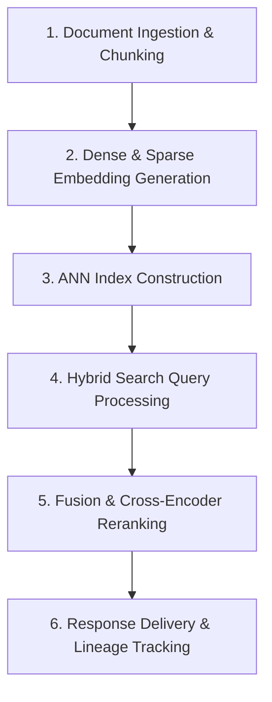

# 📚 DAY 19: VECTOR DATABASES & SEMANTIC RETRIEVAL INFRASTRUCTURE
> **Khóa học:** COMP2010 - AI in Action (VinUni) | AICB-P2T2 | Giảng viên: Nguyễn Hải Dương | Phase 2 - Track 2 - Tuần 5 | **Tối ưu:** Google NotebookLM (< 50MB)

---

## 📌 1. BÀI HỌC HÔM NAY VỀ CÁI GÌ? (THE WHAT & WHY)

*   **Giới hạn của Cơ sở Dữ liệu Quan hệ & Sự Trỗi Dậy của Vector DB:** Các cơ sở dữ liệu quan hệ truyền thống (RDBMS/SQL) chỉ hỗ trợ tìm kiếm khớp chuỗi ký tự chính xác hoặc tìm kiếm văn bản đầy đủ dựa trên tần suất từ (BM25/Lexical Search), hoàn toàn bất lực trước việc tìm kiếm tương quan ngữ nghĩa (Semantic Similarity). Vector Database được thiết kế chuyên biệt để lưu trữ và truy vấn các vector nhiều chiều ($d = 768 - 1536$), cho phép tìm kiếm các khái niệm tương đồng về mặt ý nghĩa bất kể từ ngữ sử dụng khác biệt.
*   **Thuật toán Tìm kiếm Láng giềng Gần đúng (ANN Indexing):** Việc tính toán khoảng cách vector chính xác (Exact kNN) có độ phức tạp $O(N \cdot d)$, không thể mở rộng trên hàng triệu vector. Các thuật toán Approximate Nearest Neighbor (ANN) ra đời để giải quyết bài toán này: HNSW (Hierarchical Navigable Small World - đồ thị phân tầng đa lớp cho độ chính xác cao nhất), IVF-PQ (Inverted File with Product Quantization - phân cụm và nén vector giúp tiết kiệm 80-95% RAM) và DiskANN (tối ưu hóa lưu trữ chỉ mục trên SSD NVMe).
*   **Kiến trúc Tìm kiếm Lai (Hybrid Search) & Thuật toán RRF:** Dense Retrieval (Vector nhúng) xuất sắc trong việc nắm bắt ngữ nghĩa khái quát nhưng dễ bỏ sót các từ khóa hiếm, mã định danh chính xác (SKU, mã lỗi, tên riêng); trong khi Sparse Retrieval (BM25) bắt chính xác từ khóa nhưng mù ngữ nghĩa. Hybrid Search kết hợp cả hai phương pháp và sử dụng công thức Reciprocal Rank Fusion (RRF): $RRF(d) = \sum_{m \in M} \frac{1}{k + r_m(d)}$ (với $k \approx 60$) để tạo ra bảng xếp hạng toàn diện vượt trội.
*   **Phân vùng Dữ liệu (Sharding) & Khả năng Mở rộng Phân tán:** Kiến trúc các hệ thống Vector DB hiện đại (Milvus, Qdrant, Pinecone) phân tách rõ ràng giữa tầng tính toán (Query Node), tầng lập chỉ mục (Index Node) và tầng lưu trữ bền vững (Storage Node). Dữ liệu vector được sharding theo Collection Partition Key và phân tán trên cụm máy chủ, kết hợp bộ lọc Metadata Filtering tối ưu hóa thời gian phản hồi dưới 10ms trên tập dữ liệu hàng tỷ vector.

---

## 💡 2. ẨN DỤ ĐỜI THƯỜNG: THỰC TRẠNG & GIẢI PHÁP

### 🔴 Thực trạng:
Một hệ thống tìm kiếm nội bộ công ty sử dụng SQL thông thường; khi nhân viên gõ tìm kiếm 'cách xin nghỉ phép chăm con ốm', hệ thống không trả về kết quả nào vì trong văn bản quy chế chính thức chỉ có từ khóa 'chế độ nghỉ hưởng bảo hiểm thai sản'.

### 🚗 Ẩn dụ đời thường:

> **1. Từ điển tra chữ cái vs Bản đồ tư duy (SQL vs Vector DB):** Cơ sở dữ liệu SQL giống như cuốn từ điển xếp theo thứ tự A-Z, chỉ tìm được khi biết chính xác từ cần tra; còn Vector DB giống như quả địa cầu 3D, các khái niệm có ý nghĩa gần nhau sẽ được đặt cạnh nhau trong không gian.
> **2. Mạng lưới người quen 6 bậc (HNSW Graph):** Để tìm một chuyên gia về AI tại một thành phố 10 triệu dân, bạn không cần gõ cửa từng nhà; bạn hỏi thị trưởng (lớp đồ thị thưa trên cùng), thị trưởng chỉ xuống quận trưởng, quận trưởng chỉ xuống tổ trưởng (lớp đồ thị dày đặc dưới cùng) và tìm ra đúng người trong vài bước hỏi.
> **3. Kính lúp và Ống nhòm tầm xa (Hybrid Search):** Sparse Search (BM25) như chiếc kính lúp soi rõ từng chi tiết số seri nhỏ; Dense Search như chiếc ống nhòm bắt trọn toàn cảnh bức tranh; kết hợp cả hai giúp thám tử không bỏ sót bất kỳ manh mối nào.
> **4. Hội đồng chấm thi độc lập (Reciprocal Rank Fusion):** Hai giám khảo (BM25 và Vector) đưa ra hai danh sách xếp hạng ứng viên độc lập; thư ký dùng công thức RRF cộng điểm nghịch đảo thứ hạng để chọn ra thí sinh xuất sắc toàn diện nhất.

### 🟢 Giải pháp kỹ thuật:
Triển khai cơ sở dữ liệu Vector chuyên dụng (Qdrant/Milvus) kết hợp chỉ mục đồ thị HNSW cho Dense Search, BM25 cho Sparse Search và thuật toán RRF để tối ưu hóa 100% độ chính xác tìm kiếm ngữ nghĩa.


---

## 🗺️ 3. SƠ ĐỒ PIPELINE & QUY TRÌNH THỰC HIỆN TỪ ĐẦU ĐẾN CUỐI



*   **1. Document Ingestion & Chunking:** Thu thập dữ liệu văn bản từ nhiều nguồn (PDF, Confluence, Notion, Cơ sở dữ liệu SQL)
Áp dụng kỹ thuật Recursive Character Chunking với kích thước chunk 512 tokens và overlap 10%
Trích xuất và chuẩn hóa siêu dữ liệu (Metadata: Document ID, Department, Created Timestamp).
*   **2. Dense & Sparse Embedding Generation:** Đưa các đoạn văn bản qua mô hình Dense Embedding (BGE-Large, OpenAI text-embedding-3-small) tạo vector 1536 chiều
Đồng thời tạo biểu diễn Sparse Vector thông qua BM25 Token Weighting
Đóng gói dữ liệu Payload hoàn chỉnh sẵn sàng nạp vào Vector DB.
*   **3. ANN Index Construction:** Xây dựng chỉ mục HNSW với các tham số tối ưu: $M=16$ (số liên kết mỗi node), $efConstruction=200$ (độ sâu xây dựng)
Áp dụng kỹ thuật lượng tử hóa Scalar Quantization (SQ8) hoặc Product Quantization (PQ) để giảm 75% RAM
Lưu trữ chỉ mục bền vững trên hệ thống đĩa NVMe SSD.
*   **4. Hybrid Search Query Processing:** Tiếp nhận câu truy vấn người dùng, song song hóa 2 luồng tìm kiếm: Dense Vector Search qua HNSW và Sparse Search qua Inverted Index
Thực thi bộ lọc Metadata Pre-filtering trực tiếp trong quá trình duyệt đồ thị HNSW
Thu về danh sách Top 100 ứng viên từ mỗi nhánh tìm kiếm.
*   **5. Fusion & Cross-Encoder Reranking:** Áp dụng thuật toán Reciprocal Rank Fusion (RRF) với hệ số $k=60$ để hợp nhất 2 danh sách ứng viên
Đưa Top 30 tài liệu qua mô hình Cross-Encoder Reranker (BGE-Reranker-Large / Cohere Rerank) để chấm điểm tương quan sâu
Chọn lọc lấy Top 5 tài liệu có điểm số phù hợp ngữ cảnh cao nhất.
*   **6. Response Delivery & Lineage Tracking:** Đóng gói ngữ cảnh sạch kèm trích dẫn nguồn (Citations) gửi về LLM Generation Pipeline
Đo lường các chỉ số truy xuất: P99 Query Latency, MRR (Mean Reciprocal Rank) và Hit Rate
Ghi nhận toàn bộ vết truy vấn (Query Traces) vào hệ thống Observability.

---

## 🌐 4. KIẾN THỨC MỞ RỘNG CHUYÊN SÂU (FIRECRAWL RESEARCH)

### Bản chất Toán học của Đồ thị HNSW (Hierarchical Navigable Small World)
Thuật toán HNSW cấu trúc không gian vector thành một hệ thống phân cấp gồm nhiều lớp đồ thị lồng nhau (tương tự cấu trúc Skip List). Lớp trên cùng (Layer $L_{max}$) có số lượng vector rất thưa thớt với các liên kết dài, cho phép thuật toán tìm kiếm 'nhảy cóc' cực nhanh qua các vùng không gian lớn với độ phức tạp $O(\log N)$. Khi tiến gần đến vùng lân cận của query vector, thuật toán chuyển dần xuống các lớp thấp hơn có mật độ node dày đặc hơn để tinh chỉnh kết quả tìm kiếm cục bộ, đạt được sự cân bằng hoàn hảo giữa thời gian truy vấn (<5ms) và độ hồi đáp (Recall > 98%).

### Kỹ thuật Lượng tử hóa Vector (Vector Quantization: SQ vs PQ vs DiskANN)
Khi quy mô dữ liệu vượt qua 100 triệu vector, việc lưu toàn bộ vector FP32 vào RAM đòi hỏi hàng Terabyte bộ nhớ cực kỳ tốn kém. Scalar Quantization (SQ8) ánh xạ từng giá trị float32 thành int8, giảm 4x dung lượng RAM với độ suy giảm Recall < 1%. Product Quantization (PQ) chia vector $D$ chiều thành $m$ đoạn vector con và ánh xạ vào các centroid cụm (codebook), giảm dung lượng từ 16x đến 32x. Gần đây, kiến trúc DiskANN (Microsoft Research) lưu trữ đồ thị nén Vamana trên ổ cứng SSD NVMe và chỉ giữ một lượng nhỏ nén trong RAM, cho phép phục vụ hàng tỷ vector trên 1 node máy chủ duy nhất.

### Case Study Thực chiến 1: Hệ thống Tìm kiếm Ngữ nghĩa Hàng tỷ Sản phẩm tại Pinterest
Pinterest chuyển đổi toàn bộ hạ tầng tìm kiếm hình ảnh và sản phẩm liên quan sang cụm Vector DB phân tán sử dụng thuật toán HNSW kết hợp Product Quantization. Bằng việc tối ưu hóa cấu trúc đồ thị và lưu trữ vector nén trong bộ nhớ cache kết hợp SSD, Pinterest phục vụ hơn 5 tỷ vector với thông lượng 150.000 queries/giây, giảm 65% chi phí máy chủ và cải thiện 18% tỷ lệ tương tác (Engagement Rate) của người dùng.

### Case Study Thực chiến 2: Hạ tầng RAG Đa ngôn ngữ tại DoorDash
DoorDash triển khai hệ thống Hybrid Search kết hợp Qdrant Vector DB và Elasticsearch BM25 để phục vụ tìm kiếm nhà hàng và món ăn theo ngữ cảnh tự nhiên. Việc áp dụng Reciprocal Rank Fusion (RRF) kết hợp Cross-Encoder Reranker giúp giải quyết triệt để vấn đề tìm kiếm các món ăn đặc thù có tên gọi địa phương hoặc viết tắt, nâng tỷ lệ chuyển đổi đơn hàng (Order Conversion Rate) thêm 14.2% so với tìm kiếm từ khóa truyền thống.


---

## 🔑 5. BẢNG TỪ KHÓA CỐT LÕI

| Thuật ngữ | Khái niệm kỹ thuật | Giải thích đời thường |
| :--- | :--- | :--- |
| **Dense Embedding** | Biểu diễn ngữ nghĩa của đoạn văn bản dưới dạng một vector số thực liên tục có số chiều cố định (ví dụ 1536 chiều), trong đó hầu hết các chiều đều có giá trị khác 0. | Tọa độ GPS định vị chính xác vị trí của một ý tưởng trên bản đồ tri thức toàn cầu. |
| **Sparse Vector (BM25)** | Biểu diễn văn bản dưới dạng vector có số chiều bằng kích thước từ điển (hàng chục nghìn chiều) nhưng chỉ chứa giá trị khác 0 tại các vị trí từ khóa xuất hiện. | Danh sách các từ khóa đặc trưng xuất hiện trong bài kèm số lần xuất hiện của chúng. |
| **HNSW** | Hierarchical Navigable Small World: Thuật toán chỉ mục vector dạng đồ thị phân tầng giúp tìm kiếm láng giềng gần đúng với độ phức tạp logarit O(log N). | Mạng lưới quan hệ xã hội phân cấp từ cấp trung ương xuống địa phương để tìm nhanh một người quen. |
| **Product Quantization (PQ)** | Kỹ thuật nén vector bằng cách chia nhỏ vector thành nhiều đoạn và thay thế mỗi đoạn bằng chỉ số của cụm đại diện gần nhất. | Nén ảnh chụp siêu nét thành ảnh đại diện thu nhỏ để tiết kiệm bộ nhớ mà vẫn nhận ra được khuôn mặt. |
| **Reciprocal Rank Fusion (RRF)** | Thuật toán không tham số kết hợp kết quả từ nhiều công cụ tìm kiếm khác nhau dựa trên nghịch đảo thứ hạng của từng tài liệu. | Bảng tổng sắp huy chương thể thao tính điểm dựa trên thứ hạng về đích của vận động viên trong nhiều môn thi. |
| **Cross-Encoder Reranker** | Mô hình nơ-ron nhận đồng thời cả Query và Document đầu vào để tính toán điểm tương quan ngữ nghĩa trực tiếp với độ chính xác rất cao. | Vị giám khảo ngồi phỏng vấn trực tiếp từng thí sinh để chấm điểm chi tiết sau vòng sơ loại hồ sơ. |

---

## 🎯 6. BỘ CÂU HỎI ÔN THI TRỌNG TÂM (CHUẨN HỌC THUẬT & ĐẠI HỌC)

### 📝 PHẦN A: 6 CÂU TRẮC NGHIỆM ĐƠN (SINGLE-CHOICE)

#### Câu 1: Lý do cốt lõi nào khiến phương pháp tìm kiếm Vector thuần túy (Dense Retrieval) đôi khi hoạt động kém hiệu quả hơn tìm kiếm từ khóa truyền thống (BM25/Sparse Search)?
*   A. Dense Retrieval chỉ chạy được trên CPU và không hỗ trợ card đồ họa GPU.
*   B. Dense Retrieval làm tăng gấp 10 lần kích thước văn bản lưu trữ trên đĩa cứng.
*   C. Dense Retrieval không hỗ trợ ngôn ngữ Tiếng Anh.
*   D. Dense Retrieval biểu diễn ngữ nghĩa trừu tượng trong không gian tiềm ẩn nên dễ bỏ sót các từ khóa chính xác, mã định danh sản phẩm (SKU), số hiệu kỹ thuật hoặc các tên riêng hiếm gặp.
> **👉 ĐÁP ÁN ĐÚNG: D**  
> **💡 Phân tích & Bẫy logic:** Vì sao D đúng: Mô hình Embedding nén thông tin thành vector ngữ nghĩa tổng quát, làm mờ đi các chi tiết từ ngữ cụ thể; đối với các truy vấn chứa mã lỗi (Error Code), mã số thuế, mã sản phẩm hoặc tên riêng đặc thù, BM25 tìm kiếm khớp từ khóa chính xác mang lại kết quả vượt trội.
* A sai vì: Dense Retrieval được tối ưu hóa chạy cực nhanh trên GPU với CUDA.
* B sai vì: Vector Embedding được lưu riêng biệt, không làm tăng kích thước văn bản gốc.
* C sai vì: Hầu hết các mô hình Embedding đều được huấn luyện tối ưu trên Tiếng Anh và đa ngôn ngữ.

---

#### Câu 2: Trong thuật toán chỉ mục đồ thị HNSW, vai trò của siêu tham số `efConstruction` là gì?
*   A. Số lượng nhân CPU tối đa được phép sử dụng khi chạy thuật toán.
*   B. Kích thước của danh sách ứng viên ưu tiên (Priority Queue) được duyệt trong quá trình xây dựng đồ thị; giá trị càng lớn thì đồ thị càng chất lượng và Recall càng cao nhưng tốn nhiều thời gian lập chỉ mục hơn.
*   C. Dung lượng bộ nhớ RAM tối đa (tính theo Megabyte) được cấp cho mỗi vector.
*   D. Số lượng từ khóa tối đa được phép lưu trong mỗi tài liệu văn bản.
> **👉 ĐÁP ÁN ĐÚNG: B**  
> **💡 Phân tích & Bẫy logic:** Vì sao B đúng: `efConstruction` điều khiển độ sâu của quá trình tìm kiếm láng giềng khi chèn một vector mới vào đồ thị HNSW; tăng `efConstruction` giúp tìm được các láng giềng gần thực sự hơn, tạo ra cấu trúc đồ thị tối ưu với Recall cao hơn, đánh đổi bằng thời gian xây dựng chỉ mục (Index Build Time) lâu hơn.
* A sai vì: Số nhân CPU được điều khiển bởi tham số `num_threads`.
* C sai vì: Dung lượng RAM phụ thuộc vào số chiều vector $d$ và số liên kết $M$.
* D sai vì: HNSW hoạt động trên vector số thực, không giới hạn số từ khóa văn bản.

---

#### Câu 3: Thuật toán Reciprocal Rank Fusion (RRF) kết hợp kết quả từ Dense Search và Sparse Search theo nguyên lý toán học nào?
*   A. Cộng dồn điểm số nghịch đảo của thứ hạng tài liệu trong từng danh sách theo công thức: RRF_Score = ∑ 1 / (k + rank), với k là hằng số làm mịn (thường k = 60).
*   B. Nhân trực tiếp điểm số khoảng cách Cosine với điểm số xác suất của BM25.
*   C. Lấy giá trị lớn nhất (Max) giữa điểm số BM25 và điểm số Dot Product.
*   D. Xóa bỏ hoàn toàn danh sách có ít tài liệu hơn và chỉ giữ lại danh sách dài hơn.
> **👉 ĐÁP ÁN ĐÚNG: A**  
> **💡 Phân tích & Bẫy logic:** Vì sao A đúng: RRF là phương pháp Rank-based không tham số, giải quyết triệt để vấn đề không đồng nhất về thang đo điểm số giữa Dense (Cosine Similarity [0,1]) và Sparse (BM25 [0, ∞)) bằng cách chỉ sử dụng thứ hạng vị trí $r(d)$ để chấm điểm cộng dồn, giúp tài liệu xuất hiện ở thứ hạng cao trong cả hai danh sách sẽ đạt điểm tổng hợp cao nhất.
* B sai vì: Điểm Cosine và BM25 có phân phối và miền giá trị hoàn toàn khác nhau, nhân trực tiếp sẽ gây méo mó kết quả.
* C sai vì: Lấy Max không giải quyết được xung đột thang đo điểm số.
* D sai vì: Xóa bỏ danh sách sẽ làm mất đi ý nghĩa của tìm kiếm lai (Hybrid Search).

---

#### Câu 4: Kỹ thuật Metadata Pre-filtering trong Vector Database mang lại ưu thế vượt trội nào so với Post-filtering?
*   A. Giúp chuyển đổi toàn bộ cơ sở dữ liệu sang định dạng văn bản thô.
*   B. Loại bỏ hoàn toàn sự cần thiết của việc tạo Vector Embedding.
*   C. Lọc và loại bỏ ngay các vector không thỏa mãn điều kiện metadata TRƯỚC HOẶC TRONG KHI duyệt đồ thị ANN, đảm bảo luôn trả về đủ số lượng Top-K kết quả hợp lệ.
*   D. Tự động mã hóa toàn bộ dữ liệu người dùng bằng thuật toán lượng tử.
> **👉 ĐÁP ÁN ĐÚNG: C**  
> **💡 Phân tích & Bẫy logic:** Vì sao C đúng: Trong Post-filtering, hệ thống lấy Top-K vector gần nhất rồi mới lọc metadata, nếu các vector này không thỏa mãn điều kiện thì kết quả trả về sẽ bị thiếu hoặc rỗng (ví dụ lấy Top 10 nhưng sau khi lọc chỉ còn 1 kết quả); Pre-filtering (đặc biệt là Single-stage Filtered HNSW) lồng ghép bộ lọc trực tiếp vào quá trình duyệt đồ thị, đảm bảo trả về chính xác $K$ kết quả thỏa mãn điều kiện.
* A sai vì: Pre-filtering không can thiệp vào định dạng lưu trữ văn bản.
* B sai vì: Quá trình tìm kiếm vector vẫn bắt buộc phải sử dụng Embedding.
* D sai vì: Metadata filtering là phép lọc logic, không phải thuật toán mã hóa lượng tử.

---

#### Câu 5: Khi quy mô cơ sở dữ liệu vector đạt mức hàng trăm triệu vector, giải pháp nào sau đây giúp tối ưu hóa chi phí phần cứng lưu trữ mà vẫn duy trì hiệu năng truy vấn cao?
*   A. Xóa bỏ 90% dữ liệu của công ty để chỉ giữ lại 10% dữ liệu mới nhất.
*   B. Chuyển toàn bộ dữ liệu vector sang lưu trữ trên băng từ Tape Drive truyền thống.
*   C. Giảm số chiều của vector từ 1536 chiều xuống còn 2 chiều bằng thuật toán PCA.
*   D. Áp dụng kỹ thuật DiskANN (hoặc Qdrant on-disk storage) lưu trữ đồ thị vector trên ổ cứng SSD NVMe tốc độ cao và chỉ lưu trữ vector nén (PQ/SQ) trong bộ nhớ RAM.
> **👉 ĐÁP ÁN ĐÚNG: D**  
> **💡 Phân tích & Bẫy logic:** Vì sao D đúng: Các giải pháp tối ưu bộ nhớ hiện đại như DiskANN hay Qdrant On-Disk Payload & Vector Storage đưa phần lớn dữ liệu đồ thị và vector gốc xuống ổ SSD NVMe (giá thành rẻ hơn RAM hàng chục lần), chỉ giữ codebook nén và cấu trúc định tuyến trong RAM, giúp giảm 80-90% chi phí RAM máy chủ mà độ trễ truy vấn chỉ tăng thêm vài mili-giây.
* A sai vì: Xóa dữ liệu gây mất mát thông tin quan trọng của doanh nghiệp.
* B sai vì: Băng từ Tape có độ trễ truy xuất hàng phút, không thể phục vụ tìm kiếm thời gian thực.
* C sai vì: Giảm vector xuống 2 chiều sẽ phá hủy hoàn toàn không gian biểu diễn ngữ nghĩa, làm mất sạch thông tin.

---

#### Câu 6: Điểm khác biệt mấu chốt giữa mô hình Bi-Encoder (Embedding Model) và mô hình Cross-Encoder (Reranker) là gì?
*   A. Bi-Encoder mã hóa Query và Document độc lập thành các vector riêng biệt (cho phép tính trước và tìm kiếm cực nhanh qua Vector DB), trong khi Cross-Encoder nhận đồng thời cả cặp (Query, Document) vào mạng Transformer để tính toán tương quan ngữ nghĩa sâu từng từ (chính xác hơn nhưng chậm hơn).
*   B. Bi-Encoder chỉ chạy được trên hình ảnh, còn Cross-Encoder chỉ chạy được trên âm thanh.
*   C. Bi-Encoder luôn có độ chính xác cao hơn Cross-Encoder trong mọi trường hợp.
*   D. Cross-Encoder không thể chạy trên các máy chủ GPU hiện đại.
> **👉 ĐÁP ÁN ĐÚNG: A**  
> **💡 Phân tích & Bẫy logic:** Vì sao A đúng: Bi-Encoder tách rời việc nhúng Document (tính trước 1 lần offline) và Query, cho phép tìm kiếm hàng triệu tài liệu trong vài mili-giây qua tích vô hướng; Cross-Encoder sử dụng cơ chế Cross-Attention tương tác trực tiếp giữa từng token của Query và Document, cho độ chính xác vượt trội nhưng chi phí tính toán đắt đỏ, do đó chỉ dùng để xếp hạng lại (Rerank) Top 20-50 tài liệu ứng viên.
* B sai vì: Cả hai kiến trúc đều là các mô hình xử lý ngôn ngữ tự nhiên (NLP) trên văn bản.
* C sai vì: Cross-Encoder có độ chính xác cao hơn Bi-Encoder nhờ cơ chế Cross-Attention đầy đủ giữa các từ.
* D sai vì: Cross-Encoder chạy cực kỳ tối ưu trên GPU.

---

### 📝 PHẦN B: 4 CÂU TRẮC NGHIỆM NHIỀU ĐÁP ÁN (MULTI-SELECT)

#### Câu 7: Những yếu tố nào sau đây quyết định trực tiếp đến chất lượng truy xuất (Retrieval Quality) của một hệ thống Vector Database trong ứng dụng RAG? (Chọn 2 đáp án)
*   A. Chiến lược chia nhỏ văn bản (Chunking Strategy) phù hợp với độ dài ngữ nghĩa của tài liệu.
*   B. Năng lực biểu diễn và sự tương thích miền dữ liệu của mô hình Embedding được lựa chọn.
*   C. Tốc độ quay của ổ đĩa cứng cơ học HDD cài đặt hệ điều hành.
*   D. Màu sắc giao diện của bảng điều khiển Vector Database Admin Dashboard.
> **👉 ĐÁP ÁN ĐÚNG: A, B**  
> **💡 Phân tích & Bẫy logic:** Vì sao A, B đúng: Kích thước chunk quá nhỏ làm mất ngữ cảnh, quá lớn làm loãng thông tin; mô hình Embedding chất lượng cao phù hợp với ngôn ngữ và lĩnh vực chuyên ngành là hai yếu tố cốt lõi quyết định độ chính xác của vector biểu diễn.
* C sai vì: Vector DB hiện đại bắt buộc dùng SSD NVMe/RAM, ổ HDD cơ học không đáp ứng được I/O ngẫu nhiên.
* D sai vì: Giao diện dashboard không ảnh hưởng đến thuật toán truy xuất toán học.

---

#### Câu 8: Trong các hệ thống cơ sở dữ liệu vector phân tán (như Qdrant hay Milvus), những cơ chế nào sau đây đảm bảo tính sẵn sàng cao (High Availability) và khả năng mở rộng (Scalability)? (Chọn 2 đáp án)
*   A. Phân chia bộ sưu tập (Collection) thành nhiều Shards và phân phối đều trên các node trong cụm.
*   B. Thiết lập các bản sao phân vùng (Shard Replicas) đồng bộ dữ liệu qua giao thức đồng thuận (Raft consensus) để chịu lỗi khi có node gặp sự cố.
*   C. Ép buộc toàn bộ cụm máy chủ phải tắt nguồn và khởi động lại sau mỗi 60 phút.
*   D. Lưu trữ toàn bộ dữ liệu trên một tệp văn bản duy nhất `.txt` không khóa bảo vệ.
> **👉 ĐÁP ÁN ĐÚNG: A, B**  
> **💡 Phân tích & Bẫy logic:** Vì sao A, B đúng: Sharding giúp mở rộng dung lượng và song song hóa tìm kiếm trên nhiều máy chủ; Replication kết hợp thuật toán đồng thuận Raft đảm bảo hệ thống vẫn phục vụ truy vấn bình thường ngay cả khi một số node phần cứng bị chết.
* C sai vì: Khởi động lại liên tục sẽ làm gián đoạn dịch vụ và phá vỡ cam kết SLA uptime.
* D sai vì: Lưu file `.txt` đơn lẻ không có tính phân tán, không chịu lỗi và dễ bị hỏng dữ liệu.

---

#### Câu 9: Đâu là các thước đo đánh giá chuẩn học thuật được sử dụng phổ biến để kiểm định chất lượng của hệ thống tìm kiếm thông tin và RAG Retrieval? (Chọn 2 đáp án)
*   A. Mean Reciprocal Rank (MRR@K) đo lường vị trí xuất hiện của tài liệu liên quan đúng đầu tiên trong danh sách kết quả.
*   B. Hit Rate@K (hoặc Recall@K) đo lường tỷ lệ các truy vấn tìm thấy ít nhất một tài liệu chính xác trong Top-K kết quả trả về.
*   C. Nhiệt độ của phòng máy chủ đo bằng nhiệt kế thủy ngân.
*   D. Số lượng ký tự có trong địa chỉ email của người quản trị cơ sở dữ liệu.
> **👉 ĐÁP ÁN ĐÚNG: A, B**  
> **💡 Phân tích & Bẫy logic:** Vì sao A, B đúng: MRR@K và Hit Rate@K (cùng với NDCG@K) là bộ tiêu chuẩn vàng trong Information Retrieval (IR) để đánh giá định lượng độ chính xác và khả năng xếp hạng của thuật toán tìm kiếm.
* C sai vì: Nhiệt kế thủy ngân là công cụ đo vật lý môi trường, không đo lường chất lượng thuật toán.
* D sai vì: Email quản trị viên hoàn toàn không liên quan đến hiệu năng truy xuất thông tin.

---

#### Câu 10: Khi thiết kế hệ thống tìm kiếm kết hợp Hybrid Search (Dense + Sparse), những phương pháp nào sau đây giúp tối ưu hóa hiệu năng và độ trễ truy vấn? (Chọn 2 đáp án)
*   A. Chạy song song (Parallel execution) hai nhánh truy vấn Dense Search và Sparse Search bằng luồng bất đồng bộ (AsyncIO / Goroutines) trước khi thực hiện hợp nhất kết quả.
*   B. Giới hạn số lượng tài liệu đưa vào tầng Reranker (chỉ lấy Top 20-30 ứng viên từ bước Fusion) để tránh làm nghẽn CPU/GPU.
*   C. Chạy tuần tự: đợi Sparse Search chạy xong 10 giây rồi mới bắt đầu bật Dense Search.
*   D. Tắt bỏ toàn bộ các chỉ mục Index và quét toàn bộ cơ sở dữ liệu bằng thuật toán Brute-force Linear Scan.
> **👉 ĐÁP ÁN ĐÚNG: A, B**  
> **💡 Phân tích & Bẫy logic:** Vì sao A, B đúng: Song song hóa 2 nhánh tìm kiếm giúp tổng thời gian chỉ bằng thời gian của nhánh chậm nhất; giới hạn số lượng ứng viên vào Cross-Encoder Reranker giúp kiểm soát độ trễ dưới 20-30ms mà vẫn đảm bảo độ chính xác cao nhất.
* C sai vì: Chạy tuần tự sẽ cộng dồn độ trễ không cần thiết, làm chậm hệ thống gấp đôi.
* D sai vì: Linear Scan có độ phức tạp $O(N)$, sẽ làm sập hệ thống khi dữ liệu có hàng triệu vector.

---

## 💻 7. CODE THỰC CHIẾN SẢN XUẤT (PRODUCTION IMPLEMENTATION)

Đoạn mã Python triển khai hệ thống Hybrid Search hoàn chỉnh với Qdrant Vector DB, kết hợp Dense Vector (FastEmbed), Sparse BM25 và thuật toán Reciprocal Rank Fusion (RRF):

```python
import os
from qdrant_client import QdrantClient, models
from typing import List, Dict, Any

# 1. Initialize Qdrant Client (In-memory or Distributed Cluster)
client = QdrantClient(host="localhost", port=6333)
COLLECTION_NAME = "production_knowledge_base"

def setup_hybrid_collection():
    """Create Qdrant collection with both Dense (HNSW) and Sparse Vectors."""
    if not client.collection_exists(COLLECTION_NAME):
        client.create_collection(
            collection_name=COLLECTION_NAME,
            vectors_config={
                "dense_vector": models.VectorParams(
                    size=1536, # OpenAI / BGE-Large embedding dimension
                    distance=models.Distance.COSINE,
                    hnsw_config=models.HnswConfigDiff(
                        m=16,
                        ef_construct=200,
                        full_scan_threshold=10000
                    ),
                    on_disk=True # Store vectors on NVMe SSD to save RAM
                )
            },
            sparse_vectors_config={
                "sparse_vector": models.SparseVectorParams(
                    index=models.SparseIndexParams(
                        on_disk=True
                    )
                )
            }
        )
        print(f"Collection '{COLLECTION_NAME}' configured successfully.")

def execute_hybrid_search_rrf(
    query_dense: List[float],
    query_sparse_indices: List[int],
    query_sparse_values: List[float],
    department_filter: str = "Engineering",
    top_k: int = 5
) -> List[Dict[str, Any]]:
    """Execute Hybrid Search with Prefiltering and Reciprocal Rank Fusion."""
    
    # Define metadata pre-filter
    metadata_filter = models.Filter(
        must=[
            models.FieldCondition(
                key="department",
                match=models.MatchValue(value=department_filter)
            )
        ]
    )

    # Perform Hybrid Query using Qdrant 1.10+ Native Fusion API
    search_results = client.query_points(
        collection_name=COLLECTION_NAME,
        prefetch=[
            # Sub-request 1: Dense Vector Search (HNSW)
            models.Prefetch(
                query=query_dense,
                using="dense_vector",
                filter=metadata_filter,
                limit=30
            ),
            # Sub-request 2: Sparse Keyword Search (BM25)
            models.Prefetch(
                query=models.SparseVector(
                    indices=query_sparse_indices,
                    values=query_sparse_values
                ),
                using="sparse_vector",
                filter=metadata_filter,
                limit=30
            ),
        ],
        query=models.FusionQuery(
            fusion=models.Fusion.RRF # Reciprocal Rank Fusion
        ),
        limit=top_k,
        with_payload=True
    )

    # Format structured output
    formatted_results = []
    for point in search_results.points:
        formatted_results.append({
            "id": point.id,
            "score": point.score,
            "payload": point.payload
        })
        
    return formatted_results
```

### 🔍 Chú thích chi tiết từng khối mã nguồn:
*   **vectors_config & sparse_vectors_config:** Định nghĩa đồng thời cấu hình cho 2 không gian vector: Dense Vector 1536 chiều với chỉ mục HNSW và Sparse Vector phục vụ từ khóa BM25.
*   **hnsw_config(m=16, ef_construct=200):** Thiết lập cấu trúc liên kết đồ thị HNSW với 16 kết nối mỗi node và độ sâu duyệt 200, đảm bảo Recall > 98% trên tập dữ liệu lớn.
*   **on_disk=True:** Kích hoạt cơ chế lưu trữ vector và chỉ mục trên ổ cứng SSD NVMe, giúp tiết kiệm tới 80% dung lượng RAM hệ thống.
*   **models.Prefetch(using='dense_vector') & Prefetch(using='sparse_vector'):** Song song hóa 2 truy vấn Dense và Sparse cùng lúc kèm bộ lọc Metadata Pre-filtering, thu thập Top 30 ứng viên từ mỗi nhánh.
*   **models.FusionQuery(fusion=models.Fusion.RRF):** Hợp nhất hai danh sách kết quả trực tiếp ở tầng cơ sở dữ liệu bằng thuật toán Reciprocal Rank Fusion, trả về Top K tài liệu tối ưu nhất.

---

## 🛠️ 8. BẪY LỖI PHỔ BIẾN & KỸ THUẬT DEBUG THỰC CHIẾN

### ⚠️ Hiện tượng Giảm Đột Ngột Tỷ lệ Recall (Recall Drop) khi Dùng Metadata Post-Filtering
*   **🔍 Hiện tượng (Symptom):** Hệ thống tìm kiếm thường xuyên trả về 0 kết quả hoặc chỉ có 1-2 kết quả dù trong cơ sở dữ liệu có hàng trăm tài liệu thỏa mãn điều kiện lọc.
*   **💥 Nguyên nhân gốc rễ (Root Cause):** Hệ thống áp dụng Post-filtering: tìm Top 10 vector gần nhất trong toàn bộ cơ sở dữ liệu rồi mới lọc theo phòng ban (Department). Nếu 10 tài liệu gần nhất đều thuộc phòng ban khác, bộ lọc sẽ loại bỏ sạch toàn bộ kết quả.
*   **🛠️ Giải pháp khắc phục (Production Fix):** Chuyển sang sử dụng Metadata Pre-Filtering hoặc Single-Stage Filtered HNSW để chỉ duyệt qua các node vector thỏa mãn điều kiện lọc ngay trong quá trình tìm kiếm đồ thị.

### ⚠️ Lỗi Cạn Kiệt Bộ Nhớ RAM (Vector OOM) khi Lập Chỉ Mục Dữ Liệu Khổng Lồ
*   **🔍 Hiện tượng (Symptom):** Tiến trình Vector DB bị hệ điều hành tắt đột ngột (OOM Killed) khi số lượng vector vượt qua ngưỡng 10 triệu bản ghi trên máy chủ 64GB RAM.
*   **💥 Nguyên nhân gốc rễ (Root Cause):** Mặc định lưu trữ toàn bộ vector FP32 (1536 chiều * 4 bytes = 6KB/vector) và ma trận liên kết HNSW hoàn toàn trong bộ nhớ RAM, khiến 10 triệu vector tiêu tốn hơn 80GB RAM.
*   **🛠️ Giải pháp khắc phục (Production Fix):** Bật tính năng Scalar Quantization (SQ8) để nén vector từ FP32 xuống INT8 (tiết kiệm 75% RAM), đồng thời cấu hình `on_disk=True` để chuyển payload và vector gốc lưu trên ổ SSD NVMe.

### ⚠️ Lệch Điểm Số Tương Quan (Score Normalization Discrepancy) khi Tự Hợp Nhất Thủ Công
*   **🔍 Hiện tượng (Symptom):** Khi tự viết mã Python cộng điểm Dense + Sparse, kết quả tìm kiếm bị thiên vị 100% về phía từ khóa BM25 và bỏ qua hoàn toàn ngữ nghĩa của Dense Vector.
*   **💥 Nguyên nhân gốc rễ (Root Cause):** Điểm khoảng cách Cosine của Dense Vector nằm trong khoảng [0, 1], trong khi điểm BM25 có thể đạt giá trị từ 15.0 đến 45.0, khiến điểm BM25 áp đảo hoàn toàn khi cộng trực tiếp.
*   **🛠️ Giải pháp khắc phục (Production Fix):** Sử dụng thuật toán Reciprocal Rank Fusion (RRF) dựa trên thứ tự xếp hạng vị trí $1/(60 + rank)$ thay vì cộng điểm số thô, hoặc chuẩn hóa điểm số BM25 qua hàm Min-Max Scaling trước khi kết hợp.

---

## ⚖️ 9. BẢNG SO SÁNH ĐỐI ĐẦU & ĐÁNH ĐỔI VẬN HÀNH (TRADE-OFFS MATRIX)

Bảng so sánh đối sánh giữa các giải pháp Vector Database hàng đầu hiện nay:

| Tiêu chí Đánh giá | Qdrant | Milvus | Pinecone | pgvector (PostgreSQL) |
| :--- | :--- | :--- | :--- | :--- |
| **Kiến trúc Hệ thống** | Rust Engine siêu nhẹ, Single/Cluster | Phân tán microservices (Go/C++) | Cloud Native SaaS (đóng gói hoàn toàn) | Extension tích hợp trên PostgreSQL |
| **Hiệu năng & Độ trễ P99** | Cực nhanh (<5-8ms), tối ưu RAM/Disk | Rất nhanh (<10ms) trên quy mô tỷ vector | Rất nhanh, quản lý tự động hoàn toàn | Trung bình (chậm hơn khi > 1M vectors) |
| **Hỗ trợ Hybrid Search** | Native Dense + Sparse (BM25) + RRF | Hỗ trợ đầy đủ qua multi-vector search | Hỗ trợ Sparse + Dense qua API | Hỗ trợ kết hợp pg_trgm / Full-text |
| **Khả năng Quản trị & Vận hành** | Đơn giản (1 binary / Docker container) | Phức tạp (cần K8s, MinIO, etcd, Pulsar) | Zero-Ops (nhà cung cấp quản lý 100%) | Rất dễ (tận dụng hạ tầng Postgres có sẵn) |
| **Khả năng Mở rộng Quy mô** | Hàng chục triệu đến hàng trăm triệu | Hàng tỷ đến hàng chục tỷ vector | Quy mô cực lớn không giới hạn | Tối ưu cho < 1 - 5 triệu vector |
| **Mô hình Chi phí** | Open-Source miễn phí / Cloud trả phí | Open-Source miễn phí / Zilliz Cloud | Trả phí theo dung lượng và số RU | Tận dụng máy chủ CSDL hiện có |

> **💡 Lời khuyên kiến trúc (Architectural Recommendation):** Với các ứng dụng khởi đầu có dưới 1 triệu vector, `pgvector` là lựa chọn kinh tế và tiện lợi nhất. Khi cần xây dựng hệ thống Production chuyên dụng hiệu năng cao với Hybrid Search và chi phí tối ưu, Qdrant là lựa chọn xuất sắc nhất. Với các đại hệ thống cấp độ tập đoàn quy mô hàng tỷ vector, Milvus hoặc Pinecone mang lại năng lực mở rộng phân tán mạnh mẽ nhất.
