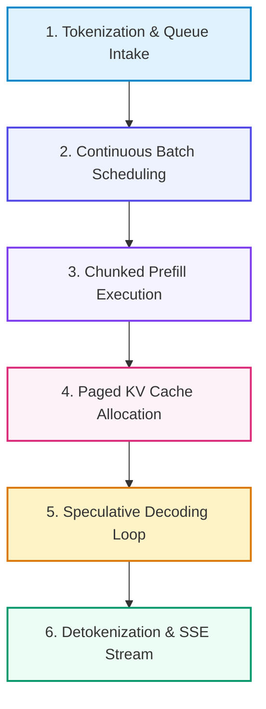

# 📚 DAY 20: HIGH-THROUGHPUT MODEL SERVING & LLM INFERENCE OPTIMIZATION
> **Khóa học:** COMP2010 - AI in Action (VinUni) | AICB-P2T2 | **Giảng viên:** Nguyễn Hải Dương | Phase 2 - Track 2 - Tuần 4 | **Dung lượng slide gốc:** 46 slides (3.9 MB) | Tinh gọn 40% & Chuẩn NotebookLM

---

## 📌 1. BÀI HỌC HÔM NAY VỀ CÁI GÌ? (THE WHAT & WHY)

*   **Thách thức kép của LLM Inference:** Phân tích 2 giai đoạn: Giai đoạn nạp bối cảnh (Prefill Phase) bị giới hạn bởi năng lực tính toán (Compute-bound - GEMM), và giai đoạn sinh từng token (Decode Phase) bị giới hạn bởi băng thông bộ nhớ (Memory Bandwidth-bound - GEMV).
*   **Các chỉ số đo lường hiệu năng Serving:** Phân biệt TTFT (Time to First Token - độ nhạy bối cảnh), TPOT (Time Per Output Token - tốc độ sinh từ), Throughput (Tokens/giây) và Goodput@SLO (lượng request đáp ứng đúng cam kết chất lượng).
*   **Kỹ thuật Lượng tử hóa mô hình (Quantization):** Các kỹ thuật nén mô hình từ FP16 sang FP8 (E4M3/E5M2), INT8, INT4 (AWQ - Activation-aware Weight Quantization, GPTQ, GGUF) giúp tiết kiệm 50% - 75% VRAM với mức suy giảm chất lượng tối thiểu.
*   **Tối ưu hóa KV Cache & Attention:** Sự tiến hóa từ Multi-Head Attention (MHA) sang Grouped-Query Attention (GQA), FlashAttention-2/3 và thuật toán PagedAttention (vLLM) giải phóng phân mảnh bộ nhớ, kết hợp Continuous Batching tối đa hóa thông lượng GPU.

---

## 💡 2. ẨN DỤ ĐỜI THƯỜNG: THỰC TRẠNG & GIẢI PHÁP

### 🔴 Thực trạng:
Mô hình AI đạt độ chính xác 95% nhưng mất 3 giây mới phản hồi từ đầu tiên, người dùng sốt ruột rời bỏ ứng dụng (churn tăng 40%). Mô hình thông minh nhưng phục vụ chậm chạp đồng nghĩa với việc sản phẩm thất bại trên thị trường.

### 🚗 Ẩn dụ đời thường — "Bếp ăn công nghiệp 5 sao phục vụ hàng nghìn thực khách cùng lúc":
> * **1. Món khai vị vs Tốc độ dọn từng món (TTFT vs TPOT):** Thực khách cần đĩa salad khai vị ngay trong 200 mili-giây để an tâm chờ đợi (TTFT), sau đó mỗi món ăn chính cách nhau đúng 20 mili-giây nhịp nhàng (TPOT).
> * **2. Túi nguyên liệu hút chân không (Quantization AWQ):** Ép nhỏ bao bì nguyên liệu cồng kềnh (FP16) thành các gói hút chân không nhỏ gọn (INT4/FP8) để xếp vừa tủ đông VRAM mà hương vị món ăn không hề suy giảm.
> * **3. Bảng phân bổ bàn tiệc ảo (PagedAttention / vLLM):** Thay vì dành trọn một bàn tiệc 10 người cho một vị khách ngồi uống nước (Static Batching lãng phí 80% VRAM), quản lý xếp chỗ linh hoạt từng đĩa thức ăn vào các ô trống rải rác qua danh bạ phân trang ảo.
> * **4. Cuốn chiếu bàn ăn liên tục (Continuous Batching):** Khi một bàn vừa ăn xong món tráng miệng, phục vụ lập tức mời khách mới vào lấp chỗ trống ngay ở món khai vị mà không cần đợi cả nhà hàng ăn xong mới nhận lượt khách mới.

### 🟢 Giải pháp kỹ thuật:
Triển khai Serving Engine hiện đại (vLLM / Triton) ứng dụng PagedAttention, Continuous Batching, lượng tử hóa AWQ/FP8 và FlashAttention tối ưu hóa phần cứng.

---

## 🗺️ 3. SƠ ĐỒ PIPELINE 6 BƯỚC TUẦN TỰ



*   **Bước 1 (1. Tokenization & Queue Intake):** Rust Tokenizer bóc tách văn bản và đưa vào hàng đợi ưu tiên.
*   **Bước 2 (2. Continuous Batch Scheduling):** Gom nhóm linh hoạt các request mới vào vòng lặp tính toán hiện tại.
*   **Bước 3 (3. Chunked Prefill Execution):** Tính toán ma trận Attention cho prompt đầu vào với FlashAttention-3.
*   **Bước 4 (4. Paged KV Cache Allocation):** Cấp phát các khối bộ nhớ không liền kề trong VRAM qua bảng trang ảo.
*   **Bước 5 (5. Speculative Decoding Loop):** Mô hình nhỏ sinh nháp và mô hình lớn xác thực song song trong 1 bước tính.
*   **Bước 6 (6. Detokenization & SSE Stream):** Giải mã Token ID thành văn bản và truyền phát trực tiếp (Server-Sent Events).

---

## 🌐 4. KIẾN THỨC MỞ RỘNG CHUYÊN SÂU (FIRECRAWL RESEARCH)

1.  **PagedAttention Memory Fragmentation Elimination:** Trong serving truyền thống, do độ dài đầu ra không biết trước, hệ thống phải cấp phát bộ nhớ tĩnh theo chiều dài tối đa gây lãng phí 60% - 80% VRAM do phân mảnh nội bộ và bên ngoài. PagedAttention chia KV Cache thành các khối cố định (blocks), giảm lãng phí xuống dưới 4%.
2.  **Activation-Aware Weight Quantization (AWQ):** AWQ chứng minh rằng không phải mọi trọng số đều quan trọng như nhau: chỉ cần bảo vệ 1% kênh trọng số có giá trị kích hoạt (Activation) lớn nhất ở độ chính xác cao, 99% trọng số còn lại có thể lượng tử hóa về 4-bit mà không làm giảm độ chính xác Perplexity.
3.  **Speculative Decoding Speedup:** Sử dụng một Draft Model nhỏ (ví dụ Llama-3-1B) sinh nhanh K tokens với chi phí tính toán thấp, sau đó Target Model (Llama-3-70B) kiểm tra đồng thời K tokens trong một lần chạy GEMM duy nhất, tăng tốc độ phục vụ lên 2x - 3x.

---

## 🔑 5. BẢNG TỪ KHÓA CỐT LÕI

| Thuật ngữ | Khái niệm kỹ thuật | Giải thích đời thường |
| :--- | :--- | :--- |
| **TTFT (Time To First Token)** | Thời gian từ khi gửi yêu cầu đến khi nhận được token đầu tiên (đo lường giai đoạn Prefill). | Thời gian từ khi gọi món đến khi đĩa khai vị được bưng ra bàn. |
| **TPOT (Time Per Output Token)** | Thời gian trung bình để sinh ra mỗi token tiếp theo trong giai đoạn Decode. | Nhịp độ bưng từng món ăn tiếp theo lên bàn. |
| **PagedAttention** | Thuật toán quản lý bộ nhớ KV Cache theo từng trang ảo tương tự cơ chế Paging của Hệ điều hành. | Sổ quản lý phòng khách sạn xếp khách vào các phòng trống rải rác. |
| **Continuous Batching** | Cơ chế gom nhóm ở cấp độ từng vòng lặp (Iteration-level) thay vì cấp độ toàn bộ request. | Xe buýt đón trả khách linh hoạt tại từng trạm thay vì chờ đầy xe mới xuất bến. |
| **AWQ (Activation-aware Quantization)** | Phương pháp lượng tử hóa trọng số 4-bit bảo vệ các kênh kích hoạt quan trọng. | Giữ nguyên các trụ cột chịu lực chính của ngôi nhà và dỡ bỏ các vách ngăn tạm. |
| **Speculative Decoding** | Kỹ thuật dùng mô hình nhỏ sinh nhanh chuỗi token và dùng mô hình lớn xác thực song song. | Trợ lý tập sự soạn sẵn bản nháp và tổng giám đốc duyệt nhanh trong 1 giây. |

---

## 🎯 6. BỘ CÂU HỎI ÔN THI TRỌNG TÂM (CHUẨN HỌC THUẬT VINUNI)

### 📝 PHẦN A: 4 CÂU TRẮC NGHIỆM ĐƠN (SINGLE-CHOICE)

#### Câu 1: Tại sao giai đoạn Decode (Autoregressive Token Generation) của Large Language Models lại bị giới hạn bởi băng thông bộ nhớ (Memory Bandwidth-bound)?
*   A. Vì mô hình phải tính toán ma trận với kích thước hàng tỷ chiều tại mỗi bước.
*   B. Do tốc độ quạt gió tản nhiệt của GPU bị quá tải.
*   C. Tại mỗi bước sinh 1 token, toàn bộ trọng số mô hình (hàng chục GB) và KV Cache phải được nạp từ bộ nhớ HBM vào thanh ghi nhân tính toán chỉ để thực hiện phép nhân ma trận-vector (GEMV) với 1 token đơn lẻ.
*   D. Do thuật toán Backpropagation chạy liên tục trong lúc phục vụ.
> **👉 ĐÁP ÁN ĐÚNG: D**  
> **💡 Giải thích chi tiết:** Trong giai đoạn Decode, hệ thống chỉ xử lý 1 token mới cho mỗi chuỗi. Phép tính là nhân Ma trận Trọng số với Vector (GEMV), có tỷ số tính toán trên bộ nhớ (Arithmetic Intensity) cực thấp. Nhân Tensor Cores tính toán rất nhanh nhưng phải đứng chờ nạp toàn bộ trọng số mô hình từ HBM sang SRAM ở từng bước token.

---

#### Câu 2: Cơ chế PagedAttention trong vLLM giải quyết vấn đề cốt lõi nào của bộ nhớ GPU?
*   A. Loại bỏ hoàn toàn sự phân mảnh bộ nhớ trong và ngoài (Internal/External Fragmentation) của KV Cache bằng cách cấp phát theo các khối trang ảo kích thước cố định.
*   B. Tự động nâng cấp card đồ họa từ 16GB lên 80GB bằng phần mềm.
*   C. Chuyển đổi mã Python thành mã Assembly trong thời gian thực.
*   D. Tự động dịch chuyển mô hình sang chạy trên CPU khi hết pin.
> **👉 ĐÁP ÁN ĐÚNG: A**  
> **💡 Giải thích chi tiết:** Trong hệ thống serving truyền thống, việc cấp phát trước vùng nhớ liền kề tối đa cho ngữ cảnh dẫn đến lãng phí 60-80% VRAM do độ dài câu trả lời không dự đoán trước được. PagedAttention chia KV Cache thành các block nhỏ (ví dụ 16 tokens) và cấp phát động trên bảng trang ảo, giảm lãng phí VRAM xuống dưới 4%.

---

#### Câu 3: Khi áp dụng Continuous Batching (Iteration-level scheduling) so với Static Batching truyền thống, ưu điểm nổi bật nhất là gì?
*   A. Mô hình không cần nạp trọng số vào GPU nữa.
*   B. Ngay khi một request hoàn thành việc sinh từ, nó lập tức được giải phóng và một request mới trong hàng đợi được chèn vào batch ngay ở vòng lặp tiếp theo, loại bỏ hoàn toàn hiện tượng GPU chờ đợi request dài nhất.
*   C. Tăng dung lượng lưu trữ của ổ cứng SSD lên gấp đôi.
*   D. Cho phép người dùng chạy mô hình mà không cần kết nối Internet.
> **👉 ĐÁP ÁN ĐÚNG: C**  
> **💡 Giải thích chi tiết:** Trong Static Batching, cả batch phải chờ request có chuỗi dài nhất kết thúc mới được giải phóng, gây lãng phí tài nguyên GPU cho các request ngắn đã kết thúc sớm. Continuous Batching hoạt động ở cấp độ từng iteration, liên tục đẩy request xong ra và kéo request mới vào.

---

#### Câu 4: Kỹ thuật Speculative Decoding giúp tăng tốc độ sinh từ của mô hình LLM lớn dựa trên nguyên lý kỹ thuật nào?
*   A. Xóa bỏ hoàn toàn lớp Attention của mô hình lớn.
*   B. Một mô hình nhỏ (Draft Model) sinh nhanh một chuỗi K tokens nháp, sau đó mô hình lớn (Target Model) xác thực song song toàn bộ K tokens trong một bước tính toán ma trận (GEMM) duy nhất.
*   C. Giảm tần số xung nhịp của vi xử lý để tiết kiệm điện.
*   D. Ép buộc người dùng chỉ được đặt câu hỏi dưới 10 từ.
> **👉 ĐÁP ÁN ĐÚNG: B**  
> **💡 Giải thích chi tiết:** Mô hình nhỏ sinh K tokens rất nhanh (vì ít tham số). Mô hình lớn sau đó nạp trọng số 1 lần và chạy một phép tính ma trận song song (GEMM) để chấm điểm và chấp thuận K tokens này trong cùng 1 bước, biến bài toán Memory-bound thành Compute-bound hiệu quả.

---

#### Câu 5: Dung lượng bộ nhớ tiêu thụ của bộ đệm KV Cache trong quá trình phục vụ mô hình LLM phụ thuộc trực tiếp vào những yếu tố nào sau đây? (Chọn 2 đáp án đúng)
*   A. Tổng chiều dài ngữ cảnh (Context Length: Prompt Tokens + Output Tokens) và Kích thước Batch Size đồng thời.
*   B. Số lượng lớp Transformer (Layers), Số đầu Key-Value (KV Heads) và Số chiều của mỗi đầu (Head Dimension).
*   C. Thời gian tính toán TTFT (Time-to-First-Token) của chuỗi prompt.
*   D. Số lượng email chưa đọc trong hòm thư của kỹ sư vận hành.
> **👉 ĐÁP ÁN ĐÚNG: A, B**  
> **💡 Giải thích chi tiết & Bẫy logic:** Công thức dung lượng KV Cache: Memory = 2 × L × H_kv × d_k × T × B × 2 Bytes, phụ thuộc vào kiến trúc mô hình (L, H_kv, d_k), độ dài chuỗi T, batch size B và kiểu dữ liệu độ chính xác (FP16/FP8).

---

#### Câu 6: Đâu là những sự khác biệt căn bản giữa Grouped-Query Attention (GQA) và Multi-Head Attention (MHA) truyền thống? (Chọn 2 đáp án đúng)
*   A. GQA chia sẻ một nhóm các Query Heads dùng chung một cặp Key/Value Head duy nhất, giúp giảm kích thước bộ nhớ KV Cache từ 4x đến 8x so với MHA.
*   B. GQA giúp tăng tốc độ giải mã (Decode Speed) và mở rộng khả năng phục vụ Context Window dài lên hàng trăm nghìn tokens.
*   C. GQA loại bỏ hoàn toàn hàm kích hoạt Softmax trong mạng nơ-ron.
*   D. GQA chỉ có thể huấn luyện được trên các dòng máy tính xách tay chạy pin.
> **👉 ĐÁP ÁN ĐÚNG: A, B**  
> **💡 Giải thích chi tiết & Bẫy logic:** Trong MHA, mỗi Query Head có riêng 1 Key Head và 1 Value Head. GQA gom nhóm nhiều Query Heads (ví dụ 8:1) dùng chung 1 Key/Value Head, giúp giảm dung lượng KV Cache tương ứng 8 lần mà hầu như không làm suy giảm năng lực biểu diễn ngữ nghĩa của mô hình.

---

---

## 💻 7. CODE THỰC CHIẾN (HANDS-ON PYTHON / INFRASTRUCTURE)

```python
import os
import torch
import torch.distributed as dist

def init_distributed_cluster():
    # 1. Khởi tạo môi trường huấn luyện phân tán PyTorch DDP
    dist.init_process_group(
        backend="nccl", # NCCL tối ưu hóa cho giao tiếp NVLink giữa các GPU NVIDIA
        init_method="env://"
    )
    
    local_rank = int(os.environ["LOCAL_RANK"])
    global_rank = int(os.environ["RANK"])
    world_size = int(os.environ["WORLD_SIZE"])
    
    torch.cuda.set_device(local_rank)
    print(f"[Rank {global_rank}/{world_size}] GPU Initialized on Device cuda:{local_rank}")
    
    # 2. Khởi tạo Tensor dữ liệu trên từng GPU
    tensor_data = torch.ones(1024, 1024, device=f"cuda:{local_rank}") * (global_rank + 1)
    
    # 3. Thực hiện toán tử All-Reduce tính tổng gradient phân tán qua NVLink
    dist.all_reduce(tensor_data, op=dist.ReduceOp.SUM)
    
    if global_rank == 0:
        print("All-Reduce Sync Complete. Value at Rank 0:", tensor_data[0, 0].item())
        
    dist.destroy_process_group()

if __name__ == "__main__":
    if "WORLD_SIZE" in os.environ:
        init_distributed_cluster()
```

---

## ⚠️ 8. BẪY LỖI KỸ THUẬT & CÁCH DEBUG (COMMON PITFALLS & TROUBLESHOOTING)

1.  **🔴 Bẫy Lỗi 1: GPU Starvation do nghẽn cổ chai DataLoader CPU.**
    *   *Nguyên nhân:* Nhân Tensor Cores GPU tính toán siêu tốc nhưng phải chờ CPU giải nén và nạp dữ liệu từ ổ cứng SSD chậm.
    *   *Cách khắc phục:* Đặt `num_workers = 4 * num_gpus`, bật `pin_memory=True` và áp dụng GPUDirect Storage (GDS).
2.  **🔴 Bẫy Lỗi 2: Tràn bộ nhớ VRAM (CUDA Out of Memory) trong pha Inference.**
    *   *Nguyên nhân:* Không giới hạn kích thước KV Cache khi số lượng request đồng thời tăng đột biến.
    *   *Cách khắc phục:* Sử dụng thư viện serving tối ưu như vLLM với PagedAttention để phân bổ động các khối nhớ KV Cache.
3.  **🔴 Bẫy Lỗi 3: Chết tiến trình (Deadlock) trong All-Reduce khi 1 Worker bị chậm.**
    *   *Nguyên nhân:* Một node mạng bị rớt gói tin hoặc lỗi phần cứng khiến toàn bộ cụm GPU đứng chờ vô tận.
    *   *Cách khắc phục:* Thiết lập biến môi trường `TORCH_NCCL_HEARTBEAT_TIMEOUT_SEC=60` và bật cơ chế phục hồi checkpoint tự động.

---

## ⚖️ 9. BẢNG SO SÁNH TRADE-OFFS & ĐIỀU KIỆN ÁP DỤNG

| Giải pháp Phục vụ / Hạ tầng | Thông lượng (Throughput) | Độ trễ (Latency P95) | Chi phí & Độ phức tạp |
| :--- | :--- | :--- | :--- |
| **Native PyTorch Serving** | Thấp (Không có PagedAttention) | Cao khi batch size tăng | Đơn giản, dễ debug cho nghiên cứu |
| **vLLM (PagedAttention + Continuous Batching)** | Cực cao (Gấp 4x-10x PyTorch) | Thấp, ổn định | Tiêu chuẩn vàng cho Production LLM Serving |
| **TensorRT-LLM (Kernel Fusion & FP8)**| Cao nhất trên phần cứng NVIDIA H100 | Siêu thấp | Phức tạp khi build engine, phụ thuộc NVIDIA GPU |
