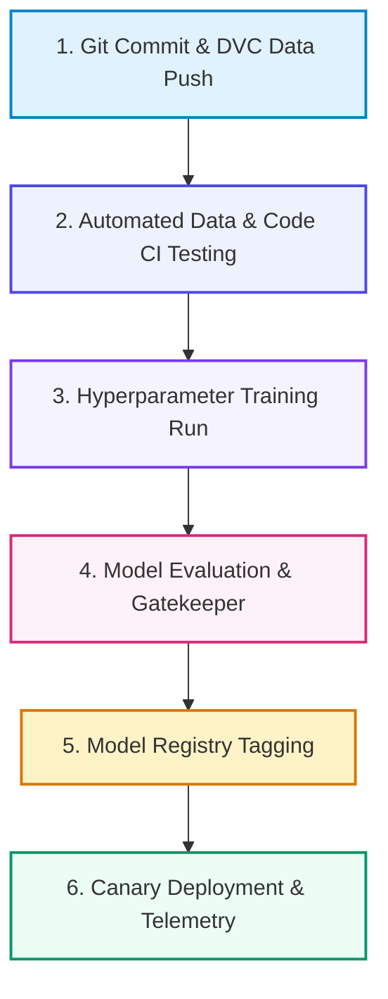

# 📚 DAY 21: CI/CD FOR AI SYSTEMS, AUTOMATED TESTING & EXPERIMENT TRACKING
> **Khóa học:** COMP2010 - AI in Action (VinUni) | AICB-P2T2 | **Giảng viên:** Nguyễn Hải Dương | Phase 2 - Track 2 - Tuần 5 | **Dung lượng slide gốc:** 40 slides (2.1 MB) | Tinh gọn 40% & Chuẩn NotebookLM

---

## 📌 1. BÀI HỌC HÔM NAY VỀ CÁI GÌ? (THE WHAT & WHY)

*   **Sự khác biệt giữa CI/CD phần mềm và AI Systems:** Phần mềm truyền thống chỉ kiểm soát Mã nguồn (Code). Hệ thống AI phải quản lý kiềng ba chân: Code + Data (khối lượng lớn, trôi dạt phân phối) + Model (phi đơn định, chi phí huấn luyện cao).
*   **Theo dõi Thí nghiệm & Quản lý Mô hình với MLflow:** Lưu vết siêu tham số (Hyperparameters), độ đo đánh giá (Metrics), biểu đồ và tạo kho đăng ký mô hình tập trung (MLflow Model Registry) với các trạng thái phân quyền (Staging, Production, Archived).
*   **Quản lý phiên bản dữ liệu lớn với DVC:** Sử dụng DVC (Data Version Control) để lưu trữ con trỏ siêu dữ liệu nhỏ trên Git trong khi tệp dữ liệu lớn và trọng số mô hình được lưu an toàn trên Cloud Storage (S3/GCS) có cơ chế hash md5.
*   **Tự động hóa CI/CD Pipeline & Chiến lược Triển khai:** Xây dựng GitHub Actions / GitLab CI tự động kiểm thử dữ liệu, chạy benchmark hồi quy (Regression Testing) và triển khai mô hình an toàn qua Shadow Deployment và Canary Release.

---

## 💡 2. ẨN DỤ ĐỜI THƯỜNG: THỰC TRẠNG & GIẢI PHÁP

### 🔴 Thực trạng:
Một đội ngũ kỹ sư AI triển khai mô hình mới mỗi tuần bằng phương pháp thủ công qua dòng lệnh. Trong 1 lần deploy vội, một file trọng số bị ghi đè nhầm dẫn đến toàn bộ hệ thống gợi ý sản phẩm bị sập, gây thiệt hại doanh thu hàng trăm triệu đồng.

### 🚗 Ẩn dụ đời thường — "Dây chuyền kiểm định chất lượng và đóng dấu lưu hành dược phẩm":
> * **1. Kiểm tra dược liệu đầu vào (CI Data Validation):** Không chỉ kiểm tra máy dập viên hoạt động tốt (Unit Test Code) mà phải xét nghiệm độ tinh khiết của lô thảo dược nhập về (DVC Data testing) trước khi đưa vào nấu.
> * **2. Sổ tay nhật ký phòng thí nghiệm (MLflow Tracking):** Nhà nghiên cứu ghi chép chi tiết từng mẻ thuốc: tỷ lệ hoạt chất, nhiệt độ, thời gian đun và kết quả thử nghiệm sinh hóa (Params, Metrics, Artifacts).
> * **3. Kho lưu trữ mẫu chuẩn có dấu đỏ (Model Registry):** Lô thuốc đạt tiêu chuẩn quốc tế được dán tem 'Đạt chuẩn lưu hành' (Production Tag), có chữ ký hội đồng khoa học mới được xuất xưởng.
> * **4. Thử nghiệm lâm sàng theo dõi ngầm (Shadow Deployment):** Cho thuốc mới thử nghiệm song song trên máy phân tích mẫu máu của bệnh nhân để so sánh hiệu quả mà không gây bất kỳ tác dụng phụ nào cho người bệnh.

### 🟢 Giải pháp kỹ thuật:
Thiết lập hệ thống CI/CD hoàn chỉnh cho AI với DVC quản lý phiên bản dữ liệu, MLflow theo dõi thử nghiệm và kho đăng ký mô hình, kết hợp triển khai Canary an toàn.

---

## 🗺️ 3. SƠ ĐỒ PIPELINE 6 BƯỚC TUẦN TỰ



*   **Bước 1 (1. Git Commit & DVC Data Push):** Lập trình viên commit mã nguồn lên Git và đồng bộ con trỏ DVC lên S3 Storage.
*   **Bước 2 (2. Automated Data & Code CI Testing):** GitHub Actions chạy linter, unit test và kiểm tra chất lượng phân phối dữ liệu.
*   **Bước 3 (3. Hyperparameter Training Run):** Tự động kích hoạt job huấn luyện và ghi log metrics, params lên MLflow Tracking.
*   **Bước 4 (4. Model Evaluation & Gatekeeper):** So sánh độ chính xác của ứng viên mới với mô hình Baseline hiện tại trên tập Gold Test.
*   **Bước 5 (5. Model Registry Tagging):** Tự động gán nhãn Staging/Production trong MLflow Model Registry nếu vượt qua bài test.
*   **Bước 6 (6. Canary Deployment & Telemetry):** Triển khai mô hình mới phục vụ 10% lưu lượng thực tế và giám sát độ trễ.

---

## 🌐 4. KIẾN THỨC MỞ RỘNG CHUYÊN SÂU (FIRECRAWL RESEARCH)

1.  **CML (Continuous Machine Learning) by Iterative:** CML tích hợp trực tiếp vào GitHub Actions/GitLab CI, tự động cấp phát GPU Cloud Runner khi có Pull Request, huấn luyện mô hình nhẹ, sinh biểu đồ ROC/PR curve và tự động bình luận bảng so sánh Metrics trực tiếp vào PR để review.
2.  **Shadow Deployment vs Canary Routing in AI:** Shadow Deployment nhân bản 100% lưu lượng thực tế gửi tới mô hình mới mà không trả kết quả cho người dùng, giúp đo lường độ trễ và tỷ lệ lỗi thực tế với rủi ro bằng 0 trước khi chuyển sang Canary Routing.
3.  **Reproducibility Checklist in Enterprise MLOps:** Để đảm bảo khả năng tái lập 100%, một thí nghiệm MLOps bắt buộc phải lưu vết 5 yếu tố: (1) Git Commit Hash, (2) DVC Data Hash, (3) Environment Docker Image Digest, (4) Seed số ngẫu nhiên phần cứng và (5) Pipeline Config YAML.

---

## 🔑 5. BẢNG TỪ KHÓA CỐT LÕI

| Thuật ngữ | Khái niệm kỹ thuật | Giải thích đời thường |
| :--- | :--- | :--- |
| **MLflow Tracking & Registry** | Nền tảng mã nguồn mở quản lý vòng đời ML gồm theo dõi thí nghiệm và kho lưu trữ mô hình. | Nhật ký thí nghiệm và tủ kính lưu giữ các mẫu phát minh đạt chuẩn. |
| **Data Version Control (DVC)** | Hệ thống quản lý phiên bản dữ liệu và mô hình lớn hoạt động mượt mà trên nền tảng Git. | Chiếc thẻ gửi hành lý giúp định vị kiện hàng khổng lồ trong kho bãi. |
| **Shadow Deployment** | Kỹ thuật chạy mô hình mới song song ngầm với mô hình cũ trên cùng luồng dữ liệu thực tế. | Thực tập sinh ngồi cạnh chuyên gia học việc và ghi chép mà không trực tiếp trả lời khách. |
| **Canary Release** | Chiến lược phát hành tính năng mới cho một nhóm nhỏ người dùng trước khi mở rộng toàn bộ. | Chú chim hoàng yến thử khí độc trong hầm mỏ trước khi thợ mỏ tiến vào. |
| **Model Drift** | Hiện tượng suy giảm hiệu năng của mô hình AI theo thời gian do thế giới thực thay đổi. | Bản đồ xe buýt bị lỗi thời khi thành phố mở thêm các tuyến đường mới. |
| **CML (Continuous Machine Learning)** | Công cụ tự động hóa CI/CD chuyên biệt cho ML trên nền tảng Git. | Dây chuyền kiểm định tự động in báo cáo chất lượng dán lên từng sản phẩm. |

---

## 🎯 6. BỘ CÂU HỎI ÔN THI TRỌNG TÂM (CHUẨN HỌC THUẬT VINUNI)

### 📝 PHẦN A: 4 CÂU TRẮC NGHIỆM ĐƠN (SINGLE-CHOICE)

#### Câu 1: Sự khác biệt căn bản nhất giữa quy trình CI/CD cho phần mềm truyền thống và CI/CD cho hệ thống Trí tuệ Nhân tạo (CD4ML) là gì?
*   A. CI/CD cho AI bắt buộc phải chạy trên hệ điều hành macOS.
*   B. Phần mềm truyền thống chỉ kiểm soát Mã nguồn (Code); hệ thống AI phải kiểm soát đồng thời bộ ba Code, Data (dung lượng lớn, trôi dạt phân phối) và Model Trọng số.
*   C. CI/CD cho AI không cần viết Unit Test.
*   D. Phần mềm truyền thống không thể tự động hóa việc triển khai.
> **👉 ĐÁP ÁN ĐÚNG: A**  
> **💡 Giải thích chi tiết:** Trong phần mềm truyền thống, hành vi hệ thống được xác định 100% bởi Code. Trong AI Systems, hành vi được sinh ra từ sự kết hợp giữa Code + Dữ liệu huấn luyện (Data) + Siêu tham số tạo nên Trọng số mô hình (Model). Do đó CI/CD cho AI phải quản lý và kiểm thử cả 3 thành phần này.

---

#### Câu 2: Công cụ DVC (Data Version Control) giải quyết bài toán quản lý tập dữ liệu lớn và file trọng số mô hình trên Git như thế nào?
*   A. Nén toàn bộ dữ liệu 100GB thành file zip rồi commit trực tiếp vào kho Git.
*   B. Chỉ lưu trữ các tệp con trỏ siêu dữ liệu nhỏ (.dvc chứa mã hash md5) trên Git, trong khi dữ liệu thực tế được lưu trữ trên Cloud Storage (S3/GCS/Azure Blob).
*   C. Chuyển đổi toàn bộ dữ liệu thành mã nguồn Python.
*   D. Xóa bớt 90% dữ liệu để file vừa với giới hạn 100MB của GitHub.
> **👉 ĐÁP ÁN ĐÚNG: B**  
> **💡 Giải thích chi tiết:** Git không được thiết kế để chứa các tệp nhị phân khổng lồ. DVC thay thế tệp dữ liệu lớn bằng một tệp con trỏ siêu nhẹ chứa hash md5 để Git theo dõi, đồng thời tự động đồng bộ tệp dữ liệu thật với Cloud Object Storage thông qua lệnh `dvc push` và `dvc pull`.

---

#### Câu 3: Trong MLflow, vai trò của 'Model Registry' là gì?
*   A. Đăng ký tài khoản mạng xã hội cho mô hình.
*   B. Đóng vai trò là một kho lưu trữ tập trung quản lý toàn bộ vòng đời, phiên bản và các trạng thái chuyển giao (Staging, Production, Archived) của mô hình.
*   C. Tự động thanh toán hóa đơn tiền điện hàng tháng cho máy chủ.
*   D. Chỉ dùng để vẽ biểu đồ loss trong lúc huấn luyện.
> **👉 ĐÁP ÁN ĐÚNG: C**  
> **💡 Giải thích chi tiết:** MLflow Model Registry cung cấp giao diện tập trung để quản lý các phiên bản mô hình, kiểm soát quy trình phê duyệt (Model Governance), gán nhãn trạng thái từ thử nghiệm (Staging) lên sản xuất (Production) và lưu trữ lịch sử thay đổi.

---

#### Câu 4: Tại sao chiến lược Shadow Deployment lại là phương pháp an toàn nhất để kiểm thử mô hình AI mới trước khi chính thức phục vụ người dùng?
*   A. Shadow Deployment làm giảm chi phí thuê GPU xuống 0 đồng.
*   B. Shadow Deployment không yêu cầu bất kỳ tài nguyên máy chủ nào.
*   C. Mô hình mới nhận bản sao lưu lượng thực tế và chạy dự đoán ngầm, giúp đo lường độ trễ và kiểm tra lỗi ngoại lệ trong điều kiện thực tế mà không gây rủi ro cho người dùng cuối.
*   D. Shadow Deployment tự động sửa chữa tất cả các lỗi sai của mô hình.
> **👉 ĐÁP ÁN ĐÚNG: D**  
> **💡 Giải thích chi tiết:** Trong Shadow Deployment, hệ thống nhân bản lưu lượng thực tế và gửi tới mô hình mới nhưng vứt bỏ kết quả (chỉ ghi log metrics). Người dùng vẫn nhận kết quả từ mô hình cũ an toàn, giúp đội ngũ kỹ sư quan sát hành vi của mô hình mới dưới áp lực tải thật 100%.

---

#### Câu 5: Để đảm bảo tính tái lập 100% (Full Reproducibility) cho một thí nghiệm huấn luyện mô hình Machine Learning, những yếu tố nào sau đây bắt buộc phải được lưu vết phiên bản? (Chọn 2 đáp án đúng)
*   A. Phiên bản mã nguồn chính xác (Git commit hash) và Phiên bản dữ liệu huấn luyện (DVC data hash).
*   B. Môi trường thực thi (Docker image digest / Thư viện dependencies) và Siêu tham số huấn luyện (Hyperparameters & Random Seeds).
*   C. Màu sắc bàn phím và chuột máy tính của kỹ sư AI.
*   D. Thời tiết bên ngoài trung tâm dữ liệu vào ngày huấn luyện.
> **👉 ĐÁP ÁN ĐÚNG: A, B**  
> **💡 Giải thích chi tiết & Bẫy logic:** Khả năng tái lập một thí nghiệm ML đòi hỏi sự cố định tuyệt đối của 4 yếu tố: Code (Git), Data (DVC), Môi trường thư viện (Docker) và Cấu hình thuật toán/Seed ngẫu nhiên (MLflow params).

---

#### Câu 6: Những bài kiểm thử tự động (Automated Tests) nào sau đây là đặc thù bắt buộc trong một CI Pipeline dành cho hệ thống AI? (Chọn 2 đáp án đúng)
*   A. Data Quality Test: Kiểm tra tỷ lệ giá trị Null, tính hợp lệ của Schema và phát hiện trôi dạt phân phối dữ liệu đầu vào.
*   B. Model Regression Test: Đánh giá mô hình mới trên tập dữ liệu kiểm chuẩn cố định (Gold Benchmark) để đảm bảo không bị suy giảm độ chính xác trên các nhóm dữ liệu quan trọng.
*   C. Kiểm tra độ phân giải của hình nền màn hình máy chủ.
*   D. Kiểm tra xem file âm thanh thông báo lỗi có phát đúng điệu nhạc hay không.
> **👉 ĐÁP ÁN ĐÚNG: A, B**  
> **💡 Giải thích chi tiết & Bẫy logic:** CI cho AI yêu cầu kiểm tra chất lượng dữ liệu đầu vào (để ngăn chặn Garbage In) và kiểm tra tính hồi quy của mô hình trên tập Golden Dataset (để đảm bảo mô hình mới không bị 'quên' hoặc thụt lùi ở các ca biên quan trọng).

---

---

## 💻 7. CODE THỰC CHIẾN (HANDS-ON PYTHON / AI SYSTEM)

```python
import json
import numpy as np

def calculate_ai_system_metrics(predictions, ground_truths):
    """
    Đo lường độ chính xác và chỉ số F1-Score cho hệ thống phân loại AI Production
    """
    tp = sum(1 for p, g in zip(predictions, ground_truths) if p == 1 and g == 1)
    fp = sum(1 for p, g in zip(predictions, ground_truths) if p == 1 and g == 0)
    fn = sum(1 for p, g in zip(predictions, ground_truths) if p == 0 and g == 1)
    
    precision = tp / (tp + fp) if (tp + fp) > 0 else 0.0
    recall = tp / (tp + fn) if (tp + fn) > 0 else 0.0
    f1 = 2 * (precision * recall) / (precision + recall) if (precision + recall) > 0 else 0.0
    
    return {
        "precision": round(precision, 4),
        "recall": round(recall, 4),
        "f1_score": round(f1, 4)
    }

# Dữ liệu kiểm thử mẫu
preds = [1, 0, 1, 1, 0, 1, 0, 1]
targets = [1, 0, 0, 1, 0, 1, 1, 1]
print("Evaluation Metrics:", calculate_ai_system_metrics(preds, targets))
```

---

## ⚠️ 8. BẪY LỖI KỸ THUẬT & CÁCH DEBUG (COMMON PITFALLS & TROUBLESHOOTING)

1.  **🔴 Bẫy Lỗi 1: Tối ưu hóa sai hàm mục tiêu (Metric Mismatch).**
    *   *Nguyên nhân:* Chỉ đo lường Accuracy trên tập dữ liệu mất cân bằng (Imbalanced Data), che giấu việc mô hình dự đoán sai hoàn toàn các ca nguy hiểm.
    *   *Cách khắc phục:* Bắt buộc theo dõi đồng thời Precision, Recall, F1-Score và đường cong PR-AUC.
2.  **🔴 Bẫy Lỗi 2: Rò rỉ dữ liệu (Data Leakage) giữa tập Train và Test.**
    *   *Nguyên nhân:* Tiền xử lý dữ liệu (chuẩn hóa scaling, trích xuất đặc trưng) trên toàn bộ tập dữ liệu trước khi chia train/test.
    *   *Cách khắc phục:* Luôn chia tập dữ liệu trước, sau đó chỉ `fit()` pipeline tiền xử lý trên tập Train và chỉ `transform()` trên tập Test.
3.  **🔴 Bẫy Lỗi 3: Bỏ qua độ trễ mạng và Serialization Overhead.**
    *   *Nguyên nhân:* Đánh giá mô hình offline rất nhanh nhưng khi deploy API thì nghẽn ở bước parse JSON và truyền tải mạng.
    *   *Cách khắc phục:* Tối ưu hóa chuỗi serialization bằng MessagePack / Protocol Buffers và bật gRPC streaming.

---

## ⚖️ 9. BẢNG SO SÁNH TRADE-OFFS & ĐIỀU KIỆN ÁP DỤNG

| Chiến lược / Giải pháp | Độ chính xác (Accuracy) | Độ phức tạp triển khai | Chi phí bảo trì vận hành |
| :--- | :--- | :--- | :--- |
| **Heuristic & Rule-based Engine** | Trung bình, giới hạn | Rất thấp, chạy tức thì | Khó duy trì khi số lượng luật tăng vọt |
| **Fine-tuned Small Specialized Model**| Rất cao trong miền hẹp | Trung bình (cần training pipeline) | Thấp, chạy được trên GPU phổ thông |
| **Zero-shot Frontier LLM Prompting** | Cao toàn diện đa miền | Rất thấp (chỉ cần API) | Chi phí token hàng tháng cao khi tải lớn |
