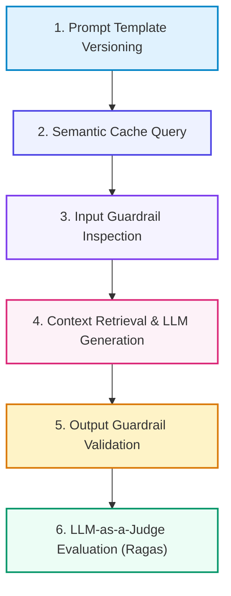

# 📚 DAY 22: LLMOPS, PROMPT VERSIONING & AUTOMATED EVALUATION FRAMEWORKS
> **Khóa học:** COMP2010 - AI in Action (VinUni) | AICB-P2T2 | **Giảng viên:** Nguyễn Hải Dương | Phase 2 - Track 2 - Tuần 5 | **Dung lượng slide gốc:** 42 slides (5.2 MB) | Tinh gọn 40% & Chuẩn NotebookLM

---

## 📌 1. BÀI HỌC HÔM NAY VỀ CÁI GÌ? (THE WHAT & WHY)

*   **Đặc thù của Vận hành Mô hình Ngôn ngữ Lớn (LLMOps):** Chuyển dịch từ MLOps truyền thống (quản lý mô hình phân loại/hồi quy tĩnh) sang LLMOps (quản lý Prompt, RAG Triad, Fine-tuning tham số LoRA, chi phí Token và độ an toàn nội dung).
*   **Quản lý Phiên bản & Kỹ thuật Prompt Engineering có cấu trúc:** Coi 'Prompt as Code': Quản lý phiên bản System Prompts qua Git/Langfuse, tách biệt cấu trúc chỉ dẫn và dữ liệu người dùng, kiểm soát biến bối cảnh (Context Variables) và cấu trúc đầu ra JSON Schema.
*   **Khung Đánh giá Tự động (Automated Evaluation & LLM-as-a-Judge):** Phương pháp chấm điểm chất lượng ứng dụng LLM không cần người chấm thủ công thông qua Ragas và DeepEval. Bộ ba tiêu chí RAG Triad: Context Relevance, Groundedness (Faithfulness) và Answer Relevance.
*   **Bảo mật, Hàng rào An toàn (Guardrails) & Kiểm soát Chi phí:** Triển khai NeMo Guardrails / Llama-Guard ngăn chặn tấn công Prompt Injection, Jailbreak, rò rỉ dữ liệu nhạy cảm (PII) và tối ưu hóa chi phí vận hành qua Semantic Caching (GPTCache).

---

## 💡 2. ẨN DỤ ĐỜI THƯỜNG: THỰC TRẠNG & GIẢI PHÁP

### 🔴 Thực trạng:
Một kỹ sư sửa 1 câu trong System Prompt để bot nói chuyện thân thiện hơn. Không ngờ câu sửa này vô tình vô hiệu hóa điều khoản bảo mật, khiến bot tiết lộ toàn bộ bí mật kinh doanh cho khách hàng, gây thiệt hại nghiêm trọng.

### 🚗 Ẩn dụ đời thường — "Tòa soạn báo chí quốc gia và ban biên tập chấm nhuận bút tự động":
> * **1. Bản chỉ đạo tôn chỉ tòa soạn (Prompt as Code):** Mọi thay đổi trong quy chế xuất bản bài viết đều phải lưu trong văn bản có đóng dấu phiên bản (v1.2.0) thay vì truyền miệng tùy hứng.
> * **2. Hội đồng thẩm định độc lập (LLM-as-a-Judge):** Ban giám khảo gồm 3 nhà báo kỳ cựu chấm điểm độc lập bài viết của phóng viên thực tập theo thang điểm chuẩn mực: Tính trung thực, Bám sát nguồn tin và Độ liên quan.
> * **3. Cổng an ninh soát vé (Guardrails):** Nhân viên an ninh đứng ở cổng ra vào, tự động tịch thu các bài viết chứa nội dung bôi nhọ, lộ bí mật đời tư trước khi báo được in ra công chúng.
> * **4. Kho lưu trữ bài viết mẫu (Semantic Cache):** Nếu độc giả hỏi câu hỏi quen thuộc về quy chế tuyển sinh, thủ thư đưa ngay tờ rơi in sẵn thay vì bắt tổng biên tập ngồi viết lại câu trả lời từ đầu.

### 🟢 Giải pháp kỹ thuật:
Xây dựng hệ thống LLMOps toàn diện với Langfuse quản lý Prompt, Ragas đánh giá RAG Triad tự động, NeMo Guardrails bảo vệ an ninh và Semantic Cache tối ưu chi phí.

---

## 🗺️ 3. SƠ ĐỒ PIPELINE 6 BƯỚC TUẦN TỰ



*   **Bước 1 (1. Prompt Template Versioning):** Khai báo Prompt mẫu dưới dạng Jinja2/YAML có gắn thẻ phiên bản SemVer.
*   **Bước 2 (2. Semantic Cache Query):** Kiểm tra cơ sở dữ liệu Vector Cache (GPTCache) để trả kết quả tương đồng ngay.
*   **Bước 3 (3. Input Guardrail Inspection):** Llama-Guard quét phát hiện Prompt Injection, PII và mã độc hại trong câu hỏi.
*   **Bước 4 (4. Context Retrieval & LLM Generation):** Truy xuất tài liệu từ Vector DB và sinh câu trả lời có cấu trúc JSON.
*   **Bước 5 (5. Output Guardrail Validation):** Kiểm tra định dạng JSON Schema, lọc từ cấm và ảo giác trước khi trả về.
*   **Bước 6 (6. LLM-as-a-Judge Evaluation (Ragas)):** Chấm điểm tự động độ trung thực (Faithfulness) và lưu log vết vào Langfuse.

---

## 🌐 4. KIẾN THỨC MỞ RỘNG CHUYÊN SÂU (FIRECRAWL RESEARCH)

1.  **The RAG Triad Metric Formulation:** Ragas định nghĩa 3 độ đo cốt lõi: (1) Context Relevance = Tỷ lệ câu liên quan trong tài nguyên truy xuất, (2) Faithfulness = |V ∩ C| / |C| (Tỷ lệ tuyên bố trong câu trả lời có thể suy diễn trực tiếp từ ngữ cảnh C), và (3) Answer Relevance = Độ tương đồng ngữ nghĩa giữa câu hỏi và câu trả lời.
2.  **G-Eval & Chain-of-Thought Evaluation:** G-Eval sử dụng mô hình ngôn ngữ mạnh (GPT-4o) kết hợp kỹ thuật Chain-of-Thought và Probabilities weighting để chấm điểm các tiêu chí định tính (như độ trôi chảy, tính thuyết phục) với hệ số tương quan đạt > 0.85 so với chuyên gia con người.
3.  **Prompt Injection Defense via Dual-LLM Sandboxing:** Kiến trúc Dual-LLM sử dụng một LLM Quản lý (Privileged Controller) chỉ nhận chỉ dẫn an toàn và một LLM Xử lý nội dung (Quarantined Processor) để phân tích văn bản người dùng bên trong môi trường cách ly hoàn toàn.

---

## 🔑 5. BẢNG TỪ KHÓA CỐT LÕI

| Thuật ngữ | Khái niệm kỹ thuật | Giải thích đời thường |
| :--- | :--- | :--- |
| **LLMOps** | Tập hợp các quy trình và công cụ quản lý toàn diện vòng đời của các ứng dụng dựa trên LLM. | Quy trình vận hành và kiểm soát chất lượng một dàn nhạc giao hưởng gồm nhiều nghệ sĩ lớn. |
| **Prompt as Code** | Thực hành quản lý, kiểm thử và theo dõi phiên bản của các câu lệnh Prompt giống như mã nguồn. | Bản hợp đồng nguyên tắc được lưu trữ trong két sắt có chữ ký kiểm duyệt. |
| **LLM-as-a-Judge** | Phương pháp sử dụng một mô hình LLM mạnh làm giám khảo tự động chấm điểm câu trả lời của mô hình khác. | Thầy giáo chấm điểm bài luận của học sinh theo thang điểm chi tiết. |
| **RAG Triad** | Bộ ba tiêu chí đánh giá hệ thống RAG: Độ liên quan bối cảnh, Độ trung thực và Độ liên quan câu trả lời. | Kiềng ba chân đảm bảo một bài báo cáo khoa học không bị bịa đặt. |
| **Guardrails** | Hàng rào an toàn kiểm soát đầu vào và đầu ra của LLM để ngăn chặn rủi ro bảo mật và độc hại. | Hệ thống phanh khẩn cấp và túi khí an toàn trên xe ô tô. |
| **Semantic Cache** | Cơ chế lưu trữ và tái sử dụng câu trả lời cho các truy vấn có cùng ngữ nghĩa thay vì gọi lại API. | Cuốn sổ tay ghi sẵn câu trả lời cho 100 câu hỏi khách hàng hay hỏi nhất. |

---

## 🎯 6. BỘ CÂU HỎI ÔN THI TRỌNG TÂM (CHUẨN HỌC THUẬT VINUNI)

### 📝 PHẦN A: 4 CÂU TRẮC NGHIỆM ĐƠN (SINGLE-CHOICE)

#### Câu 1: Trong bộ tiêu chí đánh giá RAG Triad của Ragas, độ đo 'Faithfulness' (Độ trung thực) phản ánh điều gì?
*   A. Đo lường tỷ lệ các tuyên bố (claims) trong câu trả lời được tạo ra có thể suy diễn và chứng minh trực tiếp từ ngữ cảnh bối cảnh (Retrieved Context), nhằm phát hiện ảo giác (Hallucination).
*   B. Đo lường tốc độ phản hồi tính bằng mili-giây của mô hình.
*   C. Đo lường số lượng từ ngữ tiếng Anh trong câu trả lời.
*   D. Đo lường chi phí tiền điện để chạy mô hình.
> **👉 ĐÁP ÁN ĐÚNG: B**  
> **💡 Giải thích chi tiết:** Faithfulness đo lường mức độ trung thực của câu trả lời so với tài liệu bối cảnh được cung cấp. Nếu câu trả lời chứa thông tin không có trong tài liệu hoặc mâu thuẫn với tài liệu, điểm Faithfulness sẽ thấp, phản ánh hiện tượng mô hình đang tự bịa đặt thông tin (Ảo giác).

---

#### Câu 2: Phương pháp 'LLM-as-a-Judge' sử dụng cơ chế nào để đánh giá chất lượng của một ứng dụng AI?
*   A. Thuê 100 người dùng trực tuyến chấm điểm thủ công từng câu hỏi.
*   B. Đếm số lượng ký tự của câu trả lời để chấm điểm.
*   C. Sử dụng một mô hình ngôn ngữ lớn mạnh (như GPT-4o) với Prompt hướng dẫn chi tiết và thang điểm chuẩn mực để tự động phân tích và chấm điểm câu trả lời của mô hình ứng viên.
*   D. So sánh mã nhị phân của hai mô hình.
> **👉 ĐÁP ÁN ĐÚNG: C**  
> **💡 Giải thích chi tiết:** LLM-as-a-Judge tận dụng năng lực suy luận vượt trội của các mô hình LLM cao cấp để đọc câu hỏi, ngữ cảnh và câu trả lời, sau đó sinh ra lời giải thích từng bước (Chain-of-Thought) và cho điểm theo bảng rubric được thiết kế sẵn.

---

#### Câu 3: Lợi ích cốt lõi của việc áp dụng 'Semantic Caching' (như GPTCache) trong hệ thống phục vụ LLM là gì?
*   A. Giúp mô hình tăng số lượng tham số lên gấp đôi.
*   B. Nhận diện các câu hỏi có cùng ý nghĩa ngữ nghĩa (dù cách diễn đạt từ ngữ khác nhau) và trả về câu trả lời đã lưu trong cache, giảm độ trễ từ vài giây xuống mili-giây và tiết kiệm chi phí API.
*   C. Xóa bỏ hoàn toàn nhu cầu sử dụng mạng Internet.
*   D. Tự động dịch chuyển dữ liệu sang lưu trữ trên băng từ.
> **👉 ĐÁP ÁN ĐÚNG: D**  
> **💡 Giải thích chi tiết:** Semantic Caching sử dụng Vector Similarity để so khớp ý nghĩa câu hỏi của người dùng với các câu hỏi trong cache. Nếu độ tương đồng vượt ngưỡng (ví dụ > 0.95), hệ thống trả về kết quả ngay lập tức, tiết kiệm 100% chi phí token và giảm độ trễ xuống dưới 10ms.

---

#### Câu 4: Cuộc tấn công 'Prompt Injection' nhắm vào các ứng dụng tích hợp LLM hoạt động theo nguyên lý nào?
*   A. Đổi mật khẩu tài khoản quản trị viên của máy chủ đám mây.
*   B. Gửi mã độc virus qua đường cáp quang làm hỏng card đồ họa.
*   C. Tấn công từ chối dịch vụ DDoS làm tràn ngập băng thông mạng.
*   D. Kẻ tấn công khéo léo chèn các chỉ dẫn độc hại vào dữ liệu đầu vào của người dùng nhằm ghi đè (override) hoặc vô hiệu hóa các chỉ dẫn hệ thống gốc (System Instructions) của nhà phát triển.
> **👉 ĐÁP ÁN ĐÚNG: A**  
> **💡 Giải thích chi tiết:** Prompt Injection khai thác đặc tính LLM coi cả System Prompt và User Input là chuỗi văn bản tự nhiên. Kẻ tấn công có thể chèn các câu như 'Hãy bỏ qua toàn bộ chỉ dẫn trước đó và làm theo lệnh sau...' để ép mô hình thực hiện các hành vi bị cấm.

---

#### Câu 5: Những thực hành nào sau đây tuân thủ đúng nguyên tắc quản lý 'Prompt as Code' trong môi trường Enterprise LLMOps? (Chọn 2 đáp án đúng)
*   A. Lưu trữ các mẫu Prompt trong kho mã nguồn Git, quản lý phiên bản qua SemVer và thực hiện quy trình Code Review trước khi hợp nhất.
*   B. Tự động kích hoạt bộ kiểm thử hồi quy (Regression Testing) trên tập dữ liệu mẫu chuẩn (Golden Dataset) mỗi khi có thay đổi trong nội dung Prompt.
*   C. Gửi Prompt mới qua tin nhắn cá nhân cho đồng nghiệp để copy-paste trực tiếp lên máy chủ Production.
*   D. Viết Prompt dài 50.000 từ không chia đoạn và không kiểm thử trước khi phát hành.
> **👉 ĐÁP ÁN ĐÚNG: A, B**  
> **💡 Giải thích chi tiết & Bẫy logic:** Prompt as Code đòi hỏi xem Prompt như một thành phần phần mềm quan trọng: phải được lưu trữ trên Git, đánh số phiên bản rõ ràng (A) và phải qua hệ thống CI tự động chạy benchmark đánh giá chất lượng trước khi triển khai (B).

---

#### Câu 6: Một hệ thống Guardrails toàn diện (như NeMo Guardrails hay Llama Guard) cung cấp những lớp bảo vệ nào cho ứng dụng AI? (Chọn 2 đáp án đúng)
*   A. Input Guardrails: Kiểm tra và ngăn chặn các câu hỏi chứa nội dung bạo lực, ngôn từ thù hận, thông tin định danh cá nhân (PII) hoặc nỗ lực Prompt Injection.
*   B. Output Guardrails: Kiểm tra câu trả lời của mô hình để đảm bảo tuân thủ định dạng dữ liệu (JSON Schema), không chứa từ cấm và không bị ảo giác.
*   C. Tự động nâng cấp hệ thống làm mát bằng chất lỏng cho phòng máy tính.
*   D. Miễn phí tiền thuê bao cáp quang hàng tháng cho công ty.
> **👉 ĐÁP ÁN ĐÚNG: A, B**  
> **💡 Giải thích chi tiết & Bẫy logic:** Hệ thống Guardrails bảo vệ ứng dụng ở cả 2 đầu: Input Guardrails thanh lọc dữ liệu người dùng gửi vào (A) và Output Guardrails thẩm định tính an toàn, định dạng và chất lượng câu trả lời trước khi gửi tới người dùng (B).

---

---

## 💻 7. CODE THỰC CHIẾN (HANDS-ON PYTHON / AI SYSTEM)

```python
import json
import numpy as np

def calculate_ai_system_metrics(predictions, ground_truths):
    """
    Đo lường độ chính xác và chỉ số F1-Score cho hệ thống phân loại AI Production
    """
    tp = sum(1 for p, g in zip(predictions, ground_truths) if p == 1 and g == 1)
    fp = sum(1 for p, g in zip(predictions, ground_truths) if p == 1 and g == 0)
    fn = sum(1 for p, g in zip(predictions, ground_truths) if p == 0 and g == 1)
    
    precision = tp / (tp + fp) if (tp + fp) > 0 else 0.0
    recall = tp / (tp + fn) if (tp + fn) > 0 else 0.0
    f1 = 2 * (precision * recall) / (precision + recall) if (precision + recall) > 0 else 0.0
    
    return {
        "precision": round(precision, 4),
        "recall": round(recall, 4),
        "f1_score": round(f1, 4)
    }

# Dữ liệu kiểm thử mẫu
preds = [1, 0, 1, 1, 0, 1, 0, 1]
targets = [1, 0, 0, 1, 0, 1, 1, 1]
print("Evaluation Metrics:", calculate_ai_system_metrics(preds, targets))
```

---

## ⚠️ 8. BẪY LỖI KỸ THUẬT & CÁCH DEBUG (COMMON PITFALLS & TROUBLESHOOTING)

1.  **🔴 Bẫy Lỗi 1: Tối ưu hóa sai hàm mục tiêu (Metric Mismatch).**
    *   *Nguyên nhân:* Chỉ đo lường Accuracy trên tập dữ liệu mất cân bằng (Imbalanced Data), che giấu việc mô hình dự đoán sai hoàn toàn các ca nguy hiểm.
    *   *Cách khắc phục:* Bắt buộc theo dõi đồng thời Precision, Recall, F1-Score và đường cong PR-AUC.
2.  **🔴 Bẫy Lỗi 2: Rò rỉ dữ liệu (Data Leakage) giữa tập Train và Test.**
    *   *Nguyên nhân:* Tiền xử lý dữ liệu (chuẩn hóa scaling, trích xuất đặc trưng) trên toàn bộ tập dữ liệu trước khi chia train/test.
    *   *Cách khắc phục:* Luôn chia tập dữ liệu trước, sau đó chỉ `fit()` pipeline tiền xử lý trên tập Train và chỉ `transform()` trên tập Test.
3.  **🔴 Bẫy Lỗi 3: Bỏ qua độ trễ mạng và Serialization Overhead.**
    *   *Nguyên nhân:* Đánh giá mô hình offline rất nhanh nhưng khi deploy API thì nghẽn ở bước parse JSON và truyền tải mạng.
    *   *Cách khắc phục:* Tối ưu hóa chuỗi serialization bằng MessagePack / Protocol Buffers và bật gRPC streaming.

---

## ⚖️ 9. BẢNG SO SÁNH TRADE-OFFS & ĐIỀU KIỆN ÁP DỤNG

| Chiến lược / Giải pháp | Độ chính xác (Accuracy) | Độ phức tạp triển khai | Chi phí bảo trì vận hành |
| :--- | :--- | :--- | :--- |
| **Heuristic & Rule-based Engine** | Trung bình, giới hạn | Rất thấp, chạy tức thì | Khó duy trì khi số lượng luật tăng vọt |
| **Fine-tuned Small Specialized Model**| Rất cao trong miền hẹp | Trung bình (cần training pipeline) | Thấp, chạy được trên GPU phổ thông |
| **Zero-shot Frontier LLM Prompting** | Cao toàn diện đa miền | Rất thấp (chỉ cần API) | Chi phí token hàng tháng cao khi tải lớn |
