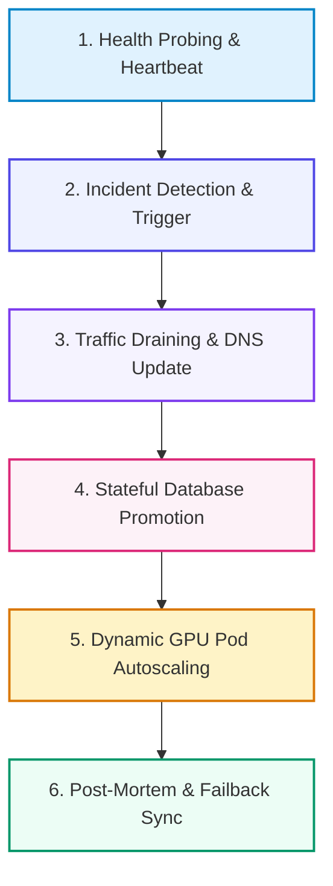

# 📚 DAY 23: DISASTER RECOVERY & HIGH AVAILABILITY FOR AI INFRASTRUCTURE
> **Khóa học:** COMP2010 - AI in Action (VinUni) | AICB-P2T2 | **Giảng viên:** Nguyễn Hải Dương | Phase 2 - Track 2 - Tuần 5 | **Dung lượng slide gốc:** 42 slides (2.9 MB) | Tinh gọn 40% & Chuẩn NotebookLM

---

## 📌 1. BÀI HỌC HÔM NAY VỀ CÁI GÌ? (THE WHAT & WHY)

*   **Chỉ số RTO và RPO trong Hạ tầng AI:** Định nghĩa RTO (Recovery Time Objective - Thời gian tối đa để khôi phục dịch vụ) và RPO (Recovery Point Objective - Lượng dữ liệu tối đa chấp nhận bị mất mát tính theo thời gian) cho từng phân hệ trong AI Stack.
*   **Phân loại Thành phần Stateful vs Stateless:** Các dịch vụ không trạng thái (Model Serving endpoints, API Gateways) dễ dàng mở rộng và phục hồi tức thì. Các dịch vụ có trạng thái (Vector Databases, Feature Stores, Data Lakehouses, Redis Caches) đòi hỏi chiến lược đồng bộ dữ liệu đa vùng phức tạp.
*   **Mô hình Triển khai Đa Vùng (Multi-Region Patterns):** Phân tích và so sánh Active-Passive (Cold Standby, Warm Standby, Hot Standby) và Active-Active với Global Server Load Balancing (GSLB) và Anycast DNS Routing.
*   **Tự động hóa Chuyển vùng (Failover Automation) & Tối ưu Chi phí Dự phòng:** Thiết lập kịch bản ứng phó sự cố tự động (Automated Runbooks), kỹ thuật kiểm thử độ bền bỉ (Chaos Engineering) và tối ưu chi phí hạ tầng Standby thông qua CPU Fallback, Serverless GPU và Multi-Cloud Bursting.

---

## 💡 2. ẨN DỤ ĐỜI THƯỜNG: THỰC TRẠNG & GIẢI PHÁP

### 🔴 Thực trạng:
Khu vực us-east-1 của AWS bị sập diện rộng. Điểm phục vụ mô hình của bạn đặt ở đó. Bạn có bao nhiêu phút trước khi khách hàng nhận ra? Và quan trọng hơn — bạn có biết câu trả lời chính xác không hay đang ngồi đợi bảng tin mạng xã hội?

### 🚗 Ẩn dụ đời thường — "Hệ thống cấp điện và phòng phẫu thuật cấp cứu bệnh viện quốc tế":
> * **1. Hạn mức chịu đựng mất điện (RTO & RPO):** Phòng phẫu thuật chỉ cho phép mất điện tối đa 2 giây (RTO = 2s) và máy ghi điện tim không được mất dữ liệu quá 0 giây (RPO = 0s) để giữ tính mạng bệnh nhân.
> * **2. Đèn chiếu sáng vs Máy thở oxy (Stateless vs Stateful):** Bóng đèn hỏng có thể bật đèn pin thay thế ngay (Stateless Serving Pods), nhưng bình oxy và máy tim phổi nhân tạo chứa máu bệnh nhân cần đường ống dự phòng kép liên tục (Stateful Vector DB & Storage).
> * **3. Máy phát nổ sẵn vs Hai đường điện lưới (Warm Standby vs Active-Active):** Máy phát điện nổ máy cầm chừng (Warm Standby) tốn ít dầu nhưng cần 10 giây chuyển mạch; hai nguồn điện lưới cấp song song 24/7 (Active-Active) an toàn tuyệt đối nhưng hóa đơn tiền điện gấp đôi.
> * **4. Diễn tập cắt điện đột xuất (Chaos Engineering):** Định kỳ ngắt cầu dao tổng bất ngờ để kiểm tra xem toàn bộ đội ngũ y bác sĩ có cấp cứu nhịp nhàng trong bóng tối theo đúng quy trình hay không.

### 🟢 Giải pháp kỹ thuật:
Thiết kế kiến trúc Multi-Region Active-Passive / Active-Active với cơ chế Health Probing tự động, đồng bộ hóa dữ liệu Raft đa vùng và kịch bản Failover tự động kích hoạt dưới 30 giây.

---

## 🗺️ 3. SƠ ĐỒ PIPELINE 6 BƯỚC TUẦN TỰ



*   **Bước 1 (1. Health Probing & Heartbeat):** DNS GSLB liên tục gửi kiểm tra sức khỏe tổng hợp (Synthetic Probes) tới Endpoint.
*   **Bước 2 (2. Incident Detection & Trigger):** Tự động kích hoạt quy trình DR khi tỷ lệ lỗi vượt ngưỡng 5% trong 30 giây.
*   **Bước 3 (3. Traffic Draining & DNS Update):** Anycast DNS cô lập vùng bị sự cố và chuyển hướng 100% người dùng sang Vùng Dự phòng.
*   **Bước 4 (4. Stateful Database Promotion):** Thăng cấp Read-Replica của Vector DB / Lakehouse tại Vùng Dự phòng thành Primary.
*   **Bước 5 (5. Dynamic GPU Pod Autoscaling):** Keda / HPA tự động mở rộng số lượng GPU Serving Pods để gánh toàn bộ tải mới.
*   **Bước 6 (6. Post-Mortem & Failback Sync):** Đồng bộ dữ liệu Delta và trả hệ thống về trạng thái cân bằng sau khi vùng chính phục hồi.

---

## 🌐 4. KIẾN THỨC MỞ RỘNG CHUYÊN SÂU (FIRECRAWL RESEARCH)

1.  **Cross-Region Raft Consensus & Network Partitioning:** Trong các cụm Vector Database phân tán (Milvus/Qdrant), khi xảy ra đứt cáp quang biển giữa 2 vùng (Network Partition), giao thức Raft bảo vệ tính nhất quán bằng cách chỉ cho phép phân vùng chiếm đa số phiếu (Quorum = N/2 + 1) tiếp tục nhận lệnh ghi.
2.  **Anycast BGP Routing vs DNS-based Failover:** DNS Failover bị phụ thuộc vào thời gian hết hạn bộ đệm TTL của các nhà mạng (có thể mất 5-15 phút), trong khi định tuyến Anycast BGP cho phép rút thông báo đường truyền mạng ở cấp độ Router toàn cầu, chuyển hướng lưu lượng chỉ trong vài mili-giây.
3.  **Chaos Mesh & Automated Fault Injection:** Sử dụng công cụ Chaos Mesh trên cụm Kubernetes AI để chủ động tạo ra các sự cố ngẫu nhiên: mất gói mạng 20%, giết đột ngột GPU Worker Pods, làm nghẽn I/O đĩa cứng để đo lường thực tế chỉ số RTO.

---

## 🔑 5. BẢNG TỪ KHÓA CỐT LÕI

| Thuật ngữ | Khái niệm kỹ thuật | Giải thích đời thường |
| :--- | :--- | :--- |
| **RTO (Recovery Time Objective)** | Thời gian gián đoạn tối đa cho phép từ lúc hệ thống gặp sự cố đến khi khôi phục hoạt động bình thường. | Thời gian tối đa cứu hộ phải có mặt khi xe gặp tai nạn trên cao tốc. |
| **RPO (Recovery Point Objective)** | Lượng dữ liệu tối đa chấp nhận bị mất mát (tính theo thời gian) trong quá trình xảy ra thảm họa. | Khoảng cách thời gian giữa hai lần sao lưu danh bạ điện thoại. |
| **Active-Active Deployment** | Mô hình triển khai hệ thống hoạt động đồng thời tại 2 hoặc nhiều vùng địa lý, cùng chia sẻ lưu lượng. | Hai đầu bếp cùng nấu ăn song song phục vụ chung một nhà hàng. |
| **Warm Standby** | Mô hình duy trì hạ tầng dự phòng ở trạng thái chạy tối thiểu, sẵn sàng mở rộng khi có sự cố. | Lốp xe dự phòng bơm sẵn treo sau xe, cần 5 phút để thay thế khi nổ lốp. |
| **Failover** | Cơ chế tự động chuyển đổi lưu lượng và tài nguyên sang hạ tầng dự phòng khi hạ tầng chính bị hỏng. | Bật máy phát điện khẩn cấp khi điện lưới thành phố bị cắt. |
| **Chaos Engineering** | Thực hành chủ động cấy lỗi có kiểm soát vào hệ thống Production để rèn luyện độ bền bỉ. | Diễn tập phòng cháy chữa cháy định kỳ trong tòa nhà chọc trời. |

---

## 🎯 6. BỘ CÂU HỎI ÔN THI TRỌNG TÂM (CHUẨN HỌC THUẬT VINUNI)

### 📝 PHẦN A: 4 CÂU TRẮC NGHIỆM ĐƠN (SINGLE-CHOICE)

#### Câu 1: Trong kiến trúc Disaster Recovery cho hệ thống Model Serving, nếu doanh nghiệp yêu cầu cam kết RTO < 5 giây và RPO = 0, mô hình triển khai nào sau đây là bắt buộc?
*   A. Active-Active Multi-Region: Triển khai các cụm GPU phục vụ đồng thời ở 2 vùng độc lập, kết hợp đồng bộ hóa dữ liệu thời gian thực và định tuyến Anycast BGP.
*   B. Sao lưu dữ liệu vào đĩa mềm 1.44MB mỗi tháng một lần.
*   C. Cold Standby: Khi có sự cố mới bắt đầu tạo máy ảo và nạp mô hình từ S3.
*   D. Thuê thêm một nhân viên trực đêm để theo dõi màn hình máy tính.
> **👉 ĐÁP ÁN ĐÚNG: C**  
> **💡 Giải thích chi tiết:** Để đạt RTO dưới vài giây và RPO = 0 (không mất bất kỳ dữ liệu nào), hệ thống bắt buộc phải ở trạng thái Active-Active tại ít nhất 2 vùng độc lập, với dữ liệu được đồng bộ đồng thời (Synchronous Replication) và lưu lượng được chia tải chủ động qua Anycast/GSLB.

---

#### Câu 2: Thành phần nào sau đây trong kiến trúc AI Infrastructure Stack là thành phần Có trạng thái (Stateful) phức tạp và tốn nhiều thời gian nhất khi thực hiện Cross-Region Failover?
*   A. API Gateway chuyển tiếp yêu cầu HTTP.
*   B. Pod chạy thư viện Tokenizer viết bằng Rust.
*   C. Giao diện Web HTML tĩnh hiển thị logo công ty.
*   D. Cơ sở dữ liệu Vector Database và Storage Lakehouse chứa hàng triệu embeddings và lịch sử giao dịch phân tán.
> **👉 ĐÁP ÁN ĐÚNG: D**  
> **💡 Giải thích chi tiết:** Các thành phần tính toán thuần túy (Stateless) có thể nhân bản và khởi động lại tức thì ở bất kỳ đâu. Ngược lại, Vector DB và Lakehouse lưu giữ trạng thái dữ liệu lớn (Stateful), đòi hỏi cơ chế đồng bộ hóa bản ghi, duy trì tính nhất quán Quorum và chuyển giao vai trò Primary/Replica rất phức tạp.

---

#### Câu 3: Để tối ưu hóa chi phí cho cụm GPU Standby trong mô hình Active-Passive mà vẫn đảm bảo khả năng phục hồi nhanh khi có sự cố, giải pháp nào sau đây là hiệu quả nhất?
*   A. Thu hồi tài nguyên pod Worker khi số lượng tác vụ Ray pending bằng 0.
*   B. Mua đứt 100 máy chủ H100 để không dùng trong kho.
*   C. Áp dụng mô hình Warm Standby: Duy trì 1 GPU pod tối thiểu ở Vùng Dự phòng với trọng số mô hình đã nạp sẵn trong VRAM, kết hợp cơ chế KEDA tự động mở rộng quy mô khi nhận lưu lượng Failover.
*   D. Xóa bớt các câu hỏi khó của người dùng.
> **👉 ĐÁP ÁN ĐÚNG: A**  
> **💡 Giải thích chi tiết:** Giữ 1 pod tối thiểu (Scale-to-1) với model nạp sẵn trong VRAM giúp loại bỏ thời gian khởi động lạnh (Cold Start download weights mất 5-10 phút). Khi có sự cố, hệ thống chỉ mất vài giây để tiếp nhận request đầu tiên và KEDA sẽ kích hoạt mở rộng thêm pod song song.

---

#### Câu 4: Khi xảy ra sự cố phân tách mạng (Network Partition / Split-Brain) giữa hai Region trong cụm Vector DB phân tán, giao thức đồng thuận Raft sẽ phản ứng như thế nào theo Định lý CAP?
*   A. Tự động tắt nguồn toàn bộ trung tâm dữ liệu.
*   B. Tự động gửi email khiếu nại tới nhà cung cấp mạng.
*   C. Cho phép cả hai vùng ghi đè dữ liệu thoải mái tạo thành 2 nhánh dữ liệu khác nhau.
*   D. Ưu tiên tính Nhất quán (Consistency): Chỉ phân vùng nào tập hợp được đa số node (Major Quorum > 50%) mới được phép tiếp tục nhận lệnh ghi mới, phân vùng thiểu số sẽ chuyển sang trạng thái Read-Only để chống sai lệch dữ liệu.
> **👉 ĐÁP ÁN ĐÚNG: B**  
> **💡 Giải thích chi tiết:** Theo Định lý CAP, khi xảy ra Network Partition (P), hệ thống phải chọn giữa Consistency (C) và Availability (A). Raft là giao thức ưu tiên CP: chỉ phân vùng giữ được đa số phiếu (Quorum) mới được ghi dữ liệu, ngăn chặn triệt để hiện tượng phân liệt não (Split-Brain) làm hỏng dữ liệu.

---

#### Câu 5: Những thành phần nào sau đây trong kiến trúc AI Platform được phân loại là Không trạng thái (Stateless) và có thể thay thế tức thì khi xảy ra lỗi node? (Chọn 2 đáp án đúng)
*   A. Các Pod phục vụ mô hình (Model Serving Inference Pods như vLLM / Triton Instances).
*   B. Các dịch vụ tiền xử lý văn bản và API Gateways.
*   C. Bảng Transaction Log của Delta Lake lưu trữ trên đĩa cứng.
*   D. Bộ nhớ đệm phân tán Redis Cluster lưu trữ Session người dùng.
> **👉 ĐÁP ÁN ĐÚNG: A, B**  
> **💡 Giải thích chi tiết & Bẫy logic:** Model Serving Pods và API Gateways không lưu trữ trạng thái người dùng cục bộ, có thể bị tiêu hủy và tạo mới tức thì bởi Kubernetes ReplicaSet (A, B). Transaction Log và Redis Cluster là thành phần Stateful chứa dữ liệu sống (C, D).

---

#### Câu 6: Thực hành Chaos Engineering trong hạ tầng AI (như sử dụng Chaos Mesh) mang lại những giá trị cốt lõi nào? (Chọn 2 đáp án đúng)
*   A. Chủ động phát hiện các điểm nghẽn và lỗ hổng phục hồi trước khi thảm họa thực sự xảy ra trong môi trường Production.
*   B. Đo lường chính xác các chỉ số RTO và RPO thực tế thông qua việc cấy các lỗi ngẫu nhiên có kiểm soát (Network Latency, Node Kill).
*   C. Tự động nhân đôi xung nhịp của vi xử lý GPU.
*   D. Giảm dung lượng của các file ảnh chụp vệ tinh.
> **👉 ĐÁP ÁN ĐÚNG: A, B**  
> **💡 Giải thích chi tiết & Bẫy logic:** Chaos Engineering giúp kiểm chứng tính hiệu quả của các kịch bản Failover tự động (A) và đo lường xem hệ thống có thực sự đạt cam kết RTO/RPO hay chỉ là lý thuyết trên giấy (B).

---

---

## 💻 7. CODE THỰC CHIẾN (HANDS-ON PYTHON / INFRASTRUCTURE)

```python
import os
import torch
import torch.distributed as dist

def init_distributed_cluster():
    # 1. Khởi tạo môi trường huấn luyện phân tán PyTorch DDP
    dist.init_process_group(
        backend="nccl", # NCCL tối ưu hóa cho giao tiếp NVLink giữa các GPU NVIDIA
        init_method="env://"
    )
    
    local_rank = int(os.environ["LOCAL_RANK"])
    global_rank = int(os.environ["RANK"])
    world_size = int(os.environ["WORLD_SIZE"])
    
    torch.cuda.set_device(local_rank)
    print(f"[Rank {global_rank}/{world_size}] GPU Initialized on Device cuda:{local_rank}")
    
    # 2. Khởi tạo Tensor dữ liệu trên từng GPU
    tensor_data = torch.ones(1024, 1024, device=f"cuda:{local_rank}") * (global_rank + 1)
    
    # 3. Thực hiện toán tử All-Reduce tính tổng gradient phân tán qua NVLink
    dist.all_reduce(tensor_data, op=dist.ReduceOp.SUM)
    
    if global_rank == 0:
        print("All-Reduce Sync Complete. Value at Rank 0:", tensor_data[0, 0].item())
        
    dist.destroy_process_group()

if __name__ == "__main__":
    if "WORLD_SIZE" in os.environ:
        init_distributed_cluster()
```

---

## ⚠️ 8. BẪY LỖI KỸ THUẬT & CÁCH DEBUG (COMMON PITFALLS & TROUBLESHOOTING)

1.  **🔴 Bẫy Lỗi 1: GPU Starvation do nghẽn cổ chai DataLoader CPU.**
    *   *Nguyên nhân:* Nhân Tensor Cores GPU tính toán siêu tốc nhưng phải chờ CPU giải nén và nạp dữ liệu từ ổ cứng SSD chậm.
    *   *Cách khắc phục:* Đặt `num_workers = 4 * num_gpus`, bật `pin_memory=True` và áp dụng GPUDirect Storage (GDS).
2.  **🔴 Bẫy Lỗi 2: Tràn bộ nhớ VRAM (CUDA Out of Memory) trong pha Inference.**
    *   *Nguyên nhân:* Không giới hạn kích thước KV Cache khi số lượng request đồng thời tăng đột biến.
    *   *Cách khắc phục:* Sử dụng thư viện serving tối ưu như vLLM với PagedAttention để phân bổ động các khối nhớ KV Cache.
3.  **🔴 Bẫy Lỗi 3: Chết tiến trình (Deadlock) trong All-Reduce khi 1 Worker bị chậm.**
    *   *Nguyên nhân:* Một node mạng bị rớt gói tin hoặc lỗi phần cứng khiến toàn bộ cụm GPU đứng chờ vô tận.
    *   *Cách khắc phục:* Thiết lập biến môi trường `TORCH_NCCL_HEARTBEAT_TIMEOUT_SEC=60` và bật cơ chế phục hồi checkpoint tự động.

---

## ⚖️ 9. BẢNG SO SÁNH TRADE-OFFS & ĐIỀU KIỆN ÁP DỤNG

| Giải pháp Phục vụ / Hạ tầng | Thông lượng (Throughput) | Độ trễ (Latency P95) | Chi phí & Độ phức tạp |
| :--- | :--- | :--- | :--- |
| **Native PyTorch Serving** | Thấp (Không có PagedAttention) | Cao khi batch size tăng | Đơn giản, dễ debug cho nghiên cứu |
| **vLLM (PagedAttention + Continuous Batching)** | Cực cao (Gấp 4x-10x PyTorch) | Thấp, ổn định | Tiêu chuẩn vàng cho Production LLM Serving |
| **TensorRT-LLM (Kernel Fusion & FP8)**| Cao nhất trên phần cứng NVIDIA H100 | Siêu thấp | Phức tạp khi build engine, phụ thuộc NVIDIA GPU |
