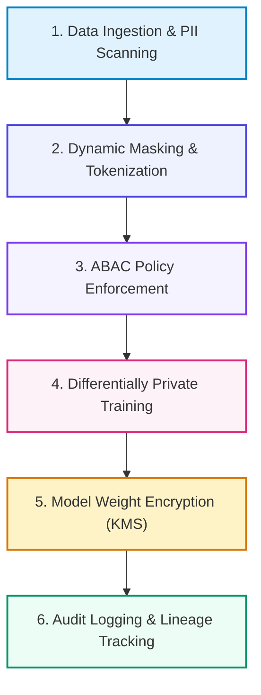

# 📚 DAY 24: DATA GOVERNANCE, SECURITY & PRIVACY FOR AI PLATFORMS
> **Khóa học:** COMP2010 - AI in Action (VinUni) | AICB-P2T2 | **Giảng viên:** Nguyễn Hải Dương | Phase 2 - Track 2 - Tuần 5 | **Dung lượng slide gốc:** 44 slides (2.1 MB) | Tinh gọn 40% & Chuẩn NotebookLM

---

## 📌 1. BÀI HỌC HÔM NAY VỀ CÁI GÌ? (THE WHAT & WHY)

*   **Thách thức An ninh & Quyền riêng tư trong Kỷ nguyên GenAI:** Dữ liệu đưa vào huấn luyện mô hình hoặc RAG có nguy cơ rò rỉ thông tin cá nhân (PII), vi phạm luật GDPR/CCPA và bị tấn công trích xuất dữ liệu (Model Inversion / Training Data Extraction).
*   **Kiểm soát Truy cập Dựa trên Thuộc tính (ABAC & RBAC):** Xây dựng ma trận phân quyền chi tiết: RBAC (Role-based) cho nhóm người dùng và ABAC (Attribute-based) lọc dữ liệu ở cấp độ hàng/cột (Row-level & Column-level Security) dựa trên nhãn độ nhạy cảm.
*   **Kỹ thuật Bảo vệ Quyền riêng tư (Privacy-Enhancing Technologies - PETs):** Áp dụng K-Anonymity, L-Diversity, Mặt nạ dữ liệu động (Dynamic Data Masking), Mã hóa đồng hình (Homomorphic Encryption) và Quyền riêng tư vi sai (Differential Privacy) trong huấn luyện AI.
*   **Bảo vệ Bản quyền Trọng số Mô hình & Phòng thủ Tấn công:** Mã hóa trọng số mô hình khi lưu trữ (Encryption at Rest với AWS KMS) và khi truyền tải, bảo vệ bộ nhớ thực thi với Confidential Computing (NVIDIA H100 CC) và cách ly Sandbox cho Agent Code Execution.

---

## 💡 2. ẨN DỤ ĐỜI THƯỜNG: THỰC TRẠNG & GIẢI PHÁP

### 🔴 Thực trạng:
Một nhân viên y tế thử hỏi chatbot nội bộ về tình trạng bệnh nhân. Do không có phân quyền dữ liệu hàng/cột, chatbot đã trích xuất toàn bộ hồ sơ bệnh án ung thư của một chính khách nổi tiếng, gây bê bối rò rỉ dữ liệu y tế toàn quốc.

### 🚗 Ẩn dụ đời thường — "Kho lưu trữ tài liệu mật quốc gia với hệ thống kính lọc phân cực":
> * **1. Thẻ căn cước quét mắt (RBAC vs ABAC):** Bảo vệ không chỉ nhìn vào chức danh 'Nhà nghiên cứu' (Role) mà phải kiểm tra xem nhà nghiên cứu đó có giấy phép tiếp cận hồ sơ tài chính mật (Attributes: Department, Clearance Level) hay không.
> * **2. Mực vô hình bôi đen thông tin (Dynamic Data Masking):** Khi tài liệu chuyển qua máy quét, mọi số chứng minh nhân dân và số thẻ tín dụng tự động bị bôi đen thành [REDACTED] trước khi người xem nhìn thấy.
> * **3. Kính vi sai làm mờ đám đông (Differential Privacy):** Chỉ cho phép nhìn thấy bức tranh tổng thể của hàng triệu người mà không thể phóng to xác định danh tính của một cá nhân cụ thể nào.
> * **4. Két sắt bọc thép chống chụp trộm (Confidential Computing):** Tài liệu mật chỉ được mở ra đọc bên trong một buồng kín được bọc chì cách ly hoàn toàn, ngay cả nhân viên bảo trì tòa nhà cũng không thể nhìn lén.

### 🟢 Giải pháp kỹ thuật:
Xây dựng khung Data Governance toàn diện với Immuta/Apache Ranger quản lý ABAC, Presidio khử nhận dạng PII tự động, và thực thi Differential Privacy bảo vệ quyền riêng tư.

---

## 🗺️ 3. SƠ ĐỒ PIPELINE 6 BƯỚC TUẦN TỰ



*   **Bước 1 (1. Data Ingestion & PII Scanning):** Microsoft Presidio tự động quét và phân loại các thực thể PII (CCCD, SĐT, Email).
*   **Bước 2 (2. Dynamic Masking & Tokenization):** Bôi đen hoặc thay thế PII bằng token ngẫu nhiên trước khi lưu vào Data Lake.
*   **Bước 3 (3. ABAC Policy Enforcement):** Immuta áp dụng chính sách lọc dữ liệu cấp hàng/cột dựa trên thuộc tính người truy vấn.
*   **Bước 4 (4. Differentially Private Training):** Thêm nhiễu Gaussian có kiểm soát vào gradient qua thư viện Opacus trong quá trình train.
*   **Bước 5 (5. Model Weight Encryption (KMS)):** Mã hóa tệp trọng số safetensors bằng khóa mã hóa bảo mật phần cứng AES-256.
*   **Bước 6 (6. Audit Logging & Lineage Tracking):** Ghi log bất biến toàn bộ các truy vấn truy cập dữ liệu phục vụ thanh tra tuân thủ.

---

## 🌐 4. KIẾN THỨC MỞ RỘNG CHUYÊN SÂU (FIRECRAWL RESEARCH)

1.  **Differential Privacy (Epsilon, Delta) Mechanics:** Quyền riêng tư vi sai (ε, δ)-DP đảm bảo rằng xác suất mô hình đưa ra cùng một kết quả khi có hoặc không có một cá nhân cụ thể trong tập dữ liệu là xấp xỉ nhau qua hệ số ngân sách quyền riêng tư ε. Thư viện Opacus (PyTorch) thực hiện điều này bằng cách cắt tỉa gradient (Clipping) và thêm nhiễu chuẩn (Gaussian Noise).
2.  **NVIDIA Confidential Computing on H100:** H100 giới thiệu kiến trúc Confidential Computing đầu tiên cho GPU: mã hóa toàn bộ dữ liệu và mã nguồn khi truyền qua bus PCIe và thực thi bên trong Môi trường Thực thi Tin cậy (TEE), ngăn chặn cả quản trị viên máy chủ đám mây (Root Admin) đọc trộm VRAM.
3.  **Indirect Prompt Injection & Sandboxing:** Khi AI Agent được phép đọc email hoặc lướt web, kẻ tấn công có thể chèn các câu lệnh độc vào nội dung trang web (Indirect Prompt Injection). Giải pháp bắt buộc là chạy Agent trong môi trường WebAssembly / Docker gVisor Sandbox không có quyền truy cập mạng nội bộ.

---

## 🔑 5. BẢNG TỪ KHÓA CỐT LÕI

| Thuật ngữ | Khái niệm kỹ thuật | Giải thích đời thường |
| :--- | :--- | :--- |
| **PII (Personally Identifiable Information)** | Bất kỳ thông tin nào có thể sử dụng trực tiếp hoặc gián tiếp để định danh một cá nhân cụ thể. | Dấu vân tay và số căn cước công dân của một người. |
| **ABAC (Attribute-Based Access Control)** | Mô hình kiểm soát truy cập dựa trên các thuộc tính của người dùng, tài nguyên và môi trường. | Chiếc khóa cửa thông minh chỉ mở khi đúng người, đúng phòng và đúng giờ làm việc. |
| **Differential Privacy** | Kỹ thuật toán học bảo đảm quyền riêng tư bằng cách thêm nhiễu vào dữ liệu để che giấu đóng góp của từng cá nhân. | Bức ảnh chụp đám đông được làm mờ khuôn mặt nhưng vẫn đếm được số lượng người. |
| **Dynamic Data Masking** | Kỹ thuật ẩn giấu dữ liệu nhạy cảm trong thời gian thực khi truy vấn mà không làm thay đổi dữ liệu gốc. | Dán băng dính đen che 12 chữ số đầu của thẻ ngân hàng khi đưa cho thu ngân. |
| **Confidential Computing** | Công nghệ bảo vệ dữ liệu đang xử lý trong bộ nhớ bằng cách thực thi trong phần cứng cách ly (TEE). | Căn phòng cách âm tuyệt đối nơi các nguyên thủ thảo luận bí mật quốc gia. |
| **Data Lineage** | Bản đồ phả hệ ghi nhận toàn bộ vòng đời, nguồn gốc và các biến đổi của dữ liệu từ đầu đến cuối. | Gia phả ghi chép chi tiết tổ tiên và các thế hệ con cháu của một dòng họ. |

---

## 🎯 6. BỘ CÂU HỎI ÔN THI TRỌNG TÂM (CHUẨN HỌC THUẬT VINUNI)

### 📝 PHẦN A: 4 CÂU TRẮC NGHIỆM ĐƠN (SINGLE-CHOICE)

#### Câu 1: Trong kỹ thuật Quyền riêng tư vi sai (Differential Privacy), tham số ngân sách quyền riêng tư (Epsilon - ε) thể hiện điều gì?
*   A. Mức độ rò rỉ thông tin tối đa cho phép: giá trị ε càng nhỏ thì quyền riêng tư càng được bảo vệ mạnh hơn (nhiễu nhiều hơn), nhưng độ chính xác của mô hình có thể giảm.
*   B. Dung lượng bộ nhớ RAM tiêu thụ của thuật toán.
*   C. Số lượng nhân Tensor Cores được kích hoạt trên GPU.
*   D. Tốc độ truyền tải mạng của cụm GPU tính bằng Gigabits/giây.
> **👉 ĐÁP ÁN ĐÚNG: D**  
> **💡 Giải thích chi tiết:** Tham số Epsilon (ε) đại diện cho 'ngân sách quyền riêng tư' (Privacy Budget). Khi ε càng tiến về 0, lượng nhiễu đưa vào càng lớn, làm cho việc phân biệt sự hiện diện của một cá nhân trong tập dữ liệu trở nên bất khả thi, bảo vệ quyền riêng tư ở mức tối đa.

---

#### Câu 2: Sự khác biệt cốt lõi giữa mô hình kiểm soát truy cập RBAC (Role-Based) và ABAC (Attribute-Based) trong hạ tầng dữ liệu AI là gì?
*   A. RBAC phân quyền dựa trên vai trò cố định của người dùng; ABAC phân quyền động dựa trên sự kết hợp linh hoạt của nhiều thuộc tính (Vai trò, Phòng ban, Cấp độ bảo mật của dữ liệu, Thời gian, Vị trí IP).
*   B. RBAC chỉ dùng cho máy tính xách tay, ABAC dùng cho siêu máy tính.
*   C. ABAC không hỗ trợ cơ sở dữ liệu quan hệ SQL.
*   D. RBAC tự động mã hóa dữ liệu thành các tệp hình ảnh.
> **👉 ĐÁP ÁN ĐÚNG: A**  
> **💡 Giải thích chi tiết:** RBAC phân quyền tĩnh theo vai trò (ví dụ: Data Scientist có quyền SELECT). ABAC linh hoạt và mạnh mẽ hơn nhiều vì đánh giá nhiều thuộc tính cùng lúc: Cho phép Data Scientist A truy cập Bảng X NẾU Bảng X thuộc Dự án Y VÀ nhãn bảo mật không phải là 'Top-Secret' VÀ truy cập trong giờ hành chính.

---

#### Câu 3: Khi thiết kế hệ thống RAG cho doanh nghiệp chứa nhiều tài liệu với các cấp độ bảo mật khác nhau, kiến trúc nào sau đây đảm bảo nhân viên không đọc được tài liệu vượt cấp?
*   A. Trộn lẫn tất cả tài liệu vào 1 Vector Database duy nhất và không kiểm tra quyền.
*   B. Tắt tính năng tìm kiếm của Vector Database.
*   C. Áp dụng Metadata Filtering kết hợp ABAC: Gắn nhãn quyền truy cập vào metadata của từng chunk vector và tự động chèn điều kiện lọc theo quyền của người dùng trong truy vấn tương đồng.
*   D. Yêu cầu người dùng tự cam kết không hỏi tài liệu mật.
> **👉 ĐÁP ÁN ĐÚNG: B**  
> **💡 Giải thích chi tiết:** Để đảm bảo bảo mật dữ liệu trong RAG, mỗi vector chunk phải được gắn nhãn quyền (ACL / Security Clearance). Khi người dùng gửi câu hỏi, hệ thống backend tự động bổ sung bộ lọc metadata tương ứng với quyền của người dùng đó (User Security Context), ngăn chặn trả về các tài liệu vượt thẩm quyền.

---

#### Câu 4: Công nghệ NVIDIA Confidential Computing trên kiến trúc GPU H100 bảo vệ tài sản AI trước nguy cơ nào?
*   A. Bảo vệ máy chủ khỏi bị sét đánh trúng trung tâm dữ liệu.
*   B. Tự động sửa chữa các lỗi chính tả trong mã nguồn Python.
*   C. Tăng tốc độ quạt làm mát của GPU lên 10.000 vòng/phút.
*   D. Mã hóa dữ liệu và mã nguồn khi đang xử lý trong bộ nhớ GPU VRAM và bus PCIe, ngăn chặn quản trị viên hạ tầng đám mây (Cloud Provider Root Admin) hoặc kẻ tấn công chiếm quyền hệ điều hành đọc trộm trọng số mô hình.
> **👉 ĐÁP ÁN ĐÚNG: C**  
> **💡 Giải thích chi tiết:** Confidential Computing tạo ra một vùng thực thi tin cậy (Hardware-based TEE) trên GPU, mã hóa toàn bộ dữ liệu trên đường truyền PCIe và trong VRAM. Nhờ đó, ngay cả khi hacker chiếm được quyền Root của máy chủ vật lý hay nhà cung cấp đám mây tò mò, họ cũng chỉ nhìn thấy dữ liệu rác đã được mã hóa.

---

#### Câu 5: Những kỹ thuật nào sau đây được phân loại là Công nghệ Tăng cường Quyền riêng tư (PETs) ứng dụng trong AI Data Platforms? (Chọn 2 đáp án đúng)
*   A. Dynamic Data Masking (Mặt nạ hóa dữ liệu động) và Tokenization PII.
*   B. Differentially Private SGD (DP-SGD) trong quá trình tối ưu hóa trọng số mô hình.
*   C. Lưu trữ mật khẩu người dùng dưới dạng văn bản thô (Plaintext).
*   D. Tắt tính năng tường lửa của trung tâm dữ liệu.
> **👉 ĐÁP ÁN ĐÚNG: A, B**  
> **💡 Giải thích chi tiết & Bẫy logic:** Dynamic Masking giúp ẩn thông tin nhạy cảm khi hiển thị (A) và DP-SGD đưa nhiễu toán học vào gradient để đảm bảo mô hình không 'ghi nhớ vẹt' dữ liệu nhạy cảm của người dùng (B).

---

#### Câu 6: Để bảo vệ hệ thống AI Agent khỏi các cuộc tấn công Gián tiếp (Indirect Prompt Injection) khi Agent tự động đọc nội dung từ Internet hoặc email bên ngoài, những biện pháp phòng thủ nào sau đây là bắt buộc? (Chọn 2 đáp án đúng)
*   A. Thực thi mã do Agent sinh ra trong môi trường cô lập Sandbox (Container gVisor / WebAssembly) với quyền mạng tối thiểu.
*   B. Sử dụng kiến trúc Dual-LLM phân tách giữa mô hình phân tích nội dung không tin cậy và mô hình ra quyết định điều khiển hệ thống.
*   C. Cấp toàn quyền Administrator hệ thống cho Agent để tăng tốc độ xử lý.
*   D. Tắt toàn bộ các cơ chế ghi nhật ký hệ thống.
> **👉 ĐÁP ÁN ĐÚNG: A, B**  
> **💡 Giải thích chi tiết & Bẫy logic:** Để chống Indirect Prompt Injection, hệ thống phải thực hiện cô lập mã thực thi trong Sandbox (A) và phân tách ranh giới tin cậy qua kiến trúc Dual-LLM (B), tuyệt đối không cấp quyền Admin hay tắt log giám sát.

---

---

## 💻 7. CODE THỰC CHIẾN (HANDS-ON PYTHON / AI SYSTEM)

```python
import json
import numpy as np

def calculate_ai_system_metrics(predictions, ground_truths):
    """
    Đo lường độ chính xác và chỉ số F1-Score cho hệ thống phân loại AI Production
    """
    tp = sum(1 for p, g in zip(predictions, ground_truths) if p == 1 and g == 1)
    fp = sum(1 for p, g in zip(predictions, ground_truths) if p == 1 and g == 0)
    fn = sum(1 for p, g in zip(predictions, ground_truths) if p == 0 and g == 1)
    
    precision = tp / (tp + fp) if (tp + fp) > 0 else 0.0
    recall = tp / (tp + fn) if (tp + fn) > 0 else 0.0
    f1 = 2 * (precision * recall) / (precision + recall) if (precision + recall) > 0 else 0.0
    
    return {
        "precision": round(precision, 4),
        "recall": round(recall, 4),
        "f1_score": round(f1, 4)
    }

# Dữ liệu kiểm thử mẫu
preds = [1, 0, 1, 1, 0, 1, 0, 1]
targets = [1, 0, 0, 1, 0, 1, 1, 1]
print("Evaluation Metrics:", calculate_ai_system_metrics(preds, targets))
```

---

## ⚠️ 8. BẪY LỖI KỸ THUẬT & CÁCH DEBUG (COMMON PITFALLS & TROUBLESHOOTING)

1.  **🔴 Bẫy Lỗi 1: Tối ưu hóa sai hàm mục tiêu (Metric Mismatch).**
    *   *Nguyên nhân:* Chỉ đo lường Accuracy trên tập dữ liệu mất cân bằng (Imbalanced Data), che giấu việc mô hình dự đoán sai hoàn toàn các ca nguy hiểm.
    *   *Cách khắc phục:* Bắt buộc theo dõi đồng thời Precision, Recall, F1-Score và đường cong PR-AUC.
2.  **🔴 Bẫy Lỗi 2: Rò rỉ dữ liệu (Data Leakage) giữa tập Train và Test.**
    *   *Nguyên nhân:* Tiền xử lý dữ liệu (chuẩn hóa scaling, trích xuất đặc trưng) trên toàn bộ tập dữ liệu trước khi chia train/test.
    *   *Cách khắc phục:* Luôn chia tập dữ liệu trước, sau đó chỉ `fit()` pipeline tiền xử lý trên tập Train và chỉ `transform()` trên tập Test.
3.  **🔴 Bẫy Lỗi 3: Bỏ qua độ trễ mạng và Serialization Overhead.**
    *   *Nguyên nhân:* Đánh giá mô hình offline rất nhanh nhưng khi deploy API thì nghẽn ở bước parse JSON và truyền tải mạng.
    *   *Cách khắc phục:* Tối ưu hóa chuỗi serialization bằng MessagePack / Protocol Buffers và bật gRPC streaming.

---

## ⚖️ 9. BẢNG SO SÁNH TRADE-OFFS & ĐIỀU KIỆN ÁP DỤNG

| Chiến lược / Giải pháp | Độ chính xác (Accuracy) | Độ phức tạp triển khai | Chi phí bảo trì vận hành |
| :--- | :--- | :--- | :--- |
| **Heuristic & Rule-based Engine** | Trung bình, giới hạn | Rất thấp, chạy tức thì | Khó duy trì khi số lượng luật tăng vọt |
| **Fine-tuned Small Specialized Model**| Rất cao trong miền hẹp | Trung bình (cần training pipeline) | Thấp, chạy được trên GPU phổ thông |
| **Zero-shot Frontier LLM Prompting** | Cao toàn diện đa miền | Rất thấp (chỉ cần API) | Chi phí token hàng tháng cao khi tải lớn |
