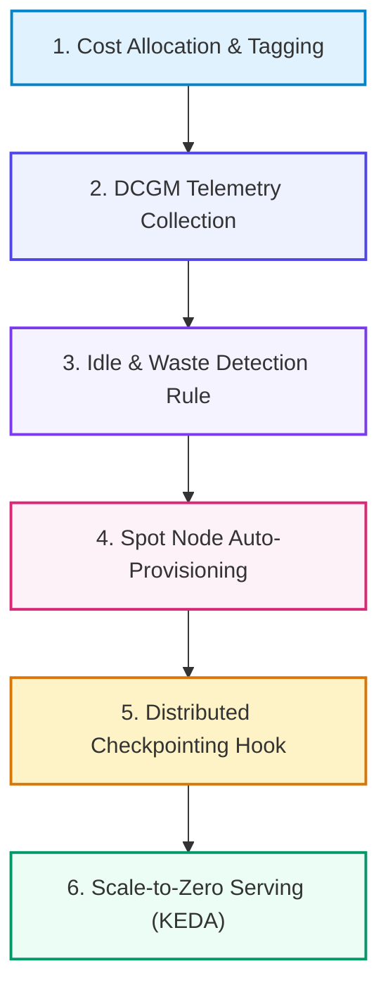

# 📚 DAY 25: GPU FINOPS, CLOUD COST OPTIMIZATION & CAPACITY PLANNING
> **Khóa học:** COMP2010 - AI in Action (VinUni) | AICB-P2T2 | **Giảng viên:** Nguyễn Hải Dương | Phase 2 - Track 2 - Tuần 5 | **Dung lượng slide gốc:** 40 slides (2.1 MB) | Tinh gọn 40% & Chuẩn NotebookLM

---

## 📌 1. BÀI HỌC HÔM NAY VỀ CÁI GÌ? (THE WHAT & WHY)

*   **Khủng hoảng Chi phí GPU & Sự ra đời của AI FinOps:** Chi phí hạ tầng AI tăng trưởng theo cấp số nhân. AI FinOps là sự kết hợp văn hóa, quy trình và công cụ để mang lại sự minh bạch chi phí (Cost Visibility), tối ưu hóa hiệu quả sử dụng tài nguyên (Utilization) và gắn liền chi phí AI với giá trị kinh doanh (Unit Economics).
*   **Ma trận Định giá & Lựa chọn Mô hình Thuê GPU:** Phân tích và tối ưu hóa tổ hợp danh mục: On-Demand (Linh hoạt nhưng đắt nhất), Reserved Instances / Savings Plans (Cam kết 1-3 năm giảm 30-50%), Spot Instances (Rẻ hơn 60-80% nhưng có rủi ro bị thu hồi) và GPU Serverless (Scale-to-Zero).
*   **Kỹ thuật Chia sẻ Phần cứng GPU (Multi-Tenancy & MIG):** Giải quyết bài toán GPU bị lãng phí do mô hình nhỏ không dùng hết năng lực tính toán. Phân vùng phần cứng vật lý NVIDIA MIG (Multi-Instance GPU), MPS (Multi-Process Service) và Time-Slicing trên Kubernetes.
*   **Tự động hóa Giám sát & Thu hồi Tài nguyên Rác (Cost Governance):** Thiết lập nhãn chi phí (Cost Allocation Tags), thu thập telemetry phần cứng qua NVIDIA DCGM Exporter, phát hiện GPU rảnh rỗi (Idle GPUs) và tự động thu hồi (Scale-to-Zero với KEDA).

---

## 💡 2. ẨN DỤ ĐỜI THƯỜNG: THỰC TRẠNG & GIẢI PHÁP

### 🔴 Thực trạng:
Một công ty công nghệ thuê 10 máy chủ NVIDIA A100 chạy 24/7 với chi phí 30.000 USD/tháng. Khi kiểm toán telemetry, các kỹ sư phát hiện 8 trong số 10 GPU có mức sử dụng nhân tính toán (SM Utilization) dưới 5% suốt 3 tuần qua do lập trình viên quên tắt máy sau khi thử nghiệm xong.

### 🚗 Ẩn dụ đời thường — "Đội xe tải vận tải container và bài toán tối ưu hóa chi phí nhiên liệu":
> * **1. Đồng hồ đo xăng từng xe (Cost Allocation & Tagging):** Mỗi xe tải gắn một cảm biến đo xăng thông minh ghi rõ xe nào chở hàng cho đơn hàng nào (Gắn nhãn chi phí theo Dự án/Team).
> * **2. Động cơ nổ máy không chạy (Idle GPU Detection):** Xe tải đỗ trong bãi nhưng tài xế vẫn nổ máy bật điều hòa cả ngày (GPU chạy không tải tiêu tốn 144 USD/ngày bốc hơi).
> * **3. Vé máy bay giờ chót giá siêu rẻ (Spot Instances):** Mua vé máy bay giờ chót giảm giá tới 80%, nhưng chấp nhận nhường ghế nếu có khách VIP trả giá cao xuất hiện đột xuất (Bị thu hồi máy ảo bất ngờ).
> * **4. Thùng xe ngăn vách chở hàng ghép (MIG Partitioning):** Một thùng xe siêu lớn A100 80GB được ngăn thành 7 khoang nhỏ cách ly hoàn toàn để phục vụ 7 tiểu thương khác nhau mà không sợ lẫn hàng hóa.

### 🟢 Giải pháp kỹ thuật:
Áp dụng vòng đời FinOps toàn diện với công cụ giám sát DCGM Exporter, tự động hóa cấp phát Spot GPU với Checkpoint bất đồng bộ và kích hoạt MIG phân vùng phần cứng.

---

## 🗺️ 3. SƠ ĐỒ PIPELINE 6 BƯỚC TUẦN TỰ



*   **Bước 1 (1. Cost Allocation & Tagging):** Gắn nhãn chi phí bắt buộc cho mọi tài nguyên GPU theo Team, Project và Model ID.
*   **Bước 2 (2. DCGM Telemetry Collection):** Thu thập độ sử dụng nhân tính toán (GPU SM Util) và bộ nhớ qua DCGM Exporter.
*   **Bước 3 (3. Idle & Waste Detection Rule):** Tự động phát hiện và cảnh báo các GPU Pod có độ sử dụng < 15% trong hơn 1 giờ.
*   **Bước 4 (4. Spot Node Auto-Provisioning):** Karpenter cấp phát Spot GPU node giá rẻ cho các job huấn luyện dài hạn.
*   **Bước 5 (5. Distributed Checkpointing Hook):** Lưu trạng thái trọng số huấn luyện bất đồng bộ lên S3/GCS mỗi 30 phút.
*   **Bước 6 (6. Scale-to-Zero Serving (KEDA)):** Tự động hạ số lượng GPU serving pod về 0 khi không có lưu lượng truy cập.

---

## 🌐 4. KIẾN THỨC MỞ RỘNG CHUYÊN SÂU (FIRECRAWL RESEARCH)

1.  **NVIDIA Multi-Instance GPU (MIG) Architecture:** MIG phân chia vật lý GPU A100/H100 ở cấp độ phần cứng thành tối đa 7 thực thể GPU Instances độc lập. Mỗi instance có riêng các cụm SM (Streaming Multiprocessors), phân vùng bộ nhớ HBM độc lập và băng thông bộ nhớ riêng biệt, đảm bảo tính cách ly chất lượng dịch vụ (QoS) 100% không bị ảnh hưởng lẫn nhau.
2.  **PyTorch TorchSnapshot & Non-blocking Checkpointing:** TorchSnapshot tối ưu hóa việc lưu checkpoint phân tán bằng cách ghi song song trực tiếp từ GPU VRAM vào NVMe/Storage qua đa luồng CPU mà không làm dừng (block) vòng lặp tính toán chính, giảm thời gian chết (Downtime overhead) từ 15% xuống < 1% tổng thời gian huấn luyện.
3.  **FinOps Unit Economics for AI (Cost Per Million Tokens):** Thay vì chỉ đo lường chi phí đám mây theo tháng, FinOps hiện đại đo lường chỉ số Đơn vị kinh tế (Unit Economics): Chi phí trên 1 triệu Tokens phục vụ (Cost / 1M Tokens) hoặc Chi phí trên mỗi Request hoàn thành đúng SLA, giúp ban giám đốc nhìn thấy trực tiếp biên lợi nhuận của sản phẩm AI.

---

## 🔑 5. BẢNG TỪ KHÓA CỐT LÕI

| Thuật ngữ | Khái niệm kỹ thuật | Giải thích đời thường |
| :--- | :--- | :--- |
| **FinOps (Financial Operations)** | Khung văn hóa và thực hành quản trị tài chính đám mây thúc đẩy trách nhiệm chi phí. | Phương pháp quản lý chi tiêu gia đình minh bạch từng khoản thu chi. |
| **MIG (Multi-Instance GPU)** | Công nghệ phân chia vật lý một GPU lớn thành tối đa 7 GPU nhỏ độc lập ở cấp độ phần cứng. | Chia một căn biệt thự lớn thành 7 căn hộ mini khép kín có lối đi riêng. |
| **DCGM Exporter** | Công cụ trích xuất số liệu đo lường chuyên sâu từ phần cứng GPU của NVIDIA cho Prometheus. | Đồng hồ đo tốc độ, nhiệt độ và mức tiêu thụ xăng trên bảng táp-lô xe hơi. |
| **Scale-to-Zero** | Khả năng tự động giải phóng toàn bộ máy chủ phục vụ về 0 khi không có yêu cầu nào. | Tắt toàn bộ đèn và điều hòa trong phòng họp khi mọi người đã ra về. |
| **Unit Economics in AI** | Các chỉ số tài chính vi mô đo lường chi phí trên từng đơn vị giá trị sinh ra (ví dụ: USD/1M Tokens). | Chi phí nguyên liệu để nướng ra một chiếc bánh mì. |
| **Spot Preemption** | Hành động nhà cung cấp đám mây thu hồi máy ảo Spot sau khi gửi thông báo trước 2 phút. | Nhà xe lấy lại ghế phụ giá rẻ khi có hành khách mua vé chính thức. |

---

## 🎯 6. BỘ CÂU HỎI ÔN THI TRỌNG TÂM (CHUẨN HỌC THUẬT VINUNI)

### 📝 PHẦN A: 4 CÂU TRẮC NGHIỆM ĐƠN (SINGLE-CHOICE)

#### Câu 1: Công nghệ NVIDIA Multi-Instance GPU (MIG) trên card A100/H100 vượt trội hơn giải pháp Time-Slicing truyền thống ở điểm cốt lõi nào?
*   A. MIG tự động tăng gấp đôi dung lượng bộ nhớ VRAM của GPU.
*   B. MIG phân chia vật lý bộ nhớ HBM, nhân tính toán SM và bộ đệm phần cứng thành các phân vùng độc lập có bảo đảm chất lượng dịch vụ (QoS), ngăn chặn hiện tượng một tiến trình làm nghẽn toàn bộ GPU.
*   C. Time-Slicing chỉ chạy được trên hệ điều hành Windows 98.
*   D. MIG làm giảm nhiệt độ phòng máy chủ về mức 0 độ C.
> **👉 ĐÁP ÁN ĐÚNG: B**  
> **💡 Giải thích chi tiết:** Trong Time-Slicing, các tiến trình chia sẻ chung bộ nhớ và thời gian thực thi, một tiến trình chạy nặng có thể làm tràn bộ nhớ (OOM) hoặc làm chậm các tiến trình khác. MIG phân chia phần cứng vật lý hoàn toàn độc lập, đảm bảo cách ly lỗi và hiệu năng tuyệt đối 100% giữa các người thuê (Tenants).

---

#### Câu 2: Để huấn luyện một mô hình Deep Learning lớn trong 2 tuần với ngân sách tiết kiệm nhất nhưng vẫn đảm bảo tiến độ khi sử dụng GPU Spot Instances, giải pháp nào sau đây là bắt buộc?
*   A. Cầu nguyện cho nhà cung cấp đám mây không thu hồi máy chủ.
*   B. Thiết lập cơ chế Checkpointing tự động lưu trạng thái trọng số mô hình định kỳ (mỗi 30-60 phút) lên Object Storage phân tán, kết hợp script tự động phát hiện Preemption để lưu checkpoint khẩn cấp và khởi tạo lại node mới.
*   C. Chỉ chạy huấn luyện vào ban đêm khi giá điện rẻ hơn.
*   D. Giảm số lượng lớp mạng nơ-ron xuống còn 1 lớp.
> **👉 ĐÁP ÁN ĐÚNG: C**  
> **💡 Giải thích chi tiết:** Spot Instances có thể bị thu hồi bất ngờ với cảnh báo trước 2 phút. Việc triển khai Elastic Checkpointing định kỳ và lắng nghe sự kiện Preemption giúp job huấn luyện chỉ bị mất tối đa vài chục phút tính toán và tự động tiếp tục chạy trên node mới mà không phải bắt đầu lại từ đầu.

---

#### Câu 3: Trong quản trị chi phí AI FinOps, chỉ số 'Unit Economics' nào sau đây phản ánh chính xác nhất hiệu quả kinh tế của một hệ thống LLM Inference phục vụ khách hàng?
*   A. Tổng số gigabyte mã nguồn Python đã viết.
*   B. Số lượng máy chủ GPU hiển thị trên bảng điều khiển AWS.
*   C. Chi phí hạ tầng trung bình trên 1 triệu Tokens phục vụ thành công (Cost per 1M Tokens) hoặc Chi phí trên mỗi lượt tương tác người dùng có giá trị.
*   D. Tốc độ quạt tản nhiệt của máy chủ đám mây.
> **👉 ĐÁP ÁN ĐÚNG: D**  
> **💡 Giải thích chi tiết:** Đo lường chi phí tổng theo tháng không phản ánh doanh nghiệp đang dùng hiệu quả hay lãng phí nếu lượng người dùng tăng. Chỉ số Unit Economics (Cost per 1M Tokens hoặc Cost per API Query) gắn liền chi phí kỹ thuật với tăng trưởng kinh doanh, cho phép tính toán chính xác biên lợi nhuận ròng.

---

#### Câu 4: Hiện tượng 'GPU Idle Waste' thường xuất phát từ nguyên nhân phổ biến nào trong các tổ chức công nghệ?
*   A. Kỹ sư nghiên cứu quên tắt các máy ảo GPU sau khi hoàn thành phiên làm việc Jupyter Notebook thử nghiệm, hoặc các dịch vụ Serving không có cơ chế tự động hạ tải khi vắng khách.
*   B. Do phần mềm diệt virus tự động chiếm quyền điều khiển GPU.
*   C. Do nhà cung cấp đám mây tự ý bật máy chủ mà không thông báo.
*   D. Do màn hình máy tính của lập trình viên không được tắt nguồn.
> **👉 ĐÁP ÁN ĐÚNG: A**  
> **💡 Giải thích chi tiết:** GPU Idle Waste (Lãng phí GPU không tải) là thủ phạm hàng đầu gây đội ngân sách AI: các máy ảo GPU đắt tiền (5-10 USD/giờ) bị bỏ quên chạy suốt đêm/cuối tuần mà không có tác vụ tính toán nào, hoặc các cụm Serving duy trì số lượng node tối đa 24/7 thay vì áp dụng Scale-to-Zero.

---

#### Câu 5: Những chiến lược nào sau đây giúp tối ưu hóa chi phí hạ tầng phục vụ mô hình AI (Model Serving) trên Kubernetes? (Chọn 2 đáp án đúng)
*   A. Áp dụng KEDA (Kubernetes Event-driven Autoscaling) để tự động mở rộng pod theo độ dài hàng đợi và Scale-to-Zero khi không có request.
*   B. Lượng tử hóa mô hình (Quantization FP8 / INT4) để nén kích thước trọng số, cho phép chuyển đổi từ GPU cao cấp đắt đỏ (A100) sang dòng GPU tiết kiệm điện (L4/T4).
*   C. Luôn luôn duy trì cố định 100 máy chủ H100 chạy ở mức 100% công suất kể cả lúc không có người dùng.
*   D. Xóa bỏ hoàn toàn các lớp kiểm thử bảo mật và giám sát hệ thống.
> **👉 ĐÁP ÁN ĐÚNG: A, B**  
> **💡 Giải thích chi tiết & Bẫy logic:** Scale-to-Zero giúp triệt tiêu chi phí khi không có tải (A) và lượng tử hóa mô hình giúp giảm dung lượng VRAM cần thiết, cho phép phục vụ mô hình trên các GPU dòng phổ thông với chi phí rẻ hơn 5-10 lần (B).

---

#### Câu 6: Một chính sách phân bổ chi phí (Cost Allocation) chuẩn mực trong AI FinOps đòi hỏi những hành động nào? (Chọn 2 đáp án đúng)
*   A. Bắt buộc gắn thẻ định danh (Mandatory Tags: Owner, Project, Environment, ModelName) cho mọi tài nguyên GPU và Storage khi khởi tạo.
*   B. Phân bổ hóa đơn đám mây minh bạch về từng Trung tâm Chi phí (Cost Center) của từng đội nhóm phát triển sản phẩm.
*   C. Gộp toàn bộ chi phí công ty vào một hóa đơn duy nhất và không cho phép ai xem chi tiết.
*   D. Cấm các kỹ sư sử dụng máy tính vào các ngày chẵn trong tuần.
> **👉 ĐÁP ÁN ĐÚNG: A, B**  
> **💡 Giải thích chi tiết & Bẫy logic:** FinOps đòi hỏi văn hóa chịu trách nhiệm tài chính: bắt buộc gắn nhãn tài nguyên để biết ai đang tiêu tiền (A) và minh bạch hóa chi phí về từng bộ phận kinh doanh cụ thể để tránh tình trạng 'cha chung không ai khóc' (B).

---

---

## 💻 7. CODE THỰC CHIẾN (HANDS-ON PYTHON / INFRASTRUCTURE)

```python
import os
import torch
import torch.distributed as dist

def init_distributed_cluster():
    # 1. Khởi tạo môi trường huấn luyện phân tán PyTorch DDP
    dist.init_process_group(
        backend="nccl", # NCCL tối ưu hóa cho giao tiếp NVLink giữa các GPU NVIDIA
        init_method="env://"
    )
    
    local_rank = int(os.environ["LOCAL_RANK"])
    global_rank = int(os.environ["RANK"])
    world_size = int(os.environ["WORLD_SIZE"])
    
    torch.cuda.set_device(local_rank)
    print(f"[Rank {global_rank}/{world_size}] GPU Initialized on Device cuda:{local_rank}")
    
    # 2. Khởi tạo Tensor dữ liệu trên từng GPU
    tensor_data = torch.ones(1024, 1024, device=f"cuda:{local_rank}") * (global_rank + 1)
    
    # 3. Thực hiện toán tử All-Reduce tính tổng gradient phân tán qua NVLink
    dist.all_reduce(tensor_data, op=dist.ReduceOp.SUM)
    
    if global_rank == 0:
        print("All-Reduce Sync Complete. Value at Rank 0:", tensor_data[0, 0].item())
        
    dist.destroy_process_group()

if __name__ == "__main__":
    if "WORLD_SIZE" in os.environ:
        init_distributed_cluster()
```

---

## ⚠️ 8. BẪY LỖI KỸ THUẬT & CÁCH DEBUG (COMMON PITFALLS & TROUBLESHOOTING)

1.  **🔴 Bẫy Lỗi 1: GPU Starvation do nghẽn cổ chai DataLoader CPU.**
    *   *Nguyên nhân:* Nhân Tensor Cores GPU tính toán siêu tốc nhưng phải chờ CPU giải nén và nạp dữ liệu từ ổ cứng SSD chậm.
    *   *Cách khắc phục:* Đặt `num_workers = 4 * num_gpus`, bật `pin_memory=True` và áp dụng GPUDirect Storage (GDS).
2.  **🔴 Bẫy Lỗi 2: Tràn bộ nhớ VRAM (CUDA Out of Memory) trong pha Inference.**
    *   *Nguyên nhân:* Không giới hạn kích thước KV Cache khi số lượng request đồng thời tăng đột biến.
    *   *Cách khắc phục:* Sử dụng thư viện serving tối ưu như vLLM với PagedAttention để phân bổ động các khối nhớ KV Cache.
3.  **🔴 Bẫy Lỗi 3: Chết tiến trình (Deadlock) trong All-Reduce khi 1 Worker bị chậm.**
    *   *Nguyên nhân:* Một node mạng bị rớt gói tin hoặc lỗi phần cứng khiến toàn bộ cụm GPU đứng chờ vô tận.
    *   *Cách khắc phục:* Thiết lập biến môi trường `TORCH_NCCL_HEARTBEAT_TIMEOUT_SEC=60` và bật cơ chế phục hồi checkpoint tự động.

---

## ⚖️ 9. BẢNG SO SÁNH TRADE-OFFS & ĐIỀU KIỆN ÁP DỤNG

| Giải pháp Phục vụ / Hạ tầng | Thông lượng (Throughput) | Độ trễ (Latency P95) | Chi phí & Độ phức tạp |
| :--- | :--- | :--- | :--- |
| **Native PyTorch Serving** | Thấp (Không có PagedAttention) | Cao khi batch size tăng | Đơn giản, dễ debug cho nghiên cứu |
| **vLLM (PagedAttention + Continuous Batching)** | Cực cao (Gấp 4x-10x PyTorch) | Thấp, ổn định | Tiêu chuẩn vàng cho Production LLM Serving |
| **TensorRT-LLM (Kernel Fusion & FP8)**| Cao nhất trên phần cứng NVIDIA H100 | Siêu thấp | Phức tạp khi build engine, phụ thuộc NVIDIA GPU |
