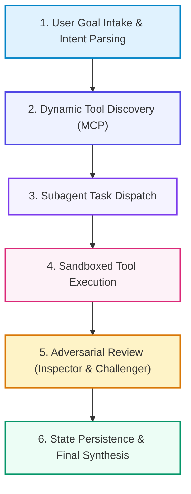

# 📚 DAY 26: AI AGENT INFRASTRUCTURE & PROTOCOLS (MCP & A2A)
> **Khóa học:** COMP2010 - AI in Action (VinUni) | AICB-P2T2 | **Giảng viên:** Nguyễn Hải Dương | Phase 2 - Track 2 - Tuần 6 | **Dung lượng slide gốc:** 42 slides (3.5 MB) | Tinh gọn 40% & Chuẩn NotebookLM

---

## 📌 1. BÀI HỌC HÔM NAY VỀ CÁI GÌ? (THE WHAT & WHY)

*   **Sự tiến hóa từ RAG Tĩnh sang AI Agents Tự hành:** Các ứng dụng AI chuyển dịch từ hệ thống hỏi-đáp một bước sang các tác nhân thông minh có khả năng lập kế hoạch (Planning), duy trì bộ nhớ dài hạn (Long-term Memory) và tương tác với thế giới thực qua công cụ (Tool Calling).
*   **Giao thức Ngữ cảnh Mô hình (Model Context Protocol - MCP):** Kiến trúc chuẩn mở do Anthropic khởi xướng: mô hình Client - Host - Server chuẩn hóa cách AI kết nối an toàn với tài nguyên dữ liệu cục bộ, cơ sở dữ liệu doanh nghiệp và các công cụ bên thứ ba mà không cần viết lại mã tích hợp.
*   **Giao thức Giao tiếp Đa Tác nhân (Agent-to-Agent - A2A):** Các mẫu kiến trúc phối hợp nhiều Agent: Phân cấp Chỉ huy - Thực thi (Hierarchical Orchestrator-Worker), Tranh luận Phản biện (Adversarial Critic-Challenger) và Lưới giao tiếp ngang hàng (Peer-to-Peer Mesh) qua hàng đợi bất đồng bộ.
*   **Hạ tầng Vận hành, Giữ Trạng thái (Persistence) & Sandboxing:** Quản lý trạng thái Agent (LangGraph Checkpointers), khôi phục phiên sau sự cố, cơ chế kiểm soát con người can thiệp (Human-in-the-Loop) và thực thi mã an toàn trong môi trường hộp cát cách ly (Secure Code Execution Sandboxes).

---

## 💡 2. ẨN DỤ ĐỜI THƯỜNG: THỰC TRẠNG & GIẢI PHÁP

### 🔴 Thực trạng:
Mỗi khi muốn kết nối AI với một công cụ mới (GitHub, Slack, SQL Database), lập trình viên phải tự viết mã tích hợp từ đầu. Khi có 10 mô hình và 50 công cụ, hệ thống trở thành một mớ bòng bong 500 kết nối rối rắm, cực kỳ dễ vỡ và không thể mở rộng.

### 🚗 Ẩn dụ đời thường — "Cổng cắm tiêu chuẩn USB-C toàn cầu và ban điều phối đa tác chiến":
> * **1. Chuẩn cắm đa năng duy nhất (Model Context Protocol - MCP):** Thay vì mang 20 loại dây sạc khác nhau cho từng dòng máy, toàn thế giới dùng chung 1 chuẩn cắm USB-C duy nhất để truyền điện, dữ liệu và hình ảnh.
> * **2. Trụ sở chỉ huy tác chiến liên quân (Orchestrator Agent):** Vị tướng chỉ huy nhận nhiệm vụ lớn, chia nhỏ thành các chiến dịch con và giao việc cho Đội trưởng Trinh sát, Đội trưởng Hậu cần và Đội trưởng Tác chiến.
> * **3. Cặp thanh tra độc lập và đối kháng (Inspector & Challenger):** Một thanh tra độc lập kiểm tra kết quả công việc và một chuyên gia phản biện cố gắng tìm ra lỗi sai sót trước khi ký biên bản bàn giao.
> * **4. Hộp thử nghiệm bom mìn cách ly (Sandboxed Execution):** Chuyên gia tháo ngòi nổ làm việc bên trong phòng kín bọc thép chống nổ, nếu có sự cố bom phát nổ cũng không làm sập tòa nhà chỉ huy.

### 🟢 Giải pháp kỹ thuật:
Triển khai giao thức MCP chuẩn hóa kết nối công cụ, phối hợp đa tác nhân với LangGraph State Machine, tích hợp cặp Inspector-Challenger và thực thi mã an toàn trong Sandbox.

---

## 🗺️ 3. SƠ ĐỒ PIPELINE 6 BƯỚC TUẦN TỰ



*   **Bước 1 (1. User Goal Intake & Intent Parsing):** Agent tiếp nhận mục tiêu phức tạp và bóc tách kế hoạch thực thi đa bước.
*   **Bước 2 (2. Dynamic Tool Discovery (MCP)):** MCP Client truy vấn danh mục công cụ sẵn có từ các MCP Servers qua giao thức JSON-RPC.
*   **Bước 3 (3. Subagent Task Dispatch):** Orchestrator khởi tạo các Subagent chuyên trách và giao việc kèm ngữ cảnh cô lập.
*   **Bước 4 (4. Sandboxed Tool Execution):** Thực thi các lệnh gọi hàm, truy vấn SQL và chạy mã trong môi trường Sandbox an toàn.
*   **Bước 5 (5. Adversarial Review (Inspector & Challenger)):** Thanh tra và chuyên gia phản biện kiểm định kết quả trước khi nghiệm thu.
*   **Bước 6 (6. State Persistence & Final Synthesis):** Lưu trạng thái phiên vào cơ sở dữ liệu và tổng hợp báo cáo hoàn chỉnh cho người dùng.

---

## 🌐 4. KIẾN THỨC MỞ RỘNG CHUYÊN SÂU (FIRECRAWL RESEARCH)

1.  **MCP Architecture: Client, Host, and Server:** MCP phân tách rõ ràng 3 thực thể: (1) Host: Ứng dụng AI như Antigravity/Claude Desktop nơi khởi tạo kết nối; (2) Client: Thành phần nằm trong Host duy trì kết nối 1:1 với Server; (3) Server: Tiến trình độc lập cung cấp Resources (dữ liệu đọc), Prompts (mẫu hướng dẫn) và Tools (hàm thực thi) qua stdio hoặc Server-Sent Events (SSE).
2.  **Cyclic State Graph & Human-in-the-Loop in LangGraph:** Khác với DAG tuyến tính một chiều, LangGraph mô hình hóa Agent dưới dạng Đồ thị trạng thái có chu trình (Cyclic Graphs). Cho phép Agent lặp lại vòng suy ngẫm - hành động - quan sát (ReAct loop), tạm dừng trạng thái chờ phê duyệt của con người (Interrupt / Human-in-the-loop) và tua lại lịch sử (Time-travel debugging).
3.  **A2A Communication Protocol & Message Formats:** Giao thức Agent-to-Agent chuẩn mực định nghĩa cấu trúc thông điệp bao gồm: Context (Bối cảnh nhiệm vụ), Content (Nội dung dữ liệu truyền tải), Action (Hành động kỳ vọng ở Agent nhận) và Metadata (Trace ID, Token Budget, Security Token).

---

## 🔑 5. BẢNG TỪ KHÓA CỐT LÕI

| Thuật ngữ | Khái niệm kỹ thuật | Giải thích đời thường |
| :--- | :--- | :--- |
| **AI Agent** | Hệ thống tự hành sử dụng LLM làm bộ não điều khiển để lập kế hoạch, sử dụng công cụ và hoàn thành mục tiêu. | Một người trợ lý chuyên nghiệp biết tự lên lịch trình, gọi điện thoại và đặt phòng họp. |
| **MCP (Model Context Protocol)** | Giao thức chuẩn mở chuẩn hóa việc kết nối giữa các mô hình AI và các nguồn tài nguyên dữ liệu, công cụ bên ngoài. | Chuẩn kết nối USB-C thống nhất giúp cắm mọi thiết bị ngoại vi vào máy tính. |
| **Orchestrator-Worker Pattern** | Mô hình phối hợp đa tác nhân trong đó Agent trung tâm điều phối và phân công nhiệm vụ cho các Worker chuyên biệt. | Tổng thầu xây dựng điều phối thợ điện, thợ nề và thợ sơn hoàn thiện công trình. |
| **Inspector-Challenger Pair** | Mô hình kiểm định độc lập gồm một Agent thanh tra kiểm tra kết quả và một Agent phản biện tìm lỗi. | Cặp kiểm toán viên độc lập và luật sư phản biện cùng rà soát hợp đồng kinh tế. |
| **LangGraph State Machine** | Khung lập trình mô hình hóa luồng công việc của Agent dưới dạng máy trạng thái có chu trình và điểm lưu vết. | Bàn cờ vua lưu giữ chính xác vị trí của từng quân cờ sau mỗi nước đi. |
| **Tool Calling / Function Calling** | Khả năng của LLM sinh ra lệnh gọi hàm có cấu trúc JSON để yêu cầu hệ thống thực thi tác vụ bên ngoài. | Thủ trưởng viết phiếu yêu cầu xuất kho có chữ ký cho thủ kho thực hiện. |

---

## 🎯 6. BỘ CÂU HỎI ÔN THI TRỌNG TÂM (CHUẨN HỌC THUẬT VINUNI)

### 📝 PHẦN A: 4 CÂU TRẮC NGHIỆM ĐƠN (SINGLE-CHOICE)

#### Câu 1: Kiến trúc của giao thức Model Context Protocol (MCP) do Anthropic khởi xướng bao gồm những thành phần cốt lõi nào?
*   A. Chỉ bao gồm một file văn bản Word duy nhất.
*   B. Mô hình phân tách 3 lớp: Host (Ứng dụng AI), Client (Trình kết nối nội bộ) và Server (Tiến trình độc lập cung cấp Resources, Prompts và Tools qua chuẩn JSON-RPC).
*   C. Toàn bộ mã nguồn phải viết bằng ngôn ngữ Pascal.
*   D. Chỉ hoạt động được trên các dòng máy chủ siêu đắt tiền của IBM.
> **👉 ĐÁP ÁN ĐÚNG: A**  
> **💡 Giải thích chi tiết:** MCP chuẩn hóa giao tiếp giữa AI và thế giới bên ngoài thông qua mô hình Host-Client-Server. MCP Server là các tiến trình độc lập cung cấp 3 tài nguyên chuẩn hóa: Resources (dữ liệu), Prompts (mẫu câu lệnh) và Tools (hàm thực thi) cho AI Host thông qua giao thức truyền tải stdio hoặc SSE.

---

#### Câu 2: Trong mô hình đa tác nhân (Multi-Agent Systems), tại sao kiến trúc 'Inspector + Challenger Pair' lại vượt trội hơn cơ chế tự đánh giá (Self-Reflection) của một Agent đơn lẻ?
*   A. Vì cơ chế này làm giảm số lượng câu lệnh code Python cần viết.
*   B. Một Agent đơn lẻ thường mắc bẫy thiên vị xác nhận (Confirmation Bias) và bỏ qua lỗi sai của chính mình; cặp Inspector (thanh tra độc lập) và Challenger (phản biện đối kháng) giúp phát hiện triệt để các lỗ hổng logic và giả mạo kết quả.
*   C. Inspector-Challenger chỉ dùng để dịch chuyển ngữ văn bản.
*   D. Cơ chế này không cần kết nối mạng Internet.
> **👉 ĐÁP ÁN ĐÚNG: B**  
> **💡 Giải thích chi tiết:** Tương tự như con người, khi một mô hình tự chấm bài thi của mình, nó có xu hướng tự biện minh cho các giả định sai lầm. Cặp thanh tra và phản biện được khởi tạo với vai trò và mục tiêu đối nghịch độc lập, buộc hệ thống phải cung cấp bằng chứng xác thực thực tế mới cho qua.

---

#### Câu 3: Tại sao việc thực thi mã nguồn (Code Execution) do AI Agent tự động sinh ra bắt buộc phải chạy trong môi trường Hộp cát (Sandbox) cách ly?
*   A. Để tăng tốc độ hiển thị hình ảnh trên màn hình.
*   B. Ngăn chặn mã độc hại hoặc các câu lệnh phá hoại (như `rm -rf /` hoặc quét mạng nội bộ) xâm nhập và phá hủy hệ thống máy chủ thật của doanh nghiệp.
*   C. Để giảm dung lượng pin tiêu thụ của bàn phím.
*   D. Vì ngôn ngữ Python không thể chạy trực tiếp trên hệ điều hành Linux.
> **👉 ĐÁP ÁN ĐÚNG: C**  
> **💡 Giải thích chi tiết:** Mã nguồn do LLM tự sinh có thể chứa lỗi logic nghiêm trọng hoặc bị thao túng bởi Prompt Injection để thực thi các lệnh nguy hiểm (xóa database, đánh cắp SSH keys, quét cổng mạng). Môi trường Sandbox (như Docker gVisor hoặc WASM) giam giữ tiến trình trong không gian an toàn hoàn toàn cách ly.

---

#### Câu 4: Cơ chế 'Checkpointer' trong LangGraph đóng vai trò gì trong việc xây dựng các Agent hoạt động dài hạn?
*   A. Tự động kiểm tra chính tả tiếng Việt trong tài liệu.
*   B. Hủy tiến trình container nếu health check liveness probe thất bại liên tiếp 3 lần.
*   C. Lưu trữ bền vững (Persistence) toàn bộ trạng thái của đồ thị sau mỗi bước thực thi vào cơ sở dữ liệu, cho phép khôi phục phiên làm việc sau sự cố, hỗ trợ Human-in-the-loop và tua lại lịch sử (Time-travel).
*   D. Đổi màu giao diện người dùng theo thời gian thực.
> **👉 ĐÁP ÁN ĐÚNG: D**  
> **💡 Giải thích chi tiết:** LangGraph Checkpointer lưu vết ảnh chụp trạng thái (State Snapshots) của Agent vào SQLite/Postgres. Khi máy chủ sập hoặc khi Agent cần dừng lại đợi người dùng phê duyệt (Human-in-the-loop), hệ thống có thể nạp lại đúng trạng thái đó và chạy tiếp mà không mất ngữ cảnh.

---

#### Câu 5: Giao thức Model Context Protocol (MCP) định nghĩa những loại tài nguyên (Primitives) chuẩn hóa nào mà một Server có thể cung cấp cho AI Client? (Chọn 2 đáp án đúng)
*   A. Tools: Các hàm có thể gọi được với tham số đầu vào được định nghĩa bằng JSON Schema để Agent thực thi hành động.
*   B. Resources: Các dữ liệu dạng tài liệu hoặc tệp tin ngữ cảnh có thể đọc được (như file hệ thống, bản ghi cơ sở dữ liệu).
*   C. Thẻ tín dụng quốc tế để tự động thanh toán tiền thuê bao phần mềm.
*   D. Bản sao chứng minh nhân dân của người sáng lập công ty.
> **👉 ĐÁP ÁN ĐÚNG: A, B**  
> **💡 Giải thích chi tiết & Bẫy logic:** MCP chuẩn hóa 3 khối chức năng cốt lõi: Tools (Công cụ thực thi hành động có side-effects) (A), Resources (Tài nguyên dữ liệu tĩnh/động để đọc ngữ cảnh) (B) và Prompts (Mẫu câu lệnh được thiết kế sẵn).

---

#### Câu 6: Những mẫu kiến trúc điều phối nào sau đây là phổ biến và hiệu quả trong việc thiết kế hệ thống Đa tác nhân (Multi-Agent Systems)? (Chọn 2 đáp án đúng)
*   A. Hierarchical Orchestrator-Workers: Một Agent chỉ huy trưởng lập kế hoạch tổng thể và điều phối các Subagent chuyên gia thực thi từng phần việc độc lập.
*   B. Sequential Pipeline: Luồng xử lý tuần tự trong đó đầu ra của Agent trước là đầu vào của Agent tiếp theo có kiểm định chất lượng ở từng chặng.
*   C. Chaotic Chaos: Cho 100 Agent cùng nói chuyện tự do trong một nhóm chat không có mục tiêu.
*   D. Silent Isolation: Cấm tất cả các Agent giao tiếp hoặc truyền dữ liệu cho nhau.
> **👉 ĐÁP ÁN ĐÚNG: A, B**  
> **💡 Giải thích chi tiết & Bẫy logic:** Mô hình Phân cấp Chỉ huy - Thực thi (A) và Pipeline tuần tự có kiểm soát chất lượng (B) là 2 mẫu thiết kế kinh điển giúp hệ thống Đa tác nhân vận hành có trật tự, minh bạch trách nhiệm và đạt hiệu quả công việc cao.

---

---

## 💻 7. CODE THỰC CHIẾN (HANDS-ON PYTHON / LANGGRAPH)

```python
from typing import TypedDict, Annotated, List
import operator
from langgraph.graph import StateGraph, END

# 1. Định nghĩa Agent State Schema với Reducer
class AgentState(TypedDict):
    messages: Annotated[List[str], operator.add]
    attempt_count: int
    is_success: bool

# 2. Định nghĩa các Node xử lý trong đồ thị
def actor_node(state: AgentState):
    current_attempt = state.get("attempt_count", 0) + 1
    new_message = f"Actor generated plan attempt #{current_attempt}"
    return {"messages": [new_message], "attempt_count": current_attempt}

def evaluator_node(state: AgentState):
    # Logic tự chấm điểm và đánh giá
    success = state["attempt_count"] >= 2 # Giả lập thành công ở vòng 2
    return {"is_success": success}

# 3. Hàm phân nhánh có điều kiện (Conditional Routing)
def check_completion(state: AgentState):
    if state["is_success"]:
        return "end"
    if state["attempt_count"] >= 3:
        return "end"
    return "retry"

# 4. Xây dựng đồ thị trạng thái
workflow = StateGraph(AgentState)
workflow.add_node("actor", actor_node)
workflow.add_node("evaluator", evaluator_node)
workflow.set_entry_point("actor")
workflow.add_edge("actor", "evaluator")
workflow.add_conditional_edges("evaluator", check_completion, {
    "end": END,
    "retry": "actor"
})

app = workflow.compile()
final_state = app.invoke({"messages": ["Initial Task"], "attempt_count": 0, "is_success": False})
print("Final Trajectory:", final_state["messages"])
```

---

## ⚠️ 8. BẪY LỖI KỸ THUẬT & CÁCH DEBUG (COMMON PITFALLS & TROUBLESHOOTING)

1.  **🔴 Bẫy Lỗi 1: Vòng lặp vô tận (Infinite Loop) do thiếu Guardrail dừng.**
    *   *Nguyên nhân:* Tác tử liên tục gọi lại cùng một công cụ với tham số lỗi mà không có giới hạn số lần thử.
    *   *Cách khắc phục:* Luôn cài đặt `max_iterations` cứng (ví dụ max = 5) và cơ chế Circuit Breaker trong Graph State.
2.  **🔴 Bẫy Lỗi 2: Tràn cửa sổ ngữ cảnh (Context Bloat) khi tích lũy Trajectory.**
    *   *Nguyên nhân:* Toàn bộ log gọi tool thô được nối dồn vào prompt khiến token bùng nổ và mô hình bị suy giảm chú ý.
    *   *Cách khắc phục:* Sử dụng cơ chế Sliding Window Memory chỉ giữ 3-5 bước gần nhất kết hợp tóm tắt tự động (Summary Reducer).
3.  **🔴 Bẫy Lỗi 3: Tác tử bị mắc kẹt vào các giả định sai lầm (Cascading Hallucination).**
    *   *Nguyên nhân:* ReAct truyền thống không có bước Reflector để phủ định kết luận trung gian sai lầm.
    *   *Cách khắc phục:* Nâng cấp lên kiến trúc Reflexion hoặc LATS với Evaluator độc lập kiểm định chứng cứ.

---

## ⚖️ 9. BẢNG SO SÁNH TRADE-OFFS & ĐIỀU KIỆN ÁP DỤNG

| Mô hình Kiến trúc | Ưu điểm cốt lõi | Nhược điểm & Chi phí | Tình huống áp dụng tối ưu |
| :--- | :--- | :--- | :--- |
| **Single-Agent ReAct** | Đơn giản, độ trễ thấp, ít tốn token | Dễ rơi vào lỗi lan tỏa và vòng lặp vô tận | Tác vụ đơn giản 1-2 bước gọi tool API |
| **Reflexion Agent** | Tự sửa lỗi sau thất bại, tăng accuracy 20-30% | Tăng số lần gọi LLM (2x-3x token cost) | Sinh mã nguồn, giải toán, kiểm tra dữ liệu |
| **Hierarchical Multi-Agent (Supervisor)** | Cô lập ngữ cảnh chuyên môn, xử lý bài toán lớn | Phức tạp trong cấu hình, độ trễ cao | Hệ thống doanh nghiệp đa phòng ban, phân tích dữ liệu |
