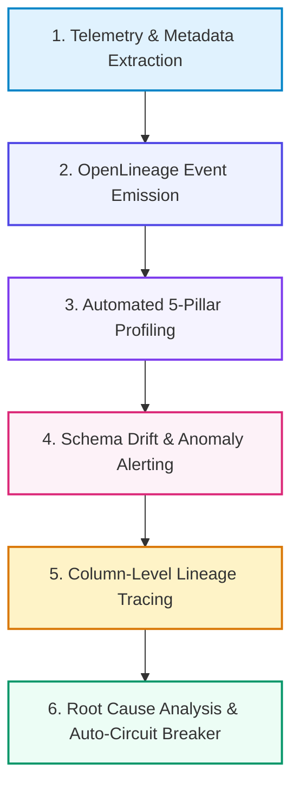

# 📚 DAY 27: DATA OBSERVABILITY, DATA QUALITY & END-TO-END LINEAGE
> **Khóa học:** COMP2010 - AI in Action (VinUni) | AICB-P2T2 | **Giảng viên:** Nguyễn Hải Dương | Phase 2 - Track 2 - Tuần 6 | **Dung lượng slide gốc:** 42 slides (3.1 MB) | Tinh gọn 40% & Chuẩn NotebookLM

---

## 📌 1. BÀI HỌC HÔM NAY VỀ CÁI GÌ? (THE WHAT & WHY)

*   **Sự chuyển dịch từ Data Quality truyền thống sang Data Observability:** Kiểm tra chất lượng tĩnh (Data Quality Tests) chỉ bắt được các lỗi đã biết trước. Data Observability là khả năng theo dõi liên tục, tự động phát hiện các bất thường chưa biết (Unknown Unknowns) và khoanh vùng nguyên nhân gốc rễ (RCA).
*   **5 Trụ cột của Data Observability:** Đo lường toàn diện: Độ tươi mới (Freshness - độ trễ dữ liệu), Phân phối (Distribution - dị thường thống kê), Khối lượng (Volume - sụt giảm/tăng đột biến dòng), Cấu trúc (Schema - thay đổi cấu trúc bảng) và Phả hệ (Lineage - bản đồ dòng chảy dữ liệu).
*   **Phả hệ Dữ liệu Đầu-cuối (End-to-End Lineage) với OpenLineage:** Chuẩn mở OpenLineage và Marquez: thu thập siêu dữ liệu dòng chảy ở cấp độ từng bảng (Table-level) và cấp độ từng cột (Column-level), phân tích tác động dây chuyền (Root Cause & Impact Analysis) khi có sự cố gãy pipeline.
*   **Tự động hóa Giám sát & Báo động Bất thường cho AI Platforms:** Ứng dụng Monte Carlo, Great Expectations và Elementary Data để giám sát tự động các đặc trưng đầu vào của mô hình, phát hiện sớm hiện tượng Trôi dạt dữ liệu (Data Drift) trước khi làm suy giảm độ chính xác của AI.

---

## 💡 2. ẨN DỤ ĐỜI THƯỜNG: THỰC TRẠNG & GIẢI PHÁP

### 🔴 Thực trạng:
Một ngày đẹp trời, hệ thống dự báo nhu cầu kho vận AI đưa ra kết quả sai lệch 500%, khiến công ty nhập thừa hàng triệu sản phẩm. Đội ngũ kỹ sư mất 5 ngày lục lọi 200 bảng dữ liệu mới phát hiện một trường dữ liệu bị nhà cung cấp đổi đơn vị từ 'Gram' sang 'Kilogram' mà không báo trước.

### 🚗 Ẩn dụ đời thường — "Trung tâm điều phối mạng lưới cấp nước sạch thông minh đô thị":
> * **1. Đồng hồ đo lưu lượng dòng chảy (Volume & Freshness):** Cảm biến đo lường nếu lượng nước chảy qua đường ống giảm 80% hoặc nước ngừng chảy quá 15 phút, chuông báo động trung tâm lập tức reo vang.
> * **2. Xét nghiệm mẫu nước tự động (Distribution & Quality):** Thiết bị quang phổ liên tục đo độ mặn, độ pH và nồng độ khoáng; nếu độ mặn tăng vọt bất thường (Data Drift), van xả tự động đóng ngay lập tức.
> * **3. Bản đồ mạng lưới đường ống ngầm (End-to-End Lineage):** Bản thiết kế số 3D hiển thị chi tiết từng nhánh ống nối từ hồ nước qua các trạm bơm đến tận vòi nước từng hộ gia đình (Column-level lineage).
> * **4. Đèn cảnh báo van hỏng (Automated Anomaly Detection):** Khi một trạm bơm bị tắc rác, hệ thống tự động đánh dấu đỏ vị trí chính xác trên bản đồ và gửi thông báo khẩn cấp cho đội sửa chữa trong 30 giây.

### 🟢 Giải pháp kỹ thuật:
Triển khai nền tảng Data Observability toàn diện với OpenLineage thu thập phả hệ cột, Great Expectations kiểm định chất lượng và tự động phát hiện dị thường thống kê.

---

## 🗺️ 3. SƠ ĐỒ PIPELINE 6 BƯỚC TUẦN TỰ



*   **Bước 1 (1. Telemetry & Metadata Extraction):** Trích xuất siêu dữ liệu thực thi từ Spark, dbt, Airflow và Snowflake.
*   **Bước 2 (2. OpenLineage Event Emission):** Phát luồng sự kiện OpenLineage chuẩn JSON mô tả Dataset, Job và Inputs/Outputs.
*   **Bước 3 (3. Automated 5-Pillar Profiling):** Thuật toán Machine Learning tự động học phân phối bình thường của Volume, Freshness.
*   **Bước 4 (4. Schema Drift & Anomaly Alerting):** Gửi cảnh báo Slack/PagerDuty tức thì khi phát hiện cột bị xóa hoặc trôi dạt giá trị.
*   **Bước 5 (5. Column-Level Lineage Tracing):** Vẽ bản đồ phụ thuộc từ trường dữ liệu nguồn đến các đặc trưng trong Feature Store.
*   **Bước 6 (6. Root Cause Analysis & Auto-Circuit Breaker):** Tự động kích hoạt cầu dao ngắt pipeline (Circuit Breaker) ngăn dữ liệu bẩn vào AI Model.

---

## 🌐 4. KIẾN THỨC MỞ RỘNG CHUYÊN SÂU (FIRECRAWL RESEARCH)

1.  **OpenLineage Standard Specification & Facets:** OpenLineage định nghĩa chuẩn mở cho siêu dữ liệu dòng chảy. Một sự kiện OpenLineage bao gồm RunState (START, COMPLETE, FAIL), Job Facets (mã nguồn, lịch chạy) và Dataset Facets (Schema, Column-level lineage, Data Quality Metrics), cho phép hợp nhất giám sát trên toàn bộ các công cụ phân mảnh.
2.  **Machine Learning for Anomaly Detection in Data Streams:** Thay vì đặt các ngưỡng cảnh báo tĩnh cứng nhắc (Threshold-based) dễ gây báo động giả, các hệ thống Observability hiện đại sử dụng mô hình chuỗi thời gian (như Prophet hoặc Auto-Regressive) để tự động học tính chu kỳ theo mùa (Seasonality) và xu hướng tăng trưởng của dữ liệu.
3.  **Data Circuit Breakers for Production AI Pipelines:** Cơ chế 'Cầu dao dữ liệu' (Data Circuit Breakers) tự động chặn đứng tiến trình nạp dữ liệu vào mô hình AI hoặc dừng việc triển khai mô hình mới khi phát hiện các bài test chất lượng dữ liệu ở tầng Silver/Gold bị thất bại, bảo vệ hệ thống khỏi thảm họa Garbage In, Garbage Out.

---

## 🔑 5. BẢNG TỪ KHÓA CỐT LÕI

| Thuật ngữ | Khái niệm kỹ thuật | Giải thích đời thường |
| :--- | :--- | :--- |
| **Data Observability** | Khả năng thấu hiểu toàn diện trạng thái sức khỏe của hệ thống dữ liệu qua 5 trụ cột. | Bảng điều khiển sức khỏe tổng thể của bệnh nhân trong phòng hồi sức cấp cứu. |
| **Data Lineage** | Bản đồ ghi nhận chi tiết nguồn gốc, sự di chuyển và các biến đổi của dữ liệu qua từng bước. | Bản đồ vệ tinh hiển thị hành trình dòng chảy của một con sông từ thượng nguồn ra biển. |
| **Data Freshness** | Chỉ số đo lường khoảng cách thời gian giữa lần cập nhật dữ liệu gần nhất và thời điểm hiện tại. | Hạn sử dụng ghi trên hộp sữa tươi để biết sữa còn mới hay đã thiu. |
| **Schema Drift** | Hiện tượng cấu trúc các cột, kiểu dữ liệu trong bảng nguồn bị thay đổi ngoài dự kiến. | Ổ cắm điện trong phòng bị đổi từ 3 chấu sang 2 chấu khiến phích cắm không vừa. |
| **OpenLineage** | Chuẩn mở phi lợi nhuận cho việc thu thập và phân tích siêu dữ liệu phả hệ dữ liệu. | Hộ chiếu tiêu chuẩn quốc tế giúp công dân xuất nhập cảnh mọi quốc gia. |
| **Data Circuit Breaker** | Cơ chế tự động ngắt dòng chảy dữ liệu khi phát hiện sự cố chất lượng nghiêm trọng. | Cầu dao điện tự động nhảy ngắt nguồn khi hệ thống bị chập điện để chống cháy nổ. |

---

## 🎯 6. BỘ CÂU HỎI ÔN THI TRỌNG TÂM (CHUẨN HỌC THUẬT VINUNI)

### 📝 PHẦN A: 4 CÂU TRẮC NGHIỆM ĐƠN (SINGLE-CHOICE)

#### Câu 1: 5 Trụ cột cốt lõi của Khung năng lực Quan sát Dữ liệu (Data Observability) bao gồm những yếu tố nào?
*   A. Độ tươi mới (Freshness), Khối lượng (Volume), Cấu trúc (Schema), Phân phối giá trị (Distribution) và Phả hệ dữ liệu (Lineage).
*   B. Âm thanh, Hình ảnh, Ánh sáng, Màu sắc, Phông chữ.
*   C. CPU, RAM, Ổ cứng, Chuột, Bàn phím.
*   D. HTML, CSS, JavaScript, Python, C++.
> **👉 ĐÁP ÁN ĐÚNG: C**  
> **💡 Giải thích chi tiết:** 5 Trụ cột của Data Observability giúp bao quát 100% các khía cạnh của dữ liệu: Freshness (dữ liệu có đến đúng giờ không?), Volume (dữ liệu có bị thiếu/thừa dòng không?), Schema (cột có bị đổi kiểu không?), Distribution (giá trị có bị dị thường không?) và Lineage (nếu hỏng thì ảnh hưởng đến những báo cáo/mô hình AI nào?).

---

#### Câu 2: Tại sao Phả hệ dữ liệu ở cấp độ từng cột (Column-Level Lineage) lại đóng vai trò tối quan trọng trong việc khắc phục sự cố hệ thống AI?
*   A. Cho phép kỹ sư truy vết chính xác một đặc trưng (Feature) bị lỗi trong mô hình AI bắt nguồn từ cột dữ liệu cụ thể nào của bảng nguồn ở đầu vào và đi qua những phép biến đổi toán học nào.
*   B. Vì nó giúp chuyển đổi các cột số thành các cột văn bản.
*   C. Giúp tăng độ phân giải của màn hình làm việc.
*   D. Tự động xóa các cột dữ liệu không có người xem.
> **👉 ĐÁP ÁN ĐÚNG: A**  
> **💡 Giải thích chi tiết:** Lineage cấp độ bảng chỉ cho biết Bảng A tạo ra Bảng B. Column-level Lineage chỉ ra chính xác Cột `price_usd` ở Bảng B được tính từ Cột `raw_price` nhân với Cột `exchange_rate` ở Bảng A, giúp cô lập nguyên nhân gốc rễ (Root Cause) trong vài phút thay vì nhiều ngày.

---

#### Câu 3: Cơ chế 'Data Circuit Breaker' (Cầu dao dữ liệu) hoạt động như thế nào trong một Pipeline phục vụ huấn luyện AI?
*   A. Thu hồi token truy cập tạm thời sau khi phiên làm việc hết hạn 15 phút.
*   B. Khi phát hiện dữ liệu đầu vào vi phạm các điều kiện kiểm định chất lượng nghiêm trọng (như tỷ lệ Null tăng vọt, phân phối bị trôi dạt), hệ thống tự động dừng pipeline và chặn không cho dữ liệu bẩn nạp vào mô hình AI.
*   C. Xóa toàn bộ cơ sở dữ liệu để giải phóng bộ nhớ.
*   D. Tự động tăng tốc độ xử lý dữ liệu lên gấp 10 lần khi có lỗi.
> **👉 ĐÁP ÁN ĐÚNG: D**  
> **💡 Giải thích chi tiết:** Tương tự như cầu dao điện ngắt khi chập điện, Data Circuit Breaker tự động ngắt luồng chuyển giao dữ liệu khi phát hiện dữ liệu bẩn, ngăn chặn hiện tượng đầu độc mô hình (Model Poisoning) và bảo vệ hệ thống Production khỏi các quyết định sai lầm.

---

#### Câu 4: Chuẩn mở OpenLineage giải quyết thách thức lớn nào trong việc quản trị hạ tầng dữ liệu hiện đại?
*   A. Giúp giảm chi phí mua bản quyền hệ điều hành Windows.
*   B. Miễn phí tiền điện cho các trung tâm dữ liệu đám mây.
*   C. Tự động chuyển đổi toàn bộ mã nguồn SQL sang ngôn ngữ C.
*   D. Chuẩn hóa định dạng phát và thu thập siêu dữ liệu phả hệ dòng chảy từ nhiều công cụ không đồng nhất (Spark, dbt, Airflow, Flink, Trino) về một nền tảng quản trị duy nhất.
> **👉 ĐÁP ÁN ĐÚNG: B**  
> **💡 Giải thích chi tiết:** Trong môi trường Modern Data Stack, dữ liệu chảy qua hàng chục công cụ khác nhau của nhiều hãng. OpenLineage định nghĩa một chuẩn JSON mở chung, cho phép mọi công cụ tự phát sự kiện Lineage và gom về một bản đồ duy nhất mà không bị khóa chặt vào giải pháp đóng của một nhà cung cấp.

---

#### Câu 5: Những lợi ích vượt trội nào đạt được khi ứng dụng Machine Learning vào việc phát hiện bất thường dữ liệu (Anomaly Detection) so với việc đặt ngưỡng tĩnh (Static Thresholds)? (Chọn 2 đáp án đúng)
*   A. Tự động thích ứng với tính chu kỳ theo mùa (Seasonality, ví dụ: ngày lễ, cuối tuần) và xu hướng tăng trưởng tự nhiên của doanh nghiệp mà không cần cấu hình thủ công.
*   B. Giảm thiểu triệt để hiện tượng 'bội thực cảnh báo giả' (Alert Fatigue) cho đội ngũ kỹ sư vận hành dữ liệu.
*   C. Loại bỏ hoàn toàn sự cần thiết của việc lưu trữ dữ liệu trên đám mây.
*   D. Tự động viết lại toàn bộ các báo cáo tài chính của công ty.
> **👉 ĐÁP ÁN ĐÚNG: A, B**  
> **💡 Giải thích chi tiết & Bẫy logic:** Ngưỡng tĩnh (ví dụ: cảnh báo khi số dòng < 1000) sẽ báo động giả vào mỗi cuối tuần khi lượng giao dịch tự nhiên giảm. Machine Learning học được quy luật chu kỳ này, tự co giãn ngưỡng theo thời gian thực (A) và giảm cảnh báo rác (B).

---

#### Câu 6: Những biểu hiện nào sau đây cảnh báo về sự cố 'Schema Drift' có thể làm sập các ứng dụng AI hạ nguồn? (Chọn 2 đáp án đúng)
*   A. Một cột khóa chính (Primary Key) hoặc cột đặc trưng đầu vào bị đổi tên hoặc bị xóa khỏi bảng nguồn mà không có thông báo trước.
*   B. Kiểu dữ liệu của một cột bị thay đổi đột ngột từ kiểu Số nguyên (Integer) sang kiểu Chuỗi ký tự (String).
*   C. Màu nền của giao diện quản trị cơ sở dữ liệu chuyển từ màu trắng sang màu đen.
*   D. Chuột máy tính của lập trình viên bị hết pin.
> **👉 ĐÁP ÁN ĐÚNG: A, B**  
> **💡 Giải thích chi tiết & Bẫy logic:** Schema Drift nguy hiểm nhất khi các cột dữ liệu bị đổi tên, bị xóa (A) hoặc bị thay đổi kiểu dữ liệu (B), khiến các câu truy vấn biến đổi đặc trưng của AI bị gãy hoặc trả về giá trị rỗng (Null).

---

---

## 💻 7. CODE THỰC CHIẾN (HANDS-ON PYTHON / AI SYSTEM)

```python
import json
import numpy as np

def calculate_ai_system_metrics(predictions, ground_truths):
    """
    Đo lường độ chính xác và chỉ số F1-Score cho hệ thống phân loại AI Production
    """
    tp = sum(1 for p, g in zip(predictions, ground_truths) if p == 1 and g == 1)
    fp = sum(1 for p, g in zip(predictions, ground_truths) if p == 1 and g == 0)
    fn = sum(1 for p, g in zip(predictions, ground_truths) if p == 0 and g == 1)
    
    precision = tp / (tp + fp) if (tp + fp) > 0 else 0.0
    recall = tp / (tp + fn) if (tp + fn) > 0 else 0.0
    f1 = 2 * (precision * recall) / (precision + recall) if (precision + recall) > 0 else 0.0
    
    return {
        "precision": round(precision, 4),
        "recall": round(recall, 4),
        "f1_score": round(f1, 4)
    }

# Dữ liệu kiểm thử mẫu
preds = [1, 0, 1, 1, 0, 1, 0, 1]
targets = [1, 0, 0, 1, 0, 1, 1, 1]
print("Evaluation Metrics:", calculate_ai_system_metrics(preds, targets))
```

---

## ⚠️ 8. BẪY LỖI KỸ THUẬT & CÁCH DEBUG (COMMON PITFALLS & TROUBLESHOOTING)

1.  **🔴 Bẫy Lỗi 1: Tối ưu hóa sai hàm mục tiêu (Metric Mismatch).**
    *   *Nguyên nhân:* Chỉ đo lường Accuracy trên tập dữ liệu mất cân bằng (Imbalanced Data), che giấu việc mô hình dự đoán sai hoàn toàn các ca nguy hiểm.
    *   *Cách khắc phục:* Bắt buộc theo dõi đồng thời Precision, Recall, F1-Score và đường cong PR-AUC.
2.  **🔴 Bẫy Lỗi 2: Rò rỉ dữ liệu (Data Leakage) giữa tập Train và Test.**
    *   *Nguyên nhân:* Tiền xử lý dữ liệu (chuẩn hóa scaling, trích xuất đặc trưng) trên toàn bộ tập dữ liệu trước khi chia train/test.
    *   *Cách khắc phục:* Luôn chia tập dữ liệu trước, sau đó chỉ `fit()` pipeline tiền xử lý trên tập Train và chỉ `transform()` trên tập Test.
3.  **🔴 Bẫy Lỗi 3: Bỏ qua độ trễ mạng và Serialization Overhead.**
    *   *Nguyên nhân:* Đánh giá mô hình offline rất nhanh nhưng khi deploy API thì nghẽn ở bước parse JSON và truyền tải mạng.
    *   *Cách khắc phục:* Tối ưu hóa chuỗi serialization bằng MessagePack / Protocol Buffers và bật gRPC streaming.

---

## ⚖️ 9. BẢNG SO SÁNH TRADE-OFFS & ĐIỀU KIỆN ÁP DỤNG

| Chiến lược / Giải pháp | Độ chính xác (Accuracy) | Độ phức tạp triển khai | Chi phí bảo trì vận hành |
| :--- | :--- | :--- | :--- |
| **Heuristic & Rule-based Engine** | Trung bình, giới hạn | Rất thấp, chạy tức thì | Khó duy trì khi số lượng luật tăng vọt |
| **Fine-tuned Small Specialized Model**| Rất cao trong miền hẹp | Trung bình (cần training pipeline) | Thấp, chạy được trên GPU phổ thông |
| **Zero-shot Frontier LLM Prompting** | Cao toàn diện đa miền | Rất thấp (chỉ cần API) | Chi phí token hàng tháng cao khi tải lớn |
