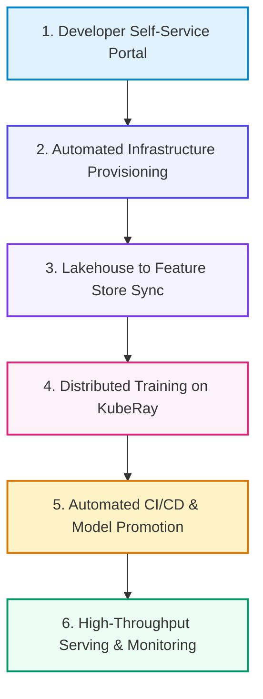

# 📚 DAY 28: PLATFORM ENGINEERING & END-TO-END AI INFRASTRUCTURE CAPSTONE
> **Khóa học:** COMP2010 - AI in Action (VinUni) | AICB-P2T2 | **Giảng viên:** Nguyễn Hải Dương | Phase 2 - Track 2 - Tuần 6 | **Dung lượng slide gốc:** 38 slides (1.1 MB) | Tinh gọn 40% & Chuẩn NotebookLM

---

## 📌 1. BÀI HỌC HÔM NAY VỀ CÁI GÌ? (THE WHAT & WHY)

*   **Bản chất của Platform Engineering cho Trí tuệ Nhân tạo:** Chuyển đổi từ hạ tầng phân mảnh sang Nền tảng Nhà phát triển Nội bộ (Internal Developer Platform - IDP). Giảm tải nhận thức (Cognitive Load) cho Data Scientists thông qua Cổng tự phục vụ (Self-Service Portals) và Đường dẫn Vàng (Golden Paths).
*   **Kiến trúc Kubernetes-Native AI Stack & Ray on K8s (KubeRay):** Hợp nhất toàn bộ khối lượng công việc trên Kubernetes: KubeRay quản lý các cụm tính toán phân tán linh hoạt, vLLM / Triton phục vụ suy luận độ trễ thấp và Kueue quản lý hàng đợi ưu tiên tài nguyên GPU.
*   **Tích hợp Phân hệ Đầu-cuối (End-to-End Capstone Architecture):** Bản thiết kế kiến trúc hoàn chỉnh kết nối 7 mắt xích: Ingestion CDC -> Data Lakehouse (Iceberg/Delta) -> Feature Store (Feast) -> Distributed Fine-tuning (Ray/PyTorch) -> Model Registry (MLflow) -> Optimized Serving (vLLM) -> Data & LLMOps Observability.
*   **Văn hóa Vận hành, Quản trị và Lộ trình Nâng cấp Nền tảng:** Xác lập các tiêu chuẩn vận hành cấp doanh nghiệp: Bảo mật Zero-Trust, Tối ưu hóa chi phí FinOps, Hàng rào an toàn Guardrails và kế hoạch hiện đại hóa liên tục trước sự phát triển vũ bão của AI.

---

## 💡 2. ẨN DỤ ĐỜI THƯỜNG: THỰC TRẠNG & GIẢI PHÁP

### 🔴 Thực trạng:
Một Data Scientist mất 4 tuần chỉ để xin cấp quyền tài khoản, cấu hình driver GPU, cài đặt thư viện và thiết lập mạng trước khi có thể bắt đầu viết dòng mã huấn luyện đầu tiên. Chi phí cơ hội bị lãng phí khổng lồ và tinh thần làm việc của đội ngũ bị suy sụp.

### 🚗 Ẩn dụ đời thường — "Sân bay quốc tế 5 sao và dịch vụ cất cánh tự hành cho phi công":
> * **1. Lối đi ưu tiên có làn dẫn đường riêng (Golden Path / IDP):** Phi công không cần tự xây dựng đường băng hay tự đàm phán mua xăng; phi hành đoàn chỉ cần bước vào buồng lái trên 'Làn đường vàng' đạt chuẩn an toàn tuyệt đối.
> * **2. Tháp không lưu điều phối cụm máy bay (Kubernetes & KubeRay):** Tháp kiểm soát không lưu tự động phân bổ đường băng, cấp phép cất cánh cho hàng trăm chuyến bay và tự động giải phóng đường băng ngay khi máy bay rời mặt đất.
> * **3. Băng chuyền hành lý tự động liên hoàn (End-to-End Pipeline):** Hành lý từ quầy làm thủ tục tự động chạy qua máy quét an ninh, trượt qua hầm phân loại và nạp thẳng vào bụng máy bay mà không cần nhân công khuân vác thủ công.
> * **4. Trung tâm bảo trì kỹ thuật toàn sân bay (Observability & Governance):** Hàng nghìn cảm biến liên tục theo dõi áp suất lốp, nhiệt độ động cơ và mức tiêu thụ nhiên liệu của toàn bộ đội bay theo thời gian thực.

### 🟢 Giải pháp kỹ thuật:
Xây dựng Nền tảng Kỹ thuật AI (Internal Developer Platform) hoàn chỉnh trên Kubernetes với KubeRay, cung cấp Golden Paths tự phục vụ giúp triển khai mô hình từ ý tưởng lên Production trong dưới 1 giờ.

---

## 🗺️ 3. SƠ ĐỒ PIPELINE 6 BƯỚC TUẦN TỰ



*   **Bước 1 (1. Developer Self-Service Portal):** Data Scientist chọn mẫu kiến trúc Golden Path trên giao diện Backstage/IDP.
*   **Bước 2 (2. Automated Infrastructure Provisioning):** Terraform & Crossplane tự động cấp phát GPU Cluster, IAM Roles và S3 Buckets.
*   **Bước 3 (3. Lakehouse to Feature Store Sync):** Đồng bộ hóa các đặc trưng từ Apache Iceberg vào Feast Online/Offline stores.
*   **Bước 4 (4. Distributed Training on KubeRay):** Thực thi huấn luyện phân tán đa node qua Ray Train kết hợp TorchSnapshot.
*   **Bước 5 (5. Automated CI/CD & Model Promotion):** GitHub Actions chạy bài test hồi quy và thăng cấp mô hình trong MLflow Registry.
*   **Bước 6 (6. High-Throughput Serving & Monitoring):** vLLM triển khai phục vụ qua Keda Autoscaling và ghi log telemetry vào Langfuse.

---

## 🌐 4. KIẾN THỨC MỞ RỘNG CHUYÊN SÂU (FIRECRAWL RESEARCH)

1.  **Ray Core vs Kubernetes for AI Workloads:** Kubernetes xuất sắc trong việc điều phối các container tĩnh ở cấp độ thô (độ trễ vài giây), trong khi Ray xuất sắc trong việc lập lịch các tác vụ tính toán phân tán động (Dynamic Tasks/Actors) ở cấp độ vi mô (độ trễ mili-giây). Kiến trúc hiện đại kết hợp cả hai thông qua KubeRay Operator.
2.  **Internal Developer Platform (IDP) Architecture via Backstage:** Spotify Backstage đóng vai trò là Cổng thông tin nhà phát triển tập trung (Single Pane of Glass): tích hợp Software Catalog, tài liệu TechDocs tự động, và các Software Templates cho phép tạo mới một dịch vụ AI hoàn chỉnh tuân thủ 100% chuẩn bảo mật của công ty chỉ với 1 cú click chuột.
3.  **The Unified Enterprise AI Architecture Blueprint:** Bản thiết kế hạ tầng AI hợp nhất bao gồm 4 tầng phân lập rõ ràng: (1) Storage & Lakehouse Layer (S3 + Iceberg), (2) Compute & Orchestration Layer (EKS + KubeRay + Slurm), (3) Model Serving & Agent Gateway (vLLM + MCP Host), và (4) Governance & Observability Layer (OpenLineage + Langfuse + Immuta).

---

## 🔑 5. BẢNG TỪ KHÓA CỐT LÕI

| Thuật ngữ | Khái niệm kỹ thuật | Giải thích đời thường |
| :--- | :--- | :--- |
| **Platform Engineering** | Kỷ luật thiết kế và xây dựng các chuỗi công cụ tự phục vụ giúp các đội ngũ phát triển tăng tốc giao hàng. | Đội ngũ xây dựng đường cao tốc và trạm sạc điện cho toàn xã hội lưu thông thuận tiện. |
| **Internal Developer Platform (IDP)** | Nền tảng tự phục vụ nội bộ gom toàn bộ công cụ, hạ tầng và quy trình chuẩn mực vào một giao diện tập trung. | Siêu ứng dụng tích hợp mọi tiện ích cho nhân viên công ty. |
| **Golden Path (Paved Road)** | Đường dẫn vàng: các mẫu kiến trúc và quy trình triển khai được chuẩn hóa sẵn, tối ưu và an toàn nhất. | Đại lộ trải nhựa thẳng tắp có biển chỉ dẫn rõ ràng giúp lái xe an toàn và nhanh nhất. |
| **KubeRay Operator** | Bộ điều khiển Kubernetes quản lý vòng đời của các cụm tính toán phân tán Ray trên nền tảng K8s. | Người quản lý đội xe chuyên nghiệp tự động điều động và thu hồi xe theo yêu cầu. |
| **Cognitive Load** | Gánh nặng nhận thức: khối lượng thông tin và độ phức tạp mà lập trình viên phải xử lý ngoài công việc chuyên môn chính. | Số lượng nút bấm phức tạp trên bảng điều khiển khiến phi công bị phân tâm. |
| **End-to-End AI Stack** | Hệ thống hạ tầng toàn diện kết nối liền mạch từ bước thu thập dữ liệu thô đến phục vụ và giám sát mô hình. | Dây chuyền sản xuất khép kín từ nông trại đến bàn ăn. |

---

## 🎯 6. BỘ CÂU HỎI ÔN THI TRỌNG TÂM (CHUẨN HỌC THUẬT VINUNI)

### 📝 PHẦN A: 4 CÂU TRẮC NGHIỆM ĐƠN (SINGLE-CHOICE)

#### Câu 1: Mục tiêu cốt lõi của việc xây dựng một Nền tảng Kỹ thuật AI (Internal Developer Platform - IDP) trong các tổ chức lớn là gì?
*   A. Bắt buộc tất cả nhân viên phải sử dụng một trình soạn thảo văn bản giống nhau.
*   B. Giảm tải gánh nặng nhận thức (Cognitive Load) cho Data Scientists thông qua các 'Đường dẫn Vàng' (Golden Paths) tự phục vụ, giúp rút ngắn thời gian từ ý tưởng đến triển khai Production từ vài tuần xuống vài giờ.
*   C. Tự động sa thải các lập trình viên làm việc chậm.
*   D. Xóa bỏ hoàn toàn việc sử dụng cơ sở dữ liệu quan hệ SQL.
> **👉 ĐÁP ÁN ĐÚNG: B**  
> **💡 Giải thích chi tiết:** Platform Engineering sinh ra để giải phóng Data Scientists khỏi sự phức tạp của hạ tầng (Kubernetes, mạng, bảo mật, driver GPU). Thông qua IDP và các Golden Paths được dựng sẵn, nhà phát triển chỉ cần tập trung vào thuật toán và mô hình, toàn bộ hạ tầng được cấp phát tự động và an toàn.

---

#### Câu 2: Trong kiến trúc Kubernetes-Native AI, sự kết hợp giữa Kubernetes và Ray (thông qua KubeRay) giải quyết hoàn hảo bài toán nào?
*   A. Kubernetes quản lý việc cấp phát tài nguyên máy chủ và container ở cấp độ thô, trong khi Ray quản lý việc lập lịch và thực thi các tác vụ tính toán phân tán động (Distributed Training/Tuning) với độ trễ mili-giây.
*   B. Tự động chuyển đổi các mô hình AI thành các trò chơi điện tử.
*   C. Thay thế hoàn toàn phần cứng card đồ họa GPU bằng CPU giá rẻ.
*   D. Chỉ dùng để gửi thông báo email khi có lỗi phát sinh.
> **👉 ĐÁP ÁN ĐÚNG: A**  
> **💡 Giải thích chi tiết:** Kubernetes là chuẩn mực công nghiệp để điều phối hạ tầng và vòng đời container (Container Lifecycle), nhưng không tối ưu cho việc lập lịch tính toán phân tán vi mô ở cấp độ Python actors. KubeRay kết hợp hoàn hảo ưu điểm của cả hai: K8s cấp phát tài nguyên cụm và Ray phân bổ khối lượng tính toán siêu tốc.

---

#### Câu 3: Khái niệm 'Golden Path' (Đường dẫn Vàng) trong Platform Engineering mang lại giá trị gì cho doanh nghiệp?
*   A. Một con đường được lát bằng vàng thật trong khuôn viên công ty.
*   B. Một tập hợp các mẫu dự án, công cụ và quy trình triển khai được chuẩn hóa sẵn, tích hợp đầy đủ các tiêu chuẩn bảo mật, CI/CD và giám sát, giúp lập trình viên tạo mới dịch vụ dễ dàng mà không đi chệch hướng.
*   C. Một khóa học đắt tiền dành riêng cho ban giám đốc.
*   D. Tự động tăng lương cho nhân viên đạt thành tích xuất sắc.
> **👉 ĐÁP ÁN ĐÚNG: C**  
> **💡 Giải thích chi tiết:** Golden Path là 'con đường được trải nhựa sẵn' giúp các đội ngũ phát triển di chuyển nhanh nhất mà không phải tự phát minh lại bánh xe. Nó cung cấp các mẫu template đạt chuẩn tốt nhất (Best Practices) về bảo mật, kiến trúc và vận hành của công ty.

---

#### Câu 4: Trong đồ án tổng kết kiến trúc hạ tầng AI đầu-cuối (Capstone Architecture), mắt xích nào đóng vai trò là 'Cầu nối' đảm bảo tính nhất quán giữa dữ liệu phân tích lịch sử và dữ liệu phục vụ thời gian thực?
*   A. Bàn phím không dây của kỹ sư dữ liệu.
*   B. Trình duyệt web Google Chrome.
*   C. Kiến trúc Feature Store (như Feast) kết nối đồng bộ giữa Offline Store (Data Lakehouse) và Online Store (Redis).
*   D. Cáp sạc điện thoại di động.
> **👉 ĐÁP ÁN ĐÚNG: D**  
> **💡 Giải thích chi tiết:** Feature Store đóng vai trò là chiếc cầu nối trung tâm trong kiến trúc AI tổng thể, đảm bảo các đặc trưng được tính toán cho quá trình huấn luyện ngoại tuyến (Offline Training trên Lakehouse) khớp 100% về mặt logic với các đặc trưng phục vụ suy luận trực tuyến (Online Inference trên Redis).

---

#### Câu 5: Một bản thiết kế kiến trúc Nền tảng AI hoàn chỉnh cấp Doanh nghiệp (Enterprise AI Platform) bắt buộc phải tích hợp những phân hệ cốt lõi nào? (Chọn 2 đáp án đúng)
*   A. Tầng Dữ liệu & Lưu trữ (Data Lakehouse, Feature Store, Vector DB) và Tầng Tính toán Huấn luyện Phân tán (Kubernetes + KubeRay).
*   B. Tầng Phục vụ Tối ưu (High-Throughput Model Serving) kết hợp Tầng Giám sát & Quản trị Toàn diện (Data Observability, LLMOps & Guardrails).
*   C. Hệ thống loa phát thanh thông báo giờ ăn trưa cho toàn bộ tòa nhà.
*   D. Bàn chơi bóng bàn giải trí trong phòng máy chủ.
> **👉 ĐÁP ÁN ĐÚNG: A, B**  
> **💡 Giải thích chi tiết & Bẫy logic:** Kiến trúc AI Stack đầu-cuối chuẩn mực bao gồm 4 tầng gắn kết chặt chẽ: Dữ liệu (A), Tính toán & Huấn luyện (A), Phục vụ suy luận thông lượng cao (B) và Giám sát vận hành, an ninh quản trị (B).

---

#### Câu 6: Để đánh giá sự thành công của một dự án xây dựng Nền tảng Kỹ thuật AI (AI Platform Engineering), những chỉ số đo lường (KPIs) nào sau đây là quan trọng nhất? (Chọn 2 đáp án đúng)
*   A. Lead Time for Changes: Thời gian cần thiết để đưa một ý tưởng mô hình mới từ bản thử nghiệm lên môi trường Production.
*   B. Developer Satisfaction & Cognitive Load: Mức độ hài lòng của Data Scientists và mức độ giảm thiểu thời gian phải xử lý các tác vụ hạ tầng ngoài lề.
*   C. Số lượng tách cà phê mà đội ngũ phát triển đã uống trong tháng.
*   D. Số lần thay đổi hình nền máy tính của các kỹ sư.
> **👉 ĐÁP ÁN ĐÚNG: A, B**  
> **💡 Giải thích chi tiết & Bẫy logic:** Hiệu quả của Platform Engineering được đo bằng tốc độ giao hàng (Lead Time giảm từ tuần xuống giờ) (A) và sự hài lòng, năng suất làm việc của nhà phát triển khi gánh nặng nhận thức hạ tầng được giải tỏa (B).

---

---

## 💻 7. CODE THỰC CHIẾN (HANDS-ON PYTHON / INFRASTRUCTURE)

```python
import os
import torch
import torch.distributed as dist

def init_distributed_cluster():
    # 1. Khởi tạo môi trường huấn luyện phân tán PyTorch DDP
    dist.init_process_group(
        backend="nccl", # NCCL tối ưu hóa cho giao tiếp NVLink giữa các GPU NVIDIA
        init_method="env://"
    )
    
    local_rank = int(os.environ["LOCAL_RANK"])
    global_rank = int(os.environ["RANK"])
    world_size = int(os.environ["WORLD_SIZE"])
    
    torch.cuda.set_device(local_rank)
    print(f"[Rank {global_rank}/{world_size}] GPU Initialized on Device cuda:{local_rank}")
    
    # 2. Khởi tạo Tensor dữ liệu trên từng GPU
    tensor_data = torch.ones(1024, 1024, device=f"cuda:{local_rank}") * (global_rank + 1)
    
    # 3. Thực hiện toán tử All-Reduce tính tổng gradient phân tán qua NVLink
    dist.all_reduce(tensor_data, op=dist.ReduceOp.SUM)
    
    if global_rank == 0:
        print("All-Reduce Sync Complete. Value at Rank 0:", tensor_data[0, 0].item())
        
    dist.destroy_process_group()

if __name__ == "__main__":
    if "WORLD_SIZE" in os.environ:
        init_distributed_cluster()
```

---

## ⚠️ 8. BẪY LỖI KỸ THUẬT & CÁCH DEBUG (COMMON PITFALLS & TROUBLESHOOTING)

1.  **🔴 Bẫy Lỗi 1: GPU Starvation do nghẽn cổ chai DataLoader CPU.**
    *   *Nguyên nhân:* Nhân Tensor Cores GPU tính toán siêu tốc nhưng phải chờ CPU giải nén và nạp dữ liệu từ ổ cứng SSD chậm.
    *   *Cách khắc phục:* Đặt `num_workers = 4 * num_gpus`, bật `pin_memory=True` và áp dụng GPUDirect Storage (GDS).
2.  **🔴 Bẫy Lỗi 2: Tràn bộ nhớ VRAM (CUDA Out of Memory) trong pha Inference.**
    *   *Nguyên nhân:* Không giới hạn kích thước KV Cache khi số lượng request đồng thời tăng đột biến.
    *   *Cách khắc phục:* Sử dụng thư viện serving tối ưu như vLLM với PagedAttention để phân bổ động các khối nhớ KV Cache.
3.  **🔴 Bẫy Lỗi 3: Chết tiến trình (Deadlock) trong All-Reduce khi 1 Worker bị chậm.**
    *   *Nguyên nhân:* Một node mạng bị rớt gói tin hoặc lỗi phần cứng khiến toàn bộ cụm GPU đứng chờ vô tận.
    *   *Cách khắc phục:* Thiết lập biến môi trường `TORCH_NCCL_HEARTBEAT_TIMEOUT_SEC=60` và bật cơ chế phục hồi checkpoint tự động.

---

## ⚖️ 9. BẢNG SO SÁNH TRADE-OFFS & ĐIỀU KIỆN ÁP DỤNG

| Giải pháp Phục vụ / Hạ tầng | Thông lượng (Throughput) | Độ trễ (Latency P95) | Chi phí & Độ phức tạp |
| :--- | :--- | :--- | :--- |
| **Native PyTorch Serving** | Thấp (Không có PagedAttention) | Cao khi batch size tăng | Đơn giản, dễ debug cho nghiên cứu |
| **vLLM (PagedAttention + Continuous Batching)** | Cực cao (Gấp 4x-10x PyTorch) | Thấp, ổn định | Tiêu chuẩn vàng cho Production LLM Serving |
| **TensorRT-LLM (Kernel Fusion & FP8)**| Cao nhất trên phần cứng NVIDIA H100 | Siêu thấp | Phức tạp khi build engine, phụ thuộc NVIDIA GPU |
