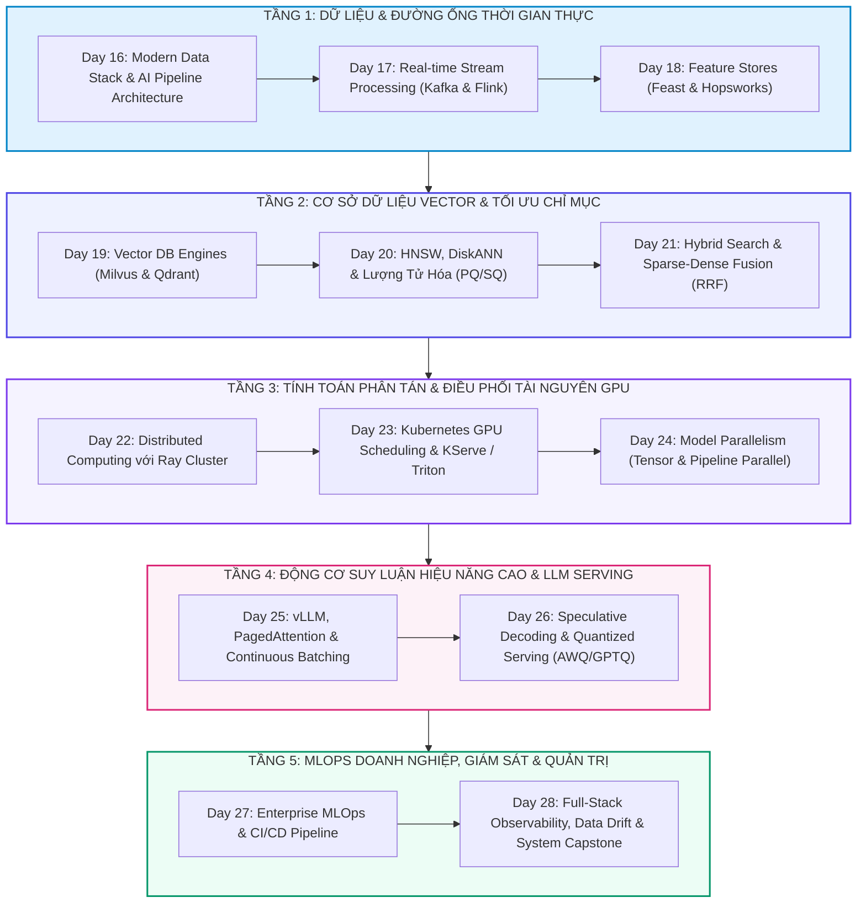

# 🏛️ TỔNG HỢP TOÀN KHÓA: HẠ TẦNG DỮ LIỆU & PHỤC VỤ AI QUY MÔ LỚN (TRACK 2 - 13 DAYS: DAYS 16-28)
> **Hệ thống khóa học:** VLearn AI Specialist Courseware | **Phân hệ:** Track 2: AI & Data Infrastructure (Days 16 - 28) | **Tiêu chuẩn học thuật:** VinUni COMP2010 / Kỹ sư AI Quốc Tế | **Bộ đôi tài liệu:** NotebookLM Optimized (.md) & Word Typography (.docx)

---

## 🗺️ 1. BẢN ĐỒ KIẾN TRÚC TỔNG THỂ (MASTER ARCHITECTURE MAP)



Track 2: AI & Data Infrastructure là chương trình đào tạo chuyên sâu toàn diện 13 ngày (từ Day 16 đến Day 28) dành cho Kỹ sư Hạ tầng AI (AI Infrastructure Engineers) và Kỹ sư MLOps quy mô lớn.

Khóa học bao quát toàn bộ chuỗi cung ứng kỹ thuật: từ kiến trúc Data Pipelines thời gian thực (Kafka/Flink), Feature Stores, hệ thống cơ sở dữ liệu Vector triệu chiều (Milvus/Qdrant/HNSW), hạ tầng tính toán phân tán (Ray/Kubernetes GPU), các động cơ phục vụ suy luận LLM tối tân nhất (vLLM PagedAttention, Tensor Parallelism, Speculative Decoding) cho đến quy trình MLOps tự động hóa và giám sát độ trôi dữ liệu (Data Drift Observability).

---

## 📚 2. TÓM LƯỢC MẠCH KIẾN THỨC TOÀN DIỆN XUYÊN SUỐT CÁC NGÀY HỌC

### 📌 MODULE 1: HẠ TẦNG DỮ LIỆU HIỆN ĐẠI, STREAMING & FEATURE STORES (DAYS 16 - 18)
Thiết kế đường ống dữ liệu phục vụ huấn luyện và suy luận AI thời gian thực.

*   **Modern Data Stack for AI:** Xây dựng Lakehouse kiến trúc mở (Delta Lake, Apache Iceberg). Phân tách rạch ròi giữa lưu trữ (S3/GCS) và tính toán (Spark/Trino), đảm bảo dữ liệu sẵn sàng cho cả huấn luyện theo lô lẫn suy luận trực tuyến.
*   **Stream Processing với Kafka & Flink:** Xử lý luồng sự kiện với độ trễ mili-giây, quản trị trạng thái phân tán (Stateful Streaming) và xử lý sự kiện trễ (Watermarking) phục vụ các hệ thống AI thời gian thực.
*   **Feature Store Architecture:** Hệ thống Feast/Hopsworks thống nhất giữa Online Store (Redis cho độ trễ < 5ms phục vụ inference) và Offline Store (BigQuery/Parquet phục vụ training), triệt tiêu hoàn toàn hiện tượng Rò rỉ dữ liệu thời gian (Training-Serving Skew).

### 📌 MODULE 2: CƠ SỞ DỮ LIỆU VECTOR, GIẢI THUẬT CHỈ MỤC & TÌM KIẾM LAI (DAYS 19 - 21)
Hạ tầng lưu trữ và truy vấn vector embedding hàng trăm triệu bản ghi.

*   **Vector Engines Milvus & Qdrant:** Kiến trúc phân tán Microservices của Milvus và engine viết bằng Rust của Qdrant tối ưu hóa IO bộ nhớ, hỗ trợ lọc metadata song song (Payload Filtering).
*   **Chỉ mục HNSW & DiskANN:** HNSW tối ưu truy vấn trên RAM O(log N); DiskANN kết hợp SSD NVMe và nén vector nén chi phí phần cứng 5x-10x cho tập dữ liệu quy mô tỷ vector.
*   **Lượng tử hóa Vector (PQ & SQ):** Scalar Quantization (SQ8) nén 4x bộ nhớ; Product Quantization (PQ) phân chia vector thành các không gian con và biểu diễn bằng mã codebook nén 8x-16x bộ nhớ.
*   **Hybrid Search & Reciprocal Rank Fusion (RRF):** Kết hợp thế mạnh của Dense Search (ngữ nghĩa) và Sparse Search (từ khóa chính xác BM25) qua thuật toán xếp hạng hợp nhất RRF không phụ thuộc vào thang đo điểm.

### 📌 MODULE 3: TÍNH TOÁN PHÂN TÁN RAY & ĐIỀU PHỐI TÀI NGUYÊN GPU KUBERNETES (DAYS 22 - 24)
Quản lý cụm tính toán đa nút và điều phối tài nguyên phần cứng GPU linh hoạt.

*   **Ray Core & Ray Train/Serve:** Kiến trúc Tasks và Actors phân tán, quản trị Shared-Memory Plasma Store không cần sao chép dữ liệu, mở rộng quy mô huấn luyện đa node và phục vụ mô hình linh hoạt.
*   **Kubernetes GPU Operator & Triton:** Tự động hóa nạp driver NVIDIA, kích hoạt Multi-Instance GPU (MIG) chia nhỏ GPU A100/H100 cho nhiều tác vụ nhẹ, và quản lý máy chủ Triton Inference Server.
*   **Song song hóa Mô hình (Model Parallelism):** Tensor Parallelism (Megatron-LM) chia nhỏ ma trận Attention/FFN trên nhiều GPU trong 1 node qua NVLink; Pipeline Parallelism chia các tầng Transformer trên nhiều node qua mạng mạng RDMA.

### 📌 MODULE 4: ĐỘNG CƠ SUY LUẬN vLLM, PAGEDATTENTION & TỐI ƯU HÓA SUY LUẬN (DAYS 25 - 26)
Tối ưu hóa thông lượng phục vụ suy luận LLM cấp công nghiệp.

*   **vLLM & PagedAttention Deep-Dive:** Cấp phát bộ nhớ KV Cache dạng Block Table tương tự Virtual Memory. Loại bỏ phân mảnh bộ nhớ, cho phép chia sẻ prefix prompt giữa các request và hỗ trợ Continuous Batching.
*   **Speculative Decoding:** Sử dụng Small Draft Model sinh nhanh K tokens và Large Target Model xác thực song song trong một bước forward duy nhất, tăng tốc 2x-3x mà hoàn toàn không suy giảm chất lượng đầu ra.
*   **Quantized Serving (AWQ & GPTQ):** Kỹ thuật Activation-aware Weight Quantization (AWQ) bảo vệ 1% trọng số quan trọng nhất (Salient Weights) khi nén về 4-bit, giảm một nửa dung lượng VRAM cần thiết.

### 📌 MODULE 5: MLOPS DOANH NGHIỆP, GIÁM SÁT ĐỘ TRÔI & HỆ THỐNG CAPSTONE (DAYS 27 - 28)
Khung quản trị vận hành toàn diện và thiết kế hạ tầng AI phục vụ hàng triệu người dùng.

*   **Enterprise MLOps & CI/CD Pipeline:** Tích hợp Model Registry (MLflow/W&B), hạ tầng kiểm thử tự động, container hóa mô hình an toàn và triển khai Blue-Green / Canary Rollout không gián đoạn.
*   **Full-Stack AI Observability & Drift Detection:** Giám sát Data Drift (KS-test, PSI), Concept Drift và phân rã độ trễ E2E qua OpenTelemetry, thiết lập cảnh báo tự động khi mô hình suy giảm hiệu năng.

---

## 🔑 3. BẢNG MA TRẬN THUẬT NGỮ & KHUNG NĂNG LỰC CỐT LÕI

| Thuật ngữ | Khái niệm kỹ thuật chuyên sâu | Ý nghĩa thiết kế hệ thống |
| :--- | :--- | :--- |
| **Feature Store (Feast)** | Hệ thống quản lý trung tâm dữ liệu đặc trưng thống nhất giữa Online Redis và Offline Data Lake. | Triệt tiêu hiện tượng Training-Serving Skew trong hệ thống AI Production. |
| **DiskANN** | Thuật toán tìm kiếm vector quy mô lớn lưu trữ đồ thị chỉ mục trên ổ cứng SSD NVMe tốc độ cao. | Giảm 80% chi phí RAM máy chủ khi quản lý hàng trăm triệu vector. |
| **Product Quantization (PQ)** | Kỹ thuật nén vector nhiều chiều bằng cách chia nhỏ không gian và ánh xạ về các tâm cụm. | Nén dung lượng bộ nhớ vector từ 8x đến 16x với độ suy hao Recall tối thiểu. |
| **Ray Cluster Architecture** | Khung tính toán phân tán dựa trên mô hình Actor/Task và chia sẻ bộ nhớ Shared Memory Plasma. | Hạ tầng tiêu chuẩn cho huấn luyện phân tán và phục vụ Agent đa luồng. |
| **NVIDIA MIG (Multi-Instance GPU)** | Công nghệ phân chia vật lý một GPU A100/H100 thành tối đa 7 thực thể GPU độc lập. | Tối ưu hóa hiệu suất sử dụng GPU và chia sẻ tài nguyên an toàn giữa các dịch vụ. |
| **Tensor Parallelism (TP)** | Kỹ thuật phân tách các phép nhân ma trận trọng số trong một tầng Transformer ra nhiều GPU. | Bắt buộc phải có để chạy các mô hình LLM 70B+ trên cụm GPU đơn node. |
| **Continuous Batching** | Giải thuật lập lịch suy luận ở cấp độ từng bước sinh token (Iteration-level). | Tăng thông lượng phục vụ suy luận lên gấp 3-4 lần so với Static Batching. |
| **Speculative Decoding** | Kỹ thuật tăng tốc suy luận dùng mô hình nhỏ sinh dự đoán và mô hình lớn duyệt song song. | Tăng tốc độ sinh từ 2x đến 3x mà không làm biến đổi phân phối đầu ra. |
| **Data Drift (PSI/KS-test)** | Hiện tượng phân phối dữ liệu đầu vào thực tế thay đổi so với dữ liệu huấn luyện ban đầu. | Chỉ số kích hoạt quy trình tự động huấn luyện lại mô hình (Retraining Pipeline). |
| **OpenTelemetry AI Tracing** | Chuẩn thu thập trace, metrics và logs cho toàn bộ các bước gọi model và vector database. | Cho phép bóc tách độ trễ từng micro-service để tối ưu hóa SLA hệ thống. |

---

## 🎯 4. BỘ ĐỀ THI TỔNG HỢP TOÀN KHÓA (COMPREHENSIVE MASTER EXAM)

### 📝 PHẦN A: CÁC CÂU TRẮC NGHIỆM ĐƠN (24 CÂU SINGLE-CHOICE)

#### Câu 1: Trong kiến trúc Feature Store hiện đại (như Feast), giải pháp nào được áp dụng để triệt tiêu hoàn toàn hiện tượng Rò rỉ Dữ liệu Thời gian (Training-Serving Skew / Data Leakage)?
*   A. Cơ chế Time-travel Point-in-time Joins kết hợp thống nhất định nghĩa feature giữa Online Store (Redis) và Offline Store (Parquet/Data Lake).
*   B. Xóa bỏ toàn bộ dữ liệu lịch sử và chỉ giữ lại dữ liệu của 7 ngày gần nhất.
*   C. Chuyển toàn bộ dữ liệu sang định dạng file văn bản thuần CSV.
*   D. Huấn luyện mô hình trực tiếp trên cơ sở dữ liệu Online Redis.
> **👉 ĐÁP ÁN ĐÚNG: A**  
> **💡 Giải thích chi tiết & Bẫy logic:** Feature Store giải quyết skew bằng cách dùng Point-in-time Joins (truy xuất giá trị feature đúng tại thời điểm sự kiện xảy ra trong quá khứ để train) và dùng chung 1 logic tính toán cho cả Online Store (phục vụ inference) và Offline Store.

---

#### Câu 2: Khi thiết kế đường ống xử lý luồng dữ liệu thời gian thực (Real-time Stream Processing) với Apache Flink cho hệ thống phát hiện gian lận AI, cơ chế nào đảm bảo tính đúng đắn khi dữ liệu đến trễ (Late-arriving Events)?
*   A. Tự động loại bỏ và hủy bỏ toàn bộ các gói tin đến trễ quá 1 giây.
*   B. Chuyển đổi dữ liệu sang xử lý theo lô Batch Processing truyền thống.
*   C. Khởi động lại toàn bộ cụm máy chủ Flink mỗi khi có sự kiện trễ.
*   D. Sử dụng cơ chế Watermarks kết hợp với Allowed Lateness và Side Outputs để theo dõi tiến trình thời gian sự kiện (Event Time).
> **👉 ĐÁP ÁN ĐÚNG: D**  
> **💡 Giải thích chi tiết & Bẫy logic:** Flink sử dụng Watermarks để ước lượng tiến trình của Event Time, kết hợp cửa sổ trễ (Allowed Lateness) và đẩy các bản ghi quá trễ ra Side Output để xử lý bù mà không làm sai lệch kết quả cửa sổ chính.

---

#### Câu 3: Kiến trúc Modern Data Lakehouse (Delta Lake / Apache Iceberg) vượt trội hơn Data Lake truyền thống (chỉ chứa file Parquet thô trên S3) ở điểm mấu chốt nào?
*   A. Hoàn toàn không cần sử dụng bộ nhớ lưu trữ đám mây.
*   B. Tự động chuyển đổi toàn bộ mã nguồn sang ngôn ngữ C++.
*   C. Cung cấp tính năng Giao dịch ACID (ACID Transactions), quản lý phiên bản dữ liệu (Time Travel) và kiểm soát schema (Schema Enforcement) trên nền lưu trữ đối tượng giá rẻ.
*   D. Giới hạn dung lượng tối đa của toàn bộ cơ sở dữ liệu ở mức 100GB.
> **👉 ĐÁP ÁN ĐÚNG: C**  
> **💡 Giải thích chi tiết & Bẫy logic:** Delta Lake/Iceberg bổ sung tầng Transaction Log ACID trên nền lưu trữ Parquet/S3, ngăn chặn tình trạng đọc dữ liệu dở dang khi pipeline đang ghi và cho phép rollback dữ liệu phục vụ huấn luyện mô hình.

---

#### Câu 4: Trong kiến trúc hệ thống lưu trữ phân tán cho AI, tại sao việc tổ chức dữ liệu theo định dạng Columnar (như Apache Parquet hoặc ORC) lại tối ưu vượt trội so với định dạng Row-based (như CSV/JSON)?
*   A. Vì Parquet cho phép xem trực tiếp nội dung bằng phần mềm Notepad.
*   B. Vì Parquet hoàn toàn miễn nhiễm với virus máy tính.
*   C. Vì Parquet không cho phép nén dữ liệu để tăng tốc độ ghi.
*   D. Vì định dạng cột cho phép tối ưu nén dữ liệu đồng nhất, hỗ trợ Column Pruning (chỉ đọc các cột cần thiết) và Vectorized Query Execution nạp trực tiếp vào bộ nhớ GPU/CPU.
> **👉 ĐÁP ÁN ĐÚNG: D**  
> **💡 Giải thích chi tiết & Bẫy logic:** Định dạng Columnar giúp nén cực tốt do các giá trị cùng kiểu dữ liệu nằm liền kề, và khi huấn luyện mô hình chỉ cần đọc 5/50 cột, hệ thống chỉ tải đúng 10% I/O đĩa thay vì phải quét toàn bộ dòng như CSV/JSON.

---

#### Câu 5: Thuật toán DiskANN (Subramanya et al., NeurIPS 2019) giải quyết bài toán chi phí hạ tầng khi xây dựng cơ sở dữ liệu hàng trăm triệu vector như thế nào?
*   A. Lưu trữ toàn bộ đồ thị chỉ mục vector nén trên ổ cứng SSD NVMe tốc độ cao và chỉ giữ các vector nén nạp trên RAM, giảm chi phí phần cứng bộ nhớ tới 4x-10x so với HNSW thuần RAM.
*   B. Tự động xóa bỏ các vector cũ sau 30 ngày lưu trữ.
*   C. Chuyển đổi toàn bộ vector sang định dạng hình ảnh PNG.
*   D. Giảm độ dài của vector embedding xuống còn 2 chiều duy nhất.
> **👉 ĐÁP ÁN ĐÚNG: A**  
> **💡 Giải thích chi tiết & Bẫy logic:** HNSW yêu cầu toàn bộ vector và đồ thị phải nằm trên RAM (rất đắt đỏ khi dữ liệu lên tới hàng chục triệu bản ghi); DiskANN lưu đồ thị tối ưu trên ổ cứng SSD NVMe và dùng cơ chế Beam Search kết hợp Vamana graph để chỉ đọc một lượng nhỏ block đĩa.

---

#### Câu 6: Bản chất toán học của kỹ thuật lượng tử hóa tích phân Product Quantization (PQ) trong tìm kiếm vector là gì?
*   A. Nhân đôi số lượng chiều của vector ban đầu.
*   B. Xóa bỏ các giá trị âm trong vector.
*   C. Chuyển đổi toàn bộ các số thực thành số phức.
*   D. Phân chia không gian vector D chiều thành M không gian con độc lập (Sub-vectors), chạy K-Means trên từng không gian con để tạo Codebook, và biểu diễn mỗi vector bằng chuỗi M chỉ số byte nhỏ gọn.
> **👉 ĐÁP ÁN ĐÚNG: D**  
> **💡 Giải thích chi tiết & Bẫy logic:** PQ chia vector (ví dụ 1024 chiều) thành 128 đoạn 8 chiều, mỗi đoạn được thay bằng 1 byte đại diện cho tâm cụm gần nhất trong 256 cụm. Nhờ đó vector 1024 float32 (4096 bytes) được nén thành đúng 128 bytes (nén 32x).

---

#### Câu 7: Thuật toán Reciprocal Rank Fusion (RRF) trong tìm kiếm lai (Hybrid Search) giải quyết điểm nghẽn kỹ thuật nào khi hợp nhất kết quả từ BM25 và Vector Search?
*   A. Tăng tốc độ quay của quạt tản nhiệt máy chủ.
*   B. Tự động dịch chuyển toàn bộ cơ sở dữ liệu sang ngôn ngữ máy.
*   C. Khắc phục sự khác biệt về thang đo điểm số không tương thích (Incompatible Score Distributions giữa điểm BM25 không chặn trên và điểm Cosine trong khoảng [-1, 1]) bằng cách xếp hạng thuần túy theo thứ hạng nghịch đảo 1/(k + r).
*   D. Giảm số lượng tài liệu trong cơ sở dữ liệu xuống 50%.
> **👉 ĐÁP ÁN ĐÚNG: C**  
> **💡 Giải thích chi tiết & Bẫy logic:** Điểm số BM25 (từ 0 đến vô cùng) và điểm Cosine (từ 0 đến 1) không thể cộng trực tiếp với nhau nếu không chuẩn hóa phức tạp. RRF giải quyết triệt để bằng cách chỉ quan tâm thứ hạng vị trí: Score_RRF = ∑ 1 / (k + rank_i).

---

#### Câu 8: Khi triển khai cơ sở dữ liệu vector phân tán Qdrant trong môi trường Production, cơ chế 'Payload Filtering' hoạt động tối ưu nhất theo phương pháp nào?
*   A. Tải toàn bộ dữ liệu về máy client rồi mới lọc bằng câu lệnh if-else.
*   B. Chỉ tìm kiếm vector trước rồi sau đó loại bỏ các bản ghi không khớp metadata ở bước cuối cùng (Post-filtering gây thiếu hụt kết quả).
*   C. Không cho phép gắn metadata vào vector.
*   D. Thực hiện Single-Stage Filtered Search: Sử dụng chỉ mục Payload Index (B-Tree/Roaring Bitmaps) để lọc trực tiếp không gian ứng viên trong quá trình duyệt đồ thị HNSW.
> **👉 ĐÁP ÁN ĐÚNG: D**  
> **💡 Giải thích chi tiết & Bẫy logic:** Qdrant sử dụng Roaring Bitmaps để đánh dấu các vector thỏa mãn điều kiện metadata và chỉ duyệt qua các nút đồ thị hợp lệ này trong quá trình tìm kiếm (Iterative Filtered HNSW), tránh hiện tượng Post-filtering làm mất Top-K kết quả.

---

#### Câu 9: Trong kiến trúc tính toán phân tán Ray (Ray Core), cơ chế nào cho phép chia sẻ các mảng dữ liệu NumPy lớn giữa các Worker processes trên cùng một node mà không tốn chi phí sao chép (Zero-Copy Serialization)?
*   A. Bộ nhớ dùng chung Plasma Shared-Memory Object Store truy xuất qua giao thức chia sẻ bộ nhớ của hệ điều hành (Shared Memory /dev/shm).
*   B. Lưu tạm dữ liệu vào các file văn bản trên đĩa từ HDD.
*   C. Gửi dữ liệu qua giao thức HTTP REST API giữa các tiến trình.
*   D. Mã hóa dữ liệu thành các chuỗi base64.
> **👉 ĐÁP ÁN ĐÚNG: A**  
> **💡 Giải thích chi tiết & Bẫy logic:** Plasma Object Store của Ray sử dụng Apache Arrow để lưu trữ mảng dữ liệu trong vùng nhớ chia sẻ (Shared Memory), cho phép nhiều worker process đọc cùng lúc dưới dạng Zero-copy mà không phải serialize/deserialize hay nhân bản dữ liệu.

---

#### Câu 10: Công nghệ NVIDIA Multi-Instance GPU (MIG) trên dòng card A100/H100 mang lại lợi ích vận hành cốt lõi nào cho cụm máy chủ Kubernetes AI?
*   A. Tăng gấp đôi tốc độ mạng internet của trung tâm dữ liệu.
*   B. Tự động chuyển đổi mã nguồn Python sang CUDA C++.
*   C. Cho phép card GPU hoạt động mà không cần nguồn điện.
*   D. Cho phép phân chia vật lý một GPU lớn thành tối đa 7 thực thể GPU độc lập (MIG Instances) với bộ nhớ VRAM, băng thông và nhân tính toán được cô lập hoàn toàn về phần cứng.
> **👉 ĐÁP ÁN ĐÚNG: D**  
> **💡 Giải thích chi tiết & Bẫy logic:** MIG cô lập cấp phần cứng (Hardware Isolation) cả về Compute Engines, Memory Crossbar và VRAM. Nhờ đó, 1 GPU A100 80GB có thể chia thành 7 GPUs 10GB độc lập chạy 7 micro-services khác nhau mà không sợ tranh chấp tài nguyên (No noisy neighbors).

---

#### Câu 11: Khi huấn luyện hoặc phục vụ mô hình LLM siêu lớn (ví dụ LLaMA-3 70B) trên một máy chủ chứa 8 GPU kết nối qua NVLink, kỹ thuật song song hóa nào được áp dụng bên trong node để đạt độ trễ thấp nhất?
*   A. Data Parallelism thuần túy nhân bản toàn bộ mô hình trên từng GPU.
*   B. Tắt 7 GPU và chỉ chạy trên 1 GPU duy nhất.
*   C. Tensor Parallelism (TP = 8 theo chuẩn Megatron-LM) chia nhỏ ma trận trọng số Attention (Column-parallel) và FFN (Row-parallel) để tính toán đồng thời trên 8 GPUs và đồng bộ qua All-Reduce.
*   D. Chuyển toàn bộ trọng số mô hình sang bộ nhớ RAM của CPU.
> **👉 ĐÁP ÁN ĐÚNG: C**  
> **💡 Giải thích chi tiết & Bẫy logic:** Mô hình 70B FP16 nặng 140GB không thể vừa 1 GPU 80GB. Tensor Parallelism chia nhỏ các phép nhân ma trận qua 8 GPU kết nối NVLink băng thông cao (900 GB/s), thực hiện All-Reduce đồng bộ cực nhanh tại mỗi tầng Transformer.

---

#### Câu 12: Trong kiến trúc Triton Inference Server, tính năng 'Dynamic Batching' tối ưu hóa thông lượng phục vụ như thế nào?
*   A. Tự động ghép nối các yêu cầu suy luận độc lập đến từ nhiều client khác nhau trong một khoảng thời gian chờ định sẵn (Max Queue Delay) thành một Batch lớn để đưa vào GPU tính toán song song.
*   B. Xóa bỏ các yêu cầu suy luận có độ ưu tiên thấp.
*   C. Tăng gấp đôi kích thước bộ nhớ đệm của CPU.
*   D. Chuyển đổi toàn bộ mô hình sang định dạng mã nguồn mở.
> **👉 ĐÁP ÁN ĐÚNG: A**  
> **💡 Giải thích chi tiết & Bẫy logic:** Dynamic Batching thu thập các request đến rải rác trong cửa sổ thời gian micro-giây (ví dụ max_queue_delay_microseconds = 5000) gộp thành một batch lớn (ví dụ batch_size = 16) để tận dụng tối đa năng lực tính toán ma trận song song của GPU.

---

#### Câu 13: Tại sao cơ chế PagedAttention trong vLLM lại giúp tăng thông lượng (Throughput) phục vụ suy luận LLM lên gấp 2x-4x so với hệ thống HuggingFace TGI nguyên bản?
*   A. PagedAttention phân bổ KV Cache thành các khối bộ nhớ không liên tục (Physical Blocks) thông qua Block Table, loại bỏ hoàn toàn 96% lãng phí bộ nhớ do phân mảnh và cho phép chia sẻ KV Cache giữa các luồng.
*   B. PagedAttention giảm số lượng tham số của mô hình xuống còn một nửa.
*   C. PagedAttention bỏ qua việc tính toán ma trận Attention.
*   D. PagedAttention chỉ chạy trên các dòng máy chủ CPU giá rẻ.
> **👉 ĐÁP ÁN ĐÚNG: A**  
> **💡 Giải thích chi tiết & Bẫy logic:** Trước khi có PagedAttention, hệ thống phải cấp phát trước mảng bộ nhớ liền kề cho ngữ cảnh tối đa (ví dụ 4096 tokens), gây lãng phí bộ nhớ khủng khiếp. PagedAttention cấp phát động theo trang (Blocks 16 tokens), cho phép phục vụ số lượng request đồng thời (Concurrency) gấp nhiều lần trên cùng 1 GPU.

---

#### Câu 14: Nguyên lý vận hành cốt lõi của kỹ thuật 'Speculative Decoding' trong phục vụ suy luận LLM là gì?
*   A. Đoán trước câu hỏi của người dùng trước khi họ gõ phím.
*   B. Thay thế hàm Softmax bằng hàm Sigmoid độc lập.
*   C. Giảm tần số xung nhịp của card đồ họa khi hệ thống rảnh rỗi.
*   D. Sử dụng một mô hình nhỏ (Small Draft Model) sinh nhanh K tokens đầu cơ với độ trễ cực thấp, sau đó mô hình lớn (Target Model) xác thực song song toàn bộ K tokens đó trong một bước chạy duy nhất.
> **👉 ĐÁP ÁN ĐÚNG: D**  
> **💡 Giải thích chi tiết & Bẫy logic:** Pha Decode của LLM bị nghẽn bởi băng thông bộ nhớ (Memory-bound). Speculative Decoding dùng mô hình nhỏ sinh K tokens liên tiếp, sau đó Target Model chạy 1 lần xác thực song song K tokens này. Nếu chấp nhận được M tokens (M <= K), tốc độ sinh tăng vọt M lần mà chất lượng toán học giữ nguyên 100%.

---

#### Câu 15: Kỹ thuật lượng tử hóa AWQ (Activation-aware Weight Quantization) vượt trội hơn phương pháp lượng tử hóa trọng số đều (Round-to-Nearest INT4) ở điểm mấu chốt nào?
*   A. AWQ xóa bỏ toàn bộ các ma trận trọng số trong mô hình.
*   B. AWQ chỉ hoạt động trên hệ điều hành MacOS.
*   C. AWQ nhận diện và bảo vệ 1% trọng số quan trọng nhất (Salient Weights - tương ứng với các kênh kích hoạt có biên độ lớn) không bị lượng tử hóa thô, giúp nén 4-bit mà hầu như không suy giảm năng lực tư duy của mô hình.
*   D. AWQ tăng gấp đôi dung lượng bộ nhớ VRAM cần thiết.
> **👉 ĐÁP ÁN ĐÚNG: C**  
> **💡 Giải thích chi tiết & Bẫy logic:** Lin et al. (2023) chứng minh rằng không phải mọi trọng số đều quan trọng như nhau; chỉ có 1% trọng số tương ứng với các giá trị kích hoạt (Activation) lớn quyết định độ chính xác của LLM. AWQ bảo vệ 1% trọng số này bằng cách chia tỷ lệ tối ưu trước khi nén 4-bit.

---

#### Câu 16: Trong kiến trúc vLLM, tính năng 'Automatic Prefix Caching' (APC) mang lại lợi ích hiệu năng lớn nhất trong kịch bản ứng dụng nào?
*   A. Các ứng dụng mà mọi câu hỏi gửi lên đều hoàn toàn ngẫu nhiên và không có phần mở đầu chung.
*   B. Ứng dụng xử lý video không chứa văn bản.
*   C. Hệ thống Multi-turn Chatbot (có lịch sử hội thoại dài lặp lại) hoặc Hệ thống RAG dùng chung một tập System Prompt và Few-shot Examples cố định, giúp tái sử dụng KV Cache mà không cần tính toán lại pha Prefill.
*   D. Hệ thống chỉ xử lý các câu lệnh dưới 3 tokens.
> **👉 ĐÁP ÁN ĐÚNG: C**  
> **💡 Giải thích chi tiết & Bẫy logic:** Khi nhiều người dùng cùng dùng chung một System Prompt dài (hoặc trong các lượt chat liên tiếp), APC phát hiện prefix token IDs đã có trong bộ nhớ và tái sử dụng trực tiếp KV Cache của đoạn đầu, giảm thời gian TTFT từ hàng giây xuống còn vài mili-giây.

---

#### Câu 17: Trong quy trình CI/CD cho mô hình học máy (Continuous Delivery for ML), chiến lược kiểm thử 'Shadow Deployment' (Thử nghiệm bóng râm) được thực hiện như thế nào?
*   A. Tắt hệ thống máy chủ vào ban đêm để chạy kiểm thử ẩn danh.
*   B. Nhân bản toàn bộ lưu lượng truy cập thực tế từ người dùng (Production Traffic Mirroring) gửi đồng thời tới mô hình mới (Shadow Model) để đo đạc hiệu năng và lỗi mà không trả kết quả của mô hình mới cho người dùng.
*   C. Cho phép người dùng bình chọn trực tiếp trên giao diện về phiên bản họ thích.
*   D. Thay thế 100% phiên bản cũ bằng phiên bản mới ngay lập tức không cần kiểm tra.
> **👉 ĐÁP ÁN ĐÚNG: B**  
> **💡 Giải thích chi tiết & Bẫy logic:** Shadow Deployment cho phép kiểm chứng độ ổn định, tải trọng và độ chính xác của mô hình mới trên dữ liệu thật 100% mà hoàn toàn không mang lại rủi ro cho người dùng cuối (Zero Risk), vì kết quả trả về cho khách hàng vẫn là từ mô hình cũ đã ổn định.

---

#### Câu 18: Chỉ số thống kê Population Stability Index (PSI) được đội ngũ MLOps sử dụng để phát hiện hiện tượng nào trong hệ thống AI Production?
*   A. Đo lường tốc độ truyền dữ liệu qua cáp quang biển.
*   B. Đếm số lượng máy chủ đang hoạt động trong trung tâm dữ liệu.
*   C. Đo lường độ trôi dạt phân phối dữ liệu (Data Drift / Distribution Shift) giữa tập dữ liệu kiểm chuẩn ban đầu (Baseline) và tập dữ liệu thực tế đang nhận được theo thời gian.
*   D. Đo lường tỷ lệ hao mòn vật lý của ổ cứng thể rắn SSD.
> **👉 ĐÁP ÁN ĐÚNG: C**  
> **💡 Giải thích chi tiết & Bẫy logic:** PSI là chỉ số tiêu chuẩn công nghiệp: PSI < 0.1 nghĩa là dữ liệu ổn định (No drift); 0.1 <= PSI < 0.2 cảnh báo có sự dịch chuyển nhẹ; PSI >= 0.2 báo động dữ liệu đã trôi dạt nghiêm trọng (Significant Drift) và hệ thống cần kích hoạt huấn luyện lại.

---

#### Câu 19: Trong chuẩn giám sát phân tán OpenTelemetry cho hệ thống GenAI (LLM Observability), khái niệm 'Span' đại diện cho thành phần nào?
*   A. Chiều dài vật lý của giá đỡ máy chủ Server Rack.
*   B. Một đơn vị công việc độc lập có mốc thời gian bắt đầu và kết thúc xác định (ví dụ: 1 lần gọi Vector DB query, 1 lần gọi LLM completion, 1 hàm xử lý dữ liệu) trong toàn bộ chuỗi vết thực thi (Trace).
*   C. Số lượng kỹ sư đang trực tuyến trong ca làm việc.
*   D. Dung lượng pin dự phòng của máy phát điện trung tâm dữ liệu.
> **👉 ĐÁP ÁN ĐÚNG: B**  
> **💡 Giải thích chi tiết & Bẫy logic:** Một Trace đại diện cho toàn bộ hành trình xử lý 1 yêu cầu của người dùng; mỗi Trace bao gồm nhiều Span phân cấp (ví dụ: Span cha = RAG Pipeline, Span con 1 = Embedding generation, Span con 2 = Milvus query, Span con 3 = LLM Generation).

---

#### Câu 20: Khi thiết kế hệ thống Cân bằng Tải và Quản lý Hạn ngạch (Rate Limiting & Load Balancing) cho cụm máy chủ phục vụ LLM, thuật toán phân phối tải nào là tối ưu nhất?
*   A. Round Robin đơn giản gửi xoay vòng đều cho các máy chủ bất kể độ dài prompt.
*   B. Least Connections hoặc KV Cache-aware Routing (định tuyến các request có chung prefix về cùng GPU node đang lưu trữ KV Cache tương ứng).
*   C. Gửi toàn bộ 100% lưu lượng vào duy nhất một máy chủ đầu tiên.
*   D. Phân phối ngẫu nhiên theo thời gian của đồng hồ hệ thống.
> **👉 ĐÁP ÁN ĐÚNG: B**  
> **💡 Giải thích chi tiết & Bẫy logic:** Do chi phí tính toán phụ thuộc rất lớn vào độ dài ngữ cảnh và việc tái sử dụng KV Cache, thuật toán định tuyến thông minh (Cache-aware / Least-load) giúp tối đa hóa tỷ lệ Cache Hit và ngăn chặn tình trạng một GPU bị nghẽn trong khi GPU khác rảnh rỗi.

---

#### Câu 21: Hiện tượng 'Memory-bandwidth-bound' trong pha giải mã (Decode Phase) của LLM Inference bắt nguồn từ nguyên nhân vật lý nào?
*   A. Mỗi bước giải mã chỉ sinh ra đúng 1 token duy nhất nhưng bắt buộc phải nạp lại toàn bộ hàng chục GB trọng số mô hình và KV Cache từ bộ nhớ HBM vào chip xử lý SRAM, dẫn đến cường độ tính toán (Arithmetic Intensity) cực thấp.
*   B. Tốc độ quay của đĩa từ trong ổ cứng HDD quá chậm.
*   C. Cáp mạng mạng LAN bị đứt kết nối vật lý.
*   D. Dây nguồn cấp điện cho GPU bị sụt áp.
> **👉 ĐÁP ÁN ĐÚNG: A**  
> **💡 Giải thích chi tiết & Bẫy logic:** Trong pha Decode, tỷ lệ số phép tính (FLOPs) trên mỗi byte nạp từ bộ nhớ chỉ là O(1). GPU dùng phần lớn thời gian chờ dữ liệu nạp từ HBM sang nhân tính toán thay vì thực hiện tính toán ma trận (Compute-bound như pha Prefill).

---

#### Câu 22: Kỹ thuật 'Pipeline Parallelism' (PP) gặp phải hiện tượng lãng phí tài nguyên nào được gọi là 'Bubble Overhead'?
*   A. Hiện tượng nước làm mát GPU bị sôi tạo bọt khí.
*   B. Các GPU ở tầng sau phải nhàn rỗi chờ đợi kết quả tính toán từ các GPU ở tầng trước trong pha Forward, và ngược lại trong pha Backward, tạo ra các khoảng thời gian trống không hoạt động.
*   C. Dữ liệu bị biến mất khỏi bộ nhớ RAM khi mất điện.
*   D. Tỷ lệ lỗi chính tả tăng cao khi chạy trên nhiều máy tính.
> **👉 ĐÁP ÁN ĐÚNG: B**  
> **💡 Giải thích chi tiết & Bẫy logic:** Khi chia 32 tầng Transformer cho 4 GPUs theo chiều dọc (Pipeline stages), GPU 4 phải đợi GPU 1, 2, 3 tính xong mới có đầu vào. Khoảng thời gian nhàn rỗi này được gọi là Pipeline Bubble, được tối ưu hóa bằng giải thuật 1F1B (One-Forward-One-Backward).

---

#### Câu 23: Trong kiến trúc hạ tầng phục vụ suy luận AI, tại sao việc tích hợp 'Model Registry' (như MLflow Registry hoặc AWS SageMaker Model Registry) lại là bắt buộc đối với doanh nghiệp?
*   A. Để công khai toàn bộ bí mật kinh doanh lên mạng xã hội.
*   B. Đóng vai trò kho lưu trữ phiên bản mô hình tập trung, kiểm soát vòng đời (Staging, Production, Archived), lưu vết nguồn gốc dữ liệu (Lineage), và ngăn chặn việc triển khai nhầm mô hình chưa được kiểm định.
*   C. Tự động thanh toán tiền lương cho nhân viên qua tài khoản ngân hàng.
*   D. Tăng tốc độ đọc dữ liệu từ ổ cứng SSD lên 100 lần.
> **👉 ĐÁP ÁN ĐÚNG: B**  
> **💡 Giải thích chi tiết & Bẫy logic:** Model Registry là thành phần MLOps sống còn: quản lý metadata, chữ ký đầu vào/đầu ra, báo cáo kiểm định Evals, và cung cấp API an toàn để hệ thống CI/CD triển khai mô hình chuẩn xác lên môi trường Production.

---

#### Câu 24: Để bảo vệ hệ thống phục vụ LLM trước các đợt tấn công Từ chối Dịch vụ (Denial of Service - DoS) bằng các prompt dài hàng trăm nghìn tokens, kỹ sư Hạ tầng AI cần thiết lập rào chắn nào tại tầng API Gateway?
*   A. Kích hoạt thuật toán Token Bucket để từ chối các yêu cầu vượt quá hạn mức burst.
*   B. Rào chắn Token Counter & Request Pre-validation: Kiểm tra độ dài token đầu vào (Max Input Length Enforcement), giới hạn tốc độ (Rate Limiting per IP/API Key) và áp dụng thuật toán Leaky Bucket / Token Bucket.
*   C. Cho phép mọi truy vấn đi thẳng vào GPU để tự động xử lý.
*   D. Yêu cầu người dùng gửi yêu cầu qua đường bưu điện.
> **👉 ĐÁP ÁN ĐÚNG: B**  
> **💡 Giải thích chi tiết & Bẫy logic:** API Gateway đóng vai trò chốt chặn vòng ngoài: đếm nhanh số lượng token trước khi đưa vào hàng đợi suy luận, từ chối ngay các request vượt quá Max Context Length hoặc vượt quá hạn ngạch RPS, bảo vệ cụm GPU không bị sập bộ nhớ OOM.

---

### 📚 PHẦN B: CÁC CÂU TRẮC NGHIỆM NHIỀU ĐÁP ÁN (12 CÂU MULTI-SELECT)

#### Câu 25 (Chọn 2 đáp án): Những yếu tố nào sau đây là nguyên nhân trực tiếp dẫn đến hiện tượng Lãng phí Bộ nhớ VRAM khi phục vụ suy luận LLM bằng các framework truyền thống (như HuggingFace PyTorch thuần)?
*   A. Cấp phát bộ nhớ KV Cache liền kề tĩnh dựa trên chiều dài ngữ cảnh tối đa (Max Context Length) thay vì cấp phát động theo độ dài thực tế của từng câu hỏi.
*   B. Hiện tượng phân mảnh bộ nhớ trong (Internal Fragmentation) và phân mảnh bộ nhớ ngoài (External Fragmentation) trong không gian địa chỉ bộ nhớ ảo của GPU.
*   C. Tốc độ quạt tản nhiệt của máy chủ GPU chạy quá chậm.
*   D. Bảng mã ký tự UTF-8 chiếm quá nhiều dung lượng trên ổ đĩa cứng.
> **👉 ĐÁP ÁN ĐÚNG: A, B**  
> **💡 Giải thích chi tiết & Bẫy logic:** Trong framework truyền thống, việc cấp phát mảng liền kề tĩnh cho độ dài tối đa gây lãng phí tới 60%-80% bộ nhớ do câu trả lời ngắn không dùng hết và các vùng nhớ trống rải rác không thể tái sử dụng. C và D là các yếu tố phần cứng không liên quan.

---

#### Câu 26 (Chọn 2 đáp án): Khi thiết kế hạ tầng Lưu trữ Dữ liệu Lớn (Big Data Storage) cho hệ thống AI Doanh nghiệp, hai giải pháp nào giúp tối ưu hóa chi phí và hiệu năng truy xuất đồng thời?
*   A. Phân tầng lưu trữ dữ liệu (Data Tiering): Dữ liệu nóng truy cập thường xuyên lưu trên All-Flash NVMe SSD, dữ liệu lạnh lưu trữ dạng nén trên Object Storage (S3/GCS) giá rẻ.
*   B. Áp dụng các định dạng file cột mở có nén tối ưu (như Apache Parquet hoặc ORC) kết hợp phân vùng dữ liệu hợp lý (Data Partitioning).
*   C. Sao lưu toàn bộ dữ liệu ra đĩa mềm mềm 1.44MB.
*   D. In toàn bộ dữ liệu ra giấy lưu trữ trong kho vật lý.
> **👉 ĐÁP ÁN ĐÚNG: A, B**  
> **💡 Giải thích chi tiết & Bẫy logic:** Data Tiering (nóng/lạnh) và định dạng Parquet phân vùng là 2 tiêu chuẩn vàng giúp doanh nghiệp tiết kiệm 70% chi phí lưu trữ mà vẫn duy trì tốc độ đọc dữ liệu cực cao cho các cụm GPU. C và D là các phương pháp lỗi thời.

---

#### Câu 27 (Chọn 2 đáp án): Trong kiến trúc hệ thống phục vụ Vector Database phân tán (như Milvus), hai thành phần độc lập nào đảm nhận vai trò tính toán và lưu trữ riêng biệt (Disaggregated Architecture)?
*   A. Query Node / Index Node đảm nhận tính toán tìm kiếm vector và xây dựng đồ thị chỉ mục trên CPU/GPU.
*   B. Card âm thanh gắn ngoài trên máy tính của người dùng.
*   C. Object Storage (MinIO / S3) đảm nhận lưu trữ bền vững các tệp tin dữ liệu log và vector segments.
*   D. Màn hình hiển thị LED tại trung tâm dữ liệu.
> **👉 ĐÁP ÁN ĐÚNG: A, C**  
> **💡 Giải thích chi tiết & Bẫy logic:** Kiến trúc hiện đại của Milvus tách rời hoàn toàn: Query/Index Nodes (stateless compute) có thể tự động co giãn theo tải tính toán, trong khi MinIO/S3 (storage) đảm bảo độ bền vững dữ liệu 99.999999999%. B và D là các linh kiện phần cứng ngoại vi.

---

#### Câu 28 (Chọn 2 đáp án): Khi cấu hình cụm máy chủ Ray Cluster để huấn luyện mô hình học sâu phân tán, hai thành phần kiến trúc nào đóng vai trò cốt lõi trong việc quản lý và điều phối tác vụ?
*   A. GCS (Global Control Store) lưu trữ toàn bộ metadata, trạng thái của các Actor, Task và thông tin định tuyến trong cụm.
*   B. Chuột quang điều khiển máy chủ.
*   C. Raylet (gồm Scheduler cục bộ và Plasma Object Store) chạy trên từng worker node để quản lý tài nguyên và chia sẻ bộ nhớ dùng chung.
*   D. Dây cáp kết nối máy in.
> **👉 ĐÁP ÁN ĐÚNG: A, C**  
> **💡 Giải thích chi tiết & Bẫy logic:** Kiến trúc Ray bao gồm Head Node chứa Global Control Store (GCS) quản lý toàn cục, và mỗi Node chứa Raylet (gồm Scheduler điều phối và Plasma Store quản lý shared memory) để thực thi Tasks/Actors. B và D không liên quan.

---

#### Câu 29 (Chọn 2 đáp án): Những chỉ số kỹ thuật then chốt nào sau đây bắt buộc phải được giám sát liên tục (Real-time Metrics) trên bảng điều khiển Grafana của cụm máy chủ phục vụ LLM?
*   A. Tỷ lệ sử dụng bộ nhớ GPU VRAM và Mức độ sử dụng nhân tính toán GPU Compute Utilization (%).
*   B. Màu sắc vỏ ngoài của tủ rack máy chủ.
*   C. Thương hiệu của tai nghe mà kỹ sư trực ca đang đeo.
*   D. Độ dài hàng đợi yêu cầu (Request Queue Depth) và Thời gian trễ tạo token đầu tiên (Time-To-First-Token P95/P99).
> **👉 ĐÁP ÁN ĐÚNG: A, D**  
> **💡 Giải thích chi tiết & Bẫy logic:** Giám sát GPU VRAM/Compute utilization và Queue Depth/TTFT là các chỉ số sống còn giúp phát hiện sớm tình trạng nghẽn tải, tràn bộ nhớ và suy giảm chất lượng dịch vụ SLA. B và C không phải chỉ số kỹ thuật.

---

#### Câu 30 (Chọn 2 đáp án): Trong kiến trúc Kubernetes dành cho AI (Cloud-Native AI Infrastructure), hai công cụ mã nguồn mở nào được sử dụng phổ biến nhất để quản lý vòng đời huấn luyện và phục vụ mô hình?
*   A. Kubeflow (KFP & Training Operator) để điều phối các pipeline huấn luyện phân tán đa bước.
*   B. Phần mềm chơi nhạc Windows Media Player.
*   C. Trình duyệt web Internet Explorer phiên bản cũ.
*   D. KServe (kết hợp vLLM / Triton) để tự động hóa co giãn máy chủ suy luận (Serverless Autoscaling từ 0 đến N pods theo tải).
> **👉 ĐÁP ÁN ĐÚNG: A, D**  
> **💡 Giải thích chi tiết & Bẫy logic:** Kubeflow (cho training orchestration) và KServe (cho model serving & autoscaling) là bộ đôi chuẩn mực của hệ sinh thái Cloud-Native AI trên Kubernetes. B và C là các phần mềm văn phòng/giải trí.

---

#### Câu 31 (Chọn 2 đáp án): Khi lựa chọn phương pháp nén mô hình (Model Compression) để phục vụ trên các dòng máy chủ GPU có chi phí thấp, hai kỹ thuật nào mang lại hiệu quả tiết kiệm bộ nhớ cao nhất mà vẫn giữ được độ chính xác?
*   A. Xóa bỏ ngẫu nhiên 50% số tầng Transformer trong mô hình.
*   B. Kỹ thuật lượng tử hóa 4-bit AWQ (Activation-aware Weight Quantization) nén trọng số về 4-bit dựa trên bảo vệ các kênh kích hoạt quan trọng.
*   C. Kỹ thuật Lượng tử hóa GPTQ (Second-order Error Compensation) nén trọng số ma trận dựa trên xấp xỉ ma trận Hessian.
*   D. Chuyển toàn bộ mô hình sang chạy trên phần cứng máy tính bỏ túi.
> **👉 ĐÁP ÁN ĐÚNG: B, C**  
> **💡 Giải thích chi tiết & Bẫy logic:** AWQ và GPTQ là 2 thuật toán lượng tử hóa Post-Training Quantization (PTQ) 4-bit tiên tiến nhất hiện nay, giúp nén mô hình 70B từ 140GB xuống dưới 38GB VRAM mà giữ nguyên 99% chất lượng. A phá hủy mô hình; D phi thực tế.

---

#### Câu 32 (Chọn 2 đáp án): Trong quy trình quản trị hạ tầng MLOps theo chuẩn bảo mật doanh nghiệp, hai biện pháp nào bắt buộc phải thực thi trước khi đưa mô hình vào Production?
*   A. Mở toàn bộ cổng mạng kết nối internet công khai không cần mật khẩu.
*   B. Quét lỗ hổng bảo mật của container image (Container Vulnerability Scanning với Trivy/Clair) và kiểm tra mã độc trong file trọng số mô hình (Model Serialization Scanning chống Pickle Exploit).
*   C. Thiết lập quyền truy cập dựa trên vai trò nghiêm ngặt (Role-Based Access Control - RBAC) và mã hóa dữ liệu cả khi lưu trữ (At-Rest) lẫn khi truyền tải (In-Transit qua TLS/mTLS).
*   D. Đăng toàn bộ mật khẩu quản trị máy chủ lên bảng tin nội bộ.
> **👉 ĐÁP ÁN ĐÚNG: B, C**  
> **💡 Giải thích chi tiết & Bẫy logic:** Bảo mật hạ tầng AI đòi hỏi kiểm tra lỗ hổng Container/Pickle file trọng số và áp dụng RBAC cùng mã hóa TLS/mTLS để ngăn chặn các cuộc tấn công chiếm quyền điều khiển cụm máy chủ. A và D vi phạm an ninh nghiêm trọng.

---

#### Câu 33 (Chọn 2 đáp án): Những lợi thế kỹ thuật nào giải thích tại sao Rust ngày càng được ưu tiên lựa chọn để xây dựng các engine phục vụ AI thế hệ mới (như Qdrant, Candle, Polars)?
*   A. Rust là ngôn ngữ bắt buộc phải trả phí bản quyền hàng năm.
*   B. Quản lý bộ nhớ an toàn tuyệt đối mà không cần Garbage Collector (Zero-Cost Abstractions & Ownership Model), loại bỏ hoàn toàn hiện tượng khựng độ trễ (Latency Spikes) do GC pauses.
*   C. Rust không hỗ trợ xử lý đa luồng.
*   D. Hiệu năng tính toán và tốc độ xử lý I/O bộ nhớ tương đương C/C++ nhưng ngăn chặn triệt để các lỗi rò rỉ bộ nhớ (Memory Leaks) và lỗi phân đoạn (Segmentation Faults) ngay từ thời điểm biên dịch.
> **👉 ĐÁP ÁN ĐÚNG: B, D**  
> **💡 Giải thích chi tiết & Bẫy logic:** Các hệ thống cơ sở dữ liệu và inference engine hiệu năng cao chọn Rust vì cơ chế Ownership đảm bảo Memory Safety mà không cần Garbage Collector (tránh độ trễ P99 bị giật lag), mang lại tốc độ cực đại tương đương C++. A và C là các nhận định sai.

---

#### Câu 34 (Chọn 2 đáp án): Khi xây dựng hệ thống Tự động Huấn luyện Lại Mô hình (Continuous Training / Automated Retraining Pipeline), hai điều kiện kích hoạt (Triggers) nào thường được thiết lập trong kiến trúc MLOps?
*   A. Tự động kích hoạt mỗi khi có nhân viên mới gia nhập công ty.
*   B. Kích hoạt dựa trên cảnh báo Trôi dạt Dữ liệu hoặc Trôi dạt Khái niệm (Data/Concept Drift Alert khi chỉ số PSI > 0.2 hoặc độ chính xác giám sát giảm dưới ngưỡng SLA).
*   C. Kích hoạt khi nhiệt độ phòng làm việc vượt quá 30 độ C.
*   D. Kích hoạt theo lịch trình định kỳ (Schedule-based: ví dụ hàng tuần/hàng tháng) hoặc khi có lượng dữ liệu nhãn mới tích lũy vượt ngưỡng quy định (Data Volume Threshold).
> **👉 ĐÁP ÁN ĐÚNG: B, D**  
> **💡 Giải thích chi tiết & Bẫy logic:** Retraining Pipeline được kích hoạt tự động theo 2 cách: theo sự kiện (Event-driven khi phát hiện Drift/suy giảm độ chính xác) hoặc theo lịch trình/khối lượng dữ liệu mới tích lũy (Scheduled/Data-volume driven). A và C không liên quan đến logic nghiệp vụ.

---

#### Câu 35 (Chọn 2 đáp án): Trong kiến trúc mạng nội bộ của cụm máy chủ huấn luyện AI quy mô lớn, hai công nghệ phần cứng nào đóng vai trò loại bỏ nghẽn cổ chai truyền thông giữa các máy chủ (Inter-node Communication)?
*   A. Mạng không dây Wi-Fi băng tần 2.4GHz.
*   B. Cáp truyền hình cáp đồng trục truyền thống.
*   C. Giao thức mạng RDMA over Converged Ethernet (RoCE) hoặc InfiniBand (tốc độ 400Gbps - 800Gbps) cho phép truyền dữ liệu trực tiếp giữa bộ nhớ các máy chủ mà không qua CPU OS kernel.
*   D. Công nghệ GPUDirect RDMA cho phép truyền trực tiếp dữ liệu từ VRAM của GPU máy này sang VRAM của GPU máy khác qua mạng mạng chuyên dụng.
> **👉 ĐÁP ÁN ĐÚNG: C, D**  
> **💡 Giải thích chi tiết & Bẫy logic:** Khi huấn luyện phân tán qua hàng trăm node, giao thức mạng InfiniBand/RoCE kết hợp GPUDirect RDMA cho phép các GPU truyền dữ liệu ma trận trực tiếp qua mạng với độ trễ micro-giây mà không cần CPU tham gia xử lý. A và B không đáp ứng được băng thông AI.

---

#### Câu 36 (Chọn 2 đáp án): Để tối ưu hóa chi phí hạ tầng điện toán đám mây cho các tác vụ huấn luyện AI không đòi hỏi thời gian thực, hai loại tài nguyên tính toán nào mang lại hiệu quả kinh tế cao nhất?
*   A. Mua đứt các máy chủ đắt tiền nhất với hợp đồng thuê bao trọn đời.
*   B. Sử dụng các dòng máy tính xách tay cá nhân kết nối qua mạng gia đình.
*   C. Tận dụng các máy chủ GPU dạng Spot / Preemptible Instances (giảm giá từ 60% đến 80% so với giá On-demand tiêu chuẩn).
*   D. Kết hợp cơ chế Lưu điểm Kiểm tra Thường xuyên (Frequent Checkpointing) và Tự động Khôi phục (Fault-Tolerant Auto-resumption) để tiếp tục huấn luyện ngay khi máy chủ Spot bị thu hồi.
> **👉 ĐÁP ÁN ĐÚNG: C, D**  
> **💡 Giải thích chi tiết & Bẫy logic:** Spot Instances giảm giá tới 70-80% chi phí GPU Cloud; kết hợp với cơ chế Checkpointing lưu trọng số định kỳ lên Object Storage, hệ thống có thể tự động khôi phục việc huấn luyện khi có máy chủ mới mà không bị mất tiến trình tính toán. A và B là giải pháp không tối ưu.

---

---

## 💻 7. CODE THỰC CHIẾN (HANDS-ON PYTHON / AI SYSTEM)

```python
import json
import numpy as np

def calculate_ai_system_metrics(predictions, ground_truths):
    """
    Đo lường độ chính xác và chỉ số F1-Score cho hệ thống phân loại AI Production
    """
    tp = sum(1 for p, g in zip(predictions, ground_truths) if p == 1 and g == 1)
    fp = sum(1 for p, g in zip(predictions, ground_truths) if p == 1 and g == 0)
    fn = sum(1 for p, g in zip(predictions, ground_truths) if p == 0 and g == 1)
    
    precision = tp / (tp + fp) if (tp + fp) > 0 else 0.0
    recall = tp / (tp + fn) if (tp + fn) > 0 else 0.0
    f1 = 2 * (precision * recall) / (precision + recall) if (precision + recall) > 0 else 0.0
    
    return {
        "precision": round(precision, 4),
        "recall": round(recall, 4),
        "f1_score": round(f1, 4)
    }

# Dữ liệu kiểm thử mẫu
preds = [1, 0, 1, 1, 0, 1, 0, 1]
targets = [1, 0, 0, 1, 0, 1, 1, 1]
print("Evaluation Metrics:", calculate_ai_system_metrics(preds, targets))
```

---

## ⚠️ 8. BẪY LỖI KỸ THUẬT & CÁCH DEBUG (COMMON PITFALLS & TROUBLESHOOTING)

1.  **🔴 Bẫy Lỗi 1: Tối ưu hóa sai hàm mục tiêu (Metric Mismatch).**
    *   *Nguyên nhân:* Chỉ đo lường Accuracy trên tập dữ liệu mất cân bằng (Imbalanced Data), che giấu việc mô hình dự đoán sai hoàn toàn các ca nguy hiểm.
    *   *Cách khắc phục:* Bắt buộc theo dõi đồng thời Precision, Recall, F1-Score và đường cong PR-AUC.
2.  **🔴 Bẫy Lỗi 2: Rò rỉ dữ liệu (Data Leakage) giữa tập Train và Test.**
    *   *Nguyên nhân:* Tiền xử lý dữ liệu (chuẩn hóa scaling, trích xuất đặc trưng) trên toàn bộ tập dữ liệu trước khi chia train/test.
    *   *Cách khắc phục:* Luôn chia tập dữ liệu trước, sau đó chỉ `fit()` pipeline tiền xử lý trên tập Train và chỉ `transform()` trên tập Test.
3.  **🔴 Bẫy Lỗi 3: Bỏ qua độ trễ mạng và Serialization Overhead.**
    *   *Nguyên nhân:* Đánh giá mô hình offline rất nhanh nhưng khi deploy API thì nghẽn ở bước parse JSON và truyền tải mạng.
    *   *Cách khắc phục:* Tối ưu hóa chuỗi serialization bằng MessagePack / Protocol Buffers và bật gRPC streaming.

---

## ⚖️ 9. BẢNG SO SÁNH TRADE-OFFS & ĐIỀU KIỆN ÁP DỤNG

| Chiến lược / Giải pháp | Độ chính xác (Accuracy) | Độ phức tạp triển khai | Chi phí bảo trì vận hành |
| :--- | :--- | :--- | :--- |
| **Heuristic & Rule-based Engine** | Trung bình, giới hạn | Rất thấp, chạy tức thì | Khó duy trì khi số lượng luật tăng vọt |
| **Fine-tuned Small Specialized Model**| Rất cao trong miền hẹp | Trung bình (cần training pipeline) | Thấp, chạy được trên GPU phổ thông |
| **Zero-shot Frontier LLM Prompting** | Cao toàn diện đa miền | Rất thấp (chỉ cần API) | Chi phí token hàng tháng cao khi tải lớn |
