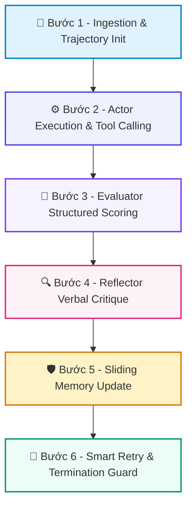

# 📚 DAY 16: KIẾN TRÚC AGENT NÂNG CAO (REFLEXION, REACT & TREE SEARCH)
> **Khóa học:** COMP2010 - AI in Action (VinUni) | Chuyên ngành: AI Applications & Multi-Agent Systems | **Dung lượng slide gốc:** 44 slides (4.09 MB) | Tối ưu: Chuẩn NotebookLM (< 50MB) & Trọng tâm

---

## 📌 1. BÀI HỌC HÔM NAY VỀ CÁI GÌ? (THE WHAT & WHY)

*   **Bản chất của Reflexion Agent:** Khung kiến trúc bổ sung cơ chế Tự đánh giá (Self-Evaluation) và Rút bài học (Verbal Self-Critique) vào vòng lặp Reasoning-Action để tự sửa sai mà không cần cập nhật trọng số mô hình.
*   **Phân tầng công nghệ cốt lõi:** Từ ReAct (Reasoning + Acting tuần tự một chiều) -> Reflexion (Thêm Evaluator + Reflector và bộ nhớ phản tư Reflection Memory) -> LATS (Language Agent Tree Search duyệt cây quyết định MCTS kết hợp Value Function và Backtracking).
*   **Giá trị thực tiễn & Lợi thế Production:** Khắc phục 3 tử huyệt kinh điển của ReAct: Lỗi lan tỏa (Cascading error), Vòng lặp vô tận (Infinite loop do tool trả về noise), và Không thể quay lui (Inability to backtrack). Tăng độ chính xác bài toán lập trình HumanEval từ 67% lên 91% và multi-hop QA từ 35.1% lên 54.3%.

---

## 💡 2. ẨN DỤ ĐỜI THƯỜNG: THỰC TRẠNG & GIẢI PHÁP

### 🔴 Thực trạng:
ReAct giống như một sinh viên chỉ làm bài thi đúng một lần rồi nộp ngay lập tức. Nếu đọc sai đề bài hoặc tính nhầm ở bước 1, toàn bộ các bước sau đều sai theo và không hề có cơ hội nhận ra sai lầm để sửa chữa.

### 🚗 Ẩn dụ đời thường — "Kiến Trúc Agent Nâng Cao (Reflexion, ReAct & Tree Search)":
> * **1. Thí sinh làm bài (Actor): ** Giải toán và ghi lại toàn bộ các bước lập luận vào giấy nháp.
> * **2. Tự chấm điểm (Evaluator): ** Đối chiếu kết quả sơ bộ với điều kiện đề bài xem đã thỏa mãn hết ràng buộc chưa.
> * **3. Rút kinh nghiệm (Reflector): ** Phát hiện bước 2 nhầm dấu, tự ghi chú vào lề: 'Lần sau phải đổi dấu khi chuyển vế'.
> * **4. Làm lại bài (Retry with Memory): ** Làm lại bài thi với chiến lược mới, mang theo dòng ghi chú rút kinh nghiệm để không phạm lại lỗi cũ.

### 🟢 Giải pháp kỹ thuật:
*   Reflexion thiết lập bộ ba tác tử: Actor (sinh hành động) -> Evaluator (chấm điểm theo rubric/evidence gap) -> Reflector (sinh phản tư ngôn ngữ) -> Lưu vào Reflection Memory và thử lại cho đến khi thành công hoặc đạt giới hạn số lần thử (Max Attempts).

---

## 🗺️ 3. SƠ ĐỒ PIPELINE 6 BƯỚC TUẦN TỰ



*   **Bước 1 - Ingestion & Trajectory Init:** Tiếp nhận tác vụ từ người dùng, khởi tạo Actor State và danh sách lịch sử hành động (trajectory).
*   **Bước 2 - Actor Execution & Tool Calling:** Actor sinh chuỗi suy luận Thought-Action-Observation tương tác với môi trường và công cụ.
*   **Bước 3 - Evaluator Structured Scoring:** Evaluator kiểm tra output dựa trên Pydantic schema: chấm điểm score, chỉ ra missing evidence và spurious claims.
*   **Bước 4 - Reflector Verbal Critique:** Nếu Evaluator đánh giá Fail, Reflector phân tích nguyên nhân gốc rễ và tạo bản ghi nhận định chiến lược tiếp theo.
*   **Bước 5 - Sliding Memory Update:** Ghi phản tư mới vào reflection_memory với cơ chế Sliding Window để chống tràn cửa sổ ngữ cảnh (Context Window).
*   **Bước 6 - Smart Retry & Termination Guard:** Reset chuỗi tin nhắn, tăng attempt_count, tiếp tục vòng lặp mới mang theo kinh nghiệm hoặc dừng khi đạt Max Attempts.

---

## 🌐 4. KIẾN THỨC MỞ RỘNG CHUYÊN SÂU (FIRECRAWL RESEARCH)

1.  **1. Đột phá Benchmark của Reflexion (Shinn et al., 2023):**
    *   Trên bài toán sinh mã HumanEval, Reflexion nâng pass@1 từ 67% (ReAct) lên 91% chỉ sau 3 vòng lặp tự sửa lỗi bằng Text Feedback. Trên HotpotQA multi-hop reasoning, Exact Match (EM) tăng từ 35.1% lên 54.3% nhờ cơ chế phát hiện evidence gap.
2.  **2. Language Agent Tree Search (LATS) & Monte Carlo Tree Search:**
    *   LATS kết hợp khả năng lập luận của LLM với tìm kiếm cây MCTS. Mỗi nút là một trạng thái, LLM đóng vai trò Value Function để ước lượng phần thưởng (Reward) và chính sách mở rộng nhánh, cho phép quay lui (Backtracking) khi gặp nhánh cụt.
3.  **3. Voyager & Kỹ năng Trọn đời (Lifelong Learning Agent):**
    *   Trong môi trường mở Minecraft, Voyager sử dụng cơ chế Reflexion kết hợp với Thư viện Kỹ năng Vector (Skill Library). Khi hoàn thành một nhiệm vụ mới, code tương ứng được index vào vector database để tái sử dụng vĩnh viễn.
4.  **4. Quản trị Bộ nhớ Phản tư trong Production (Sliding Window Memory):**
    *   Lưu toàn bộ phản tư sẽ gây lãng phí token và làm loãng sự chú ý (Attention Dilution). Thực tế production áp dụng Sliding Window (giữ 2-3 phản tư gần nhất) kết hợp Semantic Deduplication để duy trì hiệu năng cao nhất.

---

## 🔑 5. BẢNG TỪ KHÓA CỐT LÕI

| Thuật ngữ | Khái niệm kỹ thuật | Giải thích đời thường |
| :--- | :--- | :--- |
| **Reflexion Agent** | Kiến trúc tác tử tự đánh giá và phản tư bằng ngôn ngữ tự nhiên để sửa lỗi vòng lặp. | Học sinh tự chấm bài thi và rút kinh nghiệm trước khi nộp. |
| **Actor-Evaluator-Reflector** | Bộ ba vai trò: Actor thực thi, Evaluator chấm điểm, Reflector đúc kết bài học. | Người làm, Giám sát viên kiểm tra và Chuyên gia tư vấn chiến lược. |
| **Trajectory Memory** | Lịch sử toàn bộ các bước suy luận, gọi tool và phản hồi của môi trường. | Nhật ký hành trình ghi lại từng ngã rẽ đã đi qua. |
| **Verbal Critique** | Nhận xét bằng ngôn ngữ tự nhiên về nguyên nhân thất bại và đề xuất hướng giải quyết. | Lời phê chi tiết của giáo viên chỉ rõ chỗ sai cần sửa. |
| **Sliding Context Window** | Cơ chế trượt chỉ giữ lại các phản tư có giá trị gần nhất để tối ưu chi phí token. | Cuốn sổ tay chỉ lưu 3 bài học đắt giá nhất để tránh quá tải. |
| **LATS (Tree Search)** | Tìm kiếm trên cây ngôn ngữ kết hợp đánh giá giá trị nút và quay lui khi gặp lỗi. | Người chơi cờ tướng tính trước 3 nước đi và sẵn sàng đi lại nếu sai. |

---

## 🎯 6. BỘ CÂU HỎI ÔN THI TRỌNG TÂM (CHUẨN HỌC THUẬT & ĐẠI HỌC)

### 📝 PHẦN A: 4 CÂU TRẮC NGHIỆM ĐƠN (SINGLE-CHOICE)

#### Câu 1: Nguyên nhân cốt lõi khiến kiến trúc ReAct thất bại trong các bài toán suy luận đa bước phức tạp (Multi-hop Reasoning) là gì?
*   A. ReAct thiếu cơ chế tự đánh giá và không có tín hiệu quay lui (backtracking) khi một bước trung gian bị sai.
*   B. Mô hình ngôn ngữ không hỗ trợ cơ chế Attention.
*   C. Tokenizer cắt từ không đồng đều làm mất ngữ cảnh.
*   D. Tốc độ thực thi của Tool bị trễ quá 2 giây.
> **👉 ĐÁP ÁN ĐÚNG: A**  
> **💡 Giải thích chi tiết:** ReAct hoạt động tuyến tính theo chuỗi Thought-Action-Observation. Khi bước đầu tiên đưa ra kết quả sai, lỗi sẽ lan tỏa (Cascading error) sang toàn bộ các bước sau mà không có cơ chế dừng lại hoặc quay lui để sửa chữa.

---

#### Câu 2: Trong kiến trúc Reflexion (Shinn et al., 2023), phản hồi sửa sai được truyền tải dưới hình thức nào?
*   A. Vector Gradient cập nhật trực tiếp vào trọng số mạng nơ-ron.
*   B. Tín hiệu phạt nhị phân 0/1 qua thuật toán Q-learning cổ điển.
*   C. Bản nhận xét ngôn ngữ tự nhiên (Verbal Critique / Text Feedback) được nạp vào bộ nhớ ngữ cảnh của lần thử kế tiếp.
*   D. File cấu hình YAML ghi đè vào hệ thống.
> **👉 ĐÁP ÁN ĐÚNG: C**  
> **💡 Giải thích chi tiết:** Reflexion sử dụng Verbal Critique bằng văn bản tự nhiên do thành phần Reflector sinh ra, sau đó đưa vào bộ nhớ phản tư để Actor đọc và điều chỉnh chiến lược ở vòng lặp sau mà không cần fine-tune mô hình.

---

#### Câu 3: Để tránh hiện tượng vòng lặp vô tận (Infinite Loop) trong Reflexion khi Agent liên tục thất bại, giải pháp kỹ thuật bắt buộc là gì?
*   A. Tăng nhiệt độ Temperature lên 1.5 để sinh chuỗi ngẫu nhiên.
*   B. Thiết lập điều kiện dừng nghiêm ngặt kết hợp Max Attempts và cờ success trong State Schema.
*   C. Xóa toàn bộ lịch sử trò chuyện và dừng chương trình ngay lần lỗi đầu tiên.
*   D. Chuyển sang mô hình có kích thước nhỏ hơn.
> **👉 ĐÁP ÁN ĐÚNG: B**  
> **💡 Giải thích chi tiết:** State schema của Reflexion trong LangGraph bắt buộc phải kiểm tra điều kiện dừng: success = True HOẶC attempt_count >= max_attempts để ngắt đồ thị một cách an toàn.

---

#### Câu 4: Điểm khác biệt mấu chốt giữa Reflexion và Language Agent Tree Search (LATS) là gì?
*   A. Reflexion chỉ chạy trên CPU còn LATS bắt buộc phải có GPU H100.
*   B. Reflexion không sử dụng LLM để sinh hành động.
*   C. LATS không cho phép gọi công cụ ngoài (External Tools).
*   D. Reflexion tối ưu tuần tự qua các lần thử (Iterative Trials), trong khi LATS xây dựng cây quyết định đa nhánh và hỗ trợ quay lui (Backtracking) thông qua MCTS.
> **👉 ĐÁP ÁN ĐÚNG: D**  
> **💡 Giải thích chi tiết:** Reflexion tối ưu hóa tuyến tính qua từng chu kỳ thử lại độc lập, trong khi LATS khám phá không gian trạng thái theo cấu trúc cây, đánh giá giá trị từng nút và cho phép quay lui về nhánh trước đó nếu nhánh hiện tại đi vào ngõ cụt.

---

### 📚 PHẦN B: 2 CÂU TRẮC NGHIỆM NHIỀU ĐÁP ÁN (MULTI-SELECT)

#### Câu 5 (Chọn 2 đáp án): Những failure modes nào là nguyên nhân trực tiếp dẫn đến sự đổ vỡ của hệ thống ReAct truyền thống?
*   [X] A. Lỗi lan tỏa (Cascading Error): Sai sót ở bước đầu dẫn đến toàn bộ chuỗi suy luận sau bị sai lệch.
*   [ ] B. Dung lượng ổ cứng SSD bị phân mảnh khi ghi log.
*   [X] C. Vòng lặp vô tận (Infinite Loop): Tool trả về kết quả nhiễu khiến agent liên tục lặp lại cùng một hành động.
*   [ ] D. Sử dụng chuẩn mã hóa ký tự UTF-8.
> **👉 ĐÁP ÁN ĐÚNG: A, C**  
> **💡 Giải thích chi tiết & Bẫy logic:** A và C là hai trong ba failure modes kinh điển của ReAct đã được chỉ ra trong nghiên cứu. B và D là các yếu tố phần cứng/định dạng thông thường không liên quan đến logic suy luận của Agent.

---

#### Câu 6 (Chọn 2 đáp án): Khi thiết kế Pydantic Schema cho Evaluator trong Reflexion Agent, những trường dữ liệu nào là tối quan trọng để Reflector hoạt động hiệu quả?
*   [ ] A. Địa chỉ IP của máy chủ API.
*   [X] B. Điểm số định lượng kèm lý do cụ thể (score & reason).
*   [ ] C. Tên hệ điều hành của máy khách.
*   [X] D. Danh sách bằng chứng còn thiếu (missing_evidence) hoặc khẳng định sai lệch (spurious_claims).
> **👉 ĐÁP ÁN ĐÚNG: B, D**  
> **💡 Giải thích chi tiết & Bẫy logic:** Để Reflector có thể tạo ra bản phản tư mang tính hành động (Actionable Reflection), Evaluator phải cung cấp lý do rõ ràng cùng khoảng trống bằng chứng (missing evidence) thay vì chỉ đưa ra điểm số chung chung.

---

---

## 💻 7. CODE THỰC CHIẾN (HANDS-ON PYTHON / LANGGRAPH)

```python
from typing import TypedDict, Annotated, List
import operator
from langgraph.graph import StateGraph, END

# 1. Định nghĩa Agent State Schema với Reducer
class AgentState(TypedDict):
    messages: Annotated[List[str], operator.add]
    attempt_count: int
    is_success: bool

# 2. Định nghĩa các Node xử lý trong đồ thị
def actor_node(state: AgentState):
    current_attempt = state.get("attempt_count", 0) + 1
    new_message = f"Actor generated plan attempt #{current_attempt}"
    return {"messages": [new_message], "attempt_count": current_attempt}

def evaluator_node(state: AgentState):
    # Logic tự chấm điểm và đánh giá
    success = state["attempt_count"] >= 2 # Giả lập thành công ở vòng 2
    return {"is_success": success}

# 3. Hàm phân nhánh có điều kiện (Conditional Routing)
def check_completion(state: AgentState):
    if state["is_success"]:
        return "end"
    if state["attempt_count"] >= 3:
        return "end"
    return "retry"

# 4. Xây dựng đồ thị trạng thái
workflow = StateGraph(AgentState)
workflow.add_node("actor", actor_node)
workflow.add_node("evaluator", evaluator_node)
workflow.set_entry_point("actor")
workflow.add_edge("actor", "evaluator")
workflow.add_conditional_edges("evaluator", check_completion, {
    "end": END,
    "retry": "actor"
})

app = workflow.compile()
final_state = app.invoke({"messages": ["Task Ref: 2A202605721_BaoHoang_K4"], "attempt_count": 0, "is_success": False})
print("Final Trajectory:", final_state["messages"])
```

---

## ⚠️ 8. BẪY LỖI KỸ THUẬT & CÁCH DEBUG (COMMON PITFALLS & TROUBLESHOOTING)

1.  **🔴 Bẫy Lỗi 1: Vòng lặp vô tận (Infinite Loop) do thiếu Guardrail dừng.**
    *   *Nguyên nhân:* Tác tử liên tục gọi lại cùng một công cụ với tham số lỗi mà không có giới hạn số lần thử.
    *   *Cách khắc phục:* Luôn cài đặt `max_iterations` cứng (ví dụ max = 5) và cơ chế Circuit Breaker trong Graph State.
2.  **🔴 Bẫy Lỗi 2: Tràn cửa sổ ngữ cảnh (Context Bloat) khi tích lũy Trajectory.**
    *   *Nguyên nhân:* Toàn bộ log gọi tool thô được nối dồn vào prompt khiến token bùng nổ và mô hình bị suy giảm chú ý.
    *   *Cách khắc phục:* Sử dụng cơ chế Sliding Window Memory chỉ giữ 3-5 bước gần nhất kết hợp tóm tắt tự động (Summary Reducer).
3.  **🔴 Bẫy Lỗi 3: Tác tử bị mắc kẹt vào các giả định sai lầm (Cascading Hallucination).**
    *   *Nguyên nhân:* ReAct truyền thống không có bước Reflector để phủ định kết luận trung gian sai lầm.
    *   *Cách khắc phục:* Nâng cấp lên kiến trúc Reflexion hoặc LATS với Evaluator độc lập kiểm định chứng cứ.

---

## ⚖️ 9. BẢNG SO SÁNH TRADE-OFFS & ĐIỀU KIỆN ÁP DỤNG

| Mô hình Kiến trúc | Ưu điểm cốt lõi | Nhược điểm & Chi phí | Tình huống áp dụng tối ưu |
| :--- | :--- | :--- | :--- |
| **Single-Agent ReAct** | Đơn giản, độ trễ thấp, ít tốn token | Dễ rơi vào lỗi lan tỏa và vòng lặp vô tận | Tác vụ đơn giản 1-2 bước gọi tool API |
| **Reflexion Agent** | Tự sửa lỗi sau thất bại, tăng accuracy 20-30% | Tăng số lần gọi LLM (2x-3x token cost) | Sinh mã nguồn, giải toán, kiểm tra dữ liệu |
| **Hierarchical Multi-Agent (Supervisor)** | Cô lập ngữ cảnh chuyên môn, xử lý bài toán lớn | Phức tạp trong cấu hình, độ trễ cao | Hệ thống doanh nghiệp đa phòng ban, phân tích dữ liệu |
