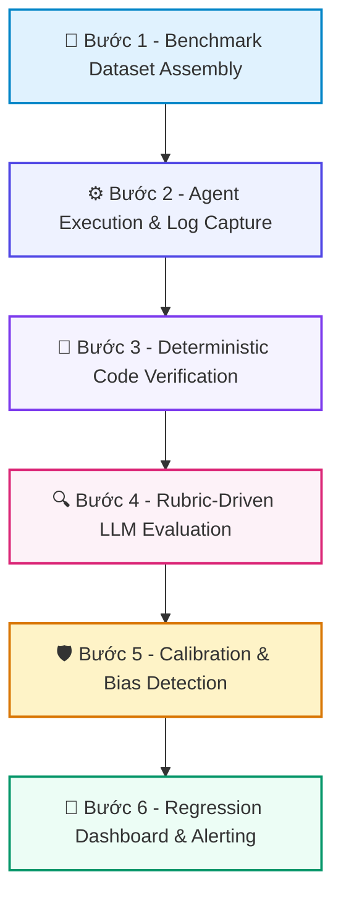

# 📚 DAY 17: PHƯƠNG PHÁP ĐÁNH GIÁ AGENT: CODE-BASED VS LLM-AS-JUDGE & CALIBRATION
> **Khóa học:** COMP2010 - AI in Action (VinUni) | Chuyên ngành: AI Applications & Multi-Agent Systems | **Dung lượng slide gốc:** 27 slides (3.48 MB) | Tối ưu: Chuẩn NotebookLM (< 50MB) & Trọng tâm

---

## 📌 1. BÀI HỌC HÔM NAY VỀ CÁI GÌ? (THE WHAT & WHY)

*   **Bản chất của Đánh giá Agent (Agent Evaluation):** Quá trình đo lường định lượng và định tính năng lực của Agent trên cả hai khía cạnh: Kết quả đầu ra cuối cùng (Outcome-based Eval) và Quá trình suy luận gọi công cụ (Trajectory-based Eval).
*   **Phân tầng công nghệ đánh giá:** Kết hợp ba tầng: 1. Code-based Eval (Deterministic Regex, JSON schema, Execution unit test) -> 2. LLM-as-Judge (Đánh giá ngữ nghĩa, tính hữu ích qua Rubric định lượng) -> 3. Human-in-the-loop Calibration (Hiệu chỉnh sai lệch của LLM Judge qua Cohen Kappa).
*   **Giá trị thực tiễn & Lợi thế Production:** Ngăn chặn hiện tượng Silent Degradation (chất lượng giảm mà không có log lỗi). Tiết kiệm 80% chi phí gán nhãn thủ công đồng thời duy trì độ tương quan cao (Pearson r > 0.85) với chuyên gia con người.

---

## 💡 2. ẨN DỤ ĐỜI THƯỜNG: THỰC TRẠNG & GIẢI PHÁP

### 🔴 Thực trạng:
Thuê một nhân viên bán hàng nhưng chỉ nhìn vào số lượng email gửi đi mỗi ngày thay vì kiểm tra xem khách hàng có mua hàng hay nhân viên có nói sai chính sách công ty hay không.

### 🚗 Ẩn dụ đời thường — "Phương Pháp Đánh Giá Agent: Code-Based vs LLM-as-Judge & Calibration":
> * **1. Chấm điểm trắc nghiệm tự động (Code-based): ** Dùng máy quét đáp án A, B, C hoặc kiểm tra xem mã Python có chạy ra đúng kết quả 42 hay không. Nhanh, rẻ, chính xác tuyệt đối nhưng không đo được tính sáng tạo.
> * **2. Giáo viên chấm bài tự luận (LLM-as-Judge): ** Nhờ một trợ giảng chấm bài luận dựa trên thang điểm (Rubric) chi tiết từ 1 đến 5 sao.
> * **3. Thầy giáo chấm phúc khảo (Human Calibration): ** Giáo sư chấm lại 10 bài ngẫu nhiên để xem trợ giảng có chấm quá nương tay (Positivity bias) hay thích bài viết dài (Verbosity bias) không.

### 🟢 Giải pháp kỹ thuật:
*   Thiết lập hệ thống đánh giá lai (Hybrid Evaluation): 80% kiểm thử cơ bản chạy bằng Code-based; 20% bài toán phức tạp chạy bằng LLM-as-Judge đã qua hiệu chỉnh (Calibrated LLM Judge).

---

## 🗺️ 3. SƠ ĐỒ PIPELINE 6 BƯỚC TUẦN TỰ



*   **Bước 1 - Benchmark Dataset Assembly:** Xây dựng tập dữ liệu kiểm thử vàng (Golden Dataset) gồm câu hỏi, ngữ cảnh, công cụ giả lập và câu trả lời mẫu.
*   **Bước 2 - Agent Execution & Log Capture:** Chạy Agent trên toàn bộ benchmark, ghi lại toàn bộ trajectory: thought, tool calls, arguments và final output.
*   **Bước 3 - Deterministic Code Verification:** Chạy các bộ kiểm tra code-based: kiểm tra JSON schema hợp lệ, Regex pattern, mã lỗi API và unit tests.
*   **Bước 4 - Rubric-Driven LLM Evaluation:** Gửi Trajectory và Output tới mô hình LLM Judge kèm theo Bảng tiêu chí chấm điểm (Evaluation Rubric) nghiêm ngặt.
*   **Bước 5 - Calibration & Bias Detection:** Đo lường độ lệch (Position Bias, Verbosity Bias, Self-enhancement) và tính chỉ số thỏa thuận Cohen Kappa với con người.
*   **Bước 6 - Regression Dashboard & Alerting:** Xuất báo cáo tổng hợp tỷ lệ Pass Rate, Latency P95, Token Cost và kích hoạt cảnh báo nếu điểm số giảm > 5%.

---

## 🌐 4. KIẾN THỨC MỞ RỘNG CHUYÊN SÂU (FIRECRAWL RESEARCH)

1.  **1. Nghiên cứu Pombal et al. (2026) về LLM Judge Calibration:**
    *   Nghiên cứu chỉ ra LLM Judge không được hiệu chỉnh có xu hướng ưu ái câu trả lời dài (Verbosity Bias) tăng 28% và tự chấm điểm cao cho mô hình cùng họ (Self-enhancement Bias). Cần áp dụng hoán đổi vị trí (Position Swapping) để triệt tiêu bias.
2.  **2. Trajectory Evaluation vs Outcome Evaluation:**
    *   Đánh giá kết quả cuối cùng là không đủ. Trajectory Evaluation đo lường độ chính xác của từng bước gọi tool (Tool Calling Precision), phát hiện hành vi gọi tool thừa thãi (Redundant Calls) làm tăng chi phí và độ trễ.
3.  **3. Frameworks Đánh giá Phổ biến (DeepEval, Ragas, Phoenix):**
    *   DeepEval và Phoenix Arize cung cấp hệ thống đo lường G-Eval, Ragas tập trung vào Faithfulness và Answer Relevance, cho phép tích hợp CI/CD pipeline để chặn code lỗi trước khi merge vào main.
4.  **4. Kinh tế học trong Đánh giá (Cost-Effective Evaluation):**
    *   Chi phí chạy GPT-4o làm Judge cho 10.000 test case rất đắt. Giải pháp: Sử dụng mô hình nhỏ được fine-tune chuyên biệt (SLM Judge như Prometheus 2 hoặc Llama-3-8B-Judge) giúp giảm 95% chi phí mà độ chính xác tương đương 92%.

---

## 🔑 5. BẢNG TỪ KHÓA CỐT LÕI

| Thuật ngữ | Khái niệm kỹ thuật | Giải thích đời thường |
| :--- | :--- | :--- |
| **LLM-as-Judge** | Sử dụng mô hình ngôn ngữ lớn đóng vai trò giám khảo chấm điểm chất lượng của mô hình khác. | Trợ giảng chấm bài thi tự luận dựa trên barem điểm. |
| **Evaluation Rubric** | Bảng tiêu chí và thang điểm chi tiết hướng dẫn giám khảo cách cho điểm từ 1 đến 5. | Barem chấm thi chi tiết từng ý nhỏ. |
| **Code-based Eval** | Kiểm thử tự động dựa trên mã nguồn (assert, regex, JSON schema) cho kết quả nhị phân 0/1. | Máy chấm thi trắc nghiệm tự động bằng đầu đọc quang học. |
| **Verbosity Bias** | Xu hướng thiên vị của LLM Judge khi cho điểm cao hơn đối với các câu trả lời dài dòng. | Giám khảo chấm điểm cao vì thấy thí sinh viết kín 4 mặt giấy thi. |
| **Trajectory-based Eval** | Đánh giá toàn bộ chuỗi suy luận và gọi công cụ trung gian của Agent. | Chấm điểm từng bước giải toán trong bài thi tự luận thay vì chỉ nhìn đáp số. |
| **Cohen Kappa** | Chỉ số thống kê đo lường mức độ đồng thuận giữa hai giám khảo (LLM Judge và Con người). | Đo mức độ ăn ý và đồng nhất giữa hai thầy giáo cùng chấm một bài thi. |

---

## 🎯 6. BỘ CÂU HỎI ÔN THI TRỌNG TÂM (CHUẨN HỌC THUẬT & ĐẠI HỌC)

### 📝 PHẦN A: 4 CÂU TRẮC NGHIỆM ĐƠN (SINGLE-CHOICE)

#### Câu 1: Theo nguyên tắc phân tầng đánh giá, loại tiêu chí nào NÊN ĐƯỢC ưu tiên kiểm tra bằng Code-based Eval thay vì LLM-as-Judge?
*   A. Tính hài hước và cảm xúc trong bài viết.
*   B. Sự đồng cảm của nhân viên tư vấn khách hàng.
*   C. Định dạng cấu trúc đầu ra (JSON/XML Schema hợp lệ) và tính đúng đắn của mã thực thi (Unit tests pass).
*   D. Khả năng thuyết phục của một bài văn tranh biện.
> **👉 ĐÁP ÁN ĐÚNG: C**  
> **💡 Giải thích chi tiết:** Code-based Eval hoàn hảo cho các tiêu chí có tính tất định (Deterministic) như schema, syntax, mã thực thi vì chi phí cực rẻ (0 USD) và độ chính xác 100%, không bị ảo giác.

---

#### Câu 2: Khái niệm 'Referent' trong kiểm thử hệ thống AI được hiểu chính xác là gì?
*   A. Tiêu chuẩn tham chiếu hoặc căn cứ thực tế (Ground Truth / Reference standard) dùng để đối chiếu và đánh giá độ chính xác của câu trả lời sinh ra.
*   B. Tên của máy chủ lưu trữ mô hình AI.
*   C. Mã định danh của người dùng cuối.
*   D. Tốc độ kết nối mạng Internet.
> **👉 ĐÁP ÁN ĐÚNG: A**  
> **💡 Giải thích chi tiết:** Trong lý thuyết đo lường AI, Referent là căn cứ chân lý (như tài liệu gốc, câu trả lời chuẩn của chuyên gia) mà hệ thống đánh giá dùng để so sánh với output của mô hình.

---

#### Câu 3: Nghiên cứu của Pombal et al. (2026) chỉ ra điều gì khi sử dụng LLM Judge chưa qua hiệu chỉnh (Uncalibrated LLM Judge)?
*   A. LLM Judge luôn chấm điểm thấp hơn con người trong mọi trường hợp.
*   B. LLM Judge không thể đọc được tiếng Anh.
*   C. LLM Judge luôn trả về kết quả 0 điểm.
*   D. LLM Judge dễ mắc phải các thiên vị hệ thống như Verbosity Bias (chuộng câu trả lời dài) và Positivity Bias (chấm điểm quá rộng lượng).
> **👉 ĐÁP ÁN ĐÚNG: D**  
> **💡 Giải thích chi tiết:** Các mô hình LLM khi làm giám khảo thường có xu hướng chấm điểm cao cho văn bản dài dòng, hoa mỹ hoặc thiên vị mô hình của cùng công ty phát triển nếu không được hiệu chỉnh cẩn thận.

---

#### Câu 4: Khi hiệu chỉnh (Calibration) một LLM Judge, tại sao cần áp dụng kỹ thuật 'Position Swapping' (Hoán đổi vị trí A/B)?
*   A. Để giảm nhiệt độ CPU khi xử lý.
*   B. Để triệt tiêu Position Bias (thiên vị vị trí), vì LLM Judge thường có xu hướng ưu ái lựa chọn phương án xuất hiện đầu tiên hoặc cuối cùng trong prompt.
*   C. Để tăng số lượng token được sinh ra.
*   D. Để đổi ngôn ngữ từ tiếng Anh sang tiếng Việt.
> **👉 ĐÁP ÁN ĐÚNG: B**  
> **💡 Giải thích chi tiết:** Position Bias là hiện tượng LLM Judge ưu ái Option 1 hơn Option 2. Kỹ thuật đảo vị trí và lấy trung bình kết quả giúp loại bỏ hoàn toàn thiên vị vị trí.

---

### 📚 PHẦN B: 2 CÂU TRẮC NGHIỆM NHIỀU ĐÁP ÁN (MULTI-SELECT)

#### Câu 5 (Chọn 2 đáp án): Những thực hành nào sau đây là BEST PRACTICES khi thiết kế Prompt cho LLM-as-Judge?
*   [ ] A. Chỉ đưa ra một câu lệnh ngắn: 'Hãy chấm điểm câu trả lời này từ 1 đến 10'.
*   [X] B. Cung cấp Rubric chi tiết với tiêu chí rõ ràng cho từng mức điểm (ví dụ: Điểm 1 là gì, Điểm 5 là gì).
*   [X] C. Yêu cầu mô hình đưa ra lập luận giải thích (Reasoning/Chain-of-Thought) trước khi xuất ra điểm số cuối cùng.
*   [ ] D. Thiết lập Temperature = 1.8 để tăng tính bất ngờ và ngẫu nhiên khi chấm điểm.
> **👉 ĐÁP ÁN ĐÚNG: B, C**  
> **💡 Giải thích chi tiết & Bẫy logic:** B và C là hai nguyên tắc cốt lõi: Rubric rõ ràng giúp chuẩn hóa barem, và Chain-of-Thought buộc mô hình phân tích bằng chứng trước khi kết luận điểm, giúp tăng độ tin cậy đáng kể.

---

#### Câu 6 (Chọn 2 đáp án): Khi kết quả chạy Eval Suite cho thấy Pass Rate của Agent giảm đột ngột từ 92% xuống 68%, những bước điều tra ban đầu nào là HỢP LÝ NHẤT?
*   [X] A. Kiểm tra phân tích Trajectory Logs xem có sự cố công cụ trả về lỗi (Tool error) hoặc thay đổi định dạng schema hay không.
*   [ ] B. Xóa bỏ toàn bộ bộ dữ liệu kiểm thử vàng (Golden Dataset) để không còn báo lỗi.
*   [ ] C. Tắt toàn bộ hệ thống đánh giá tự động trong môi trường production.
*   [X] D. Phân loại lỗi theo nhóm (Error Taxonomy): Lỗi do lập luận (Reasoning), lỗi do gọi tool (Tool Calling), hay lỗi do ảo giác (Hallucination).
> **👉 ĐÁP ÁN ĐÚNG: A, D**  
> **💡 Giải thích chi tiết & Bẫy logic:** A và D là quy trình điều tra khoa học: phân tích trajectory để định vị điểm gãy và phân loại nguyên nhân gốc rễ để lên kế hoạch sửa lỗi chính xác.

---

---

## 💻 7. CODE THỰC CHIẾN (HANDS-ON PYTHON / LANGGRAPH)

```python
from typing import TypedDict, Annotated, List
import operator
from langgraph.graph import StateGraph, END

# 1. Định nghĩa Agent State Schema với Reducer
class AgentState(TypedDict):
    messages: Annotated[List[str], operator.add]
    attempt_count: int
    is_success: bool

# 2. Định nghĩa các Node xử lý trong đồ thị
def actor_node(state: AgentState):
    current_attempt = state.get("attempt_count", 0) + 1
    new_message = f"Actor generated plan attempt #{current_attempt}"
    return {"messages": [new_message], "attempt_count": current_attempt}

def evaluator_node(state: AgentState):
    # Logic tự chấm điểm và đánh giá
    success = state["attempt_count"] >= 2 # Giả lập thành công ở vòng 2
    return {"is_success": success}

# 3. Hàm phân nhánh có điều kiện (Conditional Routing)
def check_completion(state: AgentState):
    if state["is_success"]:
        return "end"
    if state["attempt_count"] >= 3:
        return "end"
    return "retry"

# 4. Xây dựng đồ thị trạng thái
workflow = StateGraph(AgentState)
workflow.add_node("actor", actor_node)
workflow.add_node("evaluator", evaluator_node)
workflow.set_entry_point("actor")
workflow.add_edge("actor", "evaluator")
workflow.add_conditional_edges("evaluator", check_completion, {
    "end": END,
    "retry": "actor"
})

app = workflow.compile()
final_state = app.invoke({"messages": ["Initial Task"], "attempt_count": 0, "is_success": False})
print("Final Trajectory:", final_state["messages"])
```

---

## ⚠️ 8. BẪY LỖI KỸ THUẬT & CÁCH DEBUG (COMMON PITFALLS & TROUBLESHOOTING)

1.  **🔴 Bẫy Lỗi 1: Vòng lặp vô tận (Infinite Loop) do thiếu Guardrail dừng.**
    *   *Nguyên nhân:* Tác tử liên tục gọi lại cùng một công cụ với tham số lỗi mà không có giới hạn số lần thử.
    *   *Cách khắc phục:* Luôn cài đặt `max_iterations` cứng (ví dụ max = 5) và cơ chế Circuit Breaker trong Graph State.
2.  **🔴 Bẫy Lỗi 2: Tràn cửa sổ ngữ cảnh (Context Bloat) khi tích lũy Trajectory.**
    *   *Nguyên nhân:* Toàn bộ log gọi tool thô được nối dồn vào prompt khiến token bùng nổ và mô hình bị suy giảm chú ý.
    *   *Cách khắc phục:* Sử dụng cơ chế Sliding Window Memory chỉ giữ 3-5 bước gần nhất kết hợp tóm tắt tự động (Summary Reducer).
3.  **🔴 Bẫy Lỗi 3: Tác tử bị mắc kẹt vào các giả định sai lầm (Cascading Hallucination).**
    *   *Nguyên nhân:* ReAct truyền thống không có bước Reflector để phủ định kết luận trung gian sai lầm.
    *   *Cách khắc phục:* Nâng cấp lên kiến trúc Reflexion hoặc LATS với Evaluator độc lập kiểm định chứng cứ.

---

## ⚖️ 9. BẢNG SO SÁNH TRADE-OFFS & ĐIỀU KIỆN ÁP DỤNG

| Mô hình Kiến trúc | Ưu điểm cốt lõi | Nhược điểm & Chi phí | Tình huống áp dụng tối ưu |
| :--- | :--- | :--- | :--- |
| **Single-Agent ReAct** | Đơn giản, độ trễ thấp, ít tốn token | Dễ rơi vào lỗi lan tỏa và vòng lặp vô tận | Tác vụ đơn giản 1-2 bước gọi tool API |
| **Reflexion Agent** | Tự sửa lỗi sau thất bại, tăng accuracy 20-30% | Tăng số lần gọi LLM (2x-3x token cost) | Sinh mã nguồn, giải toán, kiểm tra dữ liệu |
| **Hierarchical Multi-Agent (Supervisor)** | Cô lập ngữ cảnh chuyên môn, xử lý bài toán lớn | Phức tạp trong cấu hình, độ trễ cao | Hệ thống doanh nghiệp đa phòng ban, phân tích dữ liệu |
