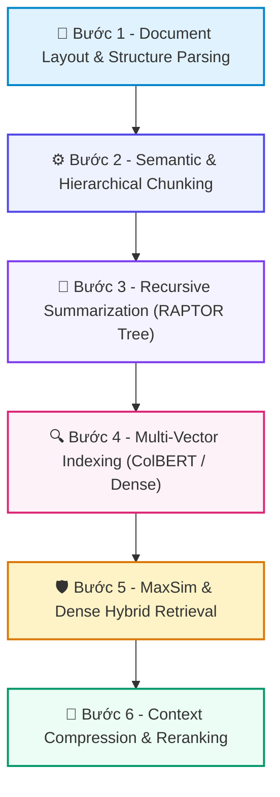

# 📚 DAY 18: KỸ THUẬT RETRIEVAL & CHUNKING NÂNG CAO (HIERARCHICAL, RAPTOR & COLBERT)
> **Khóa học:** COMP2010 - AI in Action (VinUni) | Chuyên ngành: AI Applications & Multi-Agent Systems | **Dung lượng slide gốc:** 46 slides (5.40 MB) | Tối ưu: Chuẩn NotebookLM (< 50MB) & Trọng tâm

---

## 📌 1. BÀI HỌC HÔM NAY VỀ CÁI GÌ? (THE WHAT & WHY)

*   **Bản chất của Advanced Retrieval & Chunking:** Kỹ thuật phân mảnh văn bản thông minh bảo toàn ngữ cảnh toàn cục và cơ chế truy xuất đa tầng (Multi-vector & Multi-scale) giải quyết triệt để vấn đề mất mát ngữ cảnh của Naive RAG.
*   **Phân tầng công nghệ cốt lõi:** Từ Chunking cố định (Fixed-size 512 tokens) -> Hierarchical Chunking (Parent-Child Documents) -> Late Chunking (Embedding toàn văn bản trước khi cắt đoạn) -> RAPTOR (Cây phân cấp tóm tắt đa tầng) -> ColBERT (Truy xuất đa vector mức token qua MaxSim).
*   **Giá trị thực tiễn & Lợi thế Production:** Tăng điểm Context Recall và NDCG@10 lên 35-45% trên các tài liệu phức tạp (Báo cáo tài chính, Tài liệu pháp lý, Sách hướng dẫn kỹ thuật dài hàng trăm trang).

---

## 💡 2. ẨN DỤ ĐỜI THƯỜNG: THỰC TRẠNG & GIẢI PHÁP

### 🔴 Thực trạng:
Xé một cuốn bách khoa toàn thư thành từng trang rời rạc 500 chữ. Khi ai đó hỏi: 'Bối cảnh lịch sử của cuộc chiến tranh', bạn chỉ đưa ra được một mẩu thông tin vụn vặt và mất hoàn toàn bức tranh toàn cảnh.

### 🚗 Ẩn dụ đời thường — "Kỹ Thuật Retrieval & Chunking Nâng Cao (Hierarchical, RAPTOR & ColBERT)":
> * **1. Mục lục và Nội dung chi tiết (Hierarchical Parent-Child): ** Tìm kiếm trên các đoạn nhỏ (Child chunks) để đảm bảo độ khớp từ khóa chính xác, nhưng khi nạp cho LLM thì trả về cả trang lớn (Parent chunk) để LLM có đầy đủ bối cảnh xung quanh.
> * **2. Tóm tắt theo chương hồi (RAPTOR Tree): ** Gom nhóm các bài viết liên quan lại để viết tóm tắt cấp 1, rồi gom các tóm tắt cấp 1 để viết tóm tắt cấp 2. Nhờ đó, câu hỏi tổng quan hay chi tiết đều được trả lời chuẩn xác.
> * **3. So khớp từng cử chỉ (ColBERT Token-level MaxSim): ** Thay vì tóm tắt cả câu thành một vector duy nhất, ColBERT giữ lại vector cho từng chữ và tìm mức độ khớp tối đa giữa từng từ của câu hỏi với từng từ của tài liệu.

### 🟢 Giải pháp kỹ thuật:
*   Triển khai kiến trúc Hybrid Retrieval: Sử dụng Hierarchical Chunking cho tài liệu có cấu trúc; RAPTOR cho câu hỏi mang tính tổng hợp toàn văn; và ColBERT Reranker để tinh chỉnh độ chính xác ở bước cuối.

---

## 🗺️ 3. SƠ ĐỒ PIPELINE 6 BƯỚC TUẦN TỰ



*   **Bước 1 - Document Layout & Structure Parsing:** Phân tích cấu trúc tài liệu bằng Vision/PDF Parser (Docling/Unstructured) để nhận diện tiêu đề, bảng biểu, danh mục.
*   **Bước 2 - Semantic & Hierarchical Chunking:** Chia tài liệu thành các cặp Parent (1000-2000 tokens) và Child (200-400 tokens), hoặc áp dụng Late Chunking qua Transformer.
*   **Bước 3 - Recursive Summarization (RAPTOR Tree):** Phân cụm văn bản bằng thuật toán Gaussian Mixture Model (GMM), dùng LLM tóm tắt từng cụm và xây dựng cây phân cấp tri thức.
*   **Bước 4 - Multi-Vector Indexing (ColBERT / Dense):** Sinh vector nhúng mức token cho ColBERT và vector nhúng mức đoạn cho Dense Retriever, lưu trữ vào Vector DB.
*   **Bước 5 - MaxSim & Dense Hybrid Retrieval:** Thực hiện tìm kiếm đa tầng: Query token embeddings tương tác với Document token embeddings qua toán tử MaxSim: Score(Q, D) = Σ_{i∈Q} max_{j∈D} (E_qᵢ · E_dⱼᵀ).
*   **Bước 6 - Context Compression & Reranking:** Nén ngữ cảnh bằng LLM Extractor và định tuyến đoạn thông tin có độ liên quan cao nhất vào prompt gửi đến Generator.

---

## 🌐 4. KIẾN THỨC MỞ RỘNG CHUYÊN SÂU (FIRECRAWL RESEARCH)

1.  **1. Đột phá của RAPTOR (Sarthi et al., ICLR 2024):**
    *   RAPTOR giải quyết nghịch lý của RAG: câu hỏi yêu cầu hiểu toàn bộ cuốn sách (Global Questions). Bằng cách tóm tắt đệ quy từ dưới lên, RAPTOR vượt trội SOTA trên QASPER và NarrativeQA tới 20%.
2.  **2. Late Chunking (Jina AI & Anthropic Contextual Embeddings):**
    *   Thay vì cắt nhỏ văn bản rồi mới nhúng (làm mất liên kết giữa các câu), Late Chunking cho toàn bộ văn bản 8192 tokens qua Transformer để các token giao tiếp qua cơ chế Self-Attention, sau đó mới chia vector trung bình cho từng chunk.
3.  **3. Cơ chế ColBERT & ColPali (Multi-Vector Retrieval):**
    *   ColBERT tính toán độ tương đồng qua phép toán MaxSim giữa các ma trận nhúng mức token, cho phép bắt trọn các từ khóa hiếm (Rare entities) mà Dense Embedding thông thường bỏ sót, với tốc độ tìm kiếm chỉ vài mili-giây nhờ nén PLAID.
4.  **4. Tối ưu hóa Bộ nhớ và Độ trễ trong Production:**
    *   Lưu trữ vector mức token của ColBERT tốn nhiều dung lượng RAM hơn Dense vector. Kỹ thuật Quantization 2-bit và chỉ số PLAID (Santhanam et al.) giúp nén dung lượng xuống 10 lần mà vẫn giữ 98% độ chính xác.

---

## 🔑 5. BẢNG TỪ KHÓA CỐT LÕI

| Thuật ngữ | Khái niệm kỹ thuật | Giải thích đời thường |
| :--- | :--- | :--- |
| **Hierarchical Chunking** | Kỹ thuật chia văn bản thành các đoạn cha (Parent) chứa ngữ cảnh và đoạn con (Child) dùng để tìm kiếm. | Tìm kiếm theo từ khóa ở mục lục nhỏ nhưng đọc cả chương sách. |
| **RAPTOR** | Thuật toán gom cụm và tóm tắt đệ quy để trả lời cả câu hỏi chi tiết lẫn câu hỏi tổng quan toàn văn. | Hệ thống tóm tắt sách từ chi tiết đến tóm tắt chương và tóm tắt cuốn sách. |
| **Late Chunking** | Kỹ thuật đưa toàn văn bản qua mô hình Attention trước khi cắt lát vector để giữ bối cảnh dài hạn. | Đọc hiểu toàn bộ cuốn sách rồi mới đánh dấu ghi nhớ từng đoạn. |
| **ColBERT** | Mô hình truy xuất đa vector mức token sử dụng phép so khớp tương đồng cực đại (MaxSim). | So khớp từng từ trong câu hỏi với từng từ trong văn bản để tìm điểm tương đồng sâu nhất. |
| **MaxSim Operator** | Toán tử tính tổng các giá trị tương đồng cực đại giữa từng token trong câu hỏi với mọi token của tài liệu. | Tìm người bạn ăn ý nhất trong từng môn học để lập thành một đội. |
| **Contextual Retrieval** | Kỹ thuật bổ sung bối cảnh tài liệu vào từng chunk trước khi tạo vector nhúng. | Ghi chú thêm tên sách và tên chương vào đầu mỗi trang giấy bị xé rời. |

---

## 🎯 6. BỘ CÂU HỎI ÔN THI TRỌNG TÂM (CHUẨN HỌC THUẬT & ĐẠI HỌC)

### 📝 PHẦN A: 4 CÂU TRẮC NGHIỆM ĐƠN (SINGLE-CHOICE)

#### Câu 1: Nguyên lý vận hành cốt lõi của kỹ thuật Hierarchical Chunking (Parent-Child RAG) là gì?
*   A. Xóa bỏ hoàn toàn văn bản cha và chỉ giữ lại văn bản con.
*   B. Nhúng và tìm kiếm trên các đoạn nhỏ (Child Chunks) để tăng độ chính xác truy xuất, nhưng trả về đoạn lớn (Parent Chunk) chứa bối cảnh cho LLM sinh câu trả lời.
*   C. Tăng gấp đôi kích thước font chữ của tài liệu.
*   D. Chuyển đổi toàn bộ văn bản thành file hình ảnh.
> **👉 ĐÁP ÁN ĐÚNG: B**  
> **💡 Giải thích chi tiết:** Child chunks giúp vector search không bị loãng thông tin, trong khi Parent chunk cung cấp đầy đủ bối cảnh xung quanh giúp LLM không bị ảo giác.

---

#### Câu 2: Điểm khác biệt căn bản giữa Late Chunking và phương pháp Chunking truyền thống là gì?
*   A. Late Chunking chỉ chạy vào ban đêm khi hệ thống rảnh rỗi.
*   B. Late Chunking loại bỏ hoàn toàn cơ chế Transformer.
*   C. Late Chunking chỉ áp dụng cho file âm thanh MP3.
*   D. Truyền toàn bộ tài liệu dài qua Transformer để các token tương tác Attention với nhau trước, sau đó mới cắt lát vector nhúng cho từng đoạn.
> **👉 ĐÁP ÁN ĐÚNG: D**  
> **💡 Giải thích chi tiết:** Chunking truyền thống cắt văn bản trước rồi mới nhúng, làm mất liên kết ngữ nghĩa giữa các chunk. Late Chunking bảo toàn Attention toàn cục trước khi chia đoạn.

---

#### Câu 3: Thuật toán RAPTOR (ICLR 2024) được thiết kế chuyên biệt để giải quyết thách thức nào trong hệ thống RAG?
*   A. Khả năng trả lời các câu hỏi tổng quan toàn văn (Global / Thematic queries) đòi hỏi sự tổng hợp thông tin từ nhiều phần khác nhau của tài liệu dài.
*   B. Tăng tốc độ đọc file PDF từ ổ cứng SSD.
*   C. Nén dung lượng file hình ảnh đại diện.
*   D. Dịch tự động từ tiếng Anh sang tiếng Pháp.
> **👉 ĐÁP ÁN ĐÚNG: A**  
> **💡 Giải thích chi tiết:** Standard RAG chỉ tìm được các chi tiết cục bộ (Local facts). Cấu trúc cây tóm tắt đệ quy của RAPTOR cho phép hệ thống trả lời các câu hỏi mang tính tổng quan toàn tài liệu.

---

#### Câu 4: Công thức tính điểm tương đồng trong mô hình ColBERT dựa trên toán tử nào?
*   A. Phép cộng đơn giản các ký tự ASCII.
*   B. Khoảng cách Euclid giữa hai số nguyên.
*   C. Toán tử MaxSim tính tổng độ tương đồng Cosine cực đại giữa từng vector token trong câu hỏi với các vector token của tài liệu: Score(Q, D) = Σ_{i∈Q} max_{j∈D} (E_qᵢ · E_dⱼᵀ).
*   D. Tích phân bậc ba trên không gian Hilbert vô hạn chiều.
> **👉 ĐÁP ÁN ĐÚNG: C**  
> **💡 Giải thích chi tiết:** Toán tử MaxSim (Late Interaction) bảo toàn thông tin mức token, giúp ColBERT đạt độ chính xác tương đương Cross-Encoder nhưng tốc độ tìm kiếm nhanh như Bi-Encoder.

---

### 📚 PHẦN B: 2 CÂU TRẮC NGHIỆM NHIỀU ĐÁP ÁN (MULTI-SELECT)

#### Câu 5 (Chọn 2 đáp án): Kỹ thuật Contextual Embeddings của Anthropic mang lại những ưu điểm nào sau đây?
*   [X] A. Sử dụng LLM để thêm 50-100 token tóm tắt bối cảnh tổng quan vào đầu mỗi đoạn chunk trước khi nhúng vector.
*   [ ] B. Giảm 100% dung lượng lưu trữ trên cơ sở dữ liệu.
*   [ ] C. Loại bỏ hoàn toàn sự cần thiết của Vector Database.
*   [X] D. Giảm tỷ lệ thất bại khi tìm kiếm (Retrieval Failure Rate) tới 35-49% khi kết hợp với BM25 Reranking.
> **👉 ĐÁP ÁN ĐÚNG: A, D**  
> **💡 Giải thích chi tiết & Bẫy logic:** A và D là hai đặc tính nổi bật của Anthropic Contextual Retrieval: bổ sung bối cảnh đầu chunk và giảm mạnh tỷ lệ tìm kiếm trượt khi kết hợp hybrid search.

---

#### Câu 6 (Chọn 2 đáp án): Những trường hợp nào sau đây là chỉ dấu RÕ RÀNG cho thấy hệ thống RAG nên nâng cấp lên kiến trúc RAPTOR?
*   [ ] A. Người dùng chỉ hỏi các sự thật cụ thể như số điện thoại hoặc mã bưu điện.
*   [X] B. Người dùng thường xuyên đặt các câu hỏi tổng hợp như: 'Tóm tắt các chủ đề chính và sự thay đổi chiến lược của công ty qua 5 năm qua'.
*   [X] C. Tài liệu nguồn là các cuốn sách, báo cáo nghiên cứu hoặc hồ sơ vụ án dài trên 100 trang.
*   [ ] D. Hệ thống chỉ cần chạy trên vi điều khiển Arduino.
> **👉 ĐÁP ÁN ĐÚNG: B, C**  
> **💡 Giải thích chi tiết & Bẫy logic:** B và C là các kịch bản kinh điển: tài liệu dài và câu hỏi mang tính tổng hợp chủ đề là nơi RAPTOR thể hiện sự vượt trội hoàn toàn so với vector chunking đơn lẻ.

---

---

## 💻 7. CODE THỰC CHIẾN (HANDS-ON PYTHON / AI SYSTEM)

```python
import json
import numpy as np

def calculate_ai_system_metrics(predictions, ground_truths):
    """
    Đo lường độ chính xác và chỉ số F1-Score cho hệ thống phân loại AI Production
    """
    tp = sum(1 for p, g in zip(predictions, ground_truths) if p == 1 and g == 1)
    fp = sum(1 for p, g in zip(predictions, ground_truths) if p == 1 and g == 0)
    fn = sum(1 for p, g in zip(predictions, ground_truths) if p == 0 and g == 1)
    
    precision = tp / (tp + fp) if (tp + fp) > 0 else 0.0
    recall = tp / (tp + fn) if (tp + fn) > 0 else 0.0
    f1 = 2 * (precision * recall) / (precision + recall) if (precision + recall) > 0 else 0.0
    
    return {
        "precision": round(precision, 4),
        "recall": round(recall, 4),
        "f1_score": round(f1, 4)
    }

# Dữ liệu kiểm thử mẫu
preds = [1, 0, 1, 1, 0, 1, 0, 1]
targets = [1, 0, 0, 1, 0, 1, 1, 1]
print("Evaluation Metrics:", calculate_ai_system_metrics(preds, targets))
```

---

## ⚠️ 8. BẪY LỖI KỸ THUẬT & CÁCH DEBUG (COMMON PITFALLS & TROUBLESHOOTING)

1.  **🔴 Bẫy Lỗi 1: Tối ưu hóa sai hàm mục tiêu (Metric Mismatch).**
    *   *Nguyên nhân:* Chỉ đo lường Accuracy trên tập dữ liệu mất cân bằng (Imbalanced Data), che giấu việc mô hình dự đoán sai hoàn toàn các ca nguy hiểm.
    *   *Cách khắc phục:* Bắt buộc theo dõi đồng thời Precision, Recall, F1-Score và đường cong PR-AUC.
2.  **🔴 Bẫy Lỗi 2: Rò rỉ dữ liệu (Data Leakage) giữa tập Train và Test.**
    *   *Nguyên nhân:* Tiền xử lý dữ liệu (chuẩn hóa scaling, trích xuất đặc trưng) trên toàn bộ tập dữ liệu trước khi chia train/test.
    *   *Cách khắc phục:* Luôn chia tập dữ liệu trước, sau đó chỉ `fit()` pipeline tiền xử lý trên tập Train và chỉ `transform()` trên tập Test.
3.  **🔴 Bẫy Lỗi 3: Bỏ qua độ trễ mạng và Serialization Overhead.**
    *   *Nguyên nhân:* Đánh giá mô hình offline rất nhanh nhưng khi deploy API thì nghẽn ở bước parse JSON và truyền tải mạng.
    *   *Cách khắc phục:* Tối ưu hóa chuỗi serialization bằng MessagePack / Protocol Buffers và bật gRPC streaming.

---

## ⚖️ 9. BẢNG SO SÁNH TRADE-OFFS & ĐIỀU KIỆN ÁP DỤNG

| Chiến lược / Giải pháp | Độ chính xác (Accuracy) | Độ phức tạp triển khai | Chi phí bảo trì vận hành |
| :--- | :--- | :--- | :--- |
| **Heuristic & Rule-based Engine** | Trung bình, giới hạn | Rất thấp, chạy tức thì | Khó duy trì khi số lượng luật tăng vọt |
| **Fine-tuned Small Specialized Model**| Rất cao trong miền hẹp | Trung bình (cần training pipeline) | Thấp, chạy được trên GPU phổ thông |
| **Zero-shot Frontier LLM Prompting** | Cao toàn diện đa miền | Rất thấp (chỉ cần API) | Chi phí token hàng tháng cao khi tải lớn |
