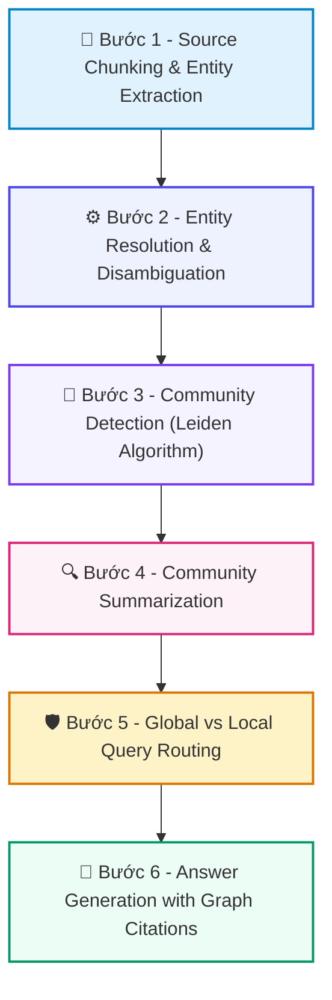

# 📚 DAY 19: GRAPHRAG & KNOWLEDGE GRAPHS TRONG HỆ THỐNG AI ĐA TÁC TỬ
> **Khóa học:** COMP2010 - AI in Action (VinUni) | Chuyên ngành: AI Applications & Multi-Agent Systems | **Dung lượng slide gốc:** 65 slides (6.43 MB) | Tối ưu: Chuẩn NotebookLM (< 50MB) & Trọng tâm

---

## 📌 1. BÀI HỌC HÔM NAY VỀ CÁI GÌ? (THE WHAT & WHY)

*   **Bản chất của GraphRAG:** Sự kết hợp giữa Đồ thị Tri thức (Knowledge Graph) và Mô hình Ngôn ngữ Lớn để biểu diễn các thực thể và mối quan hệ phức tạp, hỗ trợ suy luận đa chặng (Multi-hop Reasoning) và hiểu biết toàn cục.
*   **Phân tầng công nghệ cốt lõi:** Từ Vector RAG (chỉ tìm kiếm theo độ tương đồng ngữ nghĩa) -> Text2Cypher (Ánh xạ câu hỏi sang truy vấn đồ thị) -> Graph-augmented Hybrid RAG -> Microsoft GraphRAG (Phát hiện cộng đồng mạng lưới bằng thuật toán Leiden và tóm tắt phân cấp).
*   **Giá trị thực tiễn & Lợi thế Production:** Vượt qua giới hạn của tìm kiếm vector thuần túy: phát hiện các mối liên kết gián tiếp (A liên kết B, B liên kết C -> A có quan hệ gì với C?) và tổng hợp các chủ đề trừu tượng không có từ khóa rõ ràng.

---

## 💡 2. ẨN DỤ ĐỜI THƯỜNG: THỰC TRẠNG & GIẢI PHÁP

### 🔴 Thực trạng:
Tìm kiếm thủ phạm trong một vụ án mạng phức tạp chỉ bằng cách đọc từng mẩu tin báo rời rạc thay vì vẽ sơ đồ liên kết giữa các nghi phạm, địa điểm, thời gian và động cơ gây án trên bảng điều tra.

### 🚗 Ẩn dụ đời thường — "GraphRAG & Knowledge Graphs trong Hệ Thống AI Đa Tác Tử":
> * **1. Các điểm nút điều tra (Entities): ** Mỗi nhân vật, địa điểm, sự kiện là một chiếc ghim bấm trên bảng điều tra (Node trong đồ thị).
> * **2. Dây chỉ đỏ kết nối (Relationships): ** Dây chỉ đỏ nối giữa hai ghim bấm thể hiện mối quan hệ: 'Ông A là giám đốc công ty B', 'Xe C xuất hiện tại địa điểm D' (Edge & Predicate).
> * **3. Khoanh vùng băng nhóm (Leiden Communities): ** Khoanh tròn các nhóm nghi phạm thường xuyên gặp gỡ nhau thành từng cụm băng nhóm để hiểu cơ cấu tổ chức tội phạm từ trên xuống dưới.

### 🟢 Giải pháp kỹ thuật:
*   Xây dựng Knowledge Graph tự động: Trích xuất Bộ ba (Subject-Predicate-Object) bằng LLM -> Hợp nhất thực thể (Entity Resolution) -> Phân cụm cộng đồng mạng lưới -> Truy vấn kết hợp Graph Traversal và Vector Indexing.

---

## 🗺️ 3. SƠ ĐỒ PIPELINE 6 BƯỚC TUẦN TỰ



*   **Bước 1 - Source Chunking & Entity Extraction:** Chia văn bản thành các đoạn và sử dụng LLM trích xuất danh sách Thực thể (Entities), Mối quan hệ (Relationships) và Thuộc tính (Claims).
*   **Bước 2 - Entity Resolution & Disambiguation:** Hợp nhất các thực thể đồng nghĩa (ví dụ: 'Microsoft', 'MSFT', 'Tập đoàn Microsoft') vào cùng một Node duy nhất trong cơ sở dữ liệu đồ thị.
*   **Bước 3 - Community Detection (Leiden Algorithm):** Chạy thuật toán Leiden trên đồ thị tri thức để phát hiện các phân cấp cộng đồng mạng lưới từ vi mô đến vĩ mô.
*   **Bước 4 - Community Summarization:** Tạo bản tóm tắt tri thức cho từng cộng đồng ở mọi cấp bậc phân tầng bằng LLM, tạo thành cây báo cáo cấu trúc.
*   **Bước 5 - Global vs Local Query Routing:** Định tuyến câu hỏi: Nếu hỏi thực thể cụ thể -> Local Search qua Graph Traversal; Nếu hỏi chủ đề toàn cục -> Global Search qua Community Summaries.
*   **Bước 6 - Answer Generation with Graph Citations:** LLM tổng hợp câu trả lời cuối cùng, trích dẫn chính xác các nút, cạnh và tài liệu nguồn làm bằng chứng minh bạch.

---

## 🌐 4. KIẾN THỨC MỞ RỘNG CHUYÊN SÂU (FIRECRAWL RESEARCH)

1.  **1. Đột phá Microsoft GraphRAG (Edge et al., 2024):**
    *   Nghiên cứu của Microsoft chứng minh GraphRAG vượt trội hơn 2.5 lần so với Vector RAG thông thường trên bài toán Comprehensiveness (Tính bao quát) và Diversity (Tính đa dạng) đối với các câu hỏi phức tạp trên tập dữ liệu hàng triệu từ.
2.  **2. Fast GraphRAG & LightRAG (Tối ưu hóa Chi phí):**
    *   Microsoft GraphRAG tốn hàng trăm USD tiền gọi LLM để trích xuất tri thức. LightRAG (2024) đề xuất cơ chế truy xuất hai tầng (Dual-level Retrieval) và làm giàu đồ thị gia tăng (Incremental Graph Enrichment), giảm 90% chi phí xây dựng đồ thị.
3.  **3. Triển khai Thực tế với Neo4j & Amazon Neptune:**
    *   Cơ sở dữ liệu đồ thị bản địa (Native Graph DB) hỗ trợ ngôn ngữ Cypher/Gremlin cho phép thực hiện các phép duyệt đồ thị đa bước (Graph Traversal up to 5 hops) trong thời gian dưới 10ms, kết hợp hoàn hảo với Vector Index.
4.  **4. Thách thức Entity Resolution trong Sản xuất:**
    *   Khi dữ liệu tăng lên hàng triệu thực thể, việc trùng lặp tên gây nổ số lượng cạnh sai lệch. Kỹ thuật áp dụng: Embedding Similarity kết hợp với Ràng buộc Luật (Rule-based constraints) và LLM Verification.

---

## 🔑 5. BẢNG TỪ KHÓA CỐT LÕI

| Thuật ngữ | Khái niệm kỹ thuật | Giải thích đời thường |
| :--- | :--- | :--- |
| **Knowledge Graph** | Mạng lưới tri thức có cấu trúc biểu diễn các thực thể dưới dạng Nút (Nodes) và quan hệ dưới dạng Cạnh (Edges). | Sơ đồ gia phả dòng họ chỉ rõ quan hệ ruột thịt giữa mọi thành viên. |
| **Leiden Algorithm** | Thuật toán phân cụm mạng lưới phân cấp tối ưu hóa độ gắn kết (Modularity) để phát hiện các cộng đồng tri thức. | Cách phân chia bản đồ hành chính từ quốc gia xuống tỉnh, huyện, xã. |
| **Entity Resolution** | Quá trình xác định và hợp nhất các tên gọi khác nhau của cùng một thực thể ngoài đời thực. | Nhận diện biệt danh 'Tèo' và tên thật 'Nguyễn Văn Nam' là cùng một người. |
| **Global Search** | Chiến lược truy vấn tổng hợp trên các bản tóm tắt cộng đồng của GraphRAG để trả lời câu hỏi vĩ mô. | Hỏi bức tranh toàn cảnh về nền kinh tế đất nước từ các báo cáo cấp bộ ngành. |
| **Local Search** | Chiến lược truy vấn đi sâu vào một thực thể cụ thể và các nút láng giềng trực tiếp trong đồ thị. | Xem xét toàn bộ lý lịch và các mối quan hệ thân cận của một nghi phạm. |
| **Text2Cypher** | Kỹ thuật dùng LLM để dịch ngôn ngữ tự nhiên thành câu lệnh truy vấn đồ thị Cypher. | Người phiên dịch chuyển câu hỏi tiếng Việt thành câu lệnh tra cứu cơ sở dữ liệu chuyên dụng. |

---

## 🎯 6. BỘ CÂU HỎI ÔN THI TRỌNG TÂM (CHUẨN HỌC THUẬT & ĐẠI HỌC)

### 📝 PHẦN A: 4 CÂU TRẮC NGHIỆM ĐƠN (SINGLE-CHOICE)

#### Câu 1: Điểm yếu chí mạng của hệ thống Vector RAG truyền thống khi đối mặt với câu hỏi 'Hãy phân tích các mối liên hệ gián tiếp giữa Công ty A và Tập đoàn D' là gì?
*   A. Vector RAG chạy quá nhanh làm quá tải CPU máy tính.
*   B. Vector RAG chỉ hỗ trợ văn bản tiếng Anh.
*   C. Mô hình nhúng vector bị giới hạn ở 8 token.
*   D. Vector RAG chỉ tìm kiếm dựa trên độ tương đồng ngữ nghĩa độc lập giữa từng đoạn văn với câu hỏi, không thể kết nối các mối quan hệ logic xuyên suốt nhiều tài liệu (Multi-hop relationships).
> **👉 ĐÁP ÁN ĐÚNG: D**  
> **💡 Giải thích chi tiết:** Vector Search tìm kiếm theo khoảng cách hình học của từng đoạn độc lập, hoàn toàn mù mờ trước các mối quan hệ bắc cầu dạng A -> B -> C -> D nếu chúng nằm ở các tài liệu khác nhau.

---

#### Câu 2: Đơn vị hạt nhân cơ bản nhất để cấu trúc hóa tri thức trong một Knowledge Graph là gì?
*   A. Một mảng số thực 1024 chiều.
*   B. Bộ ba tri thức (Knowledge Triplet) gồm: Chủ thể (Subject) - Vị từ/Quan hệ (Predicate) - Đối tượng (Object).
*   C. Một đoạn mã HTML.
*   D. Một tệp tin âm thanh WAV.
> **👉 ĐÁP ÁN ĐÚNG: B**  
> **💡 Giải thích chi tiết:** Bộ ba (Subject - Predicate - Object), ví dụ: (Albert Einstein - Sinh tại - Ulm), là nền tảng cấu trúc của mọi đồ thị tri thức chuẩn RDF/Property Graph.

---

#### Câu 3: Trong kiến trúc Microsoft GraphRAG, thuật toán Leiden đóng vai trò kỹ thuật gì?
*   A. Nén dung lượng hình ảnh đại diện của bài báo.
*   B. Mã hóa mật khẩu người dùng theo chuẩn AES-256.
*   C. Phát hiện và phân nhóm các cộng đồng thực thể có liên kết chặt chẽ với nhau theo cấu trúc phân cấp đa tầng (Hierarchical Community Detection).
*   D. Xóa các nút đồ thị không có hoạt động trong 30 ngày.
> **👉 ĐÁP ÁN ĐÚNG: C**  
> **💡 Giải thích chi tiết:** Thuật toán Leiden phân cụm mạng lưới thành các cộng đồng tri thức từ vi mô đến vĩ mô, cho phép sinh các bản tóm tắt phân cấp để phục vụ Global Search.

---

#### Câu 4: Khi người dùng đặt câu hỏi 'Những chủ đề rủi ro bảo mật chính trong toàn bộ hệ thống là gì?', hệ thống GraphRAG sẽ kích hoạt luồng tìm kiếm nào?
*   A. Global Search duyệt qua các bản tóm tắt cộng đồng (Community Summaries) ở các cấp độ cao để tổng hợp bức tranh toàn cảnh.
*   B. Local Search chỉ kiểm tra đúng 1 dòng log gần nhất.
*   C. Dừng chương trình và báo lỗi thiếu dữ liệu.
*   D. Gửi email yêu cầu người dùng đổi câu hỏi khác.
> **👉 ĐÁP ÁN ĐÚNG: A**  
> **💡 Giải thích chi tiết:** Global Search được thiết kế chuyên biệt cho các câu hỏi tổng quan trừu tượng đòi hỏi phải quét toàn bộ kho dữ liệu thông qua cấu trúc phân cụm Leiden.

---

### 📚 PHẦN B: 2 CÂU TRẮC NGHIỆM NHIỀU ĐÁP ÁN (MULTI-SELECT)

#### Câu 5 (Chọn 2 đáp án): Những trường hợp nào sau đây chứng minh GraphRAG vượt trội hoàn toàn so với Vector RAG?
*   [X] A. Bài toán phát hiện gian lận tài chính thông qua mạng lưới các công ty con và tài khoản ngân hàng liên đới phức tạp.
*   [X] B. Câu hỏi tổng hợp mang tính chiến lược đòi hỏi liên kết thông tin từ hàng ngàn tài liệu khác nhau.
*   [ ] C. Tra cứu một mã bưu chính hoặc số CMND cụ thể trong cơ sở dữ liệu.
*   [ ] D. Lưu trữ file log hệ thống theo thời gian thực đơn giản.
> **👉 ĐÁP ÁN ĐÚNG: A, B**  
> **💡 Giải thích chi tiết & Bẫy logic:** A và B là đất diễn của GraphRAG: mạng lưới liên kết phức tạp và câu hỏi tổng hợp đa tài liệu. Đối với tra cứu đơn giản (C, D), SQL hoặc Vector RAG hiệu quả và rẻ hơn.

---

#### Câu 6 (Chọn 2 đáp án): So với Microsoft GraphRAG, kiến trúc LightRAG (2024) mang lại những cải tiến đột phá nào?
*   [ ] A. Bắt buộc phải có cụm máy chủ 100 GPU để hoạt động.
*   [ ] B. Xóa bỏ hoàn toàn khái niệm thực thể trong cơ sở dữ liệu.
*   [X] C. Cơ chế truy xuất hai tầng (Dual-level Retrieval) kết hợp đồng thời mức độ chi tiết (Low-level) và mức độ tổng quan (High-level).
*   [X] D. Khả năng cập nhật đồ thị gia tăng từng phần (Incremental Graph Update), giúp tiết kiệm chi phí xây dựng lại đồ thị từ đầu.
> **👉 ĐÁP ÁN ĐÚNG: C, D**  
> **💡 Giải thích chi tiết & Bẫy logic:** LightRAG giải quyết hai điểm nghẽn lớn nhất của Microsoft GraphRAG: cho phép cập nhật gia tăng không cần rebuild và hỗ trợ truy xuất linh hoạt 2 tầng.

---

---

## 💻 7. CODE THỰC CHIẾN (HANDS-ON PYTHON / AI SYSTEM)

```python
import json
import numpy as np

def calculate_ai_system_metrics(predictions, ground_truths):
    """
    Đo lường độ chính xác và chỉ số F1-Score cho hệ thống phân loại AI Production
    """
    tp = sum(1 for p, g in zip(predictions, ground_truths) if p == 1 and g == 1)
    fp = sum(1 for p, g in zip(predictions, ground_truths) if p == 1 and g == 0)
    fn = sum(1 for p, g in zip(predictions, ground_truths) if p == 0 and g == 1)
    
    precision = tp / (tp + fp) if (tp + fp) > 0 else 0.0
    recall = tp / (tp + fn) if (tp + fn) > 0 else 0.0
    f1 = 2 * (precision * recall) / (precision + recall) if (precision + recall) > 0 else 0.0
    
    return {
        "precision": round(precision, 4),
        "recall": round(recall, 4),
        "f1_score": round(f1, 4)
    }

# Dữ liệu kiểm thử mẫu
preds = [1, 0, 1, 1, 0, 1, 0, 1]
targets = [1, 0, 0, 1, 0, 1, 1, 1]
print("Evaluation Metrics:", calculate_ai_system_metrics(preds, targets))
```

---

## ⚠️ 8. BẪY LỖI KỸ THUẬT & CÁCH DEBUG (COMMON PITFALLS & TROUBLESHOOTING)

1.  **🔴 Bẫy Lỗi 1: Tối ưu hóa sai hàm mục tiêu (Metric Mismatch).**
    *   *Nguyên nhân:* Chỉ đo lường Accuracy trên tập dữ liệu mất cân bằng (Imbalanced Data), che giấu việc mô hình dự đoán sai hoàn toàn các ca nguy hiểm.
    *   *Cách khắc phục:* Bắt buộc theo dõi đồng thời Precision, Recall, F1-Score và đường cong PR-AUC.
2.  **🔴 Bẫy Lỗi 2: Rò rỉ dữ liệu (Data Leakage) giữa tập Train và Test.**
    *   *Nguyên nhân:* Tiền xử lý dữ liệu (chuẩn hóa scaling, trích xuất đặc trưng) trên toàn bộ tập dữ liệu trước khi chia train/test.
    *   *Cách khắc phục:* Luôn chia tập dữ liệu trước, sau đó chỉ `fit()` pipeline tiền xử lý trên tập Train và chỉ `transform()` trên tập Test.
3.  **🔴 Bẫy Lỗi 3: Bỏ qua độ trễ mạng và Serialization Overhead.**
    *   *Nguyên nhân:* Đánh giá mô hình offline rất nhanh nhưng khi deploy API thì nghẽn ở bước parse JSON và truyền tải mạng.
    *   *Cách khắc phục:* Tối ưu hóa chuỗi serialization bằng MessagePack / Protocol Buffers và bật gRPC streaming.

---

## ⚖️ 9. BẢNG SO SÁNH TRADE-OFFS & ĐIỀU KIỆN ÁP DỤNG

| Chiến lược / Giải pháp | Độ chính xác (Accuracy) | Độ phức tạp triển khai | Chi phí bảo trì vận hành |
| :--- | :--- | :--- | :--- |
| **Heuristic & Rule-based Engine** | Trung bình, giới hạn | Rất thấp, chạy tức thì | Khó duy trì khi số lượng luật tăng vọt |
| **Fine-tuned Small Specialized Model**| Rất cao trong miền hẹp | Trung bình (cần training pipeline) | Thấp, chạy được trên GPU phổ thông |
| **Zero-shot Frontier LLM Prompting** | Cao toàn diện đa miền | Rất thấp (chỉ cần API) | Chi phí token hàng tháng cao khi tải lớn |
