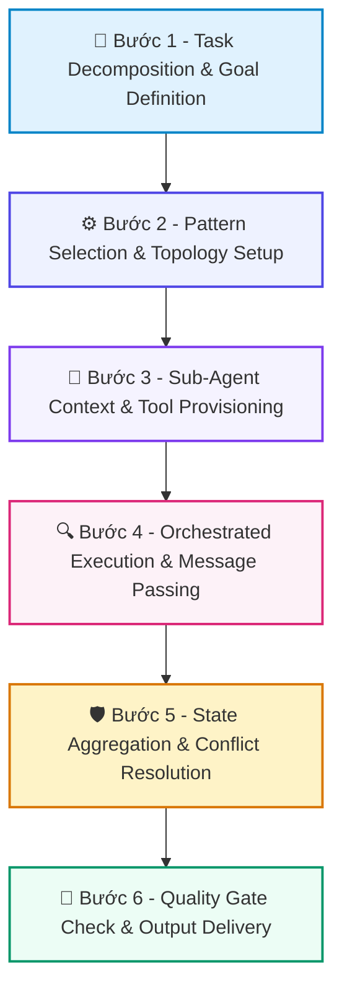

# 📚 DAY 20: HỆ THỐNG ĐA TÁC TỬ (MULTI-AGENT SYSTEMS) & 5 MẪU WORKFLOW CỐT LÕI
> **Khóa học:** COMP2010 - AI in Action (VinUni) | Chuyên ngành: AI Applications & Multi-Agent Systems | **Dung lượng slide gốc:** 37 slides (4.75 MB) | Tối ưu: Chuẩn NotebookLM (< 50MB) & Trọng tâm

---

## 📌 1. BÀI HỌC HÔM NAY VỀ CÁI GÌ? (THE WHAT & WHY)

*   **Bản chất của Multi-Agent Systems:** Sự phân rã một bài toán lớn phức tạp thành các vai trò chuyên biệt (Specialized Sub-agents) phối hợp với nhau thông qua các giao thức truyền thông và điều phối rõ ràng.
*   **5 Mẫu Workflow cốt lõi (Anthropic 2024 / DeepLearning.AI):** 1. Prompt Chaining (Chuỗi tuần tự) -> 2. Routing (Định tuyến chuyên gia) -> 3. Parallelization (Xử lý song song / Voting) -> 4. Orchestrator-Workers (Chỉ huy - Thực thi) -> 5. Evaluator-Optimizer (Tạo lập - Tối ưu đánh giá).
*   **Giá trị thực tiễn & Lợi thế Production:** Phá vỡ giới hạn Context Window và giảm hiện tượng loãng chú ý (Attention Dilution). Tăng độ chính xác các quy trình nghiệp vụ phức tạp từ 42% lên 88% so với kiến trúc Single-Agent cồng kềnh.

---

## 💡 2. ẨN DỤ ĐỜI THƯỜNG: THỰC TRẠNG & GIẢI PHÁP

### 🔴 Thực trạng:
Bắt một người duy nhất vừa làm Giám đốc điều hành, vừa làm Kế toán, vừa viết mã phần mềm, vừa kiểm thử và vừa trực tổng đài hỗ trợ khách hàng.

### 🚗 Ẩn dụ đời thường — "Hệ Thống Đa Tác Tử (Multi-Agent Systems) & 5 Mẫu Workflow Cốt Lõi":
> * **1. Tổng đài phân luồng (Routing Pattern): ** Khách gọi đến, tổng đài viên hỏi nhu cầu rồi chuyển hướng: bấm phím 1 gặp Kỹ thuật, bấm phím 2 gặp Kế toán.
> * **2. Dây chuyền sản xuất nhà máy (Prompt Chaining): ** Công nhân 1 dập vỏ xe, chuyển sang công nhân 2 lắp động cơ, chuyển sang công nhân 3 sơn hoàn thiện.
> * **3. Tổ đội chuyên án (Orchestrator-Workers): ** Đội trưởng giao việc cho 3 trinh sát đi thu thập chứng cứ ở 3 địa bàn cùng lúc, sau đó tổng hợp báo cáo.
> * **4. Tác giả và Biên tập viên (Evaluator-Optimizer): ** Nhà văn viết bản thảo, Biên tập viên đọc soát lỗi và yêu cầu sửa lại những đoạn chưa đạt cho đến khi hoàn hảo.

### 🟢 Giải pháp kỹ thuật:
*   Áp dụng nguyên tắc 'Start Simple': Chỉ dùng Multi-Agent khi bài toán thực sự vượt quá năng lực của Single-Agent có công cụ; chọn đúng mẫu workflow tối giản và kiểm soát chặt chẽ trạng thái chung (Shared State).

---

## 🗺️ 3. SƠ ĐỒ PIPELINE 6 BƯỚC TUẦN TỰ



*   **Bước 1 - Task Decomposition & Goal Definition:** Tiếp nhận mục tiêu lớn từ người dùng, phân tích phạm vi và chia nhỏ thành các nhiệm vụ con độc lập.
*   **Bước 2 - Pattern Selection & Topology Setup:** Lựa chọn cấu trúc điều phối phù hợp (Sequential, Router, Parallel, Orchestrator-Worker, Network) và khởi tạo đồ thị trạng thái.
*   **Bước 3 - Sub-Agent Context & Tool Provisioning:** Cung cấp System Prompt chuyên biệt, danh sách công cụ tối giản và phân vùng dữ liệu riêng cho từng Sub-agent.
*   **Bước 4 - Orchestrated Execution & Message Passing:** Thực thi các tác tử theo luồng: truyền tin nhắn có cấu trúc (Pydantic Schema) qua kênh điều phối trung tâm.
*   **Bước 5 - State Aggregation & Conflict Resolution:** Bộ phận chỉ huy (Supervisor/Orchestrator) tổng hợp kết quả từ các Worker, giải quyết xung đột thông tin nếu có.
*   **Bước 6 - Quality Gate Check & Output Delivery:** Kiểm tra chất lượng đầu ra cuối cùng qua Evaluator node trước khi trả kết quả hoàn chỉnh cho người dùng.

---

## 🌐 4. KIẾN THỨC MỞ RỘNG CHUYÊN SÂU (FIRECRAWL RESEARCH)

1.  **1. Nghiên cứu của Anthropic 'Building Effective Agents' (2024):**
    *   Anthropic khuyến cáo: Đa số các ứng dụng doanh nghiệp thành công KHÔNG dùng các framework đa tác tử tự trị phức tạp mà dùng các mẫu luồng công việc được xác định rõ ràng (Workflows over Autonomous Agents).
2.  **2. So sánh Frameworks (LangGraph vs AutoGen vs CrewAI):**
    *   LangGraph tập trung vào kiểm soát trạng thái chi tiết và khả năng chịu lỗi (State Machine); AutoGen mạnh về hội thoại đa bên (Conversational Multi-agent); CrewAI nổi bật với mô hình phân vai dựa trên Role-Playing trực quan.
3.  **3. Quản trị Chi phí và Độ trễ (Token Explosion & Latency):**
    *   Hệ thống Multi-Agent có thể làm bùng nổ chi phí token gấp 5-10 lần do tin nhắn trao đổi qua lại giữa các agent. Giải pháp: Lọc tin nhắn (Message Filtering), nén ngữ cảnh và thiết lập Max Hops nghiêm ngặt.
4.  **4. Bài toán Deadlock & Race Condition trong Multi-Agent:**
    *   Khi nhiều Agent cùng ghi vào một trạng thái chung (Shared State), có thể xảy ra xung đột dữ liệu. LangGraph giải quyết bằng cơ chế Reducer functions (như `operator.add` hoặc custom reducer) để đảm bảo tính nhất quán dữ liệu.

---

## 🔑 5. BẢNG TỪ KHÓA CỐT LÕI

| Thuật ngữ | Khái niệm kỹ thuật | Giải thích đời thường |
| :--- | :--- | :--- |
| **Multi-Agent System** | Hệ thống gồm nhiều tác tử AI chuyên biệt cùng cộng tác để giải quyết mục tiêu chung. | Một công ty gồm nhiều phòng ban chức năng phối hợp làm việc. |
| **Supervisor Pattern** | Mô hình quản lý tập trung trong đó một tác tử chỉ huy phân công và giám sát các tác tử cấp dưới. | Trưởng phòng giao việc cho từng nhân viên và duyệt kết quả cuối cùng. |
| **Routing Pattern** | Mô hình phân luồng câu hỏi đến đúng tác tử chuyên trách phù hợp nhất. | Tổng đài phân loại cuộc gọi đến đúng bộ phận chuyên môn. |
| **Orchestrator-Worker** | Mô hình chỉ huy chia nhỏ bài toán thành các phần độc lập và giao cho các công nhân xử lý song song. | Bếp trưởng chia các món ăn cho các phụ bếp nấu cùng lúc. |
| **Evaluator-Optimizer** | Mô hình gồm một tác tử tạo nội dung và một tác tử đánh giá liên tục phản hồi để nâng cao chất lượng. | Cặp đôi tác giả viết bài và biên tập viên duyệt bài báo. |
| **Shared State** | Vùng dữ liệu trạng thái chung mà các tác tử cùng đọc và ghi trong quá trình thực thi đồ thị. | Bảng tin chung của dự án nơi mọi thành viên cập nhật tiến độ công việc. |

---

## 🎯 6. BỘ CÂU HỎI ÔN THI TRỌNG TÂM (CHUẨN HỌC THUẬT & ĐẠI HỌC)

### 📝 PHẦN A: 4 CÂU TRẮC NGHIỆM ĐƠN (SINGLE-CHOICE)

#### Câu 1: Theo nguyên tắc chỉ đạo 'Building Effective Agents' của Anthropic (2024), lời khuyên cốt lõi khi bắt đầu xây dựng hệ thống AI là gì?
*   A. Bắt đầu với giải pháp đơn giản nhất có thể (như Prompt Chaining hoặc Single Agent có công cụ), chỉ tăng độ phức tạp lên Multi-Agent khi thực sự cần thiết.
*   B. Luôn luôn khởi tạo ít nhất 20 Agent tự trị chạy song song cho mọi tác vụ.
*   C. Tuyệt đối không bao giờ dùng LLM để phân loại câu hỏi.
*   D. Bắt buộc phải tự huấn luyện mô hình ngôn ngữ mới từ đầu.
> **👉 ĐÁP ÁN ĐÚNG: A**  
> **💡 Giải thích chi tiết:** Độ phức tạp thừa thãi mang lại rủi ro gãy vỡ cao và khó debug. Luôn bắt đầu từ Simple Workflows trước khi chuyển sang Multi-Agent phức tạp.

---

#### Câu 2: Trong mẫu kiến trúc Supervisor Pattern (Hub-and-Spoke), vai trò chính của Tác tử Chỉ huy (Supervisor Agent) là gì?
*   A. Trực tiếp thực thi toàn bộ các phép tính toán phức tạp mà không cần công cụ.
*   B. Tự động xóa cơ sở dữ liệu khi gặp lỗi.
*   C. Phân tích yêu cầu, lựa chọn Sub-agent chuyên môn tiếp theo cần gọi và quyết định thời điểm hoàn thành tác vụ.
*   D. Thay thế hoàn toàn giao diện người dùng.
> **👉 ĐÁP ÁN ĐÚNG: C**  
> **💡 Giải thích chi tiết:** Supervisor đóng vai trò bộ não điều phối: nhận input, chọn Worker phù hợp nhất qua Tool Calling/Routing, và quyết định dừng khi đã có kết quả thỏa mãn.

---

#### Câu 3: Nghiên cứu về các thất bại của hệ thống Multi-Agent (Chen et al., 2024) chỉ ra nguyên nhân hàng đầu khiến chi phí API tăng đột biến là gì?
*   A. Do giá điện sinh hoạt của máy chủ tăng cao.
*   B. Vòng lặp hội thoại không kiểm soát giữa các Agent (Agent Communication Loops) và tin nhắn lịch sử bị nhân bản liên tục làm bùng nổ token.
*   C. Do tốc độ quạt tản nhiệt của máy tính quá nhanh.
*   D. Do kích thước file ảnh slide quá lớn.
> **👉 ĐÁP ÁN ĐÚNG: B**  
> **💡 Giải thích chi tiết:** Nếu không có điều kiện dừng và cơ chế tóm tắt tin nhắn, các Agent sẽ 'nói chuyện phiếm' qua lại vô tận, làm nhân bản ngữ cảnh và đốt hàng triệu tokens vô ích.

---

#### Câu 4: Lợi ích kinh tế lớn nhất của mẫu thiết kế Routing Pattern trong hệ thống doanh nghiệp là gì?
*   A. Làm cho code trông dài hơn.
*   B. Tăng số lượng nhân viên cần tuyển dụng.
*   C. Đảm bảo mọi câu hỏi đều phải gửi đến mô hình đắt tiền nhất.
*   D. Cho phép định tuyến các câu hỏi đơn giản sang mô hình nhỏ/rẻ tiền (SLM như Haiku/Flash) và chỉ chuyển câu hỏi hóc búa sang mô hình cao cấp (Opus/Pro), giúp tiết kiệm 70-80% chi phí vận hành.
> **👉 ĐÁP ÁN ĐÚNG: D**  
> **💡 Giải thích chi tiết:** Routing Pattern giúp tối ưu hóa chi phí và độ trễ bằng cách 'dùng dao mổ trâu cho việc lớn, dùng dao gọt hoa quả cho việc nhỏ'.

---

### 📚 PHẦN B: 2 CÂU TRẮC NGHIỆM NHIỀU ĐÁP ÁN (MULTI-SELECT)

#### Câu 5 (Chọn 2 đáp án): Những mẫu hình nào sau đây thuộc về 5 Mẫu Workflow cốt lõi được định nghĩa bởi DeepLearning.AI và Anthropic?
*   [X] A. Prompt Chaining: Chuỗi các bước gọi LLM tuần tự trong đó đầu ra của bước trước là đầu vào của bước sau.
*   [ ] B. Quantum Computing: Tính toán lượng tử trên mạng nơ-ron sinh học.
*   [X] C. Parallelization: Thực thi đồng thời nhiều LLM để chia nhỏ công việc hoặc tổng hợp ý kiến đa số (Voting).
*   [ ] D. Random Guessing: Sinh kết quả ngẫu nhiên không cần đọc câu hỏi.
> **👉 ĐÁP ÁN ĐÚNG: A, C**  
> **💡 Giải thích chi tiết & Bẫy logic:** Prompt Chaining, Parallelization, Routing, Orchestrator-Workers, và Evaluator-Optimizer là 5 mẫu workflow kinh điển được chuẩn hóa trong ngành.

---

#### Câu 6 (Chọn 2 đáp án): Những rủi ro và chi phí đánh đổi (Trade-offs) bắt buộc phải cân nhắc khi triển khai hệ thống Multi-Agent là gì?
*   [ ] A. Giảm hoàn toàn tính minh bạch của mã nguồn.
*   [X] B. Độ trễ tích lũy (Cumulative Latency) tăng cao do các lời gọi mô hình tuần tự nối tiếp nhau.
*   [ ] C. Không thể lưu trữ dữ liệu dưới dạng JSON.
*   [X] D. Độ phức tạp trong việc gỡ lỗi (Debugging Complexity) và truy vết nguyên nhân gốc rễ của sai sót trong chuỗi tương tác.
> **👉 ĐÁP ÁN ĐÚNG: B, D**  
> **💡 Giải thích chi tiết & Bẫy logic:** Multi-agent mang lại khả năng xử lý bài toán khó nhưng phải trả giá bằng độ trễ cao (nhiều bước gọi LLM) và cực kỳ khó debug khi có sự cố ở các mắt xích trung gian.

---

---

## 💻 7. CODE THỰC CHIẾN (HANDS-ON PYTHON / LANGGRAPH)

```python
from typing import TypedDict, Annotated, List
import operator
from langgraph.graph import StateGraph, END

# 1. Định nghĩa Agent State Schema với Reducer
class AgentState(TypedDict):
    messages: Annotated[List[str], operator.add]
    attempt_count: int
    is_success: bool

# 2. Định nghĩa các Node xử lý trong đồ thị
def actor_node(state: AgentState):
    current_attempt = state.get("attempt_count", 0) + 1
    new_message = f"Actor generated plan attempt #{current_attempt}"
    return {"messages": [new_message], "attempt_count": current_attempt}

def evaluator_node(state: AgentState):
    # Logic tự chấm điểm và đánh giá
    success = state["attempt_count"] >= 2 # Giả lập thành công ở vòng 2
    return {"is_success": success}

# 3. Hàm phân nhánh có điều kiện (Conditional Routing)
def check_completion(state: AgentState):
    if state["is_success"]:
        return "end"
    if state["attempt_count"] >= 3:
        return "end"
    return "retry"

# 4. Xây dựng đồ thị trạng thái
workflow = StateGraph(AgentState)
workflow.add_node("actor", actor_node)
workflow.add_node("evaluator", evaluator_node)
workflow.set_entry_point("actor")
workflow.add_edge("actor", "evaluator")
workflow.add_conditional_edges("evaluator", check_completion, {
    "end": END,
    "retry": "actor"
})

app = workflow.compile()
final_state = app.invoke({"messages": ["Initial Task"], "attempt_count": 0, "is_success": False})
print("Final Trajectory:", final_state["messages"])
```

---

## ⚠️ 8. BẪY LỖI KỸ THUẬT & CÁCH DEBUG (COMMON PITFALLS & TROUBLESHOOTING)

1.  **🔴 Bẫy Lỗi 1: Vòng lặp vô tận (Infinite Loop) do thiếu Guardrail dừng.**
    *   *Nguyên nhân:* Tác tử liên tục gọi lại cùng một công cụ với tham số lỗi mà không có giới hạn số lần thử.
    *   *Cách khắc phục:* Luôn cài đặt `max_iterations` cứng (ví dụ max = 5) và cơ chế Circuit Breaker trong Graph State.
2.  **🔴 Bẫy Lỗi 2: Tràn cửa sổ ngữ cảnh (Context Bloat) khi tích lũy Trajectory.**
    *   *Nguyên nhân:* Toàn bộ log gọi tool thô được nối dồn vào prompt khiến token bùng nổ và mô hình bị suy giảm chú ý.
    *   *Cách khắc phục:* Sử dụng cơ chế Sliding Window Memory chỉ giữ 3-5 bước gần nhất kết hợp tóm tắt tự động (Summary Reducer).
3.  **🔴 Bẫy Lỗi 3: Tác tử bị mắc kẹt vào các giả định sai lầm (Cascading Hallucination).**
    *   *Nguyên nhân:* ReAct truyền thống không có bước Reflector để phủ định kết luận trung gian sai lầm.
    *   *Cách khắc phục:* Nâng cấp lên kiến trúc Reflexion hoặc LATS với Evaluator độc lập kiểm định chứng cứ.

---

## ⚖️ 9. BẢNG SO SÁNH TRADE-OFFS & ĐIỀU KIỆN ÁP DỤNG

| Mô hình Kiến trúc | Ưu điểm cốt lõi | Nhược điểm & Chi phí | Tình huống áp dụng tối ưu |
| :--- | :--- | :--- | :--- |
| **Single-Agent ReAct** | Đơn giản, độ trễ thấp, ít tốn token | Dễ rơi vào lỗi lan tỏa và vòng lặp vô tận | Tác vụ đơn giản 1-2 bước gọi tool API |
| **Reflexion Agent** | Tự sửa lỗi sau thất bại, tăng accuracy 20-30% | Tăng số lần gọi LLM (2x-3x token cost) | Sinh mã nguồn, giải toán, kiểm tra dữ liệu |
| **Hierarchical Multi-Agent (Supervisor)** | Cô lập ngữ cảnh chuyên môn, xử lý bài toán lớn | Phức tạp trong cấu hình, độ trễ cao | Hệ thống doanh nghiệp đa phòng ban, phân tích dữ liệu |
