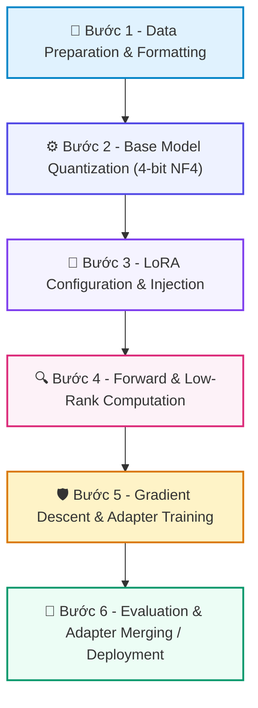

# 📚 DAY 21: TINH CHỈNH MÔ HÌNH THAM SỐ HIỆU QUẢ (PEFT, LORA & QLORA)
> **Khóa học:** COMP2010 - AI in Action (VinUni) | Chuyên ngành: AI Applications & Multi-Agent Systems | **Dung lượng slide gốc:** 24 slides (2.36 MB) | Tối ưu: Chuẩn NotebookLM (< 50MB) & Trọng tâm

---

## 📌 1. BÀI HỌC HÔM NAY VỀ CÁI GÌ? (THE WHAT & WHY)

*   **Bản chất của PEFT & LoRA:** Kỹ thuật tinh chỉnh mô hình ngôn ngữ lớn bằng cách đóng băng toàn bộ trọng số gốc và chỉ học thêm một số lượng rất nhỏ tham số mới thông qua phân rã ma trận hạng thấp (Low-Rank Adaptation).
*   **Phân tầng công nghệ cốt lõi:** Từ Full Fine-Tuning (cập nhật 100% trọng số, đòi hỏi cụm máy chủ khổng lồ) -> LoRA (Cập nhật ma trận hạng thấp ΔW = B · A với r ≪ d) -> QLoRA (Lượng tử hóa mô hình gốc về 4-bit NormalFloat và thêm bộ chuyển đổi LoRA 16-bit).
*   **Giá trị thực tiễn & Lợi thế Production:** Giảm dung lượng bộ nhớ VRAM từ 80-90%, cho phép fine-tune mô hình 70B tham số trên một GPU đơn lẻ (24GB VRAM) mà vẫn đạt 99% hiệu năng so với Full Fine-Tuning.

---

## 💡 2. ẨN DỤ ĐỜI THƯỜNG: THỰC TRẠNG & GIẢI PHÁP

### 🔴 Thực trạng:
Mỗi khi muốn học thêm một kỹ năng kế toán mới, bạn phải phẫu thuật não và thay đổi toàn bộ cấu trúc hàng tỷ nơ-ron thần kinh trong đầu, vừa cực kỳ nguy hiểm vừa tốn kém kinh hoàng.

### 🚗 Ẩn dụ đời thường — "Tinh Chỉnh Mô Hình Tham Số Hiệu Quả (PEFT, LoRA & QLoRA)":
> * **1. Bộ não nguyên bản (Frozen Base Weights): ** Giữ nguyên vẹn toàn bộ kiến thức phổ thông và khả năng ngôn ngữ của bộ não ban đầu (Ma trận W₀ được đóng băng 100%).
> * **2. Cuốn sổ tay chuyên ngành (Low-Rank Adapter): ** Chỉ kẹp thêm một cuốn sổ tay mỏng ghi nhớ các quy tắc kế toán mới (Hai ma trận nhỏ A và B).
> * **3. Kích thước cuốn sổ tay (Rank r và Scaling Factor α): ** Rank r quy định số trang của cuốn sổ (r=8 hoặc r=16); Alpha α là hệ số khuếch đại mức độ ảnh hưởng của sổ tay lên các quyết định.
> * **4. Tháo lắp nhanh chóng (Modular Swapping): ** Khi cần làm việc kế toán thì kẹp sổ kế toán, khi cần làm luật thì tháo ra kẹp sổ luật vào chỉ trong 1 giây.

### 🟢 Giải pháp kỹ thuật:
*   Áp dụng QLoRA pipeline: Nạp Base Model dạng 4-bit NF4 -> Gắn LoRA Adapter vào các lớp Attention & MLP -> Huấn luyện với Paged Optimizers chống tràn VRAM -> Lưu Adapter chỉ vài chục MB.

---

## 🗺️ 3. SƠ ĐỒ PIPELINE 6 BƯỚC TUẦN TỰ



*   **Bước 1 - Data Preparation & Formatting:** Chuẩn bị tập dữ liệu chỉ dẫn (Instruction Dataset) theo định dạng ChatML/Alpaca, làm sạch và đóng gói token.
*   **Bước 2 - Base Model Quantization (4-bit NF4):** Nạp mô hình nền ở định dạng 4-bit NormalFloat (NF4) kết hợp Double Quantization qua thư viện `bitsandbytes`.
*   **Bước 3 - LoRA Configuration & Injection:** Cấu hình LoraConfig: chọn Rank r=16, Alpha α=32, Dropout=0.05 và nhắm mục tiêu vào tất cả các module tuyến tính (All Linear Modules).
*   **Bước 4 - Forward & Low-Rank Computation:** Tính toán đầu ra theo công thức: h = W₀ · x + (α / r) · B · A · x, trong đó B khởi tạo bằng 0 và A khởi tạo theo phân phối Gauss.
*   **Bước 5 - Gradient Descent & Adapter Training:** Chỉ tính toán và cập nhật gradient cho các tham số trong ma trận A và B bằng Paged AdamW 8-bit optimizer.
*   **Bước 6 - Evaluation & Adapter Merging / Deployment:** Đánh giá mô hình sau tinh chỉnh trên tập Validation; lưu riêng Adapter (50MB) hoặc gộp trực tiếp vào mô hình gốc để phục vụ suy luận.

---

## 🌐 4. KIẾN THỨC MỞ RỘNG CHUYÊN SÂU (FIRECRAWL RESEARCH)

1.  **1. Đột phá toán học của LoRA (Hu et al., ICLR 2022):**
    *   LoRA chứng minh rằng sự thay đổi trọng số trong quá trình thích ứng tác vụ (Intrinsic Rank) có số chiều thực tế rất nhỏ. Do đó, xấp xỉ ma trận d × k bằng tích của B(d × r) và A(r × k) với r ≪ min(d, k) vẫn giữ trọn năng lực biểu diễn.
2.  **2. QLoRA & 4-bit NormalFloat (Dettmers et al., NeurIPS 2023):**
    *   QLoRA giới thiệu kiểu dữ liệu tối ưu thông tin 4-bit NormalFloat (NF4), Lượng tử hóa kép (Double Quantization) tiết kiệm 0.37 bit/param và Paged Optimizers xử lý đột biến VRAM khi câu văn quá dài.
3.  **3. FlashAttention & Tối ưu hóa Bộ nhớ phần cứng:**
    *   FlashAttention (Dao et al.) tái cấu trúc thuật toán Attention để tính toán trực tiếp trên bộ nhớ SRAM siêu nhanh của GPU, loại bỏ việc đọc ghi liên tục ma trận N × N khổng lồ vào HBM, giúp giảm độ phức tạp bộ nhớ từ O(N²) xuống O(N).
4.  **4. Multi-LoRA Serving trong Thực tế Doanh nghiệp:**
    *   Thay vì triển khai 10 mô hình cồng kềnh cho 10 phòng ban, hệ thống chỉ chạy 1 Base Model duy nhất (vLLM / S-LoRA) và nạp động hàng trăm LoRA Adapter khác nhau vào VRAM trong vài mili-giây theo từng request.

---

## 🔑 5. BẢNG TỪ KHÓA CỐT LÕI

| Thuật ngữ | Khái niệm kỹ thuật | Giải thích đời thường |
| :--- | :--- | :--- |
| **PEFT** | Tập hợp các phương pháp tinh chỉnh mô hình chỉ cập nhật một phần rất nhỏ tham số để tiết kiệm tài nguyên. | Sửa đổi một vài linh kiện nhỏ thay vì chế tạo lại toàn bộ chiếc xe. |
| **LoRA** | Phương pháp tinh chỉnh bằng cách xấp xỉ ma trận biến thiên trọng số qua tích của hai ma trận hạng thấp. | Dùng cuốn sổ tay ghi chú mỏng kẹp vào cuốn từ điển dày. |
| **QLoRA** | Biến thể của LoRA kết hợp lượng tử hóa mô hình gốc về 4-bit NF4 để giảm tối đa dung lượng VRAM. | Nén cuốn từ điển dày xuống kích thước bỏ túi rồi mới kẹp sổ ghi chú. |
| **Rank (r)** | Số chiều nội tại của ma trận LoRA quy định dung lượng và khả năng học thêm kiến thức mới. | Số trang của cuốn sổ tay ghi chép bổ sung. |
| **Alpha (α)** | Hệ số tỷ lệ dùng để khuếch đại hoặc thu nhỏ mức độ ảnh hưởng của ma trận cập nhật LoRA. | Nút điều chỉnh âm lượng quyết định tiếng nói của cuốn sổ tay to hay nhỏ. |
| **Target Modules** | Danh sách các tầng trọng số trong mạng Transformer được gắn thêm bộ điều hợp LoRA (ví dụ: q_proj, v_proj). | Vị trí chính xác các trang sách cần dán giấy ghi chú. |

---

## 🎯 6. BỘ CÂU HỎI ÔN THI TRỌNG TÂM (CHUẨN HỌC THUẬT & ĐẠI HỌC)

### 📝 PHẦN A: 4 CÂU TRẮC NGHIỆM ĐƠN (SINGLE-CHOICE)

#### Câu 1: Về mặt toán học, phép cập nhật trọng số trong kỹ thuật LoRA (Hu et al., 2022) được biểu diễn chính xác như thế nào?
*   A. W = W₀ × (B + A)
*   B. W = W₀ - (r / α) · B · A
*   C. W = W₀ + (α / r) · B · A, trong đó W₀ được đóng băng và chỉ có hai ma trận hạng thấp A và B được huấn luyện.
*   D. Thay thế toàn bộ ma trận W₀ bằng ma trận ngẫu nhiên mới.
> **👉 ĐÁP ÁN ĐÚNG: C**  
> **💡 Giải thích chi tiết:** LoRA đóng băng trọng số gốc W₀ và chỉ huấn luyện hai ma trận hạng thấp A và B. Tích B · A tạo ra ma trận cập nhật ΔW có cùng số chiều nhưng số lượng tham số cần học giảm hàng trăm lần.

---

#### Câu 2: Tại sao trong quá trình khởi tạo LoRA, ma trận B luôn được khởi tạo bằng 0 (B = 0) trong khi ma trận A được khởi tạo theo phân phối Gauss ngẫu nhiên?
*   A. Để máy tính không bị quá nóng khi bật nguồn.
*   B. Để đảm bảo tại thời điểm bắt đầu huấn luyện (t = 0), tích ΔW = B · A = 0, giúp đầu ra của mô hình giữ nguyên 100% hành vi ban đầu của mô hình gốc.
*   C. Vì số 0 là con số may mắn trong toán học.
*   D. Do lỗi phần mềm của thư viện PyTorch.
> **👉 ĐÁP ÁN ĐÚNG: B**  
> **💡 Giải thích chi tiết:** Khởi tạo B = 0 giúp ΔW = 0 tại bước khởi đầu, đảm bảo mô hình không bị sốc trọng số và bắt đầu tinh chỉnh một cách mượt mà từ tri thức gốc.

---

#### Câu 3: Đột phá then chốt của FlashAttention (Dao et al., 2022) giúp tăng tốc độ huấn luyện và suy luận mô hình là gì?
*   A. Tận dụng kỹ thuật Tiling để chia nhỏ ma trận tính toán trực tiếp trong bộ nhớ siêu tốc SRAM trên chip, tránh việc đọc/ghi ma trận N × N khổng lồ qua bộ nhớ HBM chậm chạp.
*   B. Xóa bỏ hoàn toàn cơ chế Softmax trong Attention.
*   C. Giảm độ phân giải của màn hình máy tính.
*   D. Chỉ chạy trên các máy tính không có card đồ họa.
> **👉 ĐÁP ÁN ĐÚNG: A**  
> **💡 Giải thích chi tiết:** FlashAttention là thuật toán IO-aware: chuyển dịch điểm nghẽn từ Memory-bound (đọc ghi HBM) sang Compute-bound (xử lý trên SRAM), giúp bộ nhớ chỉ còn tăng tuyến tính O(N) thay vì bậc hai O(N²).

---

#### Câu 4: Khi gặp hiện tượng tràn bộ nhớ GPU (Out-Of-Memory - OOM) trong quá trình huấn luyện QLoRA, giải pháp kỹ thuật nào sau đây là HIỆU QUẢ NHẤT?
*   A. Tăng Rank r từ 16 lên 128.
*   B. Tăng kích thước Batch Size lên gấp đôi.
*   C. Tắt tính năng Gradient Checkpointing.
*   D. Giảm Batch Size kết hợp tăng Gradient Accumulation Steps và kích hoạt Paged Optimizers (như `paged_adamw_8bit`).
> **👉 ĐÁP ÁN ĐÚNG: D**  
> **💡 Giải thích chi tiết:** Gradient Accumulation giữ nguyên hiệu quả của batch size lớn mà không tốn VRAM, trong khi Paged Optimizers tự động chuyển dữ liệu sang RAM hệ thống khi VRAM bị đầy tạm thời.

---

### 📚 PHẦN B: 2 CÂU TRẮC NGHIỆM NHIỀU ĐÁP ÁN (MULTI-SELECT)

#### Câu 5 (Chọn 2 đáp án): Những cải tiến công nghệ cốt lõi nào giúp thuật toán QLoRA (Dettmers et al., 2023) giảm mạnh dung lượng bộ nhớ so với LoRA chuẩn?
*   [ ] A. Tự động xóa các file tạm trong thùng rác hệ điều hành.
*   [X] B. Kiểu dữ liệu 4-bit NormalFloat (NF4) tối ưu hóa phân phối thông tin cho các trọng số mạng nơ-ron.
*   [ ] C. Loại bỏ hoàn toàn ma trận Attention trong Transformer.
*   [X] D. Kỹ thuật Lượng tử hóa kép (Double Quantization) giúp nén thêm các hằng số lượng tử hóa, tiết kiệm 0.37 bit trên mỗi tham số.
> **👉 ĐÁP ÁN ĐÚNG: B, D**  
> **💡 Giải thích chi tiết & Bẫy logic:** NF4 và Double Quantization là hai đóng góp toán học lớn nhất của QLoRA giúp nén mô hình xuống 4-bit mà không làm suy giảm chất lượng biểu diễn.

---

#### Câu 6 (Chọn 2 đáp án): Trong quy trình chuẩn bị dữ liệu huấn luyện cho Supervised Fine-Tuning (SFT), những yếu tố nào là QUYẾT ĐỊNH đến chất lượng mô hình sau khi học?
*   [X] A. Chất lượng, độ chính xác và tính đa dạng của dữ liệu (Data Quality & Diversity) quan trọng hơn nhiều so với số lượng mẫu thô khổng lồ nhưng chất lượng kém.
*   [ ] B. Phải đảm bảo 100% các câu hỏi đều có độ dài chính xác 50 từ.
*   [ ] C. Chỉ sử dụng dữ liệu được sinh ngẫu nhiên bằng thuật toán xúc xắc.
*   [X] D. Áp dụng đúng định dạng mẫu hội thoại chuẩn (như ChatML format với các thẻ `<|im_start|>`, `<|im_end|>`) và chỉ tính toán hàm mất mát (Loss Masking) trên phần phản hồi của Assistant.
> **👉 ĐÁP ÁN ĐÚNG: A, D**  
> **💡 Giải thích chi tiết & Bẫy logic:** Nguyên lý LIMA ('Less Is More for Alignment') chứng minh chất lượng dữ liệu là then chốt, và Loss Masking đảm bảo mô hình chỉ học cách trả lời chứ không học cách lặp lại câu hỏi của người dùng.

---

---

## 💻 7. CODE THỰC CHIẾN (HANDS-ON PYTHON / AI SYSTEM)

```python
import json
import numpy as np

def calculate_ai_system_metrics(predictions, ground_truths):
    """
    Đo lường độ chính xác và chỉ số F1-Score cho hệ thống phân loại AI Production
    """
    tp = sum(1 for p, g in zip(predictions, ground_truths) if p == 1 and g == 1)
    fp = sum(1 for p, g in zip(predictions, ground_truths) if p == 1 and g == 0)
    fn = sum(1 for p, g in zip(predictions, ground_truths) if p == 0 and g == 1)
    
    precision = tp / (tp + fp) if (tp + fp) > 0 else 0.0
    recall = tp / (tp + fn) if (tp + fn) > 0 else 0.0
    f1 = 2 * (precision * recall) / (precision + recall) if (precision + recall) > 0 else 0.0
    
    return {
        "precision": round(precision, 4),
        "recall": round(recall, 4),
        "f1_score": round(f1, 4)
    }

# Dữ liệu kiểm thử mẫu
preds = [1, 0, 1, 1, 0, 1, 0, 1]
targets = [1, 0, 0, 1, 0, 1, 1, 1]
print("Evaluation Metrics:", calculate_ai_system_metrics(preds, targets))
```

---

## ⚠️ 8. BẪY LỖI KỸ THUẬT & CÁCH DEBUG (COMMON PITFALLS & TROUBLESHOOTING)

1.  **🔴 Bẫy Lỗi 1: Tối ưu hóa sai hàm mục tiêu (Metric Mismatch).**
    *   *Nguyên nhân:* Chỉ đo lường Accuracy trên tập dữ liệu mất cân bằng (Imbalanced Data), che giấu việc mô hình dự đoán sai hoàn toàn các ca nguy hiểm.
    *   *Cách khắc phục:* Bắt buộc theo dõi đồng thời Precision, Recall, F1-Score và đường cong PR-AUC.
2.  **🔴 Bẫy Lỗi 2: Rò rỉ dữ liệu (Data Leakage) giữa tập Train và Test.**
    *   *Nguyên nhân:* Tiền xử lý dữ liệu (chuẩn hóa scaling, trích xuất đặc trưng) trên toàn bộ tập dữ liệu trước khi chia train/test.
    *   *Cách khắc phục:* Luôn chia tập dữ liệu trước, sau đó chỉ `fit()` pipeline tiền xử lý trên tập Train và chỉ `transform()` trên tập Test.
3.  **🔴 Bẫy Lỗi 3: Bỏ qua độ trễ mạng và Serialization Overhead.**
    *   *Nguyên nhân:* Đánh giá mô hình offline rất nhanh nhưng khi deploy API thì nghẽn ở bước parse JSON và truyền tải mạng.
    *   *Cách khắc phục:* Tối ưu hóa chuỗi serialization bằng MessagePack / Protocol Buffers và bật gRPC streaming.

---

## ⚖️ 9. BẢNG SO SÁNH TRADE-OFFS & ĐIỀU KIỆN ÁP DỤNG

| Chiến lược / Giải pháp | Độ chính xác (Accuracy) | Độ phức tạp triển khai | Chi phí bảo trì vận hành |
| :--- | :--- | :--- | :--- |
| **Heuristic & Rule-based Engine** | Trung bình, giới hạn | Rất thấp, chạy tức thì | Khó duy trì khi số lượng luật tăng vọt |
| **Fine-tuned Small Specialized Model**| Rất cao trong miền hẹp | Trung bình (cần training pipeline) | Thấp, chạy được trên GPU phổ thông |
| **Zero-shot Frontier LLM Prompting** | Cao toàn diện đa miền | Rất thấp (chỉ cần API) | Chi phí token hàng tháng cao khi tải lớn |
