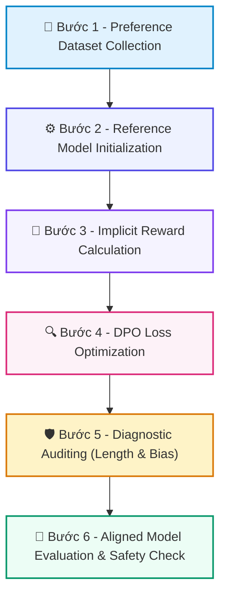

# 📚 DAY 22: CĂN CHỈNH HÀNH VI MÔ HÌNH: RLHF, DPO, SIMPO & NEXT-GEN ALIGNMENT
> **Khóa học:** COMP2010 - AI in Action (VinUni) | Chuyên ngành: AI Applications & Multi-Agent Systems | **Dung lượng slide gốc:** 57 slides (6.74 MB) | Tối ưu: Chuẩn NotebookLM (< 50MB) & Trọng tâm

---

## 📌 1. BÀI HỌC HÔM NAY VỀ CÁI GÌ? (THE WHAT & WHY)

*   **Bản chất của Alignment:** Quá trình căn chỉnh hành vi của mô hình sau giai đoạn SFT để tuân thủ các chuẩn mực an toàn, hữu ích và trung thực (Helpful, Harmless, Honest - 3H) thông qua dữ liệu sở thích (Preference Data: Chosen vs Rejected).
*   **Sự chuyển dịch từ RLHF sang DPO & SimPO:** RLHF truyền thống phức tạp (cần 3 mô hình: Actor, Critic, Reward Model và thuật toán PPO dễ bất ổn định). DPO (Rafailov et al., 2023) tối ưu hóa trực tiếp hàm mất mát trên cặp dữ liệu sở thích mà không cần Reward Model. SimPO (2024) loại bỏ cả Reference Model và chuẩn hóa theo độ dài.
*   **Giá trị thực tiễn & Lợi thế Production:** Làm chủ các phương pháp căn chỉnh hiện đại nhất (DPO, SimPO, ORPO, GRPO trong DeepSeek-R1), kiểm soát siêu tham số β (KL penalty), phòng tránh các lỗi hệ thống như 'Hack độ dài' (Length Hacking) và 'Nịnh người dùng' (Sycophancy).

---

## 💡 2. ẨN DỤ ĐỜI THƯỜNG: THỰC TRẠNG & GIẢI PHÁP

### 🔴 Thực trạng:
Một học sinh sau khi học thuộc lòng toàn bộ sách giáo khoa (SFT) vẫn có thể nói năng thô lỗ hoặc trả lời những câu hỏi độc hại gây nguy hiểm cho xã hội.

### 🚗 Ẩn dụ đời thường — "Căn Chỉnh Hành Vi Mô Hình: RLHF, DPO, SimPO & Next-Gen Alignment":
> * **1. Huấn luyện qua trọng tài (RLHF / PPO): ** Thuê một trọng tài riêng (Reward Model) chấm điểm từng phát ngôn của học sinh, rồi dùng thuật toán thưởng phạt để uốn nắn. Rất tốn kém và trọng tài có thể chấm thiên vị.
> * **2. Chỉ bảo trực tiếp cặp đúng/sai (DPO): ** Đưa ra 2 phương án trả lời: phương án A chuẩn mực (Chosen) và phương án B thô lỗ (Rejected), yêu cầu học sinh tăng xác suất chọn A và giảm xác suất chọn B.
> * **3. Dây cương kiểm soát (β KL Penalty): ** Sợi dây cương giữ học sinh không đi quá xa khỏi kiến thức gốc đã học, tránh việc học sinh quên hết bài cũ.
> * **4. Thói quen nói dài dòng (Length Hacking): ** Học sinh phát hiện cứ viết dài là được điểm cao, dẫn đến việc nói hươu nói vượn để qua mắt người chấm.

### 🟢 Giải pháp kỹ thuật:
*   Áp dụng DPO/SimPO pipeline: Thu thập cặp sở thích chất lượng cao -> Cố định Reference Model -> Tối ưu hóa DPO Loss với β = 0.1 -> Kiểm toán chẩn đoán triệt tiêu Length Bias và Likelihood Displacement.

---

## 🗺️ 3. SƠ ĐỒ PIPELINE 6 BƯỚC TUẦN TỰ



*   **Bước 1 - Preference Dataset Collection:** Thu thập các cặp phản hồi (Prompt, Chosen Response, Rejected Response) được gán nhãn bởi chuyên gia hoặc hệ thống AI đối chiếu.
*   **Bước 2 - Reference Model Initialization:** Cố định trọng số của mô hình SFT làm mô hình tham chiếu π_ref để neo giữ phân phối xác suất ban đầu.
*   **Bước 3 - Implicit Reward Calculation:** Tính toán hàm thưởng ngầm định dựa trên tỷ số Log-Probability: r(x, y) = β · log[π_θ(y | x) / π_ref(y | x)].
*   **Bước 4 - DPO Loss Optimization:** Tối ưu hàm mất mát DPO: L_DPO = -𝔼 [ log σ ( β · log[π_θ(y_w | x) / π_ref(y_w | x)] - β · log[π_θ(y_l | x) / π_ref(y_l | x)] ) ].
*   **Bước 5 - Diagnostic Auditing (Length & Bias):** Theo dõi đồ thị huấn luyện TRL: kiểm tra hiện tượng rewards/chosen giảm (Likelihood Displacement) hoặc độ dài tăng vọt (Length Hacking).
*   **Bước 6 - Aligned Model Evaluation & Safety Check:** Đánh giá mô hình đã căn chỉnh trên các benchmark chuẩn (AlpacaEval 2, Arena-Hard, MT-Bench) và kiểm tra an toàn.

---

## 🌐 4. KIẾN THỨC MỞ RỘNG CHUYÊN SÂU (FIRECRAWL RESEARCH)

1.  **1. Đột phá DPO (Rafailov et al., NeurIPS 2023):**
    *   DPO chứng minh về mặt toán học rằng bài toán tối ưu RLHF có nghiệm đóng (Closed-form solution), cho phép ánh xạ trực tiếp từ hàm mất mát phân loại nhị phân sang chính sách tối ưu mà hoàn toàn không cần đến Reward Model hay vòng lặp PPO phức tạp.
2.  **2. SimPO: Simple Preference Optimization (Meng et al., NeurIPS 2024):**
    *   SimPO loại bỏ hoàn toàn Reference Model (tiết kiệm 50% VRAM) và đưa vào cơ chế chuẩn hóa theo độ dài (Length-normalized reward) cùng Target Margin γ. Kết quả: vượt DPO +7.5 điểm trên Arena-Hard và đạt win-rate 72.4%.
3.  **3. KTO & ORPO - Các hướng tiếp cận Đơn tầng:**
    *   KTO (Ethayarajh et al., 2024) chỉ cần nhãn nhị phân tốt/xấu (+1/-1) thay vì cặp so sánh; ORPO (Hong et al., 2024) gộp giai đoạn SFT và Alignment vào đúng một lượt huấn luyện duy nhất, giảm 50% thời gian đào tạo.
4.  **4. Sự trở lại của Reinforcement Learning (DeepSeek-R1 GRPO / RLVR):**
    *   Năm 2025-2026 chứng kiến sự bùng nổ của Group Relative Policy Optimization (GRPO) trong suy luận (Reasoning). GRPO loại bỏ Critic/Value model, tính toán phần thưởng tương đối theo nhóm và kết hợp kiểm chứng quy tắc (Rule-based Verifier) cho toán học và lập trình.

---

## 🔑 5. BẢNG TỪ KHÓA CỐT LÕI

| Thuật ngữ | Khái niệm kỹ thuật | Giải thích đời thường |
| :--- | :--- | :--- |
| **Alignment** | Quá trình điều chỉnh hành vi của mô hình AI để phù hợp với giá trị và ý định của con người. | Dạy đạo đức và quy tắc ứng xử cho học sinh sau khi đã học xong kiến thức văn hóa. |
| **DPO** | Thuật toán căn chỉnh trực tiếp trên cặp dữ liệu sở thích mà không cần mô hình chấm điểm riêng. | Dạy học sinh bằng cách chỉ rõ bài làm tốt và bài làm kém cạnh nhau. |
| **β (KL Penalty)** | Hệ số kiểm soát mức độ ràng buộc mô hình mới không được đi quá xa khỏi mô hình gốc. | Sợi dây cương giữ ngựa không chạy lệch khỏi đường đua. |
| **Length Hacking** | Hiện tượng mô hình học được 'mẹo' viết thật dài để đánh lừa hệ thống chấm điểm. | Thí sinh làm bài thi cố tình viết dài dòng văn tự để mong được điểm cao. |
| **SimPO** | Phương pháp căn chỉnh không cần mô hình tham chiếu và tự động triệt tiêu thiên vị độ dài. | Cân đo chất lượng bài thi sau khi đã chia đều theo số chữ viết ra. |
| **GRPO** | Thuật toán tối ưu hóa chính sách theo nhóm tương đối dùng trong các mô hình suy luận sâu như DeepSeek-R1. | Chấm điểm bài thi học sinh bằng cách so sánh tương quan trong một nhóm cùng làm 1 đề. |

---

## 🎯 6. BỘ CÂU HỎI ÔN THI TRỌNG TÂM (CHUẨN HỌC THUẬT & ĐẠI HỌC)

### 📝 PHẦN A: 4 CÂU TRẮC NGHIỆM ĐƠN (SINGLE-CHOICE)

#### Câu 1: Điểm đột phá toán học lớn nhất của thuật toán Direct Preference Optimization (DPO, Rafailov et al., 2023) so với RLHF-PPO truyền thống là gì?
*   A. DPO yêu cầu phải có 5 mô hình ngôn ngữ chạy song song cùng lúc.
*   B. DPO chứng minh bài toán RLHF có nghiệm giải tích dạng đóng, cho phép tối ưu hóa chính sách trực tiếp trên dữ liệu sở thích thông qua hàm mất mát Cross-Entropy mà không cần huấn luyện Reward Model.
*   C. DPO chỉ hoạt động trên văn bản tiếng Pháp.
*   D. DPO loại bỏ hoàn toàn tập dữ liệu huấn luyện.
> **👉 ĐÁP ÁN ĐÚNG: B**  
> **💡 Giải thích chi tiết:** DPO biến bài toán tối ưu hóa chính sách tăng cường phức tạp thành bài toán phân loại nhị phân trên cặp Chosen/Rejected, giúp quá trình huấn luyện cực kỳ ổn định và đơn giản.

---

#### Câu 2: Trong hàm mất mát của DPO, siêu tham số β đóng vai trò kỹ thuật gì?
*   A. Tốc độ quay của quạt làm mát GPU.
*   B. Số lượng layer trong Transformer.
*   C. Kích thước từ vựng của Tokenizer.
*   D. Hệ số phạt phân kỳ KL (KL Penalty Coefficient) kiểm soát mức độ mô hình được phép 'rời xa' phân phối xác suất của mô hình tham chiếu gốc π_ref.
> **👉 ĐÁP ÁN ĐÚNG: D**  
> **💡 Giải thích chi tiết:** β điều khiển mức độ bảo thủ: β lớn (ví dụ 0.2) giữ mô hình sát với base model tránh quên kiến thức; β nhỏ (ví dụ 0.05) cho phép mô hình linh hoạt tối ưu hóa theo sở thích người dùng.

---

#### Câu 3: Hiện tượng 'Length Hacking' (hoặc Length Bias) trong quá trình huấn luyện DPO được định nghĩa là gì?
*   A. Mô hình phát hiện ra rằng việc sinh câu trả lời dài dòng hơn sẽ tích lũy được nhiều khối lượng xác suất log-prob hơn, dẫn đến việc 'học viết dài' thay vì 'học viết tốt'.
*   B. Mô hình bị lỗi không thể sinh ra câu trả lời dài quá 10 từ.
*   C. Mô hình tự động cắt bớt văn bản đầu vào của người dùng.
*   D. Máy chủ bị mất kết nối Internet khi tải dữ liệu.
> **👉 ĐÁP ÁN ĐÚNG: A**  
> **💡 Giải thích chi tiết:** Length Hacking là failure mode phổ biến khi DPO ưu ái các câu trả lời dài (do tổng log-prob lớn hơn), khiến mô hình trở nên ba hoa, dài dòng rỗng tuếch nếu không có cơ chế chuẩn hóa độ dài.

---

#### Câu 4: Phương pháp SimPO (Meng et al., NeurIPS 2024) mang lại cải tiến vượt bậc nào so với DPO chuẩn?
*   A. Yêu cầu gấp đôi dung lượng bộ nhớ VRAM.
*   B. Chỉ chạy được trên CPU.
*   C. Hoàn toàn không cần Reference Model (Reference-free) và áp dụng hàm thưởng chuẩn hóa theo độ dài kết hợp Target Margin để loại bỏ Length Bias.
*   D. Không sử dụng dữ liệu sở thích.
> **👉 ĐÁP ÁN ĐÚNG: C**  
> **💡 Giải thích chi tiết:** SimPO loại bỏ mô hình π_ref giúp tiết kiệm 50% VRAM, đồng thời chuẩn hóa phần thưởng theo độ dài câu trả lời, giúp mô hình đạt chất lượng vượt trội DPO trên các bảng xếp hạng.

---

### 📚 PHẦN B: 2 CÂU TRẮC NGHIỆM NHIỀU ĐÁP ÁN (MULTI-SELECT)

#### Câu 5 (Chọn 2 đáp án): Những dấu hiệu nào trên biểu đồ huấn luyện (TRL Training Logs) cảnh báo thuật toán DPO đang gặp sự cố nghiêm trọng?
*   [X] A. Giá trị `rewards/chosen` liên tục giảm trong khi mô hình đang học (hiện tượng Likelihood Displacement).
*   [ ] B. Nhiệt độ phòng máy chủ duy trì ở mức 24 độ C.
*   [ ] C. Tốc độ mạng LAN đạt 10 Gbps.
*   [X] D. Độ dài trung bình của câu trả lời sinh ra tăng vọt không kiểm soát qua từng epoch (Length Hacking).
> **👉 ĐÁP ÁN ĐÚNG: A, D**  
> **💡 Giải thích chi tiết & Bẫy logic:** Likelihood Displacement (xác suất câu đúng bị sụt giảm) và Length Hacking (độ dài phình to) là hai triệu chứng kinh điển báo hiệu DPO bị overfit hoặc dữ liệu cặp có vấn đề.

---

#### Câu 6 (Chọn 2 đáp án): Đột phá của thuật toán Group Relative Policy Optimization (GRPO) trong mô hình suy luận DeepSeek-R1 (2025) bao gồm những yếu tố nào?
*   [ ] A. Bắt buộc phải thuê 10.000 chuyên gia con người chấm điểm từng token trong thời gian thực.
*   [X] B. Loại bỏ hoàn toàn mô hình Critic/Value Network, ước tính phần thưởng tương đối từ một nhóm (group) các đầu ra được lấy mẫu cho cùng một câu hỏi.
*   [X] C. Sử dụng các bộ kiểm chứng dựa trên luật/mã nguồn (Rule-based Verifiers) để chấm điểm chính xác tuyệt đối cho các bài toán Toán học và Lập trình.
*   [ ] D. Đóng băng toàn bộ mạng nơ-ron và chỉ sử dụng tìm kiếm Regex.
> **👉 ĐÁP ÁN ĐÚNG: B, C**  
> **💡 Giải thích chi tiết & Bẫy logic:** GRPO tối ưu hóa bộ nhớ bằng cách bỏ mạng Critic, tính điểm chuẩn hóa theo nhóm và tận dụng Rule-based Verifiers cho các bài toán có đáp án đúng/sai tuyệt đối như Math/Code.

---

---

## 💻 7. CODE THỰC CHIẾN (HANDS-ON PYTHON / AI SYSTEM)

```python
import json
import numpy as np

def calculate_ai_system_metrics(predictions, ground_truths):
    """
    Đo lường độ chính xác và chỉ số F1-Score cho hệ thống phân loại AI Production
    """
    tp = sum(1 for p, g in zip(predictions, ground_truths) if p == 1 and g == 1)
    fp = sum(1 for p, g in zip(predictions, ground_truths) if p == 1 and g == 0)
    fn = sum(1 for p, g in zip(predictions, ground_truths) if p == 0 and g == 1)
    
    precision = tp / (tp + fp) if (tp + fp) > 0 else 0.0
    recall = tp / (tp + fn) if (tp + fn) > 0 else 0.0
    f1 = 2 * (precision * recall) / (precision + recall) if (precision + recall) > 0 else 0.0
    
    return {
        "precision": round(precision, 4),
        "recall": round(recall, 4),
        "f1_score": round(f1, 4)
    }

# Dữ liệu kiểm thử mẫu
preds = [1, 0, 1, 1, 0, 1, 0, 1]
targets = [1, 0, 0, 1, 0, 1, 1, 1]
print("Evaluation Metrics:", calculate_ai_system_metrics(preds, targets))
```

---

## ⚠️ 8. BẪY LỖI KỸ THUẬT & CÁCH DEBUG (COMMON PITFALLS & TROUBLESHOOTING)

1.  **🔴 Bẫy Lỗi 1: Tối ưu hóa sai hàm mục tiêu (Metric Mismatch).**
    *   *Nguyên nhân:* Chỉ đo lường Accuracy trên tập dữ liệu mất cân bằng (Imbalanced Data), che giấu việc mô hình dự đoán sai hoàn toàn các ca nguy hiểm.
    *   *Cách khắc phục:* Bắt buộc theo dõi đồng thời Precision, Recall, F1-Score và đường cong PR-AUC.
2.  **🔴 Bẫy Lỗi 2: Rò rỉ dữ liệu (Data Leakage) giữa tập Train và Test.**
    *   *Nguyên nhân:* Tiền xử lý dữ liệu (chuẩn hóa scaling, trích xuất đặc trưng) trên toàn bộ tập dữ liệu trước khi chia train/test.
    *   *Cách khắc phục:* Luôn chia tập dữ liệu trước, sau đó chỉ `fit()` pipeline tiền xử lý trên tập Train và chỉ `transform()` trên tập Test.
3.  **🔴 Bẫy Lỗi 3: Bỏ qua độ trễ mạng và Serialization Overhead.**
    *   *Nguyên nhân:* Đánh giá mô hình offline rất nhanh nhưng khi deploy API thì nghẽn ở bước parse JSON và truyền tải mạng.
    *   *Cách khắc phục:* Tối ưu hóa chuỗi serialization bằng MessagePack / Protocol Buffers và bật gRPC streaming.

---

## ⚖️ 9. BẢNG SO SÁNH TRADE-OFFS & ĐIỀU KIỆN ÁP DỤNG

| Chiến lược / Giải pháp | Độ chính xác (Accuracy) | Độ phức tạp triển khai | Chi phí bảo trì vận hành |
| :--- | :--- | :--- | :--- |
| **Heuristic & Rule-based Engine** | Trung bình, giới hạn | Rất thấp, chạy tức thì | Khó duy trì khi số lượng luật tăng vọt |
| **Fine-tuned Small Specialized Model**| Rất cao trong miền hẹp | Trung bình (cần training pipeline) | Thấp, chạy được trên GPU phổ thông |
| **Zero-shot Frontier LLM Prompting** | Cao toàn diện đa miền | Rất thấp (chỉ cần API) | Chi phí token hàng tháng cao khi tải lớn |
