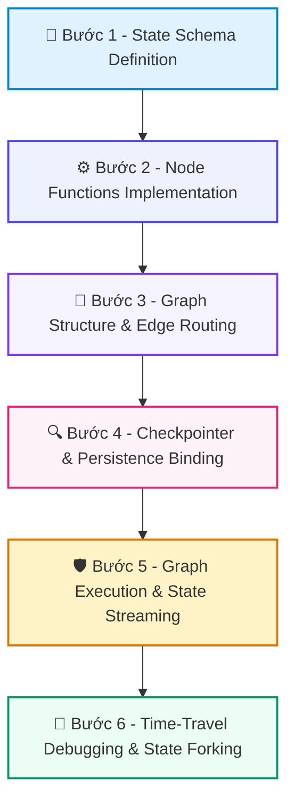

# 📚 DAY 23: LANGGRAPH & ĐIỀU PHỐI LUỒNG TRẠNG THÁI (STATE MACHINES CHO AGENTS)
> **Khóa học:** COMP2010 - AI in Action (VinUni) | Chuyên ngành: AI Applications & Multi-Agent Systems | **Dung lượng slide gốc:** 36 slides (4.06 MB) | Tối ưu: Chuẩn NotebookLM (< 50MB) & Trọng tâm

---

## 📌 1. BÀI HỌC HÔM NAY VỀ CÁI GÌ? (THE WHAT & WHY)

*   **Bản chất của LangGraph:** Framework điều phối Agent dưới dạng Máy trạng thái hữu hạn có chu trình (Cyclic State Machine / StateGraph), cho phép kiểm soát luồng thực thi, vòng lặp tự sửa lỗi và tích hợp con người vào quy trình (Human-in-the-loop).
*   **Phân tầng công nghệ cốt lõi:** Từ LCEL (Chuỗi đồ thị phi chu trình có hướng DAG một chiều, không hỗ trợ vòng lặp) -> LangGraph StateGraph (Nodes, Edges, Conditional Edges) -> Reducers (Quản lý xung đột cập nhật trạng thái) -> Checkpointers (Lưu vết bền vững và Time-Travel).
*   **Giá trị thực tiễn & Lợi thế Production:** Mang lại khả năng kiểm soát tất định (Deterministic Control) trên các hành vi bất định của LLM. Khả năng tạm dừng (Pause), tua lại lịch sử (Time-travel) và sửa trạng thái (State Forking) khi gặp lỗi trong môi trường thực tế.

---

## 💡 2. ẨN DỤ ĐỜI THƯỜNG: THỰC TRẠNG & GIẢI PHÁP

### 🔴 Thực trạng:
Một dây chuyền sản xuất tự động nếu gặp một sản phẩm lỗi ở giữa chừng sẽ vứt bỏ toàn bộ sản phẩm và tắt máy, không thể đưa sản phẩm quay lại trạm trước để sửa chữa.

### 🚗 Ẩn dụ đời thường — "LangGraph & Điều Phối Luồng Trạng Thái (State Machines cho Agents)":
> * **1. Bảng trạng thái hồ sơ (State Schema): ** Chiếc kẹp tài liệu chứa toàn bộ hồ sơ bệnh án của bệnh nhân (Input, Messages, Current Diagnosis, Next Step).
> * **2. Các phòng khám chuyên khoa (Nodes): ** Mỗi phòng khám (Bác sĩ xét nghiệm, Bác sĩ chẩn đoán hình ảnh) đọc hồ sơ, cập nhật thêm kết quả xét nghiệm mới vào kẹp tài liệu.
> * **3. Biển chỉ dẫn có điều kiện (Conditional Edges): ** Nếu kết quả máu bất thường -> Chỉ định sang phòng Sinh thiết; Nếu bình thường -> Cho xuất viện.
> * **4. Sao lưu bệnh án định kỳ (Checkpointers): ** Hệ thống tự động lưu bản sao hồ sơ sau mỗi lần khám. Bác sĩ có thể mở lại bệnh án tuần trước để điều chỉnh phác đồ điều trị.

### 🟢 Giải pháp kỹ thuật:
*   Thiết kế StateGraph chuẩn: Khởi tạo State Schema với Annotated Reducers -> Định nghĩa các Nodes xử lý -> Thêm Conditional Edges phân luồng -> Gắn MemorySaver/PostgresSaver làm Checkpointer.

---

## 🗺️ 3. SƠ ĐỒ PIPELINE 6 BƯỚC TUẦN TỰ



*   **Bước 1 - State Schema Definition:** Định nghĩa cấu trúc dữ liệu TypedDict/Pydantic chứa toàn bộ biến trạng thái kèm Annotated Reducers (ví dụ: `operator.add`).
*   **Bước 2 - Node Functions Implementation:** Viết các hàm thực thi Node: nhận trạng thái hiện tại (state), thực hiện tác vụ và trả về từ điển cập nhật trạng thái.
*   **Bước 3 - Graph Structure & Edge Routing:** Tạo StateGraph, thêm các nút (`builder.add_node`), thiết lập điểm bắt đầu (`START`) và các cạnh có điều kiện (`add_conditional_edges`).
*   **Bước 4 - Checkpointer & Persistence Binding:** Biên dịch đồ thị (`builder.compile(checkpointer=checkpointer)`), cấu hình luồng ngắt `interrupt_before` hoặc `interrupt_after` cho HITL.
*   **Bước 5 - Graph Execution & State Streaming:** Chạy đồ thị với `thread_id` duy nhất, lắng nghe dòng sự kiện phát ra (streaming updates) qua từng nút.
*   **Bước 6 - Time-Travel Debugging & State Forking:** Khi gặp sự cố, truy vấn `graph.get_state_history(config)`, chỉnh sửa trạng thái bị lỗi và tiếp tục thực thi từ điểm ngắt.

---

## 🌐 4. KIẾN THỨC MỞ RỘNG CHUYÊN SÂU (FIRECRAWL RESEARCH)

1.  **1. Cơ chế State Reducer trong LangGraph:**
    *   Nếu hai nút cùng ghi đè vào một trường danh sách `messages`, hệ thống sẽ mất dữ liệu cũ. Reducer `operator.add` hoặc `add_messages` tự động nối thêm tin nhắn mới và hợp nhất ID, chống ghi đè ngoài ý muốn.
2.  **2. Time-Travel & Debugging trong Production:**
    *   LangGraph lưu trữ mỗi bước chuyển trạng thái (State Transition) thành một checkpoint có ID riêng biệt. Lập trình viên có thể 'tua ngược thời gian' (Time-Travel) về checkpoint số 3, sửa lại biến `query` và cho đồ thị chạy tiếp theo nhánh mới (Branch Forking).
3.  **3. Quản trị Bộ nhớ Phiên làm việc (Short-term vs Long-term Memory):**
    *   Checkpointer quản lý bộ nhớ ngắn hạn trong 1 phiên trò chuyện (Thread). Để lưu trí nhớ dài hạn xuyên suốt nhiều tuần, LangGraph tích hợp Store API kết hợp Vector Indexing (như Chroma/Pinecone).
4.  **4. Khả năng Chịu lỗi và Tự phục hồi (Fault Tolerance):**
    *   Khi một Node gọi API bên ngoài bị timeout (504 Gateway Timeout), LangGraph tự động kích hoạt chính sách Retry Policy gắn kèm tại Node đó mà không làm sập toàn bộ đồ thị.

---

## 🔑 5. BẢNG TỪ KHÓA CỐT LÕI

| Thuật ngữ | Khái niệm kỹ thuật | Giải thích đời thường |
| :--- | :--- | :--- |
| **StateGraph** | Lớp cốt lõi trong LangGraph biểu diễn máy trạng thái gồm các nút và các cạnh chuyển tiếp. | Bản đồ quy trình làm việc với các phòng ban và biển chỉ dẫn đường đi. |
| **Reducer** | Hàm quy định cách thức cập nhật hoặc gộp dữ liệu mới vào trạng thái hiện tại của State. | Quy tắc ghi thêm thông tin vào sổ tay mà không được xóa dòng chữ cũ. |
| **Checkpointer** | Cơ chế lưu trữ trạng thái của đồ thị vào cơ sở dữ liệu sau mỗi bước thực thi. | Tính năng tự động lưu game (Auto-save) sau mỗi màn chơi. |
| **Time-Travel** | Khả năng quay ngược lại một trạng thái trong quá khứ để xem lại hoặc sửa đổi và chạy tiếp. | Cỗ máy thời gian đưa bạn về quá khứ để sửa chữa một quyết định sai lầm. |
| **Conditional Edge** | Cạnh rẽ nhánh dựa trên hàm điều kiện để quyết định nút tiếp theo cần thực thi. | Ngã ba đường có biển báo: xe tải rẽ phải, xe con rẽ trái. |
| **Interrupt** | Lệnh tạm dừng đồ thị trước hoặc sau một nút để chờ con người phê duyệt hoặc nhập thêm dữ liệu. | Đèn đỏ bắt xe phải dừng lại chờ người gác chắn tàu hỏa mở đường. |

---

## 🎯 6. BỘ CÂU HỎI ÔN THI TRỌNG TÂM (CHUẨN HỌC THUẬT & ĐẠI HỌC)

### 📝 PHẦN A: 4 CÂU TRẮC NGHIỆM ĐƠN (SINGLE-CHOICE)

#### Câu 1: Hạn chế kỹ thuật lớn nhất của chuỗi LCEL (LangChain Expression Language) so với LangGraph khi xây dựng AI Agent là gì?
*   A. LCEL chỉ chạy được trên hệ điều hành Linux.
*   B. LCEL không hỗ trợ ngôn ngữ Python.
*   C. LCEL bắt buộc phải kết nối Bluetooth.
*   D. LCEL được thiết kế theo cấu trúc đồ thị phi chu trình (DAG) một chiều, không hỗ trợ các vòng lặp (Cycles) và máy trạng thái cần thiết cho việc tự sửa lỗi và lặp lại.
> **👉 ĐÁP ÁN ĐÚNG: D**  
> **💡 Giải thích chi tiết:** Agent thực tế đòi hỏi vòng lặp suy luận - hành động - đánh giá (Cyclic Loops). LCEL thuần túy chỉ là DAG tuyến tính, trong khi LangGraph giải quyết triệt để bài toán chu trình.

---

#### Câu 2: Trong LangGraph, nếu một trường dữ liệu dạng danh sách trong State không được gán hàm Reducer (ví dụ `operator.add`), điều gì sẽ xảy ra khi một Node cập nhật trường đó?
*   A. Dữ liệu mới trả về từ Node sẽ GHI ĐÈ HOÀN TOÀN (Overwrite) lên dữ liệu cũ, làm mất toàn bộ lịch sử trước đó của trường đó.
*   B. Dữ liệu tự động được nhân đôi.
*   C. Máy chủ sẽ phát ra âm thanh cảnh báo.
*   D. Ngắt vòng lặp ReAct khi số bước suy luận vượt quá max_iterations mà không đạt tool call hợp lệ.
> **👉 ĐÁP ÁN ĐÚNG: A**  
> **💡 Giải thích chi tiết:** Mặc định trong LangGraph, cập nhật state là phép ghi đè (Overwrite). Để tích lũy lịch sử (như danh sách tin nhắn), bắt buộc phải dùng Annotated Reducer như `add_messages`.

---

#### Câu 3: Tính năng 'Time Travel' trong LangGraph hoạt động dựa trên thành phần kiến trúc nào?
*   A. Đồng hồ nguyên tử trên vệ tinh GPS.
*   B. Hệ thống Checkpointer bền vững lưu lại toàn bộ ảnh chụp trạng thái (State Snapshots) của đồ thị sau mỗi bước thực thi tại mỗi checkpoint ID duy nhất.
*   C. Tốc độ quay của đĩa cứng máy chủ.
*   D. Card màn hình chuyên dụng cho AI.
> **👉 ĐÁP ÁN ĐÚNG: B**  
> **💡 Giải thích chi tiết:** Mỗi node chạy xong, Checkpointer lưu một snapshot trạng thái. Khả năng truy xuất lại bất kỳ snapshot nào trong quá khứ chính là nền tảng của tính năng Time-Travel.

---

#### Câu 4: Để thiết lập điểm dừng chờ con người phê duyệt trước khi Agent thực hiện hành động nguy hiểm (như gửi email hoặc xóa database), cú pháp biên dịch trong LangGraph là gì?
*   A. `builder.compile(delete_all=True)`
*   B. `builder.compile(fast_mode=True)`
*   C. `builder.compile(checkpointer=checkpointer, interrupt_before=['danger_node'])`
*   D. `builder.compile(no_stop=True)`
> **👉 ĐÁP ÁN ĐÚNG: C**  
> **💡 Giải thích chi tiết:** Tham số `interrupt_before=['danger_node']` chỉ thị cho LangGraph tạm dừng thực thi ngay trước khi bước vào nút nguy hiểm, cho phép giao diện người dùng hiển thị form xin phê duyệt.

---

### 📚 PHẦN B: 2 CÂU TRẮC NGHIỆM NHIỀU ĐÁP ÁN (MULTI-SELECT)

#### Câu 5 (Chọn 2 đáp án): Những thành phần cốt lõi nào bắt buộc phải có khi khởi tạo một đồ thị LangGraph StateGraph?
*   [X] A. State Schema: Cấu trúc dữ liệu trạng thái định nghĩa các biến mà các Node dùng chung.
*   [ ] B. Cáp quang biển quốc tế kết nối trực tiếp.
*   [X] C. Nodes (các hàm thực thi xử lý logic) và Edges (các đường nối định tuyến luồng thực thi).
*   [ ] D. Hệ thống làm mát bằng chất lỏng cho CPU.
> **👉 ĐÁP ÁN ĐÚNG: A, C**  
> **💡 Giải thích chi tiết & Bẫy logic:** State Schema, Nodes và Edges là 3 trụ cột bắt buộc để xây dựng bất kỳ đồ thị trạng thái nào trong LangGraph.

---

#### Câu 6 (Chọn 2 đáp án): Khi một ứng dụng Agent chạy trên LangGraph gặp sự cố mất điện máy chủ ở giữa chừng, tính năng nào giúp hệ thống phục hồi lại trạng thái mà không phải chạy lại từ đầu?
*   [ ] A. Tự động mua máy chủ mới trên điện toán đám mây.
*   [X] B. Đọc lại Checkpoint gần nhất từ cơ sở dữ liệu bền vững (như PostgresSaver hoặc MongoSaver) dựa trên `thread_id`.
*   [ ] C. Xóa sạch toàn bộ dữ liệu người dùng để tránh lỗi.
*   [X] D. Tiếp tục thực thi đồ thị từ Node đang dang dở bằng cách truyền đúng `thread_id` vào hàm `stream` hoặc `invoke`.
> **👉 ĐÁP ÁN ĐÚNG: B, D**  
> **💡 Giải thích chi tiết & Bẫy logic:** B và D là cơ chế phục hồi sau thảm họa (Fault Recovery): Checkpointer lưu trên database cho phép tải lại state của thread và tiếp tục chạy tiếp điểm đứt gãy.

---

---

## 💻 7. CODE THỰC CHIẾN (HANDS-ON PYTHON / LANGGRAPH)

```python
from typing import TypedDict, Annotated, List
import operator
from langgraph.graph import StateGraph, END

# 1. Định nghĩa Agent State Schema với Reducer
class AgentState(TypedDict):
    messages: Annotated[List[str], operator.add]
    attempt_count: int
    is_success: bool

# 2. Định nghĩa các Node xử lý trong đồ thị
def actor_node(state: AgentState):
    current_attempt = state.get("attempt_count", 0) + 1
    new_message = f"Actor generated plan attempt #{current_attempt}"
    return {"messages": [new_message], "attempt_count": current_attempt}

def evaluator_node(state: AgentState):
    # Logic tự chấm điểm và đánh giá
    success = state["attempt_count"] >= 2 # Giả lập thành công ở vòng 2
    return {"is_success": success}

# 3. Hàm phân nhánh có điều kiện (Conditional Routing)
def check_completion(state: AgentState):
    if state["is_success"]:
        return "end"
    if state["attempt_count"] >= 3:
        return "end"
    return "retry"

# 4. Xây dựng đồ thị trạng thái
workflow = StateGraph(AgentState)
workflow.add_node("actor", actor_node)
workflow.add_node("evaluator", evaluator_node)
workflow.set_entry_point("actor")
workflow.add_edge("actor", "evaluator")
workflow.add_conditional_edges("evaluator", check_completion, {
    "end": END,
    "retry": "actor"
})

app = workflow.compile()
final_state = app.invoke({"messages": ["Initial Task"], "attempt_count": 0, "is_success": False})
print("Final Trajectory:", final_state["messages"])
```

---

## ⚠️ 8. BẪY LỖI KỸ THUẬT & CÁCH DEBUG (COMMON PITFALLS & TROUBLESHOOTING)

1.  **🔴 Bẫy Lỗi 1: Vòng lặp vô tận (Infinite Loop) do thiếu Guardrail dừng.**
    *   *Nguyên nhân:* Tác tử liên tục gọi lại cùng một công cụ với tham số lỗi mà không có giới hạn số lần thử.
    *   *Cách khắc phục:* Luôn cài đặt `max_iterations` cứng (ví dụ max = 5) và cơ chế Circuit Breaker trong Graph State.
2.  **🔴 Bẫy Lỗi 2: Tràn cửa sổ ngữ cảnh (Context Bloat) khi tích lũy Trajectory.**
    *   *Nguyên nhân:* Toàn bộ log gọi tool thô được nối dồn vào prompt khiến token bùng nổ và mô hình bị suy giảm chú ý.
    *   *Cách khắc phục:* Sử dụng cơ chế Sliding Window Memory chỉ giữ 3-5 bước gần nhất kết hợp tóm tắt tự động (Summary Reducer).
3.  **🔴 Bẫy Lỗi 3: Tác tử bị mắc kẹt vào các giả định sai lầm (Cascading Hallucination).**
    *   *Nguyên nhân:* ReAct truyền thống không có bước Reflector để phủ định kết luận trung gian sai lầm.
    *   *Cách khắc phục:* Nâng cấp lên kiến trúc Reflexion hoặc LATS với Evaluator độc lập kiểm định chứng cứ.

---

## ⚖️ 9. BẢNG SO SÁNH TRADE-OFFS & ĐIỀU KIỆN ÁP DỤNG

| Mô hình Kiến trúc | Ưu điểm cốt lõi | Nhược điểm & Chi phí | Tình huống áp dụng tối ưu |
| :--- | :--- | :--- | :--- |
| **Single-Agent ReAct** | Đơn giản, độ trễ thấp, ít tốn token | Dễ rơi vào lỗi lan tỏa và vòng lặp vô tận | Tác vụ đơn giản 1-2 bước gọi tool API |
| **Reflexion Agent** | Tự sửa lỗi sau thất bại, tăng accuracy 20-30% | Tăng số lần gọi LLM (2x-3x token cost) | Sinh mã nguồn, giải toán, kiểm tra dữ liệu |
| **Hierarchical Multi-Agent (Supervisor)** | Cô lập ngữ cảnh chuyên môn, xử lý bài toán lớn | Phức tạp trong cấu hình, độ trễ cao | Hệ thống doanh nghiệp đa phòng ban, phân tích dữ liệu |
