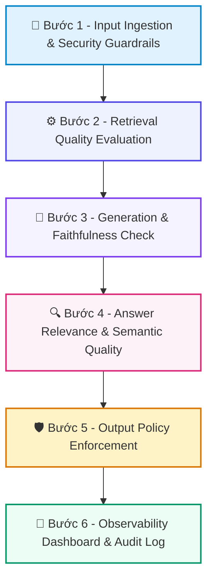

# 📚 DAY 24: ĐO LƯỜNG & BẢO VỆ AGENT: RAGAS, LLM-AS-JUDGE & SAFETY GUARDRAILS
> **Khóa học:** COMP2010 - AI in Action (VinUni) | Chuyên ngành: AI Applications & Multi-Agent Systems | **Dung lượng slide gốc:** 74 slides (9.81 MB) | Tối ưu: Chuẩn NotebookLM (< 50MB) & Trọng tâm

---

## 📌 1. BÀI HỌC HÔM NAY VỀ CÁI GÌ? (THE WHAT & WHY)

*   **Bản chất của RAGAS & Safety Guardrails:** Khung đo lường chất lượng toàn diện (RAG Triad) và hệ thống phòng thủ đa tầng (Input/Output Guardrails) bảo vệ Agent khỏi ảo giác, lộ dữ liệu nhạy cảm (PII) và các cuộc tấn công Prompt Injection.
*   **Phân tầng công nghệ cốt lõi:** Từ RAG Triad (Faithfulness, Answer Relevance, Context Precision, Context Recall) -> LLM-as-Judge tự động hóa -> Input Guardrails (Llama Guard, NeMo Guardrails, Presidio PII Masking) -> Output Hallucination Filters.
*   **Giá trị thực tiễn & Lợi thế Production:** Giảm 99% rủi ro rò rỉ dữ liệu cá nhân, chặn đứng các cuộc tấn công Jailbreak nguy hiểm và đảm bảo hệ thống AI tuân thủ các quy định khắt khe về an toàn thông tin doanh nghiệp.

---

## 💡 2. ẨN DỤ ĐỜI THƯỜNG: THỰC TRẠNG & GIẢI PHÁP

### 🔴 Thực trạng:
Mở một quầy giao dịch ngân hàng tự động nhưng không có nhân viên bảo vệ gác cửa kiểm tra vũ khí, và máy in tiền tự động phát tiền mà không đối chiếu chữ ký của khách hàng.

### 🚗 Ẩn dụ đời thường — "Đo Lường & Bảo Vệ Agent: RAGAS, LLM-as-Judge & Safety Guardrails":
> * **1. Cổng soi chiếu an ninh (Input Guardrails): ** Máy quét kim loại kiểm tra túi xách khách hàng xem có mang theo súng hoặc dao không (Chặn Prompt Injection / Jailbreak ngay từ đầu vào).
> * **2. Giám định tính trung thực (Faithfulness Metric): ** Nhân viên kiểm soát viên đối chiếu từng dòng trong hợp đồng xem có đúng với tài liệu gốc của ngân hàng không (Đo lường mức độ trung thực của câu trả lời).
> * **3. Bịt kín thông tin nhạy cảm (PII Redaction): ** Bút dạ đen bôi đen số chứng minh thư và mật khẩu tài khoản trước khi giao hồ sơ cho người khác xem (Ẩn danh hóa dữ liệu PII).

### 🟢 Giải pháp kỹ thuật:
*   Thiết lập Tháp Đánh giá Đa tầng: L1 Heuristics Regex (rẻ, nhanh) -> L2 Component RAGAS (đo lường độ khớp ngữ cảnh) -> L3 LLM-as-Judge mẫu (đánh giá chuyên sâu) -> L4 Human Audit.

---

## 🗺️ 3. SƠ ĐỒ PIPELINE 6 BƯỚC TUẦN TỰ



*   **Bước 1 - Input Ingestion & Security Guardrails:** Tiếp nhận câu hỏi, quét qua Llama Guard / NeMo Guardrails để phát hiện Prompt Injection, Toxic Content và bôi đen PII (Presidio).
*   **Bước 2 - Retrieval Quality Evaluation:** Đo lường Context Precision (tỷ lệ đoạn liên quan đứng đầu) và Context Recall (tỷ lệ bao phủ thông tin chuẩn) của bước tìm kiếm.
*   **Bước 3 - Generation & Faithfulness Check:** Mô hình sinh câu trả lời; chạy bộ đo Faithfulness để phát hiện ảo giác (Hallucination) không có căn cứ từ Context.
*   **Bước 4 - Answer Relevance & Semantic Quality:** Tính toán độ liên quan của câu trả lời đối với câu hỏi gốc, phạt nặng các câu trả lời lạc đề hoặc trả lời vòng vo.
*   **Bước 5 - Output Policy Enforcement:** Quét đầu ra qua bộ lọc chính sách: nếu vi phạm an toàn, thay thế bằng thông điệp từ chối tiêu chuẩn (Safe Fallback Message).
*   **Bước 6 - Observability Dashboard & Audit Log:** Ghi toàn bộ điểm số RAGAS và cờ an toàn vào nền tảng giám sát (LangSmith / Arize Phoenix) để kiểm toán liên tục.

---

## 🌐 4. KIẾN THỨC MỞ RỘNG CHUYÊN SÂU (FIRECRAWL RESEARCH)

1.  **1. Bộ tứ chỉ số RAGAS (Es et al., 2023):**
    *   RAGAS chia RAG thành 2 trục: Retrieval (Context Precision & Context Recall) và Generation (Faithfulness & Answer Relevance). Nhờ đó, kỹ sư biết chính xác hệ thống bị lỗi ở khâu tìm kiếm hay khâu sinh câu trả lời.
2.  **2. Tấn công Prompt Injection & Kỹ thuật Phòng thủ:**
    *   Prompt Injection gián tiếp (Indirect Prompt Injection) xảy ra khi tài liệu web chứa câu lệnh ẩn đánh cắp dữ liệu. Phòng thủ: Tách biệt kênh dữ liệu (Data Channel) và kênh điều khiển (Instruction Channel) bằng XML tags và phân quyền công cụ.
3.  **3. Mô hình Llama Guard 3 & Guardrails Frameworks:**
    *   Meta Llama Guard 3 là mô hình phân loại an toàn 8B tham số được tinh chỉnh chuyên biệt trên 14 danh mục nguy hiểm (Hazard Categories) của MLCommons, phản hồi dưới 50ms với độ chính xác F1 > 0.92.
4.  **4. Tháp Đánh giá Đa tầng (Multi-tier Evaluation Pyramid):**
    *   L1: Heuristic (0 USD/query, 100% coverage); L2: Component RAGAS (0.001 USD/query, 10-20% sample); L3: LLM-as-Judge (0.01 - 0.05 USD/query, 1-5% sample); L4: Chuyên gia con người (1 - 5 USD/query, 0.1% audit). Tuyệt đối không đảo ngược tháp này để tránh bùng nổ chi phí.

---

## 🔑 5. BẢNG TỪ KHÓA CỐT LÕI

| Thuật ngữ | Khái niệm kỹ thuật | Giải thích đời thường |
| :--- | :--- | :--- |
| **Faithfulness** | Chỉ số đo lường tỷ lệ các tuyên bố trong câu trả lời có thể suy ra trực tiếp từ ngữ cảnh tham chiếu. | Mức độ trung thực của bài làm so với sách giáo khoa. |
| **Answer Relevance** | Chỉ số đo lường mức độ câu trả lời giải quyết đúng trọng tâm câu hỏi của người dùng. | Không nói lạc đề, hỏi một đằng trả lời một nẻo. |
| **Prompt Injection** | Kỹ thuật tấn công cố tình đưa câu lệnh độc hại vào đầu vào để chiếm quyền điều khiển mô hình AI. | Kẻ gian giả danh cảnh sát đưa lệnh giả để đánh lừa bảo vệ. |
| **PII Masking** | Quá trình tự động phát hiện và bôi đen các thông tin định danh cá nhân nhạy cảm. | Dùng bút dạ đen che mờ số CMND trên bản sao giấy tờ. |
| **Llama Guard** | Mô hình ngôn ngữ chuyên biệt đóng vai trò người gác cổng kiểm tra an toàn nội dung đầu vào và đầu ra. | Nhân viên an ninh soi chiếu hành lý tại sân bay. |
| **Context Precision** | Chỉ số đo lường mức độ các đoạn văn bản hữu ích được xếp ở các vị trí đầu tiên trong danh sách tìm kiếm. | Tìm kiếm tài liệu quan trọng nhất nằm ngay trang đầu tiên của tập hồ sơ. |

---

## 🎯 6. BỘ CÂU HỎI ÔN THI TRỌNG TÂM (CHUẨN HỌC THUẬT & ĐẠI HỌC)

### 📝 PHẦN A: 4 CÂU TRẮC NGHIỆM ĐƠN (SINGLE-CHOICE)

#### Câu 1: Trong bộ chỉ số đánh giá RAGAS (Es et al., 2023), chỉ số 'Faithfulness' đo lường yếu tố kỹ thuật nào?
*   A. Tỷ lệ phần trăm các phát biểu/khẳng định trong câu trả lời sinh ra có thể kiểm chứng được trực tiếp từ các đoạn văn bản ngữ cảnh được cung cấp (Grounding in Context), nhằm phát hiện ảo giác.
*   B. Tốc độ đọc đĩa của máy tính.
*   C. Dung lượng bộ nhớ RAM còn trống.
*   D. Số lượng từ viết hoa trong câu hỏi.
> **👉 ĐÁP ÁN ĐÚNG: A**  
> **💡 Giải thích chi tiết:** Faithfulness = (Số khẳng định có căn cứ từ Context) / (Tổng số khẳng định trong câu trả lời). Điểm số này giúp định lượng chính xác mức độ ảo giác của mô hình.

---

#### Câu 2: Một hệ thống RAG có điểm 'Context Recall' rất thấp nhưng điểm 'Faithfulness' lại đạt 1.0 (tuyệt đối). Điều này phản ánh thực trạng kỹ thuật gì?
*   A. Mô hình ngôn ngữ bị lỗi ngữ pháp.
*   B. Máy chủ bị tràn bộ nhớ VRAM.
*   C. Khâu tìm kiếm (Retrieval) đã bỏ sót các tài liệu quan trọng cần thiết để trả lời câu hỏi, nhưng khâu sinh văn bản (LLM) rất trung thực và chỉ trả lời những gì tìm thấy mà không bịa đặt.
*   D. Toàn bộ hệ thống hoạt động hoàn hảo không có lỗi gì.
> **👉 ĐÁP ÁN ĐÚNG: C**  
> **💡 Giải thích chi tiết:** Context Recall đo lường khâu Retrieval (tìm đủ hay thiếu). Faithfulness = 1.0 nghĩa là LLM không bịa, nhưng Recall thấp chứng tỏ khâu tìm kiếm chưa tìm đủ thông tin.

---

#### Câu 3: Thiên vị 'Verbosity Bias' của mô hình LLM-as-Judge thường dẫn đến sai lệch nào trong đánh giá?
*   A. Giám khảo LLM luôn chấm điểm 0 cho mọi câu hỏi.
*   B. Giám khảo LLM chỉ chấm điểm cho các câu trả lời ngắn dưới 5 từ.
*   C. Giám khảo LLM không đọc được tiếng Việt.
*   D. Giám khảo LLM có xu hướng chấm điểm cao hơn cho các câu trả lời dài dòng, nhiều từ ngữ hoa mỹ ngay cả khi nội dung đó không chứa thêm thông tin hữu ích.
> **👉 ĐÁP ÁN ĐÚNG: D**  
> **💡 Giải thích chi tiết:** Verbosity Bias là hiện tượng LLM Judge nhầm lẫn giữa độ dài văn bản với chất lượng chuyên môn, gây sai lệch lớn nếu không có rubric khắt khe.

---

#### Câu 4: Tại sao trong kiến trúc bảo mật của AI Agent, tầng bảo vệ Input Guardrails (như Llama Guard) bắt buộc phải được đặt TRƯỚC khi gọi LLM chính?
*   A. Để làm chậm tốc độ phản hồi của hệ thống.
*   B. Để ngăn chặn các cuộc tấn công Prompt Injection, Jailbreak và lọc bỏ dữ liệu nhạy cảm PII ngay từ cửa ngõ, tránh việc kích hoạt các công cụ phá hủy hoặc lãng phí chi phí gọi mô hình lớn.
*   C. Để đổi font chữ của câu hỏi.
*   D. Vì mô hình LLM chính không biết đọc tiếng Anh.
> **👉 ĐÁP ÁN ĐÚNG: B**  
> **💡 Giải thích chi tiết:** Input Guardrails là tuyến phòng thủ số 1: chặn đứng prompt độc hại trước khi nó kịp tiếp cận Agent Loop và công cụ nhạy cảm.

---

### 📚 PHẦN B: 2 CÂU TRẮC NGHIỆM NHIỀU ĐÁP ÁN (MULTI-SELECT)

#### Câu 5 (Chọn 2 đáp án): Những phương pháp kỹ thuật nào sau đây được sử dụng để bảo vệ hệ thống RAG khỏi tấn công 'Indirect Prompt Injection'?
*   [ ] A. Tự động cấp quyền Root cho tất cả các Agent.
*   [X] B. Sử dụng các thẻ phân cách dữ liệu rõ ràng (như XML tags `<context>...</context>`) kết hợp System Prompt hướng dẫn mô hình coi nội dung trong thẻ chỉ là dữ liệu thụ động.
*   [X] C. Áp dụng nguyên tắc đặc quyền tối thiểu (Principle of Least Privilege) cho các công cụ mà Agent được phép gọi (ví dụ: công cụ đọc tài liệu không có quyền gửi email).
*   [ ] D. Cho phép Agent tự do thực thi mã nguồn shell không qua kiểm duyệt.
> **👉 ĐÁP ÁN ĐÚNG: B, C**  
> **💡 Giải thích chi tiết & Bẫy logic:** B và C là hai phòng tuyến quan trọng nhất chống Indirect Prompt Injection: phân cách dữ liệu/lệnh và hạn chế quyền hạn công cụ.

---

#### Câu 6 (Chọn 2 đáp án): Khi thiết lập Tháp Đánh giá Đa tầng (Evaluation Pyramid) trong môi trường sản xuất, tại sao KHÔNG NÊN sử dụng chuyên gia con người để đánh giá 100% các câu hỏi?
*   [X] A. Chi phí tài chính cực kỳ đắt đỏ (có thể tốn hàng chục ngàn USD mỗi tháng) và không thể mở rộng quy mô khi lượng người dùng tăng đột biến.
*   [ ] B. Vì chuyên gia con người không biết sử dụng máy vi tính.
*   [ ] C. Vì con người luôn luôn chấm sai trong mọi bài kiểm tra toán.
*   [X] D. Độ trễ quá lớn (mất vài giờ đến vài ngày để hoàn thành một đợt đánh giá), không thể đáp ứng yêu cầu giám sát theo thời gian thực (Real-time monitoring).
> **👉 ĐÁP ÁN ĐÚNG: A, D**  
> **💡 Giải thích chi tiết & Bẫy logic:** Con người là tiêu chuẩn vàng (Referent) nhưng đắt và chậm. Mô hình kim tự tháp (L1 Heuristic -> L2 Component -> L3 LLM Judge -> L4 Human Sample) là cách duy nhất để cân bằng chi phí và chất lượng.

---

---

## 💻 7. CODE THỰC CHIẾN (HANDS-ON PYTHON / LANGGRAPH)

```python
from typing import TypedDict, Annotated, List
import operator
from langgraph.graph import StateGraph, END

# 1. Định nghĩa Agent State Schema với Reducer
class AgentState(TypedDict):
    messages: Annotated[List[str], operator.add]
    attempt_count: int
    is_success: bool

# 2. Định nghĩa các Node xử lý trong đồ thị
def actor_node(state: AgentState):
    current_attempt = state.get("attempt_count", 0) + 1
    new_message = f"Actor generated plan attempt #{current_attempt}"
    return {"messages": [new_message], "attempt_count": current_attempt}

def evaluator_node(state: AgentState):
    # Logic tự chấm điểm và đánh giá
    success = state["attempt_count"] >= 2 # Giả lập thành công ở vòng 2
    return {"is_success": success}

# 3. Hàm phân nhánh có điều kiện (Conditional Routing)
def check_completion(state: AgentState):
    if state["is_success"]:
        return "end"
    if state["attempt_count"] >= 3:
        return "end"
    return "retry"

# 4. Xây dựng đồ thị trạng thái
workflow = StateGraph(AgentState)
workflow.add_node("actor", actor_node)
workflow.add_node("evaluator", evaluator_node)
workflow.set_entry_point("actor")
workflow.add_edge("actor", "evaluator")
workflow.add_conditional_edges("evaluator", check_completion, {
    "end": END,
    "retry": "actor"
})

app = workflow.compile()
final_state = app.invoke({"messages": ["Initial Task"], "attempt_count": 0, "is_success": False})
print("Final Trajectory:", final_state["messages"])
```

---

## ⚠️ 8. BẪY LỖI KỸ THUẬT & CÁCH DEBUG (COMMON PITFALLS & TROUBLESHOOTING)

1.  **🔴 Bẫy Lỗi 1: Vòng lặp vô tận (Infinite Loop) do thiếu Guardrail dừng.**
    *   *Nguyên nhân:* Tác tử liên tục gọi lại cùng một công cụ với tham số lỗi mà không có giới hạn số lần thử.
    *   *Cách khắc phục:* Luôn cài đặt `max_iterations` cứng (ví dụ max = 5) và cơ chế Circuit Breaker trong Graph State.
2.  **🔴 Bẫy Lỗi 2: Tràn cửa sổ ngữ cảnh (Context Bloat) khi tích lũy Trajectory.**
    *   *Nguyên nhân:* Toàn bộ log gọi tool thô được nối dồn vào prompt khiến token bùng nổ và mô hình bị suy giảm chú ý.
    *   *Cách khắc phục:* Sử dụng cơ chế Sliding Window Memory chỉ giữ 3-5 bước gần nhất kết hợp tóm tắt tự động (Summary Reducer).
3.  **🔴 Bẫy Lỗi 3: Tác tử bị mắc kẹt vào các giả định sai lầm (Cascading Hallucination).**
    *   *Nguyên nhân:* ReAct truyền thống không có bước Reflector để phủ định kết luận trung gian sai lầm.
    *   *Cách khắc phục:* Nâng cấp lên kiến trúc Reflexion hoặc LATS với Evaluator độc lập kiểm định chứng cứ.

---

## ⚖️ 9. BẢNG SO SÁNH TRADE-OFFS & ĐIỀU KIỆN ÁP DỤNG

| Mô hình Kiến trúc | Ưu điểm cốt lõi | Nhược điểm & Chi phí | Tình huống áp dụng tối ưu |
| :--- | :--- | :--- | :--- |
| **Single-Agent ReAct** | Đơn giản, độ trễ thấp, ít tốn token | Dễ rơi vào lỗi lan tỏa và vòng lặp vô tận | Tác vụ đơn giản 1-2 bước gọi tool API |
| **Reflexion Agent** | Tự sửa lỗi sau thất bại, tăng accuracy 20-30% | Tăng số lần gọi LLM (2x-3x token cost) | Sinh mã nguồn, giải toán, kiểm tra dữ liệu |
| **Hierarchical Multi-Agent (Supervisor)** | Cô lập ngữ cảnh chuyên môn, xử lý bài toán lớn | Phức tạp trong cấu hình, độ trễ cao | Hệ thống doanh nghiệp đa phòng ban, phân tích dữ liệu |
