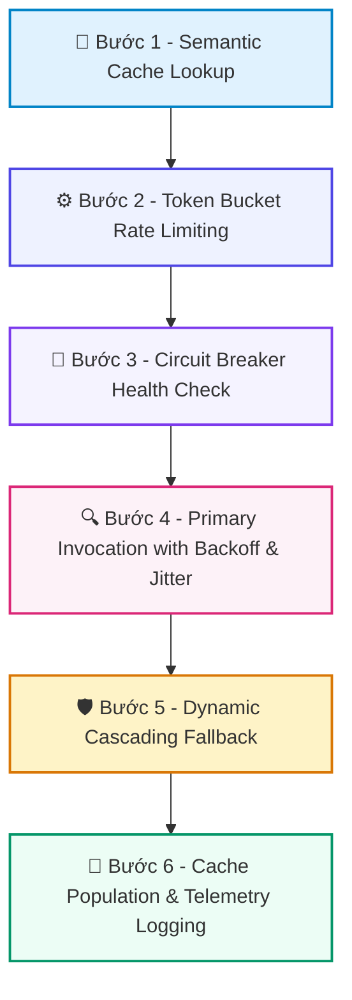

# 📚 DAY 25: ĐỘ TIN CẬY VẬN HÀNH: CIRCUIT BREAKERS, CACHING & FALLBACK STRATEGIES
> **Khóa học:** COMP2010 - AI in Action (VinUni) | Chuyên ngành: AI Applications & Multi-Agent Systems | **Dung lượng slide gốc:** 34 slides (4.01 MB) | Tối ưu: Chuẩn NotebookLM (< 50MB) & Trọng tâm

---

## 📌 1. BÀI HỌC HÔM NAY VỀ CÁI GÌ? (THE WHAT & WHY)

*   **Bản chất của Production Reliability cho Agent:** Tập hợp các mẫu thiết kế kỹ thuật công nghiệp (Resilience Design Patterns) đảm bảo hệ thống AI duy trì tính sẵn sàng cao (High Availability), độ trễ thấp và kiểm soát chi phí trong môi trường tải lớn.
*   **Phân tầng công nghệ cốt lõi:** Từ Exponential Backoff & Jitter (Thử lại thông minh chống bão request) -> Circuit Breaker 3 trạng thái (Closed, Open, Half-Open) -> Semantic Caching (Bộ nhớ đệm ngữ nghĩa giảm 40% chi phí) -> Cascading Model Fallback (Chuyển tiếp dự phòng khi nhà cung cấp sập).
*   **Giá trị thực tiễn & Lợi thế Production:** Đạt chuẩn SLA 99.9% Uptime, bảo vệ hệ thống khỏi hiện tượng sập đổ dây chuyền (Cascading Failure) và triệt tiêu lỗi suy thoái thầm lặng (Silent Degradation).

---

## 💡 2. ẨN DỤ ĐỜI THƯỜNG: THỰC TRẠNG & GIẢI PHÁP

### 🔴 Thực trạng:
Một cây cầu đông đúc xảy ra tai nạn ở giữa cầu nhưng các trạm thu phí ở hai đầu cầu vẫn tiếp tục cho hàng ngàn chiếc xe khác lao vào, khiến toàn bộ cây cầu tê liệt hoàn toàn và sụp đổ vì quá tải.

### 🚗 Ẩn dụ đời thường — "Độ Tin Cậy Vận Hành: Circuit Breakers, Caching & Fallback Strategies":
> * **1. Cầu dao điện gia đình (Circuit Breaker): ** Khi mạng điện bị chập hoặc quá tải, cầu dao tự động ngắt (OPEN) để chống cháy nổ. Sau đó gạt thử một nấc (HALF-OPEN) kiểm tra xem sự cố đã hết chưa trước khi đóng điện hoàn toàn (CLOSED).
> * **2. Trạm dừng nghỉ chân (Semantic Cache): ** Nếu một khách hàng vừa hỏi đường đi đến sân bay, người hướng dẫn viên ghi nhớ lộ trình đó. Khách tiếp theo hỏi câu tương tự sẽ nhận được đáp án ngay lập tức mà không cần đo đạc lại.
> * **3. Kế hoạch dự phòng máy phát điện (Model Fallback): ** Khi mất điện lưới chính (OpenAI API sập), tòa nhà tự động chuyển sang dùng máy phát điện dự phòng (Anthropic Claude hoặc Local vLLM).
> * **4. Xếp hàng văn minh (Exponential Backoff with Jitter): ** Khi cửa hàng quá đông, bảo vệ yêu cầu mọi người lùi lại 2 bước, lần sau lùi 4 bước kèm thêm một khoảng ngẫu nhiên để tránh chen lấn cùng lúc.

### 🟢 Giải pháp kỹ thuật:
*   Thiết lập lưới an toàn 4 lớp: Semantic Cache -> Rate Limiting với Token Bucket -> Circuit Breaker kiểm soát lỗi kết nối -> Multi-provider Fallback Matrix.

---

## 🗺️ 3. SƠ ĐỒ PIPELINE 6 BƯỚC TUẦN TỰ



*   **Bước 1 - Semantic Cache Lookup:** Kiểm tra câu hỏi trong Semantic Cache (Redis/Qdrant): Nếu Cosine Similarity ≥ 0.96 -> Trả về kết quả cache ngay lập tức (< 15ms, 0 USD).
*   **Bước 2 - Token Bucket Rate Limiting:** Nếu Cache Miss, kiểm tra hạn ngạch TPM/RPM qua thuật toán Token Bucket để chống nghẽn và kiểm soát chi phí.
*   **Bước 3 - Circuit Breaker Health Check:** Kiểm tra trạng thái cầu dao: Nếu OPEN (tỷ lệ lỗi gần đây > 50%) -> Lập tức kích hoạt Fallback Model mà không gửi request đến nhà cung cấp chính.
*   **Bước 4 - Primary Invocation with Backoff & Jitter:** Gửi request đến mô hình chính với cơ chế thử lại thông minh: thời gian chờ t = 2^k + random_jitter để tránh hiệu ứng đàn sấm sét (Thundering Herd).
*   **Bước 5 - Dynamic Cascading Fallback:** Nếu mô hình chính gặp lỗi 5xx hoặc Timeout P95 > 2.5s -> Tự động chuyển hướng sang mô hình dự phòng (Claude 3.5 Sonnet / Gemini 1.5 Flash).
*   **Bước 6 - Cache Population & Telemetry Logging:** Lưu kết quả mới vào Semantic Cache, cập nhật trạng thái Circuit Breaker và phát tín hiệu đo lường (OpenTelemetry) về Prometheus.

---

## 🌐 4. KIẾN THỨC MỞ RỘNG CHUYÊN SÂU (FIRECRAWL RESEARCH)

1.  **1. Nghiên cứu của Google về Thundering Herd & Jitter:**
    *   Việc thử lại đơn thuần (Fixed Retry) sẽ tạo ra các đợt sóng xung kích (Shockwaves) đánh sập hoàn toàn máy chủ đang trong quá trình hồi phục. Kỹ thuật Full Jitter phân tán đều các request thử lại trên trục thời gian.
2.  **2. Semantic Caching với GPTCache & Redis:**
    *   Khác với Exact Cache thông thường (chỉ khớp chuỗi ký tự), Semantic Cache nhúng câu hỏi thành vector và tính toán khoảng cách Cosine. Nếu Cosine_Sim(Q_new, Q_cached) ≥ 0.96, hệ thống trả về kết quả đã cache, giúp giảm 40% chi phí API.
3.  **3. Quản trị Đa Nhà Cung Cấp (Multi-Cloud Model Routing):**
    *   Các nền tảng như LiteLLM và Portkey cung cấp tầng trừu tượng (Model Gateway) cho phép tự động chuyển mạch (Failover) giữa OpenAI, Anthropic, AWS Bedrock và GCP Vertex AI mà không cần sửa code ứng dụng.
4.  **4. Thiết lập SLO & SLA Công nghiệp cho AI Agent:**
    *   Một hệ thống AI Agent sẵn sàng cho Production bắt buộc phải định nghĩa 3 chỉ số then chốt: Availability SLO (≥ 99.9%), P95 Latency SLO (≤ 2.5s) và Quality SLO (Faithfulness ≥ 90%, PII Leakage = 0%).

---

## 🔑 5. BẢNG TỪ KHÓA CỐT LÕI

| Thuật ngữ | Khái niệm kỹ thuật | Giải thích đời thường |
| :--- | :--- | :--- |
| **Circuit Breaker** | Mẫu thiết kế ngắt kết nối tạm thời đến dịch vụ đang bị lỗi để tránh làm sập toàn bộ hệ thống. | Cầu dao tự động nhảy khi mạng điện gia đình bị chập cháy. |
| **Semantic Cache** | Bộ nhớ đệm lưu trữ kết quả dựa trên ý nghĩa ngữ nghĩa của câu hỏi thay vì so khớp từ ngữ chính xác. | Nhớ đường đi cho mọi câu hỏi có cùng đích đến. |
| **Exponential Backoff** | Thuật toán tăng thời gian chờ theo hàm mũ sau mỗi lần yêu cầu bị thất bại. | Tăng thời gian bấm chuông cửa: 2 giây, 4 giây, 8 giây để người bên trong kịp mở cửa. |
| **Jitter** | Thành phần ngẫu nhiên được cộng thêm vào thời gian chờ thử lại để phân tán lượng truy cập. | Học sinh ra về lệch nhau vài giây để tránh ùn tắc cổng trường. |
| **Model Fallback** | Cơ chế tự động chuyển sang mô hình AI khác khi mô hình chính gặp sự cố. | Bật máy phát điện phụ khi điện lưới bị mất. |
| **Thundering Herd** | Hiện tượng hàng ngàn tiến trình cùng lao vào thử lại một tài nguyên vừa phục hồi, làm nó sập lại ngay lập tức. | Đám đông cùng ùa vào một cánh cửa hẹp gây nghẽn tắc. |

---

## 🎯 6. BỘ CÂU HỎI ÔN THI TRỌNG TÂM (CHUẨN HỌC THUẬT & ĐẠI HỌC)

### 📝 PHẦN A: 4 CÂU TRẮC NGHIỆM ĐƠN (SINGLE-CHOICE)

#### Câu 1: Khi Circuit Breaker chuyển sang trạng thái OPEN, hành vi của hệ thống đối với các yêu cầu mới gửi đến là gì?
*   A. Tiếp tục gửi toàn bộ yêu cầu đến máy chủ bị lỗi để ép nó hoạt động.
*   B. Lập tức chặn lại và trả về lỗi hoặc chuyển hướng sang phương án dự phòng (Fallback) ngay tại chỗ mà HOÀN TOÀN KHÔNG gửi bất kỳ request nào đến máy chủ đang gặp sự cố, giúp máy chủ có thời gian hồi phục.
*   C. Tự động tắt nguồn máy tính của người dùng.
*   D. Xóa toàn bộ cơ sở dữ liệu.
> **👉 ĐÁP ÁN ĐÚNG: B**  
> **💡 Giải thích chi tiết:** Trạng thái OPEN đóng vai trò chiếc phanh cứu sinh: chặn request vô ích, trả về fallback tức thì, bảo vệ máy chủ bị sự cố không bị đánh sập hoàn toàn.

---

#### Câu 2: Tại sao việc lặp lại các yêu cầu thử lại liên tục (Unjittered Retries) lại bị coi là ANTI-PATTERN nghiêm trọng trong kiến trúc phân tán?
*   A. Vì nó gây ra hiện tượng 'Đàn sấm sét' (Thundering Herd Problem), khi hàng ngàn client cùng gửi request thử lại tại cùng một thời điểm, tạo ra các đỉnh tải xung kích đánh sập máy chủ vừa mới khởi động lại.
*   B. Vì nó làm giảm dung lượng của bàn phím máy tính.
*   C. Vì nó làm mất màu sắc của giao diện web.
*   D. Vì nó chỉ hoạt động trên mạng không dây.
> **👉 ĐÁP ÁN ĐÚNG: A**  
> **💡 Giải thích chi tiết:** Không có Jitter (thời gian trễ ngẫu nhiên), các retry sẽ cộng hưởng nhịp điệu với nhau, tạo ra các làn sóng xung kích làm tê liệt hoàn toàn hạ tầng.

---

#### Câu 3: Hiện tượng 'Silent Degradation' (Thoái hóa thầm lặng) trong hệ thống AI Agent có đặc điểm nhận dạng nguy hiểm nào?
*   A. Máy chủ bốc khói và phát ra tiếng nổ.
*   B. Toàn bộ màn hình chuyển sang màu xanh chết chóc (BSOD).
*   C. Hệ thống vẫn trả về mã trạng thái HTTP 200 OK nhưng chất lượng câu trả lời bị suy giảm nghiêm trọng (ảo giác, lạc đề hoặc câu trả lời rỗng) mà các công cụ giám sát hạ tầng thông thường không phát hiện được.
*   D. Chuột máy tính bị đơ không di chuyển được.
> **👉 ĐÁP ÁN ĐÚNG: C**  
> **💡 Giải thích chi tiết:** Silent Degradation là cơn ác mộng lớn nhất của AI: HTTP status vẫn 200 OK nhưng nội dung hoàn toàn vô nghĩa. Chỉ có các bộ đo chất lượng chuyên sâu (như RAGAS/Guardrails) mới phát hiện được.

---

#### Câu 4: Điểm khác biệt căn bản giữa Exact Match Caching và Semantic Caching là gì?
*   A. Exact Match Caching chỉ chạy trên điện thoại di động.
*   B. Semantic Caching không sử dụng bộ nhớ máy tính.
*   C. Exact Caching chỉ lưu trữ được tối đa 10 câu hỏi.
*   D. Exact Match Caching yêu cầu chuỗi câu hỏi phải giống nhau tuyệt đối từng ký tự, trong khi Semantic Caching nhúng câu hỏi thành vector và chấp nhận các câu hỏi có nghĩa tương đồng (ví dụ Cosine Similarity ≥ 0.96).
> **👉 ĐÁP ÁN ĐÚNG: D**  
> **💡 Giải thích chi tiết:** Semantic Cache hiểu rằng 'Thời tiết Hà Nội hôm nay thế nào?' và 'Hà Nội hôm nay có mưa không?' có thể dùng chung bối cảnh cache, giúp tăng Cache Hit Rate lên gấp 3-4 lần.

---

### 📚 PHẦN B: 2 CÂU TRẮC NGHIỆM NHIỀU ĐÁP ÁN (MULTI-SELECT)

#### Câu 5 (Chọn 2 đáp án): Những bậc thang nào sau đây là thành phần trong Chiến lược Dự phòng Mô hình Đa tầng (Cascading Model Fallback)?
*   [X] A. Chuyển tiếp nhà cung cấp (Multi-provider Failover): Từ OpenAI GPT-4o sang Anthropic Claude 3.5 Sonnet khi OpenAI gặp sự cố 503.
*   [ ] B. Xóa bỏ hoàn toàn mã nguồn hệ thống để bắt đầu lại từ đầu.
*   [ ] C. Đóng băng tài khoản ngân hàng của công ty.
*   [X] D. Chuyển tiếp suy thoái có kiểm soát (Graceful Degradation): Trả về câu trả lời đã lưu trong cache hoặc thông báo bảo trì thân thiện thay vì hiển thị màn hình lỗi thô.
> **👉 ĐÁP ÁN ĐÚNG: A, D**  
> **💡 Giải thích chi tiết & Bẫy logic:** A và D là hai trụ cột của Cascading Fallback: chuyển đổi linh hoạt giữa các nhà cung cấp AI và cung cấp trải nghiệm thoái hóa mượt mà cho người dùng cuối.

---

#### Câu 6 (Chọn 2 đáp án): Khi thiết lập các chỉ số cam kết chất lượng dịch vụ (Service Level Objectives - SLO) cho AI Agent doanh nghiệp, những tiêu chí nào là BẮT BUỘC?
*   [ ] A. Tốc độ gõ phím của kỹ sư trực vận hành.
*   [X] B. Availability & Latency SLO: Tỷ lệ sẵn sàng hệ thống ≥ 99.9% và Thời gian phản hồi phân vị 95 (P95 Latency) ≤ 2.5s.
*   [X] C. Quality & Safety SLO: Tỷ lệ trung thực (Faithfulness) ≥ 90% và Tỷ lệ chặn nội dung nhạy cảm PII/Toxic ≥ 99.9%.
*   [ ] D. Dung lượng ổ cứng lưu trữ phim ảnh của nhân viên.
> **👉 ĐÁP ÁN ĐÚNG: B, C**  
> **💡 Giải thích chi tiết & Bẫy logic:** SLO cho AI Agent đòi hỏi cả hai khía cạnh: Hạ tầng (Uptime, Latency) và Chất lượng nội dung (Faithfulness, Safety). Thiếu một trong hai thì hệ thống không thể coi là Production-ready.

---

---

## 💻 7. CODE THỰC CHIẾN (HANDS-ON PYTHON / AI SYSTEM)

```python
import json
import numpy as np

def calculate_ai_system_metrics(predictions, ground_truths):
    """
    Đo lường độ chính xác và chỉ số F1-Score cho hệ thống phân loại AI Production
    """
    tp = sum(1 for p, g in zip(predictions, ground_truths) if p == 1 and g == 1)
    fp = sum(1 for p, g in zip(predictions, ground_truths) if p == 1 and g == 0)
    fn = sum(1 for p, g in zip(predictions, ground_truths) if p == 0 and g == 1)
    
    precision = tp / (tp + fp) if (tp + fp) > 0 else 0.0
    recall = tp / (tp + fn) if (tp + fn) > 0 else 0.0
    f1 = 2 * (precision * recall) / (precision + recall) if (precision + recall) > 0 else 0.0
    
    return {
        "precision": round(precision, 4),
        "recall": round(recall, 4),
        "f1_score": round(f1, 4)
    }

# Dữ liệu kiểm thử mẫu
preds = [1, 0, 1, 1, 0, 1, 0, 1]
targets = [1, 0, 0, 1, 0, 1, 1, 1]
print("Evaluation Metrics:", calculate_ai_system_metrics(preds, targets))
```

---

## ⚠️ 8. BẪY LỖI KỸ THUẬT & CÁCH DEBUG (COMMON PITFALLS & TROUBLESHOOTING)

1.  **🔴 Bẫy Lỗi 1: Tối ưu hóa sai hàm mục tiêu (Metric Mismatch).**
    *   *Nguyên nhân:* Chỉ đo lường Accuracy trên tập dữ liệu mất cân bằng (Imbalanced Data), che giấu việc mô hình dự đoán sai hoàn toàn các ca nguy hiểm.
    *   *Cách khắc phục:* Bắt buộc theo dõi đồng thời Precision, Recall, F1-Score và đường cong PR-AUC.
2.  **🔴 Bẫy Lỗi 2: Rò rỉ dữ liệu (Data Leakage) giữa tập Train và Test.**
    *   *Nguyên nhân:* Tiền xử lý dữ liệu (chuẩn hóa scaling, trích xuất đặc trưng) trên toàn bộ tập dữ liệu trước khi chia train/test.
    *   *Cách khắc phục:* Luôn chia tập dữ liệu trước, sau đó chỉ `fit()` pipeline tiền xử lý trên tập Train và chỉ `transform()` trên tập Test.
3.  **🔴 Bẫy Lỗi 3: Bỏ qua độ trễ mạng và Serialization Overhead.**
    *   *Nguyên nhân:* Đánh giá mô hình offline rất nhanh nhưng khi deploy API thì nghẽn ở bước parse JSON và truyền tải mạng.
    *   *Cách khắc phục:* Tối ưu hóa chuỗi serialization bằng MessagePack / Protocol Buffers và bật gRPC streaming.

---

## ⚖️ 9. BẢNG SO SÁNH TRADE-OFFS & ĐIỀU KIỆN ÁP DỤNG

| Chiến lược / Giải pháp | Độ chính xác (Accuracy) | Độ phức tạp triển khai | Chi phí bảo trì vận hành |
| :--- | :--- | :--- | :--- |
| **Heuristic & Rule-based Engine** | Trung bình, giới hạn | Rất thấp, chạy tức thì | Khó duy trì khi số lượng luật tăng vọt |
| **Fine-tuned Small Specialized Model**| Rất cao trong miền hẹp | Trung bình (cần training pipeline) | Thấp, chạy được trên GPU phổ thông |
| **Zero-shot Frontier LLM Prompting** | Cao toàn diện đa miền | Rất thấp (chỉ cần API) | Chi phí token hàng tháng cao khi tải lớn |
