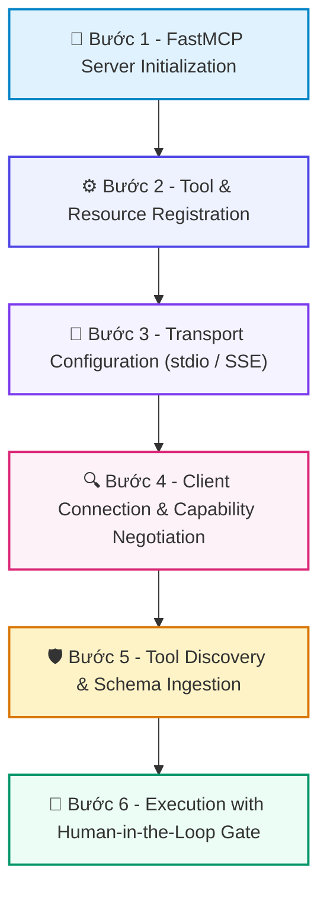

# 📚 DAY 26: CHUẨN HÓA TƯƠNG TÁC CÔNG CỤ: MODEL CONTEXT PROTOCOL (MCP)
> **Khóa học:** COMP2010 - AI in Action (VinUni) | Chuyên ngành: AI Applications & Multi-Agent Systems | **Dung lượng slide gốc:** 39 slides (5.12 MB) | Tối ưu: Chuẩn NotebookLM (< 50MB) & Trọng tâm

---

## 📌 1. BÀI HỌC HÔM NAY VỀ CÁI GÌ? (THE WHAT & WHY)

*   **Bản chất của Model Context Protocol (MCP):** Giao thức mở chuẩn hóa quốc tế (do Anthropic khởi xướng và đóng góp cho cộng đồng mã nguồn mở) giải quyết triệt để vấn đề tích hợp N × M giữa các mô hình AI (Clients/Hosts) và các nguồn dữ liệu/công cụ doanh nghiệp (Servers).
*   **Phân tầng công nghệ cốt lõi:** Trước MCP: N nhà cung cấp mô hình × M công cụ = N × M đoạn mã kết nối riêng biệt phân mảnh. Sau MCP: Chỉ cần N + M kết nối theo chuẩn giao thức JSON-RPC 2.0: 'Viết công cụ một lần - Sử dụng trên mọi nền tảng AI' (Write once, run anywhere).
*   **5 Thành phần nguyên thủy (Primitives):** 1. Tools (Hàm thực thi có tham số) -> 2. Resources (Dữ liệu thụ động gắn URI) -> 3. Prompts (Mẫu câu lệnh có cấu trúc) -> 4. Sampling (Host hoàn thiện cho Server) -> 5. Elicitation (Hỏi người dùng).

---

## 💡 2. ẨN DỤ ĐỜI THƯỜNG: THỰC TRẠNG & GIẢI PHÁP

### 🔴 Thực trạng:
Trước khi chuẩn sạc USB-C ra đời, mỗi hãng điện thoại (Nokia, Sony, Apple, Samsung) tự tạo ra một chân cắm sạc riêng, khiến người dùng phải mang theo cả chục sợi dây sạc rườm rà và không thể dùng chung phụ kiện.

### 🚗 Ẩn dụ đời thường — "Chuẩn Hóa Tương Tác Công Cụ: Model Context Protocol (MCP)":
> * **1. Cổng cắm vạn năng USB-C (Giao thức MCP): ** Một chuẩn giao tiếp duy nhất giúp mọi củ sạc (AI Clients: Claude, Cursor, ChatGPT) cắm vừa mọi thiết bị (Data Servers: Postgres, GitHub, Slack).
> * **2. Các nút chức năng trên remote (MCP Tools): ** Các nút bấm thực thi hành động cụ thể: 'Tăng âm lượng', 'Đổi kênh' (Công cụ thực thi có tham số và tác dụng phụ).
> * **3. Cuốn sách trên giá (MCP Resources): ** Tài liệu chỉ đọc có dán nhãn URI tĩnh: `file:///logs/app.log` hoặc `postgres://users/schema` (Dữ liệu ngữ cảnh không có tác dụng phụ).
> * **4. Kênh truyền thông bảo mật (Transports): ** Dây cáp cắm trực tiếp vào máy tính (stdio) cho công cụ nội bộ, hoặc đường truyền mạng (SSE / HTTP) cho dịch vụ đám mây từ xa.

### 🟢 Giải pháp kỹ thuật:
*   Xây dựng hệ sinh thái MCP: Phát triển MCP Server bằng Python FastMCP/TypeScript SDK -> Định nghĩa Tools với Pydantic Schemas -> Cấu hình Transport Layer an toàn -> Kết nối vào Host qua file JSON.

---

## 🗺️ 3. SƠ ĐỒ PIPELINE 6 BƯỚC TUẦN TỰ



*   **Bước 1 - FastMCP Server Initialization:** Khởi tạo đối tượng `FastMCP('Enterprise-Assistant')` và cấu hình các chính sách bảo mật máy chủ.
*   **Bước 2 - Tool & Resource Registration:** Khai báo các hàm xử lý dữ liệu với decorator `@mcp.tool()` (kèm Docstring chi tiết và Pydantic Type Hints) hoặc `@mcp.resource('uri://...')`.
*   **Bước 3 - Transport Configuration (stdio / SSE):** Lựa chọn kênh truyền thông: `stdio` cho tiến trình cục bộ trên máy tính hoặc `Server-Sent Events (SSE)` cho microservices trên Cloud.
*   **Bước 4 - Client Connection & Capability Negotiation:** Client (Claude Desktop / Cursor) kết nối tới Server, thực hiện bắt tay JSON-RPC 2.0 và trao đổi danh sách tính năng hỗ trợ (Capabilities).
*   **Bước 5 - Tool Discovery & Schema Ingestion:** Host gửi yêu cầu `tools/list` để nạp danh sách công cụ và định dạng tham số vào Context Window của mô hình AI.
*   **Bước 6 - Execution with Human-in-the-Loop Gate:** Khi AI gọi `tools/call`, MCP Server thực thi logic, trả về kết quả cấu trúc và ghi lại Audit Trail minh bạch.

---

## 🌐 4. KIẾN THỨC MỞ RỘNG CHUYÊN SÂU (FIRECRAWL RESEARCH)

1.  **1. Đột phá Kiến trúc của MCP (Anthropic 2024):**
    *   MCP chuyển đổi căn bản cách thức AI tiếp cận dữ liệu: từ chỗ dữ liệu phải nạp sẵn vào Model sang cơ chế dữ liệu được cung cấp theo yêu cầu (Context on-demand) thông qua chuẩn mở JSON-RPC 2.0.
2.  **2. FastMCP Python SDK - Tiêu chuẩn Phát triển Nhanh:**
    *   FastMCP tự động suy luận JSON Schema từ Type Annotations và Docstrings của Python, giảm 80% lượng code thừa boilerplate so với việc viết server MCP truyền thống.
3.  **3. Bảo mật trong MCP: User Approval & Input Sanitization:**
    *   MCP Server có thể truy cập hệ thống file hoặc cơ sở dữ liệu production. Nguyên tắc an toàn: Mọi công cụ thay đổi trạng thái (State-mutating tools) bắt buộc phải có bước xác nhận phê duyệt của người dùng (Approval Gate).
4.  **4. Tương lai của MCP: Distributed Agentic Ecosystem:**
    *   MCP đang nhanh chóng trở thành tiêu chuẩn công nghiệp (De-facto standard) được hỗ trợ bởi Claude, Cursor, Zed, Sourcegraph và hàng ngàn công cụ doanh nghiệp (Postgres, Brave Search, Jira, Google Drive).

---

## 🔑 5. BẢNG TỪ KHÓA CỐT LÕI

| Thuật ngữ | Khái niệm kỹ thuật | Giải thích đời thường |
| :--- | :--- | :--- |
| **Model Context Protocol** | Giao thức mở tiêu chuẩn hóa cách thức mô hình AI kết nối với công cụ và nguồn dữ liệu. | Cổng cắm USB-C vạn năng cho thế giới trí tuệ nhân tạo. |
| **MCP Server** | Ứng dụng cung cấp công cụ (Tools), tài nguyên (Resources) và mẫu câu lệnh (Prompts) theo chuẩn MCP. | Một thiết bị ngoại vi (như chuột, bàn phím) cắm vào máy tính. |
| **MCP Client (Host)** | Ứng dụng AI (như Claude Desktop, Cursor) khởi tạo kết nối và sử dụng các dịch vụ của MCP Server. | Máy vi tính tiếp nhận các thiết bị ngoại vi. |
| **Tools (Primitive)** | Hàm thực thi có thể có tác dụng phụ (Side-effects) nhận tham số từ LLM và trả về kết quả. | Nút bấm thực hiện hành động trên bảng điều khiển. |
| **Resources (Primitive)** | Dữ liệu ngữ cảnh chỉ đọc (Read-only) được định danh bởi một URI cụ thể. | Cuốn sách trên kệ chỉ dùng để đọc thông tin. |
| **Transport Layer** | Kênh truyền thông vật lý giữa MCP Client và Server (chuẩn `stdio` hoặc `SSE`). | Sợi dây cáp đồng nối hai thiết bị với nhau. |

---

## 🎯 6. BỘ CÂU HỎI ÔN THI TRỌNG TÂM (CHUẨN HỌC THUẬT & ĐẠI HỌC)

### 📝 PHẦN A: 4 CÂU TRẮC NGHIỆM ĐƠN (SINGLE-CHOICE)

#### Câu 1: Vấn đề cốt lõi lớn nhất mà giao thức Model Context Protocol (MCP) giải quyết cho ngành công nghiệp AI là gì?
*   A. Tăng tốc độ hiển thị hình ảnh trên màn hình.
*   B. Thay thế hoàn toàn thuật toán học sâu Transformer.
*   C. Giải quyết cuộc khủng hoảng tích hợp N × M bằng cách cung cấp một chuẩn giao thức mở thống nhất (Universal Open Standard), giúp công cụ viết một lần có thể chạy trên mọi mô hình AI.
*   D. Miễn phí tiền điện cho các trung tâm dữ liệu.
> **👉 ĐÁP ÁN ĐÚNG: C**  
> **💡 Giải thích chi tiết:** Trước MCP, mỗi công ty AI tự chế một chuẩn Function Calling riêng (N × M). MCP biến điều này thành chuẩn N + M kiểu USB-C, giúp mọi LLM đều dùng chung được hệ sinh thái công cụ.

---

#### Câu 2: Trong 5 thành phần nguyên thủy (Primitives) của MCP, điểm khác biệt căn bản giữa 'Tools' và 'Resources' là gì?
*   A. Tools chỉ chạy được trên điện thoại còn Resources chỉ chạy trên máy tính bàn.
*   B. Tools là các hàm thực thi có tham số và CÓ THỂ CÓ TÁC DỤNG PHỤ (Side-effects như ghi database, gửi email), trong khi Resources là dữ liệu ngữ cảnh CHỈ ĐỌC (Read-only) gắn URI và KHÔNG CÓ tác dụng phụ.
*   C. Resources chỉ chứa các tệp tin video.
*   D. Tools không cho phép truyền dữ liệu dạng văn bản.
> **👉 ĐÁP ÁN ĐÚNG: B**  
> **💡 Giải thích chi tiết:** Tools là hành động (Actions with side-effects); Resources là dữ liệu thụ động (Passive data without side-effects). Đây là ranh giới an toàn cốt tử trong thiết kế MCP.

---

#### Câu 3: Khi lập trình một MCP Server bằng Python FastMCP, yếu tố nào trong mã nguồn đóng vai trò QUYẾT ĐỊNH giúp LLM chọn đúng công cụ khi người dùng ra lệnh?
*   A. Số lượng dấu cách thụt đầu dòng trong file mã nguồn.
*   B. Tên của máy tính cá nhân người lập trình.
*   C. Dung lượng của file icon ứng dụng.
*   D. Bản mô tả tài liệu (Docstring) của hàm được gắn thẻ `@mcp.tool()` mô tả rõ ràng chức năng, ngữ cảnh sử dụng và ý nghĩa các tham số.
> **👉 ĐÁP ÁN ĐÚNG: D**  
> **💡 Giải thích chi tiết:** LLM lựa chọn Tool dựa trên Name và Description trong Schema. Docstring càng rõ ràng, mạch lạc thì xác suất mô hình gọi đúng công cụ càng cao.

---

#### Câu 4: Kênh truyền thông (Transport Layer) chuẩn `stdio` trong kiến trúc MCP thường được ưu tiên sử dụng trong trường hợp nào?
*   A. Khi MCP Server và MCP Client chạy trên cùng một máy cục bộ (Local process), giúp tối ưu hóa độ trễ ở mức tối thiểu và bảo mật cao.
*   B. Kết nối giữa hai máy chủ cách nhau nửa vòng trái đất qua vệ tinh.
*   C. Khi máy tính không có bàn phím và chuột.
*   D. Khi muốn truyền hình ảnh trực tiếp lên tivi thông minh.
> **👉 ĐÁP ÁN ĐÚNG: A**  
> **💡 Giải thích chi tiết:** Stdio (Standard Input/Output) là transport mặc định cho local tools (như trong Claude Desktop/Cursor), không cần mở cổng mạng, an toàn tuyệt đối và độ trễ cực thấp.

---

### 📚 PHẦN B: 2 CÂU TRẮC NGHIỆM NHIỀU ĐÁP ÁN (MULTI-SELECT)

#### Câu 5 (Chọn 2 đáp án): Những thành phần nào sau đây thuộc về 5 MCP Primitives chính thức được định nghĩa trong đặc tả giao thức?
*   [X] A. Tools (Hàm thực thi có tham số) và Resources (Dữ liệu ngữ cảnh chỉ đọc gắn URI).
*   [ ] B. Video Games (Trò chơi điện tử 3D).
*   [X] C. Prompts (Mẫu câu hỏi tái sử dụng) và Sampling (Cơ chế Server yêu cầu Host hoàn thiện LLM).
*   [ ] D. Blockchain Mining (Đào tiền mã hóa tự động).
> **👉 ĐÁP ÁN ĐÚNG: A, C**  
> **💡 Giải thích chi tiết & Bẫy logic:** 5 Primitives của MCP gồm: 1. Tools; 2. Resources; 3. Prompts; 4. Sampling; 5. Elicitation. B và D là các công nghệ hoàn toàn không liên quan đến chuẩn MCP.

---

#### Câu 6 (Chọn 2 đáp án): Trong môi trường doanh nghiệp thực tế, những thực hành bảo mật nào là BẮT BUỘC khi triển khai MCP Servers?
*   [ ] A. Cho phép MCP Server tự do xóa toàn bộ ổ cứng máy chủ mà không cần hỏi ai.
*   [X] B. Xác thực và làm sạch nghiêm ngặt mọi tham số đầu vào (Input Validation) tại MCP Server để chống tấn công SQL Injection hoặc Command Injection.
*   [ ] C. Công khai toàn bộ API keys và mật khẩu quản trị vào file mã nguồn mở.
*   [X] D. Bắt buộc phải có bước xác nhận phê duyệt của người dùng (User Approval Gate) trước khi thực thi các công cụ có tính chất phá hủy hoặc gửi dữ liệu ra bên ngoài.
> **👉 ĐÁP ÁN ĐÚNG: B, D**  
> **💡 Giải thích chi tiết & Bẫy logic:** Bảo mật MCP tuân theo nguyên tắc phòng vệ chiều sâu: Server kiểm tra dữ liệu đầu vào và luôn yêu cầu con người xác nhận trước các tác vụ nhạy cảm.

---

---

## 💻 7. CODE THỰC CHIẾN (HANDS-ON PYTHON / LANGGRAPH)

```python
from typing import TypedDict, Annotated, List
import operator
from langgraph.graph import StateGraph, END

# 1. Định nghĩa Agent State Schema với Reducer
class AgentState(TypedDict):
    messages: Annotated[List[str], operator.add]
    attempt_count: int
    is_success: bool

# 2. Định nghĩa các Node xử lý trong đồ thị
def actor_node(state: AgentState):
    current_attempt = state.get("attempt_count", 0) + 1
    new_message = f"Actor generated plan attempt #{current_attempt}"
    return {"messages": [new_message], "attempt_count": current_attempt}

def evaluator_node(state: AgentState):
    # Logic tự chấm điểm và đánh giá
    success = state["attempt_count"] >= 2 # Giả lập thành công ở vòng 2
    return {"is_success": success}

# 3. Hàm phân nhánh có điều kiện (Conditional Routing)
def check_completion(state: AgentState):
    if state["is_success"]:
        return "end"
    if state["attempt_count"] >= 3:
        return "end"
    return "retry"

# 4. Xây dựng đồ thị trạng thái
workflow = StateGraph(AgentState)
workflow.add_node("actor", actor_node)
workflow.add_node("evaluator", evaluator_node)
workflow.set_entry_point("actor")
workflow.add_edge("actor", "evaluator")
workflow.add_conditional_edges("evaluator", check_completion, {
    "end": END,
    "retry": "actor"
})

app = workflow.compile()
final_state = app.invoke({"messages": ["Initial Task"], "attempt_count": 0, "is_success": False})
print("Final Trajectory:", final_state["messages"])
```

---

## ⚠️ 8. BẪY LỖI KỸ THUẬT & CÁCH DEBUG (COMMON PITFALLS & TROUBLESHOOTING)

1.  **🔴 Bẫy Lỗi 1: Vòng lặp vô tận (Infinite Loop) do thiếu Guardrail dừng.**
    *   *Nguyên nhân:* Tác tử liên tục gọi lại cùng một công cụ với tham số lỗi mà không có giới hạn số lần thử.
    *   *Cách khắc phục:* Luôn cài đặt `max_iterations` cứng (ví dụ max = 5) và cơ chế Circuit Breaker trong Graph State.
2.  **🔴 Bẫy Lỗi 2: Tràn cửa sổ ngữ cảnh (Context Bloat) khi tích lũy Trajectory.**
    *   *Nguyên nhân:* Toàn bộ log gọi tool thô được nối dồn vào prompt khiến token bùng nổ và mô hình bị suy giảm chú ý.
    *   *Cách khắc phục:* Sử dụng cơ chế Sliding Window Memory chỉ giữ 3-5 bước gần nhất kết hợp tóm tắt tự động (Summary Reducer).
3.  **🔴 Bẫy Lỗi 3: Tác tử bị mắc kẹt vào các giả định sai lầm (Cascading Hallucination).**
    *   *Nguyên nhân:* ReAct truyền thống không có bước Reflector để phủ định kết luận trung gian sai lầm.
    *   *Cách khắc phục:* Nâng cấp lên kiến trúc Reflexion hoặc LATS với Evaluator độc lập kiểm định chứng cứ.

---

## ⚖️ 9. BẢNG SO SÁNH TRADE-OFFS & ĐIỀU KIỆN ÁP DỤNG

| Mô hình Kiến trúc | Ưu điểm cốt lõi | Nhược điểm & Chi phí | Tình huống áp dụng tối ưu |
| :--- | :--- | :--- | :--- |
| **Single-Agent ReAct** | Đơn giản, độ trễ thấp, ít tốn token | Dễ rơi vào lỗi lan tỏa và vòng lặp vô tận | Tác vụ đơn giản 1-2 bước gọi tool API |
| **Reflexion Agent** | Tự sửa lỗi sau thất bại, tăng accuracy 20-30% | Tăng số lần gọi LLM (2x-3x token cost) | Sinh mã nguồn, giải toán, kiểm tra dữ liệu |
| **Hierarchical Multi-Agent (Supervisor)** | Cô lập ngữ cảnh chuyên môn, xử lý bài toán lớn | Phức tạp trong cấu hình, độ trễ cao | Hệ thống doanh nghiệp đa phòng ban, phân tích dữ liệu |
