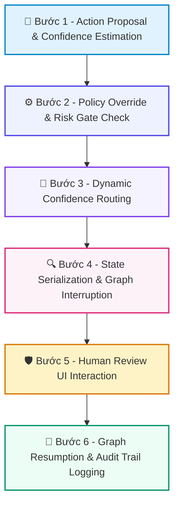

# 📚 DAY 27: THIẾT KẾ TRẢI NGHIỆM & QUẢN TRỊ CON NGƯỜI TRONG VÒNG LẶP (HITL UX)
> **Khóa học:** COMP2010 - AI in Action (VinUni) | Chuyên ngành: AI Applications & Multi-Agent Systems | **Dung lượng slide gốc:** 29 slides (3.82 MB) | Tối ưu: Chuẩn NotebookLM (< 50MB) & Trọng tâm

---

## 📌 1. BÀI HỌC HÔM NAY VỀ CÁI GÌ? (THE WHAT & WHY)

*   **Bản chất của Human-in-the-Loop (HITL UX):** Phương pháp luận thiết kế trải nghiệm người dùng và kiến trúc hệ thống kết hợp trí tuệ nhân tạo và sự giám sát của con người một cách liền mạch, cân bằng giữa tốc độ tự động hóa và độ an toàn.
*   **Phổ Tự trị (Autonomy Spectrum):** Tự trị 100% chỉ an toàn khi mọi hành động đều có thể đảo ngược được (Reversible) và có chi phí sai số thấp (Low-cost). Trong thực tế, các sự cố như Agent CS tự động hoàn tiền 50.000 USD không kiểm soát hay xóa nhầm nhánh cơ sở dữ liệu production chứng minh sự nguy hiểm chết người nếu thiếu sự can thiệp của con người.
*   **Giá trị thực tiễn & Lợi thế Production:** Làm chủ 5 Mẫu tương tác HITL (Approval, Clarification, Escalation, Review Checkpoint, Edit/Correction), thiết lập thuật toán Định tuyến theo độ tin cậy (Confidence Routing) và triển khai luồng `interrupt/resume` bền vững trong LangGraph.

---

## 💡 2. ẨN DỤ ĐỜI THƯỜNG: THỰC TRẠNG & GIẢI PHÁP

### 🔴 Thực trạng:
Trao toàn quyền ký séc rút tiền ngân hàng cho một nhân viên thực tập mới vào làm ngày đầu tiên mà không hề đặt hạn mức chi tiêu hay yêu cầu chữ ký duyệt của Kế toán trưởng.

### 🚗 Ẩn dụ đời thường — "Thiết Kế Trải Nghiệm & Quản Trị Con Người Trong Vòng Lặp (HITL UX)":
> * **1. Hạn mức tự duyệt chi tiêu doanh nghiệp: ** Dưới 5 triệu: Nhân viên tự động thanh toán (Auto-approve). Từ 5-50 triệu: Trưởng phòng ký duyệt 1 cấp (Approval). Trên 50 triệu: Phải trình Tổng Giám đốc ký duyệt (Escalation).
> * **2. Tự động rẽ nhánh theo rủi ro (Confidence Routing): ** Nếu độ tin cậy > 0.85: Tự động chạy và ghi log. Độ tin cậy 0.70-0.85: Đề xuất phương án và chờ người dùng bấm xác nhận. Độ tin cậy < 0.70: Hỏi lại người dùng đầy đủ ngữ cảnh.
> * **3. Phanh khẩn cấp trên tàu hỏa (Policy Override): ** Bất kể người lái tàu tự tin đến đâu, cứ gặp tín hiệu đèn đỏ hoặc khu vực đông dân cư (hành động xóa dữ liệu/gửi email ra ngoài) là bắt buộc tàu phải dừng lại xin phép.

### 🟢 Giải pháp kỹ thuật:
*   Xây dựng luồng HITL 3 bước: Phân loại rủi ro nghiệp vụ -> Định tuyến theo ngưỡng Confidence & Policy Override -> Ngắt đồ thị bằng LangGraph Interrupt và hiển thị giao diện UI phê duyệt có đầy đủ bằng chứng.

---

## 🗺️ 3. SƠ ĐỒ PIPELINE 6 BƯỚC TUẦN TỰ



*   **Bước 1 - Action Proposal & Confidence Estimation:** Agent tạo ra dự thảo hành động kèm theo điểm số tự đánh giá độ tin cậy (Confidence Score ∈ [0, 1]) và lập luận lý do.
*   **Bước 2 - Policy Override & Risk Gate Check:** Kiểm tra danh mục chính sách cứng: Các hành động Read-only -> Tự động chạy; Hành động Delete/Deploy/External Communication -> Bắt buộc dừng lại xin phép.
*   **Bước 3 - Dynamic Confidence Routing:** So sánh độ tin cậy với ngưỡng động: Confidence ≥ 0.85 → Tự động thực thi; Confidence ∈ [0.70, 0.85) → Đề xuất & Chờ duyệt; Confidence < 0.70 → Hỏi làm rõ.
*   **Bước 4 - State Serialization & Graph Interruption:** Nếu cần phê duyệt, LangGraph lưu toàn bộ trạng thái vào Checkpointer và kích hoạt `interrupt_before` để giải phóng tài nguyên máy chủ.
*   **Bước 5 - Human Review UI Interaction:** Người dùng xem xét đề xuất trên giao diện web (Streamlit/React), có 3 quyền: Approve (Đồng ý), Reject (Từ chối kèm lý do) hoặc Edit (Sửa trực tiếp nội dung).
*   **Bước 6 - Graph Resumption & Audit Trail Logging:** Nạp lại State từ Checkpointer, cập nhật phán quyết của con người, tiếp tục thực thi đồ thị và ghi lại bản lưu vết kiểm toán (Audit Trail) bất biến.

---

## 🌐 4. KIẾN THỨC MỞ RỘNG CHUYÊN SÂU (FIRECRAWL RESEARCH)

1.  **1. Phổ Tự trị trong Thiết kế AI (Autonomy Spectrum):**
    *   Không có vị trí 'tốt nhất' cố định. Thang tự trị gồm: Full Manual (con người làm hết) -> HITL Strict (duyệt mọi hành động) -> HITL Balanced (duyệt theo rủi ro - Sweet spot) -> HITL Light (chỉ ghi log kiểm toán) -> Full Auto. Khởi đầu luôn là Strict và nới lỏng dần khi độ tin cậy được chứng minh.
2.  **2. 5 Mẫu Tương tác HITL Chuẩn mực:**
    *   1. Approval (phê duyệt hành động rủi ro cao); 2. Clarification (hỏi làm rõ khi yêu cầu mơ hồ); 3. Escalation (chuyển cấp khi vượt thẩm quyền); 4. Review Checkpoint (kiểm tra bản nháp trước khi xuất bản); 5. Edit / Correction (cho phép con người chỉnh sửa trực tiếp nội dung sinh ra).
3.  **3. Bài toán Chi phí: Cost of Interrupt vs Cost of Error:**
    *   Nếu chi phí của một lỗi sai rất thấp (1 USD) nhưng việc hỏi liên tục làm phiền người dùng -> Giảm số lần hỏi. Nếu chi phí của một lỗi sai cực lớn (10.000 USD như xóa nhầm database) -> Bắt buộc luôn luôn phải hỏi dù Agent tự tin 99%.
4.  **4. Thiết kế Giao diện Trực quan: Diff View & Inline Editing:**
    *   Trong các công cụ như Cursor hoặc GitHub Copilot Workspace, giao diện hiển thị bảng so sánh khác biệt (Red/Green Diff View) và cho phép người dùng sửa trực tiếp code trước khi bấm nút 'Accept' là yếu tố quyết định sự hài lòng của lập trình viên.

---

## 🔑 5. BẢNG TỪ KHÓA CỐT LÕI

| Thuật ngữ | Khái niệm kỹ thuật | Giải thích đời thường |
| :--- | :--- | :--- |
| **Human-in-the-Loop** | Mô hình thiết kế hệ thống trong đó con người tham gia trực tiếp vào quá trình ra quyết định của AI. | Bác sĩ trưởng khoa kiểm tra lại đơn thuốc do máy tính đề xuất trước khi in cho bệnh nhân. |
| **Confidence Routing** | Thuật toán định tuyến hành động dựa trên mức độ tự tin và điểm số rủi ro của tác vụ. | Phân loại hồ sơ vay vốn: điểm tín dụng cao tự duyệt, điểm trung bình cần người thẩm định. |
| **Policy Override** | Quy tắc cứng bắt buộc hệ thống phải dừng lại xin phép bất kể điểm độ tin cậy cao đến đâu. | Đèn đỏ bắt mọi phương tiện phải dừng lại kể cả xe chạy nhanh. |
| **Alert Fatigue** | Hiện tượng người dùng mệt mỏi và bấm duyệt bừa bãi do hệ thống gửi quá nhiều thông báo xin phép vụn vặt. | Nghe chuông báo động giả quá nhiều lần dẫn đến việc không thèm sơ tán khi có cháy thật. |
| **Diff View** | Giao diện hiển thị trực quan phần văn bản bị xóa (đỏ) và phần được thêm mới (xanh). | Bản so sánh đối chiếu hai bản hợp đồng trước và sau khi chỉnh sửa. |
| **Audit Trail** | Bản ghi nhật ký bất biến lưu lại toàn bộ lịch sử ai đã làm gì, lúc nào và lý do tại sao. | Sổ đăng ký ra vào cơ quan ghi rõ giờ giấc và chữ ký của từng khách đến thăm. |

---

## 🎯 6. BỘ CÂU HỎI ÔN THI TRỌNG TÂM (CHUẨN HỌC THUẬT & ĐẠI HỌC)

### 📝 PHẦN A: 4 CÂU TRẮC NGHIỆM ĐƠN (SINGLE-CHOICE)

#### Câu 1: Theo nguyên tắc an toàn hệ thống, chế độ Tự trị Toàn phần (Full Autonomy) CHỈ ĐƯỢC PHÉP kích hoạt khi thỏa mãn đồng thời hai điều kiện nào?
*   A. Mô hình AI có số lượng tham số lớn hơn 100 tỷ và server đặt tại Mỹ.
*   B. Mọi hành động của Agent đều có thể đảo ngược được (Reversible) VÀ chi phí của một lỗi sai là cực kỳ thấp (Low-cost).
*   C. Người dùng không có mặt tại bàn làm việc.
*   D. Hệ thống chỉ chạy vào ban ngày.
> **👉 ĐÁP ÁN ĐÚNG: B**  
> **💡 Giải thích chi tiết:** Full Autonomy cực kỳ nguy hiểm. Nó chỉ được chấp nhận cho các tác vụ vô hại, dễ dàng hoàn tác (như tóm tắt email cá nhân hoặc gợi ý tìm kiếm).

---

#### Câu 2: Cơ chế 'Policy Override' trong kiến trúc Confidence Routing có ý nghĩa vận hành là gì?
*   A. Cho phép Agent tự động đổi mật khẩu quản trị viên.
*   B. Tự động bỏ qua mọi cảnh báo lỗi của hệ điều hành.
*   C. Bắt buộc Agent phải dừng lại xin phép con người khi gặp các hành động có tính chất phá hủy (như xóa dữ liệu, gửi email ra bên ngoài, triển khai production) BẤT KỂ điểm số độ tin cậy của Agent có đạt mức 0.99 đi chăng nữa.
*   D. Gửi thông báo quảng cáo tới người dùng.
> **👉 ĐÁP ÁN ĐÚNG: C**  
> **💡 Giải thích chi tiết:** Policy Override là hàng rào bảo vệ tối thượng: không bao giờ để một điểm số xác suất (confidence) được phép vượt qua các ranh giới an toàn sống còn của doanh nghiệp.

---

#### Câu 3: Trong thiết kế trải nghiệm người dùng cho hệ thống HITL (HITL UX), hiện tượng 'Alert Fatigue' (Mệt mỏi vì cảnh báo) dẫn đến hậu quả nguy hiểm nào?
*   A. Hệ thống ngắt luồng và hỏi xin phép quá nhiều đối với các việc vụn vặt, khiến con người mất kiên nhẫn và hình thành thói quen bấm nút 'Approve' (Đồng ý) một cách vô thức mà không thèm đọc kỹ nội dung.
*   B. Màn hình máy tính bị giảm độ sáng.
*   C. Thời gian phản hồi streaming token đầu tiên vượt quá 2.000ms.
*   D. Loa máy tính phát ra tiếng kêu quá to.
> **👉 ĐÁP ÁN ĐÚNG: A**  
> **💡 Giải thích chi tiết:** Alert Fatigue phá hủy hoàn toàn mục tiêu an toàn của HITL: khi bị hỏi quá nhiều, con người sẽ duyệt mù (Rubber-stamping) và bỏ lọt lỗi nghiêm trọng.

---

#### Câu 4: Khi triển khai cơ chế Human-in-the-Loop trong LangGraph, tại sao bắt buộc phải sử dụng Checkpointer bền vững (Persistent Checkpointer)?
*   A. Vì LangGraph không thể khởi động nếu không có kết nối Bluetooth.
*   B. Để tự động in trạng thái ra máy in.
*   C. Để tăng chi phí vận hành máy chủ.
*   D. Vì khi đồ thị kích hoạt lệnh ngắt luồng (Interrupt) để chờ con người duyệt (có thể mất vài tiếng hoặc vài ngày), Checkpointer sẽ lưu trữ toàn bộ trạng thái vào cơ sở dữ liệu để giải phóng RAM và sẵn sàng phục hồi khi có lệnh resume.
> **👉 ĐÁP ÁN ĐÚNG: D**  
> **💡 Giải thích chi tiết:** Người dùng không duyệt ngay lập tức. Checkpointer bền bỉ (như PostgresSaver) cho phép lưu trạng thái vào đĩa, giải phóng RAM máy chủ và phục hồi lại chính xác phiên làm việc khi người dùng bấm nút duyệt.

---

### 📚 PHẦN B: 2 CÂU TRẮC NGHIỆM NHIỀU ĐÁP ÁN (MULTI-SELECT)

#### Câu 5 (Chọn 2 đáp án): Những mẫu tương tác nào sau đây thuộc về 5 Mẫu tương tác Human-in-the-Loop (HITL) chuẩn mực?
*   [ ] A. Secret Stealing (Bí mật lấy trộm mật khẩu người dùng).
*   [X] B. Approval (Phê duyệt hành động rủi ro cao) và Clarification (Hỏi làm rõ khi đầu vào mơ hồ).
*   [ ] C. Silent Crashing (Tự động tắt ứng dụng trong im lặng).
*   [X] D. Escalation (Chuyển cấp khi vượt quá năng lực) và Edit / Correction (Cho phép con người chỉnh sửa trực tiếp bản nháp).
> **👉 ĐÁP ÁN ĐÚNG: B, D**  
> **💡 Giải thích chi tiết & Bẫy logic:** 5 mẫu tương tác HITL gồm: 1. Approval; 2. Clarification; 3. Escalation; 4. Review Checkpoint; 5. Edit/Correction.

---

#### Câu 6 (Chọn 2 đáp án): Khi thiết kế Giao diện Phê duyệt cho con người (Human Approval UI), những yếu tố nào sau đây là BEST PRACTICES giúp con người ra quyết định chính xác và nhanh chóng?
*   [X] A. Hiển thị trực quan bảng so sánh khác biệt (Diff View) trước và sau khi hành động được thực thi kèm theo lý do súc tích vì sao Agent đề xuất hành động này.
*   [ ] B. Giấu kín toàn bộ thông tin chi tiết và chỉ hiển thị đúng một nút bấm 'Đồng ý'.
*   [X] C. Cung cấp tùy chọn chỉnh sửa trực tiếp nội dung (Inline Edit) và nút hoàn tác (Undo) tức thì sau khi thực thi.
*   [ ] D. Ép buộc người dùng phải trả lời trong vòng 0.5 giây.
> **👉 ĐÁP ÁN ĐÚNG: A, C**  
> **💡 Giải thích chi tiết & Bẫy logic:** Giao diện HITL xuất sắc phải minh bạch (hiển thị diff và lý do), trao quyền kiểm soát cho người dùng (cho phép sửa inline) và hỗ trợ hoàn tác an toàn.

---

---

## 💻 7. CODE THỰC CHIẾN (HANDS-ON PYTHON / AI SYSTEM)

```python
import json
import numpy as np

def calculate_ai_system_metrics(predictions, ground_truths):
    """
    Đo lường độ chính xác và chỉ số F1-Score cho hệ thống phân loại AI Production
    """
    tp = sum(1 for p, g in zip(predictions, ground_truths) if p == 1 and g == 1)
    fp = sum(1 for p, g in zip(predictions, ground_truths) if p == 1 and g == 0)
    fn = sum(1 for p, g in zip(predictions, ground_truths) if p == 0 and g == 1)
    
    precision = tp / (tp + fp) if (tp + fp) > 0 else 0.0
    recall = tp / (tp + fn) if (tp + fn) > 0 else 0.0
    f1 = 2 * (precision * recall) / (precision + recall) if (precision + recall) > 0 else 0.0
    
    return {
        "precision": round(precision, 4),
        "recall": round(recall, 4),
        "f1_score": round(f1, 4)
    }

# Dữ liệu kiểm thử mẫu
preds = [1, 0, 1, 1, 0, 1, 0, 1]
targets = [1, 0, 0, 1, 0, 1, 1, 1]
print("Evaluation Metrics:", calculate_ai_system_metrics(preds, targets))
```

---

## ⚠️ 8. BẪY LỖI KỸ THUẬT & CÁCH DEBUG (COMMON PITFALLS & TROUBLESHOOTING)

1.  **🔴 Bẫy Lỗi 1: Tối ưu hóa sai hàm mục tiêu (Metric Mismatch).**
    *   *Nguyên nhân:* Chỉ đo lường Accuracy trên tập dữ liệu mất cân bằng (Imbalanced Data), che giấu việc mô hình dự đoán sai hoàn toàn các ca nguy hiểm.
    *   *Cách khắc phục:* Bắt buộc theo dõi đồng thời Precision, Recall, F1-Score và đường cong PR-AUC.
2.  **🔴 Bẫy Lỗi 2: Rò rỉ dữ liệu (Data Leakage) giữa tập Train và Test.**
    *   *Nguyên nhân:* Tiền xử lý dữ liệu (chuẩn hóa scaling, trích xuất đặc trưng) trên toàn bộ tập dữ liệu trước khi chia train/test.
    *   *Cách khắc phục:* Luôn chia tập dữ liệu trước, sau đó chỉ `fit()` pipeline tiền xử lý trên tập Train và chỉ `transform()` trên tập Test.
3.  **🔴 Bẫy Lỗi 3: Bỏ qua độ trễ mạng và Serialization Overhead.**
    *   *Nguyên nhân:* Đánh giá mô hình offline rất nhanh nhưng khi deploy API thì nghẽn ở bước parse JSON và truyền tải mạng.
    *   *Cách khắc phục:* Tối ưu hóa chuỗi serialization bằng MessagePack / Protocol Buffers và bật gRPC streaming.

---

## ⚖️ 9. BẢNG SO SÁNH TRADE-OFFS & ĐIỀU KIỆN ÁP DỤNG

| Chiến lược / Giải pháp | Độ chính xác (Accuracy) | Độ phức tạp triển khai | Chi phí bảo trì vận hành |
| :--- | :--- | :--- | :--- |
| **Heuristic & Rule-based Engine** | Trung bình, giới hạn | Rất thấp, chạy tức thì | Khó duy trì khi số lượng luật tăng vọt |
| **Fine-tuned Small Specialized Model**| Rất cao trong miền hẹp | Trung bình (cần training pipeline) | Thấp, chạy được trên GPU phổ thông |
| **Zero-shot Frontier LLM Prompting** | Cao toàn diện đa miền | Rất thấp (chỉ cần API) | Chi phí token hàng tháng cao khi tải lớn |
