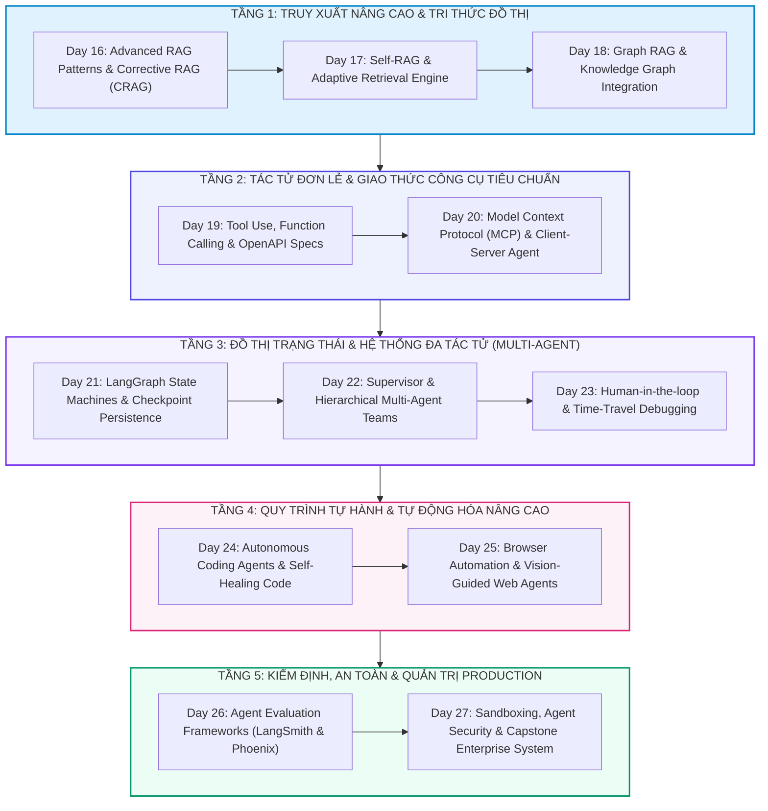

# 🏛️ TỔNG HỢP TOÀN KHÓA: ỨNG DỤNG AI & HỆ THỐNG ĐA TÁC NHÂN NÂNG CAO (TRACK 3 - 12 DAYS: DAYS 16-27)
> **Hệ thống khóa học:** VLearn AI Specialist Courseware | **Phân hệ:** Track 3: AI Applications & Multi-Agent Systems (Days 16 - 27) | **Tiêu chuẩn học thuật:** VinUni COMP2010 / Kỹ sư AI Quốc Tế | **Bộ đôi tài liệu:** NotebookLM Optimized (.md) & Word Typography (.docx)

---

## 🗺️ 1. BẢN ĐỒ KIẾN TRÚC TỔNG THỂ (MASTER ARCHITECTURE MAP)



Track 3: AI Applications & Multi-Agent Systems là chương trình tinh hoa kéo dài 12 ngày (từ Day 16 đến Day 27), trang bị kiến trúc xây dựng các ứng dụng Trí tuệ Nhân tạo thế hệ mới và Hệ thống Đa Tác tử Tự hành (Autonomous Multi-Agent Systems).

Học viên được làm chủ từ các mẫu thiết kế RAG tự sửa sai (Corrective RAG, Graph RAG), chuẩn giao tiếp mở Model Context Protocol (MCP của Anthropic), khung lập trình đồ thị trạng thái LangGraph, các mô hình cộng tác đa tác tử phân cấp (Supervisor Pattern), tự động hóa trình duyệt qua thị giác (Browser-Use) cho đến hạ tầng kiểm thử Evals tự động (LangSmith) và môi trường thực thi hộp cát an toàn (Execution Sandboxing).

---

## 📚 2. TÓM LƯỢC MẠCH KIẾN THỨC TOÀN DIỆN XUYÊN SUỐT CÁC NGÀY HỌC

### 📌 MODULE 1: CHIẾN LƯỢC RAG NÂNG CAO, SELF-CORRECTION & GRAPH RAG (DAYS 16 - 18)
Nâng cấp hệ thống truy xuất thông tin từ RAG tuyến tính đơn giản lên RAG tự thích ứng và tri thức đồ thị.

*   **Corrective RAG (CRAG):** Tích hợp bộ đánh giá tài liệu (Retrieval Evaluator): nếu ngữ cảnh chính xác thì sinh câu trả lời; nếu mơ hồ thì kích hoạt Web Search bổ trợ; nếu sai lệch hoàn toàn thì loại bỏ để chống ảo giác.
*   **Self-RAG & Adaptive Retrieval:** Mô hình sinh các Reflection Tokens ngầm định (Retrieve, ISREL, ISSUP, ISUSE) để tự quyết định khi nào cần tra cứu và tự chấm điểm độ tin cậy của nguồn dữ liệu.
*   **Graph RAG & Tri thức Đồ thị:** Kết hợp vector embeddings với đồ thị tri thức (Knowledge Graph qua Neo4j/NetworkX): bóc tách Thực thể (Entities) và Mối quan hệ (Relations), cho phép trả lời các câu hỏi tổng quan toàn cụm (Global Summarization) qua giải thuật phân cụm cộng đồng Leiden.

### 📌 MODULE 2: GIAO TIẾP CÔNG CỤ, FUNCTION CALLING & CHUẨN GIAO THỨC MCP (DAYS 19 - 20)
Mở rộng năng lực của LLM với thế giới bên ngoài thông qua công cụ và chuẩn giao tiếp thống nhất.

*   **Function Calling & Tool Schema:** Chuyển hóa ngôn ngữ tự nhiên thành lời gọi hàm có cấu trúc qua JSON Schema. Kiểm soát kiểu dữ liệu nghiêm ngặt, xử lý lỗi Exception tự động và hỗ trợ gọi hàm song song (Parallel Tool Calling).
*   **Model Context Protocol (MCP):** Giao thức nguồn mở chuẩn mực kết nối an toàn giữa AI Client (Claude Desktop, IDEs) và các Máy chủ Dữ liệu/Công cụ (MCP Servers: Database, GitHub, File System, Browser) qua chuẩn JSON-RPC 2.0.

### 📌 MODULE 3: ĐỒ THỊ TRẠNG THÁI LANGGRAPH & HỆ THỐNG ĐA TÁC TỬ PHÂN CẤP (DAYS 21 - 23)
Quản trị luồng tác tử phức tạp qua đồ thị trạng thái có chu trình và cơ chế cộng tác đội nhóm.

*   **LangGraph StateGraph & Reducers:** Xây dựng máy trạng thái hướng sự kiện (Event-driven State Machine). Sử dụng State Reducers (như `operator.add`) để quản lý lịch sử tin nhắn và cho phép tác tử quay vòng lặp (Cycles) tự sửa sai.
*   **Supervisor & Multi-Agent Teams:** Mô hình phân cấp: Tác tử Chỉ huy (Supervisor Agent) tiếp nhận yêu cầu, phân tích kế hoạch và điều phối các Tác tử Chuyên gia (Researcher, Coder, Reviewer, Tester) thực thi độc lập.
*   **Human-in-the-loop & Time Travel:** Sử dụng Checkpointer để tạm dừng luồng tại các nút nhạy cảm (như gửi email, xóa cơ sở dữ liệu), cho phép con người phê duyệt/chỉnh sửa trạng thái và quay ngược dòng thời gian để thử nghiệm các phân nhánh khác.

### 📌 MODULE 4: TỰ HÀNH PHÁT TRIỂN PHẦN MỀM & TỰ ĐỘNG HÓA TRÌNH DUYỆT (DAYS 24 - 25)
Ứng dụng Agent vào các bài toán tự động hóa kỹ thuật phần mềm và thao tác web.

*   **Autonomous Coding & Self-Healing:** Vòng lặp tự sửa lỗi mã nguồn (Write Code → Run Unit Tests → Parse Traceback → Self-Correction → Repeat) cho đến khi 100% tests pass.
*   **Browser-Use & Vision Agents:** Tác tử thị giác kết hợp tọa độ điểm ảnh và DOM tree, tự động hóa các thao tác chuột/bàn phím phức tạp trên trình duyệt (điền biểu mẫu, vượt CAPTCHA hợp lệ, trích xuất dữ liệu động).

### 📌 MODULE 5: KIỂM ĐỊNH TÁC TỬ, AN TOÀN HỘP CÁT & THIẾT KẾ DOANH NGHIỆP (DAYS 26 - 27)
Hạ tầng đo lường chất lượng E2E và bảo vệ an ninh hệ thống trong môi trường Production.

*   **Agent Observability với LangSmith & Phoenix:** Truy vết chi tiết cây thực thi (Execution Tree / DAG), đo lường số bước chạy (Steps to Completion), chi phí token và tỷ lệ thành công của tác tử trên từng bài toán.
*   **Execution Sandboxing & Security:** Cô lập môi trường thực thi mã nguồn động của tác tử trong các Container/MicroVM bảo mật cao (Docker gVisor, WebAssembly, E2B Sandbox), ngăn chặn triệt để mã độc chiếm quyền kiểm soát máy chủ.

---

## 🔑 3. BẢNG MA TRẬN THUẬT NGỮ & KHUNG NĂNG LỰC CỐT LÕI

| Thuật ngữ | Khái niệm kỹ thuật chuyên sâu | Ý nghĩa thiết kế hệ thống |
| :--- | :--- | :--- |
| **Corrective RAG (CRAG)** | Mẫu thiết kế RAG tự đánh giá chất lượng tài liệu và kích hoạt tìm kiếm web bổ trợ khi ngữ cảnh không đủ. | Nâng cao tính bền vững và triệt tiêu hoàn toàn ảo giác khi tài liệu nội bộ thiếu thông tin. |
| **Graph RAG** | Kỹ thuật RAG kết hợp trích xuất đồ thị tri thức và tóm tắt cộng đồng phân cấp (Community Summarization). | Cho phép trả lời các câu hỏi tổng hợp mang tính chiến lược trên toàn bộ kho tài liệu. |
| **Model Context Protocol (MCP)** | Chuẩn giao thức mở của Anthropic kết nối AI Models với các Tools, Prompts và Resources qua JSON-RPC. | Tiêu chuẩn hóa kết nối công cụ toàn cầu, xóa bỏ việc phải viết adapter riêng cho từng dịch vụ. |
| **LangGraph StateGraph** | Khung lập trình đồ thị trạng thái cho phép xây dựng luồng tác tử có chu trình, phân nhánh và bộ nhớ. | Cung cấp nền tảng kiến trúc vững chắc nhất để xây dựng Production Multi-Agent Systems. |
| **Supervisor Agent Pattern** | Mô hình tác tử chỉ huy đóng vai trò điều phối viên, phân rã mục tiêu và giao việc cho các tác tử con. | Giảm tải độ phức tạp ngữ cảnh và tăng tính chuyên môn hóa của từng tác tử chuyên biệt. |
| **Human-in-the-loop (HITL)** | Cơ chế tạm dừng luồng thực thi của Agent để chờ con người xem xét, chỉnh sửa hoặc phê duyệt. | Bảo đảm an toàn tuyệt đối khi Agent thực hiện các hành động có tính rủi ro cao hoặc không thể đảo ngược. |
| **Reflexion Architecture** | Cơ chế phản tư giúp Agent lưu lại vết thất bại vào bộ nhớ dài hạn để tự học hỏi và điều chỉnh chiến lược. | Tăng vọt tỷ lệ giải quyết thành công các bài toán lập trình và suy luận phức tạp. |
| **Vision Browser-Use** | Kỹ thuật điều khiển trình duyệt kết hợp ảnh chụp màn hình độ phân giải cao và phân tích DOM. | Cho phép Agent tương tác mượt mà với mọi trang web phức tạp tương tự con người. |
| **LangSmith Tracing** | Nền tảng giám sát chi tiết toàn bộ chuỗi gọi hàm, độ trễ từng bước và chi phí token của Agent. | Công cụ không thể thiếu để gỡ lỗi và tối ưu hóa hiệu năng của Multi-Agent Systems. |
| **Execution Sandbox (gVisor/E2B)** | Môi trường ảo hóa cô lập an toàn để thực thi mã nguồn Python/Bash do Agent tự sinh ra. | Ngăn chặn các cuộc tấn công Remote Code Execution vào máy chủ hệ thống. |

---

## 🎯 4. BỘ ĐỀ THI TỔNG HỢP TOÀN KHÓA (COMPREHENSIVE MASTER EXAM)

### 📝 PHẦN A: CÁC CÂU TRẮC NGHIỆM ĐƠN (24 CÂU SINGLE-CHOICE)

#### Câu 1: Trong kiến trúc Corrective RAG (CRAG - Yan et al., 2024), điều gì sẽ diễn ra khi bộ đánh giá tài liệu (Retrieval Evaluator) chấm điểm ngữ cảnh ở trạng thái 'Mơ hồ / Không chắc chắn' (Ambiguous)?
*   A. Kích hoạt kết hợp song song cả đoạn tài liệu nội bộ đã truy xuất với việc gọi công cụ Web Search để bổ sung dữ liệu cập nhật từ bên ngoài trước khi sinh câu trả lời.
*   B. Xóa bỏ toàn bộ cơ sở dữ liệu vector của hệ thống.
*   C. Tự động trả về câu trả lời 'Tôi không biết' và kết thúc phiên làm việc.
*   D. Chuyển toàn bộ câu hỏi sang ngôn ngữ tiếng Pháp.
> **👉 ĐÁP ÁN ĐÚNG: A**  
> **💡 Giải thích chi tiết & Bẫy logic:** CRAG phân loại kết quả truy xuất thành 3 trạng thái: Correct (dùng luôn), Incorrect (loại bỏ và gọi Web Search), và Ambiguous (dung hợp cả tài liệu nội bộ và kết quả tìm kiếm web qua bước lọc tri thức Knowledge Refinement).

---

#### Câu 2: Điểm vượt trội mang tính cách mạng của Graph RAG (Edge et al., Microsoft Research 2024) so với Vector RAG truyền thống là gì?
*   A. Khả năng trả lời các câu hỏi tổng quan mang tính bao quát toàn bộ tài liệu (Global Sensemaking Questions như 'Chủ đề chính xuyên suốt toàn bộ kho dữ liệu là gì?') nhờ giải thuật trích xuất thực thể và tóm tắt cộng đồng phân cấp (Community Summaries).
*   B. Graph RAG hoàn toàn không cần sử dụng mô hình ngôn ngữ lớn.
*   C. Graph RAG có chi phí xây dựng chỉ mục rẻ gấp 100 lần Vector RAG.
*   D. Graph RAG chỉ hỗ trợ dữ liệu dạng bảng tính Excel.
> **👉 ĐÁP ÁN ĐÚNG: A**  
> **💡 Giải thích chi tiết & Bẫy logic:** Vector RAG chỉ tìm kiếm các đoạn văn cục bộ (Point queries) nên thất bại trước các câu hỏi tổng hợp toàn cục; Graph RAG xây dựng đồ thị tri thức và dùng thuật toán Leiden phân cụm tài liệu thành các cộng đồng phân cấp để tạo bản tóm tắt đa tầng.

---

#### Câu 3: Trong khung kiến trúc Self-RAG (Asai et al., ICLR 2024), các token phản tư đặc biệt (Reflection Tokens) như `[Retrieve]`, `[ISREL]`, `[ISSUP]` đóng vai trò gì?
*   A. Dùng để mã hóa mật khẩu tài khoản người dùng.
*   B. Tăng kích thước phông chữ khi hiển thị trên màn hình.
*   C. Cho phép mô hình tự động quyết định có cần gọi công cụ tìm kiếm hay không, tự đánh giá tính liên quan của tài liệu và tự chấm điểm mức độ trung thực của câu trả lời do chính nó sinh ra.
*   D. Xóa các file log trên máy chủ sau khi hoàn thành.
> **👉 ĐÁP ÁN ĐÚNG: C**  
> **💡 Giải thích chi tiết & Bẫy logic:** Self-RAG được huấn luyện để sinh các token phản tư: `[Retrieve]` (quyết định lúc nào cần tra cứu), `[ISREL]` (đánh giá tài liệu có liên quan không), `[ISSUP]` (câu trả lời có bằng chứng chứng minh không), và `[ISUSE]` (chất lượng câu trả lời).

---

#### Câu 4: Kỹ thuật 'Adaptive RAG' sử dụng cơ chế nào để tối ưu hóa lộ trình xử lý của một câu hỏi đầu vào?
*   A. Bắt buộc mọi câu hỏi phải đi qua tất cả 10 tầng xử lý giống hệt nhau.
*   B. Tự động chuyển câu hỏi thành một bài thơ ngắn.
*   C. Kích hoạt cơ chế Circuit Breaker khi tỷ lệ lỗi tool call vượt quá 20%.
*   D. Sử dụng một mô hình phân loại nhẹ (Query Classifier) để đánh giá độ phức tạp của câu hỏi: phân loại thành Không cần RAG (trả lời trực tiếp), RAG đơn giản (Single-step Vector Search), hoặc RAG phức tạp (Multi-step Agentic Search).
> **👉 ĐÁP ÁN ĐÚNG: D**  
> **💡 Giải thích chi tiết & Bẫy logic:** Không phải câu hỏi nào cũng cần quy trình Agent RAG phức tạp. Adaptive RAG định tuyến thông minh theo độ khó của câu hỏi, giúp tiết kiệm chi phí và giảm độ trễ cho 60%-70% các câu hỏi đơn giản.

---

#### Câu 5: Trong kiến trúc Model Context Protocol (MCP) do Anthropic khởi xướng, mối quan hệ giữa MCP Client và MCP Server được thiết lập theo chuẩn nào?
*   A. Giao thức mở dựa trên chuẩn JSON-RPC 2.0: MCP Host/Client (như Claude Desktop, IDE) kết nối linh hoạt với nhiều MCP Servers độc lập (cung cấp Tools, Resources, Prompts) qua luồng stdio hoặc SSE/HTTP an toàn.
*   B. Giao tiếp qua mạng không dây Bluetooth tầm ngắn.
*   C. Bắt buộc phải cài đặt phần mềm độc quyền của một hãng duy nhất.
*   D. Truyền tín hiệu bằng mã Morse qua cổng âm thanh.
> **👉 ĐÁP ÁN ĐÚNG: A**  
> **💡 Giải thích chi tiết & Bẫy logic:** MCP là chuẩn mở công nghiệp (Open Protocol) sử dụng JSON-RPC 2.0, cho phép một AI Client duy nhất kết nối với vô số Server công cụ (GitHub, SQLite, Postgres, Filesystem, Brave Search) mà không cần viết lại mã tích hợp.

---

#### Câu 6: Trong cơ chế Function Calling chuẩn mực, điều gì thực sự diễn ra bên trong LLM khi nó quyết định gọi một công cụ?
*   A. LLM tự động kết nối internet và tải dữ liệu về bộ nhớ.
*   B. LLM tự động biên dịch mã nguồn C++ trên máy chủ của OpenAI.
*   C. LLM sinh ra một cấu trúc JSON hợp lệ chứa tên hàm (Function Name) và các tham số đầu vào (Arguments) khớp với JSON Schema được cung cấp, sau đó tạm dừng sinh để ứng dụng bên ngoài thực thi hàm thực tế.
*   D. LLM xóa các tham số không hợp lệ trong cơ sở dữ liệu.
> **👉 ĐÁP ÁN ĐÚNG: C**  
> **💡 Giải thích chi tiết & Bẫy logic:** Bản thân LLM không tự chạy code hay gọi API; LLM chỉ là bộ sinh văn bản thông minh sinh ra chuỗi JSON đặc tả lời gọi hàm (`tool_calls`). Ứng dụng client nhận JSON này, thực thi code thật và gửi kết quả (`tool_result`) quay lại cho LLM.

---

#### Câu 7: Khi thiết kế Tool Schema (JSON Schema) cho Agent sử dụng, nguyên tắc nào sau đây là quan trọng nhất để giảm thiểu lỗi sai tham số?
*   A. Không cần viết mô tả (Description) cho các tham số để tiết kiệm token.
*   B. Đặt tên hàm bằng các ký tự viết tắt khó hiểu.
*   C. Viết mô tả chi tiết, rõ ràng về mục đích của hàm và ý nghĩa từng tham số (Semantic Descriptions), định nghĩa trường bắt buộc (required) và cung cấp các giá trị enum cụ thể khi có thể.
*   D. Gộp tất cả 50 công cụ khác nhau vào trong một hàm duy nhất.
> **👉 ĐÁP ÁN ĐÚNG: C**  
> **💡 Giải thích chi tiết & Bẫy logic:** LLM dựa hoàn toàn vào chuỗi mô tả (Description) trong JSON Schema để hiểu công cụ làm gì và khi nào nên dùng. Schema càng chuẩn xác, có kiểu dữ liệu rõ ràng và có ví dụ cụ thể thì tỷ lệ Agent gọi đúng hàm càng đạt 100%.

---

#### Câu 8: Tính năng 'Resources' trong giao thức Model Context Protocol (MCP) khác biệt như thế nào so với tính năng 'Tools'?
*   A. Resources chỉ dùng để thanh toán tiền bản quyền phần mềm.
*   B. Tools là dữ liệu đọc tĩnh còn Resources là hàm thực thi động.
*   C. Resources không hỗ trợ định dạng văn bản.
*   D. Resources là các nguồn dữ liệu thụ động chỉ đọc (Read-only data sources như file, schema bảng, tài liệu) được đính kèm vào ngữ cảnh; trong khi Tools là các hàm thực thi chủ động có thể tạo ra tác dụng phụ (Side-effects).
> **👉 ĐÁP ÁN ĐÚNG: D**  
> **💡 Giải thích chi tiết & Bẫy logic:** Trong MCP: Resources tương đương phép đọc dữ liệu (GET request / Read-only context), còn Tools tương đương lời gọi hàm có hành động cụ thể (POST/Execute action có thể thay đổi trạng thái hệ thống).

---

#### Câu 9: Trong kiến trúc LangGraph, khái niệm 'State Reducer' (ví dụ: `Annotated[list, operator.add]`) giải quyết bài toán cốt lõi nào trong quản trị trạng thái tác tử?
*   A. Định nghĩa quy tắc hợp nhất dữ liệu (Update/Merge Logic) khi một Node trả về giá trị mới, ví dụ: nối thêm tin nhắn mới vào danh sách hiện có thay vì ghi đè làm mất lịch sử hội thoại.
*   B. Tự động nén kích thước file cơ sở dữ liệu xuống 10 lần.
*   C. Xóa bỏ các tin nhắn cũ của người dùng sau mỗi 5 phút.
*   D. Chuyển đổi toàn bộ trạng thái của đồ thị sang định dạng nhị phân.
> **👉 ĐÁP ÁN ĐÚNG: A**  
> **💡 Giải thích chi tiết & Bẫy logic:** Mặc định LangGraph sẽ ghi đè giá trị mới lên key của State. State Reducer (như `operator.add` hay hàm custom) chỉ định cách tích lũy dữ liệu, cho phép các Agent bổ sung tin nhắn vào chuỗi đàm thoại chung một cách an toàn.

---

#### Câu 10: Mô hình tác tử 'Supervisor Architecture' (Kiến trúc Chỉ huy) trong LangGraph phân phối luồng xử lý theo cơ chế nào?
*   A. Tất cả các tác tử gửi tin nhắn đồng thời cho nhau tạo thành đồ thị liên thông hoàn toàn (Full Mesh).
*   B. Các tác tử con hoạt động mà không cần bất kỳ sự quản lý nào.
*   C. Tác tử Supervisor chỉ có nhiệm vụ đếm số lượng ký tự của câu trả lời.
*   D. Tác tử Supervisor đóng vai trò trung tâm điều phối: nhận yêu cầu người dùng, quyết định tác tử chuyên môn tiếp theo cần kích hoạt qua Conditional Edge, nhận kết quả và lặp lại cho đến khi hoàn thành bài toán.
> **👉 ĐÁP ÁN ĐÚNG: D**  
> **💡 Giải thích chi tiết & Bẫy logic:** Supervisor Pattern áp dụng mô hình Router thông minh: Agent chỉ huy phân tích State, chọn Worker phù hợp nhất qua hàm định tuyến (`router_node`), nhận output từ Worker để cập nhật State, và quyết định tiếp tục giao việc hay trả kết quả kết thúc (`__end__`).

---

#### Câu 11: Khi sử dụng tính năng 'Human-in-the-loop Interrupt' trong LangGraph, điều gì xảy ra với trạng thái thực thi của đồ thị?
*   A. Toàn bộ chương trình bị hủy bỏ và xóa sạch khỏi bộ nhớ.
*   B. Máy chủ GPU bị ngắt nguồn điện tự động.
*   C. Luồng thực thi bị tạm dừng ngay trước (hoặc sau) một Node chỉ định, trạng thái hiện tại được lưu an toàn vào Checkpointer, chờ tín hiệu phê duyệt/chỉnh sửa từ con người để tiếp tục chạy.
*   D. Tác tử tự động tạo ra một người dùng giả lập để tự phê duyệt.
> **👉 ĐÁP ÁN ĐÚNG: C**  
> **💡 Giải thích chi tiết & Bẫy logic:** Interrupt cho phép tạm dừng luồng an toàn tại các bước nhạy cảm (như duyệt thanh toán hoặc thực thi lệnh SQL DROP). State được lưu lại trong DB qua Checkpointer, khi con người phê duyệt (Resume), hệ thống tiếp tục chạy từ điểm dừng chính xác.

---

#### Câu 12: Tính năng 'Time-Travel Debugging' trong LangGraph mang lại lợi ích đột phá nào cho việc phát triển và gỡ lỗi hệ thống Multi-Agent?
*   A. Cho phép quay ngược đồng hồ thời gian của máy tính cá nhân.
*   B. Tự động dự đoán kết quả xổ số trong tương lai.
*   C. Tăng tốc độ quay của kim đồng hồ hệ điều hành.
*   D. Khả năng truy xuất lại bất kỳ trạng thái lịch sử nào trong quá khứ qua Checkpoint ID, sửa đổi dữ liệu trạng thái đó và phân nhánh luồng thực thi mới để kiểm tra các kịch bản khác nhau.
> **👉 ĐÁP ÁN ĐÚNG: D**  
> **💡 Giải thích chi tiết & Bẫy logic:** Nhờ cơ chế Checkpointing bền vững của LangGraph, mỗi bước chạy được đánh mã Thread ID và Checkpoint ID riêng biệt. Lập trình viên có thể nhảy về một bước lỗi trong quá khứ, sửa prompt hoặc tool output, và chạy tiếp để xem Agent có sửa được lỗi không.

---

#### Câu 13: Khung kiến trúc 'Reflexion' (Shinn et al., NeurIPS 2023) giúp Autonomous Coding Agents tự cải thiện khả năng lập trình dựa trên cơ chế nào?
*   A. Tự động mua thêm card đồ họa GPU từ nhà sản xuất.
*   B. Gửi email nhờ lập trình viên con người sửa hộ đoạn code.
*   C. Xóa bỏ toàn bộ các bài kiểm thử Unit Test khó để code được coi là thành công.
*   D. Khi đoạn code sinh ra chạy thất bại (gặp lỗi Unit Test hoặc Runtime Error), Agent phân tích thông điệp lỗi (Traceback), viết ra bài học phản tư bằng ngôn ngữ tự nhiên (Self-Reflection) và lưu vào bộ nhớ đệm để không lặp lại sai lầm trong lần thử tiếp theo.
> **👉 ĐÁP ÁN ĐÚNG: D**  
> **💡 Giải thích chi tiết & Bẫy logic:** Reflexion chuyển hóa tín hiệu phản hồi nhị phân (Test Pass/Fail) thành phản tư dạng văn bản ngữ nghĩa (Verbal Reinforcement). Agent đọc bài học này ở vòng lặp sau để định hướng viết lại thuật toán chính xác hơn.

---

#### Câu 14: Trong các hệ thống Tác tử Điều khiển Trình duyệt (Vision-based Browser-Use Agents), phương pháp định vị phần tử trên trang web nào là bền vững nhất đối với các giao diện động hiện đại?
*   A. Dựa hoàn toàn vào tọa độ màn hình pixel cố định không thay đổi.
*   B. Kết hợp phân tích cây trợ năng (Accessibility Tree / DOM Representation) được gán nhãn số (Set-of-Marks / Interactive IDs) với hình ảnh chụp màn hình độ phân giải cao của trình duyệt.
*   C. Chỉ đọc mã nguồn HTML thô mà không render trang web.
*   D. Yêu cầu người dùng tự bấm chuột vào phần tử trên màn hình.
> **👉 ĐÁP ÁN ĐÚNG: B**  
> **💡 Giải thích chi tiết & Bẫy logic:** Trang web động thay đổi tọa độ liên tục. Phương pháp Set-of-Marks (SoM) phủ các nhãn số nhỏ (bounding boxes với ID 1, 2, 3...) lên các nút bấm trên ảnh màn hình và liên kết với Accessibility Tree giúp VLM ra lệnh chính xác (ví dụ: 'Click vào box 4').

---

#### Câu 15: Để bảo vệ hệ thống trước nguy cơ Agent rơi vào 'Vòng lặp Vô hạn' (Infinite Execution Loop) do lỗi logic hoặc công cụ trả về lỗi liên tục, cơ chế bảo vệ nào bắt buộc phải có trong Agent Runtime?
*   A. Hủy phiên hội thoại nếu không có tương tác người dùng trong 30 phút.
*   B. Cấm Agent không được sử dụng bất kỳ công cụ nào.
*   C. Thiết lập Bộ ngắt mạch an toàn (Circuit Breaker) với Ngưỡng giới hạn số bước lặp tối đa (Max Iterations / Recursion Limit) kết hợp bộ phát hiện trạng thái lặp (Repetition Detector).
*   D. Tăng ngân sách chi tiêu thẻ tín dụng của Agent lên mức tối đa.
> **👉 ĐÁP ÁN ĐÚNG: C**  
> **💡 Giải thích chi tiết & Bẫy logic:** Circuit Breaker và `recursion_limit` (mặc định trong LangGraph ví dụ 25-50 bước) là chốt chặn an toàn bắt buộc, tự động ngắt Agent và trả về Fallback error khi phát hiện vòng lặp vô tận tiêu tốn token và tài nguyên.

---

#### Câu 16: Trong thiết kế Bộ nhớ Dài hạn (Long-term Memory) cho Agent theo chuẩn MemGPT / Letta, kiến trúc phân tầng bộ nhớ nào được sử dụng?
*   A. Chỉ dùng duy nhất một file văn bản Notepad trên Desktop.
*   B. Xóa toàn bộ ký ức sau mỗi lần người dùng ấn nút Enter.
*   C. Chuyển toàn bộ ký ức vào trong mã nguồn chương trình Python.
*   D. Phân tầng tương tự Hệ điều hành: Bộ nhớ làm việc trong ngữ cảnh (Working Context / In-Context Core Memory) kết hợp với Bộ nhớ lưu trữ ngoài (Recall Memory dạng Vector DB và Archival Memory dạng Document Store) có thể tìm kiếm và chỉnh sửa bằng công cụ.
> **👉 ĐÁP ÁN ĐÚNG: D**  
> **💡 Giải thích chi tiết & Bẫy logic:** MemGPT mô phỏng OS Memory: Core Memory (thông tin cố định về người dùng/persona nằm trực tiếp trong prompt) và External Storage (vector search để lấy ký ức quá khứ). Agent có các function riêng để đọc/ghi/cập nhật ký ức này.

---

#### Câu 17: Trong nền tảng giám sát và đánh giá LangSmith, tính năng 'E2E Tracing' giúp các kỹ sư AI phát hiện và giải quyết điểm nghẽn hiệu năng như thế nào?
*   A. Hiển thị chi tiết toàn bộ cây phân cấp thực thi (Execution Tree): thời gian chạy, số lượng token tiêu thụ và input/output chính xác của từng Node, từng lời gọi Tool và từng LLM call đơn lẻ.
*   B. Tự động viết lại toàn bộ mã nguồn của dự án sang ngôn ngữ khác.
*   C. Cấm các kỹ sư truy cập vào hệ thống log của máy chủ.
*   D. Tự động gửi tin nhắn rác đến người dùng.
> **👉 ĐÁP ÁN ĐÚNG: A**  
> **💡 Giải thích chi tiết & Bẫy logic:** LangSmith Tracing trực quan hóa toàn bộ luồng DAG của Multi-Agent, cho phép phân tích chính xác xem Node nào đang gây nghẽn độ trễ (P95 Latency), bước nào đang tiêu tốn nhiều token nhất, và tại sao Agent lại đưa ra quyết định sai.

---

#### Câu 18: Tại sao việc thực thi mã nguồn Python động do Agent sinh ra bắt buộc phải chạy bên trong một Môi trường Hộp cát Cô lập (Secure Execution Sandbox như E2B, Docker gVisor hoặc MicroVMs)?
*   A. Để làm cho mã nguồn Python chạy chậm hơn.
*   B. Để ngăn chặn hoàn toàn nguy cơ Thực thi Mã độc Từ xa (Remote Code Execution - RCE), bảo vệ hệ thống máy chủ host không bị Agent vô tình hoặc cố ý xóa file, đánh cắp biến môi trường (API Keys) hoặc tấn công mạng nội bộ.
*   C. Vì Python không thể chạy được nếu không có máy ảo Docker.
*   D. Để bắt buộc người dùng phải trả thêm phí dịch vụ đám mây.
> **👉 ĐÁP ÁN ĐÚNG: B**  
> **💡 Giải thích chi tiết & Bẫy logic:** Agent có thể sinh mã lệnh nguy hiểm như `import os; os.system('rm -rf /')` hoặc đọc trộm file `.env`. Chạy trong Sandbox cô lập (với Network egress control, read-only rootfs và tài nguyên CPU/RAM bị giới hạn) bảo đảm an toàn tuyệt đối cho hệ thống máy chủ.

---

#### Câu 19: Phương pháp đánh giá 'LLM-as-a-Judge' khi áp dụng để chấm điểm chất lượng của Multi-Agent Systems thường gặp phải hiện tượng thiên kiến (Bias) nào cần phải khử bỏ?
*   A. Mô hình giám khảo chỉ thích các bài thơ ngắn.
*   B. Thiên kiến Vị trí (Position Bias - thích câu trả lời đứng trước), Thiên kiến Độ dài (Verbosity Bias - ưu tiên câu trả lời dài dòng) và Thiên kiến Tự thiên vị (Self-enhancement Bias - ưu tiên câu trả lời do chính họ sinh ra).
*   C. Mô hình giám khảo từ chối chấm điểm các bài toán khoa học.
*   D. Thiên kiến về thời tiết tại trụ sở của nhà sản xuất mô hình.
> **👉 ĐÁP ÁN ĐÚNG: B**  
> **💡 Giải thích chi tiết & Bẫy logic:** LLM Judge thường bị thiên vị bởi độ dài (dài hơn = điểm cao hơn) và vị trí phương án. Để khắc phục, kỹ sư phải áp dụng kỹ thuật hoán đổi vị trí (Position Swapping), chuẩn hóa độ dài và cung cấp Rubric chấm điểm dạng phân tích tiêu chí chi tiết (Few-shot Chain-of-Thought Rubric).

---

#### Câu 20: Trong kiến trúc Hệ thống AI Capstone Doanh nghiệp hoàn chỉnh (Enterprise AI Agent Capstone), ba trụ cột công nghệ cốt lõi nào đảm bảo tính mở rộng, độ tin cậy và an toàn tối thượng?
*   A. Đầu đọc mã vạch, cảm biến tiệm cận và cổng COM RS-232.
*   B. Một tệp mã nguồn Python duy nhất chạy liên tục không ngừng nghỉ.
*   C. Hạ tầng Truy xuất Tri thức Đồ thị (Graph RAG / Hybrid Vector Search) + Đồ thị Trạng thái Đa tác tử có Lưu vết (LangGraph with Checkpointing & MCP) + Tầng An toàn & Giám sát Toàn diện (Defense-in-Depth Guardrails & OpenTelemetry / LangSmith).
*   D. Việc sử dụng hoàn toàn các thư viện phần mềm không có bản quyền.
> **👉 ĐÁP ÁN ĐÚNG: C**  
> **💡 Giải thích chi tiết & Bẫy logic:** Kiến trúc Capstone chuẩn mực doanh nghiệp là sự kết tinh của 3 trụ cột: Tri thức ngữ nghĩa chính xác (Graph/Hybrid RAG), Luồng điều phối tác tử phân cấp tin cậy (LangGraph + MCP), và Hạ tầng giám sát an ninh đa tầng (Guardrails + LangSmith/Telemetry).

---

#### Câu 21: Kỹ thuật 'Plan-and-Solve' (Wang et al., 2023) trong thiết kế Agent vượt trội hơn phương pháp Zero-shot ReAct ở điểm nào khi giải quyết các nhiệm vụ phức tạp?
*   A. Tác tử trước tiên lập ra toàn bộ bản kế hoạch tổng thể gồm danh sách các bước con độc lập (Planning Phase), sau đó lần lượt giải quyết từng bước con một cách tuần tự (Execution Phase), giúp giảm thiểu tối đa hiện tượng lạc đề (Goal Drift).
*   B. Plan-and-Solve không cần sử dụng bất kỳ công cụ tính toán nào.
*   C. Plan-and-Solve xóa bỏ toàn bộ mã nguồn của các công cụ.
*   D. Plan-and-Solve làm tăng độ trễ của hệ thống lên 100 lần.
> **👉 ĐÁP ÁN ĐÚNG: A**  
> **💡 Giải thích chi tiết & Bẫy logic:** ReAct dễ bị 'lạc lối' giữa chừng khi gặp nhiệm vụ dài; Plan-and-Solve tách bạch rõ ràng giữa pha Lập kế hoạch chiến lược (Planner) và pha Thực thi từng bước (Solver), đảm bảo Agent luôn bám sát mục tiêu tối thượng ban đầu.

---

#### Câu 22: Để bảo vệ hệ thống Multi-Agent khỏi cuộc tấn công 'Prompt Injection' lây lan chéo giữa các tác tử (Lateral Prompt Injection), giải pháp kiến trúc nào là tối ưu?
*   A. Cho phép tất cả các tác tử dùng chung một System Prompt duy nhất không có kiểm duyệt.
*   B. Đóng gói và cô lập ngữ cảnh giữa các tác tử, áp dụng cơ chế xác thực dữ liệu đầu vào (Input Sanitization) tại ranh giới giao tiếp giữa các tác tử và giới hạn quyền hạn công cụ theo nguyên tắc Đặc quyền Tối thiểu (Principle of Least Privilege).
*   C. Tắt toàn bộ hệ thống mạng LAN giữa các tác tử.
*   D. Cấm tác tử không được đọc tài liệu văn bản.
> **👉 ĐÁP ÁN ĐÚNG: B**  
> **💡 Giải thích chi tiết & Bẫy logic:** Khi một tác tử con bị nhiễm Prompt Injection từ web, nó không được phép lây nhiễm sang tác tử Chỉ huy hay tác tử Cơ sở dữ liệu. Cần kiểm duyệt dữ liệu trao đổi giữa các node và chỉ cấp đúng quyền hạn tối thiểu cho từng tác tử chuyên trách.

---

#### Câu 23: Trong kiến trúc LangGraph, khi nào nên sử dụng 'Subgraphs' (Đồ thị con) thay vì gom tất cả logic vào một StateGraph khổng lồ duy nhất?
*   A. Khi dự án chỉ có đúng 1 lập trình viên duy nhất phát triển.
*   B. Khi muốn mô-đun hóa các quy trình phức tạp (ví dụ: Subgraph xử lý viết mã nguồn, Subgraph xử lý nghiên cứu tài liệu) với State Schema riêng biệt, giúp cô lập ngữ cảnh, dễ dàng kiểm thử đơn vị và tái sử dụng linh hoạt.
*   C. Khi muốn làm cho mã nguồn trở nên khó đọc và khó hiểu hơn.
*   D. Khi máy chủ hết dung lượng lưu trữ ổ cứng.
> **👉 ĐÁP ÁN ĐÚNG: B**  
> **💡 Giải thích chi tiết & Bẫy logic:** Subgraph cho phép đóng gói một luồng tác tử phức tạp như một Node độc lập bên trong đồ thị cha. Subgraph có thể có kiểu dữ liệu State riêng, giúp tách biệt ngữ cảnh (Clean Architecture) và tái sử dụng trong nhiều dự án khác nhau.

---

#### Câu 24: Khái niệm 'Agent Swarm' (Đàn Tác tử) khác biệt về bản chất như thế nào so với mô hình 'Hierarchical Multi-Agent' (Đa tác tử phân cấp)?
*   A. Agent Swarm là hệ thống máy tính không có màn hình hiển thị.
*   B. Agent Swarm hoạt động dựa trên sự phối hợp phi tập trung (Decentralized Coordination) giữa các tác tử bình đẳng thông qua cơ chế chuyển giao ngữ cảnh (Handoffs) tự động, không có tác tử Supervisor cố định chỉ đạo.
*   C. Agent Swarm chỉ hoạt động trên các dòng điện thoại di động.
*   D. Agent Swarm không cho phép các tác tử giao tiếp với nhau.
> **👉 ĐÁP ÁN ĐÚNG: B**  
> **💡 Giải thích chi tiết & Bẫy logic:** Mô hình Swarm (như OpenAI Swarm framework) dựa trên nguyên lý Handoffs: Agent A tự quyết định chuyển giao toàn bộ phiên hội thoại cho Agent B khi bài toán vượt quá phạm vi chuyên môn của mình, vận hành phi tập trung và gọn nhẹ hơn mô hình Supervisor phân cấp.

---

### 📚 PHẦN B: CÁC CÂU TRẮC NGHIỆM NHIỀU ĐÁP ÁN (12 CÂU MULTI-SELECT)

#### Câu 25 (Chọn 2 đáp án): Những thành phần nào sau đây là bắt buộc phải có để khởi tạo và vận hành một đồ thị trạng thái StateGraph hoàn chỉnh trong LangGraph?
*   A. Schema định nghĩa cấu trúc Trạng thái Dùng chung (Shared State Definition với Pydantic hoặc TypedDict) kèm các State Reducers tương ứng.
*   B. Tập hợp các Nút xử lý (Nodes là các hàm Python/Runnable) và các Cạnh kết nối (Edges / Conditional Edges) xác định luồng điều hướng giữa các nút.
*   C. Card âm thanh đa kênh gắn ngoài trên máy tính của kỹ sư phát triển.
*   D. Bản in màu sơ đồ kiến trúc đóng khung treo tường.
> **👉 ĐÁP ÁN ĐÚNG: A, B**  
> **💡 Giải thích chi tiết & Bẫy logic:** Một StateGraph trong LangGraph được cấu thành từ 2 yếu tố cốt lõi: State Schema (xác định dữ liệu luân chuyển trong đồ thị) và Nodes/Edges (các bước tính toán và quy tắc phân nhánh điều hướng). C và D không phải thành phần phần mềm.

---

#### Câu 26 (Chọn 2 đáp án): Khi xây dựng hệ thống Tác tử Tự động hóa Phát triển Phần mềm (SWE Agent), hai cơ chế nào giúp nâng cao tỷ lệ giải quyết thành công các bài toán lập trình phức tạp?
*   A. Vòng lặp Kiểm thử và Phản hồi Tự động (Automated Test Execution Loop): Tác tử tự động chạy bộ test suite và phân tích traceback lỗi để tự sửa mã nguồn.
*   B. Khả năng Điều hướng và Chỉnh sửa Mã nguồn Cục bộ (Repository Navigation & Patching Tools): Tác tử sử dụng các công cụ tìm kiếm file, xem mã và tạo git diff thay vì phải viết lại toàn bộ file lớn.
*   C. Việc tắt hoàn toàn trình thông dịch Python để tránh báo lỗi cú pháp.
*   D. Xóa bỏ toàn bộ các ghi chú giải thích trong mã nguồn.
> **👉 ĐÁP ÁN ĐÚNG: A, B**  
> **💡 Giải thích chi tiết & Bẫy logic:** SWE-bench benchmarks chứng minh rằng các tác tử lập trình hàng đầu (như Devin, OpenHands) thành công nhờ 2 yếu tố: công cụ điều hướng repo/tạo git diff cục bộ (tránh context bloat) và vòng lặp tự chạy pytest để sửa lỗi lặp lại. C và D là các hành động phá hoại.

---

#### Câu 27 (Chọn 2 đáp án): Những ưu thế kỹ thuật vượt trội nào tạo nên sức hút của chuẩn giao thức Model Context Protocol (MCP) trong việc tích hợp công cụ cho AI?
*   A. Khả năng tái sử dụng phổ quát (Universal Reusability): Một MCP Server (như kết nối PostgreSQL) chỉ cần viết một lần duy nhất là có thể dùng chung cho mọi AI Clients (Claude Desktop, Cursor, Custom Agents).
*   B. Bắt buộc mọi máy chủ phải kết nối qua đường truyền cáp quang riêng biệt.
*   C. Cơ chế bảo mật và kiểm soát phân quyền chặt chẽ (Security Sandboxing & Permission Grants): AI Client bắt buộc phải có sự đồng ý của người dùng khi truy xuất các tài nguyên nhạy cảm từ MCP Server.
*   D. Tự động chuyển đổi toàn bộ cơ sở dữ liệu sang định dạng văn bản Word.
> **👉 ĐÁP ÁN ĐÚNG: A, C**  
> **💡 Giải thích chi tiết & Bẫy logic:** MCP là chuẩn mở giúp xóa bỏ thế giới phân mảnh của các plugin độc quyền: viết 1 lần dùng mọi nơi (Universal) và tích hợp sẵn cơ chế kiểm soát quyền hạn (Permissions/Security) ở tầng giao thức. B và D là các thông tin sai lệch.

---

#### Câu 28 (Chọn 2 đáp án): Trong kiến trúc RAG Tự thích ứng (Adaptive RAG) kết hợp Knowledge Graphs, hai kỹ thuật nào giúp giải quyết triệt để bài toán thiếu hụt thông tin ngữ cảnh?
*   A. Kỹ thuật Duyệt Đồ thị Tri thức Đa bước (Multi-hop Knowledge Graph Traversal) để tìm kiếm các mối quan hệ gián tiếp giữa các thực thể mà Vector Search thông thường bỏ sót.
*   B. Tự động dịch chuyển toàn bộ kho dữ liệu sang một ngôn ngữ không có thật.
*   C. Tích hợp Công cụ Tìm kiếm Web Thời gian Thực (Real-time Web Search Fallback) khi điểm tin cậy của việc truy xuất nội bộ nằm dưới ngưỡng an toàn.
*   D. Giảm độ dài của câu hỏi người dùng xuống còn 2 từ duy nhất.
> **👉 ĐÁP ÁN ĐÚNG: A, C**  
> **💡 Giải thích chi tiết & Bẫy logic:** Multi-hop Graph traversal kết nối các mối quan hệ bắc cầu giữa các thực thể trong tài liệu, và Web Search fallback cung cấp tri thức mới nhất từ bên ngoài khi dữ liệu nội bộ không chứa câu trả lời. B và D phá hủy quy trình RAG.

---

#### Câu 29 (Chọn 2 đáp án): Những rủi ro an ninh mạng nghiêm trọng nào sau đây có thể xảy ra nếu một Autonomous AI Agent được cấp quyền thực thi công cụ (Tool Execution) mà không có cơ chế kiểm soát hộp cát?
*   A. Tấn công Thực thi Mã độc Từ xa (Remote Code Execution) và Tự ý Xóa dữ liệu Hệ thống (Arbitrary File Deletion).
*   B. Tốc độ quạt làm mát của máy tính xách tay chạy nhanh hơn bình thường.
*   C. Độ sáng màn hình máy tính tự động giảm xuống 10%.
*   D. Rò rỉ Thông tin Bí mật và Khóa API (Credential & API Key Exfiltration) qua các kênh truyền dữ liệu ra máy chủ bên ngoài không được kiểm duyệt.
> **👉 ĐÁP ÁN ĐÚNG: A, D**  
> **💡 Giải thích chi tiết & Bẫy logic:** Nếu không có Sandbox cô lập, Agent bị Prompt Injection có thể thực thi lệnh xóa file hệ thống (`rm -rf /`) hoặc gửi toàn bộ biến môi trường chứa API keys và thông tin nội bộ ra máy chủ của hacker (Exfiltration). B và C là các hiện tượng phần cứng thông thường.

---

#### Câu 30 (Chọn 2 đáp án): Khi thiết kế Trải nghiệm Phê duyệt của Con người (Human Approval Workflow) trong hệ thống Multi-Agent Doanh nghiệp, hai nguyên tắc nào đảm bảo tính an toàn và tiện dụng?
*   A. Hiển thị bảng tóm tắt thay đổi rõ ràng (Clear Diff / Action Preview) trước khi yêu cầu con người phê duyệt các hành động có tác động lớn (như chuyển tiền, gửi email hàng loạt, sửa đổi database).
*   B. Bắt buộc con người phải phê duyệt tất cả mọi thao tác đọc dữ liệu đơn giản hàng triệu lần mỗi ngày.
*   C. Tự động phê duyệt tất cả các hành động sau 3 giây mà không cần người xem.
*   D. Cho phép con người chỉnh sửa trực tiếp các tham số đầu vào (Parameter In-place Editing) trước khi bấm nút cho phép Agent tiếp tục thực thi.
> **👉 ĐÁP ÁN ĐÚNG: A, D**  
> **💡 Giải thích chi tiết & Bẫy logic:** Quy trình HITL an toàn chỉ kích hoạt với các hành động rủi ro cao (High-impact actions), hiển thị bản xem trước thay đổi trực quan (Diff Preview) và cho phép con người sửa đổi tham số trước khi bấm Approve. B gây kiệt sức phê duyệt (Alert Fatigue); C vô hiệu hóa an toàn.

---

#### Câu 31 (Chọn 2 đáp án): Những tiêu chí then chốt nào sau đây phân biệt một 'Hệ thống Multi-Agent thực thụ' với một 'Tập hợp các hàm gọi tuần tự đơn giản'?
*   A. Hệ thống Multi-Agent bắt buộc phải có ít nhất 100 card đồ họa GPU.
*   B. Khả năng tự chủ phân nhánh động (Dynamic Branching) và duy trì vòng lặp tự sửa sai (Cyclic Self-Correction Loops) dựa trên kết quả phản hồi của môi trường thay vì đi theo một kịch bản cố định cứng nhắc.
*   C. Sự phân tách rạch ròi về mặt trạng thái (Isolated Scopes / State Schemas) và quyền hạn công cụ giữa các tác tử chuyên biệt, kết hợp cơ chế đàm phán/chuyển giao nhiệm vụ linh hoạt.
*   D. Hệ thống Multi-Agent chỉ được phép lập trình bằng ngôn ngữ Assembly.
> **👉 ĐÁP ÁN ĐÚNG: B, C**  
> **💡 Giải thích chi tiết & Bẫy logic:** Multi-Agent thực thụ có tính thích ứng động (Dynamic decision-making & cycles) và sự phân quyền/cô lập ngữ cảnh chuyên môn giữa các tác tử (Specialization & Handoffs), khác biệt hoàn toàn với một chuỗi pipeline tuyến tính cố định (Static linear chains). A và D là ngộ nhận sai.

---

#### Câu 32 (Chọn 2 đáp án): Trong quy trình xây dựng Bộ Tiêu chuẩn Đánh giá Tác tử (Agent Benchmark Dataset) cho doanh nghiệp, hai loại bài toán kiểm thử nào bắt buộc phải đưa vào bộ Evals?
*   A. Các câu hỏi toán học tiểu học đơn giản lặp lại 1000 lần.
*   B. Các bài toán đa bước đòi hỏi sử dụng phối hợp nhiều công cụ khác nhau theo đúng thứ tự phụ thuộc (Multi-step Tool Orchestration Scenarios).
*   C. Các tình huống tấn công đối kháng và dữ liệu nhiễu (Adversarial Robustness & Edge Cases: công cụ trả về lỗi, dữ liệu đầu vào chứa prompt injection, thông tin bị mâu thuẫn).
*   D. Kiểm thử đo lường độ chính xác của schema JSON Schema trong tool definition.
> **👉 ĐÁP ÁN ĐÚNG: B, C**  
> **💡 Giải thích chi tiết & Bẫy logic:** Đánh giá Agent đòi hỏi kiểm thử khả năng phối hợp công cụ đa bước (Tool chaining) và độ bền vững trước dữ liệu nhiễu/tấn công đối kháng (Adversarial robustness). A quá tầm thường; D không liên quan.

---

#### Câu 33 (Chọn 2 đáp án): Những lý do kỹ thuật nào giải thích tại sao kiến trúc Đồ thị Trạng thái (Graph-based Architecture như LangGraph) lại vượt trội hơn kiến trúc Chuỗi Tuyến tính (Linear Chains như LangChain Expression Language) khi xây dựng Agent phức tạp?
*   A. Graph-based Architecture loại bỏ hoàn toàn sự cần thiết của mã nguồn Python.
*   B. Hỗ trợ tự nhiên các vòng lặp phản hồi có chu trình (Cycles & Self-loops), cho phép Agent thử nghiệm lại công cụ hoặc phản tư sửa sai nhiều lần cho đến khi đạt yêu cầu.
*   C. Graph-based Architecture tăng gấp đôi tốc độ đường truyền internet của người dùng.
*   D. Cho phép định nghĩa các phân nhánh điều kiện phức tạp (Conditional Branching) và thực thi song song nhiều tác tử độc lập trong cùng một siêu bước (Parallel Node Execution).
> **👉 ĐÁP ÁN ĐÚNG: B, D**  
> **💡 Giải thích chi tiết & Bẫy logic:** Linear chains là luồng một chiều (DAG không chu trình) không thể biểu diễn tự nhiên các vòng lặp tự sửa sai hay phân nhánh song song linh hoạt; LangGraph cung cấp cấu trúc Cyclic Graph với State Reducers cho phép lập trình mọi hình thái phức tạp của Agent. A và C là các tuyên bố sai sự thật.

---

#### Câu 34 (Chọn 2 đáp án): Khi phát triển một Tác tử Trợ lý Nghiên cứu Khoa học Tự hành (Autonomous Research Agent), hai năng lực then chốt nào giúp nâng cao chất lượng báo cáo tổng hợp cuối cùng?
*   A. Việc sao chép nguyên văn toàn bộ nội dung của trang Wikipedia đầu tiên tìm thấy.
*   B. Khả năng Tổng hợp Đa Nguồn và Phản biện Chéo (Cross-source Synthesis & Triangulation): Thu thập tài liệu từ nhiều nguồn độc lập, so sánh và đối chiếu các quan điểm trái chiều để đưa ra cái nhìn toàn diện.
*   C. Giới hạn độ dài của báo cáo nghiên cứu xuống dưới 50 từ.
*   D. Trích dẫn Nguồn học thuật Chuẩn xác (Verifiable Citations): Gắn kèm đường link, tên tác giả, năm xuất bản và trích đoạn minh chứng cho từng luận điểm trong báo cáo.
> **👉 ĐÁP ÁN ĐÚNG: B, D**  
> **💡 Giải thích chi tiết & Bẫy logic:** Một Research Agent học thuật chuẩn mực phải biết tổng hợp đa nguồn có đối chiếu (Triangulation) và trích dẫn minh chứng kiểm chứng được (Verifiable Citations) cho mọi luận điểm. A là hành vi đạo văn; C làm mất giá trị nghiên cứu.

---

#### Câu 35 (Chọn 2 đáp án): Trong việc tối ưu hóa chi phí token cho một hệ thống Multi-Agent chạy liên tục hàng nghìn bước, hai kỹ thuật quản lý ngữ cảnh nào mang lại hiệu quả cao nhất?
*   A. Tắt toàn bộ máy tính sau khi Agent chạy được 5 bước.
*   B. Xóa sạch toàn bộ lịch sử trò chuyện sau mỗi lượt gọi hàm.
*   C. Kỹ thuật Tóm tắt Ngữ cảnh Tự động (Context Summarization / Memory Compression): Nén các lượt hội thoại cũ thành bản tóm tắt súc tích khi tổng số token đạt ngưỡng 80% cửa sổ ngữ cảnh.
*   D. Lọc bỏ Kết quả Công cụ Thô (Tool Output Pruning / Filtering): Chỉ trích xuất các trường dữ liệu thực sự cần thiết từ JSON response của công cụ trước khi đưa vào ngữ cảnh của LLM.
> **👉 ĐÁP ÁN ĐÚNG: C, D**  
> **💡 Giải thích chi tiết & Bẫy logic:** Context Summarization (nén lịch sử hội thoại dài) và Tool Output Pruning (chỉ lấy 5 trường quan trọng thay vì nhồi 500 dòng JSON thô vào prompt) là 2 kỹ thuật vàng giúp kéo giảm 70% chi phí token và ngăn ngừa hiện tượng quá tải ngữ cảnh. A và B phá hỏng hệ thống.

---

#### Câu 36 (Chọn 2 đáp án): Để đảm bảo một Dự án Tốt nghiệp Capstone về Multi-Agent đạt chuẩn Kỹ sư AI Xuất sắc (VinUni COMP2010 High Distinction), sinh viên bắt buộc phải chứng minh được những kết quả nào trong báo cáo kỹ thuật?
*   A. Chỉ cần chụp ảnh màn hình giao diện web đẹp mắt mà không cần chạy code thực tế.
*   B. Khẳng định hệ thống của mình thông minh hơn bộ não con người mà không cần số liệu chứng minh.
*   C. Kết quả đo lường định lượng thực tế (Quantitative Evals Benchmark): So sánh tỷ lệ thành công (Success Rate), số bước giải quyết (Steps to Solve) và độ trễ/chi phí trên bộ dữ liệu kiểm thử chuẩn so với các giải pháp Baseline.
*   D. Phân tích sâu sắc về Ranh giới Thất bại (Failure Mode Analysis) và Biện pháp Phòng vệ An toàn: Trình bày rõ các trường hợp Agent bị lỗi, nguyên nhân gốc rễ và các cơ chế Circuit Breaker / Sandbox bảo vệ hệ thống.
> **👉 ĐÁP ÁN ĐÚNG: C, D**  
> **💡 Giải thích chi tiết & Bẫy logic:** Chuẩn học thuật đại học đỉnh cao (VinUni COMP2010) đòi hỏi số liệu thực nghiệm định lượng khách quan trên benchmark chuẩn (Quantitative Evals) và sự trung thực khoa học trong việc phân tích các ca thất bại kèm giải pháp an toàn phòng vệ (Failure Mode & Guardrails). A và B là các biểu hiện gian lận và phản khoa học.

---

---

## 💻 7. CODE THỰC CHIẾN (HANDS-ON PYTHON / AI SYSTEM)

```python
import json
import numpy as np

def calculate_ai_system_metrics(predictions, ground_truths):
    """
    Đo lường độ chính xác và chỉ số F1-Score cho hệ thống phân loại AI Production
    """
    tp = sum(1 for p, g in zip(predictions, ground_truths) if p == 1 and g == 1)
    fp = sum(1 for p, g in zip(predictions, ground_truths) if p == 1 and g == 0)
    fn = sum(1 for p, g in zip(predictions, ground_truths) if p == 0 and g == 1)
    
    precision = tp / (tp + fp) if (tp + fp) > 0 else 0.0
    recall = tp / (tp + fn) if (tp + fn) > 0 else 0.0
    f1 = 2 * (precision * recall) / (precision + recall) if (precision + recall) > 0 else 0.0
    
    return {
        "precision": round(precision, 4),
        "recall": round(recall, 4),
        "f1_score": round(f1, 4)
    }

# Dữ liệu kiểm thử mẫu
preds = [1, 0, 1, 1, 0, 1, 0, 1]
targets = [1, 0, 0, 1, 0, 1, 1, 1]
print("Evaluation Metrics:", calculate_ai_system_metrics(preds, targets))
```

---

## ⚠️ 8. BẪY LỖI KỸ THUẬT & CÁCH DEBUG (COMMON PITFALLS & TROUBLESHOOTING)

1.  **🔴 Bẫy Lỗi 1: Tối ưu hóa sai hàm mục tiêu (Metric Mismatch).**
    *   *Nguyên nhân:* Chỉ đo lường Accuracy trên tập dữ liệu mất cân bằng (Imbalanced Data), che giấu việc mô hình dự đoán sai hoàn toàn các ca nguy hiểm.
    *   *Cách khắc phục:* Bắt buộc theo dõi đồng thời Precision, Recall, F1-Score và đường cong PR-AUC.
2.  **🔴 Bẫy Lỗi 2: Rò rỉ dữ liệu (Data Leakage) giữa tập Train và Test.**
    *   *Nguyên nhân:* Tiền xử lý dữ liệu (chuẩn hóa scaling, trích xuất đặc trưng) trên toàn bộ tập dữ liệu trước khi chia train/test.
    *   *Cách khắc phục:* Luôn chia tập dữ liệu trước, sau đó chỉ `fit()` pipeline tiền xử lý trên tập Train và chỉ `transform()` trên tập Test.
3.  **🔴 Bẫy Lỗi 3: Bỏ qua độ trễ mạng và Serialization Overhead.**
    *   *Nguyên nhân:* Đánh giá mô hình offline rất nhanh nhưng khi deploy API thì nghẽn ở bước parse JSON và truyền tải mạng.
    *   *Cách khắc phục:* Tối ưu hóa chuỗi serialization bằng MessagePack / Protocol Buffers và bật gRPC streaming.

---

## ⚖️ 9. BẢNG SO SÁNH TRADE-OFFS & ĐIỀU KIỆN ÁP DỤNG

| Chiến lược / Giải pháp | Độ chính xác (Accuracy) | Độ phức tạp triển khai | Chi phí bảo trì vận hành |
| :--- | :--- | :--- | :--- |
| **Heuristic & Rule-based Engine** | Trung bình, giới hạn | Rất thấp, chạy tức thì | Khó duy trì khi số lượng luật tăng vọt |
| **Fine-tuned Small Specialized Model**| Rất cao trong miền hẹp | Trung bình (cần training pipeline) | Thấp, chạy được trên GPU phổ thông |
| **Zero-shot Frontier LLM Prompting** | Cao toàn diện đa miền | Rất thấp (chỉ cần API) | Chi phí token hàng tháng cao khi tải lớn |
